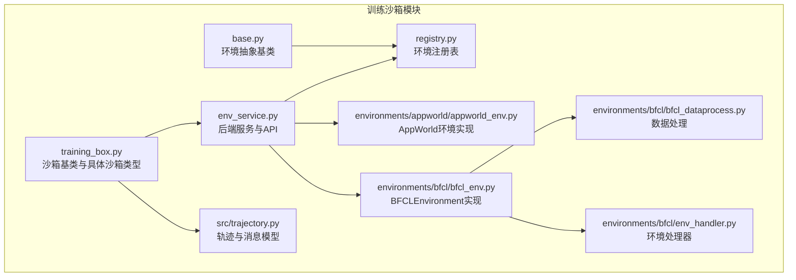
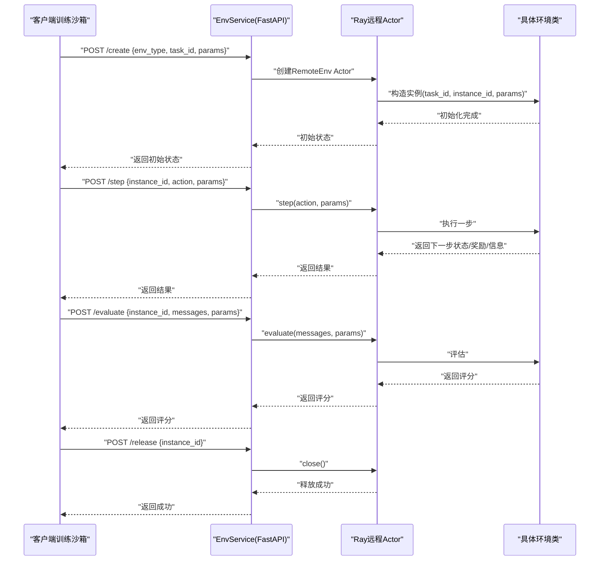
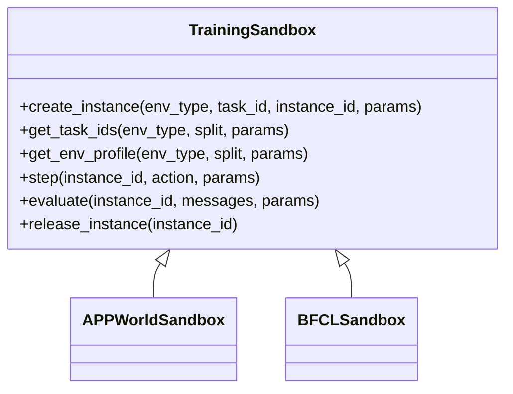
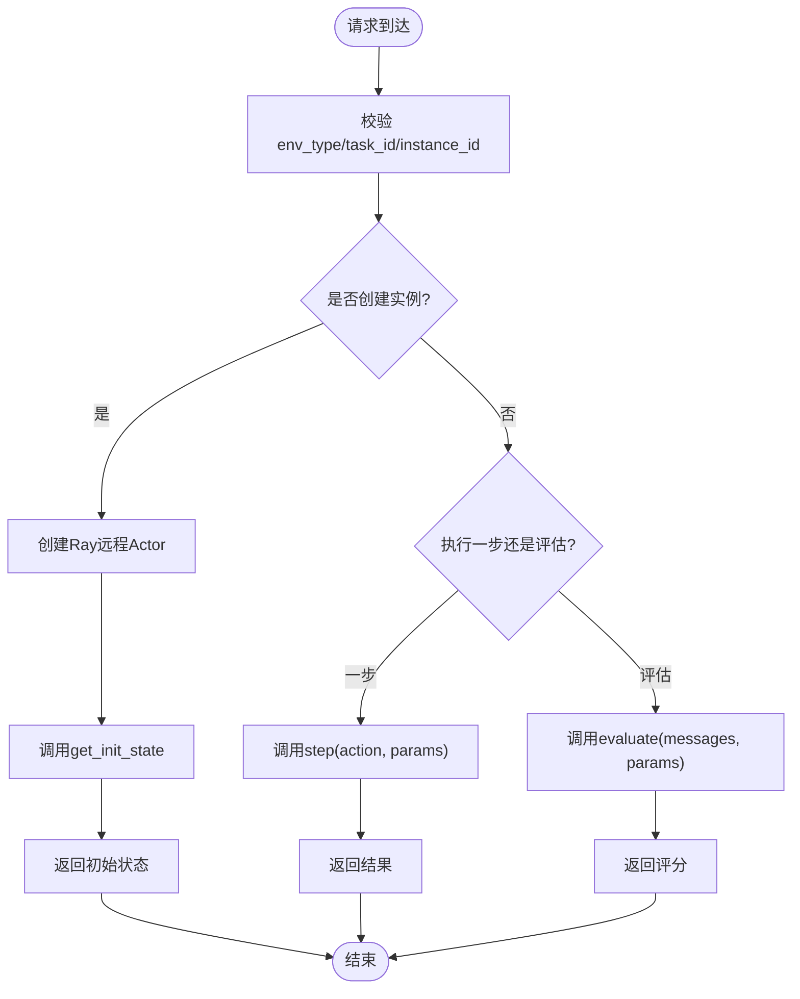
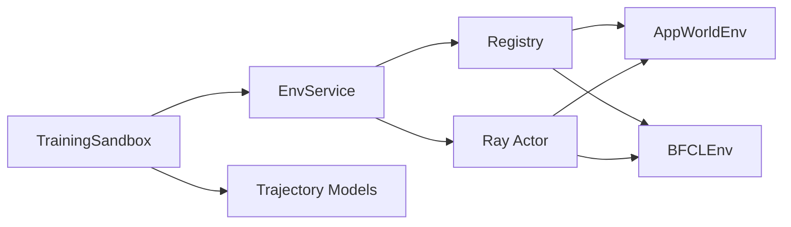

# 训练沙箱

<cite>
**本文引用的文件**
- [training_box.py](file://src/agentscope_runtime/sandbox/box/training_box/training_box.py)
- [base.py](file://src/agentscope_runtime/sandbox/box/training_box/base.py)
- [env_service.py](file://src/agentscope_runtime/sandbox/box/training_box/env_service.py)
- [registry.py](file://src/agentscope_runtime/sandbox/box/training_box/registry.py)
- [trajectory.py](file://src/agentscope_runtime/sandbox/box/training_box/src/trajectory.py)
- [appworld_env.py](file://src/agentscope_runtime/sandbox/box/training_box/environments/appworld/appworld_env.py)
- [bfcl_env.py](file://src/agentscope_runtime/sandbox/box/training_box/environments/bfcl/bfcl_env.py)
- [bfcl_dataprocess.py](file://src/agentscope_runtime/sandbox/box/training_box/environments/bfcl/bfcl_dataprocess.py)
- [env_handler.py](file://src/agentscope_runtime/sandbox/box/training_box/environments/bfcl/env_handler.py)
- [bfcl.sh](file://src/agentscope_runtime/sandbox/box/training_box/bfcl.sh)
- [appworld.sh](file://src/agentscope_runtime/sandbox/box/training_box/appworld.sh)
- [training_sandbox.md（中文）](file://cookbook/zh/sandbox/training_sandbox.md)
</cite>

## 目录
1. [简介](#简介)
2. [项目结构](#项目结构)
3. [核心组件](#核心组件)
4. [架构总览](#架构总览)
5. [详细组件分析](#详细组件分析)
6. [依赖关系分析](#依赖关系分析)
7. [性能考量](#性能考量)
8. [故障排查指南](#故障排查指南)
9. [结论](#结论)
10. [附录](#附录)

## 简介
本技术文档围绕 AgentScope Runtime 的“训练沙箱”展开，系统性阐述其强化学习环境、任务仿真与评估机制，重点覆盖以下内容：
- 训练沙箱的环境注册、任务调度与结果统计能力
- AppWorld 环境与 BFCLEnvironment 的实现与差异
- 轨迹记录、奖励函数设计与环境交互协议
- 使用场景、训练策略与性能评估方法

训练沙箱通过统一的工具调用接口对接后端服务，后端以 FastAPI 提供 REST API，内部基于 Ray 进行远程环境实例化与生命周期管理，并通过注册表动态加载具体环境类。

## 项目结构
训练沙箱相关代码主要位于 sandbox/box/training_box 目录下，包含：
- 沙箱基类与具体沙箱类型：training_box.py
- 环境抽象基类：base.py
- 后端服务与 API：env_service.py
- 环境注册表：registry.py
- 轨迹数据模型：src/trajectory.py
- 具体环境实现：
  - AppWorld 环境：environments/appworld/appworld_env.py
  - BFCLEnvironment：environments/bfcl/bfcl_env.py 及其数据处理与环境处理器

图表来源
- [training_box.py:18-295](file://src/agentscope_runtime/sandbox/box/training_box/training_box.py#L18-L295)
- [base.py:7-121](file://src/agentscope_runtime/sandbox/box/training_box/base.py#L7-L121)
- [env_service.py:123-753](file://src/agentscope_runtime/sandbox/box/training_box/env_service.py#L123-L753)
- [registry.py:11-55](file://src/agentscope_runtime/sandbox/box/training_box/registry.py#L11-L55)
- [trajectory.py:17-279](file://src/agentscope_runtime/sandbox/box/training_box/src/trajectory.py#L17-L279)
- [appworld_env.py](file://src/agentscope_runtime/sandbox/box/training_box/environments/appworld/appworld_env.py)
- [bfcl_env.py](file://src/agentscope_runtime/sandbox/box/training_box/environments/bfcl/bfcl_env.py)
- [bfcl_dataprocess.py](file://src/agentscope_runtime/sandbox/box/training_box/environments/bfcl/bfcl_dataprocess.py)
- [env_handler.py](file://src/agentscope_runtime/sandbox/box/training_box/environments/bfcl/env_handler.py)

章节来源
- [training_box.py:18-295](file://src/agentscope_runtime/sandbox/box/training_box/training_box.py#L18-L295)
- [env_service.py:123-753](file://src/agentscope_runtime/sandbox/box/training_box/env_service.py#L123-L753)

## 核心组件
- 训练沙箱基类与具体沙箱类型
  - 统一的工具调用接口封装了创建实例、获取任务列表、获取环境配置、执行一步、评估与释放实例等操作。
  - APPWorldSandbox 与 BFCLSandbox 分别注册到沙箱注册表，携带镜像 URI、运行时配置、安全等级、超时与描述信息。
- 环境抽象基类 BaseEnv
  - 定义了 get_init_state、step、evaluate、close、get_info、get_query_list 等抽象方法，作为所有具体环境的契约。
- 后端服务 EnvService
  - 基于 FastAPI 提供 /create、/step、/evaluate、/get_info、/release、/get_env_profile 等 API。
  - 使用 Ray 远程 Actor 承载具体环境实例，支持按需创建、访问时间更新与空闲清理。
- 环境注册表 Registry
  - 动态注册与获取环境类，确保运行时可扩展。
- 轨迹与消息模型 trajectory.py
  - 定义 Reward、Role、ToolCall、Message、ActionMessage、StateMessage、ContextMessage、SummaryMessage、Sample、Trajectory 等数据结构，支撑轨迹记录与评估。

章节来源
- [training_box.py:18-295](file://src/agentscope_runtime/sandbox/box/training_box/training_box.py#L18-L295)
- [base.py:7-121](file://src/agentscope_runtime/sandbox/box/training_box/base.py#L7-L121)
- [env_service.py:123-753](file://src/agentscope_runtime/sandbox/box/training_box/env_service.py#L123-L753)
- [registry.py:11-55](file://src/agentscope_runtime/sandbox/box/training_box/registry.py#L11-L55)
- [trajectory.py:17-279](file://src/agentscope_runtime/sandbox/box/training_box/src/trajectory.py#L17-L279)

## 架构总览
训练沙箱采用“客户端-服务端-环境实例”的分层架构：
- 客户端侧：训练沙箱类通过工具调用向服务端发起请求。
- 服务端侧：EnvService 接收请求，根据 env_type 动态导入并实例化具体环境类，通过 Ray Actor 执行动作与评估。
- 环境侧：具体环境实现遵循 BaseEnv 抽象，提供状态初始化、一步执行、评估与信息查询。

图表来源
- [env_service.py:292-436](file://src/agentscope_runtime/sandbox/box/training_box/env_service.py#L292-L436)
- [training_box.py:48-203](file://src/agentscope_runtime/sandbox/box/training_box/training_box.py#L48-L203)

## 详细组件分析

### 训练沙箱类族
- TrainingSandbox：定义统一的工具调用方法，包括 create_instance、get_task_ids、get_env_profile、step、evaluate、release_instance。
- APPWorldSandbox：注册 AppWorld 环境，设置共享内存大小、安全等级与超时。
- BFCLSandbox：注册 BFCL 环境，注入 OPENAI_API_KEY、数据路径与分割 ID 路径等环境变量，设置共享内存大小与超时。

图表来源
- [training_box.py:18-295](file://src/agentscope_runtime/sandbox/box/training_box/training_box.py#L18-L295)

章节来源
- [training_box.py:18-295](file://src/agentscope_runtime/sandbox/box/training_box/training_box.py#L18-L295)

### 环境抽象基类 BaseEnv
- 规定环境生命周期与交互接口：初始化状态、一步执行、评估、信息查询、关闭与查询列表。
- 为具体环境实现提供一致的契约，便于在服务端通过反射或注册表加载。

章节来源
- [base.py:7-121](file://src/agentscope_runtime/sandbox/box/training_box/base.py#L7-L121)

### 后端服务 EnvService 与 API
- 生命周期管理：创建实例、执行一步、评估、获取信息、释放实例；支持定期清理长时间未访问的实例。
- 远程执行：通过 Ray 远程 Actor 承载具体环境类，避免阻塞主线程。
- API 接口：/healthz、/get_env_profile、/create、/step、/evaluate、/get_info、/release。
- 动态导入：支持按 env_type 动态导入 environments 下的具体环境模块并注册到 Registry。

图表来源
- [env_service.py:292-436](file://src/agentscope_runtime/sandbox/box/training_box/env_service.py#L292-L436)

章节来源
- [env_service.py:123-753](file://src/agentscope_runtime/sandbox/box/training_box/env_service.py#L123-L753)

### 环境注册表 Registry
- 注册：通过装饰器方式将具体环境类注册到名称映射中。
- 获取：按名称获取已注册的环境类，若不存在则抛出异常。
- 列表：返回当前已注册的环境名称列表。

章节来源
- [registry.py:11-55](file://src/agentscope_runtime/sandbox/box/training_box/registry.py#L11-L55)

### 轨迹与消息模型 trajectory.py
- 数据模型：Reward、Role、ToolCall、Message、ActionMessage、StateMessage、ContextMessage、SummaryMessage、Sample、Trajectory。
- 用途：用于记录训练过程中的对话、工具调用、状态变化与最终答案，支撑轨迹回放与评估。

章节来源
- [trajectory.py:17-279](file://src/agentscope_runtime/sandbox/box/training_box/src/trajectory.py#L17-L279)

### AppWorld 环境实现
- 实现位置：environments/appworld/appworld_env.py
- 特点：遵循 BaseEnv 抽象，提供初始化状态、一步执行、评估与信息查询等能力。
- 镜像与脚本：配套 Dockerfile 与启动脚本，便于容器化部署与运行。

章节来源
- [appworld_env.py](file://src/agentscope_runtime/sandbox/box/training_box/environments/appworld/appworld_env.py)
- [appworld.sh](file://src/agentscope_runtime/sandbox/box/training_box/appworld.sh)

### BFCLEnvironment 实现
- 实现位置：environments/bfcl/bfcl_env.py
- 数据处理：bfcl_dataprocess.py 负责数据预处理与划分。
- 环境处理器：env_handler.py 提供环境交互与状态管理。
- 环境注册：BFCLSandbox 在训练沙箱中注册，注入 OPENAI_API_KEY、数据路径与分割 ID 路径等环境变量。

章节来源
- [bfcl_env.py](file://src/agentscope_runtime/sandbox/box/training_box/environments/bfcl/bfcl_env.py)
- [bfcl_dataprocess.py](file://src/agentscope_runtime/sandbox/box/training_box/environments/bfcl/bfcl_dataprocess.py)
- [env_handler.py](file://src/agentscope_runtime/sandbox/box/training_box/environments/bfcl/env_handler.py)
- [bfcl.sh](file://src/agentscope_runtime/sandbox/box/training_box/bfcl.sh)

## 依赖关系分析
- 训练沙箱类依赖沙箱注册表与枚举类型，通过工具调用与后端服务交互。
- 后端服务依赖注册表与具体环境模块，通过 Ray 远程 Actor 执行环境逻辑。
- 具体环境实现依赖抽象基类，遵循统一接口。
- 轨迹模型独立，服务于上层训练流程的数据记录与统计。

图表来源
- [training_box.py:18-295](file://src/agentscope_runtime/sandbox/box/training_box/training_box.py#L18-L295)
- [env_service.py:123-753](file://src/agentscope_runtime/sandbox/box/training_box/env_service.py#L123-L753)
- [registry.py:11-55](file://src/agentscope_runtime/sandbox/box/training_box/registry.py#L11-L55)
- [trajectory.py:17-279](file://src/agentscope_runtime/sandbox/box/training_box/src/trajectory.py#L17-L279)

章节来源
- [training_box.py:18-295](file://src/agentscope_runtime/sandbox/box/training_box/training_box.py#L18-L295)
- [env_service.py:123-753](file://src/agentscope_runtime/sandbox/box/training_box/env_service.py#L123-L753)
- [registry.py:11-55](file://src/agentscope_runtime/sandbox/box/training_box/registry.py#L11-L55)
- [trajectory.py:17-279](file://src/agentscope_runtime/sandbox/box/training_box/src/trajectory.py#L17-L279)

## 性能考量
- 并发与隔离：通过 Ray 远程 Actor 将不同实例隔离在独立进程中，避免相互干扰。
- 资源限制：沙箱注册时设置共享内存大小与超时，避免资源耗尽。
- 清理策略：后台定时清理长时间未访问的实例，降低内存占用。
- I/O 与网络：FastAPI 与 uvicorn 提供高并发请求处理能力；建议在容器内合理配置网络与卷挂载。

## 故障排查指南
- 健康检查：访问 /healthz 返回 200 表示服务正常。
- 参数校验：缺少 env_type、task_id 或 instance_id 会触发 400 错误。
- 导入失败：动态导入具体环境模块失败时，服务端会打印异常堆栈，检查模块路径与依赖安装。
- 实例不存在：对不存在的 instance_id 执行 step/evaluate/get_info 会触发错误。
- 资源不足：BFCL/BFCL 环境需要充足的共享内存与 API Key，确保环境变量正确配置。

章节来源
- [env_service.py:477-714](file://src/agentscope_runtime/sandbox/box/training_box/env_service.py#L477-L714)

## 结论
训练沙箱通过统一的工具调用接口与后端服务，实现了对多种强化学习/仿真环境的标准化接入。其基于注册表与动态导入的设计具备良好的可扩展性，结合 Ray 的远程执行与定时清理机制，满足大规模训练场景下的稳定性与性能需求。轨迹与消息模型为后续的评估与复盘提供了坚实基础。

## 附录
- 使用场景
  - 多模态任务仿真与评估（如 AppWorld）
  - 代码推理与执行评测（如 BFCL）
  - 强化学习训练与策略迭代
- 训练策略
  - 使用 get_env_profile 获取任务列表，按 split 划分训练/验证/测试集
  - 通过 create_instance 创建实例，记录初始状态
  - 循环 step 执行动作，收集轨迹与奖励
  - 使用 evaluate 对实例进行评分，指导策略优化
  - 释放不再使用的实例，避免资源泄漏
- 性能评估
  - 关注实例创建与执行延迟、内存占用与超时设置
  - 通过轨迹模型统计成功率、步数分布与评分分布
  - 结合日志与健康检查接口定位问题

章节来源
- [training_sandbox.md（中文）](file://cookbook/zh/sandbox/training_sandbox.md)