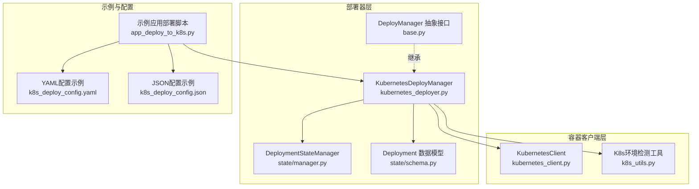
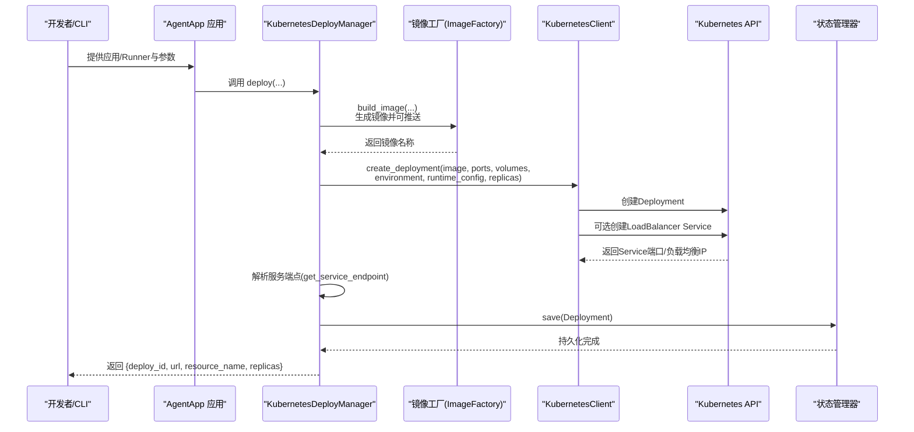
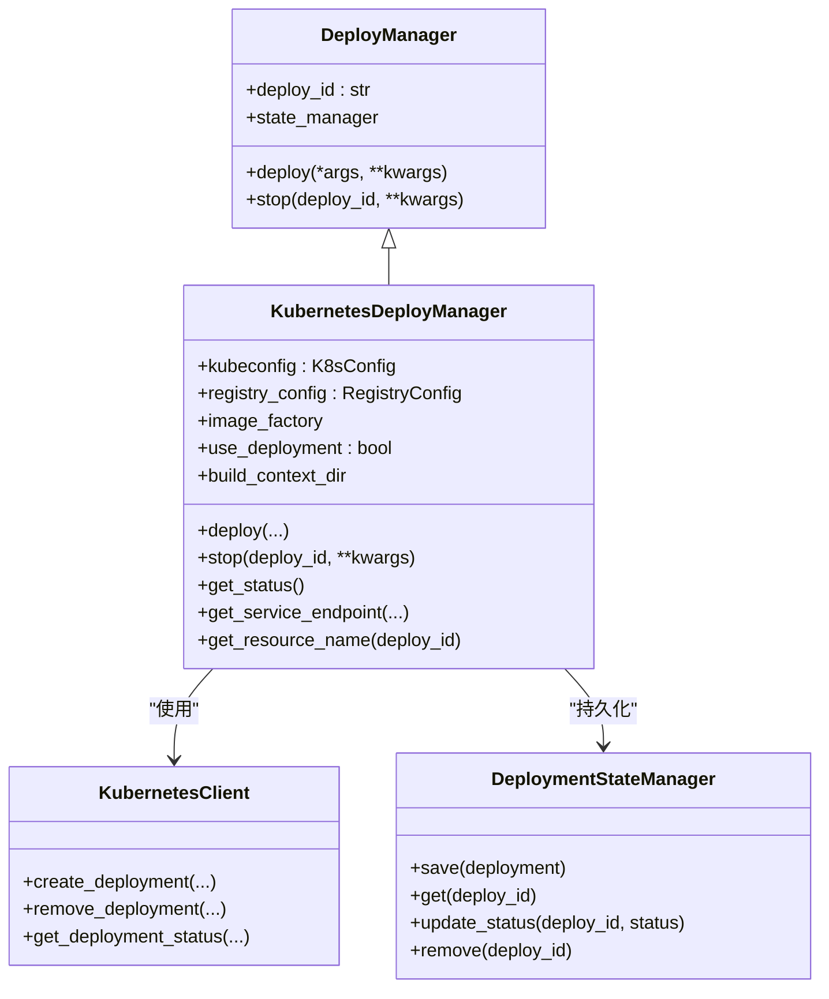
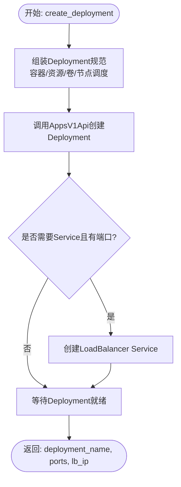
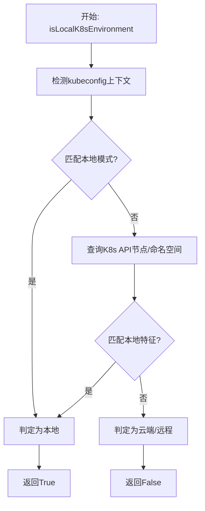
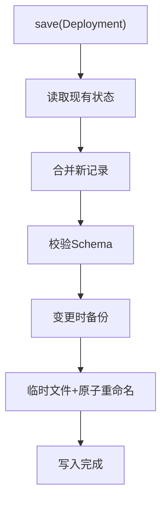
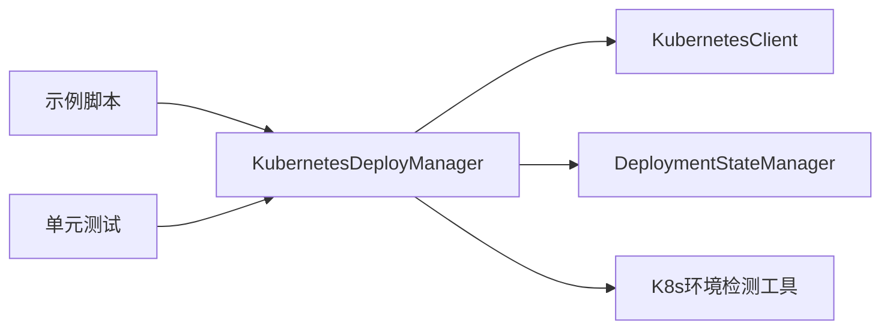
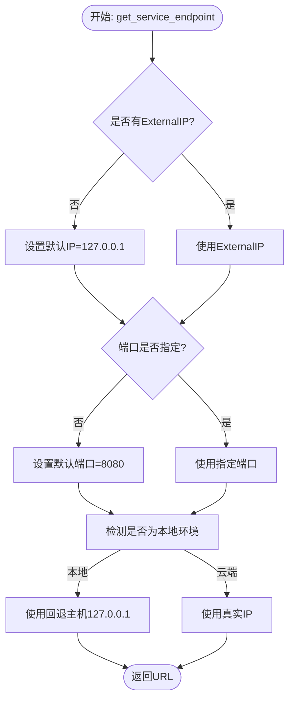

# Kubernetes部署器

<cite>
**本文引用的文件**
- [kubernetes_deployer.py](file://src/agentscope_runtime/engine/deployers/kubernetes_deployer.py)
- [kubernetes_client.py](file://src/agentscope_runtime/common/container_clients/kubernetes_client.py)
- [k8s_utils.py](file://src/agentscope_runtime/engine/deployers/utils/k8s_utils.py)
- [app_deploy_to_k8s.py](file://examples/deployments/k8s_deploy/app_deploy_to_k8s.py)
- [k8s_deploy_config.json](file://examples/deployments/k8s_deploy/k8s_deploy_config.json)
- [k8s_deploy_config.yaml](file://examples/deployments/k8s_deploy/k8s_deploy_config.yaml)
- [base.py](file://src/agentscope_runtime/engine/deployers/base.py)
- [manager.py](file://src/agentscope_runtime/engine/deployers/state/manager.py)
- [schema.py](file://src/agentscope_runtime/engine/deployers/state/schema.py)
- [test_kubernetes_deployer.py](file://tests/deploy/test_kubernetes_deployer.py)
</cite>

## 目录
1. [简介](#简介)
2. [项目结构](#项目结构)
3. [核心组件](#核心组件)
4. [架构总览](#架构总览)
5. [详细组件分析](#详细组件分析)
6. [依赖关系分析](#依赖关系分析)
7. [性能考虑](#性能考虑)
8. [故障排查指南](#故障排查指南)
9. [结论](#结论)
10. [附录](#附录)

## 简介
本技术文档面向AgentScope Runtime的Kubernetes部署器，系统性阐述其在Kubernetes原生环境中的部署与运行机制。重点包括：
- 原生Deployment与Service的创建与编排流程
- Pod生命周期管理与服务端点选择策略
- 命名空间、资源配额与滚动更新策略
- 集群配置、权限与网络策略
- 监控、日志与故障恢复最佳实践

通过代码级分析与示例配置，帮助读者理解从应用打包到服务上线的完整链路，并提供可操作的运维建议。

## 项目结构
Kubernetes部署器位于引擎的部署器子系统中，围绕“部署器-容器客户端-状态管理”三层协作展开；示例与测试覆盖了典型用法与边界条件。

**图表来源**
- [kubernetes_deployer.py:48-391](file://src/agentscope_runtime/engine/deployers/kubernetes_deployer.py#L48-L391)
- [kubernetes_client.py:19-1144](file://src/agentscope_runtime/common/container_clients/kubernetes_client.py#L19-L1144)
- [k8s_utils.py:12-242](file://src/agentscope_runtime/engine/deployers/utils/k8s_utils.py#L12-L242)
- [base.py:9-44](file://src/agentscope_runtime/engine/deployers/base.py#L9-L44)
- [manager.py:17-389](file://src/agentscope_runtime/engine/deployers/state/manager.py#L17-L389)
- [schema.py:9-97](file://src/agentscope_runtime/engine/deployers/state/schema.py#L9-L97)
- [app_deploy_to_k8s.py:124-374](file://examples/deployments/k8s_deploy/app_deploy_to_k8s.py#L124-L374)
- [k8s_deploy_config.yaml:1-53](file://examples/deployments/k8s_deploy/k8s_deploy_config.yaml#L1-L53)
- [k8s_deploy_config.json:1-40](file://examples/deployments/k8s_deploy/k8s_deploy_config.json#L1-L40)

**章节来源**
- [kubernetes_deployer.py:48-391](file://src/agentscope_runtime/engine/deployers/kubernetes_deployer.py#L48-L391)
- [kubernetes_client.py:19-1144](file://src/agentscope_runtime/common/container_clients/kubernetes_client.py#L19-L1144)
- [k8s_utils.py:12-242](file://src/agentscope_runtime/engine/deployers/utils/k8s_utils.py#L12-L242)
- [base.py:9-44](file://src/agentscope_runtime/engine/deployers/base.py#L9-L44)
- [manager.py:17-389](file://src/agentscope_runtime/engine/deployers/state/manager.py#L17-L389)
- [schema.py:9-97](file://src/agentscope_runtime/engine/deployers/state/schema.py#L9-L97)
- [app_deploy_to_k8s.py:124-374](file://examples/deployments/k8s_deploy/app_deploy_to_k8s.py#L124-L374)
- [k8s_deploy_config.yaml:1-53](file://examples/deployments/k8s_deploy/k8s_deploy_config.yaml#L1-L53)
- [k8s_deploy_config.json:1-40](file://examples/deployments/k8s_deploy/k8s_deploy_config.json#L1-L40)

## 核心组件
- KubernetesDeployManager：负责应用打包、镜像构建、Deployment与Service创建、服务端点解析、状态持久化与清理回收。
- KubernetesClient：封装Kubernetes API调用，统一创建Deployment、Service、查询状态、等待就绪等能力。
- K8s环境检测工具：自动识别本地/云端集群，决定服务端点回退策略（如Minikube/Kind使用127.0.0.1）。
- 状态管理：以本地JSON文件记录部署元数据，支持备份、校验、迁移与增量写入，保障跨进程/重启一致性。
- 示例与配置：提供完整的部署流程演示与YAML/JSON配置模板，便于快速上手。

**章节来源**
- [kubernetes_deployer.py:48-391](file://src/agentscope_runtime/engine/deployers/kubernetes_deployer.py#L48-L391)
- [kubernetes_client.py:19-1144](file://src/agentscope_runtime/common/container_clients/kubernetes_client.py#L19-L1144)
- [k8s_utils.py:12-242](file://src/agentscope_runtime/engine/deployers/utils/k8s_utils.py#L12-L242)
- [manager.py:17-389](file://src/agentscope_runtime/engine/deployers/state/manager.py#L17-L389)
- [schema.py:9-97](file://src/agentscope_runtime/engine/deployers/state/schema.py#L9-L97)
- [app_deploy_to_k8s.py:124-374](file://examples/deployments/k8s_deploy/app_deploy_to_k8s.py#L124-L374)

## 架构总览
下图展示从应用到Kubernetes的端到端部署流程，涵盖镜像构建、Deployment与Service创建、端点解析与状态落盘。

**图表来源**
- [kubernetes_deployer.py:126-302](file://src/agentscope_runtime/engine/deployers/kubernetes_deployer.py#L126-L302)
- [kubernetes_client.py:872-994](file://src/agentscope_runtime/common/container_clients/kubernetes_client.py#L872-L994)
- [kubernetes_client.py:1048-1091](file://src/agentscope_runtime/common/container_clients/kubernetes_client.py#L1048-L1091)
- [manager.py:232-242](file://src/agentscope_runtime/engine/deployers/state/manager.py#L232-L242)

**章节来源**
- [kubernetes_deployer.py:126-302](file://src/agentscope_runtime/engine/deployers/kubernetes_deployer.py#L126-L302)
- [kubernetes_client.py:872-994](file://src/agentscope_runtime/common/container_clients/kubernetes_client.py#L872-L994)
- [kubernetes_client.py:1048-1091](file://src/agentscope_runtime/common/container_clients/kubernetes_client.py#L1048-L1091)
- [manager.py:232-242](file://src/agentscope_runtime/engine/deployers/state/manager.py#L232-L242)

## 详细组件分析

### KubernetesDeployManager（部署器）
职责与关键点：
- 接收应用或Runner，结合协议适配器、自定义端点、依赖包与基础镜像，驱动镜像工厂构建镜像。
- 通过KubernetesClient创建Deployment与可选的LoadBalancer Service，等待就绪后解析服务端点。
- 将部署元数据保存至状态管理器，便于后续查询与停止。
- 支持按部署ID停止对应Deployment及其关联Service。

**图表来源**
- [base.py:9-44](file://src/agentscope_runtime/engine/deployers/base.py#L9-L44)
- [kubernetes_deployer.py:48-391](file://src/agentscope_runtime/engine/deployers/kubernetes_deployer.py#L48-L391)
- [kubernetes_client.py:19-1144](file://src/agentscope_runtime/common/container_clients/kubernetes_client.py#L19-L1144)
- [manager.py:17-389](file://src/agentscope_runtime/engine/deployers/state/manager.py#L17-L389)

**章节来源**
- [kubernetes_deployer.py:48-391](file://src/agentscope_runtime/engine/deployers/kubernetes_deployer.py#L48-L391)
- [base.py:9-44](file://src/agentscope_runtime/engine/deployers/base.py#L9-L44)
- [manager.py:17-389](file://src/agentscope_runtime/engine/deployers/state/manager.py#L17-L389)

### KubernetesClient（容器客户端）
职责与关键点：
- 初始化K8s客户端，支持in-cluster与kubeconfig两种方式，自动探测本地集群类型。
- 创建Deployment：组装容器规格、资源请求/限制、卷挂载、节点选择与容忍度、镜像拉取密钥等。
- 创建LoadBalancer Service：根据暴露端口列表生成多端口Service，等待外部IP可用。
- 等待Deployment就绪、获取状态、删除Deployment及关联Service，支持前台级联删除。
- 提供Pod级别能力（创建/删除/查看/日志/等待就绪），用于兼容其他模式。

**图表来源**
- [kubernetes_client.py:872-994](file://src/agentscope_runtime/common/container_clients/kubernetes_client.py#L872-L994)
- [kubernetes_client.py:818-871](file://src/agentscope_runtime/common/container_clients/kubernetes_client.py#L818-L871)
- [kubernetes_client.py:995-1018](file://src/agentscope_runtime/common/container_clients/kubernetes_client.py#L995-L1018)

**章节来源**
- [kubernetes_client.py:19-1144](file://src/agentscope_runtime/common/container_clients/kubernetes_client.py#L19-L1144)

### K8s环境检测工具
职责与关键点：
- 多维度判断当前K8s环境是本地还是云端：检查kubeconfig上下文、集群服务器地址、API节点信息、命名空间特征等。
- 采用投票机制综合判定，若无法确定则默认视为远程环境，确保安全回退策略。
- 与服务端点解析配合，本地环境优先使用127.0.0.1回退地址。

**图表来源**
- [k8s_utils.py:12-59](file://src/agentscope_runtime/engine/deployers/utils/k8s_utils.py#L12-L59)
- [k8s_utils.py:62-242](file://src/agentscope_runtime/engine/deployers/utils/k8s_utils.py#L62-L242)

**章节来源**
- [k8s_utils.py:12-242](file://src/agentscope_runtime/engine/deployers/utils/k8s_utils.py#L12-L242)

### 状态管理（DeploymentStateManager）
职责与关键点：
- 以JSON文件持久化部署记录，提供原子写入、每日备份与30天旧备份清理。
- 支持读取、保存、更新状态、删除、列出与导入导出，具备容错与数据保护机制。
- 与部署器协同，保存/查询部署元数据，支撑状态查询与停止操作。

**图表来源**
- [manager.py:232-242](file://src/agentscope_runtime/engine/deployers/state/manager.py#L232-L242)
- [manager.py:146-231](file://src/agentscope_runtime/engine/deployers/state/manager.py#L146-L231)

**章节来源**
- [manager.py:17-389](file://src/agentscope_runtime/engine/deployers/state/manager.py#L17-L389)
- [schema.py:9-97](file://src/agentscope_runtime/engine/deployers/state/schema.py#L9-L97)

### 示例与配置
- 示例脚本展示了Registry配置、K8s连接配置、运行时资源配置（CPU/内存、镜像拉取策略）、部署参数（端口、副本数、镜像标签、依赖、环境变量、平台、健康检查等）。
- YAML/JSON配置文件提供了标准化的部署参数模板，便于CI/CD集成与批量部署。

**章节来源**
- [app_deploy_to_k8s.py:124-374](file://examples/deployments/k8s_deploy/app_deploy_to_k8s.py#L124-L374)
- [k8s_deploy_config.yaml:1-53](file://examples/deployments/k8s_deploy/k8s_deploy_config.yaml#L1-L53)
- [k8s_deploy_config.json:1-40](file://examples/deployments/k8s_deploy/k8s_deploy_config.json#L1-L40)

## 依赖关系分析
- 部署器依赖容器客户端进行K8s资源操作，依赖状态管理器进行元数据持久化。
- 容器客户端依赖官方Python SDK与K8s API交互，内部封装了Deployment、Service、Pod等资源的创建与查询。
- 环境检测工具独立于K8s API，通过上下文与节点特征判断本地/远程环境。
- 示例与测试文件验证部署器行为，覆盖镜像构建失败、K8s部署失败、停止不存在的部署等边界场景。

**图表来源**
- [kubernetes_deployer.py:48-391](file://src/agentscope_runtime/engine/deployers/kubernetes_deployer.py#L48-L391)
- [kubernetes_client.py:19-1144](file://src/agentscope_runtime/common/container_clients/kubernetes_client.py#L19-L1144)
- [manager.py:17-389](file://src/agentscope_runtime/engine/deployers/state/manager.py#L17-L389)
- [k8s_utils.py:12-242](file://src/agentscope_runtime/engine/deployers/utils/k8s_utils.py#L12-L242)
- [app_deploy_to_k8s.py:124-374](file://examples/deployments/k8s_deploy/app_deploy_to_k8s.py#L124-L374)
- [test_kubernetes_deployer.py:1-441](file://tests/deploy/test_kubernetes_deployer.py#L1-L441)

**章节来源**
- [kubernetes_deployer.py:48-391](file://src/agentscope_runtime/engine/deployers/kubernetes_deployer.py#L48-L391)
- [kubernetes_client.py:19-1144](file://src/agentscope_runtime/common/container_clients/kubernetes_client.py#L19-L1144)
- [manager.py:17-389](file://src/agentscope_runtime/engine/deployers/state/manager.py#L17-L389)
- [k8s_utils.py:12-242](file://src/agentscope_runtime/engine/deployers/utils/k8s_utils.py#L12-L242)
- [app_deploy_to_k8s.py:124-374](file://examples/deployments/k8s_deploy/app_deploy_to_k8s.py#L124-L374)
- [test_kubernetes_deployer.py:1-441](file://tests/deploy/test_kubernetes_deployer.py#L1-L441)

## 性能考虑
- 资源配额与QoS：通过runtime_config设置requests/limits，合理分配CPU与内存，避免抢占与OOM。
- 镜像拉取策略：在生产环境建议使用IfNotPresent或PullIfNotPresent，减少不必要的拉取开销。
- 副本数与滚动更新：副本数应与SLA一致；结合Deployment的滚动更新策略（如maxUnavailable/maxSurge）平衡可用性与资源消耗。
- 端点解析与网络：本地环境回退至127.0.0.1，云端使用LoadBalancer外部IP；确保Service类型与云厂商LB支持一致。
- 日志与可观测性：利用K8s原生日志采集与事件机制，结合应用侧结构化日志输出，便于定位性能瓶颈。

[本节为通用指导，无需特定文件引用]

## 故障排查指南
常见问题与处理建议：
- 镜像构建失败：检查requirements、extra_packages与基础镜像版本；确认私有仓库凭证与网络可达。
- Deployment创建失败：检查命名空间权限、ServiceAccount角色绑定、RBAC策略；核对镜像名称与拉取策略。
- Service未分配外部IP：确认云厂商LB支持与配额；等待LB就绪或切换NodePort/ClusterIP。
- 本地访问异常：确认K8s环境检测结果与端点回退逻辑；使用kubectl检查Service与Pod状态。
- 停止部署失败：确认Deployment是否存在；必要时手动清理残留资源并更新状态管理文件。

**章节来源**
- [kubernetes_deployer.py:313-377](file://src/agentscope_runtime/engine/deployers/kubernetes_deployer.py#L313-L377)
- [kubernetes_client.py:1048-1091](file://src/agentscope_runtime/common/container_clients/kubernetes_client.py#L1048-L1091)
- [test_kubernetes_deployer.py:149-206](file://tests/deploy/test_kubernetes_deployer.py#L149-L206)

## 结论
Kubernetes部署器通过清晰的分层设计与完善的错误处理，实现了从应用打包到K8s资源创建的自动化闭环。结合状态管理与环境检测工具，能够在本地与云端环境中稳定运行。建议在生产中配套完善的安全策略、资源配额与监控告警体系，以获得更高的可靠性与可维护性。

[本节为总结性内容，无需特定文件引用]

## 附录

### 关键流程：服务端点解析

**图表来源**
- [kubernetes_deployer.py:72-121](file://src/agentscope_runtime/engine/deployers/kubernetes_deployer.py#L72-L121)
- [k8s_utils.py:12-59](file://src/agentscope_runtime/engine/deployers/utils/k8s_utils.py#L12-L59)

**章节来源**
- [kubernetes_deployer.py:72-121](file://src/agentscope_runtime/engine/deployers/kubernetes_deployer.py#L72-L121)
- [k8s_utils.py:12-59](file://src/agentscope_runtime/engine/deployers/utils/k8s_utils.py#L12-L59)