# 云平台部署器

<cite>
**本文档引用的文件**
- [agentrun_deployer.py](file://src/agentscope_runtime/engine/deployers/agentrun_deployer.py)
- [fc_deployer.py](file://src/agentscope_runtime/engine/deployers/fc_deployer.py)
- [modelstudio_deployer.py](file://src/agentscope_runtime/engine/deployers/modelstudio_deployer.py)
- [pai_deployer.py](file://src/agentscope_runtime/engine/deployers/pai_deployer.py)
- [agentrun_client.py](file://src/agentscope_runtime/common/container_clients/agentrun_client.py)
- [fc_client.py](file://src/agentscope_runtime/common/container_clients/fc_client.py)
- [base.py](file://src/agentscope_runtime/engine/deployers/base.py)
- [app_deploy_to_agentrun.py](file://examples/deployments/agentrun_deploy/app_deploy_to_agentrun.py)
- [app_deploy_to_fc.py](file://examples/deployments/fc_deploy/app_deploy_to_fc.py)
- [app_deploy_to_modelstudio.py](file://examples/deployments/modelstudio_deploy/app_deploy_to_modelstudio.py)
- [deploy_config.yaml](file://examples/deployments/pai_deploy/deploy_config.yaml)
</cite>

## 目录
1. [简介](#简介)
2. [项目结构](#项目结构)
3. [核心组件](#核心组件)
4. [架构总览](#架构总览)
5. [详细组件分析](#详细组件分析)
6. [依赖关系分析](#依赖关系分析)
7. [性能考虑](#性能考虑)
8. [故障排除指南](#故障排除指南)
9. [结论](#结论)
10. [附录](#附录)

## 简介
本技术文档面向AgentScope Runtime在阿里云平台的部署器实现，重点覆盖以下云平台与服务：
- AgentRun：基于容器的智能体运行时服务，支持公网/私网网络模式、会话亲和与健康检查。
- 函数计算（Function Compute，简称FC）：基于自定义容器的无服务器计算能力，支持HTTP触发器与会话亲和。
- ModelStudio：面向大模型应用的全代码部署平台，通过临时存储租约与OSS上传完成部署。
- PAI（Platform of Artificial Intelligence）：面向AI训练与推理的一站式平台，支持LangStudio工作流与EAS部署。

文档从架构设计、组件关系、数据流、处理逻辑、集成点、错误处理与性能特征等维度进行深入分析，并提供云原生部署最佳实践与安全配置指南。

## 项目结构
AgentScope Runtime的云平台部署器位于引擎模块的deployers目录下，按平台拆分具体实现，同时提供通用基类与示例脚本用于演示部署流程。

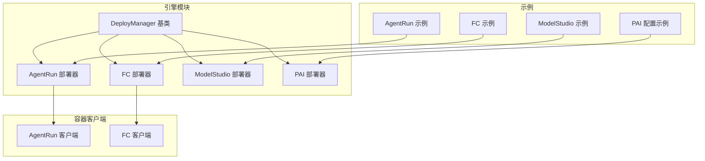

**图表来源**
- [base.py:1-44](file://src/agentscope_runtime/engine/deployers/base.py#L1-L44)
- [agentrun_deployer.py:1-120](file://src/agentscope_runtime/engine/deployers/agentrun_deployer.py#L1-L120)
- [fc_deployer.py:1-120](file://src/agentscope_runtime/engine/deployers/fc_deployer.py#L1-L120)
- [modelstudio_deployer.py:1-120](file://src/agentscope_runtime/engine/deployers/modelstudio_deployer.py#L1-L120)
- [pai_deployer.py:1-120](file://src/agentscope_runtime/engine/deployers/pai_deployer.py#L1-L120)
- [agentrun_client.py:1-120](file://src/agentscope_runtime/common/container_clients/agentrun_client.py#L1-L120)
- [fc_client.py:1-120](file://src/agentscope_runtime/common/container_clients/fc_client.py#L1-L120)

**章节来源**
- [base.py:1-44](file://src/agentscope_runtime/engine/deployers/base.py#L1-L44)
- [agentrun_deployer.py:1-120](file://src/agentscope_runtime/engine/deployers/agentrun_deployer.py#L1-L120)
- [fc_deployer.py:1-120](file://src/agentscope_runtime/engine/deployers/fc_deployer.py#L1-L120)
- [modelstudio_deployer.py:1-120](file://src/agentscope_runtime/engine/deployers/modelstudio_deployer.py#L1-L120)
- [pai_deployer.py:1-120](file://src/agentscope_runtime/engine/deployers/pai_deployer.py#L1-L120)

## 核心组件
- DeployManager 抽象基类：统一部署器接口，负责生成部署ID、管理状态持久化。
- 各平台部署器：
  - AgentRunDeployManager：封装AgentRun服务的创建、更新、端点管理与状态轮询。
  - FCDeployManager：封装FC函数的创建、更新、HTTP触发器与状态轮询。
  - ModelstudioDeployManager：封装ModelStudio的临时存储租约申请、OSS上传与全代码部署。
  - PAIDeployManager：封装PAI LangStudio工作流与EAS部署的配置合并、快照与部署流程。
- 容器客户端：
  - AgentRunClient：在沙箱环境中管理AgentRun容器生命周期与状态轮询。
  - FCClient：在沙箱环境中管理FC函数生命周期与状态轮询。
- 示例脚本：演示如何使用AgentApp或直接调用部署器进行部署。

**章节来源**
- [base.py:1-44](file://src/agentscope_runtime/engine/deployers/base.py#L1-L44)
- [agentrun_deployer.py:264-332](file://src/agentscope_runtime/engine/deployers/agentrun_deployer.py#L264-L332)
- [fc_deployer.py:246-287](file://src/agentscope_runtime/engine/deployers/fc_deployer.py#L246-L287)
- [modelstudio_deployer.py:544-565](file://src/agentscope_runtime/engine/deployers/modelstudio_deployer.py#L544-L565)
- [pai_deployer.py:597-720](file://src/agentscope_runtime/engine/deployers/pai_deployer.py#L597-L720)
- [agentrun_client.py:32-66](file://src/agentscope_runtime/common/container_clients/agentrun_client.py#L32-L66)
- [fc_client.py:25-53](file://src/agentscope_runtime/common/container_clients/fc_client.py#L25-L53)

## 架构总览
AgentScope Runtime的云平台部署器采用“平台适配器+SDK客户端”的分层架构：
- 平台适配器：负责打包、上传、调用平台API、状态轮询与结果保存。
- SDK客户端：封装平台SDK的初始化、请求构建与响应解析。
- 状态管理：统一使用部署状态管理器持久化部署信息，便于后续查询与停止操作。

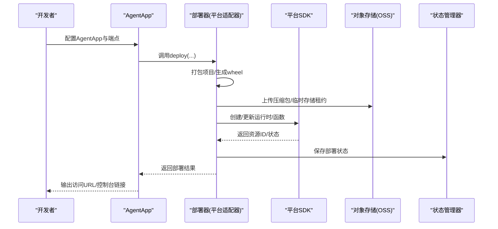

**图表来源**
- [agentrun_deployer.py:521-733](file://src/agentscope_runtime/engine/deployers/agentrun_deployer.py#L521-L733)
- [fc_deployer.py:416-585](file://src/agentscope_runtime/engine/deployers/fc_deployer.py#L416-L585)
- [modelstudio_deployer.py:727-800](file://src/agentscope_runtime/engine/deployers/modelstudio_deployer.py#L727-L800)
- [base.py:9-44](file://src/agentscope_runtime/engine/deployers/base.py#L9-L44)

## 详细组件分析

### AgentRun 部署器
AgentRun是面向智能体的容器化运行时服务，支持公网/私网网络模式、日志配置、会话并发与空闲超时等特性。

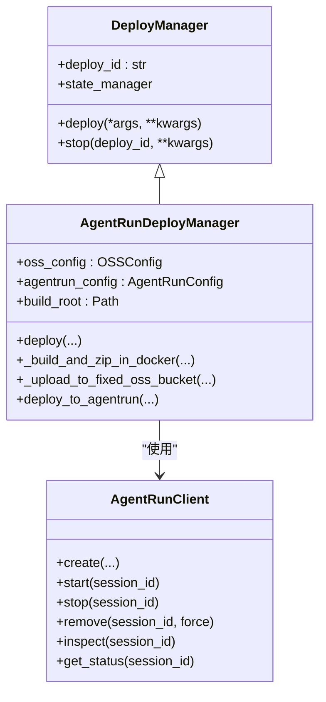

**图表来源**
- [agentrun_deployer.py:264-332](file://src/agentscope_runtime/engine/deployers/agentrun_deployer.py#L264-L332)
- [agentrun_client.py:32-66](file://src/agentscope_runtime/common/container_clients/agentrun_client.py#L32-L66)
- [base.py:9-44](file://src/agentscope_runtime/engine/deployers/base.py#L9-L44)

关键流程与特性：
- 配置加载：从环境变量读取AK/SK、区域、网络/VPC、日志、CPU/内存、会话限制与空闲超时。
- 包装与打包：生成包装项目、构建wheel、在容器内安装依赖并打包为zip。
- 上传与部署：上传到固定OSS桶或使用AgentRun提供的上传方式，调用AgentRun API创建运行时与端点。
- 状态轮询：对AgentRun运行时与端点进行轮询，直到READY/ACTIVE状态。
- 环境注入：支持将环境变量写入项目.env文件，供运行时使用。

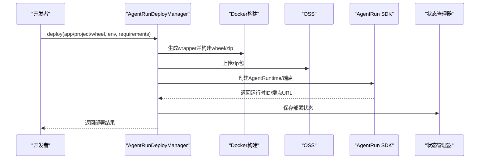

**图表来源**
- [agentrun_deployer.py:521-733](file://src/agentscope_runtime/engine/deployers/agentrun_deployer.py#L521-L733)

**章节来源**
- [agentrun_deployer.py:87-201](file://src/agentscope_runtime/engine/deployers/agentrun_deployer.py#L87-L201)
- [agentrun_deployer.py:394-458](file://src/agentscope_runtime/engine/deployers/agentrun_deployer.py#L394-L458)
- [agentrun_deployer.py:521-733](file://src/agentscope_runtime/engine/deployers/agentrun_deployer.py#L521-L733)
- [agentrun_client.py:32-66](file://src/agentscope_runtime/common/container_clients/agentrun_client.py#L32-L66)

### 函数计算（FC）部署器
FC提供基于自定义容器的无服务器能力，支持HTTP触发器、会话亲和与VPC网络配置。

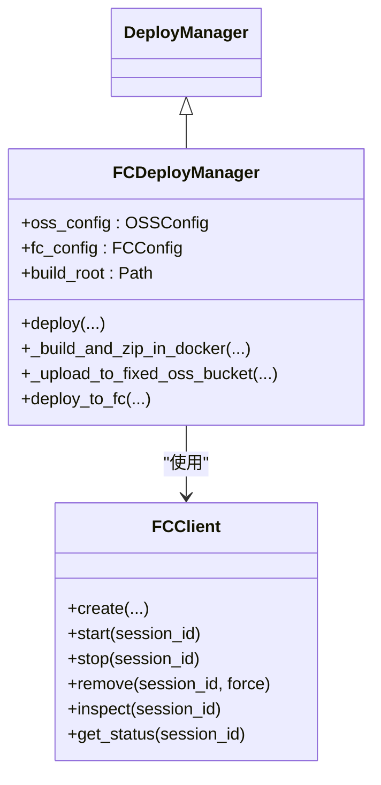

**图表来源**
- [fc_deployer.py:246-287](file://src/agentscope_runtime/engine/deployers/fc_deployer.py#L246-L287)
- [fc_client.py:25-53](file://src/agentscope_runtime/common/container_clients/fc_client.py#L25-L53)
- [base.py:9-44](file://src/agentscope_runtime/engine/deployers/base.py#L9-L44)

关键流程与特性：
- 配置加载：从环境变量读取AK/SK、账号ID、区域、日志/VPC、CPU/内存/Disk、会话限制与空闲超时。
- 包装与打包：与AgentRun类似，生成wrapper并构建wheel/zip。
- 上传与部署：上传到固定OSS桶，调用FC API创建/更新函数，配置自定义容器运行时与健康检查。
- 触发器管理：创建HTTP触发器，返回公网/内网URL；支持轮询函数就绪状态。
- 环境注入：支持将环境变量写入项目.env文件。

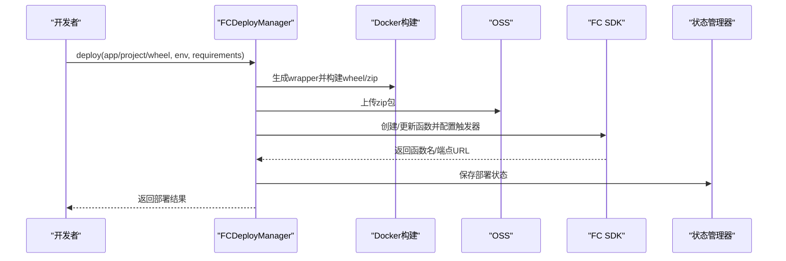

**图表来源**
- [fc_deployer.py:416-585](file://src/agentscope_runtime/engine/deployers/fc_deployer.py#L416-L585)

**章节来源**
- [fc_deployer.py:67-199](file://src/agentscope_runtime/engine/deployers/fc_deployer.py#L67-L199)
- [fc_deployer.py:289-354](file://src/agentscope_runtime/engine/deployers/fc_deployer.py#L289-L354)
- [fc_deployer.py:416-585](file://src/agentscope_runtime/engine/deployers/fc_deployer.py#L416-L585)
- [fc_client.py:25-53](file://src/agentscope_runtime/common/container_clients/fc_client.py#L25-L53)

### ModelStudio 部署器
ModelStudio提供全代码部署能力，通过临时存储租约与OSS上传完成部署。

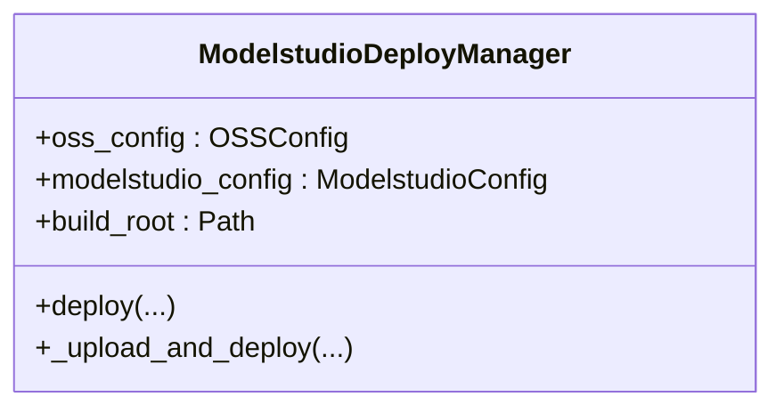

**图表来源**
- [modelstudio_deployer.py:544-565](file://src/agentscope_runtime/engine/deployers/modelstudio_deployer.py#L544-L565)

关键流程与特性：
- 配置加载：从环境变量读取ModelStudio端点、工作空间ID、AK/SK、DashScope API Key。
- 临时存储租约：向ModelStudio申请临时存储租约，获取预签名URL。
- OSS上传：使用预签名URL上传wheel包至OSS。
- 全代码部署：调用ModelStudio API触发高代码部署，返回部署标识与控制台URL。
- 环境注入：支持将环境变量写入项目.env文件。

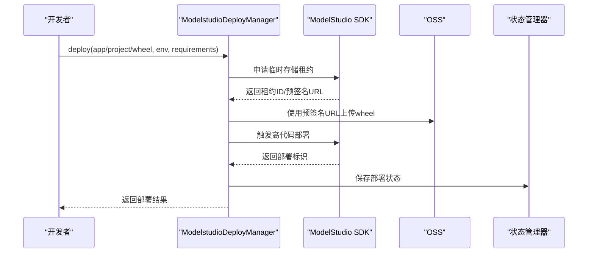

**图表来源**
- [modelstudio_deployer.py:727-800](file://src/agentscope_runtime/engine/deployers/modelstudio_deployer.py#L727-L800)

**章节来源**
- [modelstudio_deployer.py:50-131](file://src/agentscope_runtime/engine/deployers/modelstudio_deployer.py#L50-L131)
- [modelstudio_deployer.py:566-620](file://src/agentscope_runtime/engine/deployers/modelstudio_deployer.py#L566-L620)
- [modelstudio_deployer.py:727-800](file://src/agentscope_runtime/engine/deployers/modelstudio_deployer.py#L727-L800)

### PAI 部署器
PAI提供LangStudio工作流与EAS部署能力，支持多种资源类型与VPC配置。

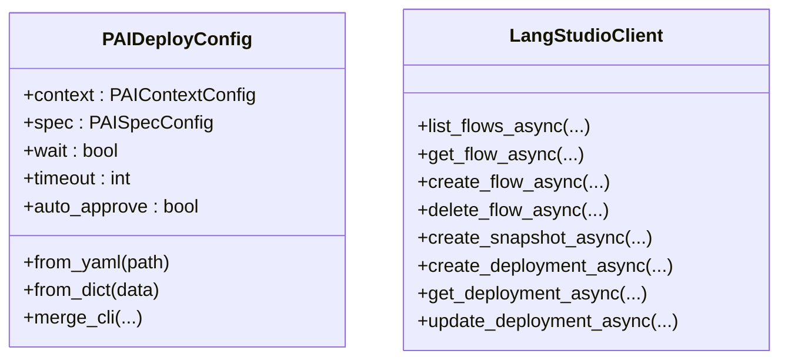

**图表来源**
- [pai_deployer.py:721-780](file://src/agentscope_runtime/engine/deployers/pai_deployer.py#L721-L780)
- [pai_deployer.py:60-120](file://src/agentscope_runtime/engine/deployers/pai_deployer.py#L60-L120)

关键流程与特性：
- 配置模型：支持嵌套YAML结构与扁平CLI参数合并，涵盖上下文（工作区、区域）、规格（代码、服务组、资源、VPC、身份、可观测性、存储、环境变量、标签）。
- LangStudio客户端：封装ROA风格API，支持工作流列表、创建、删除、快照创建与部署创建/查询/更新。
- 部署执行：根据配置创建快照并触发部署，支持等待完成与超时控制。

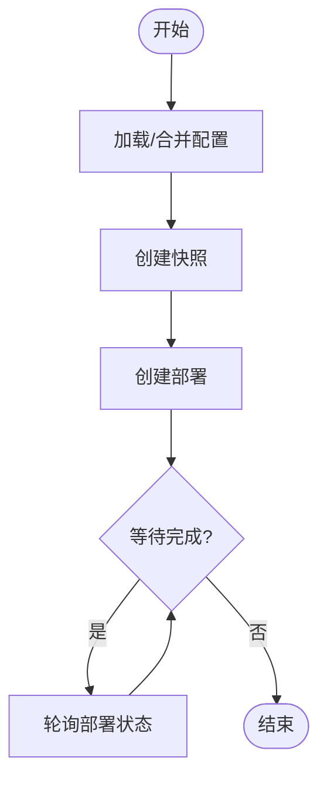

**图表来源**
- [pai_deployer.py:406-595](file://src/agentscope_runtime/engine/deployers/pai_deployer.py#L406-L595)

**章节来源**
- [pai_deployer.py:597-720](file://src/agentscope_runtime/engine/deployers/pai_deployer.py#L597-L720)
- [pai_deployer.py:406-595](file://src/agentscope_runtime/engine/deployers/pai_deployer.py#L406-L595)
- [deploy_config.yaml:1-39](file://examples/deployments/pai_deploy/deploy_config.yaml#L1-L39)

### 沙箱容器客户端
沙箱容器客户端用于在本地或沙箱环境中管理AgentRun与FC的生命周期，提供创建、启动、停止、移除、检查与状态查询。

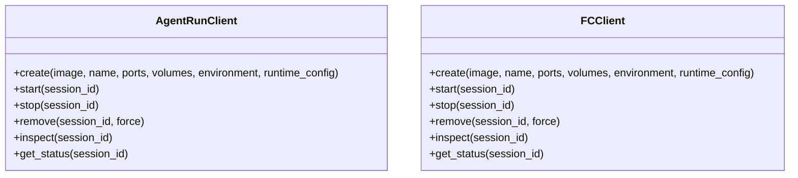

**图表来源**
- [agentrun_client.py:32-66](file://src/agentscope_runtime/common/container_clients/agentrun_client.py#L32-L66)
- [fc_client.py:25-53](file://src/agentscope_runtime/common/container_clients/fc_client.py#L25-L53)

**章节来源**
- [agentrun_client.py:32-66](file://src/agentscope_runtime/common/container_clients/agentrun_client.py#L32-L66)
- [fc_client.py:25-53](file://src/agentscope_runtime/common/container_clients/fc_client.py#L25-L53)

## 依赖关系分析
- 组件耦合：
  - 各部署器均继承自DeployManager，共享UUID生成与状态管理器实例。
  - AgentRun与FC部署器分别依赖对应SDK客户端进行状态轮询与资源管理。
  - PAI部署器依赖LangStudioClient与EAS客户端，通过配置驱动部署流程。
- 外部依赖：
  - 阿里云SDK：AgentRun、FC、ModelStudio、PAI相关SDK。
  - 对象存储：OSS用于上传wheel/zip包或临时存储租约。
  - 环境变量：AK/SK、区域、工作空间ID、API Key等。
- 可能的循环依赖：当前实现中各部署器相互独立，未见循环导入。

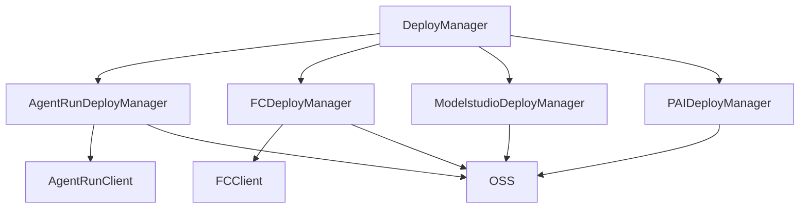

**图表来源**
- [base.py:9-44](file://src/agentscope_runtime/engine/deployers/base.py#L9-L44)
- [agentrun_deployer.py:264-332](file://src/agentscope_runtime/engine/deployers/agentrun_deployer.py#L264-L332)
- [fc_deployer.py:246-287](file://src/agentscope_runtime/engine/deployers/fc_deployer.py#L246-L287)
- [modelstudio_deployer.py:544-565](file://src/agentscope_runtime/engine/deployers/modelstudio_deployer.py#L544-L565)
- [pai_deployer.py:597-720](file://src/agentscope_runtime/engine/deployers/pai_deployer.py#L597-L720)

**章节来源**
- [base.py:9-44](file://src/agentscope_runtime/engine/deployers/base.py#L9-L44)
- [agentrun_deployer.py:264-332](file://src/agentscope_runtime/engine/deployers/agentrun_deployer.py#L264-L332)
- [fc_deployer.py:246-287](file://src/agentscope_runtime/engine/deployers/fc_deployer.py#L246-L287)
- [modelstudio_deployer.py:544-565](file://src/agentscope_runtime/engine/deployers/modelstudio_deployer.py#L544-L565)
- [pai_deployer.py:597-720](file://src/agentscope_runtime/engine/deployers/pai_deployer.py#L597-L720)

## 性能考虑
- 构建与打包：
  - 使用容器内构建wheel与zip，避免宿主机环境差异，提升可复现性。
  - 依赖安装使用离线缓存参数，减少重复下载时间。
- 上传与传输：
  - OSS直传或临时存储租约预签名URL，降低中间环节延迟。
  - 大文件建议分块上传或使用OSS多版本/生命周期策略。
- 运行时性能：
  - AgentRun/FC支持会话亲和与实例隔离模式，结合并发限制与空闲超时，平衡吞吐与成本。
  - PAI支持多种资源类型（公共池、资源组、配额），按场景选择合适规格。
- 状态轮询：
  - 合理设置轮询间隔与最大尝试次数，避免过度轮询导致API限流。
- 成本优化：
  - 选择合适的CPU/内存规格与实例数量，结合自动扩缩容策略。
  - 利用OSS低频/归档存储与生命周期规则，降低长期存储成本。
  - 在开发/测试环境使用更小规格与更短保留期。

## 故障排除指南
- 认证失败：
  - 检查AK/SK是否正确设置，确认权限策略包含相应服务授权。
  - FC与AgentRun需确保账号ID与区域配置正确。
- 权限不足：
  - FC：检查AccessKey是否具备FC服务权限；ModelStudio：确认RAM用户已分配工作空间并具备临时存储租约权限。
  - PAI：确认工作区ID与LangStudio/EAS相关权限。
- 状态异常：
  - AgentRun/FC：查看运行时/函数状态轮询结果与错误原因，必要时重试或回滚。
  - ModelStudio：检查租约申请与上传过程中的错误码与诊断建议。
- 网络问题：
  - VPC/安全组配置需允许出站访问与触发器回调。
  - 私网模式需确保路由与DNS可达性。
- 日志与监控：
  - 启用平台日志与指标采集，结合控制台定位问题。
  - 在沙箱环境中使用容器客户端的inspect/get_status方法获取详细信息。

**章节来源**
- [agentrun_client.py:32-66](file://src/agentscope_runtime/common/container_clients/agentrun_client.py#L32-L66)
- [fc_client.py:25-53](file://src/agentscope_runtime/common/container_clients/fc_client.py#L25-L53)
- [modelstudio_deployer.py:338-410](file://src/agentscope_runtime/engine/deployers/modelstudio_deployer.py#L338-L410)

## 结论
AgentScope Runtime的云平台部署器通过统一的抽象接口与平台适配器，实现了对AgentRun、FC、ModelStudio与PAI的标准化部署流程。其核心优势在于：
- 明确的配置模型与环境注入机制，简化部署参数管理。
- 完整的状态轮询与控制台链接，便于运维与排障。
- 支持多种网络与资源模式，满足不同场景的弹性与成本需求。
建议在生产环境中结合自动扩缩容、多区域部署与安全加固策略，进一步提升可用性与安全性。

## 附录
- 示例脚本：
  - AgentRun部署示例：展示通过AgentApp或直接项目目录/wheel文件进行部署。
  - FC部署示例：展示通过AgentApp或直接项目目录/wheel文件进行部署。
  - ModelStudio部署示例：展示通过AgentApp或直接项目目录/wheel文件进行部署。
  - PAI配置示例：展示YAML配置文件的典型字段与用途。
- 最佳实践：
  - 使用最小权限原则配置AK/SK与RAM角色。
  - 启用日志与指标，建立告警与审计。
  - 采用蓝绿/金丝雀发布策略，结合会话亲和与健康检查。
  - 利用多区域部署与负载均衡，提升可用性与延迟表现。

**章节来源**
- [app_deploy_to_agentrun.py:125-203](file://examples/deployments/agentrun_deploy/app_deploy_to_agentrun.py#L125-L203)
- [app_deploy_to_fc.py:125-203](file://examples/deployments/fc_deploy/app_deploy_to_fc.py#L125-L203)
- [app_deploy_to_modelstudio.py:125-203](file://examples/deployments/modelstudio_deploy/app_deploy_to_modelstudio.py#L125-L203)
- [deploy_config.yaml:1-39](file://examples/deployments/pai_deploy/deploy_config.yaml#L1-L39)