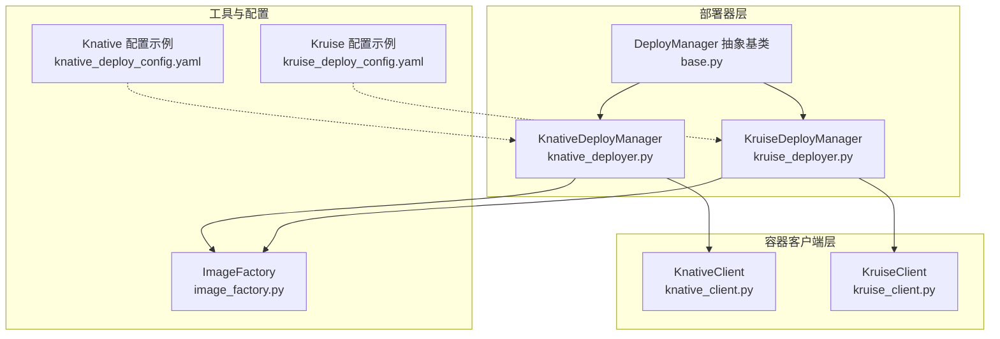
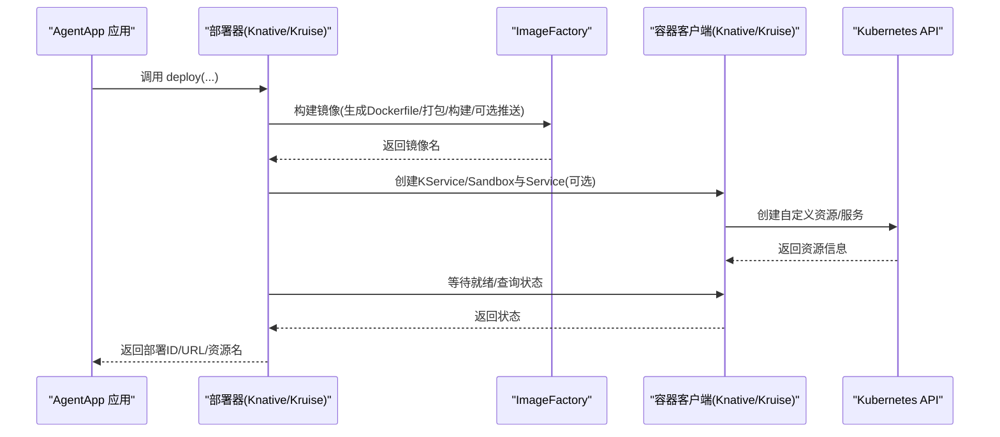
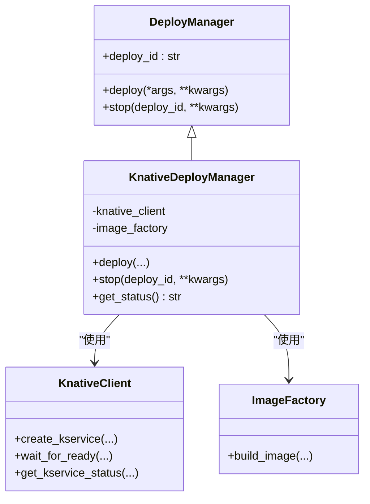
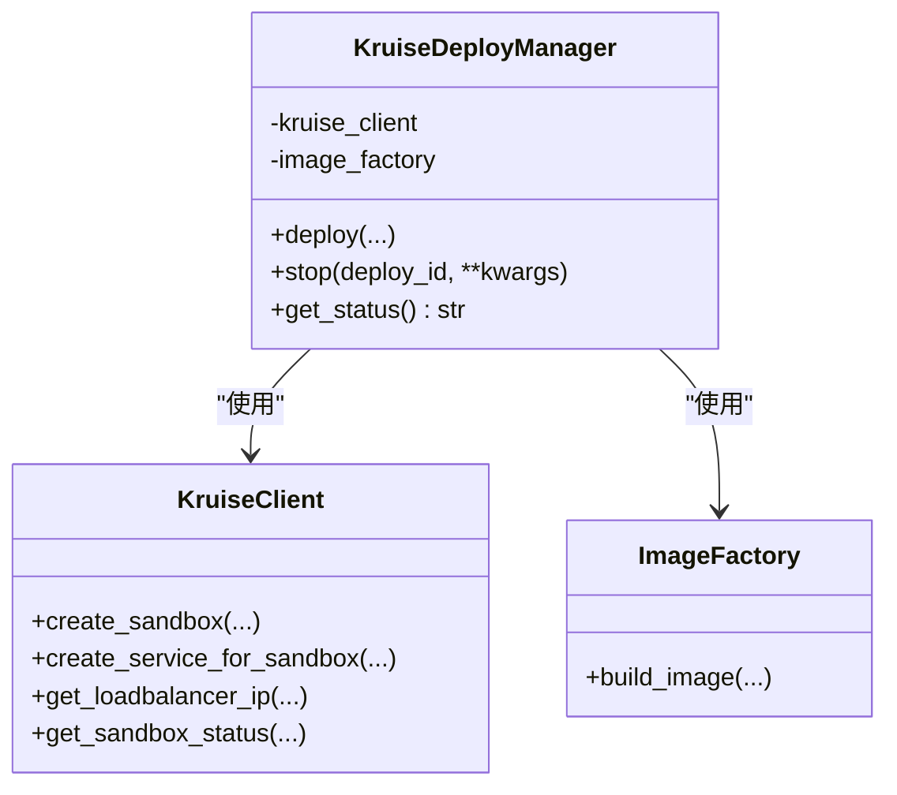
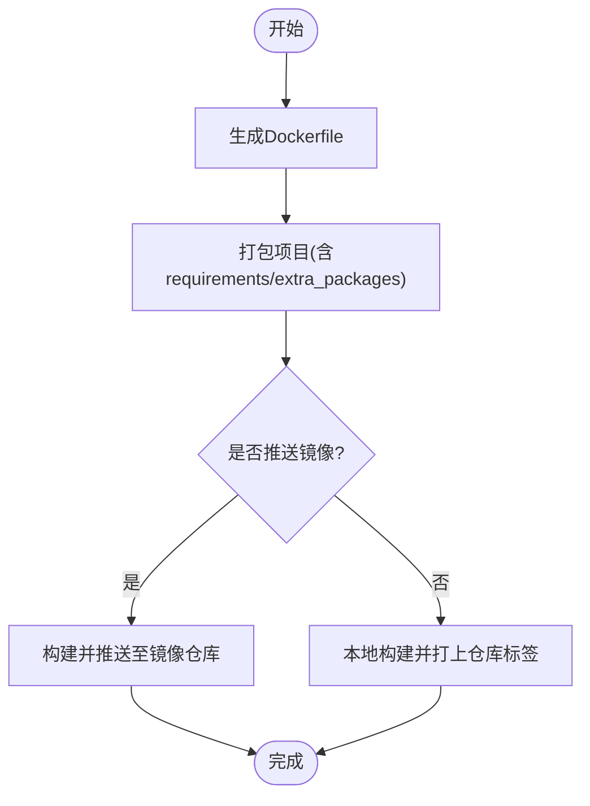
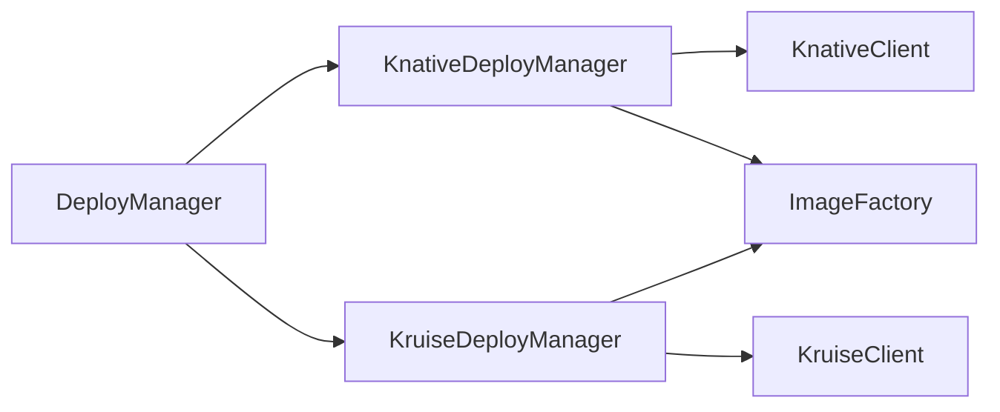

# 无服务器部署器

<cite>
**本文引用的文件**   
- [knative_deployer.py](file://src/agentscope_runtime/engine/deployers/knative_deployer.py)
- [kruise_deployer.py](file://src/agentscope_runtime/engine/deployers/kruise_deployer.py)
- [knative_client.py](file://src/agentscope_runtime/common/container_clients/knative_client.py)
- [kruise_client.py](file://src/agentscope_runtime/common/container_clients/kruise_client.py)
- [base.py](file://src/agentscope_runtime/engine/deployers/base.py)
- [image_factory.py](file://src/agentscope_runtime/engine/deployers/utils/docker_image_utils/image_factory.py)
- [knative_deploy_config.yaml](file://examples/deployments/knative_deploy/knative_deploy_config.yaml)
- [kruise_deploy_config.yaml](file://examples/deployments/kruise_deploy/kruise_deploy_config.yaml)
- [app_deploy_to_knative.py](file://examples/deployments/knative_deploy/app_deploy_to_knative.py)
- [app_deploy_to_kruise.py](file://examples/deployments/kruise_deploy/app_deploy_to_kruise.py)
- [tracing_util.py](file://src/agentscope_runtime/engine/tracing/tracing_util.py)
- [README.md（Tracing）](file://src/agentscope_runtime/engine/tracing/README.md)
</cite>

## 目录
1. [简介](#简介)
2. [项目结构](#项目结构)
3. [核心组件](#核心组件)
4. [架构总览](#架构总览)
5. [详细组件分析](#详细组件分析)
6. [依赖分析](#依赖分析)
7. [性能与成本优化](#性能与成本优化)
8. [监控与日志](#监控与日志)
9. [故障排查指南](#故障排查指南)
10. [结论](#结论)
11. [附录：最佳实践与调优清单](#附录最佳实践与调优清单)

## 简介
本文件面向AgentScope Runtime的无服务器部署器，系统性阐述在Knative与Kruise两类无服务器平台上的部署实现原理与工程化细节。重点覆盖以下主题：
- 无服务器工作负载的自动扩缩容机制与事件驱动触发
- 冷启动优化策略与容器镜像构建流程
- 资源管理、并发控制与成本优化方法
- 无服务器架构下的监控指标、日志聚合与调试技巧
- Serverless最佳实践与性能调优指南

## 项目结构
围绕“部署器”与“容器客户端”的分层设计：
- 部署器层：KnativeDeployManager、KruiseDeployManager继承统一接口DeployManager，负责编排镜像构建、资源创建与状态查询。
- 容器客户端层：KnativeClient、KruiseClient封装Kubernetes CustomObjects API与CoreV1 API，完成KService/Sandbox与Service的创建、等待就绪、删除与状态查询。
- 工具与配置：ImageFactory负责镜像打包、Dockerfile生成与构建；示例配置文件展示运行时资源配置与部署参数。

**图表来源**
- [knative_deployer.py:43-291](file://src/agentscope_runtime/engine/deployers/knative_deployer.py#L43-L291)
- [kruise_deployer.py:37-434](file://src/agentscope_runtime/engine/deployers/kruise_deployer.py#L37-L434)
- [base.py:9-44](file://src/agentscope_runtime/engine/deployers/base.py#L9-L44)
- [knative_client.py:15-468](file://src/agentscope_runtime/common/container_clients/knative_client.py#L15-L468)
- [kruise_client.py:22-623](file://src/agentscope_runtime/common/container_clients/kruise_client.py#L22-L623)
- [image_factory.py:67-400](file://src/agentscope_runtime/engine/deployers/utils/docker_image_utils/image_factory.py#L67-L400)
- [knative_deploy_config.yaml:1-56](file://examples/deployments/knative_deploy/knative_deploy_config.yaml#L1-L56)
- [kruise_deploy_config.yaml:1-59](file://examples/deployments/kruise_deploy/kruise_deploy_config.yaml#L1-L59)

**章节来源**
- [knative_deployer.py:43-291](file://src/agentscope_runtime/engine/deployers/knative_deployer.py#L43-L291)
- [kruise_deployer.py:37-434](file://src/agentscope_runtime/engine/deployers/kruise_deployer.py#L37-L434)
- [base.py:9-44](file://src/agentscope_runtime/engine/deployers/base.py#L9-L44)
- [knative_client.py:15-468](file://src/agentscope_runtime/common/container_clients/knative_client.py#L15-L468)
- [kruise_client.py:22-623](file://src/agentscope_runtime/common/container_clients/kruise_client.py#L22-L623)
- [image_factory.py:67-400](file://src/agentscope_runtime/engine/deployers/utils/docker_image_utils/image_factory.py#L67-L400)
- [knative_deploy_config.yaml:1-56](file://examples/deployments/knative_deploy/knative_deploy_config.yaml#L1-L56)
- [kruise_deploy_config.yaml:1-59](file://examples/deployments/kruise_deploy/kruise_deploy_config.yaml#L1-L59)

## 核心组件
- DeployManager抽象基类：定义统一的deploy与stop接口，并提供全局部署ID与状态管理器初始化。
- KnativeDeployManager：面向Knative Service的部署器，负责镜像构建、KService创建与状态查询。
- KruiseDeployManager：面向Kruise Sandbox的部署器，负责镜像构建、Sandbox CR与Service创建、端点选择与状态查询。
- ImageFactory：统一的镜像构建工厂，协调Dockerfile生成、项目打包与镜像构建/推送。
- KnativeClient/KruiseClient：对Kubernetes API的封装，支持自定义资源与Service的创建、等待就绪、删除与状态查询。

**章节来源**
- [base.py:9-44](file://src/agentscope_runtime/engine/deployers/base.py#L9-L44)
- [knative_deployer.py:43-291](file://src/agentscope_runtime/engine/deployers/knative_deployer.py#L43-L291)
- [kruise_deployer.py:37-434](file://src/agentscope_runtime/engine/deployers/kruise_deployer.py#L37-L434)
- [image_factory.py:67-400](file://src/agentscope_runtime/engine/deployers/utils/docker_image_utils/image_factory.py#L67-L400)
- [knative_client.py:15-468](file://src/agentscope_runtime/common/container_clients/knative_client.py#L15-L468)
- [kruise_client.py:22-623](file://src/agentscope_runtime/common/container_clients/kruise_client.py#L22-L623)

## 架构总览
下图展示了从应用到Knative/Kruise的端到端部署流程，包括镜像构建、资源创建、健康检查与状态查询。

**图表来源**
- [knative_deployer.py:71-222](file://src/agentscope_runtime/engine/deployers/knative_deployer.py#L71-L222)
- [kruise_deployer.py:138-347](file://src/agentscope_runtime/engine/deployers/kruise_deployer.py#L138-L347)
- [image_factory.py:298-384](file://src/agentscope_runtime/engine/deployers/utils/docker_image_utils/image_factory.py#L298-L384)
- [knative_client.py:114-200](file://src/agentscope_runtime/common/container_clients/knative_client.py#L114-L200)
- [kruise_client.py:84-174](file://src/agentscope_runtime/common/container_clients/kruise_client.py#L84-L174)

## 详细组件分析

### KnativeDeployManager 分析
- 职责与流程
  - 统一入口deploy：构建镜像、创建KService、等待就绪、返回部署结果。
  - 停止stop：删除KService并返回状态。
  - 状态查询get_status：通过KnativeClient读取KService状态。
- 关键实现要点
  - 使用ImageFactory进行镜像构建与可选推送。
  - 通过KnativeClient创建KService，支持端口、卷挂载、环境变量与runtime_config注入。
  - wait_for_ready用于等待KService进入Ready状态。
- 错误处理
  - 捕获镜像构建失败、KService创建失败与异常堆栈记录，保证可恢复与可观测性。

**图表来源**
- [base.py:9-44](file://src/agentscope_runtime/engine/deployers/base.py#L9-L44)
- [knative_deployer.py:43-291](file://src/agentscope_runtime/engine/deployers/knative_deployer.py#L43-L291)
- [knative_client.py:15-468](file://src/agentscope_runtime/common/container_clients/knative_client.py#L15-L468)
- [image_factory.py:67-400](file://src/agentscope_runtime/engine/deployers/utils/docker_image_utils/image_factory.py#L67-L400)

**章节来源**
- [knative_deployer.py:71-222](file://src/agentscope_runtime/engine/deployers/knative_deployer.py#L71-L222)
- [knative_client.py:114-200](file://src/agentscope_runtime/common/container_clients/knative_client.py#L114-L200)
- [knative_client.py:402-437](file://src/agentscope_runtime/common/container_clients/knative_client.py#L402-L437)

### KruiseDeployManager 分析
- 职责与流程
  - 统一入口deploy：构建镜像、创建Sandbox CR、创建Service、解析外部访问地址、持久化状态。
  - 停止stop：先删除Service，再删除Sandbox CR，并更新状态管理器。
  - 状态查询get_status：从状态管理器读取并委托KruiseClient查询Sandbox状态。
- 关键实现要点
  - 自动为Service添加app标签以匹配Sandbox选择器。
  - 支持本地/远程集群的Service端点选择逻辑。
  - 通过KruiseClient创建LoadBalancer Service并轮询External IP。
- 错误处理
  - 异常捕获与回滚提示，确保清理与可观测性。

**图表来源**
- [kruise_deployer.py:37-434](file://src/agentscope_runtime/engine/deployers/kruise_deployer.py#L37-L434)
- [kruise_client.py:22-623](file://src/agentscope_runtime/common/container_clients/kruise_client.py#L22-L623)
- [image_factory.py:67-400](file://src/agentscope_runtime/engine/deployers/utils/docker_image_utils/image_factory.py#L67-L400)

**章节来源**
- [kruise_deployer.py:138-347](file://src/agentscope_runtime/engine/deployers/kruise_deployer.py#L138-L347)
- [kruise_client.py:436-587](file://src/agentscope_runtime/common/container_clients/kruise_client.py#L436-L587)

### 镜像构建与运行时配置
- ImageFactory
  - 生成Dockerfile、打包项目、构建镜像或推送至私有仓库。
  - 支持requirements、extra_packages、base_image、端口、环境变量、平台与缓存策略。
- 运行时配置
  - Knative/Kruise均支持runtime_config注入容器资源限制、拉取策略、安全上下文、节点选择与容忍度等。
- 示例配置
  - knative_deploy_config.yaml与kruise_deploy_config.yaml展示了资源请求/限制、镜像拉取策略、环境变量、标签与部署超时等。

**图表来源**
- [image_factory.py:170-297](file://src/agentscope_runtime/engine/deployers/utils/docker_image_utils/image_factory.py#L170-L297)
- [knative_deploy_config.yaml:40-56](file://examples/deployments/knative_deploy/knative_deploy_config.yaml#L40-L56)
- [kruise_deploy_config.yaml:42-59](file://examples/deployments/kruise_deploy/kruise_deploy_config.yaml#L42-L59)

**章节来源**
- [image_factory.py:298-384](file://src/agentscope_runtime/engine/deployers/utils/docker_image_utils/image_factory.py#L298-L384)
- [knative_deploy_config.yaml:1-56](file://examples/deployments/knative_deploy/knative_deploy_config.yaml#L1-L56)
- [kruise_deploy_config.yaml:1-59](file://examples/deployments/kruise_deploy/kruise_deploy_config.yaml#L1-L59)

### 部署示例与测试
- Knative示例
  - app_deploy_to_knative.py演示了RegistryConfig、K8sConfig、KService配置与AgentApp部署流程，并提供curl命令测试健康检查与同步/异步/流式端点。
- Kruise示例
  - app_deploy_to_kruise.py演示了Kruise部署流程、Service端点解析与测试脚本。

**章节来源**
- [app_deploy_to_knative.py:123-328](file://examples/deployments/knative_deploy/app_deploy_to_knative.py#L123-L328)
- [app_deploy_to_kruise.py:119-377](file://examples/deployments/kruise_deploy/app_deploy_to_kruise.py#L119-L377)

## 依赖分析
- 组件耦合
  - DeployManager作为抽象基类，KnativeDeployManager与KruiseDeployManager分别依赖各自客户端与ImageFactory。
  - 客户端层对Kubernetes API的封装，避免部署器直接处理API细节。
- 外部依赖
  - Kubernetes Python SDK用于CustomObjects API与CoreV1 API。
  - 镜像构建依赖Docker Image Builder与Dockerfile Generator。
- 可能的循环依赖
  - 当前结构清晰，未见循环导入；状态管理器按需初始化，避免强耦合。

**图表来源**
- [base.py:9-44](file://src/agentscope_runtime/engine/deployers/base.py#L9-L44)
- [knative_deployer.py:43-291](file://src/agentscope_runtime/engine/deployers/knative_deployer.py#L43-L291)
- [kruise_deployer.py:37-434](file://src/agentscope_runtime/engine/deployers/kruise_deployer.py#L37-L434)
- [knative_client.py:15-468](file://src/agentscope_runtime/common/container_clients/knative_client.py#L15-L468)
- [kruise_client.py:22-623](file://src/agentscope_runtime/common/container_clients/kruise_client.py#L22-L623)
- [image_factory.py:67-400](file://src/agentscope_runtime/engine/deployers/utils/docker_image_utils/image_factory.py#L67-L400)

**章节来源**
- [base.py:9-44](file://src/agentscope_runtime/engine/deployers/base.py#L9-L44)
- [knative_deployer.py:43-291](file://src/agentscope_runtime/engine/deployers/knative_deployer.py#L43-L291)
- [kruise_deployer.py:37-434](file://src/agentscope_runtime/engine/deployers/kruise_deployer.py#L37-L434)

## 性能与成本优化
- 自动扩缩容与事件驱动
  - Knative基于请求量与并发进行弹性伸缩，结合最小/最大实例数策略与超时阈值，降低空闲资源占用。
  - Kruise通过Sandbox隔离与Service暴露，结合负载均衡器实现流量接入与按需扩容。
- 冷启动优化
  - 预热策略：在低峰时段保持少量实例常驻，减少首次请求延迟。
  - 镜像优化：启用构建缓存、精简基础镜像、合并多阶段构建产物。
  - 启动命令优化：合理设置端口、绑定地址与进程管理策略，缩短容器就绪时间。
- 资源管理与成本控制
  - 明确CPU/内存requests与limits，避免过度分配导致调度困难或被OOMKiller回收。
  - 使用亲和/反亲和与容忍度，将关键工作负载分散到不同节点，提升可用性并避免热点。
  - 结合镜像仓库缓存与镜像拉取策略，减少网络开销。
- 并发控制
  - Knative：通过并发目标与超时配置平衡吞吐与延迟。
  - Kruise：通过Service类型与外部IP/域名实现稳定访问，配合限流与熔断策略。

[本节为通用指导，无需特定文件引用]

## 监控与日志
- 请求追踪
  - 使用TracingUtil设置请求ID与通用属性，便于跨服务关联日志与链路。
  - README中提供了日志格式与OpenTelemetry上报的使用说明。
- 日志聚合
  - 在Kubernetes环境中，建议结合Promtail/Fluent Bit与集中式日志系统收集容器标准输出。
  - 对于Knative/Kruise，可通过kubectl logs与对应资源状态字段定位问题。
- 指标采集
  - Knative：关注KService Conditions、Ready状态与请求延迟/错误率。
  - Kruise：关注Sandbox Phase、SandboxIP与Service External IP可达性。

**章节来源**
- [tracing_util.py:23-136](file://src/agentscope_runtime/engine/tracing/tracing_util.py#L23-L136)
- [README.md（Tracing）:1-73](file://src/agentscope_runtime/engine/tracing/README.md#L1-L73)

## 故障排查指南
- 常见问题与定位
  - 镜像构建失败：检查requirements路径、extra_packages存在性与网络代理配置；查看构建日志与缓存开关。
  - KService/Sandbox未就绪：检查runtime_config中的资源限制、镜像拉取策略与Secret配置；确认集群RBAC权限。
  - Service不可达：核对Service端口映射、Selector标签与LoadBalancer外部IP；区分本地/远程集群的端点选择逻辑。
- 排查步骤
  - 使用get_status获取当前状态与条件信息。
  - 通过kubectl describe查看资源详情与事件。
  - 使用示例脚本提供的curl命令验证健康检查与端点行为。

**章节来源**
- [knative_deployer.py:282-291](file://src/agentscope_runtime/engine/deployers/knative_deployer.py#L282-L291)
- [kruise_deployer.py:421-434](file://src/agentscope_runtime/engine/deployers/kruise_deployer.py#L421-L434)
- [knative_client.py:439-468](file://src/agentscope_runtime/common/container_clients/knative_client.py#L439-L468)
- [kruise_client.py:589-623](file://src/agentscope_runtime/common/container_clients/kruise_client.py#L589-L623)

## 结论
本文档系统梳理了AgentScope Runtime在Knative与Kruise平台上的无服务器部署实现，覆盖从镜像构建、资源编排到状态管理与可观测性的全链路。通过合理的资源配额、冷启动优化与监控体系，可在保证性能的同时有效控制成本，并快速定位与解决问题。

[本节为总结，无需特定文件引用]

## 附录：最佳实践与调优清单
- 部署前准备
  - 明确命名空间与kubeconfig；准备镜像仓库凭证与网络代理。
  - 在配置文件中设置合理的资源请求/限制与镜像拉取策略。
- 镜像与构建
  - 启用构建缓存；精简requirements与extra_packages；使用多阶段构建减小体积。
  - 测试本地构建与推送流程，确保镜像可被集群拉取。
- 运行时与扩缩容
  - 为Knative设置合适的并发目标与超时；为Kruise配置Service类型与外部IP。
  - 使用亲和/反亲和与容忍度分散负载，避免单点过载。
- 监控与日志
  - 开启Tracing与日志上报；建立统一的告警规则与根因分析流程。
  - 定期复盘延迟与错误率，迭代资源与扩缩容策略。

[本节为通用指导，无需特定文件引用]