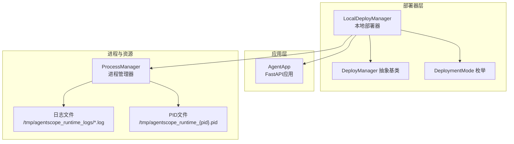
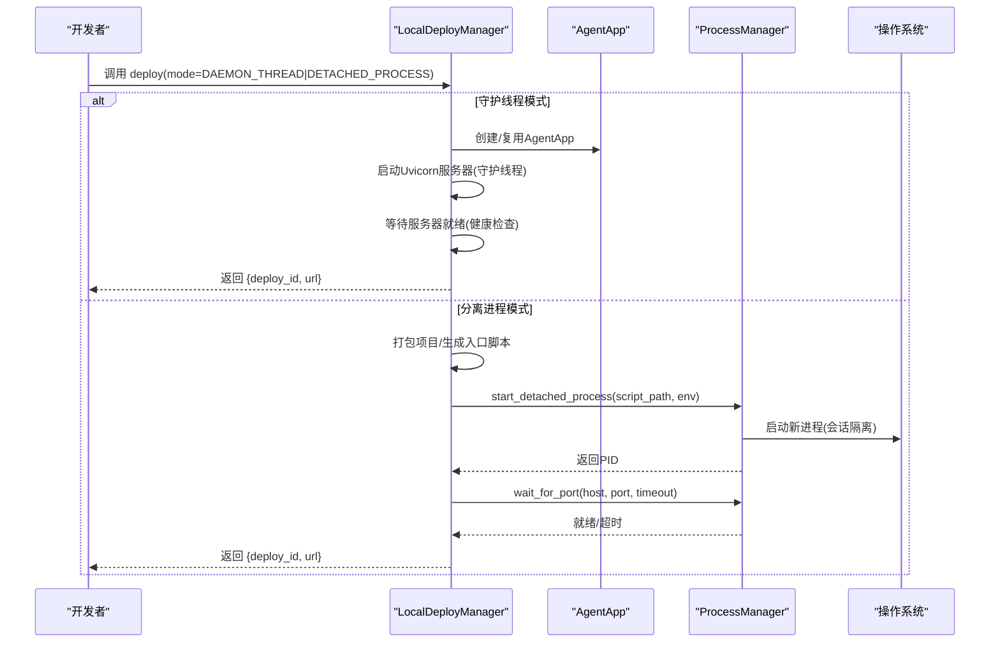
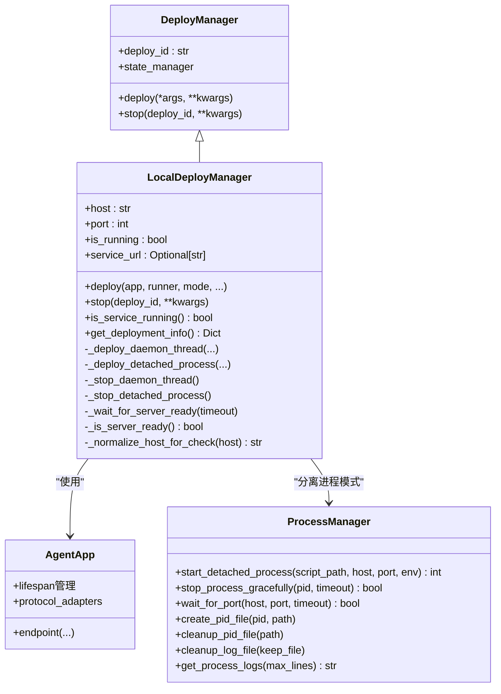
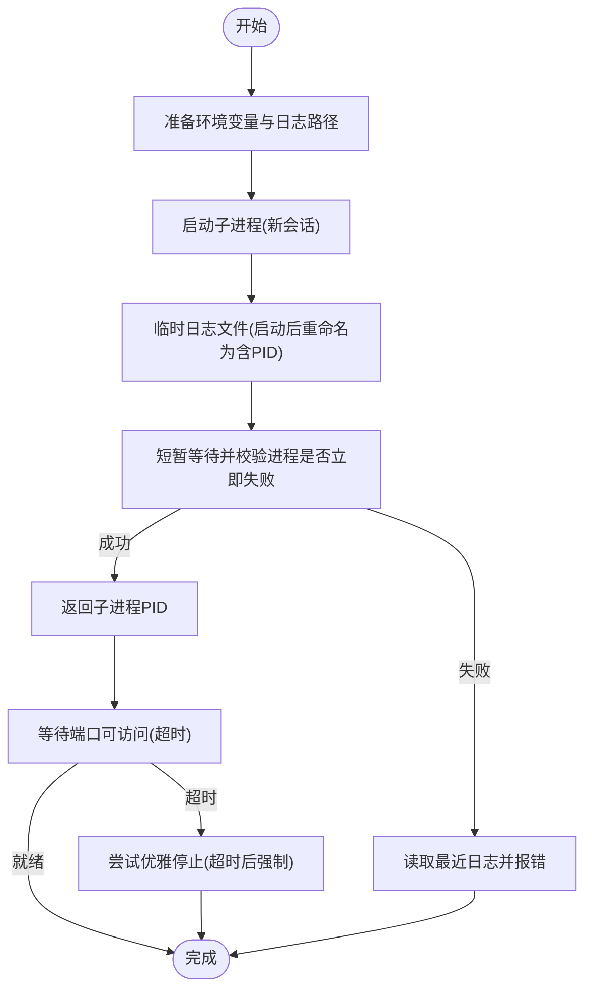
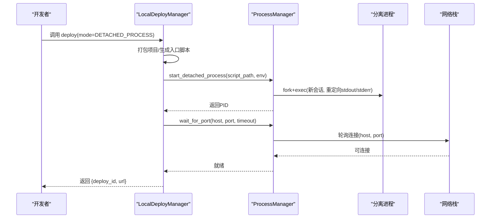
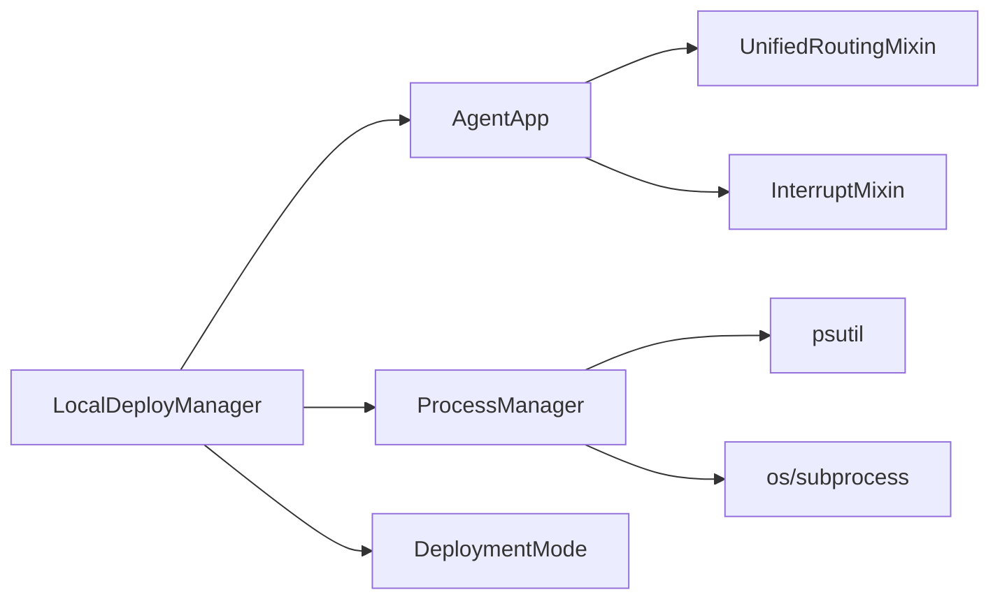

# 本地部署器

<cite>
**本文引用的文件**   
- [local_deployer.py](file://src/agentscope_runtime/engine/deployers/local_deployer.py)
- [process_manager.py](file://src/agentscope_runtime/engine/deployers/utils/service_utils/process_manager.py)
- [deployment_modes.py](file://src/agentscope_runtime/engine/deployers/utils/deployment_modes.py)
- [base.py](file://src/agentscope_runtime/engine/deployers/base.py)
- [agent_app.py](file://src/agentscope_runtime/engine/app/agent_app.py)
- [local_deploy_config.yaml](file://examples/deployments/local_deploy_config.yaml)
- [daemon_local_deploy/README.md](file://examples/deployments/daemon_local_deploy/README.md)
- [detached_local_deploy/README.md](file://examples/deployments/detached_local_deploy/README.md)
- [test_local_deployer.py](file://tests/deploy/test_local_deployer.py)
</cite>

## 目录
1. [简介](#简介)
2. [项目结构](#项目结构)
3. [核心组件](#核心组件)
4. [架构总览](#架构总览)
5. [详细组件分析](#详细组件分析)
6. [依赖分析](#依赖分析)
7. [性能考虑](#性能考虑)
8. [故障排查指南](#故障排查指南)
9. [结论](#结论)
10. [附录](#附录)

## 简介
本文件面向AgentScope Runtime的本地部署器（LocalDeployManager），系统性阐述其在本地环境中的实现原理与运行机制，包括：
- 进程管理与资源控制：守护线程模式与分离进程模式的差异与选择
- 容器化思维下的“本地容器”抽象：通过打包与入口脚本模拟容器化运行
- 进程监控与健康检查：端口探测、日志采集与超时控制
- 资源清理策略：PID文件、日志文件与进程句柄的清理
- 配置选项与环境变量：主机绑定、端口、环境注入与项目级打包
- 开发与调试：端点测试、日志定位与常见问题
- 性能优化与最佳实践：并发端点、流式响应与后台任务集成

## 项目结构
本地部署器位于引擎的部署器模块中，配合统一的FastAPI应用框架（AgentApp）与进程管理工具（ProcessManager）工作。关键文件与职责如下：
- 本地部署器：负责选择部署模式、启动服务、健康检查与停止流程
- 进程管理器：负责分离进程的启动、优雅停止、端口等待、日志与PID文件管理
- 部署模式枚举：定义守护线程与分离进程两种模式
- 基类接口：统一部署器接口，支持状态管理与生命周期
- 应用框架：封装FastAPI、路由与协议适配器，作为部署目标
- 示例与配置：演示不同部署模式的使用方式与环境变量注入
- 测试：覆盖部署、停止、超时与多实例场景

图表来源
- [local_deployer.py:1-645](file://src/agentscope_runtime/engine/deployers/local_deployer.py#L1-L645)
- [process_manager.py:1-441](file://src/agentscope_runtime/engine/deployers/utils/service_utils/process_manager.py#L1-L441)
- [deployment_modes.py:1-15](file://src/agentscope_runtime/engine/deployers/utils/deployment_modes.py#L1-L15)
- [base.py:1-44](file://src/agentscope_runtime/engine/deployers/base.py#L1-L44)
- [agent_app.py:1-200](file://src/agentscope_runtime/engine/app/agent_app.py#L1-L200)

章节来源
- [local_deployer.py:1-645](file://src/agentscope_runtime/engine/deployers/local_deployer.py#L1-L645)
- [process_manager.py:1-441](file://src/agentscope_runtime/engine/deployers/utils/service_utils/process_manager.py#L1-L441)
- [deployment_modes.py:1-15](file://src/agentscope_runtime/engine/deployers/utils/deployment_modes.py#L1-L15)
- [base.py:1-44](file://src/agentscope_runtime/engine/deployers/base.py#L1-L44)
- [agent_app.py:1-200](file://src/agentscope_runtime/engine/app/agent_app.py#L1-L200)

## 核心组件
- LocalDeployManager：统一的本地部署入口，支持守护线程与分离进程两种模式；负责健康检查、状态持久化与停止流程
- ProcessManager：分离进程模式下的生命周期管理，包括进程启动、优雅停止、端口等待、日志与PID文件管理
- DeploymentMode：部署模式枚举，区分守护线程与分离进程
- DeployManager：部署器抽象基类，提供统一的部署/停止接口与状态管理
- AgentApp：统一的FastAPI应用，承载端点、协议适配器与运行时生命周期

章节来源
- [local_deployer.py:27-645](file://src/agentscope_runtime/engine/deployers/local_deployer.py#L27-L645)
- [process_manager.py:12-441](file://src/agentscope_runtime/engine/deployers/utils/service_utils/process_manager.py#L12-L441)
- [deployment_modes.py:7-15](file://src/agentscope_runtime/engine/deployers/utils/deployment_modes.py#L7-L15)
- [base.py:9-44](file://src/agentscope_runtime/engine/deployers/base.py#L9-L44)
- [agent_app.py:60-200](file://src/agentscope_runtime/engine/app/agent_app.py#L60-L200)

## 架构总览
本地部署器采用“统一应用 + 多模式执行”的架构：
- 应用层：AgentApp提供统一的FastAPI应用，内置路由、中断与协议适配器
- 执行层：LocalDeployManager根据模式选择执行路径
  - 守护线程模式：在当前进程中以守护线程方式运行Uvicorn服务器
  - 分离进程模式：打包项目、生成入口脚本、启动独立进程，并进行端口等待与健康检查
- 资源层：ProcessManager负责进程生命周期、日志与PID文件管理
- 状态层：DeployManager基类提供部署ID与状态管理，便于跨进程查询与恢复

图表来源
- [local_deployer.py:68-382](file://src/agentscope_runtime/engine/deployers/local_deployer.py#L68-L382)
- [process_manager.py:25-121](file://src/agentscope_runtime/engine/deployers/utils/service_utils/process_manager.py#L25-L121)
- [agent_app.py:124-200](file://src/agentscope_runtime/engine/app/agent_app.py#L124-L200)

## 详细组件分析

### 组件A：LocalDeployManager（本地部署器）
职责与特性：
- 模式选择：根据DeploymentMode选择守护线程或分离进程
- 守护线程模式：在当前进程中启动Uvicorn服务器，使用守护线程避免阻塞主线程
- 分离进程模式：打包项目、生成入口脚本、启动独立进程，支持远程关闭
- 健康检查：对绑定地址进行端口探测，支持0.0.0.0到127.0.0.1的规范化
- 状态管理：保存部署信息（平台、URL、配置等），支持更新状态与查询
- 停止流程：优先尝试HTTP关闭（分离进程），否则直接终止进程或停止守护线程

图表来源
- [base.py:9-44](file://src/agentscope_runtime/engine/deployers/base.py#L9-L44)
- [local_deployer.py:27-645](file://src/agentscope_runtime/engine/deployers/local_deployer.py#L27-L645)
- [agent_app.py:60-200](file://src/agentscope_runtime/engine/app/agent_app.py#L60-L200)
- [process_manager.py:12-441](file://src/agentscope_runtime/engine/deployers/utils/service_utils/process_manager.py#L12-L441)

章节来源
- [local_deployer.py:27-645](file://src/agentscope_runtime/engine/deployers/local_deployer.py#L27-L645)
- [base.py:9-44](file://src/agentscope_runtime/engine/deployers/base.py#L9-L44)

### 组件B：ProcessManager（进程管理器）
职责与特性：
- 启动分离进程：复制当前环境、重定向标准输出/错误、创建新会话、记录日志文件
- 优雅停止：发送SIGTERM，等待超时后强制SIGKILL，并关闭日志句柄
- 端口等待：轮询连接目标主机与端口，支持0.0.0.0到127.0.0.1的规范化
- 日志管理：按PID命名日志文件，支持读取最后N行日志，定期清理旧日志
- PID文件：创建/读取/删除PID文件，便于外部监控与清理
- 进程信息：查询进程状态、CPU/内存占用、命令行等

图表来源
- [process_manager.py:25-137](file://src/agentscope_runtime/engine/deployers/utils/service_utils/process_manager.py#L25-L137)
- [process_manager.py:300-336](file://src/agentscope_runtime/engine/deployers/utils/service_utils/process_manager.py#L300-L336)

章节来源
- [process_manager.py:12-441](file://src/agentscope_runtime/engine/deployers/utils/service_utils/process_manager.py#L12-L441)

### 组件C：部署模式与应用框架
- DeploymentMode：定义DAEMON_THREAD与DETACHED_PROCESS两种模式
- AgentApp：统一的FastAPI应用，支持多协议适配器、流式任务与生命周期管理

章节来源
- [deployment_modes.py:7-15](file://src/agentscope_runtime/engine/deployers/utils/deployment_modes.py#L7-L15)
- [agent_app.py:124-200](file://src/agentscope_runtime/engine/app/agent_app.py#L124-L200)

### 组件D：分离进程部署流程（序列图）

图表来源
- [local_deployer.py:260-382](file://src/agentscope_runtime/engine/deployers/local_deployer.py#L260-L382)
- [process_manager.py:25-121](file://src/agentscope_runtime/engine/deployers/utils/service_utils/process_manager.py#L25-L121)
- [process_manager.py:300-336](file://src/agentscope_runtime/engine/deployers/utils/service_utils/process_manager.py#L300-L336)

## 依赖分析
- LocalDeployManager依赖AgentApp作为应用载体，依赖ProcessManager进行分离进程管理，依赖DeploymentMode进行模式判断
- AgentApp依赖统一路由与中断混合类、协议适配器与Runner
- ProcessManager依赖psutil进行进程与网络连接查询，依赖标准库进行文件与子进程操作

图表来源
- [local_deployer.py:14-25](file://src/agentscope_runtime/engine/deployers/local_deployer.py#L14-L25)
- [agent_app.py:48-51](file://src/agentscope_runtime/engine/app/agent_app.py#L48-L51)
- [process_manager.py:9,438-441](file://src/agentscope_runtime/engine/deployers/utils/service_utils/process_manager.py#L9,L438-L441)

章节来源
- [local_deployer.py:14-25](file://src/agentscope_runtime/engine/deployers/local_deployer.py#L14-L25)
- [agent_app.py:48-51](file://src/agentscope_runtime/engine/app/agent_app.py#L48-L51)
- [process_manager.py:9,438-441](file://src/agentscope_runtime/engine/deployers/utils/service_utils/process_manager.py#L9,L438-L441)

## 性能考虑
- 并发端点与流式响应：AgentApp支持同步/异步/流式端点，适合高并发与长连接场景
- 后台任务集成：通过Broker/Backend URL启用Celery任务队列，分离耗时任务
- 进程隔离与资源控制：分离进程模式下，独立进程拥有独立内存/CPU资源，便于资源限制与回收
- 日志与I/O：分离进程模式将输出重定向至文件，减少主进程I/O压力；注意定期清理旧日志
- 端口与网络：守护线程模式绑定到指定地址，分离进程模式通过端口等待确保可用性

[本节为通用指导，不直接分析具体文件]

## 故障排查指南
常见问题与解决思路：
- 服务未就绪/超时
  - 检查绑定地址与端口是否被占用；守护线程模式下0.0.0.0需通过127.0.0.1探测
  - 查看分离进程日志文件（/tmp/agentscope_runtime_logs/），定位启动失败原因
- 进程无法停止
  - 分离进程模式：优先尝试HTTP关闭（/shutdown），若失败则使用PID文件定位进程并终止
  - 守护线程模式：直接调用停止逻辑，必要时检查线程是否正常退出
- 端口冲突
  - 使用lsof/netstat查看占用端口，更换端口或释放占用
- 环境变量与API密钥
  - 在配置文件中注入环境变量（如API密钥），确保分离进程继承正确环境
- 单元测试参考
  - 通过测试用例验证部署/停止/超时/多实例等行为，便于快速回归

章节来源
- [local_deployer.py:415-510](file://src/agentscope_runtime/engine/deployers/local_deployer.py#L415-L510)
- [process_manager.py:139-192](file://src/agentscope_runtime/engine/deployers/utils/service_utils/process_manager.py#L139-L192)
- [detached_local_deploy/README.md:180-206](file://examples/deployments/detached_local_deploy/README.md#L180-L206)
- [test_local_deployer.py:107-131](file://tests/deploy/test_local_deployer.py#L107-L131)

## 结论
LocalDeployManager通过统一的应用框架与灵活的部署模式，实现了本地环境下的高效、可控与可观测的服务部署。守护线程模式适合开发调试，分离进程模式适合生产单节点场景。结合ProcessManager的进程与日志管理能力，能够实现从启动、监控到清理的全生命周期闭环。

[本节为总结性内容，不直接分析具体文件]

## 附录

### 本地开发环境设置与调试要点
- 设置API密钥与日志级别：在配置文件中注入环境变量，分离进程将继承这些变量
- 端点测试：使用curl或SDK调用同步/异步/流式端点，验证响应类型与流式输出
- 健康检查：通过/health端点确认服务可用
- 远程关闭：分离进程模式支持HTTP关闭端点，便于自动化运维

章节来源
- [local_deploy_config.yaml:1-16](file://examples/deployments/local_deploy_config.yaml#L1-L16)
- [daemon_local_deploy/README.md:46-172](file://examples/deployments/daemon_local_deploy/README.md#L46-L172)
- [detached_local_deploy/README.md:44-137](file://examples/deployments/detached_local_deploy/README.md#L44-L137)

### 配置选项与环境变量处理
- 主机与端口：可通过构造函数参数或环境变量设置
- 环境变量注入：分离进程模式下，通过环境字典合并当前环境变量
- 项目级打包：支持传入项目目录与入口点，自动构建可运行包

章节来源
- [local_deployer.py:30-88](file://src/agentscope_runtime/engine/deployers/local_deployer.py#L30-L88)
- [local_deployer.py:388-413](file://src/agentscope_runtime/engine/deployers/local_deployer.py#L388-L413)
- [local_deploy_config.yaml:5-16](file://examples/deployments/local_deploy_config.yaml#L5-L16)

### 端口管理策略
- 守护线程模式：直接绑定到指定地址与端口，健康检查通过socket连接验证
- 分离进程模式：通过端口等待确保服务可用，支持0.0.0.0到127.0.0.1的规范化检测

章节来源
- [local_deployer.py:566-596](file://src/agentscope_runtime/engine/deployers/local_deployer.py#L566-L596)
- [process_manager.py:318-336](file://src/agentscope_runtime/engine/deployers/utils/service_utils/process_manager.py#L318-L336)

### 资源清理与PID/PID文件
- PID文件：分离进程模式下创建PID文件，便于外部监控与清理
- 日志清理：定期清理旧日志文件，保留最新日志以便排障
- 进程句柄：停止时关闭日志文件句柄，避免资源泄漏

章节来源
- [local_deployer.py:320-324](file://src/agentscope_runtime/engine/deployers/local_deployer.py#L320-L324)
- [local_deployer.py:553-565](file://src/agentscope_runtime/engine/deployers/local_deployer.py#L553-L565)
- [process_manager.py:207-224](file://src/agentscope_runtime/engine/deployers/utils/service_utils/process_manager.py#L207-L224)
- [process_manager.py:375-392](file://src/agentscope_runtime/engine/deployers/utils/service_utils/process_manager.py#L375-L392)
- [process_manager.py:393-423](file://src/agentscope_runtime/engine/deployers/utils/service_utils/process_manager.py#L393-L423)

### 性能优化建议
- 使用分离进程模式隔离资源，便于限制与回收
- 合理设置启动/停止超时，避免长时间阻塞
- 对高并发场景启用流式响应与后台任务队列
- 定期清理日志与PID文件，保持磁盘空间健康

[本节为通用指导，不直接分析具体文件]