# 部署工具集

<cite>
**本文引用的文件**
- [docker_image_builder.py](file://src/agentscope_runtime/engine/deployers/utils/docker_image_utils/docker_image_builder.py)
- [dockerfile_generator.py](file://src/agentscope_runtime/engine/deployers/utils/docker_image_utils/dockerfile_generator.py)
- [image_factory.py](file://src/agentscope_runtime/engine/deployers/utils/docker_image_utils/image_factory.py)
- [build_cache.py](file://src/agentscope_runtime/engine/deployers/utils/build_cache.py)
- [detached_app.py](file://src/agentscope_runtime/engine/deployers/utils/detached_app.py)
- [package.py](file://src/agentscope_runtime/engine/deployers/utils/package.py)
- [wheel_packager.py](file://src/agentscope_runtime/engine/deployers/utils/wheel_packager.py)
- [deployment_modes.py](file://src/agentscope_runtime/engine/deployers/utils/deployment_modes.py)
- [base.py](file://src/agentscope_runtime/engine/deployers/base.py)
- [k8s_deploy_config.yaml](file://examples/deployments/k8s_deploy/k8s_deploy_config.yaml)
- [local_deploy_config.yaml](file://examples/deployments/local_deploy/local_deploy_config.yaml)
</cite>

## 目录
1. [简介](#简介)
2. [项目结构](#项目结构)
3. [核心组件](#核心组件)
4. [架构总览](#架构总览)
5. [详细组件分析](#详细组件分析)
6. [依赖分析](#依赖分析)
7. [性能考虑](#性能考虑)
8. [故障排除指南](#故障排除指南)
9. [结论](#结论)
10. [附录](#附录)

## 简介
本文件面向AgentScope Runtime的部署工具集，系统性梳理从项目打包、Docker镜像构建与推送、到部署模式与模板生成的完整流程。重点覆盖以下方面：
- Docker镜像构建、打包与分发机制（含构建参数、平台、缓存与推送）
- 构建缓存与增量构建策略（基于内容哈希与工作区缓存）
- 模板生成与配置处理（Jinja2模板、入口点生成、运行时参数）
- 多种部署模式（守护线程、分离进程、独立打包）与适配器集成
- 使用指南、自定义扩展与常见问题排查

## 项目结构
部署工具集位于引擎模块的deployers子包中，围绕“打包-模板-镜像-缓存-部署”链路组织，关键目录与文件如下：
- docker_image_utils：Docker镜像构建与Dockerfile生成
- utils：打包、缓存、轮子打包、部署模式等通用工具
- examples/deployments：部署配置示例（K8s、本地等）

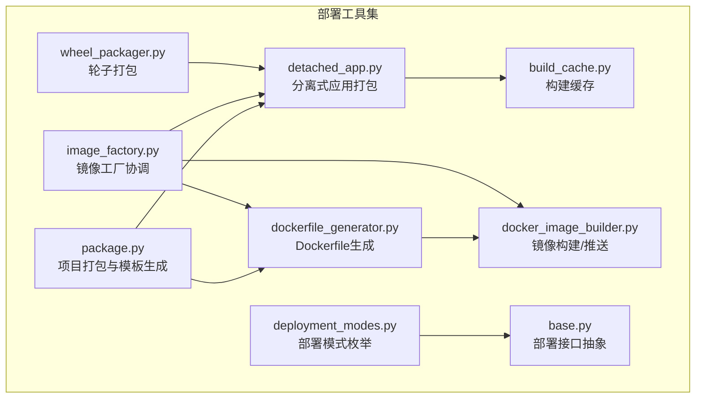

**图表来源**
- [package.py:580-748](file://src/agentscope_runtime/engine/deployers/utils/package.py#L580-L748)
- [detached_app.py:40-144](file://src/agentscope_runtime/engine/deployers/utils/detached_app.py#L40-L144)
- [build_cache.py:22-737](file://src/agentscope_runtime/engine/deployers/utils/build_cache.py#L22-L737)
- [dockerfile_generator.py:28-254](file://src/agentscope_runtime/engine/deployers/utils/docker_image_utils/dockerfile_generator.py#L28-L254)
- [docker_image_builder.py:41-451](file://src/agentscope_runtime/engine/deployers/utils/docker_image_utils/docker_image_builder.py#L41-L451)
- [image_factory.py:67-400](file://src/agentscope_runtime/engine/deployers/utils/docker_image_utils/image_factory.py#L67-L400)
- [wheel_packager.py:145-475](file://src/agentscope_runtime/engine/deployers/utils/wheel_packager.py#L145-L475)
- [deployment_modes.py:7-15](file://src/agentscope_runtime/engine/deployers/utils/deployment_modes.py#L7-L15)
- [base.py:9-44](file://src/agentscope_runtime/engine/deployers/base.py#L9-L44)

**章节来源**
- [package.py:1-748](file://src/agentscope_runtime/engine/deployers/utils/package.py#L1-L748)
- [detached_app.py:1-602](file://src/agentscope_runtime/engine/deployers/utils/detached_app.py#L1-L602)
- [build_cache.py:1-737](file://src/agentscope_runtime/engine/deployers/utils/build_cache.py#L1-L737)
- [dockerfile_generator.py:1-254](file://src/agentscope_runtime/engine/deployers/utils/docker_image_utils/dockerfile_generator.py#L1-L254)
- [docker_image_builder.py:1-451](file://src/agentscope_runtime/engine/deployers/utils/docker_image_utils/docker_image_builder.py#L1-L451)
- [image_factory.py:1-400](file://src/agentscope_runtime/engine/deployers/utils/docker_image_utils/image_factory.py#L1-L400)
- [wheel_packager.py:1-475](file://src/agentscope_runtime/engine/deployers/utils/wheel_packager.py#L1-L475)
- [deployment_modes.py:1-15](file://src/agentscope_runtime/engine/deployers/utils/deployment_modes.py#L1-L15)
- [base.py:1-44](file://src/agentscope_runtime/engine/deployers/base.py#L1-L44)

## 核心组件
- 项目打包与模板生成：支持对象式与入口点式两种部署方式，自动生成main.py模板并打包为deployment.zip
- 分离式应用打包：将打包产物解压到目标目录，注入requirements.txt与Dockerfile占位替换
- 构建缓存：以内容哈希为核心，按平台命名缓存目录，避免重复构建
- Dockerfile生成：基于模板与配置生成Dockerfile，支持平台、端口、环境变量、健康检查等
- 镜像构建与推送：封装docker build/push命令，支持静默/流式输出、标签与注册表配置
- 镜像工厂：协调打包、生成Dockerfile、构建镜像、可选推送至注册表
- 轮子打包：为特定平台（如FC）生成可部署轮子，合并用户与本地wheel依赖
- 部署模式：统一FastAPI应用的三种部署模式（守护线程、分离进程、独立打包）
- 部署接口抽象：定义统一的部署与停止接口，便于扩展不同平台

**章节来源**
- [package.py:580-748](file://src/agentscope_runtime/engine/deployers/utils/package.py#L580-L748)
- [detached_app.py:40-144](file://src/agentscope_runtime/engine/deployers/utils/detached_app.py#L40-L144)
- [build_cache.py:22-737](file://src/agentscope_runtime/engine/deployers/utils/build_cache.py#L22-L737)
- [dockerfile_generator.py:28-254](file://src/agentscope_runtime/engine/deployers/utils/docker_image_utils/dockerfile_generator.py#L28-L254)
- [docker_image_builder.py:41-451](file://src/agentscope_runtime/engine/deployers/utils/docker_image_utils/docker_image_builder.py#L41-L451)
- [image_factory.py:67-400](file://src/agentscope_runtime/engine/deployers/utils/docker_image_utils/image_factory.py#L67-L400)
- [wheel_packager.py:145-475](file://src/agentscope_runtime/engine/deployers/utils/wheel_packager.py#L145-L475)
- [deployment_modes.py:7-15](file://src/agentscope_runtime/engine/deployers/utils/deployment_modes.py#L7-L15)
- [base.py:9-44](file://src/agentscope_runtime/engine/deployers/base.py#L9-L44)

## 架构总览
下图展示从项目打包到镜像构建与推送的整体流程，以及缓存与模板生成的关键节点。

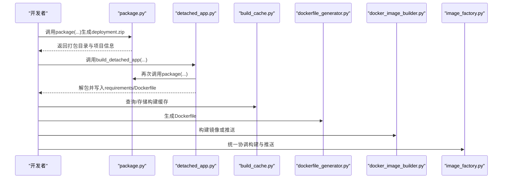

**图表来源**
- [package.py:580-748](file://src/agentscope_runtime/engine/deployers/utils/package.py#L580-L748)
- [detached_app.py:40-144](file://src/agentscope_runtime/engine/deployers/utils/detached_app.py#L40-L144)
- [build_cache.py:112-263](file://src/agentscope_runtime/engine/deployers/utils/build_cache.py#L112-L263)
- [dockerfile_generator.py:98-158](file://src/agentscope_runtime/engine/deployers/utils/docker_image_utils/dockerfile_generator.py#L98-L158)
- [docker_image_builder.py:77-194](file://src/agentscope_runtime/engine/deployers/utils/docker_image_utils/docker_image_builder.py#L77-L194)
- [image_factory.py:298-384](file://src/agentscope_runtime/engine/deployers/utils/docker_image_utils/image_factory.py#L298-L384)

## 详细组件分析

### Docker镜像构建与推送
- 功能要点
  - 构建镜像：支持指定上下文、Dockerfile路径、构建参数、平台、目标阶段、静默/非静默输出
  - 标签与推送：自动根据注册表配置生成带前缀的镜像名并执行推送
  - 信息查询与删除：支持inspect、存在性检测与移除
  - 一键构建并推送：在单步操作中完成构建与推送
- 关键配置
  - RegistryConfig：注册表URL、凭据、命名空间、拉取密钥
  - BuildConfig：禁用缓存、静默模式、构建参数、平台、目标阶段、源更新标记
- 错误处理
  - Docker可用性检查失败抛出异常
  - 构建/推送子进程错误记录标准输出/错误输出并重抛

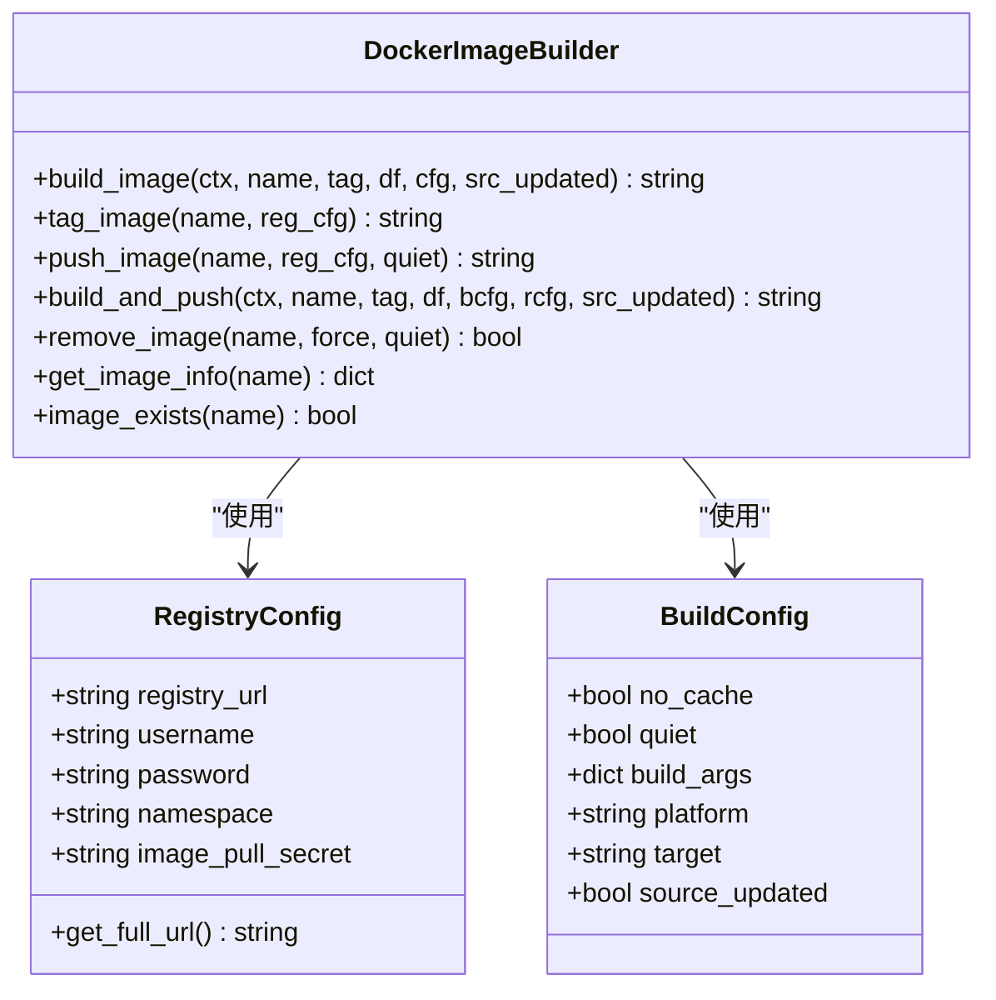

**图表来源**
- [docker_image_builder.py:14-22](file://src/agentscope_runtime/engine/deployers/utils/docker_image_utils/docker_image_builder.py#L14-L22)
- [docker_image_builder.py:30-39](file://src/agentscope_runtime/engine/deployers/utils/docker_image_utils/docker_image_builder.py#L30-L39)
- [docker_image_builder.py:41-451](file://src/agentscope_runtime/engine/deployers/utils/docker_image_utils/docker_image_builder.py#L41-L451)

**章节来源**
- [docker_image_builder.py:41-451](file://src/agentscope_runtime/engine/deployers/utils/docker_image_utils/docker_image_builder.py#L41-L451)

### Dockerfile生成器
- 功能要点
  - 基于模板生成Dockerfile，支持平台、基础镜像、工作目录、端口、用户、额外系统包、环境变量、启动命令、健康检查端点、自定义模板、PyPI镜像
  - 自动生成默认模板，支持CMD格式（JSON数组或Shell字符串）
  - 提供校验与清理能力
- 关键配置
  - DockerfileConfig：基础镜像、端口、工作目录、用户、额外系统包、环境变量、启动命令、健康检查端点、自定义模板、平台、PyPI镜像

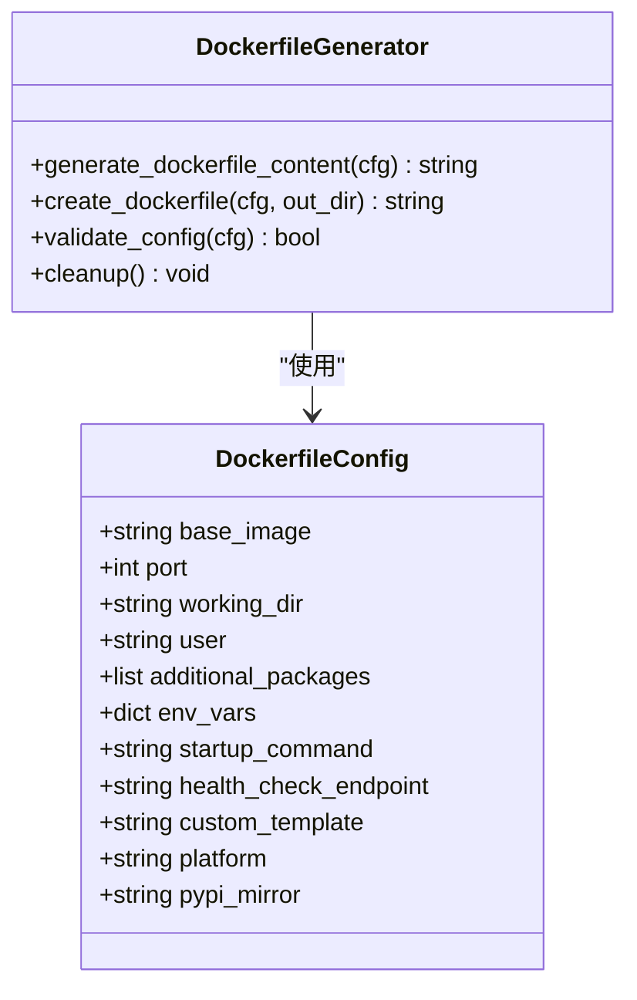

**图表来源**
- [dockerfile_generator.py:12-26](file://src/agentscope_runtime/engine/deployers/utils/docker_image_utils/dockerfile_generator.py#L12-L26)
- [dockerfile_generator.py:28-254](file://src/agentscope_runtime/engine/deployers/utils/docker_image_utils/dockerfile_generator.py#L28-L254)

**章节来源**
- [dockerfile_generator.py:28-254](file://src/agentscope_runtime/engine/deployers/utils/docker_image_utils/dockerfile_generator.py#L28-L254)

### 镜像工厂（ImageFactory）
- 功能要点
  - 协调打包、Dockerfile生成、镜像构建与可选推送
  - 自动推断镜像名称（基于内容哈希），生成容器启动命令（含主机、端口、任务处理器嵌入、额外启动参数）
  - 支持本地/注册表推送、平台与缓存控制
- 关键流程
  - 生成启动命令
  - 创建Dockerfile配置并生成Dockerfile
  - 调用分离式应用打包（detached_app）产出构建上下文
  - 构建镜像或构建并推送

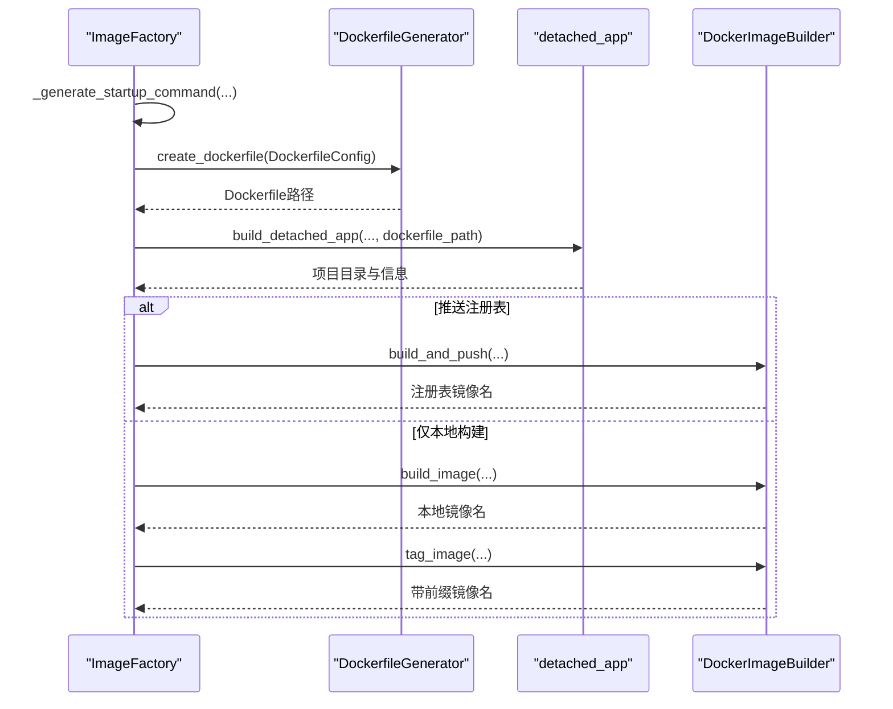

**图表来源**
- [image_factory.py:67-400](file://src/agentscope_runtime/engine/deployers/utils/docker_image_utils/image_factory.py#L67-L400)
- [dockerfile_generator.py:160-202](file://src/agentscope_runtime/engine/deployers/utils/docker_image_utils/dockerfile_generator.py#L160-L202)
- [detached_app.py:40-144](file://src/agentscope_runtime/engine/deployers/utils/detached_app.py#L40-L144)
- [docker_image_builder.py:323-367](file://src/agentscope_runtime/engine/deployers/utils/docker_image_utils/docker_image_builder.py#L323-L367)

**章节来源**
- [image_factory.py:67-400](file://src/agentscope_runtime/engine/deployers/utils/docker_image_utils/image_factory.py#L67-L400)

### 构建缓存（BuildCache）
- 功能要点
  - 工作区级缓存：以内容哈希（项目代码、入口点、requirements、运行时版本）为依据
  - 平台感知命名：生成形如“平台_时间戳_简码”的缓存目录
  - 元数据追踪：deployments.json记录缓存映射，用于验证与复用
  - 包装器缓存：针对特定平台（如FC）的轮子缓存（wrapper）
- 缓存策略
  - 目录哈希：忽略模式（如__pycache__、.git、logs等），包含文件路径、修改时间与内容
  - 运行时版本：发布版使用版本号，开发版使用源码哈希
  - 校验：检查deployment.zip或wheel文件是否存在且非空

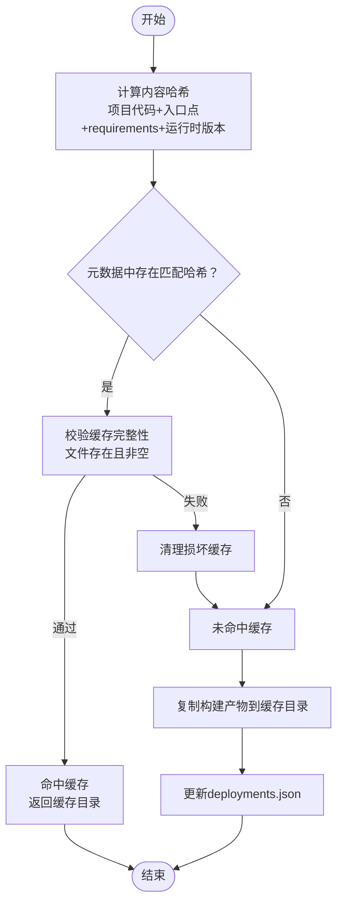

**图表来源**
- [build_cache.py:112-263](file://src/agentscope_runtime/engine/deployers/utils/build_cache.py#L112-L263)
- [build_cache.py:277-350](file://src/agentscope_runtime/engine/deployers/utils/build_cache.py#L277-L350)
- [build_cache.py:708-737](file://src/agentscope_runtime/engine/deployers/utils/build_cache.py#L708-L737)

**章节来源**
- [build_cache.py:22-737](file://src/agentscope_runtime/engine/deployers/utils/build_cache.py#L22-L737)

### 项目打包与模板生成（package.py）
- 功能要点
  - 两种部署入口：对象式（app/runner）与入口点式（文件/目录）
  - 自动生成main.py模板（app/runner两类），支持额外运行时参数
  - 打包源代码为deployment.zip，支持忽略模式
  - 平台感知的构建目录命名
- 关键流程
  - 解析入口点或提取项目目录
  - 生成main.py模板并写入临时目录
  - 打包代码zip并清理临时目录
  - 返回打包目录与项目信息

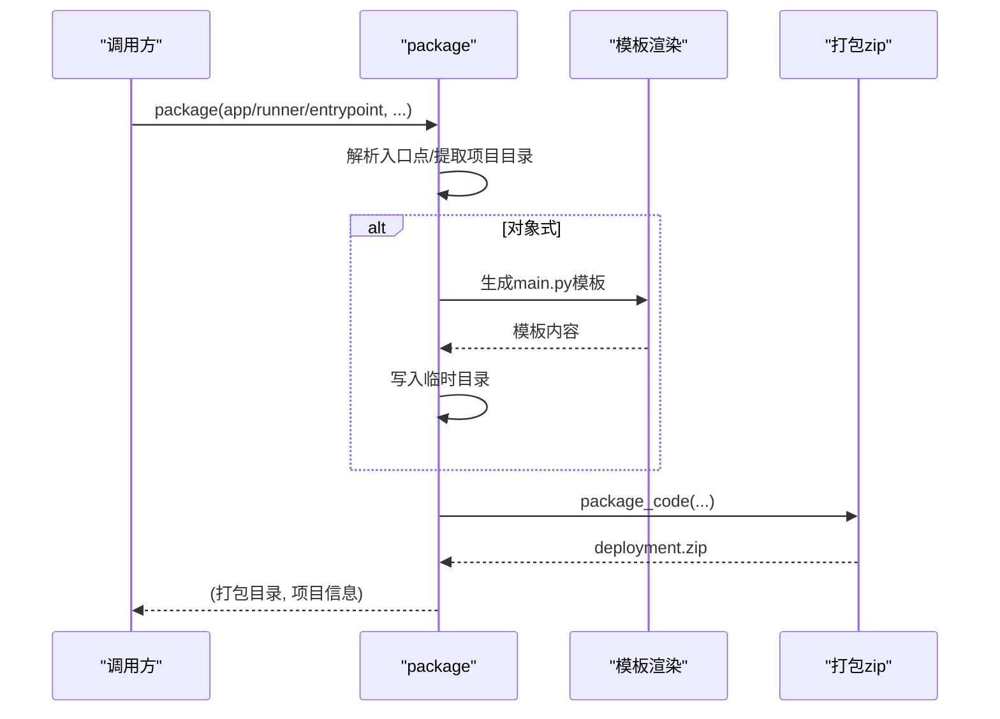

**图表来源**
- [package.py:580-748](file://src/agentscope_runtime/engine/deployers/utils/package.py#L580-L748)
- [package.py:327-434](file://src/agentscope_runtime/engine/deployers/utils/package.py#L327-L434)

**章节来源**
- [package.py:580-748](file://src/agentscope_runtime/engine/deployers/utils/package.py#L580-L748)

### 分离式应用打包（detached_app.py）
- 功能要点
  - 将deployment.zip解压到“.agentscope_runtime”子目录
  - 合并用户requirements与运行时依赖（支持本地wheel）
  - 替换Dockerfile中的默认入口点为实际入口脚本
  - 写入bundle元数据（entry_script）
- 版本与wheel逻辑
  - 发布版：使用固定版本依赖
  - 开发版：从源码构建wheel并放入wheels/目录

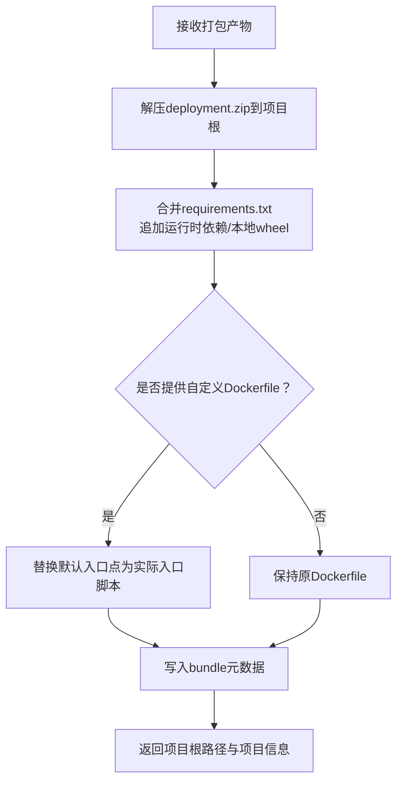

**图表来源**
- [detached_app.py:40-144](file://src/agentscope_runtime/engine/deployers/utils/detached_app.py#L40-L144)
- [detached_app.py:156-238](file://src/agentscope_runtime/engine/deployers/utils/detached_app.py#L156-L238)

**章节来源**
- [detached_app.py:40-144](file://src/agentscope_runtime/engine/deployers/utils/detached_app.py#L40-L144)

### 轮子打包（wheel_packager.py）
- 功能要点
  - 为特定平台（如FC）生成可部署轮子，嵌入用户项目与依赖
  - 合并用户与本地wheel依赖，去重并写入setup.py
  - 在构建时合并wheel内容到最终wheel
- 关键流程
  - 复制用户项目到deploy_starter/user_bundle
  - 解析pyproject/requirements，收集标准依赖与本地wheel
  - 生成配置与入口脚本，构建wheel

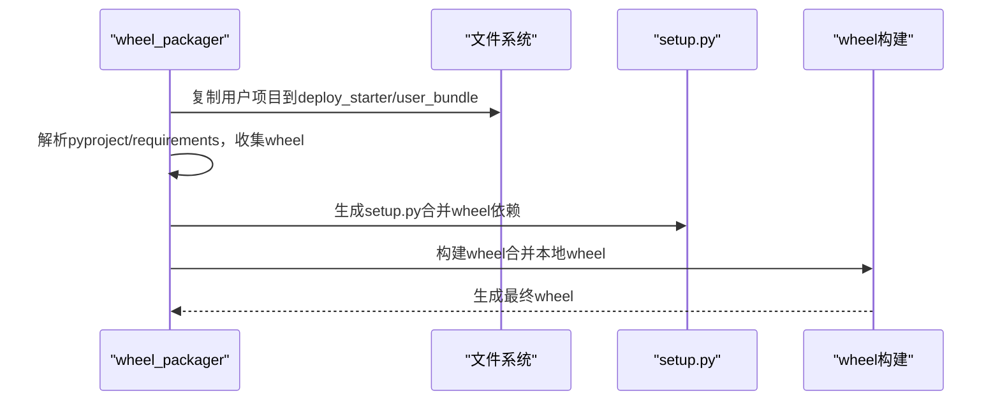

**图表来源**
- [wheel_packager.py:145-475](file://src/agentscope_runtime/engine/deployers/utils/wheel_packager.py#L145-L475)

**章节来源**
- [wheel_packager.py:145-475](file://src/agentscope_runtime/engine/deployers/utils/wheel_packager.py#L145-L475)

### 部署模式与接口抽象
- 部署模式
  - 守护线程：本地部署管理器以守护线程运行
  - 分离进程：以分离进程运行
  - 独立打包：独立模板模式
- 接口抽象
  - DeployManager定义统一的deploy/stop接口，支持状态管理

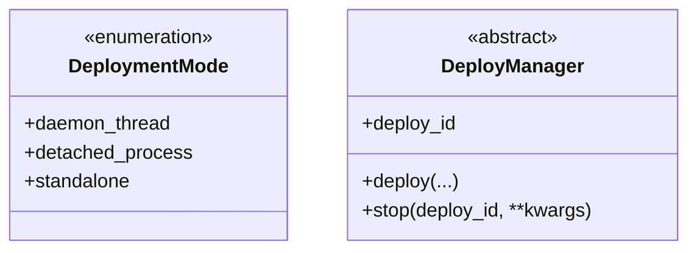

**图表来源**
- [deployment_modes.py:7-15](file://src/agentscope_runtime/engine/deployers/utils/deployment_modes.py#L7-L15)
- [base.py:9-44](file://src/agentscope_runtime/engine/deployers/base.py#L9-L44)

**章节来源**
- [deployment_modes.py:1-15](file://src/agentscope_runtime/engine/deployers/utils/deployment_modes.py#L1-L15)
- [base.py:1-44](file://src/agentscope_runtime/engine/deployers/base.py#L1-L44)

## 依赖分析
- 组件耦合
  - ImageFactory依赖DockerfileGenerator与DockerImageBuilder，协调打包与镜像流程
  - detached_app依赖package与wheel依赖解析，负责解包与注入
  - BuildCache贯穿打包与镜像构建，提升迭代效率
  - wheel_packager与detached_app共享依赖解析逻辑
- 外部依赖
  - Docker命令行工具（docker build/push/rmi/inspect）
  - Python构建工具（build/pip wheel）
  - Jinja2模板引擎
  - Pydantic模型校验

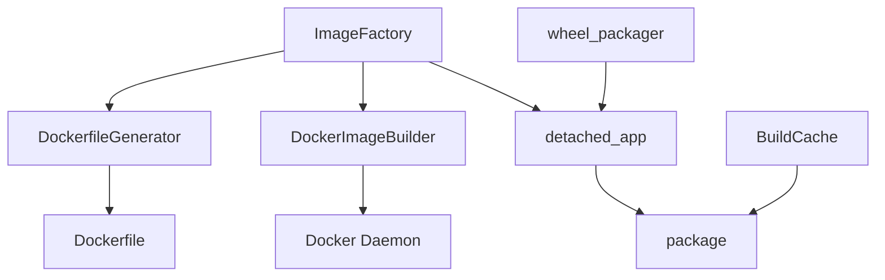

**图表来源**
- [image_factory.py:77-79](file://src/agentscope_runtime/engine/deployers/utils/docker_image_utils/image_factory.py#L77-L79)
- [detached_app.py:18-24](file://src/agentscope_runtime/engine/deployers/utils/detached_app.py#L18-L24)
- [build_cache.py:62-65](file://src/agentscope_runtime/engine/deployers/utils/build_cache.py#L62-L65)
- [wheel_packager.py:27-27](file://src/agentscope_runtime/engine/deployers/utils/wheel_packager.py#L27-L27)

**章节来源**
- [image_factory.py:67-400](file://src/agentscope_runtime/engine/deployers/utils/docker_image_utils/image_factory.py#L67-L400)
- [detached_app.py:1-602](file://src/agentscope_runtime/engine/deployers/utils/detached_app.py#L1-L602)
- [build_cache.py:1-737](file://src/agentscope_runtime/engine/deployers/utils/build_cache.py#L1-L737)
- [wheel_packager.py:1-475](file://src/agentscope_runtime/engine/deployers/utils/wheel_packager.py#L1-L475)

## 性能考虑
- 构建缓存
  - 基于内容哈希与平台命名，避免重复构建；建议在本地开发启用缓存
  - 使用忽略模式减少无关文件参与哈希，缩短计算时间
- 增量构建
  - 通过BuildConfig.no_cache与source_updated控制是否禁用缓存与强制更新
  - Docker多阶段构建（由Dockerfile模板支持）可减少层冗余
- 镜像优化
  - 使用平台参数（platform）确保跨平台一致性
  - PyPI镜像配置（pypi_mirror）提升依赖安装速度
- 打包优化
  - package与detached_app采用zip打包与解包，避免不必要的文件拷贝
  - wheel_packager在构建时合并wheel，减少最终包体积

[本节为通用指导，无需列出具体文件来源]

## 故障排除指南
- Docker不可用
  - 现象：初始化时报错提示Docker未安装或不在PATH
  - 处理：安装Docker并确保docker --version可执行
- 构建失败
  - 现象：docker build/push返回非零退出码
  - 处理：查看日志输出，确认上下文路径、Dockerfile路径、构建参数与平台设置
- 缓存损坏
  - 现象：缓存目录缺失或文件为空
  - 处理：调用invalidate_all清理全部缓存后重新构建
- 入口点解析失败
  - 现象：无法定位项目源文件或未找到入口点
  - 处理：检查entrypoint规范或提供显式入口点文件
- 轮子构建失败
  - 现象：wheel构建超时或未生成
  - 处理：检查虚拟环境与pip/build工具可用性，确认pyproject/requirements正确

**章节来源**
- [docker_image_builder.py:54-68](file://src/agentscope_runtime/engine/deployers/utils/docker_image_utils/docker_image_builder.py#L54-L68)
- [docker_image_builder.py:195-204](file://src/agentscope_runtime/engine/deployers/utils/docker_image_utils/docker_image_builder.py#L195-L204)
- [build_cache.py:265-276](file://src/agentscope_runtime/engine/deployers/utils/build_cache.py#L265-L276)
- [detached_app.py:196-238](file://src/agentscope_runtime/engine/deployers/utils/detached_app.py#L196-L238)
- [wheel_packager.py:444-470](file://src/agentscope_runtime/engine/deployers/utils/wheel_packager.py#L444-L470)

## 结论
AgentScope Runtime的部署工具集通过清晰的职责划分与模块化设计，实现了从项目打包、模板生成、Docker镜像构建与推送，到缓存与多平台部署的全链路自动化。借助内容感知缓存与增量构建策略，显著提升了本地开发效率；通过统一的镜像工厂与部署模式抽象，便于扩展新的部署平台与适配器。

[本节为总结性内容，无需列出具体文件来源]

## 附录

### 使用指南（基于示例配置）
- Kubernetes部署
  - 配置项要点：名称、命名空间、副本数、端口、镜像名/标签、基础镜像、平台、是否推送、requirements、环境变量、资源请求/限制、镜像拉取策略、部署超时与健康检查
  - 参考配置：[k8s_deploy_config.yaml:1-53](file://examples/deployments/k8s_deploy/k8s_deploy_config.yaml#L1-L53)
- 本地部署
  - 配置项要点：主机、端口、入口点（可选）、环境变量
  - 参考配置：[local_deploy_config.yaml:1-16](file://examples/deployments/local_deploy/local_deploy_config.yaml#L1-L16)

**章节来源**
- [k8s_deploy_config.yaml:1-53](file://examples/deployments/k8s_deploy/k8s_deploy_config.yaml#L1-L53)
- [local_deploy_config.yaml:1-16](file://examples/deployments/local_deploy/local_deploy_config.yaml#L1-L16)