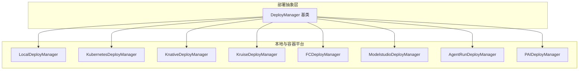
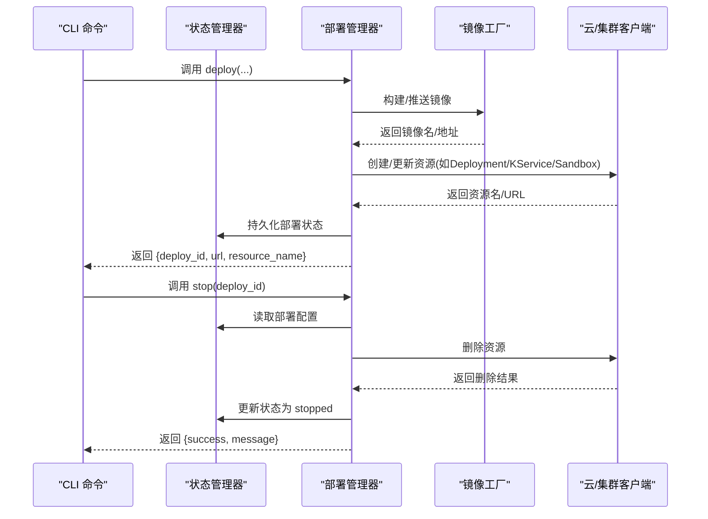
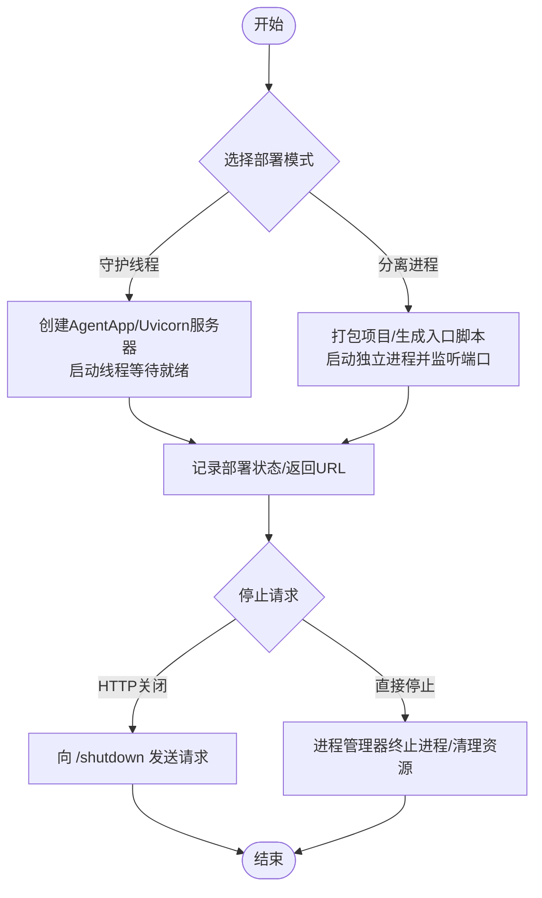
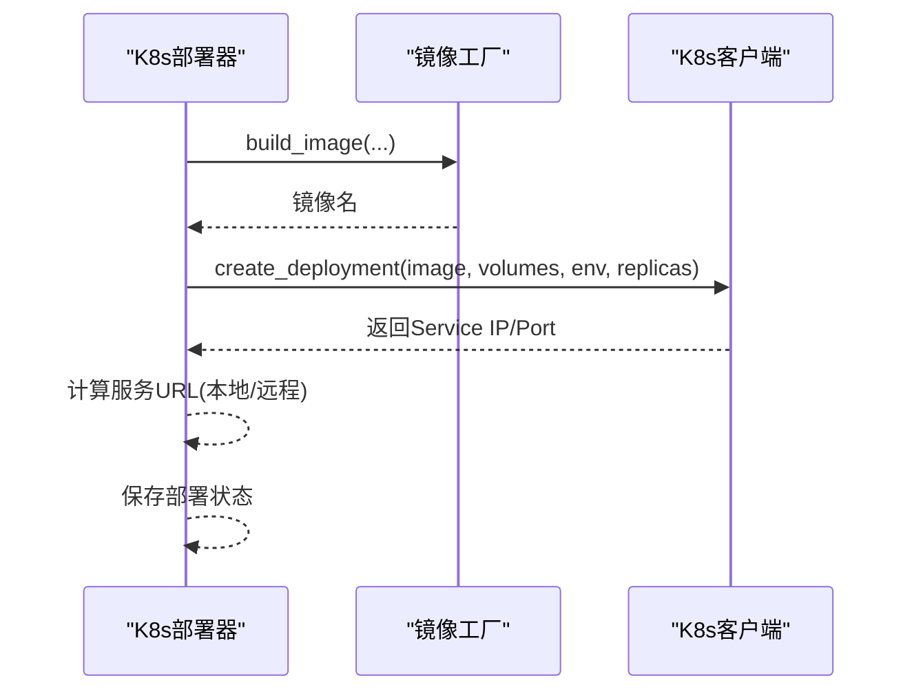
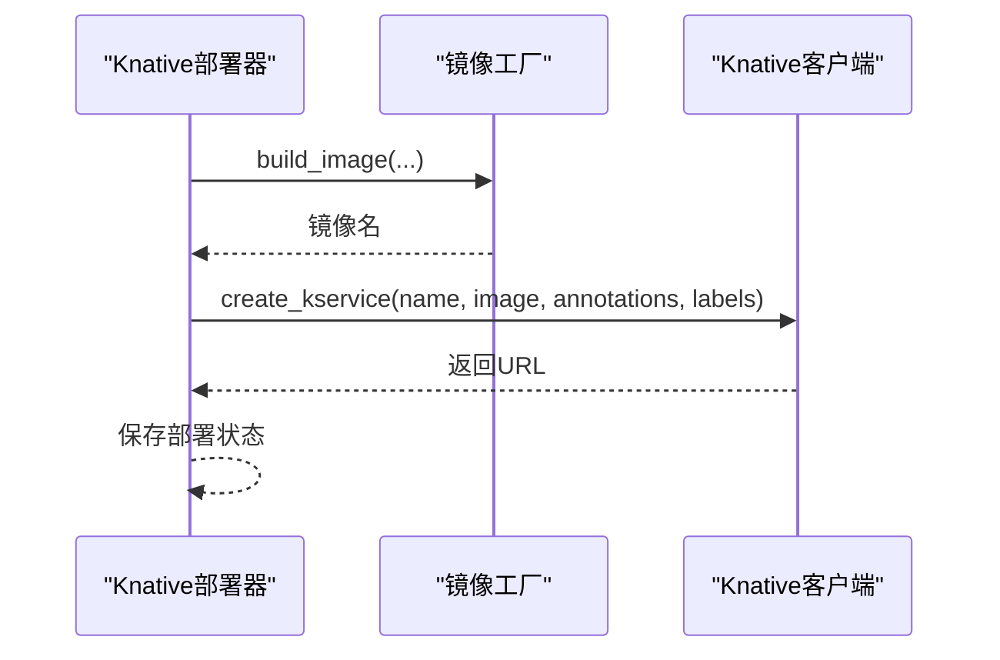
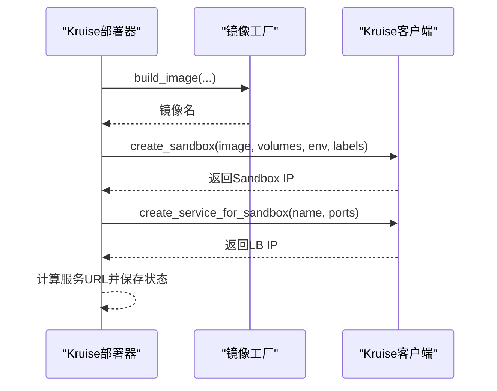
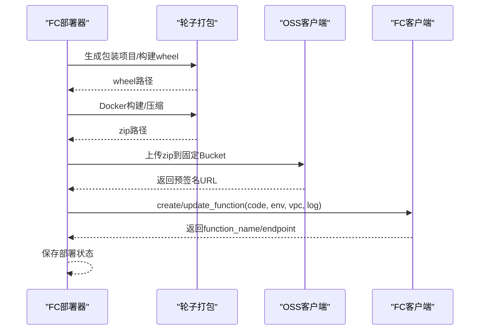
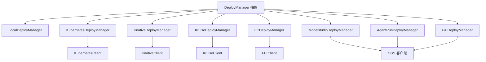

# 部署管理器

<cite>
**本文档引用的文件**
- [deployers/__init__.py](file://src/agentscope_runtime/engine/deployers/__init__.py)
- [deployers/base.py](file://src/agentscope_runtime/engine/deployers/base.py)
- [deployers/local_deployer.py](file://src/agentscope_runtime/engine/deployers/local_deployer.py)
- [deployers/kubernetes_deployer.py](file://src/agentscope_runtime/engine/deployers/kubernetes_deployer.py)
- [deployers/modelstudio_deployer.py](file://src/agentscope_runtime/engine/deployers/modelstudio_deployer.py)
- [deployers/agentrun_deployer.py](file://src/agentscope_runtime/engine/deployers/agentrun_deployer.py)
- [deployers/knative_deployer.py](file://src/agentscope_runtime/engine/deployers/knative_deployer.py)
- [deployers/kruise_deployer.py](file://src/agentscope_runtime/engine/deployers/kruise_deployer.py)
- [deployers/fc_deployer.py](file://src/agentscope_runtime/engine/deployers/fc_deployer.py)
- [deployers/pai_deployer.py](file://src/agentscope_runtime/engine/deployers/pai_deployer.py)
- [cli/commands/stop.py](file://src/agentscope_runtime/cli/commands/stop.py)
</cite>

## 目录
1. [简介](#简介)
2. [项目结构](#项目结构)
3. [核心组件](#核心组件)
4. [架构总览](#架构总览)
5. [详细组件分析](#详细组件分析)
6. [依赖分析](#依赖分析)
7. [性能考虑](#性能考虑)
8. [故障排除指南](#故障排除指南)
9. [结论](#结论)
10. [附录](#附录)

## 简介
本技术文档面向AgentScope Runtime的部署管理器系统，系统性阐述其多平台部署架构与自动化流程，覆盖本地部署、Kubernetes、AgentRun、Knative、Kruise、函数计算（FC）、ModelStudio以及PAI等部署模式的实现差异与最佳实践。文档同时涵盖容器化构建、镜像管理、服务编排、配置管理、环境变量处理与资源调度策略，并提供部署优化与故障排除的实用指南。

## 项目结构
部署相关代码集中在引擎模块的deployers包中，采用统一的抽象接口与多平台适配器模式：
- 抽象基类定义统一的部署接口
- 各平台部署器实现具体逻辑
- 工具模块负责镜像构建、打包、状态管理与客户端封装
- CLI命令通过状态管理器协调停止与清理

图表来源
- [deployers/base.py:9-43](file://src/agentscope_runtime/engine/deployers/base.py#L9-L43)
- [deployers/local_deployer.py:27-645](file://src/agentscope_runtime/engine/deployers/local_deployer.py#L27-L645)
- [deployers/kubernetes_deployer.py:48-391](file://src/agentscope_runtime/engine/deployers/kubernetes_deployer.py#L48-L391)
- [deployers/knative_deployer.py:43-291](file://src/agentscope_runtime/engine/deployers/knative_deployer.py#L43-L291)
- [deployers/kruise_deployer.py:37-434](file://src/agentscope_runtime/engine/deployers/kruise_deployer.py#L37-L434)
- [deployers/fc_deployer.py:246-1507](file://src/agentscope_runtime/engine/deployers/fc_deployer.py#L246-L1507)
- [deployers/modelstudio_deployer.py:544-947](file://src/agentscope_runtime/engine/deployers/modelstudio_deployer.py#L544-L947)
- [deployers/agentrun_deployer.py:264-2672](file://src/agentscope_runtime/engine/deployers/agentrun_deployer.py#L264-L2672)
- [deployers/pai_deployer.py:1-2336](file://src/agentscope_runtime/engine/deployers/pai_deployer.py#L1-L2336)

章节来源
- [deployers/__init__.py:18-51](file://src/agentscope_runtime/engine/deployers/__init__.py#L18-L51)

## 核心组件
- 抽象基类 DeployManager：定义统一的异步部署与停止接口，内置部署ID生成与状态管理器注入。
- 平台部署器：各平台实现deploy与stop方法，负责镜像构建、资源编排、端点暴露与状态持久化。
- 工具与客户端：镜像工厂、K8s/Knative/Kruise客户端、OSS上传、轮子打包等。
- CLI集成：通过状态管理器读取部署信息并调用对应部署器执行停止操作。

章节来源
- [deployers/base.py:9-43](file://src/agentscope_runtime/engine/deployers/base.py#L9-L43)
- [deployers/__init__.py:18-51](file://src/agentscope_runtime/engine/deployers/__init__.py#L18-L51)

## 架构总览
统一的部署管理器体系以抽象接口为核心，围绕“镜像构建-资源编排-端点暴露-状态管理”的通用流程展开，同时针对不同平台进行差异化适配。

图表来源
- [deployers/base.py:23-43](file://src/agentscope_runtime/engine/deployers/base.py#L23-L43)
- [deployers/kubernetes_deployer.py:126-311](file://src/agentscope_runtime/engine/deployers/kubernetes_deployer.py#L126-L311)
- [deployers/knative_deployer.py:71-221](file://src/agentscope_runtime/engine/deployers/knative_deployer.py#L71-L221)
- [deployers/kruise_deployer.py:138-347](file://src/agentscope_runtime/engine/deployers/kruise_deployer.py#L138-L347)
- [deployers/fc_deployer.py:416-581](file://src/agentscope_runtime/engine/deployers/fc_deployer.py#L416-L581)
- [deployers/modelstudio_deployer.py:727-800](file://src/agentscope_runtime/engine/deployers/modelstudio_deployer.py#L727-L800)
- [deployers/agentrun_deployer.py:521-732](file://src/agentscope_runtime/engine/deployers/agentrun_deployer.py#L521-L732)
- [deployers/pai_deployer.py:1-2336](file://src/agentscope_runtime/engine/deployers/pai_deployer.py#L1-L2336)
- [cli/commands/stop.py:107-202](file://src/agentscope_runtime/cli/commands/stop.py#L107-L202)

## 详细组件分析

### 本地部署（Local）
- 支持两种模式：守护线程模式与分离进程模式
- 守护线程模式：基于Uvicorn在独立线程启动FastAPI服务，适合开发调试
- 分离进程模式：打包项目后以独立进程运行，支持优雅关闭与PID文件管理
- 状态管理：保存部署ID、URL、主机端口、进程信息等

图表来源
- [deployers/local_deployer.py:68-174](file://src/agentscope_runtime/engine/deployers/local_deployer.py#L68-L174)
- [deployers/local_deployer.py:415-510](file://src/agentscope_runtime/engine/deployers/local_deployer.py#L415-L510)

章节来源
- [deployers/local_deployer.py:27-645](file://src/agentscope_runtime/engine/deployers/local_deployer.py#L27-L645)

### Kubernetes（K8s）
- 通过镜像工厂构建镜像并推送到注册表
- 使用Kubernetes客户端创建Deployment与Service，自动选择内网或外网端点
- 支持挂载目录、环境变量、副本数与运行时配置
- 停止时删除Deployment与Service并更新状态

图表来源
- [deployers/kubernetes_deployer.py:126-302](file://src/agentscope_runtime/engine/deployers/kubernetes_deployer.py#L126-L302)

章节来源
- [deployers/kubernetes_deployer.py:48-391](file://src/agentscope_runtime/engine/deployers/kubernetes_deployer.py#L48-L391)

### Knative
- 在K8s之上以KService形式部署，按需扩缩容与自动伸缩
- 支持注解与标签传递，便于网格与监控集成
- 停止时删除KService并返回结果

图表来源
- [deployers/knative_deployer.py:71-221](file://src/agentscope_runtime/engine/deployers/knative_deployer.py#L71-L221)

章节来源
- [deployers/knative_deployer.py:43-291](file://src/agentscope_runtime/engine/deployers/knative_deployer.py#L43-L291)

### Kruise（Sandbox）
- 通过Kruise自定义资源（Sandbox）提供轻量级沙箱容器
- 自动创建Service并根据环境选择LoadBalancer或Pod IP作为访问端点
- 支持卷挂载与运行时配置

图表来源
- [deployers/kruise_deployer.py:138-347](file://src/agentscope_runtime/engine/deployers/kruise_deployer.py#L138-L347)

章节来源
- [deployers/kruise_deployer.py:37-434](file://src/agentscope_runtime/engine/deployers/kruise_deployer.py#L37-L434)

### 函数计算（FC）
- 通过轮子打包与Docker构建依赖，生成压缩包上传至OSS
- 调用FC API创建或更新函数，配置自定义运行时、会话亲和、日志与网络
- 自动创建HTTP触发器并返回公网/内网URL

图表来源
- [deployers/fc_deployer.py:416-581](file://src/agentscope_runtime/engine/deployers/fc_deployer.py#L416-L581)
- [deployers/fc_deployer.py:587-800](file://src/agentscope_runtime/engine/deployers/fc_deployer.py#L587-L800)

章节来源
- [deployers/fc_deployer.py:246-1507](file://src/agentscope_runtime/engine/deployers/fc_deployer.py#L246-L1507)

### ModelStudio
- 与FC类似，但通过ModelStudio的临时存储租约接口上传wheel
- 触发全量代码部署，支持Telemetry开关与控制台链接生成

章节来源
- [deployers/modelstudio_deployer.py:544-947](file://src/agentscope_runtime/engine/deployers/modelstudio_deployer.py#L544-L947)

### AgentRun
- 通过OSS固定Bucket上传zip包，调用AgentRun API创建/更新运行时与端点
- 支持网络与日志配置、会话并发与空闲超时参数

章节来源
- [deployers/agentrun_deployer.py:264-2672](file://src/agentscope_runtime/engine/deployers/agentrun_deployer.py#L264-L2672)

### PAI
- 通过LangStudio API创建Flow、快照与部署，支持多种资源类型（公共实例、EAS资源组、配额）
- 支持工作目录、VPC、身份角色、可观测性与环境变量等配置
- 提供同步/异步部署与超时控制

章节来源
- [deployers/pai_deployer.py:1-2336](file://src/agentscope_runtime/engine/deployers/pai_deployer.py#L1-L2336)

## 依赖分析
- 组件耦合：所有部署器继承自统一基类，遵循一致的接口契约；平台差异通过客户端与工具模块隔离
- 外部依赖：K8s/Knative/Kruise客户端、FC/AgentRun/ModelStudio/PAI SDK、OSS SDK
- 状态管理：统一通过状态管理器持久化部署元数据，CLI通过状态查询与停止操作

图表来源
- [deployers/base.py:9-43](file://src/agentscope_runtime/engine/deployers/base.py#L9-L43)
- [deployers/kubernetes_deployer.py:67-70](file://src/agentscope_runtime/engine/deployers/kubernetes_deployer.py#L67-L70)
- [deployers/knative_deployer.py:66-69](file://src/agentscope_runtime/engine/deployers/knative_deployer.py#L66-L69)
- [deployers/kruise_deployer.py:77-80](file://src/agentscope_runtime/engine/deployers/kruise_deployer.py#L77-L80)
- [deployers/fc_deployer.py:275-287](file://src/agentscope_runtime/engine/deployers/fc_deployer.py#L275-L287)
- [deployers/modelstudio_deployer.py:315-316](file://src/agentscope_runtime/engine/deployers/modelstudio_deployer.py#L315-L316)
- [deployers/agentrun_deployer.py:308-308](file://src/agentscope_runtime/engine/deployers/agentrun_deployer.py#L308-L308)
- [deployers/pai_deployer.py:34-54](file://src/agentscope_runtime/engine/deployers/pai_deployer.py#L34-L54)

章节来源
- [deployers/__init__.py:18-51](file://src/agentscope_runtime/engine/deployers/__init__.py#L18-L51)

## 性能考虑
- 镜像构建缓存：启用构建缓存与注册表推送可显著缩短重复构建时间
- 资源规格：合理设置CPU/内存与副本数，避免过度分配导致资源浪费
- 连接与会话：FC的会话亲和与超时配置有助于提升长连接稳定性
- 网络与存储：K8s/Kruise的卷挂载与OSS上传路径应尽量减少I/O瓶颈
- 日志与观测：开启必要的日志与指标采集，避免对性能造成额外开销

## 故障排除指南
- 本地部署失败
  - 检查端口占用与主机绑定（0.0.0.0需映射到127.0.0.1检测）
  - 分离进程模式下确认PID文件与日志输出
- Kubernetes/Knative/Kruise
  - 确认集群可用性与命名空间权限
  - 本地环境使用回退主机（127.0.0.1）访问LoadBalancer
- FC/AgentRun/ModelStudio/PAI
  - 确认SDK依赖安装与凭证配置
  - 检查OSS桶权限与对象上传状态
  - 关注会话亲和与超时设置是否合理
- CLI停止
  - 若平台清理失败，可使用强制选项仅更新本地状态

章节来源
- [deployers/local_deployer.py:566-607](file://src/agentscope_runtime/engine/deployers/local_deployer.py#L566-L607)
- [deployers/kubernetes_deployer.py:73-120](file://src/agentscope_runtime/engine/deployers/kubernetes_deployer.py#L73-L120)
- [deployers/knative_deployer.py:71-121](file://src/agentscope_runtime/engine/deployers/knative_deployer.py#L71-L121)
- [deployers/kruise_deployer.py:83-122](file://src/agentscope_runtime/engine/deployers/kruise_deployer.py#L83-L122)
- [cli/commands/stop.py:107-202](file://src/agentscope_runtime/cli/commands/stop.py#L107-L202)

## 结论
AgentScope Runtime的部署管理器通过统一抽象与平台适配，实现了从本地到多云/多PaaS平台的一致化部署体验。借助镜像工厂、打包工具与状态管理，系统在保证可移植性的同时提供了灵活的资源配置与可观测能力。建议在生产环境中结合缓存策略、资源规格与网络配置进行优化，并建立完善的监控与故障恢复流程。

## 附录
- 配置管理要点
  - 环境变量优先：各平台均支持从环境变量加载凭证与运行参数
  - 平台特定参数：如K8s的namespace、annotations/labels，FC的VPC与日志配置，PAI的资源类型与配额等
- 最佳实践
  - 使用固定OSS Bucket与预签名URL简化上传流程
  - 合理设置镜像标签与版本，便于回滚与追踪
  - 在K8s/Knative中启用健康检查与资源限制，确保弹性与稳定性