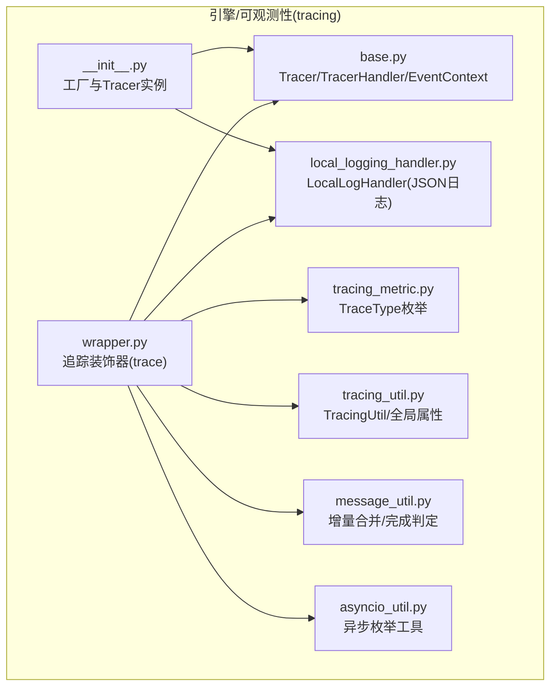
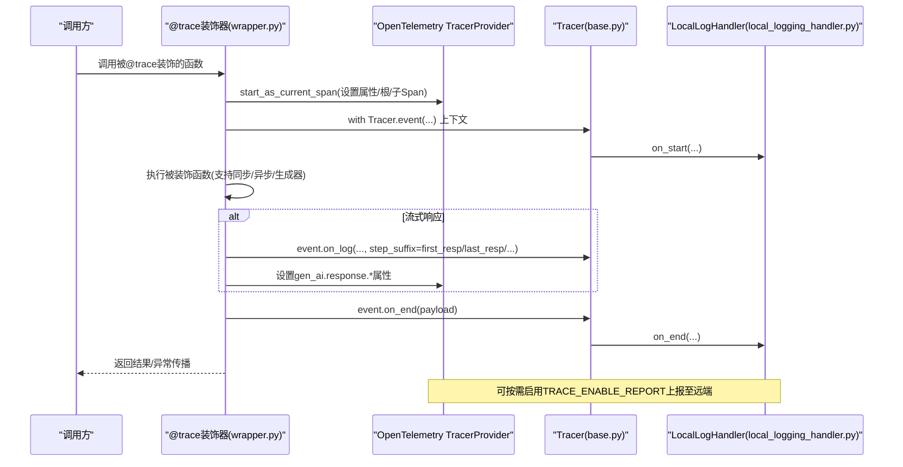
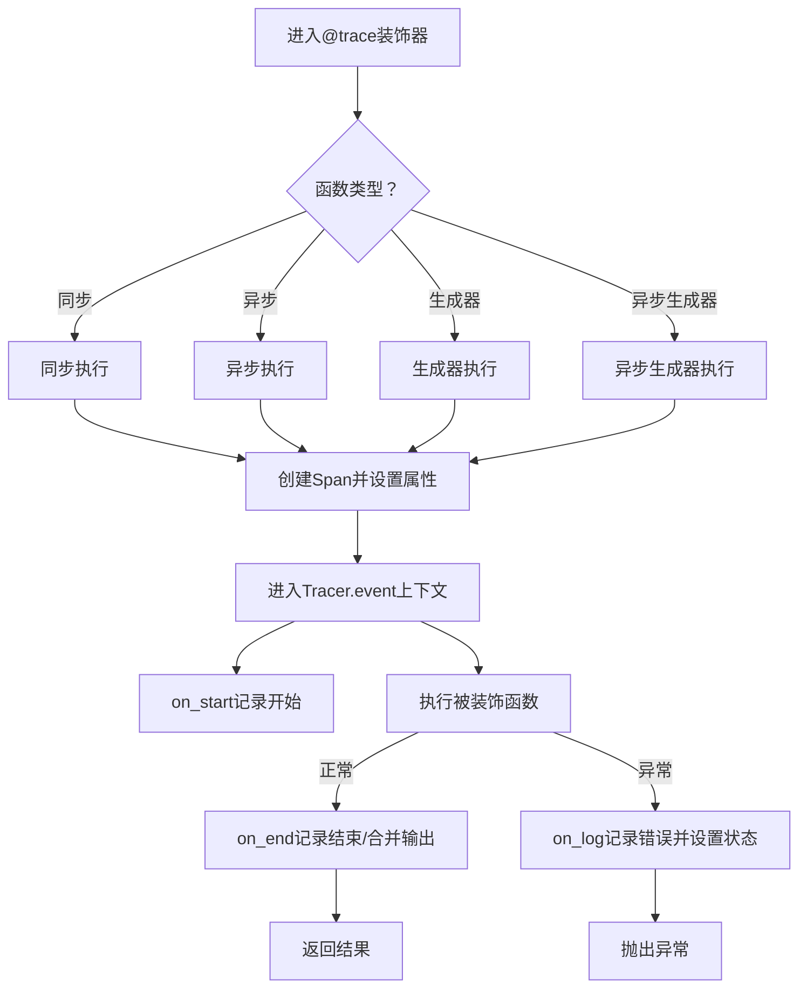
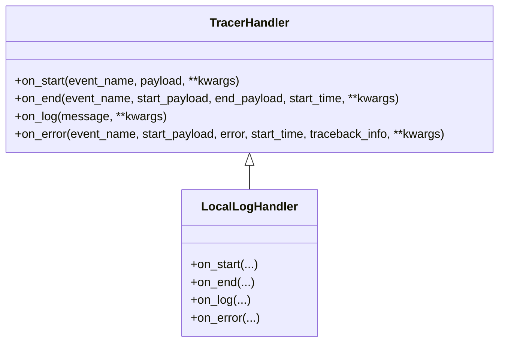
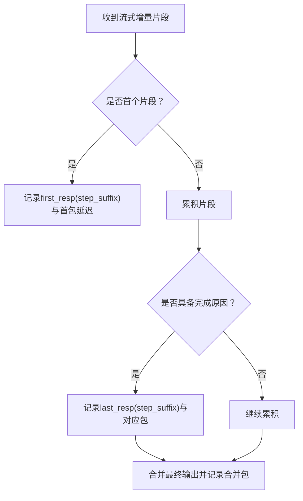
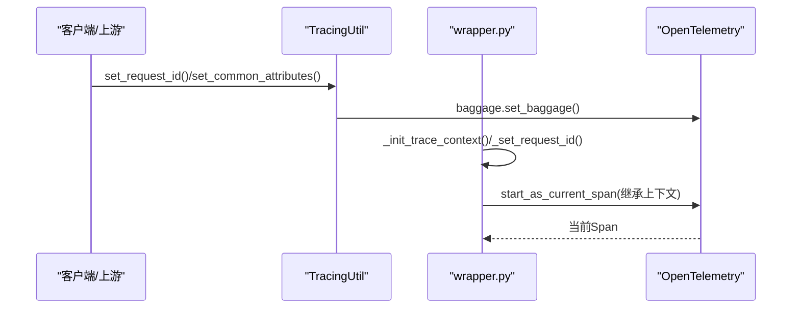
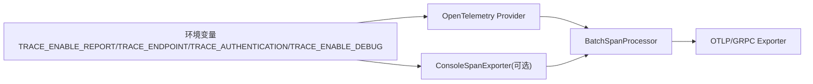
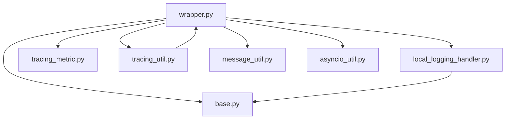

# 可观测性

<cite>
**本文引用的文件**
- [README.md](file://README.md)
- [tracing/README.md](file://src/agentscope_runtime/engine/tracing/README.md)
- [tracing/__init__.py](file://src/agentscope_runtime/engine/tracing/__init__.py)
- [tracing/base.py](file://src/agentscope_runtime/engine/tracing/base.py)
- [tracing/wrapper.py](file://src/agentscope_runtime/engine/tracing/wrapper.py)
- [tracing/local_logging_handler.py](file://src/agentscope_runtime/engine/tracing/local_logging_handler.py)
- [tracing/tracing_metric.py](file://src/agentscope_runtime/engine/tracing/tracing_metric.py)
- [tracing/message_util.py](file://src/agentscope_runtime/engine/tracing/message_util.py)
- [tracing/tracing_util.py](file://src/agentscope_runtime/engine/tracing/tracing_util.py)
- [tracing/asyncio_util.py](file://src/agentscope_runtime/engine/tracing/asyncio_util.py)
- [tracing/README.md](file://src/agentscope_runtime/engine/tracing/README.md)
- [tracing.md](file://cookbook/en/tracing.md)
- [tracing.md](file://cookbook/zh/tracing.md)
- [advanced_deployment.md](file://cookbook/en/advanced_deployment.md)
- [kruise_deploy_config.yaml](file://examples/deployments/kruise_deploy/kruise_deploy_config.yaml)
- [k8s_deploy/README.md](file://examples/deployments/k8s_deploy/README.md)
- [agentrun_deploy_config.yaml](file://examples/deployments/agentrun_deploy_config.yaml)
- [local_deploy_config.yaml](file://examples/deployments/local_deploy_config.yaml)
</cite>

## 目录
1. [简介](#简介)
2. [项目结构](#项目结构)
3. [核心组件](#核心组件)
4. [架构总览](#架构总览)
5. [详细组件分析](#详细组件分析)
6. [依赖关系分析](#依赖关系分析)
7. [性能考量](#性能考量)
8. [故障排查指南](#故障排查指南)
9. [结论](#结论)
10. [附录](#附录)

## 简介
本文件面向AgentScope Runtime的可观测性能力，系统化阐述其全栈可观测性架构与实践，覆盖日志系统、追踪机制与性能监控三部分。重点包括：
- 追踪包装器的工作原理与消息追踪策略
- 性能指标采集与OpenTelemetry上报路径
- 本地日志处理器的实现与配置
- 监控指标定义、告警规则建议与故障诊断
- 观测性数据的存储、查询与可视化方法

## 项目结构
可观测性相关代码集中在引擎子包的tracing模块中，围绕“追踪装饰器”“追踪器与处理器”“消息合并与完成判定”“全局属性与请求上下文”等维度组织。

图示来源
- [tracing/wrapper.py:94-606](file://src/agentscope_runtime/engine/tracing/wrapper.py#L94-L606)
- [tracing/base.py:166-343](file://src/agentscope_runtime/engine/tracing/base.py#L166-L343)
- [tracing/local_logging_handler.py:84-370](file://src/agentscope_runtime/engine/tracing/local_logging_handler.py#L84-L370)
- [tracing/tracing_metric.py:1-82](file://src/agentscope_runtime/engine/tracing/tracing_metric.py#L1-L82)
- [tracing/tracing_util.py:23-136](file://src/agentscope_runtime/engine/tracing/tracing_util.py#L23-L136)
- [tracing/message_util.py:20-134](file://src/agentscope_runtime/engine/tracing/message_util.py#L20-L134)
- [tracing/asyncio_util.py:7-25](file://src/agentscope_runtime/engine/tracing/asyncio_util.py#L7-L25)
- [tracing/__init__.py:16-47](file://src/agentscope_runtime/engine/tracing/__init__.py#L16-L47)

章节来源
- [tracing/README.md:1-73](file://src/agentscope_runtime/engine/tracing/README.md#L1-L73)
- [tracing.md:17-199](file://cookbook/en/tracing.md#L17-L199)

## 核心组件
- 追踪装饰器(trace)：统一拦截函数调用，自动注入OpenTelemetry Span与本地Tracer事件，支持同步、异步、生成器与异步生成器场景。
- Tracer与TracerHandler：事件生命周期回调(on_start/on_end/on_log/on_error)，支持多处理器组合。
- LocalLogHandler：输出DashScope兼容格式的JSON日志，支持滚动文件与可选控制台输出。
- TraceType：事件类型枚举，覆盖LLM、TOOL、AGENT_STEP、RAG、EMBEDDING等。
- TracingUtil：请求ID、跨线程Baggage、通用属性的全局管理。
- 消息工具(message_util)：对流式响应进行增量合并与完成原因判定，用于生成器追踪的首包延迟、最终包与合并输出。
- 异步工具(asyncio_util)：异步枚举，配合生成器追踪。

章节来源
- [tracing/wrapper.py:94-606](file://src/agentscope_runtime/engine/tracing/wrapper.py#L94-L606)
- [tracing/base.py:166-343](file://src/agentscope_runtime/engine/tracing/base.py#L166-L343)
- [tracing/local_logging_handler.py:84-370](file://src/agentscope_runtime/engine/tracing/local_logging_handler.py#L84-L370)
- [tracing/tracing_metric.py:1-82](file://src/agentscope_runtime/engine/tracing/tracing_metric.py#L1-L82)
- [tracing/tracing_util.py:23-136](file://src/agentscope_runtime/engine/tracing/tracing_util.py#L23-L136)
- [tracing/message_util.py:20-134](file://src/agentscope_runtime/engine/tracing/message_util.py#L20-L134)
- [tracing/asyncio_util.py:7-25](file://src/agentscope_runtime/engine/tracing/asyncio_util.py#L7-L25)

## 架构总览
下图展示了从函数调用到OpenTelemetry上报与本地日志输出的端到端流程。

图示来源
- [tracing/wrapper.py:185-235](file://src/agentscope_runtime/engine/tracing/wrapper.py#L185-L235)
- [tracing/base.py:166-250](file://src/agentscope_runtime/engine/tracing/base.py#L166-L250)
- [tracing/local_logging_handler.py:201-279](file://src/agentscope_runtime/engine/tracing/local_logging_handler.py#L201-L279)

章节来源
- [tracing/README.md:1-73](file://src/agentscope_runtime/engine/tracing/README.md#L1-L73)
- [tracing.md:17-199](file://cookbook/en/tracing.md#L17-L199)

## 详细组件分析

### 追踪装饰器与事件生命周期
- 装饰器根据函数类型选择同步/异步/生成器分支；在Span内创建Tracer事件上下文；自动注入输入/输出类型与值、首包延迟、最终包与合并输出等属性；异常时设置状态并记录错误。
- 事件上下文支持在任意时刻追加日志(step_suffix)与结束载荷；最终统一on_end回调。

图示来源
- [tracing/wrapper.py:130-335](file://src/agentscope_runtime/engine/tracing/wrapper.py#L130-L335)
- [tracing/base.py:196-240](file://src/agentscope_runtime/engine/tracing/base.py#L196-L240)

章节来源
- [tracing/wrapper.py:94-606](file://src/agentscope_runtime/engine/tracing/wrapper.py#L94-L606)
- [tracing/base.py:166-343](file://src/agentscope_runtime/engine/tracing/base.py#L166-L343)

### 日志系统与本地日志处理器
- LocalLogHandler输出DashScope兼容的JSON格式日志，字段包含时间、步骤、请求ID、上下文、间隔等；支持Info/Error滚动文件与可选控制台输出。
- 支持在事件中插入带step_suffix的日志，形成start/mid/end/error等阶段化日志。
- 可通过环境变量开启TRACE_ENABLE_LOG以启用本地日志处理器。

图示来源
- [tracing/base.py:13-83](file://src/agentscope_runtime/engine/tracing/base.py#L13-L83)
- [tracing/local_logging_handler.py:84-370](file://src/agentscope_runtime/engine/tracing/local_logging_handler.py#L84-L370)

章节来源
- [tracing/local_logging_handler.py:84-370](file://src/agentscope_runtime/engine/tracing/local_logging_handler.py#L84-L370)
- [tracing/README.md:4-52](file://src/agentscope_runtime/engine/tracing/README.md#L4-L52)

### 追踪类型与消息追踪
- TraceType枚举定义了LLM、TOOL、AGENT_STEP、RAG、EMBEDDING等事件类型，便于分类统计与过滤。
- 对于流式响应，系统仅记录首包(first_resp)、最终包(last_resp或stop/stop_token/...)与合并后的最终输出(merged_resp)，减少冗余日志并保留关键性能指标。

图示来源
- [tracing/wrapper.py:712-784](file://src/agentscope_runtime/engine/tracing/wrapper.py#L712-L784)
- [tracing/message_util.py:123-134](file://src/agentscope_runtime/engine/tracing/message_util.py#L123-L134)

章节来源
- [tracing/tracing_metric.py:1-82](file://src/agentscope_runtime/engine/tracing/tracing_metric.py#L1-L82)
- [tracing/message_util.py:20-134](file://src/agentscope_runtime/engine/tracing/message_util.py#L20-L134)
- [tracing/wrapper.py:712-784](file://src/agentscope_runtime/engine/tracing/wrapper.py#L712-L784)

### 请求ID与上下文传播
- TracingUtil负责设置/获取请求ID与通用属性，自动写入baggage，确保跨线程/跨进程的上下文一致。
- 装饰器在根Span缺失且未显式指定is_root_span时，自动将trace_type提升为CHAIN并命名为FullCodeApp，便于端到端追踪。

图示来源
- [tracing/tracing_util.py:23-104](file://src/agentscope_runtime/engine/tracing/tracing_util.py#L23-L104)
- [tracing/wrapper.py:671-710](file://src/agentscope_runtime/engine/tracing/wrapper.py#L671-L710)
- [tracing/wrapper.py:800-820](file://src/agentscope_runtime/engine/tracing/wrapper.py#L800-L820)

章节来源
- [tracing/tracing_util.py:23-136](file://src/agentscope_runtime/engine/tracing/tracing_util.py#L23-L136)
- [tracing/wrapper.py:800-820](file://src/agentscope_runtime/engine/tracing/wrapper.py#L800-L820)

### OpenTelemetry上报与调试
- 当启用TRACE_ENABLE_REPORT时，通过BatchSpanProcessor与OTLP/GRPC导出器上报至远端；可配置TRACE_ENDPOINT与TRACE_AUTHENTICATION。
- TRACE_ENABLE_DEBUG可启用ConsoleSpanExporter进行本地调试。
- 若已存在TracerProvider，则直接复用；否则创建新的Provider并注册资源属性。

图示来源
- [tracing/wrapper.py:917-978](file://src/agentscope_runtime/engine/tracing/wrapper.py#L917-L978)

章节来源
- [tracing/wrapper.py:917-978](file://src/agentscope_runtime/engine/tracing/wrapper.py#L917-L978)
- [tracing/README.md:53-73](file://src/agentscope_runtime/engine/tracing/README.md#L53-L73)

## 依赖关系分析
- 组件耦合与内聚
  - wrapper.py高度聚合：封装OTel初始化、Span创建、Tracer事件、消息合并与完成判定、环境变量开关。
  - base.py提供抽象接口与基础实现，低耦合、高内聚。
  - local_logging_handler.py与tracing_util.py分别承担日志格式化与上下文管理，职责清晰。
- 外部依赖
  - OpenTelemetry SDK（trace、exporter、resources、propagation）。
  - Pydantic（LocalLogHandler的模型定义）。
  - logging.handlers.RotatingFileHandler（滚动日志）。

图示来源
- [tracing/wrapper.py:1-979](file://src/agentscope_runtime/engine/tracing/wrapper.py#L1-L979)
- [tracing/base.py:1-343](file://src/agentscope_runtime/engine/tracing/base.py#L1-L343)
- [tracing/local_logging_handler.py:1-370](file://src/agentscope_runtime/engine/tracing/local_logging_handler.py#L1-L370)
- [tracing/tracing_metric.py:1-82](file://src/agentscope_runtime/engine/tracing/tracing_metric.py#L1-L82)
- [tracing/tracing_util.py:1-136](file://src/agentscope_runtime/engine/tracing/tracing_util.py#L1-L136)
- [tracing/message_util.py:1-529](file://src/agentscope_runtime/engine/tracing/message_util.py#L1-L529)
- [tracing/asyncio_util.py:1-25](file://src/agentscope_runtime/engine/tracing/asyncio_util.py#L1-L25)

章节来源
- [tracing/__init__.py:1-47](file://src/agentscope_runtime/engine/tracing/__init__.py#L1-L47)
- [tracing/wrapper.py:1-979](file://src/agentscope_runtime/engine/tracing/wrapper.py#L1-L979)

## 性能考量
- 流式追踪优化
  - 仅记录首包与最终包，避免大量中间片段日志；通过gen_ai.response.first_delay与pkg_*属性记录关键时延与内容。
  - 合并函数merge_incremental_chunk在内存中累积并合并，注意大响应的内存占用与序列化开销。
- 日志落盘与滚动
  - 默认单文件最大1GB，保留7份备份；可根据磁盘与IO能力调整max_bytes与backup_count。
  - 控制台输出仅在调试时启用，生产环境建议关闭以降低开销。
- OTel上报
  - BatchSpanProcessor批量上报，合理设置批量大小与超时；在高并发场景下评估网络与远端接收能力。
- 上下文传播
  - 使用baggage与trace_context确保跨服务链路一致，避免重复生成请求ID导致的追踪碎片化。

章节来源
- [tracing/wrapper.py:712-784](file://src/agentscope_runtime/engine/tracing/wrapper.py#L712-L784)
- [tracing/local_logging_handler.py:87-128](file://src/agentscope_runtime/engine/tracing/local_logging_handler.py#L87-L128)
- [tracing/README.md:53-73](file://src/agentscope_runtime/engine/tracing/README.md#L53-L73)

## 故障排查指南
- 常见问题定位
  - 无日志输出：检查TRACE_ENABLE_LOG是否开启；确认LocalLogHandler已加入Tracer。
  - 无OTel上报：检查TRACE_ENABLE_REPORT、TRACE_ENDPOINT、TRACE_AUTHENTICATION；确认TracerProvider正确初始化。
  - 链路不完整：检查TracingUtil.set_request_id与baggage是否生效；确认父Span上下文是否正确attach。
  - 流式响应未记录中间节点：确认函数接受**kwargs并传入trace_event；检查step_suffix是否正确传入。
- 日志分析技巧
  - 以request_id为维度聚合start/mid/end/error日志，核对耗时区间(interval.cost)与payload差异。
  - 关注首包延迟与最终包原因，定位网络/模型/工具瓶颈。
- 快速恢复
  - 临时关闭TRACE_ENABLE_REPORT观察性能变化，排除上报开销。
  - 降低日志级别或关闭控制台输出，缓解IO压力。
  - 在根Span缺失时显式设置is_root_span，避免类型提升导致的链路歧义。

章节来源
- [tracing/local_logging_handler.py:201-370](file://src/agentscope_runtime/engine/tracing/local_logging_handler.py#L201-L370)
- [tracing/tracing_util.py:23-104](file://src/agentscope_runtime/engine/tracing/tracing_util.py#L23-L104)
- [tracing/wrapper.py:917-978](file://src/agentscope_runtime/engine/tracing/wrapper.py#L917-L978)

## 结论
AgentScope Runtime的可观测性以@trace装饰器为核心，结合OpenTelemetry与本地日志处理器，实现了从函数级到流式响应的全链路追踪。通过TraceType分类、消息合并与完成判定、请求ID与上下文传播，以及可配置的上报与日志策略，既能满足开发调试需求，也能支撑生产环境的性能监控与故障诊断。

## 附录

### 监控指标定义与建议
- 基础指标
  - 调用次数：按trace_type与trace_name分组计数
  - 成功率：成功/失败比例（由Span状态与错误日志决定）
  - 响应时间：事件耗时(interval.cost)，支持P50/P90/P99
  - 首包延迟：gen_ai.response.first_delay
  - 最终包原因：gen_ai.response.pkg_*（stop/stop_token等）
- 流式指标
  - 包数量：统计first_resp与pkg_*出现频次
  - 合并耗时：合并输出耗时（由事件结束时长减去累计处理时长估算）
- 日志指标
  - 日志行数/大小、错误率、请求ID分布

章节来源
- [tracing/wrapper.py:712-784](file://src/agentscope_runtime/engine/tracing/wrapper.py#L712-L784)
- [tracing/message_util.py:123-134](file://src/agentscope_runtime/engine/tracing/message_util.py#L123-L134)

### 告警规则建议
- 基于Prometheus/Grafana
  - 成功率低于阈值（如99.5%）持续5分钟触发
  - 响应时间P95/P99超过阈值（如>2s/5s）
  - 首包延迟异常升高（如>1s）
  - 错误日志速率突增（如每分钟>10条）
- 基于日志平台
  - 按trace_type与错误码聚合，设定阈值告警
  - request_id维度的异常分布（如单ID异常高频）

章节来源
- [advanced_deployment.md:616-638](file://cookbook/en/advanced_deployment.md#L616-L638)

### 数据存储、查询与可视化
- 存储
  - 本地日志：RotatingFileHandler滚动文件，建议集中采集至日志平台
  - OTel上报：通过OTLP/GRPC导出至远端Tracing平台（如Jaeger/Tempo）
- 查询
  - 以trace_name/trace_type/request_id过滤
  - 使用gen_ai.*与output.*属性进行结构化检索
- 可视化
  - 仪表板：成功率、P95/P99、首包延迟、错误分布
  - 链路图：Span层级与耗时热力图

章节来源
- [tracing/local_logging_handler.py:129-179](file://src/agentscope_runtime/engine/tracing/local_logging_handler.py#L129-L179)
- [tracing/wrapper.py:948-961](file://src/agentscope_runtime/engine/tracing/wrapper.py#L948-L961)
- [advanced_deployment.md:616-638](file://cookbook/en/advanced_deployment.md#L616-L638)

### 部署与可观测性配置示例
- K8s/Kruise部署示例
  - 环境变量：LOG_LEVEL、DASHSCOPE_API_KEY等
  - 资源限制：requests/limits
- AgentRun部署示例
  - region、cpu/memory、环境变量（含阿里云AK/SK）
- 本地部署示例
  - host/port、环境变量（如LOG_LEVEL=DEBUG）

章节来源
- [kruise_deploy_config.yaml:29-58](file://examples/deployments/kruise_deploy/kruise_deploy_config.yaml#L29-L58)
- [agentrun_deploy_config.yaml:16-28](file://examples/deployments/agentrun_deploy_config.yaml#L16-L28)
- [local_deploy_config.yaml:11-16](file://examples/deployments/local_deploy_config.yaml#L11-L16)
- [k8s_deploy/README.md:103-157](file://examples/deployments/k8s_deploy/README.md#L103-L157)