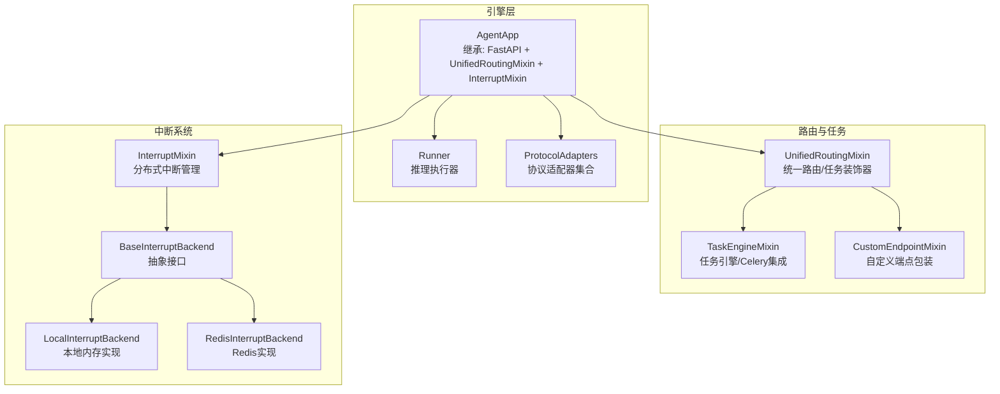
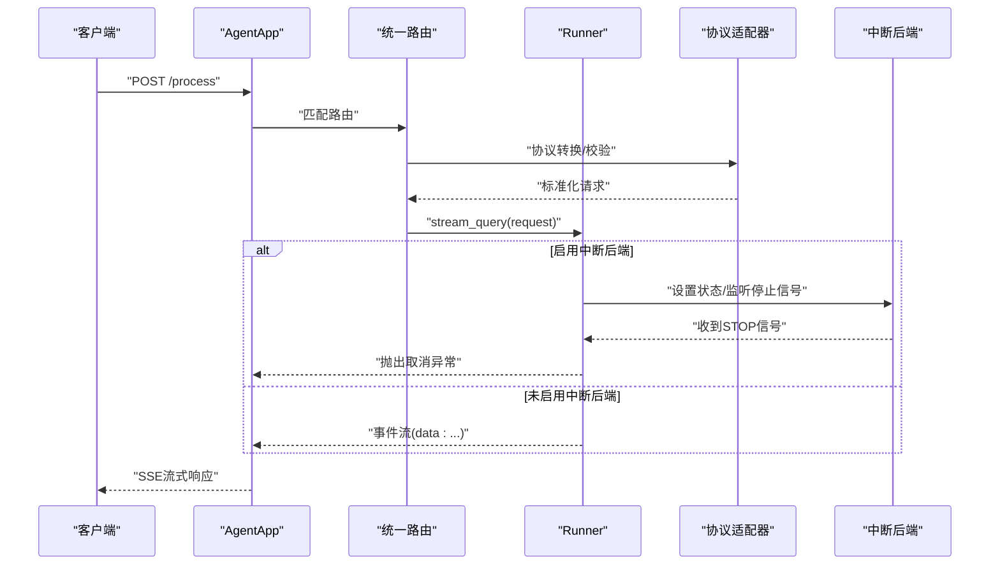
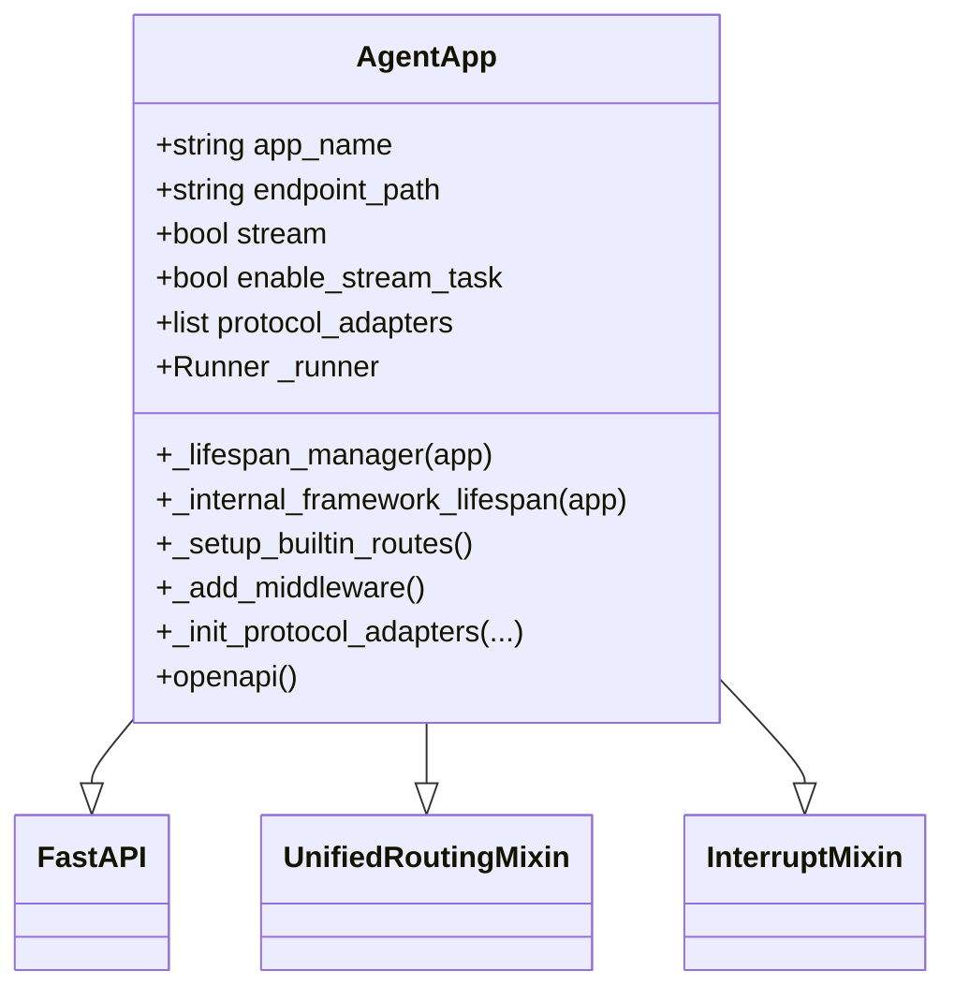
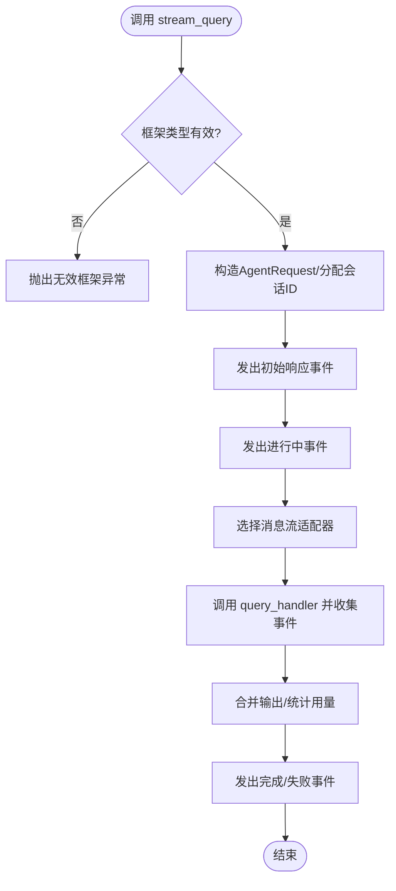
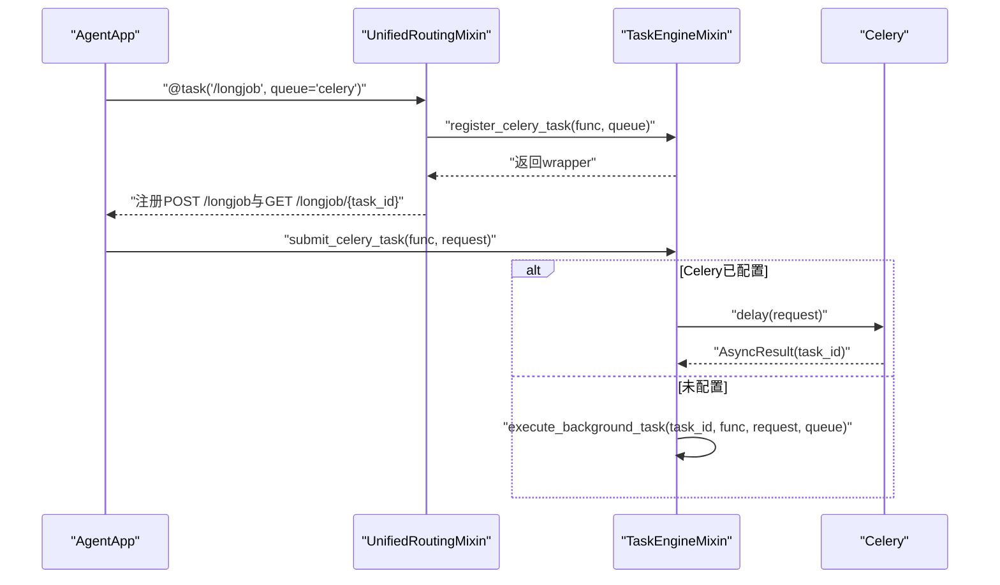
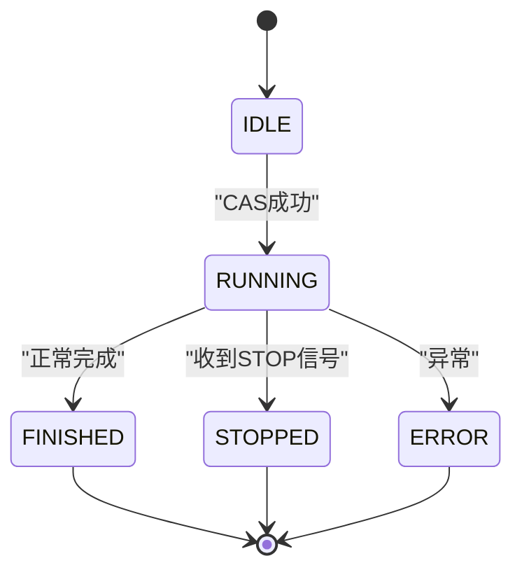
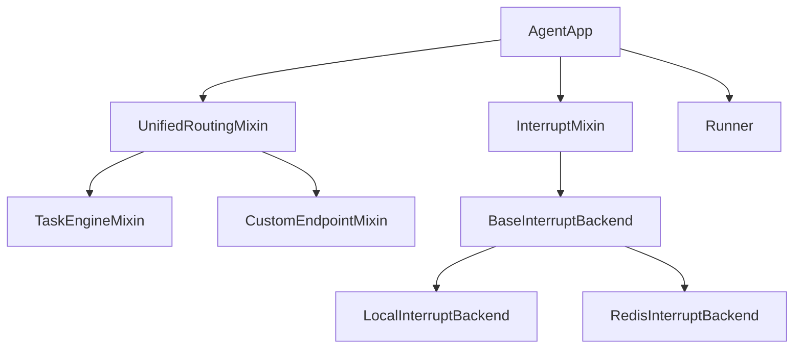

# AgentApp应用框架

<cite>
**本文引用的文件**
- [agent_app.py](file://src/agentscope_runtime/engine/app/agent_app.py)
- [runner.py](file://src/agentscope_runtime/engine/helpers/runner.py)
- [unified_routing_mixin.py](file://src/agentscope_runtime/engine/deployers/utils/service_utils/routing/unified_routing_mixin.py)
- [interrupt_mixin.py](file://src/agentscope_runtime/engine/deployers/utils/service_utils/interrupt/interrupt_mixin.py)
- [task_engine_mixin.py](file://src/agentscope_runtime/engine/deployers/utils/service_utils/routing/task_engine_mixin.py)
- [custom_endpoint_mixin.py](file://src/agentscope_runtime/engine/deployers/utils/service_utils/routing/custom_endpoint_mixin.py)
- [base_backend.py](file://src/agentscope_runtime/engine/deployers/utils/service_utils/interrupt/base_backend.py)
- [local_backend.py](file://src/agentscope_runtime/engine/deployers/utils/service_utils/interrupt/local_backend.py)
- [redis_backend.py](file://src/agentscope_runtime/engine/deployers/utils/service_utils/interrupt/redis_backend.py)
- [celery_mixin.py](file://src/agentscope_runtime/engine/app/celery_mixin.py)
- [agent_app.md](file://cookbook/en/agent_app.md)
- [interrupt_and_restore_example.py](file://examples/interrupt/interrupt_and_restore_example.py)
</cite>

## 目录
1. [简介](#简介)
2. [项目结构](#项目结构)
3. [核心组件](#核心组件)
4. [架构总览](#架构总览)
5. [详细组件分析](#详细组件分析)
6. [依赖分析](#依赖分析)
7. [性能考虑](#性能考虑)
8. [故障排查指南](#故障排查指南)
9. [结论](#结论)
10. [附录](#附录)

## 简介
AgentApp是AgentScope Runtime中的统一应用服务封装，它以FastAPI为核心，深度集成了Runner运行时与任务中断管理能力，提供：
- 全面兼容FastAPI生态（路由、中间件、生命周期）
- 实时流式响应（SSE）
- 分布式任务中断与状态管理
- 内置健康检查与信息发现端点
- 可选的Celery异步任务队列
- 支持本地/远程部署

AgentApp通过混入模式（Mixin）将统一路由、任务引擎、中断后端等能力组合到FastAPI中，形成“协议适配 + 流式推理 + 中断控制 + 路由扩展”的一体化框架。

## 项目结构
AgentApp位于引擎模块的app目录下，配合Runner、路由混入、中断混入以及任务引擎实现完整的生命周期与运行时能力。

图表来源
- [agent_app.py:60-220](file://src/agentscope_runtime/engine/app/agent_app.py#L60-L220)
- [unified_routing_mixin.py:16-253](file://src/agentscope_runtime/engine/deployers/utils/service_utils/routing/unified_routing_mixin.py#L16-L253)
- [task_engine_mixin.py:13-391](file://src/agentscope_runtime/engine/deployers/utils/service_utils/routing/task_engine_mixin.py#L13-L391)
- [interrupt_mixin.py:8-151](file://src/agentscope_runtime/engine/deployers/utils/service_utils/interrupt/interrupt_mixin.py#L8-L151)
- [base_backend.py:25-90](file://src/agentscope_runtime/engine/deployers/utils/service_utils/interrupt/base_backend.py#L25-L90)

章节来源
- [agent_app.py:60-220](file://src/agentscope_runtime/engine/app/agent_app.py#L60-L220)
- [unified_routing_mixin.py:16-253](file://src/agentscope_runtime/engine/deployers/utils/service_utils/routing/unified_routing_mixin.py#L16-L253)

## 核心组件
- AgentApp：继承FastAPI，集成统一路由与中断能力，负责协议适配、内置路由、生命周期管理、中间件与任务端点注册。
- Runner：推理执行器，负责根据框架类型选择消息流适配器，生成事件序列，并支持流式输出。
- UnifiedRoutingMixin：提供统一路由与任务装饰器，支持自定义端点与后台任务提交/查询。
- InterruptMixin：提供分布式中断能力，基于后端（本地或Redis）进行状态管理与信号订阅。
- TaskEngineMixin：任务引擎核心，支持Celery与内存两种模式的任务执行与状态管理。
- ProtocolAdapters：协议适配器集合，用于在不同协议（如A2A、ResponseAPI、AGUI）间转换请求/响应。

章节来源
- [agent_app.py:60-220](file://src/agentscope_runtime/engine/app/agent_app.py#L60-L220)
- [runner.py:46-356](file://src/agentscope_runtime/engine/helpers/runner.py#L46-L356)
- [unified_routing_mixin.py:16-253](file://src/agentscope_runtime/engine/deployers/utils/service_utils/routing/unified_routing_mixin.py#L16-L253)
- [interrupt_mixin.py:8-151](file://src/agentscope_runtime/engine/deployers/utils/service_utils/interrupt/interrupt_mixin.py#L8-L151)
- [task_engine_mixin.py:13-391](file://src/agentscope_runtime/engine/deployers/utils/service_utils/routing/task_engine_mixin.py#L13-L391)

## 架构总览
AgentApp在启动时构建Runner、挂载协议适配器、注册内置端点与自定义端点，并在生命周期内协调中断服务与任务清理工作。

图表来源
- [agent_app.py:248-316](file://src/agentscope_runtime/engine/app/agent_app.py#L248-L316)
- [runner.py:199-356](file://src/agentscope_runtime/engine/helpers/runner.py#L199-L356)
- [interrupt_mixin.py:38-139](file://src/agentscope_runtime/engine/deployers/utils/service_utils/interrupt/interrupt_mixin.py#L38-L139)

## 详细组件分析

### AgentApp类与生命周期管理
- 继承关系：AgentApp同时继承FastAPI、UnifiedRoutingMixin与InterruptMixin，从而具备统一路由、任务引擎与中断能力。
- 初始化参数：支持应用名称、描述、端点路径、响应类型、是否流式、请求模型、Runner实例、协议适配器列表、自定义端点元数据、部署模式、中断后端或Redis连接串等。
- 生命周期管理：通过内部与用户提供的lifespan组合，先构建Runner、挂载协议适配器、注册内置端点，再执行用户逻辑；退出时统一清理Runner、中断服务与任务清理协程。
- 协议适配器：默认初始化A2A、ResponseAPI与AGUI适配器，用于在不同协议间转换请求/响应。
- 中间件：添加CORS与动态部署模式中间件，自动注入进程/部署模式头信息。
- 内置端点：/health、/（根）、/shutdown、/admin/shutdown、/admin/status等。

图表来源
- [agent_app.py:60-220](file://src/agentscope_runtime/engine/app/agent_app.py#L60-L220)

章节来源
- [agent_app.py:124-220](file://src/agentscope_runtime/engine/app/agent_app.py#L124-L220)
- [agent_app.py:248-316](file://src/agentscope_runtime/engine/app/agent_app.py#L248-L316)
- [agent_app.py:382-425](file://src/agentscope_runtime/engine/app/agent_app.py#L382-L425)

### Runner推理执行器
- 负责根据framework_type选择对应的消息流适配器，将query_handler的输出转换为标准事件流。
- 提供start/stop生命周期、部署能力、流式查询stream_query与错误包装。
- 支持多种框架类型（agentscope、autogen、agno、langgraph、ms_agent_framework），并通过适配器将输入/输出转换为统一格式。

图表来源
- [runner.py:199-356](file://src/agentscope_runtime/engine/helpers/runner.py#L199-L356)

章节来源
- [runner.py:46-356](file://src/agentscope_runtime/engine/helpers/runner.py#L46-L356)

### 统一路由混合器（UnifiedRoutingMixin）
- 提供装饰器task与endpoint，分别用于注册后台任务与自定义端点。
- 支持同步/异步/生成器函数，自动包装为SSE流式响应或普通JSON响应。
- 提供自定义端点元数据同步与恢复能力，便于持久化/迁移场景。
- 内部路由标记机制，避免将内部系统路由暴露给外部发现。

图表来源
- [unified_routing_mixin.py:25-101](file://src/agentscope_runtime/engine/deployers/utils/service_utils/routing/unified_routing_mixin.py#L25-L101)
- [task_engine_mixin.py:65-115](file://src/agentscope_runtime/engine/deployers/utils/service_utils/routing/task_engine_mixin.py#L65-L115)

章节来源
- [unified_routing_mixin.py:16-253](file://src/agentscope_runtime/engine/deployers/utils/service_utils/routing/unified_routing_mixin.py#L16-L253)
- [custom_endpoint_mixin.py:15-235](file://src/agentscope_runtime/engine/deployers/utils/service_utils/routing/custom_endpoint_mixin.py#L15-L235)
- [task_engine_mixin.py:13-391](file://src/agentscope_runtime/engine/deployers/utils/service_utils/routing/task_engine_mixin.py#L13-L391)

### 中断混合器（InterruptMixin）与后端
- 提供run_and_stream包装器，在分布式后端上对生成器进行中断监听与状态管理。
- 基于compare_and_set_state确保同一会话仅允许一个RUNNING任务，防止并发冲突。
- 支持本地内存与Redis两种后端，前者适合单机开发，后者适合分布式生产环境。
- 提供stop_chat广播停止信号的能力，支持跨节点中断。

图表来源
- [interrupt_mixin.py:38-139](file://src/agentscope_runtime/engine/deployers/utils/service_utils/interrupt/interrupt_mixin.py#L38-L139)
- [base_backend.py:7-90](file://src/agentscope_runtime/engine/deployers/utils/service_utils/interrupt/base_backend.py#L7-L90)
- [local_backend.py:9-132](file://src/agentscope_runtime/engine/deployers/utils/service_utils/interrupt/local_backend.py#L9-L132)
- [redis_backend.py:7-107](file://src/agentscope_runtime/engine/deployers/utils/service_utils/interrupt/redis_backend.py#L7-L107)

章节来源
- [interrupt_mixin.py:8-151](file://src/agentscope_runtime/engine/deployers/utils/service_utils/interrupt/interrupt_mixin.py#L8-L151)
- [base_backend.py:25-90](file://src/agentscope_runtime/engine/deployers/utils/service_utils/interrupt/base_backend.py#L25-L90)
- [local_backend.py:9-132](file://src/agentscope_runtime/engine/deployers/utils/service_utils/interrupt/local_backend.py#L9-L132)
- [redis_backend.py:7-107](file://src/agentscope_runtime/engine/deployers/utils/service_utils/interrupt/redis_backend.py#L7-L107)

### 任务清理与流式任务端点
- AgentApp提供流式任务后台执行能力，仅存储最终响应，减少内存占用。
- 支持Celery与内存两种模式，Celery模式需要运行worker或启用嵌入式worker。
- 提供定时清理过期任务的后台协程，默认每5分钟清理一次。

章节来源
- [agent_app.py:460-471](file://src/agentscope_runtime/engine/app/agent_app.py#L460-L471)
- [agent_app.py:497-597](file://src/agentscope_runtime/engine/app/agent_app.py#L497-L597)
- [task_engine_mixin.py:241-347](file://src/agentscope_runtime/engine/deployers/utils/service_utils/routing/task_engine_mixin.py#L241-L347)

### 与Runner的集成与协议适配器
- AgentApp在生命周期中绑定Runner的query/init/shutdown处理器，并根据framework_type选择适配器。
- 协议适配器集合默认包含A2A、ResponseAPI与AGUI适配器，可扩展其他协议。
- OpenAPI Schema中注入协议相关模型定义，便于客户端生成SDK。

章节来源
- [agent_app.py:68-123](file://src/agentscope_runtime/engine/app/agent_app.py#L68-L123)
- [agent_app.py:340-357](file://src/agentscope_runtime/engine/app/agent_app.py#L340-L357)

### Celery混合器（已弃用）
- CeleryMixin已被TaskEngineMixin替代，提供更简洁的任务注册与执行能力。
- 如需Celery集成，请直接使用TaskEngineMixin或AgentApp的内置任务能力。

章节来源
- [celery_mixin.py:23-144](file://src/agentscope_runtime/engine/app/celery_mixin.py#L23-L144)

## 依赖分析
AgentApp通过混入模式组合多个能力模块，耦合度低、内聚性强，主要依赖关系如下：

图表来源
- [agent_app.py:60-220](file://src/agentscope_runtime/engine/app/agent_app.py#L60-L220)
- [unified_routing_mixin.py:16-253](file://src/agentscope_runtime/engine/deployers/utils/service_utils/routing/unified_routing_mixin.py#L16-L253)
- [interrupt_mixin.py:8-151](file://src/agentscope_runtime/engine/deployers/utils/service_utils/interrupt/interrupt_mixin.py#L8-L151)
- [base_backend.py:25-90](file://src/agentscope_runtime/engine/deployers/utils/service_utils/interrupt/base_backend.py#L25-L90)

章节来源
- [agent_app.py:60-220](file://src/agentscope_runtime/engine/app/agent_app.py#L60-L220)
- [unified_routing_mixin.py:16-253](file://src/agentscope_runtime/engine/deployers/utils/service_utils/routing/unified_routing_mixin.py#L16-L253)
- [interrupt_mixin.py:8-151](file://src/agentscope_runtime/engine/deployers/utils/service_utils/interrupt/interrupt_mixin.py#L8-L151)

## 性能考虑
- 流式任务仅保存最终响应，降低内存占用；若需中间事件，请评估业务需求与资源消耗。
- Celery模式下，合理设置并发与队列数量，避免阻塞主线程。
- 中断后端在Redis模式下具备更好的一致性与跨节点通信能力，但需关注网络延迟与可用性。
- 定时清理过期任务的周期可按业务负载调整，避免频繁I/O。

## 故障排查指南
- 生命周期钩子：使用lifespan而非旧版@init/@shutdown，确保资源正确初始化与释放。
- 中断处理：在处理函数中捕获CancelledError并手动触发底层Agent的interrupt，确保状态正确保存。
- 任务状态查询：Celery模式下通过AsyncResult查询，内存模式下通过active_tasks字典查询。
- 协议适配：确认framework_type与适配器匹配，避免类型不支持导致的异常。

章节来源
- [agent_app.md:156-233](file://cookbook/en/agent_app.md#L156-L233)
- [interrupt_and_restore_example.py:109-130](file://examples/interrupt/interrupt_and_restore_example.py#L109-L130)
- [task_engine_mixin.py:349-391](file://src/agentscope_runtime/engine/deployers/utils/service_utils/routing/task_engine_mixin.py#L349-L391)

## 结论
AgentApp通过FastAPI与Runner的深度融合，结合统一路由、任务引擎与分布式中断系统，提供了从协议适配、流式推理到任务管理与状态控制的一体化解决方案。其模块化设计便于扩展与维护，适用于从本地开发到分布式生产的多种场景。

## 附录

### 快速开始示例（路径参考）
- 创建AgentApp实例与生命周期管理：[示例路径:19-63](file://examples/interrupt/interrupt_and_restore_example.py#L19-L63)
- 自定义查询处理与状态管理：[示例路径:67-153](file://examples/interrupt/interrupt_and_restore_example.py#L67-L153)
- 中断触发端点与状态查询：[示例路径:155-169](file://examples/interrupt/interrupt_and_restore_example.py#L155-L169)
- 文档中的完整示例与说明：[文档路径:746-800](file://cookbook/en/agent_app.md#L746-L800)