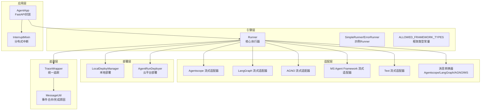
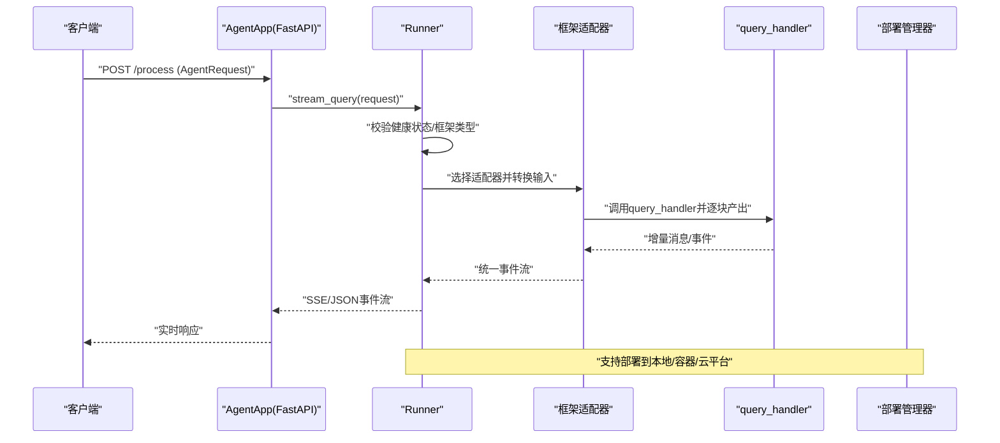
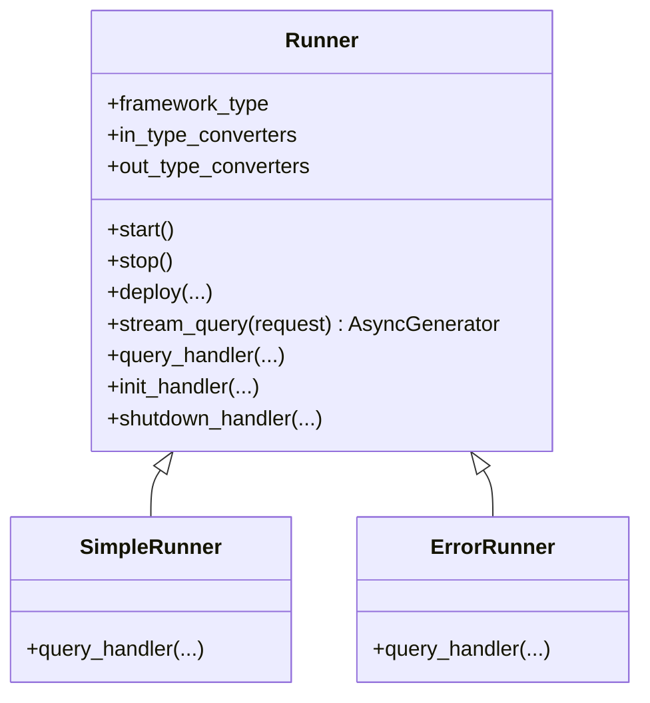
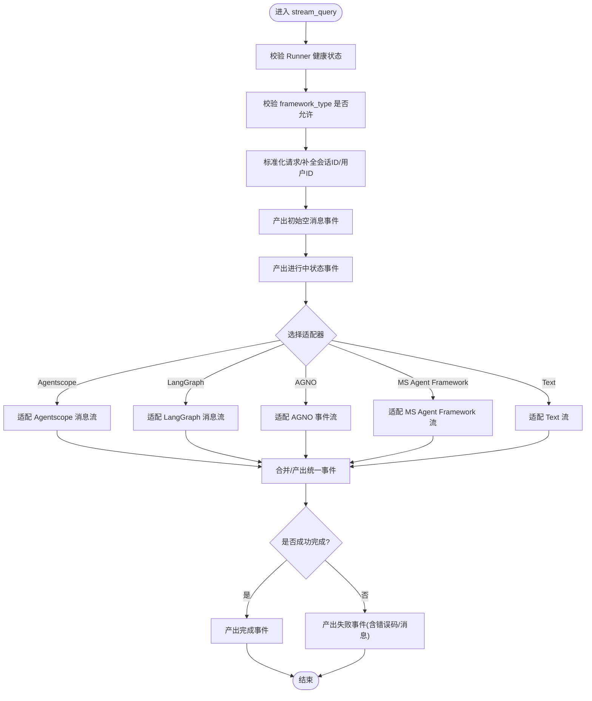
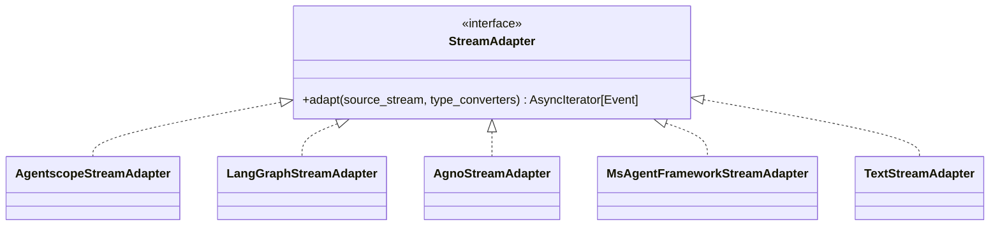
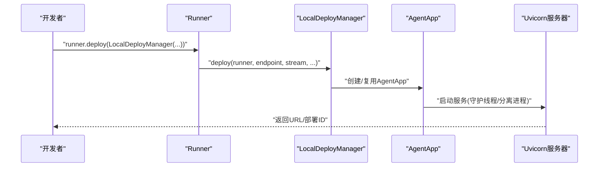
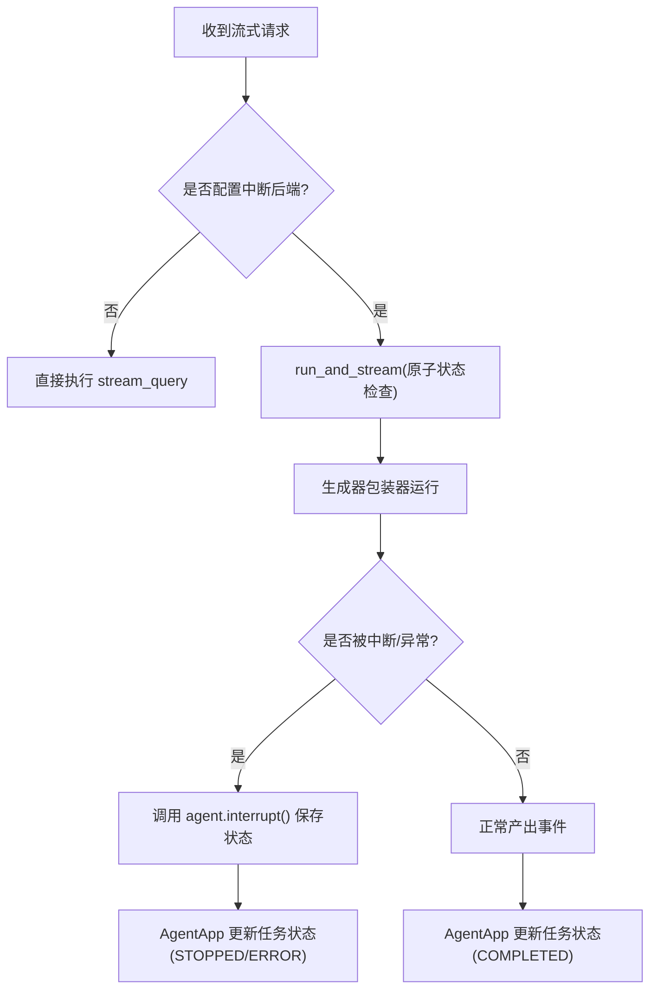
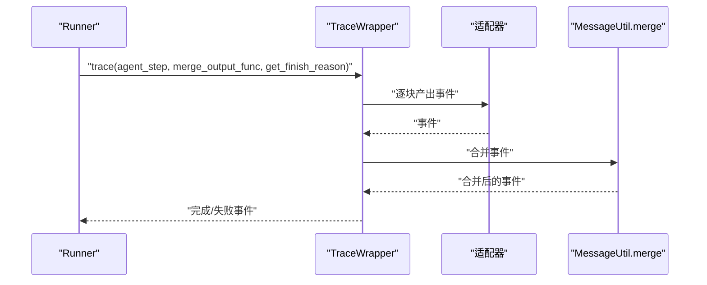
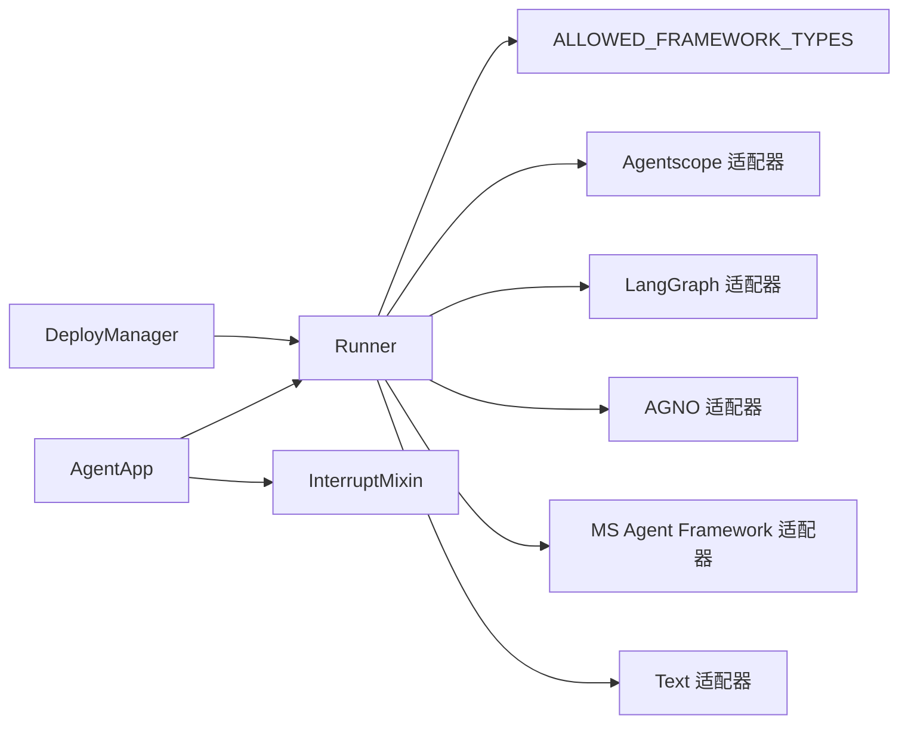

# Runner执行器

<cite>
**本文引用的文件**
- [runner.py](file://src/agentscope_runtime/engine/runner.py)
- [helpers/runner.py](file://src/agentscope_runtime/engine/helpers/runner.py)
- [constant.py](file://src/agentscope_runtime/engine/constant.py)
- [adapters/agentscope/stream.py](file://src/agentscope_runtime/adapters/agentscope/stream.py)
- [adapters/langgraph/stream.py](file://src/agentscope_runtime/adapters/langgraph/stream.py)
- [adapters/agno/stream.py](file://src/agentscope_runtime/adapters/agno/stream.py)
- [adapters/text/stream.py](file://src/agentscope_runtime/adapters/text/stream.py)
- [adapters/agentscope/message.py](file://src/agentscope_runtime/adapters/agentscope/message.py)
- [adapters/langgraph/message.py](file://src/agentscope_runtime/adapters/langgraph/message.py)
- [adapters/agno/message.py](file://src/agentscope_runtime/adapters/agno/message.py)
- [adapters/ms_agent_framework/stream.py](file://src/agentscope_runtime/adapters/ms_agent_framework/stream.py)
- [adapters/ms_agent_framework/message.py](file://src/agentscope_runtime/adapters/ms_agent_framework/message.py)
- [adapters/utils.py](file://src/agentscope_runtime/adapters/utils.py)
- [deployers/local_deployer.py](file://src/agentscope_runtime/engine/deployers/local_deployer.py)
- [deployers/agentrun_deployer.py](file://src/agentscope_runtime/engine/deployers/agentrun_deployer.py)
- [deployers/utils/service_utils/interrupt/interrupt_mixin.py](file://src/agentscope_runtime/engine/deployers/utils/service_utils/interrupt/interrupt_mixin.py)
- [engine/app/agent_app.py](file://src/agentscope_runtime/engine/app/agent_app.py)
- [engine/schemas/agent_schemas.py](file://src/agentscope_runtime/engine/schemas/agent_schemas.py)
- [engine/schemas/exception.py](file://src/agentscope_runtime/engine/schemas/exception.py)
- [engine/tracing/wrapper.py](file://src/agentscope_runtime/engine/tracing/wrapper.py)
- [engine/tracing/message_util.py](file://src/agentscope_runtime/engine/tracing/message_util.py)
- [engine/tracing/base.py](file://src/agentscope_runtime/engine/tracing/base.py)
- [engine/tracing/tracing_util.py](file://src/agentscope_runtime/engine/tracing/tracing_util.py)
- [engine/tracing/README.md](file://src/agentscope_runtime/engine/tracing/README.md)
- [examples/interrupt/interrupt_and_restore_example.py](file://examples/interrupt/interrupt_and_restore_example.py)
- [tests/unit/test_runner_stream.py](file://tests/unit/test_runner_stream.py)
</cite>

## 目录
1. [简介](#简介)
2. [项目结构](#项目结构)
3. [核心组件](#核心组件)
4. [架构总览](#架构总览)
5. [详细组件分析](#详细组件分析)
6. [依赖分析](#依赖分析)
7. [性能考虑](#性能考虑)
8. [故障排查指南](#故障排查指南)
9. [结论](#结论)
10. [附录](#附录)

## 简介
Runner执行器是智能体逻辑执行的核心引擎，负责统一接收请求、适配不同智能体框架（如AgentScope、LangGraph、AutoGen、AGNO、MS Agent Framework等）、驱动查询处理、生成事件流、管理状态与生命周期，并通过部署器对外提供可扩展的服务化能力。它支持同步与流式两种查询模式，具备完善的错误处理、资源管理与中断控制机制。

## 项目结构
本节聚焦与Runner直接相关的核心模块及其职责划分：
- 引擎层：Runner定义与通用逻辑、辅助Runner示例、常量与协议类型
- 适配层：针对各智能体框架的消息/流式适配器
- 部署层：本地与云平台部署管理器
- 应用层：基于FastAPI的AgentApp封装Runner并提供统一路由与中断支持
- 追踪层：统一追踪与事件合并工具
- 示例与测试：验证Runner在不同框架下的流式输出与中断恢复

**图表来源**
- [runner.py:46-356](file://src/agentscope_runtime/engine/runner.py#L46-L356)
- [helpers/runner.py:13-41](file://src/agentscope_runtime/engine/helpers/runner.py#L13-L41)
- [constant.py:2-9](file://src/agentscope_runtime/engine/constant.py#L2-L9)
- [adapters/agentscope/stream.py:33-684](file://src/agentscope_runtime/adapters/agentscope/stream.py#L33-L684)
- [adapters/langgraph/stream.py:28-257](file://src/agentscope_runtime/adapters/langgraph/stream.py#L28-L257)
- [adapters/agno/stream.py:32-124](file://src/agentscope_runtime/adapters/agno/stream.py#L32-L124)
- [adapters/ms_agent_framework/stream.py](file://src/agentscope_runtime/adapters/ms_agent_framework/stream.py)
- [adapters/text/stream.py](file://src/agentscope_runtime/adapters/text/stream.py)
- [adapters/agentscope/message.py](file://src/agentscope_runtime/adapters/agentscope/message.py)
- [adapters/langgraph/message.py](file://src/agentscope_runtime/adapters/langgraph/message.py)
- [adapters/agno/message.py](file://src/agentscope_runtime/adapters/agno/message.py)
- [adapters/ms_agent_framework/message.py](file://src/agentscope_runtime/adapters/ms_agent_framework/message.py)
- [deployers/local_deployer.py:27-645](file://src/agentscope_runtime/engine/deployers/local_deployer.py#L27-L645)
- [deployers/agentrun_deployer.py:125-163](file://src/agentscope_runtime/engine/deployers/agentrun_deployer.py#L125-L163)
- [engine/app/agent_app.py:60-200](file://src/agentscope_runtime/engine/app/agent_app.py#L60-L200)
- [engine/tracing/wrapper.py](file://src/agentscope_runtime/engine/tracing/wrapper.py)
- [engine/tracing/message_util.py](file://src/agentscope_runtime/engine/tracing/message_util.py)

**章节来源**
- [runner.py:46-356](file://src/agentscope_runtime/engine/runner.py#L46-L356)
- [engine/app/agent_app.py:60-200](file://src/agentscope_runtime/engine/app/agent_app.py#L60-L200)

## 核心组件
- Runner：统一的执行器接口，提供启动/停止、部署、流式查询与错误处理；根据framework_type选择对应适配器，将底层智能体输出转换为统一事件流。
- SimpleRunner/ErrorRunner：示例Runner，演示如何实现query_handler并返回流式增量。
- 适配器：将不同框架的消息/事件转换为统一的事件模型（文本增量、工具调用、工具结果、推理内容等）。
- 部署管理器：LocalDeployManager/AgentRunDeployer等，负责打包、构建镜像、启动服务或云端部署。
- AgentApp：基于FastAPI的应用封装，注入Runner、统一路由、中断支持与生命周期管理。
- 追踪与事件合并：统一追踪装饰器与消息合并工具，确保事件序列正确性与完成状态。

**章节来源**
- [runner.py:46-356](file://src/agentscope_runtime/engine/runner.py#L46-L356)
- [helpers/runner.py:13-41](file://src/agentscope_runtime/engine/helpers/runner.py#L13-L41)
- [constant.py:2-9](file://src/agentscope_runtime/engine/constant.py#L2-L9)
- [engine/app/agent_app.py:60-200](file://src/agentscope_runtime/engine/app/agent_app.py#L60-L200)

## 架构总览
Runner在系统中的位置与交互如下：

**图表来源**
- [runner.py:193-356](file://src/agentscope_runtime/engine/runner.py#L193-L356)
- [engine/app/agent_app.py:60-200](file://src/agentscope_runtime/engine/app/agent_app.py#L60-L200)
- [deployers/local_deployer.py:68-174](file://src/agentscope_runtime/engine/deployers/local_deployer.py#L68-L174)

## 详细组件分析

### Runner类与生命周期
- 初始化与健康检查：保存框架类型、输入/输出类型转换器、部署管理器集合与退出栈。
- 启动/停止：start调用init_handler（若存在），设置健康标志；stop调用shutdown_handler与退出栈，清理部署管理器。
- 部署：通过deploy_manager.deploy将Runner包装为服务，支持本地线程/分离进程模式与云端部署。
- 流式查询：stream_query对请求进行标准化、分配会话ID与用户ID、生成初始响应与进度事件，按framework_type选择适配器，最终产出完成/失败事件。

**图表来源**
- [runner.py:46-121](file://src/agentscope_runtime/engine/runner.py#L46-L121)
- [helpers/runner.py:13-41](file://src/agentscope_runtime/engine/helpers/runner.py#L13-L41)

**章节来源**
- [runner.py:46-121](file://src/agentscope_runtime/engine/runner.py#L46-L121)
- [helpers/runner.py:13-41](file://src/agentscope_runtime/engine/helpers/runner.py#L13-L41)

### 查询处理机制与流式实现
- 请求标准化：支持字典或模型对象，自动补全session_id与user_id。
- 事件序列：先产出空消息（表示开始），再产出进行中状态，随后由适配器将底层输出转换为统一事件。
- 适配器选择：根据framework_type动态导入对应适配器，将底层消息转换为统一的Message/Content事件。
- 统一事件模型：文本增量、推理内容、工具调用/结果、多媒体内容等，均映射为统一的数据结构。
- 完成与失败：捕获异常并转换为统一错误对象，最终产出完成或失败事件。

**图表来源**
- [runner.py:193-356](file://src/agentscope_runtime/engine/runner.py#L193-L356)
- [adapters/agentscope/stream.py:33-684](file://src/agentscope_runtime/adapters/agentscope/stream.py#L33-L684)
- [adapters/langgraph/stream.py:28-257](file://src/agentscope_runtime/adapters/langgraph/stream.py#L28-L257)
- [adapters/agno/stream.py:32-124](file://src/agentscope_runtime/adapters/agno/stream.py#L32-L124)
- [adapters/ms_agent_framework/stream.py](file://src/agentscope_runtime/adapters/ms_agent_framework/stream.py)
- [adapters/text/stream.py](file://src/agentscope_runtime/adapters/text/stream.py)

**章节来源**
- [runner.py:193-356](file://src/agentscope_runtime/engine/runner.py#L193-L356)

### 适配器与框架集成
- Agentscope适配器：支持文本、推理、工具调用/结果、多媒体内容的增量与完成事件，支持自定义类型转换器。
- LangGraph适配器：支持Human/AI/System/Tool消息，工具调用分片聚合，最终产出统一事件。
- AGNO适配器：基于RunStarted/RunContent/ToolCall等事件，产出统一消息与工具调用/结果事件。
- MS Agent Framework适配器：与消息转换器配合，将框架消息映射为统一事件。
- Text适配器：最简实现，适合纯文本场景。

**图表来源**
- [adapters/agentscope/stream.py:33-684](file://src/agentscope_runtime/adapters/agentscope/stream.py#L33-L684)
- [adapters/langgraph/stream.py:28-257](file://src/agentscope_runtime/adapters/langgraph/stream.py#L28-L257)
- [adapters/agno/stream.py:32-124](file://src/agentscope_runtime/adapters/agno/stream.py#L32-L124)
- [adapters/ms_agent_framework/stream.py](file://src/agentscope_runtime/adapters/ms_agent_framework/stream.py)
- [adapters/text/stream.py](file://src/agentscope_runtime/adapters/text/stream.py)

**章节来源**
- [adapters/agentscope/stream.py:33-684](file://src/agentscope_runtime/adapters/agentscope/stream.py#L33-L684)
- [adapters/langgraph/stream.py:28-257](file://src/agentscope_runtime/adapters/langgraph/stream.py#L28-L257)
- [adapters/agno/stream.py:32-124](file://src/agentscope_runtime/adapters/agno/stream.py#L32-L124)
- [adapters/ms_agent_framework/stream.py](file://src/agentscope_runtime/adapters/ms_agent_framework/stream.py)
- [adapters/text/stream.py](file://src/agentscope_runtime/adapters/text/stream.py)

### 部署与运行时管理
- 本地部署：支持守护线程与分离进程两种模式，自动打包、启动Uvicorn服务、注册路由与回调。
- 云平台部署：读取环境变量配置网络模式、CPU/内存、会话并发与空闲超时等参数，构建运行时。
- AgentApp：注入Runner、统一路由、中断后端（本地/Redis）、生命周期钩子与任务队列。

**图表来源**
- [runner.py:122-170](file://src/agentscope_runtime/engine/runner.py#L122-L170)
- [deployers/local_deployer.py:68-174](file://src/agentscope_runtime/engine/deployers/local_deployer.py#L68-L174)
- [engine/app/agent_app.py:60-200](file://src/agentscope_runtime/engine/app/agent_app.py#L60-L200)

**章节来源**
- [deployers/local_deployer.py:68-174](file://src/agentscope_runtime/engine/deployers/local_deployer.py#L68-L174)
- [deployers/agentrun_deployer.py:125-163](file://src/agentscope_runtime/engine/deployers/agentrun_deployer.py#L125-L163)
- [engine/app/agent_app.py:60-200](file://src/agentscope_runtime/engine/app/agent_app.py#L60-L200)

### 中断与状态管理
- 分布式中断：通过InterruptMixin与后端（本地/Redis）协调，原子地将任务状态置为RUNNING，避免并发冲突。
- AgentApp集成：在有中断后端时，流式生成器走带中断路径，支持手动停止与状态保存。
- 示例：演示在取消或异常时触发agent.interrupt()并保存会话状态，最后由AgentApp更新任务状态。

**图表来源**
- [engine/deployers/utils/service_utils/interrupt/interrupt_mixin.py:38-72](file://src/agentscope_runtime/engine/deployers/utils/service_utils/interrupt/interrupt_mixin.py#L38-L72)
- [engine/app/agent_app.py:230-265](file://src/agentscope_runtime/engine/app/agent_app.py#L230-L265)
- [examples/interrupt/interrupt_and_restore_example.py:103-152](file://examples/interrupt/interrupt_and_restore_example.py#L103-L152)

**章节来源**
- [engine/deployers/utils/service_utils/interrupt/interrupt_mixin.py:38-72](file://src/agentscope_runtime/engine/deployers/utils/service_utils/interrupt/interrupt_mixin.py#L38-L72)
- [engine/app/agent_app.py:230-265](file://src/agentscope_runtime/engine/app/agent_app.py#L230-L265)
- [examples/interrupt/interrupt_and_restore_example.py:103-152](file://examples/interrupt/interrupt_and_restore_example.py#L103-L152)

### 追踪与事件合并
- 追踪装饰器：对agent_step进行统一追踪，合并事件并计算完成原因。
- 事件合并：将底层事件合并为统一响应，便于上层消费与统计。

**图表来源**
- [runner.py:193-198](file://src/agentscope_runtime/engine/runner.py#L193-L198)
- [engine/tracing/wrapper.py](file://src/agentscope_runtime/engine/tracing/wrapper.py)
- [engine/tracing/message_util.py](file://src/agentscope_runtime/engine/tracing/message_util.py)

**章节来源**
- [runner.py:193-198](file://src/agentscope_runtime/engine/runner.py#L193-L198)
- [engine/tracing/wrapper.py](file://src/agentscope_runtime/engine/tracing/wrapper.py)
- [engine/tracing/message_util.py](file://src/agentscope_runtime/engine/tracing/message_util.py)

## 依赖分析
- Runner依赖框架类型常量与适配器模块，通过动态导入实现多框架兼容。
- AgentApp依赖Runner与中断后端，提供统一路由与生命周期管理。
- 适配器依赖各自框架的消息模型与统一事件模型，进行转换与增量产出。
- 部署管理器依赖打包与镜像构建工具链，支持本地与云端部署。

**图表来源**
- [runner.py:20-40](file://src/agentscope_runtime/engine/runner.py#L20-L40)
- [constant.py:2-9](file://src/agentscope_runtime/engine/constant.py#L2-L9)
- [engine/app/agent_app.py:60-200](file://src/agentscope_runtime/engine/app/agent_app.py#L60-L200)

**章节来源**
- [runner.py:20-40](file://src/agentscope_runtime/engine/runner.py#L20-L40)
- [constant.py:2-9](file://src/agentscope_runtime/engine/constant.py#L2-L9)
- [engine/app/agent_app.py:60-200](file://src/agentscope_runtime/engine/app/agent_app.py#L60-L200)

## 性能考虑
- 流式最小化延迟：适配器按块产出事件，Runner仅在必要时合并与完成，降低首字节时间。
- 资源回收：Runner.stop中关闭AsyncExitStack与部署管理器，避免资源泄漏。
- 任务去重：中断后端通过原子状态检查避免同一会话并发执行。
- 镜像与缓存：部署阶段可启用构建缓存与镜像复用，缩短部署时间。
- 背压与内存：后台任务仅保留最终事件以减少内存占用（参考任务执行混合器）。

[本节为通用指导，不直接分析具体文件]

## 故障排查指南
- 启动/停止问题：确认Runner已start或使用异步上下文管理器；检查shutdown_handler异常日志。
- 框架类型错误：framework_type必须在允许列表内，否则抛出运行时异常。
- 健康状态：未启动的Runner不可调用stream_query，需先start或使用异步with。
- 错误处理：非AppBaseException会被包装为UnknownAgentException，最终以失败事件返回。
- 中断与恢复：在取消或异常时调用agent.interrupt()并保存会话状态，确保AgentApp更新任务状态。
- 日志级别：可通过命令行参数调整日志级别，便于定位问题。

**章节来源**
- [runner.py:76-121](file://src/agentscope_runtime/engine/runner.py#L76-L121)
- [runner.py:207-219](file://src/agentscope_runtime/engine/runner.py#L207-L219)
- [runner.py:338-356](file://src/agentscope_runtime/engine/runner.py#L338-L356)
- [examples/interrupt/interrupt_and_restore_example.py:103-152](file://examples/interrupt/interrupt_and_restore_example.py#L103-L152)

## 结论
Runner执行器通过清晰的接口与强大的适配机制，实现了对多种智能体框架的统一接入与流式输出。结合AgentApp的路由与中断能力、部署管理器的服务化能力以及追踪与事件合并工具，形成了从请求到响应的完整闭环。建议在生产环境中启用分布式中断后端与合适的日志级别，并通过单元测试与示例验证流式行为与错误处理。

[本节为总结性内容，不直接分析具体文件]

## 附录

### 使用示例与最佳实践
- 使用示例Runner：参考SimpleRunner/ErrorRunner，快速实现query_handler并返回增量事件。
- 单元测试验证：通过test_runner_stream验证流式输出与错误处理。
- 中断与恢复：参考interrupt_and_restore_example，演示手动中断与状态保存。

**章节来源**
- [helpers/runner.py:13-41](file://src/agentscope_runtime/engine/helpers/runner.py#L13-L41)
- [tests/unit/test_runner_stream.py:30-78](file://tests/unit/test_runner_stream.py#L30-L78)
- [examples/interrupt/interrupt_and_restore_example.py:103-152](file://examples/interrupt/interrupt_and_restore_example.py#L103-L152)