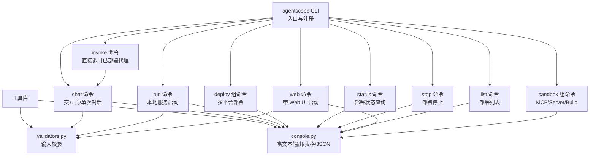
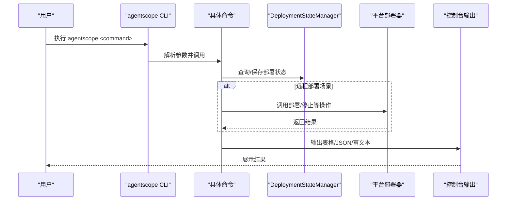
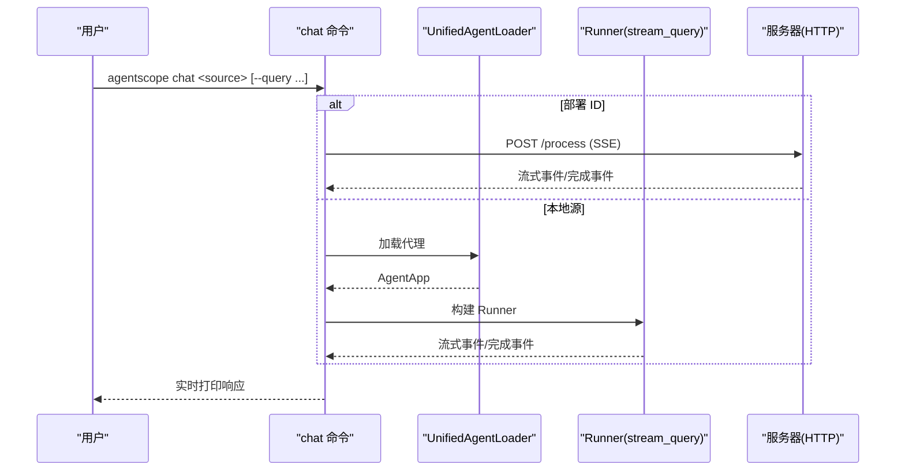
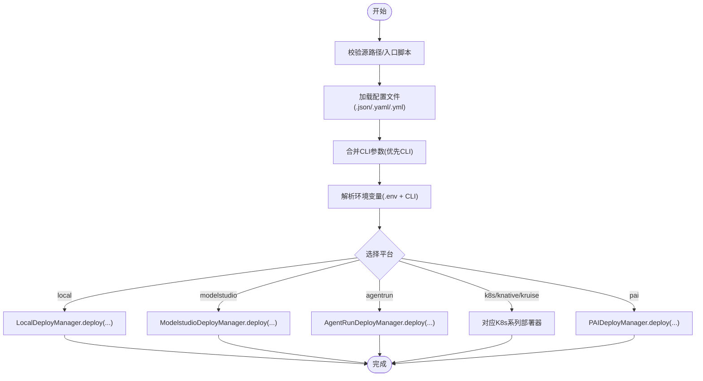
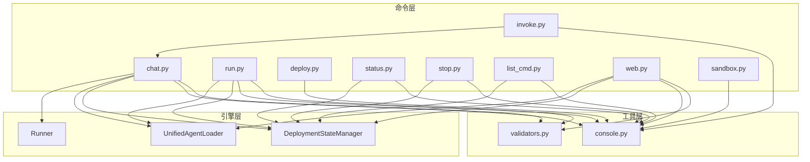

# 命令行工具

<cite>
**本文引用的文件**
- [cli.py](file://src/agentscope_runtime/cli/cli.py)
- [chat.py](file://src/agentscope_runtime/cli/commands/chat.py)
- [run.py](file://src/agentscope_runtime/cli/commands/run.py)
- [deploy.py](file://src/agentscope_runtime/cli/commands/deploy.py)
- [status.py](file://src/agentscope_runtime/cli/commands/status.py)
- [stop.py](file://src/agentscope_runtime/cli/commands/stop.py)
- [invoke.py](file://src/agentscope_runtime/cli/commands/invoke.py)
- [list_cmd.py](file://src/agentscope_runtime/cli/commands/list_cmd.py)
- [web.py](file://src/agentscope_runtime/cli/commands/web.py)
- [sandbox.py](file://src/agentscope_runtime/cli/commands/sandbox.py)
- [validators.py](file://src/agentscope_runtime/cli/utils/validators.py)
- [console.py](file://src/agentscope_runtime/cli/utils/console.py)
</cite>

## 目录
1. [简介](#简介)
2. [项目结构](#项目结构)
3. [核心组件](#核心组件)
4. [架构总览](#架构总览)
5. [详细组件分析](#详细组件分析)
6. [依赖分析](#依赖分析)
7. [性能考虑](#性能考虑)
8. [故障排除指南](#故障排除指南)
9. [结论](#结论)
10. [附录](#附录)

## 简介
本文件面向命令行工具系统，系统性梳理 agentscope 命令行工具的架构与各子命令实现，重点覆盖以下方面：
- 架构设计：基于 Click 的统一入口与命令分组，结合状态管理与平台适配器的模块化组织
- 子命令详解：chat（交互式聊天）、run（应用启动与调试）、deploy（部署管理）、status（状态查询）、stop（进程停止）、invoke（直接调用）、list（部署列表）、web（带 Web UI 启动）、sandbox（沙箱管理）
- 使用方法：参数说明、典型示例与最佳实践
- 配置与环境：输入校验、输出格式、环境变量与日志控制
- 故障排除：常见错误与定位建议

## 项目结构
命令行工具位于 src/agentscope_runtime/cli 目录下，采用“命令分组 + 子命令”的组织方式：
- 入口与注册：cli.py 定义主 group，并注册所有子命令
- 子命令：commands 下按功能划分文件，如 chat.py、run.py、deploy.py 等
- 工具库：utils 下提供输入校验 validators.py 与富文本输出 console.py
- 辅助命令：list_cmd.py 提供 list 别名；web.py 提供 web UI 启动；sandbox.py 聚合沙箱相关命令

图表来源
- [cli.py:30-54](file://src/agentscope_runtime/cli/cli.py#L30-L54)
- [chat.py:44-109](file://src/agentscope_runtime/cli/commands/chat.py#L44-L109)
- [run.py:26-91](file://src/agentscope_runtime/cli/commands/run.py#L26-L91)
- [deploy.py:301-317](file://src/agentscope_runtime/cli/commands/deploy.py#L301-L317)
- [status.py:17-37](file://src/agentscope_runtime/cli/commands/status.py#L17-L37)
- [stop.py:99-125](file://src/agentscope_runtime/cli/commands/stop.py#L99-L125)
- [invoke.py:11-44](file://src/agentscope_runtime/cli/commands/invoke.py#L11-L44)
- [list_cmd.py:19-60](file://src/agentscope_runtime/cli/commands/list_cmd.py#L19-L60)
- [web.py:73-118](file://src/agentscope_runtime/cli/commands/web.py#L73-L118)
- [sandbox.py:14-27](file://src/agentscope_runtime/cli/commands/sandbox.py#L14-L27)

章节来源
- [cli.py:10-54](file://src/agentscope_runtime/cli/cli.py#L10-L54)

## 核心组件
- CLI 主入口与注册
  - 定义 @click.group() 并注册 chat、run、web、deploy、list、status、stop、invoke、sandbox
  - 设置默认 TRACE_ENABLE_LOG 环境变量，影响日志与追踪输出
- 工具库
  - validators.py：提供源路径/端口/平台/文件/目录/URL/部署 ID 等校验
  - console.py：统一的富文本输出、表格渲染、JSON 渲染与确认提示

章节来源
- [cli.py:23-27](file://src/agentscope_runtime/cli/cli.py#L23-L27)
- [cli.py:46-54](file://src/agentscope_runtime/cli/cli.py#L46-L54)
- [validators.py:13-118](file://src/agentscope_runtime/cli/utils/validators.py#L13-L118)
- [console.py:14-379](file://src/agentscope_runtime/cli/utils/console.py#L14-L379)

## 架构总览
agentscope CLI 通过 Click 将多个子命令聚合为统一入口，各子命令根据输入类型（文件/目录/部署 ID）选择本地加载或远程 HTTP 调用路径。部署相关命令通过 DeploymentStateManager 与各平台部署器协作，实现跨平台部署与清理。

图表来源
- [cli.py:30-54](file://src/agentscope_runtime/cli/cli.py#L30-L54)
- [status.py:38-53](file://src/agentscope_runtime/cli/commands/status.py#L38-L53)
- [stop.py:126-202](file://src/agentscope_runtime/cli/commands/stop.py#L126-L202)
- [deploy.py:423-445](file://src/agentscope_runtime/cli/commands/deploy.py#L423-L445)

## 详细组件分析

### chat 命令：交互式聊天与单次查询
- 功能概述
  - 支持三种输入源：Python 文件、项目目录、部署 ID
  - 交互模式与单次查询模式
  - 支持会话 ID、用户 ID、详细日志开关
- 关键流程
  - 源类型判定：本地加载或远程 HTTP
  - 生成/复用会话 ID
  - 流式/非流式响应处理，支持过滤推理消息
- 参数与示例
  - --query/-q：单次查询
  - --session-id：会话标识
  - --user-id：用户标识
  - --verbose/-v：详细日志
  - --entrypoint/-e：目录源入口文件
- 注意事项
  - ModelStudio 部署不支持 HTTP 调用，需前往控制台交互
  - 非 verbose 模式会隐藏推理内容

图表来源
- [chat.py:125-247](file://src/agentscope_runtime/cli/commands/chat.py#L125-L247)
- [chat.py:249-353](file://src/agentscope_runtime/cli/commands/chat.py#L249-L353)
- [chat.py:531-641](file://src/agentscope_runtime/cli/commands/chat.py#L531-L641)

章节来源
- [chat.py:44-109](file://src/agentscope_runtime/cli/commands/chat.py#L44-L109)
- [chat.py:110-247](file://src/agentscope_runtime/cli/commands/chat.py#L110-L247)
- [chat.py:249-515](file://src/agentscope_runtime/cli/commands/chat.py#L249-L515)
- [chat.py:531-800](file://src/agentscope_runtime/cli/commands/chat.py#L531-L800)

### run 命令：应用启动与调试
- 功能概述
  - 在本地启动代理服务，持续监听请求
  - 支持主机、端口、详细日志与目录源入口
- 关键流程
  - 源类型判定：仅支持文件/目录；部署 ID 不支持
  - 加载代理并启动服务
- 参数与示例
  - --host/-h、--port/-p、--verbose/-v、--entrypoint/-e
- 注意事项
  - Ctrl+C 可优雅中断服务

章节来源
- [run.py:26-91](file://src/agentscope_runtime/cli/commands/run.py#L26-L91)
- [run.py:92-173](file://src/agentscope_runtime/cli/commands/run.py#L92-L173)

### deploy 命令组：部署管理
- 功能概述
  - 多平台部署：local、modelstudio、agentrun、k8s、knative、kruise、pai
  - 支持配置文件、环境变量、标签合并与入口脚本解析
- 关键流程
  - 校验源路径与入口脚本
  - 合并配置文件与 CLI 参数（CLI 优先）
  - 解析环境变量（支持 .env 文件与命令行）
  - 调用对应平台部署器执行部署
- 参数与示例
  - 通用：--name、--entrypoint/-e、--env/-E、--env-file、--config/-c
  - 平台特定：如 agentrun 的 --region、--cpu、--memory
- 注意事项
  - 不同平台需安装相应依赖包
  - ModelStudio/AgentRun 需要阿里云相关凭据

图表来源
- [deploy.py:92-184](file://src/agentscope_runtime/cli/commands/deploy.py#L92-L184)
- [deploy.py:186-212](file://src/agentscope_runtime/cli/commands/deploy.py#L186-L212)
- [deploy.py:241-298](file://src/agentscope_runtime/cli/commands/deploy.py#L241-L298)
- [deploy.py:354-446](file://src/agentscope_runtime/cli/commands/deploy.py#L354-L446)
- [deploy.py:480-594](file://src/agentscope_runtime/cli/commands/deploy.py#L480-L594)
- [deploy.py:637-766](file://src/agentscope_runtime/cli/commands/deploy.py#L637-L766)

章节来源
- [deploy.py:301-317](file://src/agentscope_runtime/cli/commands/deploy.py#L301-L317)
- [deploy.py:354-446](file://src/agentscope_runtime/cli/commands/deploy.py#L354-L446)
- [deploy.py:480-594](file://src/agentscope_runtime/cli/commands/deploy.py#L480-L594)
- [deploy.py:637-766](file://src/agentscope_runtime/cli/commands/deploy.py#L637-L766)

### status 命令：状态查询
- 功能概述
  - 查询指定部署 ID 的详细状态
  - 支持文本/JSON 输出
- 参数与示例
  - --output-format/-f：text 或 json
- 注意事项
  - 不存在的部署 ID 会报错

章节来源
- [status.py:17-56](file://src/agentscope_runtime/cli/commands/status.py#L17-L56)

### stop 命令：进程停止
- 功能概述
  - 停止指定部署并清理平台资源
  - 支持跳过确认
- 关键流程
  - 读取部署状态，判断平台
  - 创建对应平台部署器实例
  - 调用 stop 并更新本地状态
- 参数与示例
  - --yes/-y：跳过确认
- 注意事项
  - 若平台部署器不可用，会提示无法标记为已停止

章节来源
- [stop.py:99-205](file://src/agentscope_runtime/cli/commands/stop.py#L99-L205)

### invoke 命令：直接调用
- 功能概述
  - 对已部署代理进行一次性或交互式调用
  - 实际委托给 chat 命令实现
- 参数与示例
  - --query/-q、--session-id、--user-id
- 注意事项
  - 等价于 agentscope chat <deploy_id> [options]

章节来源
- [invoke.py:11-55](file://src/agentscope_runtime/cli/commands/invoke.py#L11-L55)

### list 命令：部署列表
- 功能概述
  - 列出所有部署，支持按状态/平台过滤与表格/JSON 输出
- 参数与示例
  - --status/-s、--platform/-p、--output-format/-f
- 注意事项
  - 无部署时输出提示信息

章节来源
- [list_cmd.py:19-99](file://src/agentscope_runtime/cli/commands/list_cmd.py#L19-L99)

### web 命令：带 Web UI 启动
- 功能概述
  - 在本地启动代理服务并集成 Web UI
  - 自动安装依赖（首次启动）
- 关键流程
  - 校验端口
  - 加载代理并启动服务（web_ui=True）
  - 注册进程清理钩子与信号处理器
- 参数与示例
  - --host/-h、--port/-p、--entrypoint/-e
- 注意事项
  - Ctrl+C 会触发清理子进程

章节来源
- [web.py:73-163](file://src/agentscope_runtime/cli/commands/web.py#L73-L163)

### sandbox 命令组：沙箱管理
- 功能概述
  - 聚合运行时沙箱相关命令：mcp、server、build
  - 通过 delegates 调用 runtime-sandbox-* 工具
- 参数与示例
  - mcp/server/build 接受任意参数透传
- 注意事项
  - 需确保运行时沙箱工具已正确安装

章节来源
- [sandbox.py:14-125](file://src/agentscope_runtime/cli/commands/sandbox.py#L14-L125)

## 依赖分析
- 组件耦合
  - 各命令均依赖 DeploymentStateManager 进行状态读写
  - chat/run/web 在本地模式依赖 UnifiedAgentLoader 与 Runner
  - deploy.* 依赖各平台部署器（可选导入）
  - console.py 作为统一输出层被广泛使用
- 输入校验
  - validators.py 提供统一的输入校验逻辑，减少重复代码
- 外部依赖
  - Click：命令定义与参数解析
  - Requests：HTTP 请求（chat 的远程模式）
  - psutil：进程生命周期管理（web 命令）

图表来源
- [validators.py:13-118](file://src/agentscope_runtime/cli/utils/validators.py#L13-L118)
- [console.py:14-379](file://src/agentscope_runtime/cli/utils/console.py#L14-L379)
- [chat.py:22-41](file://src/agentscope_runtime/cli/commands/chat.py#L22-L41)
- [run.py:12-23](file://src/agentscope_runtime/cli/commands/run.py#L12-L23)
- [web.py:14-25](file://src/agentscope_runtime/cli/commands/web.py#L14-L25)
- [deploy.py:24-29](file://src/agentscope_runtime/cli/commands/deploy.py#L24-L29)
- [status.py:9-14](file://src/agentscope_runtime/cli/commands/status.py#L9-L14)
- [stop.py:12-19](file://src/agentscope_runtime/cli/commands/stop.py#L12-L19)
- [list_cmd.py:10-16](file://src/agentscope_runtime/cli/commands/list_cmd.py#L10-L16)
- [invoke.py:7-8](file://src/agentscope_runtime/cli/commands/invoke.py#L7-L8)

章节来源
- [validators.py:13-118](file://src/agentscope_runtime/cli/utils/validators.py#L13-L118)
- [console.py:14-379](file://src/agentscope_runtime/cli/utils/console.py#L14-L379)

## 性能考虑
- 流式输出
  - chat 与 chat 的 HTTP 模式均采用 SSE 流式传输，降低延迟并提升交互体验
- 日志与追踪
  - 通过环境变量 TRACE_ENABLE_LOG 控制 JSON 日志输出，避免在非调试场景产生过多噪声
- 并发与异步
  - run 与 chat 的本地模式使用 asyncio，提高并发处理能力
- 资源清理
  - web 命令注册 atexit 与信号处理器，确保子进程安全退出

[本节为通用指导，无需列出具体文件来源]

## 故障排除指南
- 常见问题与定位
  - 源路径无效：检查文件/目录是否存在，或是否为合法部署 ID
  - 端口占用：使用 --port 指定其他端口，或释放占用端口
  - 平台部署器缺失：安装对应平台依赖（如 ModelStudio/AgentRun/K8s 等）
  - 权限不足：确认阿里云凭据或平台访问权限
  - 会话编码错误：确保终端支持 UTF-8 编码
- 建议排查步骤
  - 使用 --verbose 查看详细日志
  - 使用 --output-format=json 获取结构化输出便于分析
  - 使用 agentscope status <id> 核对部署状态与 URL
  - 使用 agentscope list 进行全局排查

章节来源
- [validators.py:27-53](file://src/agentscope_runtime/cli/utils/validators.py#L27-L53)
- [validators.py:56-67](file://src/agentscope_runtime/cli/utils/validators.py#L56-L67)
- [chat.py:389-397](file://src/agentscope_runtime/cli/commands/chat.py#L389-L397)
- [web.py:122-123](file://src/agentscope_runtime/cli/commands/web.py#L122-L123)

## 结论
agentscope 命令行工具以 Click 为核心，围绕“本地加载 + 远程 HTTP + 多平台部署器”的架构实现了从开发到部署的一体化体验。通过统一的输入校验与富文本输出，命令行工具在易用性与可观测性之间取得平衡。推荐在日常开发中结合 chat、run、web、deploy、status、stop、invoke、list、sandbox 等命令形成高效的工作流。

[本节为总结性内容，无需列出具体文件来源]

## 附录

### 开发工作流与最佳实践
- 快速验证
  - 使用 agentscope chat <agent.py> 进入交互模式，快速迭代
  - 使用 agentscope run <agent.py> 启动服务，配合外部客户端测试
- 本地调试
  - 使用 agentscope web <agent.py> 启动带 UI 的服务，便于可视化调试
- 部署上线
  - 使用 agentscope deploy local|modelstudio|agentrun|k8s 等进行部署
  - 使用 agentscope status <id> 检查部署状态
  - 使用 agentscope invoke <id> 进行线上验证
- 资源回收
  - 使用 agentscope stop <id> 停止并清理平台资源
  - 使用 agentscope list 查看并批量清理

[本节为通用指导，无需列出具体文件来源]