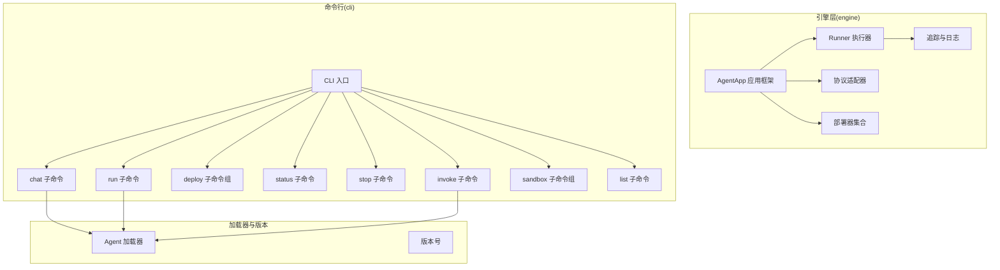
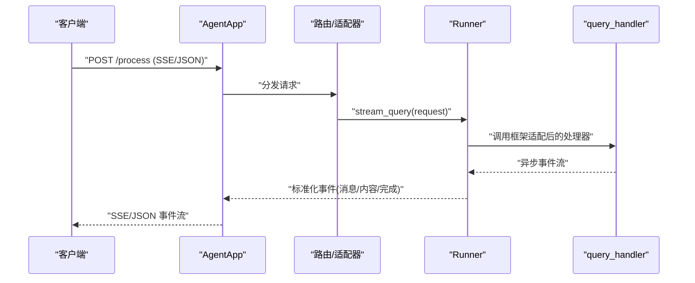
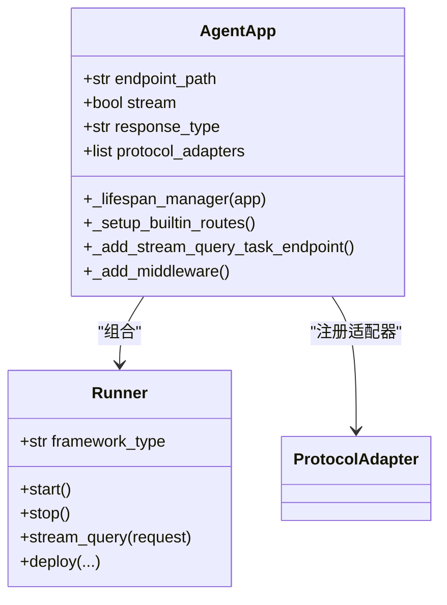
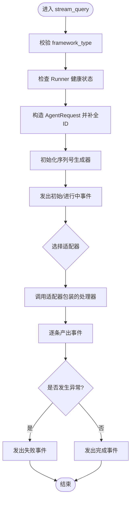
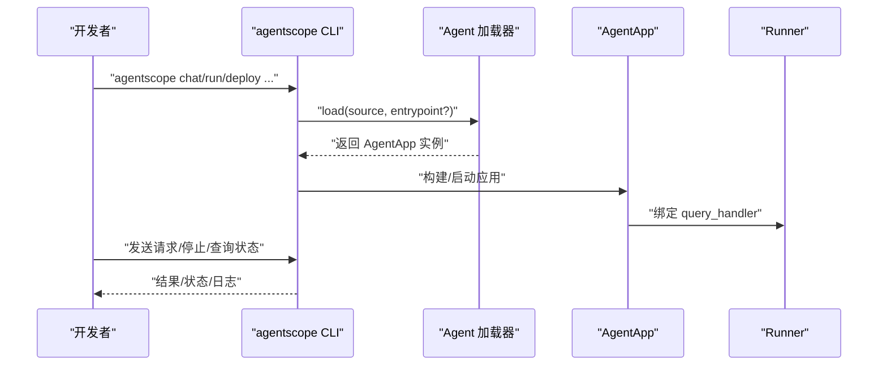
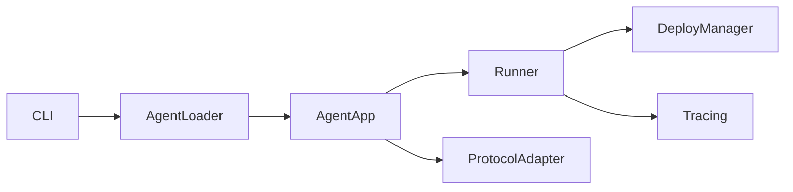

# 开发者友好

<cite>
**本文引用的文件**
- [agent_app.py](file://src/agentscope_runtime/engine/app/agent_app.py)
- [runner.py](file://src/agentscope_runtime/engine/runner.py)
- [helpers_runner.py](file://src/agentscope_runtime/engine/helpers/runner.py)
- [cli.py](file://src/agentscope_runtime/cli/cli.py)
- [chat.py](file://src/agentscope_runtime/cli/commands/chat.py)
- [run.py](file://src/agentscope_runtime/cli/commands/run.py)
- [deploy.py](file://src/agentscope_runtime/cli/commands/deploy.py)
- [status.py](file://src/agentscope_runtime/cli/commands/status.py)
- [stop.py](file://src/agentscope_runtime/cli/commands/stop.py)
- [invoke.py](file://src/agentscope_runtime/cli/commands/invoke.py)
- [sandbox.py](file://src/agentscope_runtime/cli/commands/sandbox.py)
- [list_cmd.py](file://src/agentscope_runtime/cli/commands/list_cmd.py)
- [agent_loader.py](file://src/agentscope_runtime/cli/loaders/agent_loader.py)
- [engine_init.py](file://src/agentscope_runtime/engine/__init__.py)
- [version.py](file://src/agentscope_runtime/version.py)
</cite>

## 目录
1. [简介](#简介)
2. [项目结构](#项目结构)
3. [核心组件](#核心组件)
4. [架构总览](#架构总览)
5. [详细组件分析](#详细组件分析)
6. [依赖分析](#依赖分析)
7. [性能考虑](#性能考虑)
8. [故障排查指南](#故障排查指南)
9. [结论](#结论)
10. [附录](#附录)

## 简介
本文件面向AgentScope Runtime的开发者，聚焦“开发者友好”特性，系统阐述以下内容：
- AgentApp应用框架的设计理念与使用方法：生命周期管理、配置项、协议适配与自定义扩展。
- Runner执行器的架构与执行流程：任务调度、状态管理、错误处理与性能优化。
- 命令行工具体系：chat、run、deploy、status、stop、invoke、sandbox等命令的功能与用法。
- 开发工作流、调试技巧与最佳实践，并提供可直接定位到源码的路径指引与常见问题解决方案。

## 项目结构
AgentScope Runtime采用分层模块化设计：
- engine：运行时内核，包含AgentApp应用框架、Runner执行器、部署器、协议适配、追踪与工具集。
- cli：统一命令行入口与子命令，负责本地/远程交互、部署、状态查询与沙箱管理。
- sandbox：沙箱环境构建与服务管理。
- tools：通用工具与适配器（如RAG、实时语音、生成类等）。
- examples与cookbook：示例与使用手册，覆盖部署、集成、高级用法等场景。

图表来源
- [engine_init.py:1-35](file://src/agentscope_runtime/engine/__init__.py#L1-L35)
- [cli.py:1-64](file://src/agentscope_runtime/cli/cli.py#L1-L64)

章节来源
- [engine_init.py:1-35](file://src/agentscope_runtime/engine/__init__.py#L1-L35)
- [cli.py:1-64](file://src/agentscope_runtime/cli/cli.py#L1-L64)

## 核心组件
本节从“开发者友好”的角度，梳理AgentApp与Runner两大核心组件的关键能力与使用要点。

- AgentApp
  - 集成FastAPI与Runner，支持多协议适配（A2A、Response API、AGUI），内置健康检查与信息发现端点。
  - 生命周期管理：通过FastAPI的lifespan统一管理内部Runner与用户Hook；支持before_start/after_finish钩子。
  - 中断与流式任务：支持分布式中断后端（Redis/本地）、流式任务队列与后台任务清理。
  - 自定义扩展：支持注册自定义路由、中间件与协议适配器；支持嵌入Celery Worker与流式任务端点。

- Runner
  - 统一的query_handler抽象，支持文本、AgentScope、LangGraph、AGNO、MS Agent Framework等框架类型。
  - 流式查询接口stream_query，自动注入序列号、会话与用户ID，输出标准化事件流。
  - 错误处理：捕获异常并转换为标准错误对象，保留原始异常信息。
  - 部署能力：封装多种部署器（本地、K8s、Knative、Kruise、ModelStudio、AgentRun、FC），支持容器镜像构建与打包。

章节来源
- [agent_app.py:60-320](file://src/agentscope_runtime/engine/app/agent_app.py#L60-L320)
- [runner.py:46-120](file://src/agentscope_runtime/engine/runner.py#L46-L120)
- [runner.py:193-356](file://src/agentscope_runtime/engine/runner.py#L193-L356)

## 架构总览
下图展示AgentApp与Runner在请求处理中的协作关系，以及协议适配与部署器的集成方式。

图表来源
- [agent_app.py:781-800](file://src/agentscope_runtime/engine/app/agent_app.py#L781-L800)
- [runner.py:193-356](file://src/agentscope_runtime/engine/runner.py#L193-L356)

## 详细组件分析

### AgentApp 应用框架
- 设计理念
  - 将FastAPI的Web框架能力与Runner的推理执行解耦，通过协议适配器实现多框架兼容。
  - 生命周期由FastAPI lifespan统一管理，简化启动/关闭逻辑，便于扩展。
- 关键能力
  - 协议适配：默认启用A2A、Response API、AGUI三种适配器，支持OpenAPI Schema注入。
  - 中断服务：支持Redis或本地中断后端，保障跨节点一致性。
  - 流式任务：提供后台任务提交与状态查询端点，支持Celery与内存模式。
  - 路由与中间件：内置CORS与动态部署模式响应头，支持自定义路由恢复。
- 使用方法
  - 通过装饰器注册query_handler，指定framework类型（agentscope/autogen/agno/langgraph/text）。
  - 在lifespan中编写before_start/after_finish逻辑，避免手动初始化/销毁。
  - 可选启用嵌入式Celery Worker与流式任务清理Worker，提升并发与资源回收效率。

图表来源
- [agent_app.py:124-220](file://src/agentscope_runtime/engine/app/agent_app.py#L124-L220)
- [runner.py:46-120](file://src/agentscope_runtime/engine/runner.py#L46-L120)

章节来源
- [agent_app.py:60-320](file://src/agentscope_runtime/engine/app/agent_app.py#L60-L320)
- [agent_app.py:382-520](file://src/agentscope_runtime/engine/app/agent_app.py#L382-L520)
- [agent_app.py:598-642](file://src/agentscope_runtime/engine/app/agent_app.py#L598-L642)

### Runner 执行器
- 架构与职责
  - Runner是推理执行的核心，负责：
    - 启动/停止生命周期管理；
    - 将不同框架的消息格式适配为统一事件流；
    - 生成序列号、会话ID与用户ID，确保事件有序；
    - 捕获异常并转换为标准错误对象。
- 执行流程
  - 输入校验与默认值填充；
  - 根据framework_type选择对应适配器；
  - 调用query_handler并逐条产出事件；
  - 结束时根据是否出错输出completed或failed状态。
- 性能优化
  - 事件流按delta推送，减少大块响应延迟；
  - 支持同步/异步/生成器/协程多种handler形式；
  - 提供部署接口，便于容器化与弹性扩缩容。

图表来源
- [runner.py:193-356](file://src/agentscope_runtime/engine/runner.py#L193-L356)

章节来源
- [runner.py:46-120](file://src/agentscope_runtime/engine/runner.py#L46-L120)
- [runner.py:193-356](file://src/agentscope_runtime/engine/runner.py#L193-L356)

### 命令行工具体系
- CLI入口
  - 统一注册chat、run、web、deploy、list、status、stop、invoke、sandbox等子命令。
  - 默认设置TRACE_ENABLE_LOG环境变量，控制追踪日志输出。
- chat命令
  - 支持文件/目录/部署ID三种源；单次查询与交互式REPL两种模式。
  - 支持HTTP与本地Runner两种执行路径；SSE解析与理由消息过滤。
- run命令
  - 以服务方式启动AgentApp，绑定host/port；支持verbose日志级别。
- deploy命令组
  - 支持local、modelstudio、agentrun、k8s、knative、kruise、pai等平台。
  - 支持配置文件与环境变量合并；解析.env文件与--env参数。
- status/stop/invoke/list
  - 查询部署详情、停止部署、调用已部署实例、列出所有部署。
- sandbox命令组
  - mcp、server、build三类子命令，委托给对应运行时组件。

图表来源
- [cli.py:30-55](file://src/agentscope_runtime/cli/cli.py#L30-L55)
- [agent_loader.py:238-296](file://src/agentscope_runtime/cli/loaders/agent_loader.py#L238-L296)
- [chat.py:76-247](file://src/agentscope_runtime/cli/commands/chat.py#L76-L247)
- [run.py:55-173](file://src/agentscope_runtime/cli/commands/run.py#L55-L173)
- [deploy.py:320-446](file://src/agentscope_runtime/cli/commands/deploy.py#L320-L446)
- [status.py:26-57](file://src/agentscope_runtime/cli/commands/status.py#L26-L57)
- [stop.py:107-205](file://src/agentscope_runtime/cli/commands/stop.py#L107-L205)
- [invoke.py:29-55](file://src/agentscope_runtime/cli/commands/invoke.py#L29-L55)
- [list_cmd.py:39-100](file://src/agentscope_runtime/cli/commands/list_cmd.py#L39-L100)
- [sandbox.py:29-125](file://src/agentscope_runtime/cli/commands/sandbox.py#L29-L125)

章节来源
- [cli.py:1-64](file://src/agentscope_runtime/cli/cli.py#L1-L64)
- [chat.py:76-247](file://src/agentscope_runtime/cli/commands/chat.py#L76-L247)
- [run.py:55-173](file://src/agentscope_runtime/cli/commands/run.py#L55-L173)
- [deploy.py:320-446](file://src/agentscope_runtime/cli/commands/deploy.py#L320-L446)
- [status.py:26-57](file://src/agentscope_runtime/cli/commands/status.py#L26-L57)
- [stop.py:107-205](file://src/agentscope_runtime/cli/commands/stop.py#L107-L205)
- [invoke.py:29-55](file://src/agentscope_runtime/cli/commands/invoke.py#L29-L55)
- [list_cmd.py:39-100](file://src/agentscope_runtime/cli/commands/list_cmd.py#L39-L100)
- [sandbox.py:29-125](file://src/agentscope_runtime/cli/commands/sandbox.py#L29-L125)

## 依赖分析
- 模块耦合
  - AgentApp依赖Runner与协议适配器；Runner依赖部署器与追踪工具。
  - CLI通过AgentLoader统一加载AgentApp，再驱动AgentApp与Runner。
- 外部依赖
  - FastAPI/Starlette用于Web框架；uvicorn用于生产服务；Click用于CLI。
  - 可选Redis用于分布式中断；Celery用于后台任务；Docker/K8s/Knative/Kruise等用于部署。

图表来源
- [agent_loader.py:238-296](file://src/agentscope_runtime/cli/loaders/agent_loader.py#L238-L296)
- [agent_app.py:124-220](file://src/agentscope_runtime/engine/app/agent_app.py#L124-L220)
- [runner.py:20-40](file://src/agentscope_runtime/engine/runner.py#L20-L40)

章节来源
- [agent_loader.py:1-296](file://src/agentscope_runtime/cli/loaders/agent_loader.py#L1-L296)
- [agent_app.py:124-220](file://src/agentscope_runtime/engine/app/agent_app.py#L124-L220)
- [runner.py:20-40](file://src/agentscope_runtime/engine/runner.py#L20-L40)

## 性能考虑
- 流式输出优先：通过SSE与delta内容降低首字节延迟，适合长文本生成与多轮对话。
- 事件序列化：统一的序列号生成器保证事件顺序与完整性，便于前端渲染与重放。
- 中断与清理：分布式中断后端与定期任务清理Worker，避免僵尸任务与资源泄漏。
- 部署弹性：Runner提供统一部署接口，结合容器与编排平台实现弹性扩缩容与高可用。

## 故障排查指南
- 常见问题与定位
  - “Runner未启动”：确认在调用stream_query前已通过async with Runner或显式start。
  - “框架类型无效”：检查framework_type是否在允许列表中。
  - “部署失败”：查看deploy命令输出与平台日志；确认配置文件与环境变量合并正确。
  - “chat命令无法交互”：确认目标部署平台是否支持HTTP查询；必要时使用ModelStudio控制台。
- 调试技巧
  - 使用--verbose开启详细日志与追踪输出。
  - 在AgentApp的lifespan中添加before_start/after_finish钩子，记录启动/关闭阶段的上下文。
  - 对于SSE解析问题，检查客户端是否正确处理data:行与事件类型。
- 最佳实践
  - 将业务逻辑集中在query_handler中，保持AgentApp仅做路由与适配。
  - 使用统一的类型转换器（in_type_converters/out_type_converters）处理消息格式。
  - 对外暴露最小API面，通过协议适配器屏蔽底层差异。

章节来源
- [runner.py:214-219](file://src/agentscope_runtime/engine/runner.py#L214-L219)
- [chat.py:135-150](file://src/agentscope_runtime/cli/commands/chat.py#L135-L150)
- [run.py:92-108](file://src/agentscope_runtime/cli/commands/run.py#L92-L108)

## 结论
AgentScope Runtime通过AgentApp与Runner的清晰分工、协议适配与统一CLI，为开发者提供了从本地开发到多云部署的一体化体验。借助生命周期管理、流式任务与中断服务，开发者可以快速构建稳定、可观测且易扩展的智能体服务。

## 附录
- 版本信息
  - 当前版本：v1.1.5
- 快速参考
  - CLI入口：agentscope
  - 主要命令：chat、run、deploy、status、stop、invoke、sandbox、list
  - AgentApp生命周期：lifespan + before_start/after_finish
  - Runner框架类型：agentscope、autogen、agno、langgraph、ms_agent_framework、text

章节来源
- [version.py:1-3](file://src/agentscope_runtime/version.py#L1-L3)