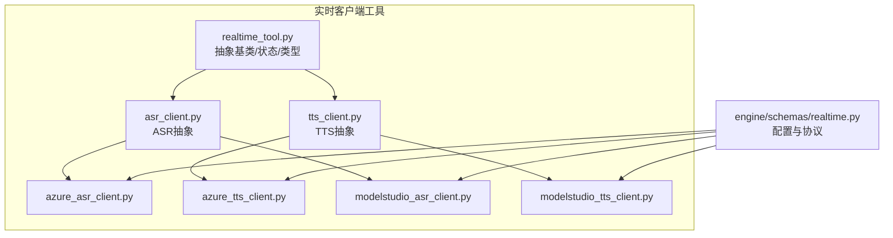
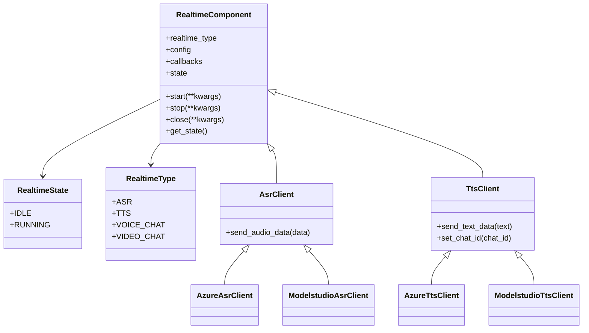
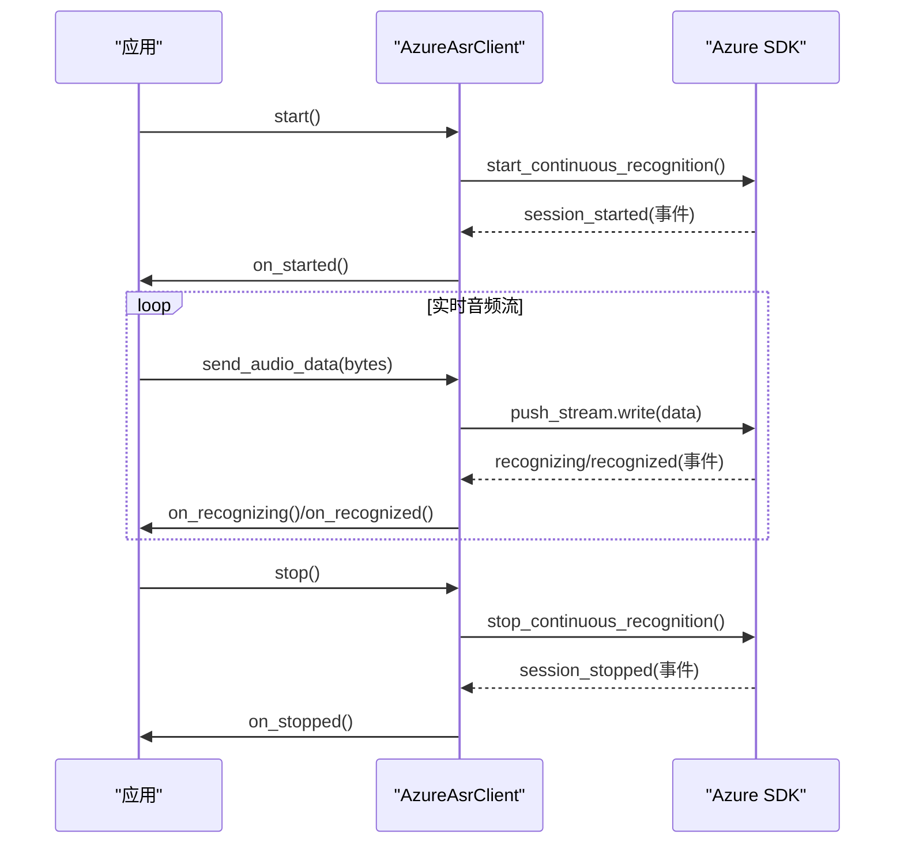
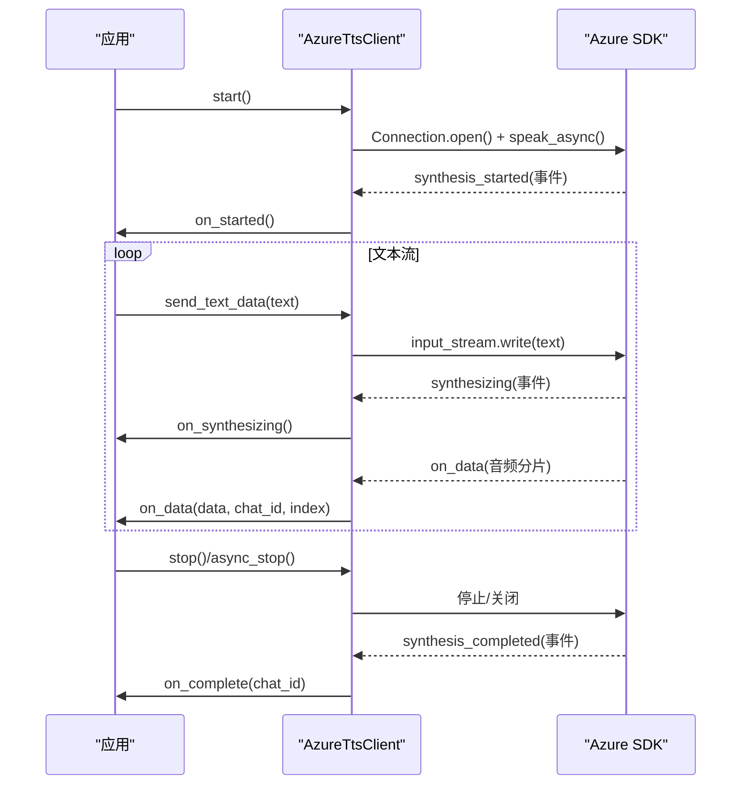
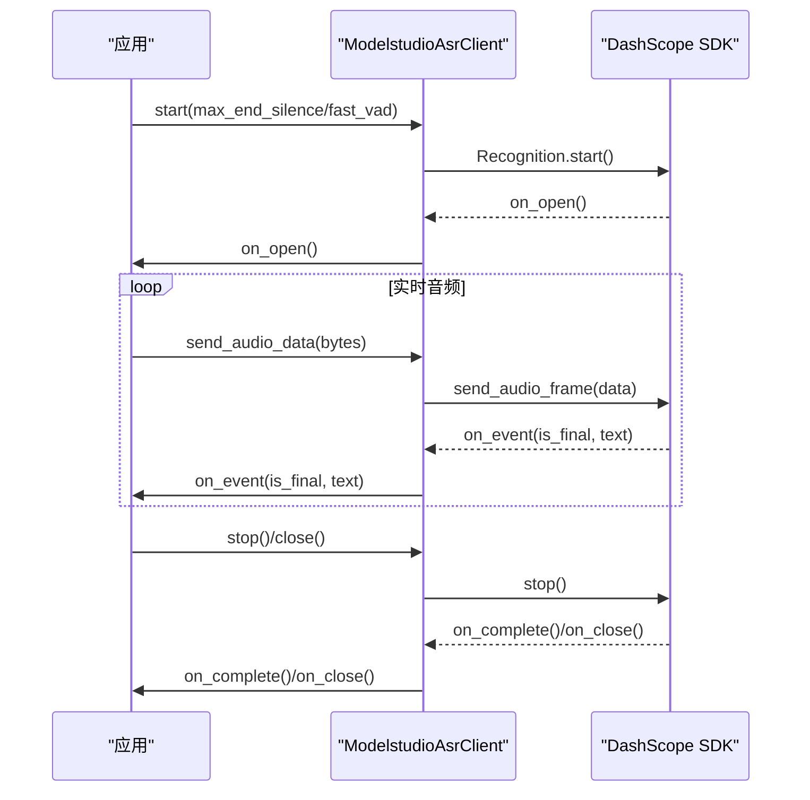
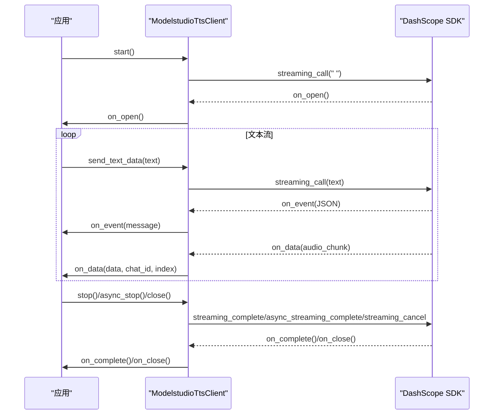
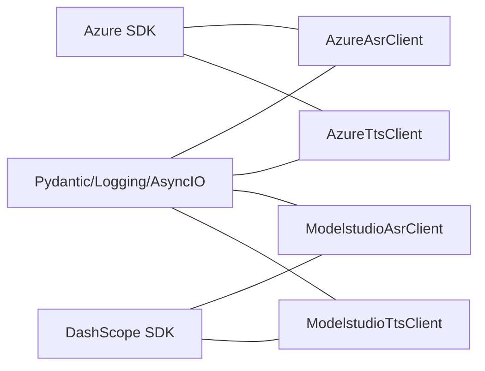

# 实时客户端工具

<cite>
**本文引用的文件**
- [src/agentscope_runtime/tools/realtime_clients/__init__.py](file://src/agentscope_runtime/tools/realtime_clients/__init__.py)
- [src/agentscope_runtime/tools/realtime_clients/realtime_tool.py](file://src/agentscope_runtime/tools/realtime_clients/realtime_tool.py)
- [src/agentscope_runtime/tools/realtime_clients/asr_client.py](file://src/agentscope_runtime/tools/realtime_clients/asr_client.py)
- [src/agentscope_runtime/tools/realtime_clients/tts_client.py](file://src/agentscope_runtime/tools/realtime_clients/tts_client.py)
- [src/agentscope_runtime/tools/realtime_clients/azure_asr_client.py](file://src/agentscope_runtime/tools/realtime_clients/azure_asr_client.py)
- [src/agentscope_runtime/tools/realtime_clients/azure_tts_client.py](file://src/agentscope_runtime/tools/realtime_clients/azure_tts_client.py)
- [src/agentscope_runtime/tools/realtime_clients/modelstudio_asr_client.py](file://src/agentscope_runtime/tools/realtime_clients/modelstudio_asr_client.py)
- [src/agentscope_runtime/tools/realtime_clients/modelstudio_tts_client.py](file://src/agentscope_runtime/tools/realtime_clients/modelstudio_tts_client.py)
- [src/agentscope_runtime/engine/schemas/realtime.py](file://src/agentscope_runtime/engine/schemas/realtime.py)
- [cookbook/zh/tools/realtime_clients.md](file://cookbook/zh/tools/realtime_clients.md)
- [tests/tools/test_asr.py](file://tests/tools/test_asr.py)
- [tests/tools/test_tts.py](file://tests/tools/test_tts.py)
</cite>

## 目录
1. [简介](#简介)
2. [项目结构](#项目结构)
3. [核心组件](#核心组件)
4. [架构总览](#架构总览)
5. [详细组件分析](#详细组件分析)
6. [依赖分析](#依赖分析)
7. [性能考虑](#性能考虑)
8. [故障排除指南](#故障排除指南)
9. [结论](#结论)
10. [附录](#附录)

## 简介
本文件面向 AgentScope Runtime 的实时客户端工具，系统性介绍语音识别（ASR）与语音合成（TTS）的客户端能力，覆盖 Azure 与 ModelStudio（百炼）两大云服务提供商的集成实现。内容涵盖实时音频处理工作流、客户端配置项、连接参数、性能调优建议、认证机制说明、使用示例、错误处理策略与故障排除方法，帮助开发者快速集成并稳定运行实时语音能力。

## 项目结构
实时客户端工具位于 tools/realtime_clients 目录，采用“按供应商分层 + 抽象基类”的组织方式：
- 抽象基类与通用枚举：realtime_tool.py
- ASR/TTS 抽象客户端：asr_client.py、tts_client.py
- Azure 实现：azure_asr_client.py、azure_tts_client.py
- ModelStudio 实现：modelstudio_asr_client.py、modelstudio_tts_client.py
- 配置与协议：engine/schemas/realtime.py
- 使用示例与最佳实践：cookbook/zh/tools/realtime_clients.md
- 测试用例：tests/tools/test_asr.py、tests/tools/test_tts.py

图表来源
- [src/agentscope_runtime/tools/realtime_clients/realtime_tool.py:1-56](file://src/agentscope_runtime/tools/realtime_clients/realtime_tool.py#L1-L56)
- [src/agentscope_runtime/tools/realtime_clients/asr_client.py:1-28](file://src/agentscope_runtime/tools/realtime_clients/asr_client.py#L1-L28)
- [src/agentscope_runtime/tools/realtime_clients/tts_client.py:1-34](file://src/agentscope_runtime/tools/realtime_clients/tts_client.py#L1-L34)
- [src/agentscope_runtime/tools/realtime_clients/azure_asr_client.py:1-196](file://src/agentscope_runtime/tools/realtime_clients/azure_asr_client.py#L1-L196)
- [src/agentscope_runtime/tools/realtime_clients/azure_tts_client.py:1-384](file://src/agentscope_runtime/tools/realtime_clients/azure_tts_client.py#L1-L384)
- [src/agentscope_runtime/tools/realtime_clients/modelstudio_asr_client.py:1-152](file://src/agentscope_runtime/tools/realtime_clients/modelstudio_asr_client.py#L1-L152)
- [src/agentscope_runtime/tools/realtime_clients/modelstudio_tts_client.py:1-200](file://src/agentscope_runtime/tools/realtime_clients/modelstudio_tts_client.py#L1-L200)
- [src/agentscope_runtime/engine/schemas/realtime.py:1-255](file://src/agentscope_runtime/engine/schemas/realtime.py#L1-L255)

章节来源
- [src/agentscope_runtime/tools/realtime_clients/__init__.py:1-14](file://src/agentscope_runtime/tools/realtime_clients/__init__.py#L1-L14)
- [src/agentscope_runtime/engine/schemas/realtime.py:1-255](file://src/agentscope_runtime/engine/schemas/realtime.py#L1-L255)

## 核心组件
- RealtimeComponent 抽象基类：统一生命周期（start/stop/close）、状态机（IDLE/RUNNING）、类型标识（ASR/TTS/VOICE_CHAT/VIDEO_CHAT）。
- AsrClient/TtsClient：分别对 ASR/TTS 的通用行为进行抽象，定义 send_audio_data/send_text_data 等接口。
- AzureAsrClient/AzureTtsClient：基于 Microsoft Azure Cognitive Services Speech SDK 的实现，支持连续识别、事件回调、流式音频输出、首包延迟统计等。
- ModelstudioAsrClient/ModelstudioTtsClient：基于 DashScope 音频 SDK 的实现，支持实时识别回调、流式合成回调、事件消息解析与首包延迟统计。
- 配置模型：AsrConfig/TtsConfig、AzureAsrConfig/AzureTtsConfig、ModelstudioAsrConfig/ModelstudioTtsConfig，以及 ModelStudio 语音聊天协议相关模型。

章节来源
- [src/agentscope_runtime/tools/realtime_clients/realtime_tool.py:1-56](file://src/agentscope_runtime/tools/realtime_clients/realtime_tool.py#L1-L56)
- [src/agentscope_runtime/tools/realtime_clients/asr_client.py:1-28](file://src/agentscope_runtime/tools/realtime_clients/asr_client.py#L1-L28)
- [src/agentscope_runtime/tools/realtime_clients/tts_client.py:1-34](file://src/agentscope_runtime/tools/realtime_clients/tts_client.py#L1-L34)
- [src/agentscope_runtime/engine/schemas/realtime.py:1-255](file://src/agentscope_runtime/engine/schemas/realtime.py#L1-L255)

## 架构总览
实时客户端工具遵循“抽象基类 + 云厂商适配器”的分层设计，通过统一的状态机与回调接口屏蔽底层 SDK 差异，便于替换与扩展。

图表来源
- [src/agentscope_runtime/tools/realtime_clients/realtime_tool.py:1-56](file://src/agentscope_runtime/tools/realtime_clients/realtime_tool.py#L1-L56)
- [src/agentscope_runtime/tools/realtime_clients/asr_client.py:1-28](file://src/agentscope_runtime/tools/realtime_clients/asr_client.py#L1-L28)
- [src/agentscope_runtime/tools/realtime_clients/tts_client.py:1-34](file://src/agentscope_runtime/tools/realtime_clients/tts_client.py#L1-L34)
- [src/agentscope_runtime/tools/realtime_clients/azure_asr_client.py:1-196](file://src/agentscope_runtime/tools/realtime_clients/azure_asr_client.py#L1-L196)
- [src/agentscope_runtime/tools/realtime_clients/azure_tts_client.py:1-384](file://src/agentscope_runtime/tools/realtime_clients/azure_tts_client.py#L1-L384)
- [src/agentscope_runtime/tools/realtime_clients/modelstudio_asr_client.py:1-152](file://src/agentscope_runtime/tools/realtime_clients/modelstudio_asr_client.py#L1-L152)
- [src/agentscope_runtime/tools/realtime_clients/modelstudio_tts_client.py:1-200](file://src/agentscope_runtime/tools/realtime_clients/modelstudio_tts_client.py#L1-L200)

## 详细组件分析

### Azure ASR 客户端（AzureAsrClient）
- 功能特性
  - 连续语音识别，支持会话开始/结束、识别中/识别完成事件回调。
  - 静默超时配置（初始静默与末尾静默），VAD 参数可调。
  - 推送音频流（PushAudioInputStream）实时喂入 SDK。
  - 回调 on_started/on_stopped/on_canceled/on_recognizing/on_recognized。
- 关键流程
  - 初始化：构造 SpeechConfig/AudioConfig/Recognizer，绑定事件回调。
  - 启动：start_continuous_recognition。
  - 发送音频：push_stream.write(data)。
  - 停止：stop_continuous_recognition 并关闭流。
- 性能与参数
  - 初始静默超时与末尾静默通过 SDK PropertyId 设置。
  - 采样率、位深、声道数与语言在 SpeechConfig 中配置。
- 错误处理
  - on_canceled 记录取消原因与详情；状态切换至 IDLE。
  - 发送音频前检查状态，避免在 IDLE 下写入。

图表来源
- [src/agentscope_runtime/tools/realtime_clients/azure_asr_client.py:100-196](file://src/agentscope_runtime/tools/realtime_clients/azure_asr_client.py#L100-L196)

章节来源
- [src/agentscope_runtime/tools/realtime_clients/azure_asr_client.py:1-196](file://src/agentscope_runtime/tools/realtime_clients/azure_asr_client.py#L1-L196)
- [src/agentscope_runtime/engine/schemas/realtime.py:236-244](file://src/agentscope_runtime/engine/schemas/realtime.py#L236-L244)

### Azure TTS 客户端（AzureTtsClient）
- 功能特性
  - WebSocket 连接 + 流式音频输出，支持 synthesis_started/completed/canceled/synthesizing/viseme/word_boundary 事件。
  - PushAudioOutputStream 回调 on_data 分片推送音频。
  - 首包延迟统计与多类延迟指标日志。
  - async_stop 与 stop 区分同步等待与异步清理，规避线程安全问题。
- 关键流程
  - 初始化：SpeechConfig 指定 endpoint、voice、输出格式；创建 SpeechSynthesizer 与 PushAudioOutputStream。
  - start：打开连接、创建 SpeechSynthesisRequest、调用 speak_async。
  - 发送文本：tts_request.input_stream.write(text)。
  - 停止：根据场景选择 async_stop 或 stop，并等待任务完成或直接关闭。
- 性能与参数
  - 通过 PropertyId 调整帧超时与 RTF 超时阈值，降低等待时间。
  - config_to_format 将采样率/位深/声道映射到 SDK 的输出格式枚举。

图表来源
- [src/agentscope_runtime/tools/realtime_clients/azure_tts_client.py:110-384](file://src/agentscope_runtime/tools/realtime_clients/azure_tts_client.py#L110-L384)

章节来源
- [src/agentscope_runtime/tools/realtime_clients/azure_tts_client.py:1-384](file://src/agentscope_runtime/tools/realtime_clients/azure_tts_client.py#L1-L384)
- [src/agentscope_runtime/engine/schemas/realtime.py:246-255](file://src/agentscope_runtime/engine/schemas/realtime.py#L246-L255)

### ModelStudio ASR 客户端（ModelstudioAsrClient）
- 功能特性
  - 基于 DashScope TranslationRecognizerRealtime 的实时识别，支持回调 on_open/on_complete/on_error/on_close/on_event。
  - 句子级事件通知（sentence_end/sentence_text），支持 fast_vad 与 max_end_silence 参数。
- 关键流程
  - 初始化：创建 TranslationRecognizerRealtime，注册回调。
  - start：传入 max_end_silence（优先使用 fast_vad_min_duration）。
  - 发送音频：send_audio_frame(data)。
  - 停止/关闭：stop() 清理资源。

图表来源
- [src/agentscope_runtime/tools/realtime_clients/modelstudio_asr_client.py:56-152](file://src/agentscope_runtime/tools/realtime_clients/modelstudio_asr_client.py#L56-L152)

章节来源
- [src/agentscope_runtime/tools/realtime_clients/modelstudio_asr_client.py:1-152](file://src/agentscope_runtime/tools/realtime_clients/modelstudio_asr_client.py#L1-L152)
- [src/agentscope_runtime/engine/schemas/realtime.py:59-66](file://src/agentscope_runtime/engine/schemas/realtime.py#L59-L66)

### ModelStudio TTS 客户端（ModelstudioTtsClient）
- 功能特性
  - 基于 DashScope SpeechSynthesizer 的流式合成，支持 on_open/on_complete/on_error/on_close/on_event/on_data。
  - 事件消息解析（JSON header.task_id）与首包延迟统计。
  - to_format 将采样率映射到 SDK AudioFormat。
- 关键流程
  - 初始化：创建 SpeechSynthesizer，注册 ResultCallback。
  - start：执行一次空字符串触发预热。
  - 发送文本：streaming_call(text)，支持多次调用拼接。
  - 停止：async_stop/streaming_complete/streaming_cancel 依据场景选择。

图表来源
- [src/agentscope_runtime/tools/realtime_clients/modelstudio_tts_client.py:58-200](file://src/agentscope_runtime/tools/realtime_clients/modelstudio_tts_client.py#L58-L200)

章节来源
- [src/agentscope_runtime/tools/realtime_clients/modelstudio_tts_client.py:1-200](file://src/agentscope_runtime/tools/realtime_clients/modelstudio_tts_client.py#L1-L200)
- [src/agentscope_runtime/engine/schemas/realtime.py:39-44](file://src/agentscope_runtime/engine/schemas/realtime.py#L39-L44)

### 配置与认证
- Azure
  - 认证：通过环境变量 AZURE_SPEECH_KEY 与 AZURE_SPEECH_REGION 注入，或在配置中显式指定。
  - ASR：language、sample_rate、bits_per_sample、nb_channels、initial_silence_timeout、max_end_silence、fast_vad_min_duration。
  - TTS：voice、sample_rate、bits_per_sample、nb_channels、format。
- ModelStudio
  - 认证：通过环境变量 DASHSCOPE_API_KEY 注入，或在配置中显式指定。
  - ASR：model、format、sample_rate、max_end_silence、fast_vad_min_duration、fast_vad_max_duration。
  - TTS：model、voice、sample_rate、format。
- 通用字段：chat_id（用于 TTS 会话标识）。

章节来源
- [src/agentscope_runtime/engine/schemas/realtime.py:231-255](file://src/agentscope_runtime/engine/schemas/realtime.py#L231-L255)
- [cookbook/zh/tools/realtime_clients.md:98-108](file://cookbook/zh/tools/realtime_clients.md#L98-L108)

## 依赖分析
- 云服务 SDK
  - Azure：azure-cognitiveservices-speech（ASR/TTS）
  - ModelStudio：dashscope.audio.asr、dashscope.audio.tts
- 本地依赖
  - asyncio、logging、typing、pydantic、os、json、time
- 代码内聚与耦合
  - 抽象基类与具体实现解耦，回调接口统一，便于替换与扩展。
  - 配置模型集中定义，减少重复与不一致。

图表来源
- [src/agentscope_runtime/tools/realtime_clients/azure_asr_client.py:9-14](file://src/agentscope_runtime/tools/realtime_clients/azure_asr_client.py#L9-L14)
- [src/agentscope_runtime/tools/realtime_clients/azure_tts_client.py:10-16](file://src/agentscope_runtime/tools/realtime_clients/azure_tts_client.py#L10-L16)
- [src/agentscope_runtime/tools/realtime_clients/modelstudio_asr_client.py:9-14](file://src/agentscope_runtime/tools/realtime_clients/modelstudio_asr_client.py#L9-L14)
- [src/agentscope_runtime/tools/realtime_clients/modelstudio_tts_client.py:9-13](file://src/agentscope_runtime/tools/realtime_clients/modelstudio_tts_client.py#L9-L13)

章节来源
- [cookbook/zh/tools/realtime_clients.md:327-333](file://cookbook/zh/tools/realtime_clients.md#L327-L333)

## 性能考虑
- 缓冲与延迟
  - 合理设置采样率（常见 16kHz/48kHz）与音频格式（PCM/WAV/MP3），平衡带宽与质量。
  - Azure TTS 中通过 PropertyId 调整帧超时与 RTF 超时阈值，降低首包延迟。
- 连接与复用
  - 复用连接与请求对象，避免频繁创建销毁带来的开销。
- 网络与稳定性
  - 保持稳定的网络环境，必要时实现断线重连与退避策略。
- 日志与可观测性
  - 利用首包延迟与各类延迟指标日志，定位瓶颈（网络/服务/客户端）。

## 故障排除指南
- 常见错误与排查
  - Azure ASR 取消事件：检查订阅密钥与区域配置、网络连通性、静默超时设置是否过短。
  - Azure TTS 同步等待异常：使用 async_stop 避免线程安全问题；确认 input_stream 正确关闭。
  - ModelStudio ASR/ TTS 回调异常：确认回调函数签名与返回值；检查事件消息 JSON 解析逻辑。
- 状态与生命周期
  - 确保在 RUNNING 状态下发送音频/文本；避免在 IDLE 下写入导致失败。
  - stop/close 前先停止识别/合成，释放资源后再关闭流。
- 测试参考
  - 使用测试用例模拟音频/文本流，验证回调与状态切换。

章节来源
- [tests/tools/test_asr.py:1-83](file://tests/tools/test_asr.py#L1-L83)
- [tests/tools/test_tts.py:1-100](file://tests/tools/test_tts.py#L1-L100)
- [src/agentscope_runtime/tools/realtime_clients/azure_asr_client.py:162-176](file://src/agentscope_runtime/tools/realtime_clients/azure_asr_client.py#L162-L176)
- [src/agentscope_runtime/tools/realtime_clients/azure_tts_client.py:150-211](file://src/agentscope_runtime/tools/realtime_clients/azure_tts_client.py#L150-L211)
- [src/agentscope_runtime/tools/realtime_clients/modelstudio_asr_client.py:112-130](file://src/agentscope_runtime/tools/realtime_clients/modelstudio_asr_client.py#L112-L130)
- [src/agentscope_runtime/tools/realtime_clients/modelstudio_tts_client.py:125-145](file://src/agentscope_runtime/tools/realtime_clients/modelstudio_tts_client.py#L125-L145)

## 结论
实时客户端工具通过统一抽象与清晰的回调接口，实现了 Azure 与 ModelStudio 的 ASR/TTS 能力集成。借助完善的配置模型与详尽的使用示例，开发者可以快速搭建高质量的实时语音应用。建议在生产环境中关注网络稳定性、资源释放与可观测性，持续优化延迟与吞吐。

## 附录

### 使用示例（路径指引）
- ModelStudio ASR 示例：[cookbook/zh/tools/realtime_clients.md:111-158](file://cookbook/zh/tools/realtime_clients.md#L111-L158)
- ModelStudio TTS 示例：[cookbook/zh/tools/realtime_clients.md:160-213](file://cookbook/zh/tools/realtime_clients.md#L160-L213)
- Azure ASR/TTS 示例：[cookbook/zh/tools/realtime_clients.md:215-295](file://cookbook/zh/tools/realtime_clients.md#L215-L295)

### 配置与参数总览（路径指引）
- Azure 配置模型：[src/agentscope_runtime/engine/schemas/realtime.py:236-255](file://src/agentscope_runtime/engine/schemas/realtime.py#L236-L255)
- ModelStudio 配置模型：[src/agentscope_runtime/engine/schemas/realtime.py:39-66](file://src/agentscope_runtime/engine/schemas/realtime.py#L39-L66)
- 通用配置字段：chat_id、sample_rate、format、voice 等

### 回调与事件（路径指引）
- Azure ASR 回调：on_started/on_stopped/on_canceled/on_recognizing/on_recognized
  - [src/agentscope_runtime/tools/realtime_clients/azure_asr_client.py:26-31](file://src/agentscope_runtime/tools/realtime_clients/azure_asr_client.py#L26-L31)
- Azure TTS 回调：on_started/on_complete/on_canceled/on_data/on_synthesizing/on_viseme/on_word_boundary
  - [src/agentscope_runtime/tools/realtime_clients/azure_tts_client.py:28-34](file://src/agentscope_runtime/tools/realtime_clients/azure_tts_client.py#L28-L34)
- ModelStudio ASR 回调：on_open/on_complete/on_error/on_close/on_event
  - [src/agentscope_runtime/tools/realtime_clients/modelstudio_asr_client.py:26-32](file://src/agentscope_runtime/tools/realtime_clients/modelstudio_asr_client.py#L26-L32)
- ModelStudio TTS 回调：on_open/on_complete/on_error/on_close/on_event/on_data
  - [src/agentscope_runtime/tools/realtime_clients/modelstudio_tts_client.py:25-32](file://src/agentscope_runtime/tools/realtime_clients/modelstudio_tts_client.py#L25-L32)