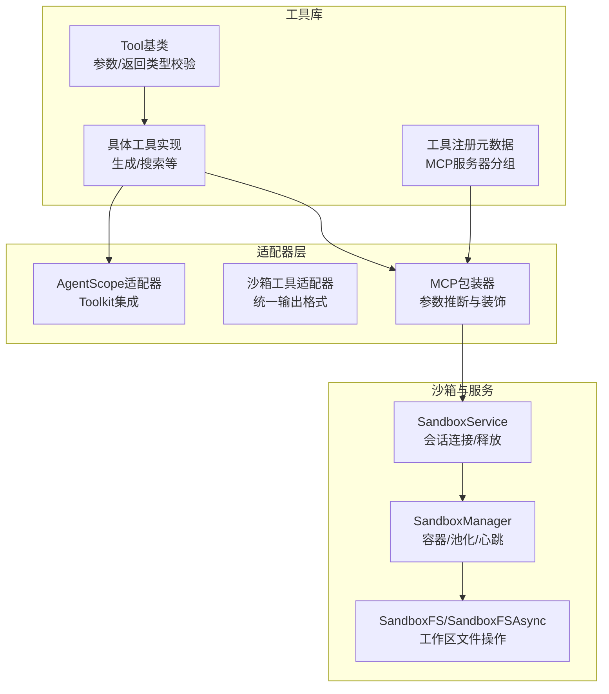
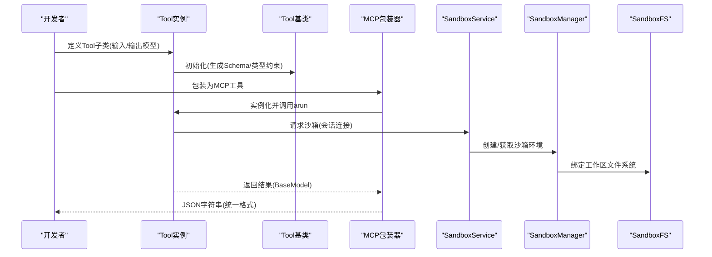
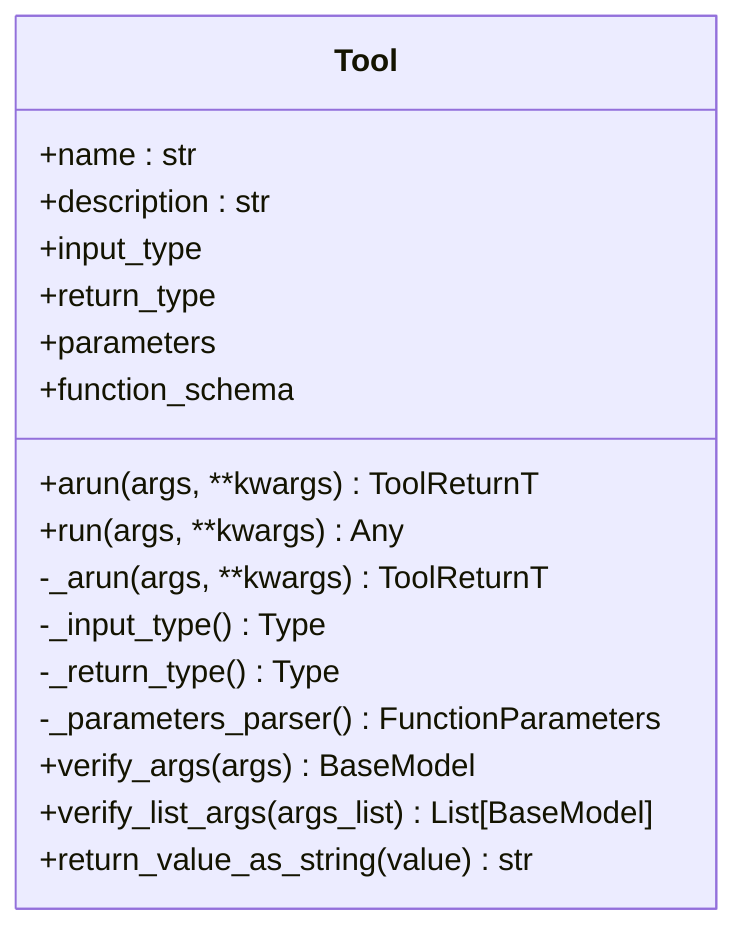
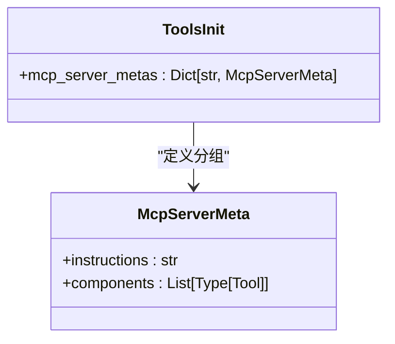
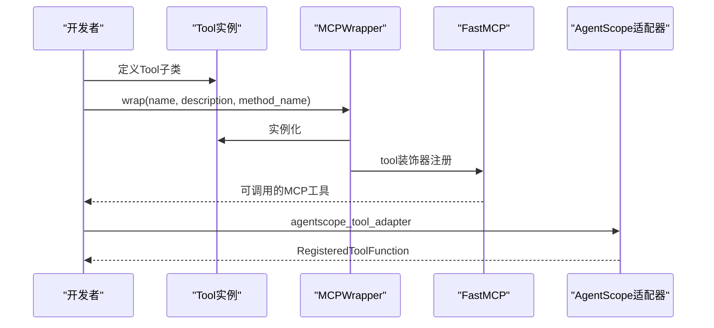
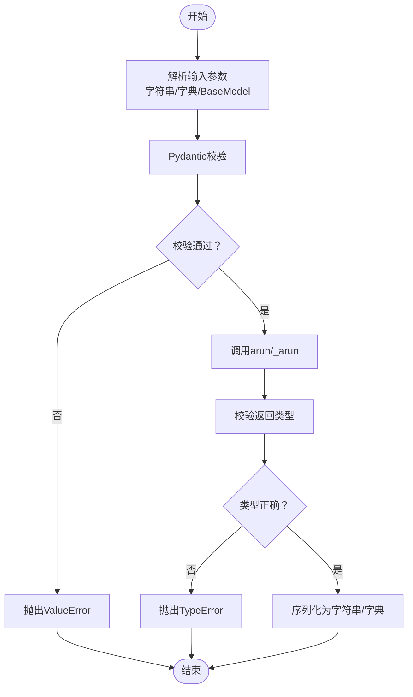
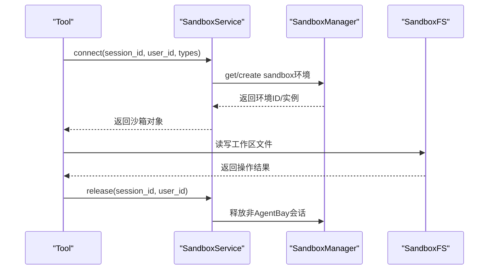
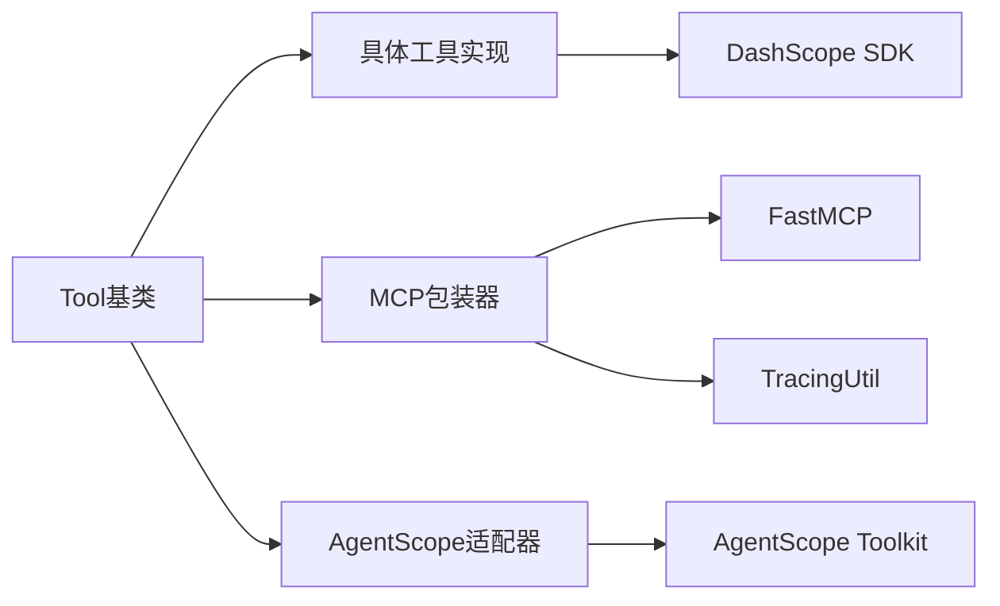

# 工具架构设计

<cite>
**本文引用的文件**
- [tools/base.py](file://src/agentscope_runtime/tools/base.py)
- [tools/__init__.py](file://src/agentscope_runtime/tools/__init__.py)
- [tools/mcp_wrapper.py](file://src/agentscope_runtime/tools/mcp_wrapper.py)
- [adapters/agentscope/tool/tool.py](file://src/agentscope_runtime/adapters/agentscope/tool/tool.py)
- [adapters/agentscope/tool/sandbox_tool.py](file://src/agentscope_runtime/adapters/agentscope/tool/sandbox_tool.py)
- [tools/generations/image_generation.py](file://src/agentscope_runtime/tools/generations/image_generation.py)
- [tools/searches/modelstudio_search.py](file://src/agentscope_runtime/tools/searches/modelstudio_search.py)
- [engine/services/sandbox/sandbox_service.py](file://src/agentscope_runtime/engine/services/sandbox/sandbox_service.py)
- [sandbox/manager/sandbox_manager.py](file://src/agentscope_runtime/sandbox/manager/sandbox_manager.py)
- [sandbox/box/components/fs.py](file://src/agentscope_runtime/sandbox/box/components/fs.py)
- [tools/utils/mcp_util.py](file://src/agentscope_runtime/tools/utils/mcp_util.py)
- [engine/tracing/tracing_util.py](file://src/agentscope_runtime/engine/tracing/tracing_util.py)
</cite>

## 目录
1. [引言](#引言)
2. [项目结构](#项目结构)
3. [核心组件](#核心组件)
4. [架构总览](#架构总览)
5. [详细组件分析](#详细组件分析)
6. [依赖分析](#依赖分析)
7. [性能考虑](#性能考虑)
8. [故障排查指南](#故障排查指南)
9. [结论](#结论)
10. [附录](#附录)

## 引言
本文件面向AgentScope Runtime的工具架构设计，系统化阐述工具库系统的整体架构、Tool基类设计理念、工具注册机制与MCP协议适配器模式；深入解析工具生命周期管理、参数验证机制与错误处理策略；解释工具与沙箱系统的集成方式及在不同部署模式下的行为差异；并提供工具扩展指南与自定义工具开发最佳实践。文中包含多幅架构与流程图，帮助读者从宏观到微观全面理解工具系统的内部工作机制。

## 项目结构
工具系统位于src/agentscope_runtime/tools目录下，采用“按功能域分层+类型安全”的组织方式：
- 基础抽象：Tool基类与泛型参数/返回类型约束
- 工具实现：按领域划分（生成、搜索、实时客户端等）
- 适配器：将Runtime工具适配到AgentScope Toolkit与沙箱工具链
- MCP封装：将Tool暴露为MCP工具，支持参数推断与类型标注
- 沙箱集成：通过SandboxService与SandboxManager统一管理沙箱生命周期与文件系统

图表来源
- [tools/base.py:34-265](file://src/agentscope_runtime/tools/base.py#L34-L265)
- [tools/__init__.py:65-120](file://src/agentscope_runtime/tools/__init__.py#L65-L120)
- [tools/mcp_wrapper.py:14-216](file://src/agentscope_runtime/tools/mcp_wrapper.py#L14-L216)
- [adapters/agentscope/tool/tool.py:17-232](file://src/agentscope_runtime/adapters/agentscope/tool/tool.py#L17-L232)
- [adapters/agentscope/tool/sandbox_tool.py:15-70](file://src/agentscope_runtime/adapters/agentscope/tool/sandbox_tool.py#L15-L70)
- [engine/services/sandbox/sandbox_service.py:11-238](file://src/agentscope_runtime/engine/services/sandbox/sandbox_service.py#L11-L238)
- [sandbox/manager/sandbox_manager.py:140-800](file://src/agentscope_runtime/sandbox/manager/sandbox_manager.py#L140-L800)
- [sandbox/box/components/fs.py:17-279](file://src/agentscope_runtime/sandbox/box/components/fs.py#L17-L279)

章节来源
- [tools/base.py:34-265](file://src/agentscope_runtime/tools/base.py#L34-L265)
- [tools/__init__.py:65-120](file://src/agentscope_runtime/tools/__init__.py#L65-L120)
- [engine/services/sandbox/sandbox_service.py:11-238](file://src/agentscope_runtime/engine/services/sandbox/sandbox_service.py#L11-L238)

## 核心组件
- Tool基类：提供异步执行arun与同步包装run；内置泛型输入/返回类型提取、参数Schema生成、JSON字符串/字典/BaseModel入参校验、返回值序列化等能力。
- 工具注册与MCP元数据：通过McpServerMeta与mcp_server_metas集中声明MCP服务器分组及其包含的工具集合，便于按场景快速装配。
- MCP包装器：将Tool实例包装为MCP工具，动态生成签名与类型注解，注入ctx上下文并设置追踪ID，同时修正Schema以剔除ctx字段。
- AgentScope适配器：将Runtime工具转换为AgentScope Toolkit可用的RegisteredToolFunction，负责参数校验、异步/同步执行、结果格式化与错误包装。
- 沙箱工具适配器：确保沙箱工具输出统一为ToolResponse，兼容Toolkit消费。
- 沙箱服务与管理器：SandboxService负责会话连接/释放与环境创建；SandboxManager负责容器池化、心跳扫描、资源清理与远程/本地模式切换；SandboxFS提供工作区文件系统接口。

章节来源
- [tools/base.py:34-265](file://src/agentscope_runtime/tools/base.py#L34-L265)
- [tools/__init__.py:65-120](file://src/agentscope_runtime/tools/__init__.py#L65-L120)
- [tools/mcp_wrapper.py:14-216](file://src/agentscope_runtime/tools/mcp_wrapper.py#L14-L216)
- [adapters/agentscope/tool/tool.py:17-232](file://src/agentscope_runtime/adapters/agentscope/tool/tool.py#L17-L232)
- [adapters/agentscope/tool/sandbox_tool.py:15-70](file://src/agentscope_runtime/adapters/agentscope/tool/sandbox_tool.py#L15-L70)
- [engine/services/sandbox/sandbox_service.py:11-238](file://src/agentscope_runtime/engine/services/sandbox/sandbox_service.py#L11-L238)
- [sandbox/manager/sandbox_manager.py:140-800](file://src/agentscope_runtime/sandbox/manager/sandbox_manager.py#L140-L800)
- [sandbox/box/components/fs.py:17-279](file://src/agentscope_runtime/sandbox/box/components/fs.py#L17-L279)

## 架构总览
工具系统围绕“类型安全 + 参数Schema + 异步执行 + MCP适配 + 沙箱集成”展开，形成如下闭环：
- 开发者定义Tool子类，明确输入/输出Pydantic模型
- 系统自动生成函数调用Schema，用于LLM工具调用与MCP参数推断
- 执行路径支持同步与异步，内部进行类型校验与异常捕获
- 通过适配器对接AgentScope Toolkit与MCP服务器
- 工具在沙箱环境中运行，由SandboxService统一调度，SandboxManager负责生命周期与资源管理

图表来源
- [tools/base.py:74-142](file://src/agentscope_runtime/tools/base.py#L74-L142)
- [tools/mcp_wrapper.py:37-216](file://src/agentscope_runtime/tools/mcp_wrapper.py#L37-L216)
- [engine/services/sandbox/sandbox_service.py:82-142](file://src/agentscope_runtime/engine/services/sandbox/sandbox_service.py#L82-L142)
- [sandbox/manager/sandbox_manager.py:592-704](file://src/agentscope_runtime/sandbox/manager/sandbox_manager.py#L592-L704)
- [sandbox/box/components/fs.py:17-136](file://src/agentscope_runtime/sandbox/box/components/fs.py#L17-L136)

## 详细组件分析

### Tool基类与生命周期
- 设计要点
  - 泛型约束ToolArgsT/ToolReturnT，确保输入/输出类型在编译期可验证
  - 自动生成FunctionTool Schema，供LLM与MCP工具调用
  - 支持同步run与异步arun，内部通过async_to_sync桥接
  - 输入/返回类型严格校验，避免类型不匹配导致的运行时错误
- 生命周期
  - 初始化阶段：解析泛型、生成Schema、缓存类型信息
  - 执行阶段：校验入参类型 -> 调用_arun -> 校验返回类型 -> 序列化
  - 错误阶段：类型不匹配抛出TypeError；执行异常向上抛出或被上层适配器捕获

图表来源
- [tools/base.py:34-265](file://src/agentscope_runtime/tools/base.py#L34-L265)

章节来源
- [tools/base.py:34-265](file://src/agentscope_runtime/tools/base.py#L34-L265)

### 工具注册机制与MCP服务器分组
- McpServerMeta与mcp_server_metas用于声明MCP服务器的指令与组件清单
- 支持多服务器分组，每组包含若干Tool类，便于按场景快速装配
- 通过MCP包装器将Tool转换为MCP工具，自动注入名称/描述与参数Schema

图表来源
- [tools/__init__.py:65-120](file://src/agentscope_runtime/tools/__init__.py#L65-L120)

章节来源
- [tools/__init__.py:65-120](file://src/agentscope_runtime/tools/__init__.py#L65-L120)

### MCP协议适配器模式
- MCPWrapper
  - 动态生成带类型注解的异步函数，匹配Tool输入模型
  - 自动处理可选参数与None值，构建kwargs字典
  - 注入ctx上下文并设置追踪ID，修正Schema剔除ctx字段
  - 使用MCP装饰器注册工具，暴露给MCP服务器
- 工具适配与AgentScope Toolkit
  - agentscope_tool_adapter：将Runtime工具转换为RegisteredToolFunction
  - agentscope_toolkit_adapter：批量转换并组装Toolkit
  - sandbox_tool_adapter：保证沙箱工具输出统一为ToolResponse

图表来源
- [tools/mcp_wrapper.py:14-216](file://src/agentscope_runtime/tools/mcp_wrapper.py#L14-L216)
- [adapters/agentscope/tool/tool.py:17-232](file://src/agentscope_runtime/adapters/agentscope/tool/tool.py#L17-L232)
- [adapters/agentscope/tool/sandbox_tool.py:15-70](file://src/agentscope_runtime/adapters/agentscope/tool/sandbox_tool.py#L15-L70)

章节来源
- [tools/mcp_wrapper.py:14-216](file://src/agentscope_runtime/tools/mcp_wrapper.py#L14-L216)
- [adapters/agentscope/tool/tool.py:17-232](file://src/agentscope_runtime/adapters/agentscope/tool/tool.py#L17-L232)
- [adapters/agentscope/tool/sandbox_tool.py:15-70](file://src/agentscope_runtime/adapters/agentscope/tool/sandbox_tool.py#L15-L70)

### 参数验证机制与错误处理策略
- 参数验证
  - verify_args/verify_list_args：支持字符串、字典、BaseModel三种输入形式，统一转为BaseModel并进行Pydantic校验
  - _parameters_parser：从输入模型生成FunctionParameters Schema，支持$defs展开与required字段补全
- 类型校验
  - arun/run在执行前后分别校验入参与返回值类型，确保与泛型约束一致
- 错误处理
  - 类型不匹配抛出TypeError
  - JSON解析失败抛出ValueError
  - AgentScope适配器捕获异常并返回ToolResponse，metadata标记错误
  - 沙箱工具适配器记录警告并兜底为ToolResponse

图表来源
- [tools/base.py:196-246](file://src/agentscope_runtime/tools/base.py#L196-L246)
- [adapters/agentscope/tool/tool.py:59-144](file://src/agentscope_runtime/adapters/agentscope/tool/tool.py#L59-L144)

章节来源
- [tools/base.py:196-246](file://src/agentscope_runtime/tools/base.py#L196-L246)
- [adapters/agentscope/tool/tool.py:59-144](file://src/agentscope_runtime/adapters/agentscope/tool/tool.py#L59-L144)

### 工具与沙箱系统的集成
- SandboxService
  - start/stop：启动/停止沙箱服务，控制资源释放策略
  - connect/release：按会话ID连接或释放沙箱环境，支持AgentBay特殊会话
- SandboxManager
  - 远程/本地双模：通过装饰器透明切换远程HTTP调用或本地直接执行
  - 池化与心跳：维护容器池、扫描心跳、回收与清理
  - 文件系统：通过SandboxFS/SandboxFSAsync提供工作区文件操作
- 工具执行路径
  - 工具在arun中可直接调用SandboxManager相关方法或通过SandboxFS访问工作区

图表来源
- [engine/services/sandbox/sandbox_service.py:82-231](file://src/agentscope_runtime/engine/services/sandbox/sandbox_service.py#L82-L231)
- [sandbox/manager/sandbox_manager.py:508-704](file://src/agentscope_runtime/sandbox/manager/sandbox_manager.py#L508-L704)
- [sandbox/box/components/fs.py:17-279](file://src/agentscope_runtime/sandbox/box/components/fs.py#L17-L279)

章节来源
- [engine/services/sandbox/sandbox_service.py:11-238](file://src/agentscope_runtime/engine/services/sandbox/sandbox_service.py#L11-L238)
- [sandbox/manager/sandbox_manager.py:140-800](file://src/agentscope_runtime/sandbox/manager/sandbox_manager.py#L140-L800)
- [sandbox/box/components/fs.py:17-279](file://src/agentscope_runtime/sandbox/box/components/fs.py#L17-L279)

### 典型工具实现示例
- 文本到图像生成
  - 输入模型包含提示词、尺寸、数量、水印等字段
  - 异步调用DashScope图像合成服务，轮询任务状态，超时控制
  - 返回结果URL列表与请求ID
- 搜索工具
  - 输入为消息列表与搜索选项，支持多种搜索策略
  - 异步HTTP调用DashScope搜索API，后处理结果并格式化
  - 提供知识构建辅助，支持引用格式与来源展示

章节来源
- [tools/generations/image_generation.py:70-203](file://src/agentscope_runtime/tools/generations/image_generation.py#L70-L203)
- [tools/searches/modelstudio_search.py:102-221](file://src/agentscope_runtime/tools/searches/modelstudio_search.py#L102-L221)

## 依赖分析
- 组件耦合
  - Tool基类与具体工具实现低耦合，通过泛型与Schema解耦
  - MCP包装器与AgentScope适配器均依赖Tool的function_schema与类型信息
  - 沙箱服务与管理器对外暴露统一接口，内部通过装饰器实现远程/本地切换
- 外部依赖
  - FastMCP：MCP工具注册与参数推断
  - AgentScope Toolkit：工具函数注册与消费
  - DashScope SDK：AioImageSynthesis与搜索API调用
  - OpenTelemetry：请求ID与追踪属性传播

图表来源
- [tools/base.py:34-265](file://src/agentscope_runtime/tools/base.py#L34-L265)
- [tools/mcp_wrapper.py:14-216](file://src/agentscope_runtime/tools/mcp_wrapper.py#L14-L216)
- [adapters/agentscope/tool/tool.py:17-232](file://src/agentscope_runtime/adapters/agentscope/tool/tool.py#L17-L232)
- [engine/tracing/tracing_util.py:23-136](file://src/agentscope_runtime/engine/tracing/tracing_util.py#L23-L136)

章节来源
- [tools/base.py:34-265](file://src/agentscope_runtime/tools/base.py#L34-L265)
- [tools/mcp_wrapper.py:14-216](file://src/agentscope_runtime/tools/mcp_wrapper.py#L14-L216)
- [adapters/agentscope/tool/tool.py:17-232](file://src/agentscope_runtime/adapters/agentscope/tool/tool.py#L17-L232)
- [engine/tracing/tracing_util.py:23-136](file://src/agentscope_runtime/engine/tracing/tracing_util.py#L23-L136)

## 性能考虑
- 异步执行与池化
  - 工具执行采用异步模式，结合SandboxManager的容器池化与心跳扫描，降低冷启动开销
- 超时与重试
  - 图像生成工具设置最大等待时间与轮询间隔，避免长时间阻塞
  - 搜索工具设置请求超时，防止网络波动影响整体性能
- 文件系统流式上传
  - SandboxFS提供流式读写接口，减少内存占用，提升大文件处理效率

[本节为通用指导，无需列出章节来源]

## 故障排查指南
- 类型不匹配
  - 现象：arun执行时报TypeError
  - 排查：确认输入/返回类型与泛型定义一致；检查Schema生成是否正确
- 参数校验失败
  - 现象：verify_args抛出ValueError
  - 排查：核对传入参数是否符合BaseModel字段定义；检查JSON格式与必填项
- MCP工具不可用
  - 现象：MCP装饰器注册失败或参数Schema异常
  - 排查：确认Tool.input_type存在且字段完整；检查ctx字段是否被Schema剔除
- 沙箱连接失败
  - 现象：SandboxService.connect返回空或抛出异常
  - 排查：检查会话ID与用户ID组合键；确认SandboxManager健康状态与池化配置
- 追踪ID缺失
  - 现象：DashScope请求头未携带请求ID
  - 排查：确认MCP上下文传递与TracingUtil.set_request_id调用

章节来源
- [tools/base.py:111-127](file://src/agentscope_runtime/tools/base.py#L111-L127)
- [tools/base.py:227-246](file://src/agentscope_runtime/tools/base.py#L227-L246)
- [tools/mcp_wrapper.py:194-216](file://src/agentscope_runtime/tools/mcp_wrapper.py#L194-L216)
- [engine/services/sandbox/sandbox_service.py:82-102](file://src/agentscope_runtime/engine/services/sandbox/sandbox_service.py#L82-L102)
- [tools/utils/mcp_util.py:10-36](file://src/agentscope_runtime/tools/utils/mcp_util.py#L10-L36)
- [engine/tracing/tracing_util.py:23-61](file://src/agentscope_runtime/engine/tracing/tracing_util.py#L23-L61)

## 结论
AgentScope Runtime工具架构以Tool基类为核心，通过类型安全、Schema自动生成与MCP适配器实现跨平台工具复用；借助SandboxService与SandboxManager完成沙箱生命周期管理与资源隔离；配合AgentScope适配器实现统一的工具消费体验。该架构在保证安全性与可维护性的同时，提供了良好的扩展性与部署灵活性。

[本节为总结性内容，无需列出章节来源]

## 附录

### 工具扩展指南与最佳实践
- 自定义工具开发
  - 定义输入/输出Pydantic模型，确保字段完整与类型明确
  - 在Tool子类中实现_arun，遵循异步模式与超时控制
  - 如需MCP工具，使用MCPWrapper进行包装并注册到目标MCP服务器
- 参数验证与错误处理
  - 优先使用verify_args统一入参校验；在_arun中补充业务级校验
  - 对外返回统一使用Tool.return_value_as_string或ToolResponse
- 沙箱集成
  - 在_arun中通过SandboxFS读写工作区文件；注意流式上传/下载
  - 合理设置超时与重试策略，避免阻塞
- 部署模式差异
  - 本地模式：SandboxManager直接创建容器，适合开发调试
  - 远程模式：通过HTTP与远端SandboxManager交互，适合生产部署
- 追踪与可观测性
  - 使用TracingUtil.set_request_id设置请求ID，贯穿工具执行链路
  - 在关键步骤记录trace事件，便于问题定位与性能分析

[本节为通用指导，无需列出章节来源]