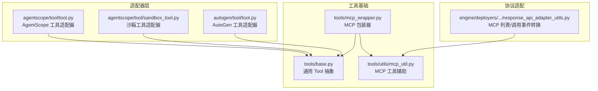
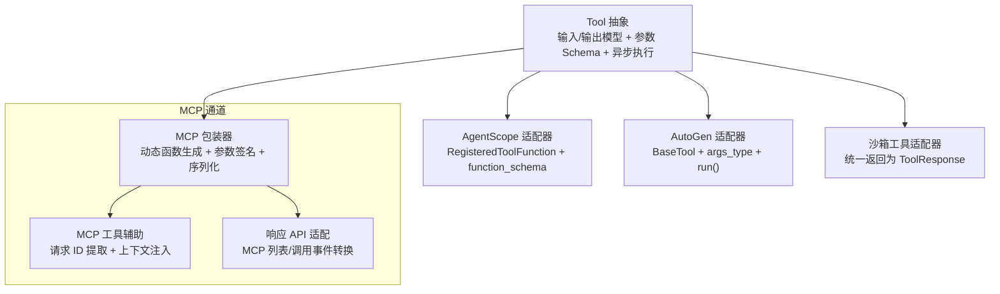
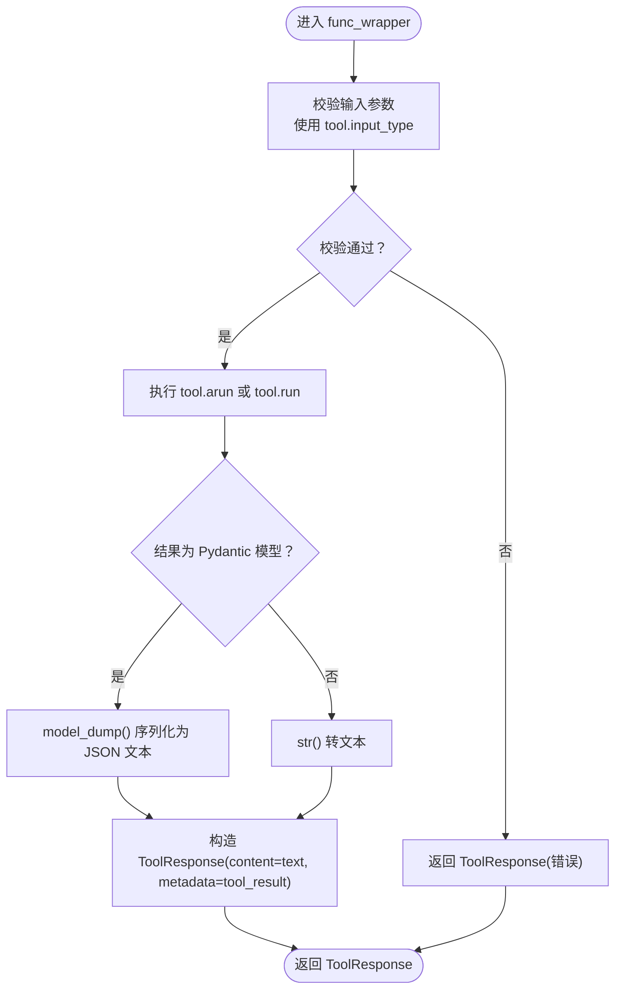
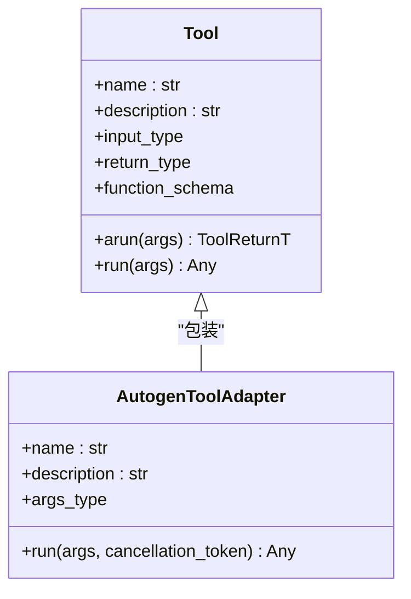
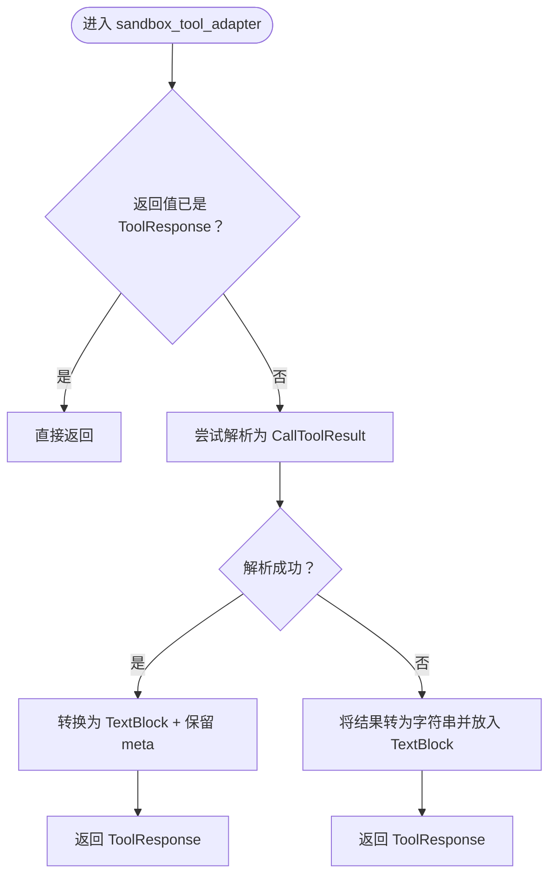
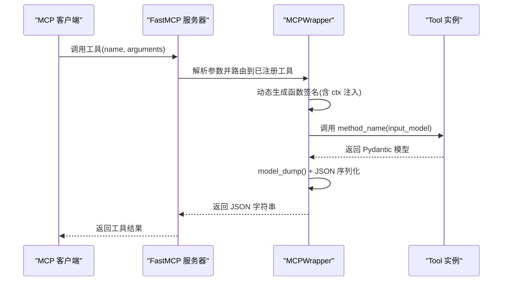
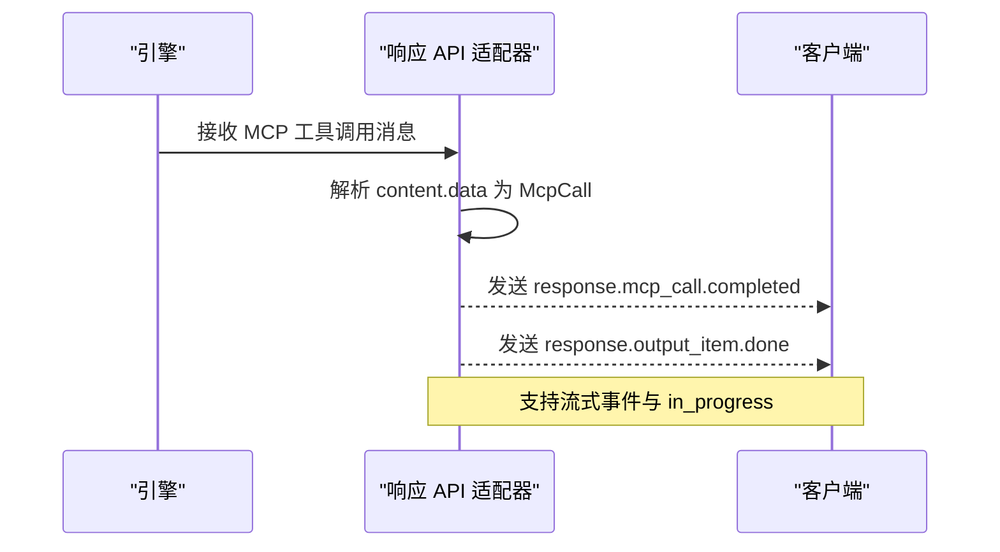
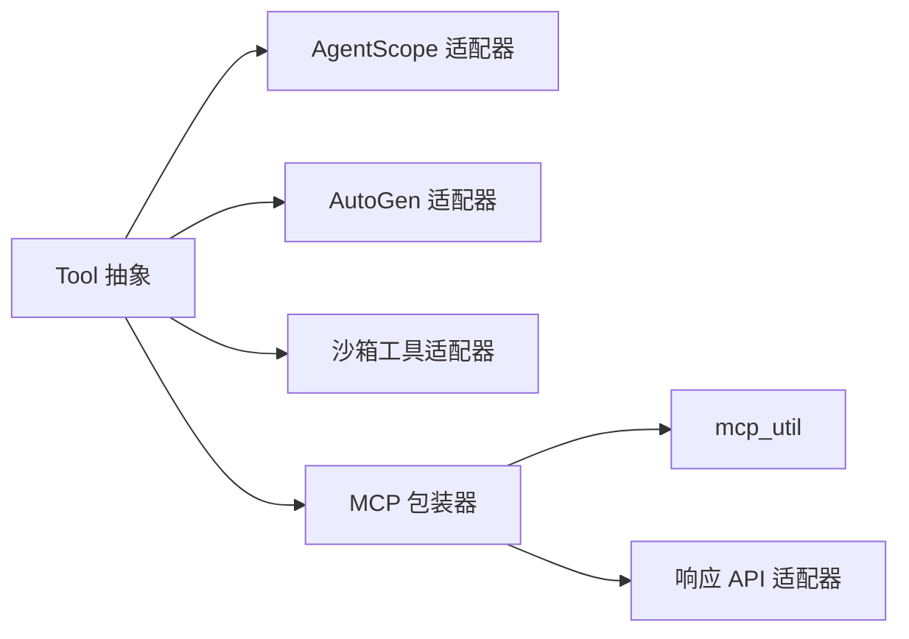

# 工具适配器

<cite>
**本文引用的文件**
- [src/agentscope_runtime/adapters/agentscope/tool/tool.py](file://src/agentscope_runtime/adapters/agentscope/tool/tool.py)
- [src/agentscope_runtime/adapters/agentscope/tool/sandbox_tool.py](file://src/agentscope_runtime/adapters/agentscope/tool/sandbox_tool.py)
- [src/agentscope_runtime/adapters/autogen/tool/tool.py](file://src/agentscope_runtime/adapters/autogen/tool/tool.py)
- [src/agentscope_runtime/tools/base.py](file://src/agentscope_runtime/tools/base.py)
- [src/agentscope_runtime/tools/mcp_wrapper.py](file://src/agentscope_runtime/tools/mcp_wrapper.py)
- [src/agentscope_runtime/tools/utils/mcp_util.py](file://src/agentscope_runtime/tools/utils/mcp_util.py)
- [src/agentscope_runtime/engine/deployers/adapter/responses/response_api_adapter_utils.py](file://src/agentscope_runtime/engine/deployers/adapter/responses/response_api_adapter_utils.py)
- [tests/tools/test_agentscope_tool_adapter.py](file://tests/tools/test_agentscope_tool_adapter.py)
- [tests/tools/test_autogen_tool_adapter.py](file://tests/tools/test_autogen_tool_adapter.py)
- [cookbook/zh/tools/tools.md](file://cookbook/zh/tools/tools.md)
- [cookbook/en/sandbox/sandbox_service.md](file://cookbook/en/sandbox/sandbox_service.md)
</cite>

## 目录
1. [简介](#简介)
2. [项目结构](#项目结构)
3. [核心组件](#核心组件)
4. [架构总览](#架构总览)
5. [详细组件分析](#详细组件分析)
6. [依赖分析](#依赖分析)
7. [性能考虑](#性能考虑)
8. [故障排查指南](#故障排查指南)
9. [结论](#结论)
10. [附录](#附录)

## 简介
本文件面向 AgentScope Runtime 的工具适配器，系统性阐述其设计模式与实现原理，覆盖以下重点：
- 框架适配器：AgentScope 工具适配器与 AutoGen 工具适配器的功能特性与使用方式
- 沙箱工具适配器：如何将沙箱能力包装为工具，以便在 AgentScope 工具集中统一调度
- MCP 工具适配机制：协议转换、消息封装与响应处理的实现要点
- 扩展指南：自定义适配器开发、协议适配与框架集成方法
- 兼容性策略：在不同智能体框架中的适配策略与注意事项
- 最佳实践：结合测试与示例，给出可落地的实现建议

## 项目结构
工具适配器主要分布在 adapters 子目录下，配合工具基类与 MCP 包装器共同构成统一的工具抽象与多框架适配层。

图示来源
- [src/agentscope_runtime/adapters/agentscope/tool/tool.py:1-232](file://src/agentscope_runtime/adapters/agentscope/tool/tool.py#L1-L232)
- [src/agentscope_runtime/adapters/agentscope/tool/sandbox_tool.py:1-70](file://src/agentscope_runtime/adapters/agentscope/tool/sandbox_tool.py#L1-L70)
- [src/agentscope_runtime/adapters/autogen/tool/tool.py:1-212](file://src/agentscope_runtime/adapters/autogen/tool/tool.py#L1-L212)
- [src/agentscope_runtime/tools/base.py:1-265](file://src/agentscope_runtime/tools/base.py#L1-L265)
- [src/agentscope_runtime/tools/mcp_wrapper.py:1-216](file://src/agentscope_runtime/tools/mcp_wrapper.py#L1-L216)
- [src/agentscope_runtime/tools/utils/mcp_util.py:1-36](file://src/agentscope_runtime/tools/utils/mcp_util.py#L1-L36)
- [src/agentscope_runtime/engine/deployers/adapter/responses/response_api_adapter_utils.py:2614-2889](file://src/agentscope_runtime/engine/deployers/adapter/responses/response_api_adapter_utils.py#L2614-L2889)

章节来源
- [src/agentscope_runtime/adapters/agentscope/tool/tool.py:1-232](file://src/agentscope_runtime/adapters/agentscope/tool/tool.py#L1-L232)
- [src/agentscope_runtime/adapters/agentscope/tool/sandbox_tool.py:1-70](file://src/agentscope_runtime/adapters/agentscope/tool/sandbox_tool.py#L1-L70)
- [src/agentscope_runtime/adapters/autogen/tool/tool.py:1-212](file://src/agentscope_runtime/adapters/autogen/tool/tool.py#L1-L212)
- [src/agentscope_runtime/tools/base.py:1-265](file://src/agentscope_runtime/tools/base.py#L1-L265)
- [src/agentscope_runtime/tools/mcp_wrapper.py:1-216](file://src/agentscope_runtime/tools/mcp_wrapper.py#L1-L216)
- [src/agentscope_runtime/tools/utils/mcp_util.py:1-36](file://src/agentscope_runtime/tools/utils/mcp_util.py#L1-L36)
- [src/agentscope_runtime/engine/deployers/adapter/responses/response_api_adapter_utils.py:2614-2889](file://src/agentscope_runtime/engine/deployers/adapter/responses/response_api_adapter_utils.py#L2614-L2889)

## 核心组件
- 通用工具基类：提供输入/输出模型、参数 Schema、异步执行桥接与类型安全校验
- AgentScope 适配器：将 Tool 包装为 Toolkit 可识别的 RegisteredToolFunction，并生成 OpenAI 兼容的 function schema
- AutoGen 适配器：将 Tool 包装为 AutoGen BaseTool，支持异步执行与取消令牌
- 沙箱工具适配器：将沙箱侧返回结果统一转换为 ToolResponse，保证与 Toolkit 的交互一致性
- MCP 包装器与工具辅助：动态生成参数签名、注入上下文、序列化返回值并对接 FastMCP

章节来源
- [src/agentscope_runtime/tools/base.py:34-161](file://src/agentscope_runtime/tools/base.py#L34-L161)
- [src/agentscope_runtime/adapters/agentscope/tool/tool.py:17-169](file://src/agentscope_runtime/adapters/agentscope/tool/tool.py#L17-L169)
- [src/agentscope_runtime/adapters/autogen/tool/tool.py:28-138](file://src/agentscope_runtime/adapters/autogen/tool/tool.py#L28-L138)
- [src/agentscope_runtime/adapters/agentscope/tool/sandbox_tool.py:15-70](file://src/agentscope_runtime/adapters/agentscope/tool/sandbox_tool.py#L15-L70)
- [src/agentscope_runtime/tools/mcp_wrapper.py:14-216](file://src/agentscope_runtime/tools/mcp_wrapper.py#L14-L216)
- [src/agentscope_runtime/tools/utils/mcp_util.py:10-36](file://src/agentscope_runtime/tools/utils/mcp_util.py#L10-L36)

## 架构总览
工具适配器围绕统一的 Tool 抽象展开，向上对齐不同智能体框架的工具契约，向下对接 MCP 协议与沙箱执行环境。

图示来源
- [src/agentscope_runtime/tools/base.py:34-161](file://src/agentscope_runtime/tools/base.py#L34-L161)
- [src/agentscope_runtime/adapters/agentscope/tool/tool.py:17-169](file://src/agentscope_runtime/adapters/agentscope/tool/tool.py#L17-L169)
- [src/agentscope_runtime/adapters/autogen/tool/tool.py:28-138](file://src/agentscope_runtime/adapters/autogen/tool/tool.py#L28-L138)
- [src/agentscope_runtime/adapters/agentscope/tool/sandbox_tool.py:15-70](file://src/agentscope_runtime/adapters/agentscope/tool/sandbox_tool.py#L15-L70)
- [src/agentscope_runtime/tools/mcp_wrapper.py:14-216](file://src/agentscope_runtime/tools/mcp_wrapper.py#L14-L216)
- [src/agentscope_runtime/tools/utils/mcp_util.py:10-36](file://src/agentscope_runtime/tools/utils/mcp_util.py#L10-L36)
- [src/agentscope_runtime/engine/deployers/adapter/responses/response_api_adapter_utils.py:2614-2889](file://src/agentscope_runtime/engine/deployers/adapter/responses/response_api_adapter_utils.py#L2614-L2889)

## 详细组件分析

### AgentScope 工具适配器
- 功能概述
  - 将任意继承自 Tool 的实例包装为 AgentScope 的 RegisteredToolFunction
  - 自动提取并转换 function_schema 为 OpenAI 兼容格式
  - 在运行时进行输入校验、异步/同步执行桥接与结果格式化
- 关键点
  - 输入校验：若存在 input_type，则使用 Pydantic 校验；失败时返回 ToolResponse 并标记错误元数据
  - 异步执行：检测 arun 是否协程，必要时在线程池中安全运行 asyncio.run
  - 结果格式化：优先使用 model_dump 输出 JSON 字符串，否则回退为字符串
  - Schema 转换：从 Tool.function_schema 生成 AgentScope function schema
- 使用方式
  - 单工具适配：agentscope_tool_adapter(tool, name_override, description_override)
  - 批量适配：agentscope_toolkit_adapter(tools, name_overrides, description_overrides)

图示来源
- [src/agentscope_runtime/adapters/agentscope/tool/tool.py:59-144](file://src/agentscope_runtime/adapters/agentscope/tool/tool.py#L59-L144)

章节来源
- [src/agentscope_runtime/adapters/agentscope/tool/tool.py:17-169](file://src/agentscope_runtime/adapters/agentscope/tool/tool.py#L17-L169)
- [tests/tools/test_agentscope_tool_adapter.py:39-244](file://tests/tools/test_agentscope_tool_adapter.py#L39-L244)

### AutoGen 工具适配器
- 功能概述
  - 将 Tool 包装为 AutoGen BaseTool，继承其类型系统与运行时契约
  - 自动从 Tool.input_type 生成 args_type，返回类型由 Tool.return_type 决定
  - run 方法异步执行并返回 JSON 字符串，便于 AutoGen 消息传递
- 关键点
  - 导入保护：未安装 autogen-core 时抛出明确异常
  - 参数模型：直接复用 Tool 的 Pydantic 输入模型
  - 错误增强：捕获异常后附加工具名称与上下文信息
- 使用方式
  - 单工具：AutogenToolAdapter(tool, name, description)
  - 批量：create_autogen_tools(tools, name_overrides, description_overrides)

图示来源
- [src/agentscope_runtime/adapters/autogen/tool/tool.py:28-138](file://src/agentscope_runtime/adapters/autogen/tool/tool.py#L28-L138)
- [src/agentscope_runtime/tools/base.py:34-161](file://src/agentscope_runtime/tools/base.py#L34-L161)

章节来源
- [src/agentscope_runtime/adapters/autogen/tool/tool.py:28-138](file://src/agentscope_runtime/adapters/autogen/tool/tool.py#L28-L138)
- [tests/tools/test_autogen_tool_adapter.py:39-112](file://tests/tools/test_autogen_tool_adapter.py#L39-L112)

### 沙箱工具适配器
- 功能概述
  - 将沙箱侧工具函数的返回值统一转换为 ToolResponse，确保与 Toolkit 的交互一致性
  - 若返回值已是 ToolResponse 则直接透传
  - 若返回值可被解析为 MCP 的 CallToolResult，则转换为 TextBlock 内容并保留 meta
  - 失败时回退为将原始结果转为字符串并放入 TextBlock
- 关键点
  - 与 MCPClientBase 的内容转换协作，保证多模态内容块的一致性
  - 记录警告日志，便于定位问题

图示来源
- [src/agentscope_runtime/adapters/agentscope/tool/sandbox_tool.py:32-67](file://src/agentscope_runtime/adapters/agentscope/tool/sandbox_tool.py#L32-L67)

章节来源
- [src/agentscope_runtime/adapters/agentscope/tool/sandbox_tool.py:15-70](file://src/agentscope_runtime/adapters/agentscope/tool/sandbox_tool.py#L15-L70)

### MCP 工具适配机制
- 动态函数生成
  - 基于 Tool.input_type 的字段列表动态生成异步函数签名，自动处理必填/可选参数与默认值
  - 特殊处理 ctx 参数：保留用于 FastMCP 上下文注入，但将其从工具 Schema 中移除
- 参数与 Schema
  - 从 Tool.function_schema.parameters 更新 FastMCP 工具的参数定义
  - 通过装饰器将生成的函数注册为 MCP 工具
- 返回值处理
  - 调用 tool.method_name（默认 arun）并等待异步结果
  - 将 Pydantic 模型结果 model_dump() 后 JSON 序列化，作为 MCP 返回值
- 上下文与追踪
  - 从 FastMCP Context 中提取 dashscope_request_id 并设置到 TracingUtil，实现端到端追踪

图示来源
- [src/agentscope_runtime/tools/mcp_wrapper.py:37-215](file://src/agentscope_runtime/tools/mcp_wrapper.py#L37-L215)
- [src/agentscope_runtime/tools/utils/mcp_util.py:10-36](file://src/agentscope_runtime/tools/utils/mcp_util.py#L10-L36)

章节来源
- [src/agentscope_runtime/tools/mcp_wrapper.py:14-216](file://src/agentscope_runtime/tools/mcp_wrapper.py#L14-L216)
- [src/agentscope_runtime/tools/utils/mcp_util.py:10-36](file://src/agentscope_runtime/tools/utils/mcp_util.py#L10-L36)

### 响应 API 与 MCP 事件转换
- 目标
  - 将 MCP 工具调用与工具列表事件映射为 Responses API 的标准事件结构，便于统一消费与流式输出
- 关键流程
  - MCP 工具调用消息转换为 McpCall，提取 name、arguments、server_label 等字段
  - 生成 response.mcp_call.completed 与 response.output_item.done 等事件序列
  - 支持响应流中的 in_progress 与 item 添加事件，保证客户端可逐步接收结果

图示来源
- [src/agentscope_runtime/engine/deployers/adapter/responses/response_api_adapter_utils.py:2618-2885](file://src/agentscope_runtime/engine/deployers/adapter/responses/response_api_adapter_utils.py#L2618-L2885)

章节来源
- [src/agentscope_runtime/engine/deployers/adapter/responses/response_api_adapter_utils.py:2614-2889](file://src/agentscope_runtime/engine/deployers/adapter/responses/response_api_adapter_utils.py#L2614-L2889)

## 依赖分析
- 适配器与工具基类
  - AgentScope 适配器依赖 Tool 的 function_schema、input_type、run/arun
  - AutoGen 适配器依赖 Tool 的 input_type、return_type、arun
  - 沙箱工具适配器依赖 ToolResponse 与 MCP 类型（CallToolResult）
- MCP 通道
  - MCPWrapper 依赖 FastMCP、Pydantic BaseModel、TracingUtil、mcp_util
  - mcp_util 提供从 HTTP 头部提取 dashscope_request_id 的能力
- 协议适配
  - 响应 API 适配器负责将 MCP 事件转换为统一的流式事件结构

图示来源
- [src/agentscope_runtime/tools/base.py:34-161](file://src/agentscope_runtime/tools/base.py#L34-L161)
- [src/agentscope_runtime/adapters/agentscope/tool/tool.py:17-169](file://src/agentscope_runtime/adapters/agentscope/tool/tool.py#L17-L169)
- [src/agentscope_runtime/adapters/autogen/tool/tool.py:28-138](file://src/agentscope_runtime/adapters/autogen/tool/tool.py#L28-L138)
- [src/agentscope_runtime/adapters/agentscope/tool/sandbox_tool.py:15-70](file://src/agentscope_runtime/adapters/agentscope/tool/sandbox_tool.py#L15-L70)
- [src/agentscope_runtime/tools/mcp_wrapper.py:14-216](file://src/agentscope_runtime/tools/mcp_wrapper.py#L14-L216)
- [src/agentscope_runtime/tools/utils/mcp_util.py:10-36](file://src/agentscope_runtime/tools/utils/mcp_util.py#L10-L36)
- [src/agentscope_runtime/engine/deployers/adapter/responses/response_api_adapter_utils.py:2614-2889](file://src/agentscope_runtime/engine/deployers/adapter/responses/response_api_adapter_utils.py#L2614-L2889)

章节来源
- [src/agentscope_runtime/tools/base.py:34-161](file://src/agentscope_runtime/tools/base.py#L34-L161)
- [src/agentscope_runtime/adapters/agentscope/tool/tool.py:17-169](file://src/agentscope_runtime/adapters/agentscope/tool/tool.py#L17-L169)
- [src/agentscope_runtime/adapters/autogen/tool/tool.py:28-138](file://src/agentscope_runtime/adapters/autogen/tool/tool.py#L28-L138)
- [src/agentscope_runtime/adapters/agentscope/tool/sandbox_tool.py:15-70](file://src/agentscope_runtime/adapters/agentscope/tool/sandbox_tool.py#L15-L70)
- [src/agentscope_runtime/tools/mcp_wrapper.py:14-216](file://src/agentscope_runtime/tools/mcp_wrapper.py#L14-L216)
- [src/agentscope_runtime/tools/utils/mcp_util.py:10-36](file://src/agentscope_runtime/tools/utils/mcp_util.py#L10-L36)
- [src/agentscope_runtime/engine/deployers/adapter/responses/response_api_adapter_utils.py:2614-2889](file://src/agentscope_runtime/engine/deployers/adapter/responses/response_api_adapter_utils.py#L2614-L2889)

## 性能考虑
- 异步优先：Tool.arun 为异步实现，适配器在执行时尽量避免阻塞，必要时使用线程池桥接
- 结果序列化：优先使用 model_dump() 进行结构化输出，减少二次解析成本
- Schema 生成：function_schema 来源于 Pydantic 模型，避免重复构建，提升工具注册效率
- MCP 动态函数：仅在首次注册时生成签名，后续复用，降低运行时开销
- 日志与追踪：在关键路径记录警告与追踪 ID，便于定位性能瓶颈

## 故障排查指南
- AgentScope 适配器
  - 输入校验失败：检查 Tool.input_type 定义是否与调用参数匹配
  - 执行异常：确认 tool.arun 是否抛出异常，适配器会将其包装为 ToolResponse 并标记错误
  - 结果格式异常：确保返回值可被 model_dump 序列化，否则将回退为字符串
- AutoGen 适配器
  - 未安装 autogen-core：根据导入保护提示安装依赖
  - 取消令牌：确保在调用 run 时传入有效的 CancellationToken
- 沙箱工具适配器
  - 返回值非标准：若沙箱返回非 ToolResponse/非 CallToolResult，将回退为字符串包装
  - 日志告警：关注适配器警告日志，定位函数签名、参数或返回值问题
- MCP 包装器
  - 参数缺失：检查 Tool.input_type 字段是否正确，动态生成的函数签名依赖它
  - 上下文丢失：确认 FastMCP Context 是否包含 dashscope_request_id，否则将生成新 ID

章节来源
- [tests/tools/test_agentscope_tool_adapter.py:114-127](file://tests/tools/test_agentscope_tool_adapter.py#L114-L127)
- [tests/tools/test_autogen_tool_adapter.py:80-98](file://tests/tools/test_autogen_tool_adapter.py#L80-L98)
- [src/agentscope_runtime/adapters/agentscope/tool/sandbox_tool.py:48-67](file://src/agentscope_runtime/adapters/agentscope/tool/sandbox_tool.py#L48-L67)
- [src/agentscope_runtime/tools/mcp_wrapper.py:136-191](file://src/agentscope_runtime/tools/mcp_wrapper.py#L136-L191)

## 结论
AgentScope Runtime 的工具适配器通过统一的 Tool 抽象，实现了对 AgentScope、AutoGen、MCP 等多框架的无缝适配。AgentScope 适配器负责将工具注册为 Toolkit 可用的函数；AutoGen 适配器提供与 BaseTool 的兼容；沙箱工具适配器确保沙箱侧结果与 Toolkit 的一致性；MCP 包装器则打通了协议转换与事件流式输出。结合测试与示例，开发者可快速扩展自定义适配器与工具，满足复杂业务场景下的兼容性与可维护性需求。

## 附录
- 开发建议
  - 新增工具时，优先定义清晰的 Pydantic 输入/输出模型，确保 Schema 自动生成与类型安全
  - 在需要跨框架复用的场景，优先选择 AgentScope 或 AutoGen 适配器作为统一入口
  - 沙箱工具适配器适用于高风险操作，需严格控制返回值格式并开启日志监控
  - MCP 适配建议使用包装器自动生成函数签名，避免手动维护参数与类型注解
- 参考文档
  - 工具设计原则与跨框架集成说明：[cookbook/zh/tools/tools.md:1-302](file://cookbook/zh/tools/tools.md#L1-L302)
  - 沙箱服务与适配器使用建议：[cookbook/en/sandbox/sandbox_service.md:116-163](file://cookbook/en/sandbox/sandbox_service.md#L116-L163)