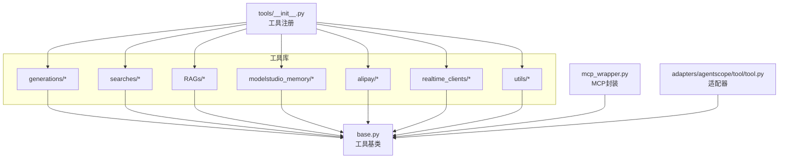
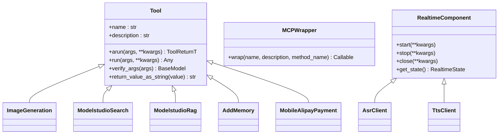
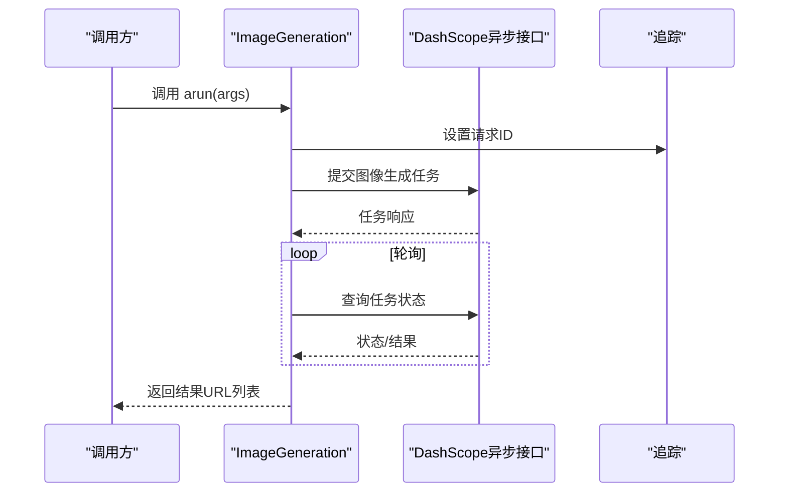
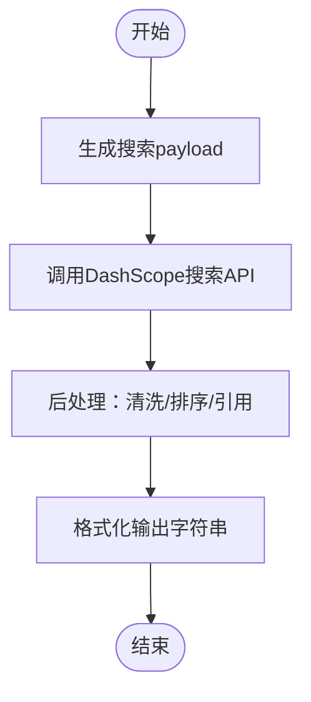
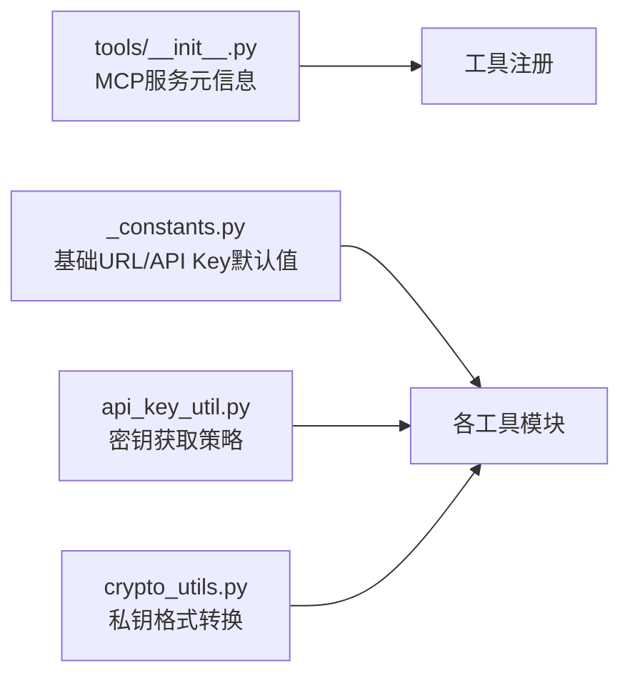

# 开箱即用工具

<cite>
**本文档引用的文件**
- [tools/__init__.py](file://src/agentscope_runtime/tools/__init__.py)
- [tools/base.py](file://src/agentscope_runtime/tools/base.py)
- [tools/mcp_wrapper.py](file://src/agentscope_runtime/tools/mcp_wrapper.py)
- [adapters/agentscope/tool/tool.py](file://src/agentscope_runtime/adapters/agentscope/tool/tool.py)
- [tools/_constants.py](file://src/agentscope_runtime/tools/_constants.py)
- [tools/generations/image_generation.py](file://src/agentscope_runtime/tools/generations/image_generation.py)
- [tools/searches/modelstudio_search.py](file://src/agentscope_runtime/tools/searches/modelstudio_search.py)
- [tools/RAGs/modelstudio_rag.py](file://src/agentscope_runtime/tools/RAGs/modelstudio_rag.py)
- [tools/modelstudio_memory/core.py](file://src/agentscope_runtime/tools/modelstudio_memory/core.py)
- [tools/alipay/payment.py](file://src/agentscope_runtime/tools/alipay/payment.py)
- [tools/realtime_clients/asr_client.py](file://src/agentscope_runtime/tools/realtime_clients/asr_client.py)
- [tools/realtime_clients/tts_client.py](file://src/agentscope_runtime/tools/realtime_clients/tts_client.py)
- [tools/realtime_clients/realtime_tool.py](file://src/agentscope_runtime/tools/realtime_clients/realtime_tool.py)
- [tools/utils/api_key_util.py](file://src/agentscope_runtime/tools/utils/api_key_util.py)
- [tools/utils/crypto_utils.py](file://src/agentscope_runtime/tools/utils/crypto_utils.py)
</cite>

## 目录
1. [简介](#简介)
2. [项目结构](#项目结构)
3. [核心组件](#核心组件)
4. [架构总览](#架构总览)
5. [详细组件分析](#详细组件分析)
6. [依赖分析](#依赖分析)
7. [性能考虑](#性能考虑)
8. [故障排查指南](#故障排查指南)
9. [结论](#结论)
10. [附录](#附录)

## 简介
本文件面向AgentScope Runtime的“开箱即用工具”能力，系统性阐述工具库体系的架构设计与扩展机制，覆盖工具基类、工具注册与适配器模式；深入解析生成类工具（图像生成、文本转语音、视频生成等）、实时客户端工具（ASR/TTS）、搜索工具、记忆工具与支付工具的功能与使用方式；并提供工具适配指南、自定义工具开发示例与最佳实践，以及性能优化建议。

## 项目结构
- 工具库位于 tools 子包，按功能域划分：
  - generations：生成类工具（图像/视频/语音）
  - searches：网络搜索工具
  - RAGs：模型平台知识库检索增强工具
  - modelstudio_memory：记忆工具（增删查改、档案管理）
  - alipay：支付工具（移动端/网页端支付、查询、退款）
  - realtime_clients：实时客户端（ASR/TTS）
  - utils：通用工具（密钥、加密）
- 适配层位于 adapters，提供与第三方框架（如AgentScope）的桥接
- MCP封装位于 tools/mcp_wrapper.py，便于将工具暴露为MCP工具

图示来源
- [tools/__init__.py:1-120](file://src/agentscope_runtime/tools/__init__.py#L1-L120)
- [tools/base.py:34-265](file://src/agentscope_runtime/tools/base.py#L34-L265)
- [tools/mcp_wrapper.py:14-216](file://src/agentscope_runtime/tools/mcp_wrapper.py#L14-L216)
- [adapters/agentscope/tool/tool.py:17-232](file://src/agentscope_runtime/adapters/agentscope/tool/tool.py#L17-L232)

章节来源
- [tools/__init__.py:1-120](file://src/agentscope_runtime/tools/__init__.py#L1-L120)

## 核心组件
- 工具基类 Tool：统一异步/同步执行、参数校验、函数Schema生成、类型安全与错误处理
- MCP封装 MCPWrapper：将Tool包装为MCP工具，自动推导参数签名与类型注解
- 适配器 agentscope_tool_adapter：将Runtime工具适配为AgentScope Toolkit可用的RegisteredToolFunction
- 常量与密钥工具：统一API基础地址、密钥获取策略与私钥格式化

章节来源
- [tools/base.py:34-265](file://src/agentscope_runtime/tools/base.py#L34-L265)
- [tools/mcp_wrapper.py:14-216](file://src/agentscope_runtime/tools/mcp_wrapper.py#L14-L216)
- [adapters/agentscope/tool/tool.py:17-232](file://src/agentscope_runtime/adapters/agentscope/tool/tool.py#L17-L232)
- [tools/_constants.py:1-19](file://src/agentscope_runtime/tools/_constants.py#L1-L19)
- [tools/utils/api_key_util.py:13-46](file://src/agentscope_runtime/tools/utils/api_key_util.py#L13-L46)

## 架构总览
- 工具基类 Tool 提供统一的泛型输入/输出类型约束、参数Schema解析、异步执行入口与同步桥接
- 各具体工具继承 Tool 并实现 _arun，遵循输入/输出Pydantic模型约定
- MCPWrapper 将 Tool 实例动态包装为MCP工具，自动注入ctx上下文、参数过滤与结果序列化
- 适配器将Runtime工具转换为AgentScope Toolkit可用的函数式工具，兼容不同运行时生态

图示来源
- [tools/base.py:34-265](file://src/agentscope_runtime/tools/base.py#L34-L265)
- [tools/mcp_wrapper.py:14-216](file://src/agentscope_runtime/tools/mcp_wrapper.py#L14-L216)
- [tools/realtime_clients/realtime_tool.py:21-56](file://src/agentscope_runtime/tools/realtime_clients/realtime_tool.py#L21-L56)
- [tools/generations/image_generation.py:70-203](file://src/agentscope_runtime/tools/generations/image_generation.py#L70-L203)
- [tools/searches/modelstudio_search.py:102-221](file://src/agentscope_runtime/tools/searches/modelstudio_search.py#L102-L221)
- [tools/RAGs/modelstudio_rag.py:74-174](file://src/agentscope_runtime/tools/RAGs/modelstudio_rag.py#L74-L174)
- [tools/modelstudio_memory/core.py:55-158](file://src/agentscope_runtime/tools/modelstudio_memory/core.py#L55-L158)
- [tools/alipay/payment.py:170-308](file://src/agentscope_runtime/tools/alipay/payment.py#L170-L308)
- [tools/realtime_clients/asr_client.py:13-28](file://src/agentscope_runtime/tools/realtime_clients/asr_client.py#L13-L28)
- [tools/realtime_clients/tts_client.py:13-34](file://src/agentscope_runtime/tools/realtime_clients/tts_client.py#L13-L34)

## 详细组件分析

### 工具基类与适配器
- Tool
  - 泛型约束：ToolArgsT/ToolReturnT确保输入输出类型安全
  - 参数Schema：从输入模型自动生成OpenAI风格函数Schema
  - 异步执行：arun统一入口，run提供同步桥接
  - 类型验证：verify_args/verify_list_args支持字符串/字典/BaseModel输入
- MCPWrapper
  - 动态生成带类型注解的异步函数签名
  - 自动注入ctx上下文、过滤ctx字段、设置追踪ID
  - 将结果序列化为JSON字符串返回
- 适配器 agentscope_tool_adapter
  - 将Runtime工具包装为AgentScope RegisteredToolFunction
  - 自动转换函数Schema与结果格式，保证跨生态兼容

章节来源
- [tools/base.py:34-265](file://src/agentscope_runtime/tools/base.py#L34-L265)
- [tools/mcp_wrapper.py:37-216](file://src/agentscope_runtime/tools/mcp_wrapper.py#L37-L216)
- [adapters/agentscope/tool/tool.py:17-232](file://src/agentscope_runtime/adapters/agentscope/tool/tool.py#L17-L232)

### 生成类工具
- 图像生成 ImageGeneration
  - 输入：提示词、尺寸、负向提示、数量、水印等
  - 流程：提交任务 → 轮询状态 → 获取结果 → 返回URL列表
  - 配置：模型名、API Key、超时控制
- 文本转语音（示例：QwenTextToSpeech）
  - 输入：文本、音色、语速等
  - 输出：音频URL或二进制数据
- 视频生成（文本/图像/语音到视频）
  - 提交任务 → 异步轮询 → 获取结果
  - 支持多模态输入与批量生成

图示来源
- [tools/generations/image_generation.py:78-203](file://src/agentscope_runtime/tools/generations/image_generation.py#L78-L203)

章节来源
- [tools/generations/image_generation.py:21-203](file://src/agentscope_runtime/tools/generations/image_generation.py#L21-L203)

### 搜索工具
- ModelstudioSearch
  - 输入：消息列表、搜索选项、输出规则、超时
  - 流程：构造payload → 发起搜索 → 结果后处理（去噪/排序/引用）
  - 输出：格式化字符串+附加信息
  - 关键点：支持多策略场景、绿网过滤、引用标注、图像搜索

图示来源
- [tools/searches/modelstudio_search.py:114-221](file://src/agentscope_runtime/tools/searches/modelstudio_search.py#L114-L221)

章节来源
- [tools/searches/modelstudio_search.py:47-878](file://src/agentscope_runtime/tools/searches/modelstudio_search.py#L47-L878)

### 记忆工具
- AddMemory：新增对话记忆节点
- SearchMemory：基于上下文检索相关记忆
- ListMemory/DeleteMemory：分页列出/删除记忆节点
- ProfileSchema/UserProfile：档案Schema与用户档案的创建、查询与管理
- 统一通过ModelStudioMemoryBase封装HTTP请求与响应解析

章节来源
- [tools/modelstudio_memory/core.py:55-800](file://src/agentscope_runtime/tools/modelstudio_memory/core.py#L55-L800)

### 支付工具
- MobileAlipayPayment/WebPageAlipayPayment：移动端/网页端支付下单，返回可访问链接
- AlipayPaymentQuery：查询订单状态
- AlipayPaymentRefund/AlipayRefundQuery：发起退款与查询退款状态
- 统一使用Alipay SDK，支持扩展参数注入与回调地址配置

章节来源
- [tools/alipay/payment.py:170-800](file://src/agentscope_runtime/tools/alipay/payment.py#L170-L800)

### 实时客户端工具
- RealtimeComponent：抽象实时组件，定义状态枚举与生命周期方法
- AsrClient：语音识别客户端（接收音频数据）
- TtsClient：文本转语音客户端（发送文本、设置会话ID）

章节来源
- [tools/realtime_clients/realtime_tool.py:21-56](file://src/agentscope_runtime/tools/realtime_clients/realtime_tool.py#L21-L56)
- [tools/realtime_clients/asr_client.py:13-28](file://src/agentscope_runtime/tools/realtime_clients/asr_client.py#L13-L28)
- [tools/realtime_clients/tts_client.py:13-34](file://src/agentscope_runtime/tools/realtime_clients/tts_client.py#L13-L34)

### RAG工具
- ModelstudioRag：从用户知识库召回信息，更新系统提示并返回增强后的消息
- 支持多索引/管道ID、多模态输入（图片URL）、REST token控制

章节来源
- [tools/RAGs/modelstudio_rag.py:74-378](file://src/agentscope_runtime/tools/RAGs/modelstudio_rag.py#L74-L378)

## 依赖分析
- 工具注册与元信息
  - tools/__init__.py 中定义McpServerMeta与组件映射，按服务场景聚合工具集合
- 常量与密钥
  - _constants.py 提供DashScope基础URL与API Key读取默认值
  - api_key_util 提供统一的密钥来源优先级策略
- 加密工具
  - crypto_utils 提供RSA私钥格式转换（PKCS#1），用于需要特定格式的场景

图示来源
- [tools/__init__.py:65-120](file://src/agentscope_runtime/tools/__init__.py#L65-L120)
- [tools/_constants.py:1-19](file://src/agentscope_runtime/tools/_constants.py#L1-L19)
- [tools/utils/api_key_util.py:13-46](file://src/agentscope_runtime/tools/utils/api_key_util.py#L13-L46)
- [tools/utils/crypto_utils.py:17-100](file://src/agentscope_runtime/tools/utils/crypto_utils.py#L17-L100)

章节来源
- [tools/__init__.py:76-120](file://src/agentscope_runtime/tools/__init__.py#L76-L120)
- [tools/_constants.py:4-18](file://src/agentscope_runtime/tools/_constants.py#L4-L18)
- [tools/utils/api_key_util.py:13-46](file://src/agentscope_runtime/tools/utils/api_key_util.py#L13-L46)
- [tools/utils/crypto_utils.py:17-100](file://src/agentscope_runtime/tools/utils/crypto_utils.py#L17-L100)

## 性能考虑
- 异步与轮询
  - 生成类工具采用异步提交+轮询，合理设置轮询间隔与超时，避免阻塞
- 网络请求
  - 搜索/RAG工具使用aiohttp并发请求，注意连接池与超时配置
- 结果缓存
  - 对高频查询（如支付状态、退款状态）可在上层引入缓存策略
- 参数校验
  - 使用Pydantic模型严格约束输入，减少无效请求与重试成本
- 密钥与加密
  - 通过统一密钥工具与私钥格式化工具，降低配置错误带来的性能损耗

## 故障排查指南
- 工具执行错误
  - 检查输入模型验证（verify_args）与返回类型（return_type）一致性
  - 查看工具内部异常日志与Trace事件
- API密钥问题
  - 确认环境变量或传入参数中API Key来源正确
  - 使用api_key_util进行调试与断言
- 加密相关
  - 若涉及私钥转换，检查格式与完整性，必要时重新生成PKCS#1格式
- 实时客户端
  - 确认组件状态切换（IDLE/RUNNING）与回调注册
- 支付工具
  - 核对回调地址、扩展参数与幂等请求号，避免重复退款

章节来源
- [tools/base.py:196-265](file://src/agentscope_runtime/tools/base.py#L196-L265)
- [tools/utils/api_key_util.py:13-46](file://src/agentscope_runtime/tools/utils/api_key_util.py#L13-L46)
- [tools/utils/crypto_utils.py:17-100](file://src/agentscope_runtime/tools/utils/crypto_utils.py#L17-L100)
- [tools/realtime_clients/realtime_tool.py:9-56](file://src/agentscope_runtime/tools/realtime_clients/realtime_tool.py#L9-L56)
- [tools/alipay/payment.py:268-308](file://src/agentscope_runtime/tools/alipay/payment.py#L268-L308)

## 结论
AgentScope Runtime的工具库以Tool基类为核心，结合MCP封装与适配器，实现了跨生态、强类型、可扩展的工具体系。通过统一的参数Schema、异步执行与错误处理，开发者可快速接入生成类、搜索、RAG、记忆、支付与实时客户端等工具，并按需扩展与优化性能。

## 附录

### 工具适配指南
- 将Runtime工具适配为AgentScope工具
  - 使用 agentscope_tool_adapter 将Tool实例包装为RegisteredToolFunction
  - 可批量适配：agentscope_toolkit_adapter
- 注意事项
  - 确保输入/输出模型符合Pydantic约束
  - 保持函数Schema与工具描述一致
  - 在同步环境中使用run桥接异步arun

章节来源
- [adapters/agentscope/tool/tool.py:17-232](file://src/agentscope_runtime/adapters/agentscope/tool/tool.py#L17-L232)

### 自定义工具开发示例（步骤）
- 定义输入/输出模型（继承BaseModel）
- 继承 Tool 并实现 _arun
- 在 tools/__init__.py 中注册到对应MCP服务元信息
- 如需MCP暴露，使用 MCPWrapper.wrap 包装
- 如需AgentScope适配，使用 agentscope_tool_adapter

章节来源
- [tools/base.py:34-128](file://src/agentscope_runtime/tools/base.py#L34-L128)
- [tools/mcp_wrapper.py:37-216](file://src/agentscope_runtime/tools/mcp_wrapper.py#L37-L216)
- [tools/__init__.py:76-120](file://src/agentscope_runtime/tools/__init__.py#L76-L120)

### 工具使用示例（路径指引）
- 图像生成
  - 输入模型字段：提示词、尺寸、负向提示、数量、水印等
  - 路径：[tools/generations/image_generation.py:21-70](file://src/agentscope_runtime/tools/generations/image_generation.py#L21-L70)
- 搜索
  - 输入模型字段：messages、search_options、search_output_rules、search_timeout、type
  - 路径：[tools/searches/modelstudio_search.py:47-84](file://src/agentscope_runtime/tools/searches/modelstudio_search.py#L47-L84)
- RAG
  - 输入模型字段：messages、rag_options、rest_token、image_urls、workspace_id
  - 路径：[tools/RAGs/modelstudio_rag.py:28-51](file://src/agentscope_runtime/tools/RAGs/modelstudio_rag.py#L28-L51)
- 记忆
  - Add/Search/List/Delete/ProfileSchema/UserProfile 等
  - 路径：[tools/modelstudio_memory/core.py:55-800](file://src/agentscope_runtime/tools/modelstudio_memory/core.py#L55-L800)
- 支付
  - Mobile/WebPage/Query/Refund/RefundQuery
  - 路径：[tools/alipay/payment.py:170-800](file://src/agentscope_runtime/tools/alipay/payment.py#L170-L800)
- 实时客户端
  - AsrClient/TtsClient
  - 路径：[tools/realtime_clients/asr_client.py:13-28](file://src/agentscope_runtime/tools/realtime_clients/asr_client.py#L13-L28), [tools/realtime_clients/tts_client.py:13-34](file://src/agentscope_runtime/tools/realtime_clients/tts_client.py#L13-L34)