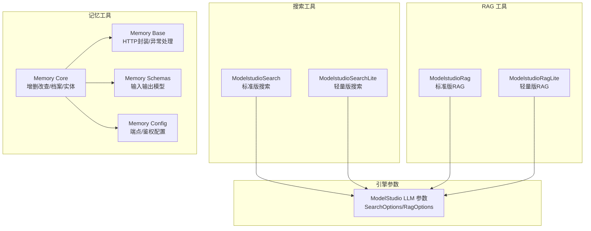
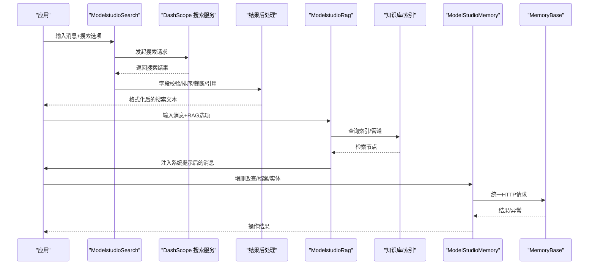
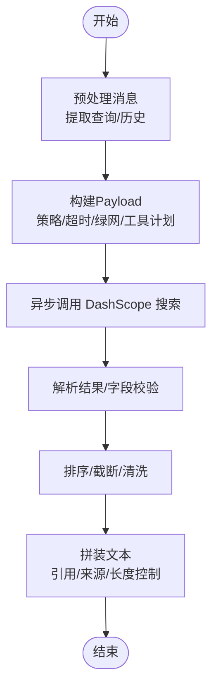
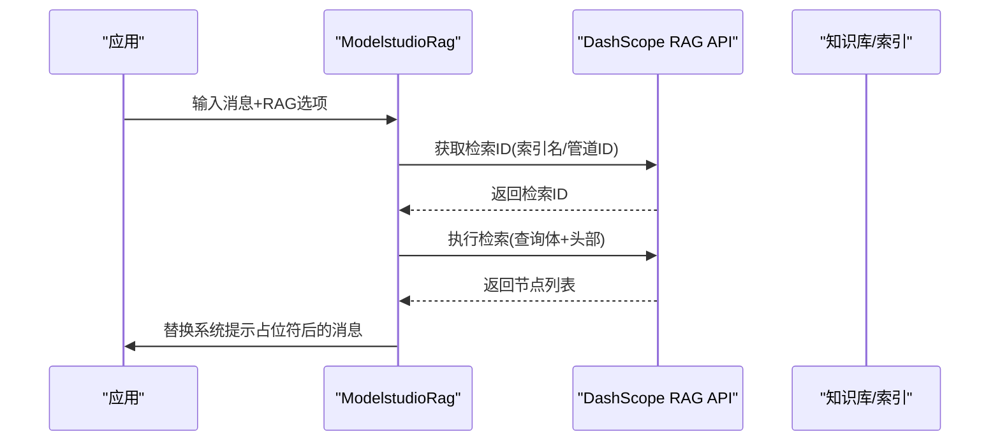
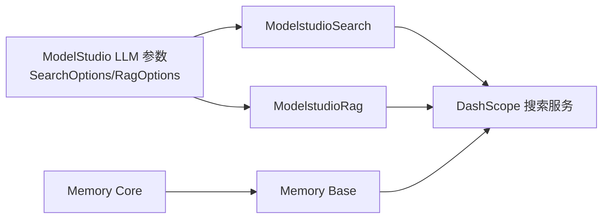

# 搜索和记忆工具

<cite>
**本文引用的文件**
- [modelstudio_search.py](file://src/agentscope_runtime/tools/searches/modelstudio_search.py)
- [modelstudio_search_lite.py](file://src/agentscope_runtime/tools/searches/modelstudio_search_lite.py)
- [modelstudio_rag.py](file://src/agentscope_runtime/tools/RAGs/modelstudio_rag.py)
- [modelstudio_rag_lite.py](file://src/agentscope_runtime/tools/RAGs/modelstudio_rag_lite.py)
- [core.py](file://src/agentscope_runtime/tools/modelstudio_memory/core.py)
- [base.py](file://src/agentscope_runtime/tools/modelstudio_memory/base.py)
- [schemas.py](file://src/agentscope_runtime/tools/modelstudio_memory/schemas.py)
- [config.py](file://src/agentscope_runtime/tools/modelstudio_memory/config.py)
- [modelstudio_llm.py](file://src/agentscope_runtime/engine/schemas/modelstudio_llm.py)
- [test_search.py](file://tests/tools/test_search.py)
- [test_rag.py](file://tests/tools/test_rag.py)
- [test_modelstudio_memory.py](file://tests/tools/test_modelstudio_memory.py)
- [memory_demo.py](file://examples/modelstudio_memory/memory_demo.py)
</cite>

## 目录
1. [简介](#简介)
2. [项目结构](#项目结构)
3. [核心组件](#核心组件)
4. [架构总览](#架构总览)
5. [详细组件分析](#详细组件分析)
6. [依赖分析](#依赖分析)
7. [性能考虑](#性能考虑)
8. [故障排查指南](#故障排查指南)
9. [结论](#结论)
10. [附录](#附录)

## 简介
本文件面向 AgentScope Runtime 的搜索与记忆工具，系统性梳理以下能力：
- 模型平台搜索工具：ModelStudio 搜索（标准版与轻量版），涵盖搜索算法、结果排序与过滤机制。
- RAG 工具：基于 DashScope 的检索增强生成（检索、上下文增强与答案生成流程）。
- 记忆工具：ModelStudio Memory 的记忆管理（存储、检索、更新、删除、档案与实体管理）。
同时提供优化策略、配置要点、最佳实践与使用示例路径，帮助开发者高效集成与调优。

## 项目结构
围绕“搜索”“RAG”“记忆”三大模块，代码组织如下：
- 搜索工具：tools/searches 下的 modelstudio_search.py 与 modelstudio_search_lite.py
- RAG 工具：tools/RAGs 下的 modelstudio_rag.py 与 modelstudio_rag_lite.py
- 记忆工具：tools/modelstudio_memory 下的 core.py、base.py、schemas.py、config.py
- 引擎与参数定义：engine/schemas/modelstudio_llm.py 提供 SearchOptions、RagOptions 等参数模型
- 测试与示例：tests/tools 下的单元测试；examples/modelstudio_memory 下的完整演示脚本

图表来源
- [modelstudio_search.py:102-220](file://src/agentscope_runtime/tools/searches/modelstudio_search.py#L102-L220)
- [modelstudio_search_lite.py:78-194](file://src/agentscope_runtime/tools/searches/modelstudio_search_lite.py#L78-L194)
- [modelstudio_rag.py:74-173](file://src/agentscope_runtime/tools/RAGs/modelstudio_rag.py#L74-L173)
- [modelstudio_rag_lite.py:26-80](file://src/agentscope_runtime/tools/RAGs/modelstudio_rag_lite.py#L26-L80)
- [core.py:55-1150](file://src/agentscope_runtime/tools/modelstudio_memory/core.py#L55-L1150)
- [base.py:25-221](file://src/agentscope_runtime/tools/modelstudio_memory/base.py#L25-L221)
- [schemas.py:1-514](file://src/agentscope_runtime/tools/modelstudio_memory/schemas.py#L1-L514)
- [config.py:15-99](file://src/agentscope_runtime/tools/modelstudio_memory/config.py#L15-L99)
- [modelstudio_llm.py:44-243](file://src/agentscope_runtime/engine/schemas/modelstudio_llm.py#L44-L243)

章节来源
- [modelstudio_search.py:1-878](file://src/agentscope_runtime/tools/searches/modelstudio_search.py#L1-L878)
- [modelstudio_search_lite.py:1-311](file://src/agentscope_runtime/tools/searches/modelstudio_search_lite.py#L1-L311)
- [modelstudio_rag.py:1-378](file://src/agentscope_runtime/tools/RAGs/modelstudio_rag.py#L1-L378)
- [modelstudio_rag_lite.py:1-220](file://src/agentscope_runtime/tools/RAGs/modelstudio_rag_lite.py#L1-L220)
- [core.py:1-1150](file://src/agentscope_runtime/tools/modelstudio_memory/core.py#L1-L1150)
- [base.py:1-221](file://src/agentscope_runtime/tools/modelstudio_memory/base.py#L1-L221)
- [schemas.py:1-514](file://src/agentscope_runtime/tools/modelstudio_memory/schemas.py#L1-L514)
- [config.py:1-99](file://src/agentscope_runtime/tools/modelstudio_memory/config.py#L1-L99)
- [modelstudio_llm.py:1-313](file://src/agentscope_runtime/engine/schemas/modelstudio_llm.py#L1-L313)

## 核心组件
- 搜索工具
  - ModelstudioSearch：面向 DashScope 的 Web 搜索，支持多种搜索策略、结果后处理、引用与来源展示。
  - ModelstudioSearchLite：MCP 场景下的轻量搜索，简化参数与响应结构。
- RAG 工具
  - ModelstudioRag：检索用户知识库（索引/管道），将检索结果注入系统提示，支持多模态（图像）。
  - ModelstudioRagLite：按索引名或管道 ID 并行检索，聚合原始节点。
- 记忆工具
  - AddMemory/SearchMemory/ListMemory/DeleteMemory：记忆节点的增删改查。
  - CreateProfileSchema/GetProfileSchema/ListProfileSchemas/UpdateProfileSchema/DeleteProfileSchema：档案模式管理。
  - GetUserProfile/DeleteEntity：用户档案与实体级清理。
  - ModelStudioMemoryBase：统一 HTTP 请求、错误映射与会话管理。

章节来源
- [modelstudio_search.py:102-784](file://src/agentscope_runtime/tools/searches/modelstudio_search.py#L102-L784)
- [modelstudio_search_lite.py:78-311](file://src/agentscope_runtime/tools/searches/modelstudio_search_lite.py#L78-L311)
- [modelstudio_rag.py:74-378](file://src/agentscope_runtime/tools/RAGs/modelstudio_rag.py#L74-L378)
- [modelstudio_rag_lite.py:26-220](file://src/agentscope_runtime/tools/RAGs/modelstudio_rag_lite.py#L26-L220)
- [core.py:55-1150](file://src/agentscope_runtime/tools/modelstudio_memory/core.py#L55-L1150)
- [base.py:25-221](file://src/agentscope_runtime/tools/modelstudio_memory/base.py#L25-L221)

## 架构总览
下图展示搜索、RAG、记忆三类工具的调用链与数据流，以及与引擎参数模型的关系。

图表来源
- [modelstudio_search.py:114-220](file://src/agentscope_runtime/tools/searches/modelstudio_search.py#L114-L220)
- [modelstudio_rag.py:86-173](file://src/agentscope_runtime/tools/RAGs/modelstudio_rag.py#L86-L173)
- [core.py:94-157](file://src/agentscope_runtime/tools/modelstudio_memory/core.py#L94-L157)
- [base.py:78-196](file://src/agentscope_runtime/tools/modelstudio_memory/base.py#L78-L196)

## 详细组件分析

### 搜索工具：ModelStudio 搜索与轻量搜索
- 功能特性
  - 支持多种搜索策略（标准、专业、超专业、图像、极速、最大等），不同策略对应不同的场景与超时。
  - 支持历史对话注入、工具扩展、绿网过滤、新闻意图标签等高级选项。
  - 结果后处理：字段校验、时间戳转换、正文清洗、引用与来源展示、字符长度限制、Pro Ultra 特殊提示拼接。
  - 将搜索结果转换为知识块，便于后续 RAG 或直接回答。
- 关键流程
  - 输入预处理：提取用户最新一条消息作为查询，保留历史消息。
  - Payload 构造：根据策略设置 scene、headers 超时、是否启用工具计划、是否启用绿网等。
  - 异步请求：通过 aiohttp 调用 DashScope 搜索接口。
  - 结果解析与校验：使用 FieldValidator 过滤无效字段，构造 SearchItem 列表。
  - 文本拼装：按策略与长度限制拼接最终文本，支持引用格式与来源列表。
- 使用示例
  - 单元测试示例：[test_search.py:27-45](file://tests/tools/test_search.py#L27-L45)
  - 搜索调用路径：[modelstudio_search.py:114-220](file://src/agentscope_runtime/tools/searches/modelstudio_search.py#L114-L220)

图表来源
- [modelstudio_search.py:223-216](file://src/agentscope_runtime/tools/searches/modelstudio_search.py#L223-L216)

章节来源
- [modelstudio_search.py:102-784](file://src/agentscope_runtime/tools/searches/modelstudio_search.py#L102-L784)
- [modelstudio_search_lite.py:78-311](file://src/agentscope_runtime/tools/searches/modelstudio_search_lite.py#L78-L311)
- [test_search.py:1-46](file://tests/tools/test_search.py#L1-L46)

### RAG 工具：检索增强生成
- 功能特性
  - 支持通过索引名或管道 ID 获取检索 ID，批量并行检索，聚合节点。
  - 将检索到的内容注入系统提示占位符，支持最大块数、最大长度、重写、重排、拒斥过滤、混合生成等高级选项。
  - 支持多模态检索（图像 URL 列表）。
- 关键流程
  - 生成请求：从 RagOptions 解析检索参数，构建查询体与头部（含用户/子用户标识）。
  - 获取检索 ID：若传入索引名，先查询管道 ID。
  - 执行检索：调用检索端点，返回节点列表。
  - 更新系统提示：将检索结果替换占位符，形成增强后的消息。
- 使用示例
  - 单元测试示例：[test_rag.py:30-66](file://tests/tools/test_rag.py#L30-L66)、[test_rag.py:72-100](file://tests/tools/test_rag.py#L72-L100)、[test_rag.py:118-153](file://tests/tools/test_rag.py#L118-L153)
  - RAG 调用路径：[modelstudio_rag.py:86-173](file://src/agentscope_runtime/tools/RAGs/modelstudio_rag.py#L86-L173)

图表来源
- [modelstudio_rag.py:176-262](file://src/agentscope_runtime/tools/RAGs/modelstudio_rag.py#L176-L262)
- [modelstudio_rag_lite.py:82-133](file://src/agentscope_runtime/tools/RAGs/modelstudio_rag_lite.py#L82-L133)

章节来源
- [modelstudio_rag.py:74-378](file://src/agentscope_runtime/tools/RAGs/modelstudio_rag.py#L74-L378)
- [modelstudio_rag_lite.py:26-220](file://src/agentscope_runtime/tools/RAGs/modelstudio_rag_lite.py#L26-L220)
- [test_rag.py:1-154](file://tests/tools/test_rag.py#L1-L154)

### 记忆工具：ModelStudio Memory
- 功能特性
  - 记忆节点：添加、搜索、分页列出、删除、更新。
  - 档案模式：创建/获取/列出/更新/删除档案模式，支持属性增删改。
  - 用户档案：按模式 ID 获取用户档案。
  - 实体级清理：删除用户及其所有关联数据。
  - 统一异常体系：认证失败、资源不存在、网络错误、API 错误、参数校验错误。
- 关键流程
  - 统一 HTTP 封装：ModelStudioMemoryBase 提供会话管理、头部组装、错误映射。
  - 各组件继承 Tool 与 ModelStudioMemoryBase，按需实现 _arun。
  - 配置加载：MemoryServiceConfig 从环境变量读取 API Key、端点、服务 ID。
- 使用示例
  - 单元测试示例：[test_modelstudio_memory.py:195-244](file://tests/tools/test_modelstudio_memory.py#L195-L244)、[test_modelstudio_memory.py:248-291](file://tests/tools/test_modelstudio_memory.py#L248-L291)、[test_modelstudio_memory.py:294-312](file://tests/tools/test_modelstudio_memory.py#L294-L312)
  - 完整演示脚本：[memory_demo.py:559-742](file://examples/modelstudio_memory/memory_demo.py#L559-L742)

```mermaid
classDiagram
class ModelStudioMemoryBase {
+_get_headers() Dict
+_get_session() aiohttp.ClientSession
+_request(method, url, **kwargs) Dict
+close() void
}
class AddMemory {
+_arun(args) AddMemoryOutput
}
class SearchMemory {
+_arun(args) SearchMemoryOutput
}
class ListMemory {
+_arun(args) ListMemoryOutput
}
class DeleteMemory {
+_arun(args) DeleteMemoryOutput
}
class CreateProfileSchema {
+_arun(args) CreateProfileSchemaOutput
}
class GetUserProfile {
+_arun(args) GetUserProfileOutput
}
class GetProfileSchema {
+_arun(args) GetProfileSchemaOutput
}
class ListProfileSchemas {
+_arun(args) ListProfileSchemasOutput
}
class UpdateProfileSchema {
+_arun(args) UpdateProfileSchemaOutput
}
class DeleteProfileSchema {
+_arun(args) DeleteProfileSchemaOutput
}
class UpdateMemory {
+_arun(args) UpdateMemoryOutput
}
class DeleteEntity {
+_arun(args) DeleteEntityOutput
}
AddMemory --> ModelStudioMemoryBase : "继承"
SearchMemory --> ModelStudioMemoryBase : "继承"
ListMemory --> ModelStudioMemoryBase : "继承"
DeleteMemory --> ModelStudioMemoryBase : "继承"
CreateProfileSchema --> ModelStudioMemoryBase : "继承"
GetUserProfile --> ModelStudioMemoryBase : "继承"
GetProfileSchema --> ModelStudioMemoryBase : "继承"
ListProfileSchemas --> ModelStudioMemoryBase : "继承"
UpdateProfileSchema --> ModelStudioMemoryBase : "继承"
DeleteProfileSchema --> ModelStudioMemoryBase : "继承"
UpdateMemory --> ModelStudioMemoryBase : "继承"
DeleteEntity --> ModelStudioMemoryBase : "继承"
```

图表来源
- [base.py:25-221](file://src/agentscope_runtime/tools/modelstudio_memory/base.py#L25-L221)
- [core.py:55-1150](file://src/agentscope_runtime/tools/modelstudio_memory/core.py#L55-L1150)

章节来源
- [core.py:55-1150](file://src/agentscope_runtime/tools/modelstudio_memory/core.py#L55-L1150)
- [base.py:25-221](file://src/agentscope_runtime/tools/modelstudio_memory/base.py#L25-L221)
- [schemas.py:1-514](file://src/agentscope_runtime/tools/modelstudio_memory/schemas.py#L1-L514)
- [config.py:15-99](file://src/agentscope_runtime/tools/modelstudio_memory/config.py#L15-L99)
- [test_modelstudio_memory.py:1-615](file://tests/tools/test_modelstudio_memory.py#L1-L615)
- [memory_demo.py:1-742](file://examples/modelstudio_memory/memory_demo.py#L1-L742)

## 依赖分析
- 搜索与 RAG 依赖引擎参数模型
  - SearchOptions/RagOptions 定义了搜索与 RAG 的配置项，如策略、最大块数、最大长度、重写/重排、拒斥过滤等。
- 记忆工具依赖统一基类
  - ModelStudioMemoryBase 提供 HTTP 会话、头部、错误映射，各组件通过继承复用。
- 外部服务
  - DashScope 搜索与 RAG 接口；记忆服务端点由 MemoryServiceConfig 提供。

图表来源
- [modelstudio_llm.py:44-243](file://src/agentscope_runtime/engine/schemas/modelstudio_llm.py#L44-L243)
- [modelstudio_search.py:102-220](file://src/agentscope_runtime/tools/searches/modelstudio_search.py#L102-L220)
- [modelstudio_rag.py:74-173](file://src/agentscope_runtime/tools/RAGs/modelstudio_rag.py#L74-L173)
- [core.py:55-1150](file://src/agentscope_runtime/tools/modelstudio_memory/core.py#L55-L1150)
- [base.py:25-221](file://src/agentscope_runtime/tools/modelstudio_memory/base.py#L25-L221)

章节来源
- [modelstudio_llm.py:1-313](file://src/agentscope_runtime/engine/schemas/modelstudio_llm.py#L1-L313)
- [modelstudio_search.py:1-878](file://src/agentscope_runtime/tools/searches/modelstudio_search.py#L1-L878)
- [modelstudio_rag.py:1-378](file://src/agentscope_runtime/tools/RAGs/modelstudio_rag.py#L1-L378)
- [core.py:1-1150](file://src/agentscope_runtime/tools/modelstudio_memory/core.py#L1-L1150)
- [base.py:1-221](file://src/agentscope_runtime/tools/modelstudio_memory/base.py#L1-L221)

## 性能考虑
- 搜索
  - 策略选择：根据时效性与准确性需求选择策略（如 turbo/pro_ultra/max）。超时与页面/条数参数影响吞吐与成本。
  - 结果截断：通过 item_cnt/top_n 控制输出长度，避免过长上下文导致延迟与费用上升。
  - 引用与来源：开启引用与来源会增加额外文本，注意对 token 与长度的约束。
- RAG
  - 最大块数与最大长度：maximum_allowed_chunk_num 与 maximum_allowed_length 控制上下文规模，避免超出模型上下文限制。
  - 重写/重排/拒斥过滤：在准确度与成本之间权衡，必要时启用以提升质量。
  - 多模态：图像 URL 列表会增加请求体积，建议按需传入。
- 记忆
  - 分页与阈值：top_k/min_score 控制检索范围与质量；合理设置 enable_rerank/enable_judge 提升相关性。
  - 批量操作：尽量合并请求，减少往返次数；及时清理不再需要的记忆节点与实体。

## 故障排查指南
- 认证与鉴权
  - 缺少 API Key：检查 DASHSCOPE_API_KEY 环境变量；搜索与 RAG、记忆工具均依赖此变量。
  - 401/403：确认密钥有效且具有相应权限。
- 网络与服务
  - 404：资源不存在（如管道 ID、档案 ID、实体 ID）。
  - 400：参数校验失败（如索引名为空、必填字段缺失）。
  - 其他 5xx：服务端异常，重试或联系支持。
- 搜索与 RAG
  - 搜索超时：调整 SEARCH_TIMEOUT 或策略超时；检查网络与 DashScope 服务状态。
  - RAG 返回空：确认索引/管道存在、检索参数正确、占位符被替换。
- 记忆
  - 删除实体后仍可见：等待一致性传播，或稍后重试；确保请求头包含正确的用户标识。

章节来源
- [base.py:101-196](file://src/agentscope_runtime/tools/modelstudio_memory/base.py#L101-L196)
- [test_search.py:15-45](file://tests/tools/test_search.py#L15-L45)
- [test_rag.py:18-154](file://tests/tools/test_rag.py#L18-L154)
- [test_modelstudio_memory.py:54-615](file://tests/tools/test_modelstudio_memory.py#L54-L615)

## 结论
AgentScope Runtime 的搜索与记忆工具提供了从“实时检索—上下文增强—个性化回答”的完整链路，配合 ModelStudio Memory 的持久化与档案能力，能够支撑复杂对话与长期交互场景。通过合理配置搜索策略、RAG 参数与记忆检索阈值，可在准确性、成本与时效之间取得平衡。

## 附录
- 使用示例路径
  - 搜索：[test_search.py:27-45](file://tests/tools/test_search.py#L27-L45)
  - RAG：[test_rag.py:30-66](file://tests/tools/test_rag.py#L30-L66)、[test_rag.py:72-100](file://tests/tools/test_rag.py#L72-L100)、[test_rag.py:118-153](file://tests/tools/test_rag.py#L118-L153)
  - 记忆：[test_modelstudio_memory.py:195-244](file://tests/tools/test_modelstudio_memory.py#L195-L244)、[memory_demo.py:559-742](file://examples/modelstudio_memory/memory_demo.py#L559-L742)
- 配置要点
  - 搜索：SEARCH_STRATEGY、SEARCH_TIMEOUT、ENABLE_SOURCE/ENABLE_CITATION、ITEM_CNT/TOP_N
  - RAG：index_names/pipeline_ids、maximum_allowed_chunk_num、maximum_allowed_length、enable_rewrite/rerank/reject_filter
  - 记忆：DASHSCOPE_API_KEY、MEMORY_SERVICE_ENDPOINT、MODELSTUDIO_SERVICE_ID