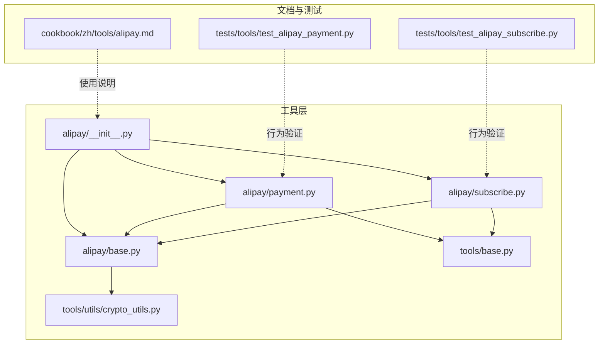
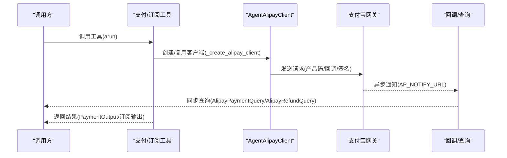
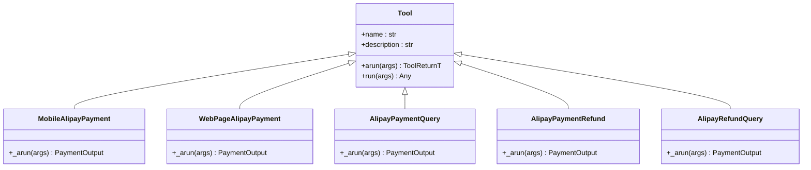
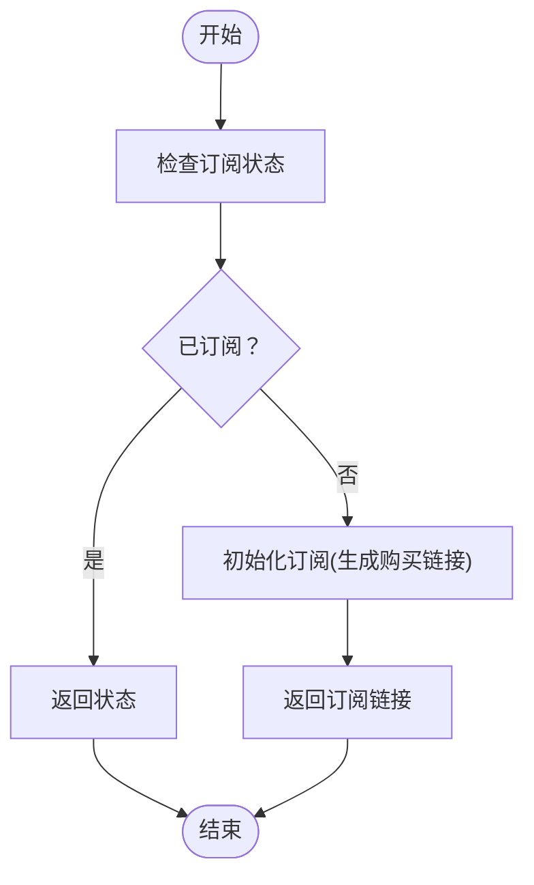
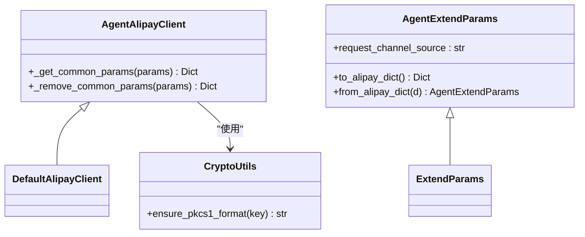
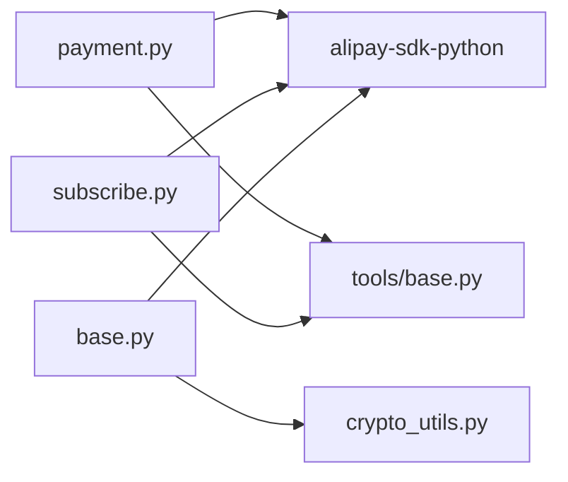

# 支付工具

<cite>
**本文引用的文件**
- [src/agentscope_runtime/tools/alipay/__init__.py](file://src/agentscope_runtime/tools/alipay/__init__.py)
- [src/agentscope_runtime/tools/alipay/base.py](file://src/agentscope_runtime/tools/alipay/base.py)
- [src/agentscope_runtime/tools/alipay/payment.py](file://src/agentscope_runtime/tools/alipay/payment.py)
- [src/agentscope_runtime/tools/alipay/subscribe.py](file://src/agentscope_runtime/tools/alipay/subscribe.py)
- [src/agentscope_runtime/tools/base.py](file://src/agentscope_runtime/tools/base.py)
- [src/agentscope_runtime/tools/utils/crypto_utils.py](file://src/agentscope_runtime/tools/utils/crypto_utils.py)
- [cookbook/zh/tools/alipay.md](file://cookbook/zh/tools/alipay.md)
- [tests/tools/test_alipay_payment.py](file://tests/tools/test_alipay_payment.py)
- [tests/tools/test_alipay_subscribe.py](file://tests/tools/test_alipay_subscribe.py)
</cite>

## 目录
1. [简介](#简介)
2. [项目结构](#项目结构)
3. [核心组件](#核心组件)
4. [架构总览](#架构总览)
5. [详细组件分析](#详细组件分析)
6. [依赖分析](#依赖分析)
7. [性能考虑](#性能考虑)
8. [故障排查指南](#故障排查指南)
9. [结论](#结论)
10. [附录](#附录)

## 简介
本文件面向AgentScope Runtime中的“支付工具”，聚焦于支付宝支付与订阅能力的实现与使用。文档覆盖以下主题：
- 支付订单创建（移动端与网页端）
- 支付状态查询与退款处理
- 订阅支付工具的实现原理（订阅计划管理、周期扣款、订阅状态跟踪）
- 配置项、安全机制与风控策略
- 关键流程节点与异常处理
- 实际集成示例、回调处理思路与常见问题解决

## 项目结构
支付宝支付与订阅工具位于工具模块的 alipay 子包中，配合通用工具基类与加密工具共同工作；中文使用说明位于 cookbook 文档中。

图表来源
- [src/agentscope_runtime/tools/alipay/__init__.py:1-5](file://src/agentscope_runtime/tools/alipay/__init__.py#L1-L5)
- [src/agentscope_runtime/tools/alipay/base.py:1-335](file://src/agentscope_runtime/tools/alipay/base.py#L1-L335)
- [src/agentscope_runtime/tools/alipay/payment.py:1-836](file://src/agentscope_runtime/tools/alipay/payment.py#L1-L836)
- [src/agentscope_runtime/tools/alipay/subscribe.py:1-552](file://src/agentscope_runtime/tools/alipay/subscribe.py#L1-L552)
- [src/agentscope_runtime/tools/base.py:1-265](file://src/agentscope_runtime/tools/base.py#L1-L265)
- [src/agentscope_runtime/tools/utils/crypto_utils.py:1-100](file://src/agentscope_runtime/tools/utils/crypto_utils.py#L1-L100)
- [cookbook/zh/tools/alipay.md:1-323](file://cookbook/zh/tools/alipay.md#L1-L323)
- [tests/tools/test_alipay_payment.py:1-156](file://tests/tools/test_alipay_payment.py#L1-L156)
- [tests/tools/test_alipay_subscribe.py:1-164](file://tests/tools/test_alipay_subscribe.py#L1-L164)

章节来源
- [src/agentscope_runtime/tools/alipay/__init__.py:1-5](file://src/agentscope_runtime/tools/alipay/__init__.py#L1-L5)
- [src/agentscope_runtime/tools/alipay/base.py:1-335](file://src/agentscope_runtime/tools/alipay/base.py#L1-L335)
- [src/agentscope_runtime/tools/alipay/payment.py:1-836](file://src/agentscope_runtime/tools/alipay/payment.py#L1-L836)
- [src/agentscope_runtime/tools/alipay/subscribe.py:1-552](file://src/agentscope_runtime/tools/alipay/subscribe.py#L1-L552)
- [src/agentscope_runtime/tools/base.py:1-265](file://src/agentscope_runtime/tools/base.py#L1-L265)
- [src/agentscope_runtime/tools/utils/crypto_utils.py:1-100](file://src/agentscope_runtime/tools/utils/crypto_utils.py#L1-L100)
- [cookbook/zh/tools/alipay.md:1-323](file://cookbook/zh/tools/alipay.md#L1-L323)
- [tests/tools/test_alipay_payment.py:1-156](file://tests/tools/test_alipay_payment.py#L1-L156)
- [tests/tools/test_alipay_subscribe.py:1-164](file://tests/tools/test_alipay_subscribe.py#L1-L164)

## 核心组件
- 支付组件
  - 移动端支付：MobileAlipayPayment
  - 网页端支付：WebPageAlipayPayment
  - 支付查询：AlipayPaymentQuery
  - 退款处理：AlipayPaymentRefund
  - 退款查询：AlipayRefundQuery
- 订阅组件
  - 订阅状态检查：AlipaySubscribeStatusCheck
  - 订阅初始化（购买链接）：AlipaySubscribePackageInitialize
  - 计次保存（按次扣减）：AlipaySubscribeTimesSave
  - 订阅检查或初始化：AlipaySubscribeCheckOrInitialize
- 基础设施
  - 支付宝SDK封装与客户端：AgentAlipayClient、AgentExtendParams
  - 密钥格式转换：ensure_pkcs1_format
  - 工具基类：Tool（统一输入/输出校验、函数Schema）

章节来源
- [src/agentscope_runtime/tools/alipay/payment.py:170-836](file://src/agentscope_runtime/tools/alipay/payment.py#L170-L836)
- [src/agentscope_runtime/tools/alipay/subscribe.py:144-552](file://src/agentscope_runtime/tools/alipay/subscribe.py#L144-L552)
- [src/agentscope_runtime/tools/alipay/base.py:148-335](file://src/agentscope_runtime/tools/alipay/base.py#L148-L335)
- [src/agentscope_runtime/tools/base.py:34-265](file://src/agentscope_runtime/tools/base.py#L34-L265)
- [src/agentscope_runtime/tools/utils/crypto_utils.py:17-100](file://src/agentscope_runtime/tools/utils/crypto_utils.py#L17-L100)

## 架构总览
支付宝支付与订阅工具基于官方SDK封装，统一通过环境变量加载配置，使用工具基类进行输入/输出校验与函数Schema生成。移动端与网页端分别采用不同的产品码与回调URL策略；订阅组件通过状态检查、初始化与计次保存形成闭环。

图表来源
- [src/agentscope_runtime/tools/alipay/base.py:281-335](file://src/agentscope_runtime/tools/alipay/base.py#L281-L335)
- [src/agentscope_runtime/tools/alipay/payment.py:219-408](file://src/agentscope_runtime/tools/alipay/payment.py#L219-L408)
- [src/agentscope_runtime/tools/alipay/subscribe.py:186-358](file://src/agentscope_runtime/tools/alipay/subscribe.py#L186-L358)

## 详细组件分析

### 支付组件
- 移动端支付（MobileAlipayPayment）
  - 适用场景：移动端浏览器/内嵌App，支持跳转支付宝或浏览器内支付
  - 关键点：使用 QUICK_WAP_WAY 产品码；可设置 return_url 与 notify_url
  - 输出：包含支付链接的Markdown文本
- 网页端支付（WebPageAlipayPayment）
  - 适用场景：桌面浏览器，展示二维码扫码支付
  - 关键点：使用 FAST_INSTANT_TRADE_PAY 产品码；可设置 return_url 与 notify_url
  - 输出：包含支付链接的Markdown文本
- 支付查询（AlipayPaymentQuery）
  - 依据 out_trade_no 查询交易状态、金额、支付宝交易号
  - 输出：包含交易状态信息的文本
- 退款处理（AlipayPaymentRefund）
  - 支持全额/部分退款；out_request_no 幂等控制
  - 输出：退款结果与交易号
- 退款查询（AlipayRefundQuery）
  - 查询退款状态与金额
  - 输出：退款状态与金额信息

图表来源
- [src/agentscope_runtime/tools/base.py:34-143](file://src/agentscope_runtime/tools/base.py#L34-L143)
- [src/agentscope_runtime/tools/alipay/payment.py:170-836](file://src/agentscope_runtime/tools/alipay/payment.py#L170-L836)

章节来源
- [src/agentscope_runtime/tools/alipay/payment.py:170-836](file://src/agentscope_runtime/tools/alipay/payment.py#L170-L836)
- [cookbook/zh/tools/alipay.md:9-96](file://cookbook/zh/tools/alipay.md#L9-L96)

### 订阅组件
- 订阅状态检查（AlipaySubscribeStatusCheck）
  - 输入：uuid
  - 输出：subscribe_flag、subscribe_package（剩余次数/到期描述）
- 订阅初始化（AlipaySubscribePackageInitialize）
  - 输入：uuid
  - 输出：subscribe_url（购买链接）
- 计次保存（AlipaySubscribeTimesSave）
  - 输入：uuid、out_request_no
  - 输出：success（幂等计次）
- 订阅检查或初始化（AlipaySubscribeCheckOrInitialize）
  - 自动检查订阅状态，未订阅时返回购买链接

图表来源
- [src/agentscope_runtime/tools/alipay/subscribe.py:453-552](file://src/agentscope_runtime/tools/alipay/subscribe.py#L453-L552)

章节来源
- [src/agentscope_runtime/tools/alipay/subscribe.py:144-552](file://src/agentscope_runtime/tools/alipay/subscribe.py#L144-L552)
- [cookbook/zh/tools/alipay.md:98-154](file://cookbook/zh/tools/alipay.md#L98-L154)

### 基础设施与安全
- AgentAlipayClient
  - 继承 DefaultAlipayClient，重写公共参数注入与移除逻辑，确保 x_agent_source 标识被正确传递
- AgentExtendParams
  - 扩展 ExtendParams，增加 request_channel_source 字段，便于识别AI Agent来源
- 密钥格式转换
  - ensure_pkcs1_format：兼容PKCS#1/PKCS#8，输出PKCS#1格式私钥，满足SDK要求
- 环境变量配置
  - 支付：ALIPAY_APP_ID、ALIPAY_PRIVATE_KEY、ALIPAY_PUBLIC_KEY、AP_RETURN_URL、AP_NOTIFY_URL、AP_CURRENT_ENV
  - 订阅：SUBSCRIBE_PLAN_ID、X_AGENT_NAME、USE_TIMES

图表来源
- [src/agentscope_runtime/tools/alipay/base.py:211-335](file://src/agentscope_runtime/tools/alipay/base.py#L211-L335)
- [src/agentscope_runtime/tools/utils/crypto_utils.py:17-100](file://src/agentscope_runtime/tools/utils/crypto_utils.py#L17-L100)

章节来源
- [src/agentscope_runtime/tools/alipay/base.py:148-335](file://src/agentscope_runtime/tools/alipay/base.py#L148-L335)
- [src/agentscope_runtime/tools/utils/crypto_utils.py:17-100](file://src/agentscope_runtime/tools/utils/crypto_utils.py#L17-L100)
- [cookbook/zh/tools/alipay.md:156-168](file://cookbook/zh/tools/alipay.md#L156-L168)

## 依赖分析
- 支付组件依赖
  - 支付宝SDK：AlipayTradeWapPayRequest、AlipayTradePagePayRequest、AlipayTradeQueryRequest、AlipayTradeRefundRequest、AlipayTradeFastpayRefundQueryRequest
  - 工具基类：统一输入/输出校验与函数Schema
- 订阅组件依赖
  - 支付宝SDK：AlipayAipaySubscribeStatusCheckRequest、AlipayAipaySubscribePackageInitializeRequest、AlipayAipaySubscribeTimesSaveRequest
  - 工具基类：统一输入/输出校验与函数Schema
- 基础设施依赖
  - 环境变量加载与校验
  - 密钥格式转换（cryptography库）

图表来源
- [src/agentscope_runtime/tools/alipay/payment.py:19-76](file://src/agentscope_runtime/tools/alipay/payment.py#L19-L76)
- [src/agentscope_runtime/tools/alipay/subscribe.py:18-47](file://src/agentscope_runtime/tools/alipay/subscribe.py#L18-L47)
- [src/agentscope_runtime/tools/alipay/base.py:27-47](file://src/agentscope_runtime/tools/alipay/base.py#L27-L47)
- [src/agentscope_runtime/tools/base.py:1-265](file://src/agentscope_runtime/tools/base.py#L1-L265)
- [src/agentscope_runtime/tools/utils/crypto_utils.py:1-100](file://src/agentscope_runtime/tools/utils/crypto_utils.py#L1-L100)

章节来源
- [src/agentscope_runtime/tools/alipay/payment.py:19-76](file://src/agentscope_runtime/tools/alipay/payment.py#L19-L76)
- [src/agentscope_runtime/tools/alipay/subscribe.py:18-47](file://src/agentscope_runtime/tools/alipay/subscribe.py#L18-L47)
- [src/agentscope_runtime/tools/alipay/base.py:27-47](file://src/agentscope_runtime/tools/alipay/base.py#L27-L47)
- [src/agentscope_runtime/tools/base.py:1-265](file://src/agentscope_runtime/tools/base.py#L1-L265)
- [src/agentscope_runtime/tools/utils/crypto_utils.py:1-100](file://src/agentscope_runtime/tools/utils/crypto_utils.py#L1-L100)

## 性能考虑
- 客户端复用：AgentAlipayClient在进程内可复用，避免频繁创建/销毁带来的开销
- 幂等设计：退款(out_request_no)与计次(out_request_no)均采用幂等键，降低重复调用成本
- 异步查询：支付与退款状态建议通过异步通知(AP_NOTIFY_URL)与同步查询结合，减少轮询压力
- 网关选择：根据 AP_CURRENT_ENV 切换沙箱/生产网关，开发阶段优先沙箱，避免真实资金风险

## 故障排查指南
- 配置错误
  - 缺少必要环境变量：ALIPAY_APP_ID、ALIPAY_PRIVATE_KEY、ALIPAY_PUBLIC_KEY 或 SUBSCRIBE_PLAN_ID/X_AGENT_NAME
  - 私钥格式不正确：请使用 ensure_pkcs1_format 进行转换
- SDK不可用
  - 未安装 alipay-sdk-python 或 cryptography 库
- 支付链接为空
  - 由于证书或网关限制，沙箱/生产环境下可能出现返回为空的情况，属正常现象
- 退款/计次失败
  - 检查 out_request_no 幂等键是否唯一
  - 确认 out_trade_no 与退款请求号匹配
- 回调处理
  - 异步通知地址(AP_NOTIFY_URL)需自行实现，接收并校验签名后更新本地订单状态
  - 同步回跳(AP_RETURN_URL)仅用于用户侧提示，最终以异步通知为准

章节来源
- [src/agentscope_runtime/tools/alipay/base.py:172-210](file://src/agentscope_runtime/tools/alipay/base.py#L172-L210)
- [src/agentscope_runtime/tools/utils/crypto_utils.py:17-100](file://src/agentscope_runtime/tools/utils/crypto_utils.py#L17-L100)
- [tests/tools/test_alipay_payment.py:20-22](file://tests/tools/test_alipay_payment.py#L20-L22)
- [tests/tools/test_alipay_subscribe.py:19-21](file://tests/tools/test_alipay_subscribe.py#L19-L21)

## 结论
AgentScope Runtime 的支付宝支付与订阅工具提供了从订单创建、状态查询、退款处理到订阅状态检查与计次的完整链路。通过统一的工具基类与SDK封装，开发者可以快速集成支付能力，并借助幂等键与回调机制保障一致性与可靠性。建议在生产环境中严格管理密钥与回调，遵循沙箱先行、生产谨慎的原则。

## 附录

### 支付流程关键节点
- 订单创建：选择产品码（移动端/网页端），设置回调URL，生成支付链接
- 用户支付：跳转至支付宝完成支付
- 状态查询：同步查询交易状态，或等待异步通知
- 退款处理：发起退款并查询退款状态
- 订阅闭环：检查/初始化/计次一体化

章节来源
- [src/agentscope_runtime/tools/alipay/payment.py:219-836](file://src/agentscope_runtime/tools/alipay/payment.py#L219-L836)
- [src/agentscope_runtime/tools/alipay/subscribe.py:186-552](file://src/agentscope_runtime/tools/alipay/subscribe.py#L186-L552)

### 集成示例与回调处理思路
- 基础支付示例：见中文使用说明中的示例代码片段
- 交易管理示例：查询支付状态、发起退款、查询退款状态
- 订阅服务示例：检查订阅状态、未订阅时获取购买链接、使用后计次
- 回调处理：实现 AP_NOTIFY_URL 接收异步通知，解析并校验签名，更新本地订单状态

章节来源
- [cookbook/zh/tools/alipay.md:170-299](file://cookbook/zh/tools/alipay.md#L170-L299)