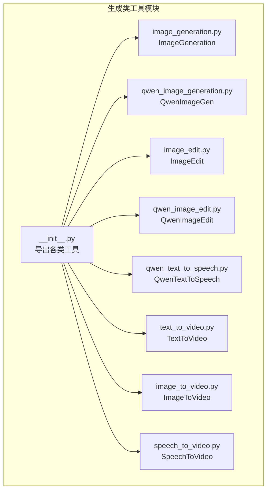
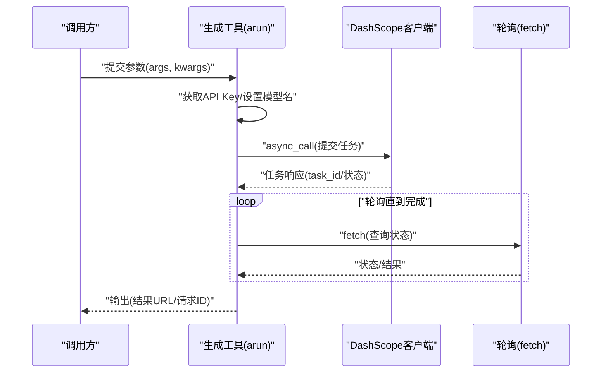
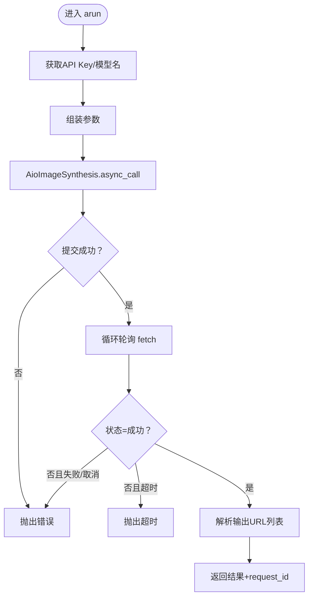
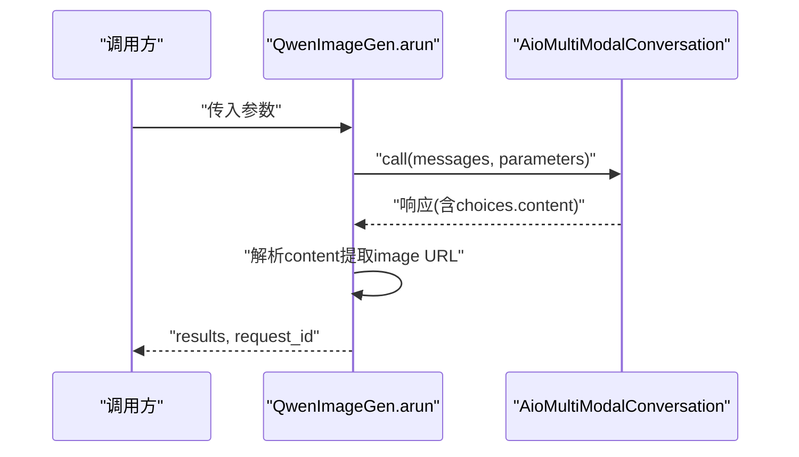
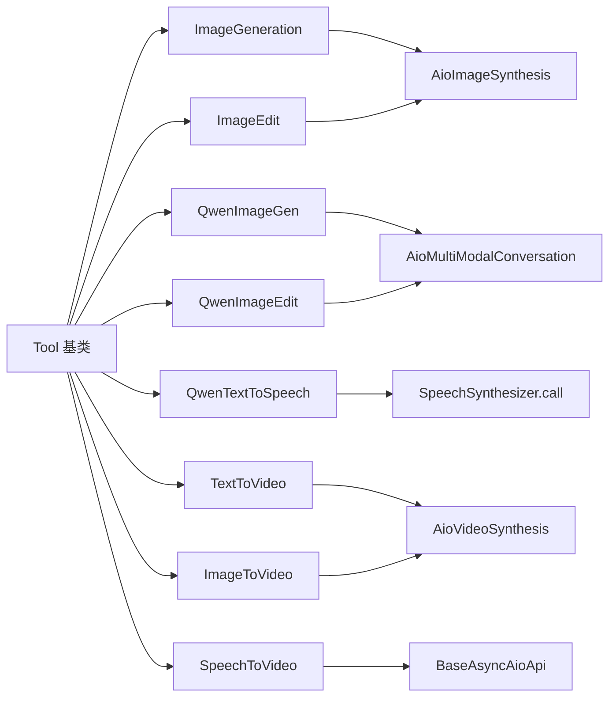

# 生成类工具

<cite>
**本文引用的文件**
- [src/agentscope_runtime/tools/generations/__init__.py](file://src/agentscope_runtime/tools/generations/__init__.py)
- [src/agentscope_runtime/tools/generations/image_generation.py](file://src/agentscope_runtime/tools/generations/image_generation.py)
- [src/agentscope_runtime/tools/generations/qwen_image_generation.py](file://src/agentscope_runtime/tools/generations/qwen_image_generation.py)
- [src/agentscope_runtime/tools/generations/image_edit.py](file://src/agentscope_runtime/tools/generations/image_edit.py)
- [src/agentscope_runtime/tools/generations/qwen_image_edit.py](file://src/agentscope_runtime/tools/generations/qwen_image_edit.py)
- [src/agentscope_runtime/tools/generations/qwen_text_to_speech.py](file://src/agentscope_runtime/tools/generations/qwen_text_to_speech.py)
- [src/agentscope_runtime/tools/generations/text_to_video.py](file://src/agentscope_runtime/tools/generations/text_to_video.py)
- [src/agentscope_runtime/tools/generations/image_to_video.py](file://src/agentscope_runtime/tools/generations/image_to_video.py)
- [src/agentscope_runtime/tools/generations/speech_to_video.py](file://src/agentscope_runtime/tools/generations/speech_to_video.py)
</cite>

## 目录
1. [简介](#简介)
2. [项目结构](#项目结构)
3. [核心组件](#核心组件)
4. [架构总览](#架构总览)
5. [详细组件分析](#详细组件分析)
6. [依赖关系分析](#依赖关系分析)
7. [性能考量](#性能考量)
8. [故障排查指南](#故障排查指南)
9. [结论](#结论)
10. [附录](#附录)

## 简介
本文件面向 AgentScope Runtime 的生成类工具，系统性梳理以下能力：
- 图像生成：ImageGeneration、QwenImageGen
- 图像编辑：ImageEdit、QwenImageEdit
- 文本转语音：QwenTextToSpeech
- 视频生成：TextToVideo、ImageToVideo、SpeechToVideo

重点说明同步与异步生成工具的差异，覆盖提交、轮询查询与结果获取的完整流程；提供参数配置要点、输出格式说明、性能优化建议，并给出使用示例与常见问题解决方案。

## 项目结构
生成类工具集中于 generations 子模块，统一通过工具基类 Tool 封装，对外暴露名称与描述，内部通过 DashScope 客户端异步调用完成任务提交、轮询与结果提取。

**图表来源**
- [src/agentscope_runtime/tools/generations/__init__.py:1-76](file://src/agentscope_runtime/tools/generations/__init__.py#L1-L76)

**章节来源**
- [src/agentscope_runtime/tools/generations/__init__.py:1-76](file://src/agentscope_runtime/tools/generations/__init__.py#L1-L76)

## 核心组件
- 工具基类 Tool：统一 arun 接口、名称与描述、追踪日志记录。
- DashScope 异步客户端：AioImageSynthesis、AioVideoSynthesis、AioMultiModalConversation、SpeechSynthesizer。
- 输入/输出 Pydantic 模型：定义参数校验与字段说明。
- 请求追踪：TracingUtil 提供 request_id，trace 装饰器记录步骤日志。

**章节来源**
- [src/agentscope_runtime/tools/generations/image_generation.py:70-203](file://src/agentscope_runtime/tools/generations/image_generation.py#L70-L203)
- [src/agentscope_runtime/tools/generations/qwen_image_generation.py:70-215](file://src/agentscope_runtime/tools/generations/qwen_image_generation.py#L70-L215)
- [src/agentscope_runtime/tools/generations/image_edit.py:79-209](file://src/agentscope_runtime/tools/generations/image_edit.py#L79-L209)
- [src/agentscope_runtime/tools/generations/qwen_image_edit.py:64-206](file://src/agentscope_runtime/tools/generations/qwen_image_edit.py#L64-L206)
- [src/agentscope_runtime/tools/generations/qwen_text_to_speech.py:53-155](file://src/agentscope_runtime/tools/generations/qwen_text_to_speech.py#L53-L155)
- [src/agentscope_runtime/tools/generations/text_to_video.py:73-222](file://src/agentscope_runtime/tools/generations/text_to_video.py#L73-L222)
- [src/agentscope_runtime/tools/generations/image_to_video.py:81-234](file://src/agentscope_runtime/tools/generations/image_to_video.py#L81-L234)
- [src/agentscope_runtime/tools/generations/speech_to_video.py:71-315](file://src/agentscope_runtime/tools/generations/speech_to_video.py#L71-L315)

## 架构总览
生成类工具遵循统一的异步工作流：参数校验 → 获取 API Key → 组装参数 → 异步提交任务 → 循环轮询状态 → 解析结果 → 返回输出。

**图表来源**
- [src/agentscope_runtime/tools/generations/image_generation.py:126-181](file://src/agentscope_runtime/tools/generations/image_generation.py#L126-L181)
- [src/agentscope_runtime/tools/generations/text_to_video.py:140-192](file://src/agentscope_runtime/tools/generations/text_to_video.py#L140-L192)
- [src/agentscope_runtime/tools/generations/speech_to_video.py:195-260](file://src/agentscope_runtime/tools/generations/speech_to_video.py#L195-L260)

## 详细组件分析

### 图像生成：ImageGeneration
- 功能：基于文本生成图像，支持多图批量、尺寸、水印、智能提示词扩展等。
- 关键点：
  - 使用 AioImageSynthesis 异步提交与轮询。
  - 轮询超时约 5 分钟，间隔 2 秒。
  - 输出包含图片 URL 列表与 request_id。
- 参数要点：
  - prompt、size、negative_prompt、prompt_extend、n、watermark。
  - 可通过环境变量或 kwargs 指定模型名。
- 输出格式：results（URL 列表）、request_id。

**图表来源**
- [src/agentscope_runtime/tools/generations/image_generation.py:126-202](file://src/agentscope_runtime/tools/generations/image_generation.py#L126-L202)

**章节来源**
- [src/agentscope_runtime/tools/generations/image_generation.py:70-203](file://src/agentscope_runtime/tools/generations/image_generation.py#L70-L203)

### Qwen 图像生成：QwenImageGen
- 功能：通义千问文生图，通过 MultiModalConversation 调用，支持负向提示词、尺寸、数量、水印与智能提示词扩展。
- 关键点：
  - 直接调用 AioMultiModalConversation，解析 response.output.choices[].message.content 中的 image 字段。
  - 支持字符串、字典、列表等多种内容结构。
- 参数要点：prompt、negative_prompt、size、n、prompt_extend、watermark。
- 输出格式：results（URL 列表）、request_id。

**图表来源**
- [src/agentscope_runtime/tools/generations/qwen_image_generation.py:140-187](file://src/agentscope_runtime/tools/generations/qwen_image_generation.py#L140-L187)

**章节来源**
- [src/agentscope_runtime/tools/generations/qwen_image_generation.py:70-215](file://src/agentscope_runtime/tools/generations/qwen_image_generation.py#L70-L215)

### 图像编辑：ImageEdit
- 功能：基于原图与文本指令进行编辑，支持风格化、局部风格化、描述性编辑、带遮罩编辑、去水印、扩图、超分、上色、涂鸦、控制漫画特征等。
- 关键点：
  - function 必填，base_image_url 必填；mask_image_url 仅在特定功能时必填。
  - 异步提交与轮询，超时约 5 分钟。
- 参数要点：function、base_image_url、mask_image_url、prompt、n、watermark。
- 输出格式：results（URL 列表）、request_id。

**章节来源**
- [src/agentscope_runtime/tools/generations/image_edit.py:79-209](file://src/agentscope_runtime/tools/generations/image_edit.py#L79-L209)

### Qwen 图像编辑：QwenImageEdit
- 功能：通义千问图像编辑，支持图文联合输入，解析 response 中的 image URL。
- 关键点：
  - messages 包含 image 与 text。
  - 解析策略与 QwenImageGen 类似，兼容多种结构。
- 参数要点：image_url、prompt、negative_prompt、watermark。
- 输出格式：results（URL 列表）、request_id。

**章节来源**
- [src/agentscope_runtime/tools/generations/qwen_image_edit.py:64-206](file://src/agentscope_runtime/tools/generations/qwen_image_edit.py#L64-L206)

### 文本转语音：QwenTextToSpeech
- 功能：将文本合成为音频，支持多音色选择。
- 关键点：
  - 使用 dashscope.audio.qwen_tts.SpeechSynthesizer.call。
  - 输出包含音频 URL。
- 参数要点：text、voice。
- 输出格式：result（音频 URL）、request_id。

**章节来源**
- [src/agentscope_runtime/tools/generations/qwen_text_to_speech.py:53-155](file://src/agentscope_runtime/tools/generations/qwen_text_to_speech.py#L53-L155)

### 文本转视频：TextToVideo
- 功能：根据文本生成无声视频，支持分辨率、时长、水印与智能提示词扩展。
- 关键点：
  - AioVideoSynthesis 异步提交与轮询，超时约 10 分钟。
  - 输出 video_url 与 request_id。
- 参数要点：prompt、negative_prompt、size、duration、prompt_extend、watermark。
- 输出格式：video_url、request_id。

**章节来源**
- [src/agentscope_runtime/tools/generations/text_to_video.py:73-222](file://src/agentscope_runtime/tools/generations/text_to_video.py#L73-L222)

### 图像转视频：ImageToVideo
- 功能：基于首帧图像与文本提示生成 5 秒无声视频，支持特效模板与分辨率。
- 关键点：
  - AioVideoSynthesis 异步提交与轮询，超时约 10 分钟。
  - 输出 video_url 与 request_id。
- 参数要点：image_url、prompt、negative_prompt、template、resolution、duration、prompt_extend、watermark。
- 输出格式：video_url、request_id。

**章节来源**
- [src/agentscope_runtime/tools/generations/image_to_video.py:81-234](file://src/agentscope_runtime/tools/generations/image_to_video.py#L81-L234)

### 语音转视频：SpeechToVideo
- 功能：基于单张图片与音频生成说话/唱歌/表演视频，支持分辨率与时长计费。
- 关键点：
  - 使用 BaseAsyncAioApi 的 async_call/fetch，自定义 task_group 与 function。
  - 输出 video_url、request_id、video_duration。
- 参数要点：image_url、audio_url、resolution。
- 输出格式：video_url、request_id、video_duration。

**章节来源**
- [src/agentscope_runtime/tools/generations/speech_to_video.py:71-315](file://src/agentscope_runtime/tools/generations/speech_to_video.py#L71-L315)

## 依赖关系分析
- 统一依赖：
  - 工具基类：Tool
  - API Key 获取：get_api_key(ApiNames.dashscope_api_key)
  - 追踪：trace 装饰器、TracingUtil
- DashScope 客户端：
  - 图像/视频：AioImageSynthesis、AioVideoSynthesis
  - 多模态：AioMultiModalConversation
  - 语音：SpeechSynthesizer
- 轮询策略：统一采用 asyncio.sleep + fetch 查询，超时与状态判断逻辑相似。

**图表来源**
- [src/agentscope_runtime/tools/generations/image_generation.py:126-132](file://src/agentscope_runtime/tools/generations/image_generation.py#L126-L132)
- [src/agentscope_runtime/tools/generations/text_to_video.py:140-146](file://src/agentscope_runtime/tools/generations/text_to_video.py#L140-L146)
- [src/agentscope_runtime/tools/generations/speech_to_video.py:112-122](file://src/agentscope_runtime/tools/generations/speech_to_video.py#L112-L122)
- [src/agentscope_runtime/tools/generations/qwen_image_generation.py:141-146](file://src/agentscope_runtime/tools/generations/qwen_image_generation.py#L141-L146)
- [src/agentscope_runtime/tools/generations/qwen_text_to_speech.py:100-105](file://src/agentscope_runtime/tools/generations/qwen_text_to_speech.py#L100-L105)

**章节来源**
- [src/agentscope_runtime/tools/generations/__init__.py:1-76](file://src/agentscope_runtime/tools/generations/__init__.py#L1-L76)

## 性能考量
- 异步并发：所有生成工具均采用异步客户端与异步轮询，避免阻塞，提升吞吐。
- 轮询间隔与超时：
  - 图像类：轮询间隔 2 秒，超时 300 秒。
  - 视频类：轮询间隔 5 秒，超时 600 秒。
  - 语音转视频：轮询间隔 5 秒，超时 900 秒。
- 批量生成：图像生成支持 n 控制每批生成数量，合理设置可减少任务数。
- 模型选择：可通过环境变量或 kwargs 指定模型名，按场景选择更优模型。
- 网络与资源：确保输入 URL 可达、文件大小与分辨率符合要求，避免因资源问题导致失败重试。

[本节为通用性能建议，不直接分析具体文件]

## 故障排查指南
- API Key 无效或缺失
  - 现象：抛出 ValueError，提示设置有效的 DASHSCOPE_API_KEY。
  - 处理：检查环境变量或 kwargs 中的 API Key 配置。
- 任务提交失败
  - 现象：提交阶段即报错，状态码非 200 或无 output。
  - 处理：确认参数格式、URL 可达性、模型可用性。
- 轮询过程中失败/取消
  - 现象：fetch 返回 FAILED/CANCELED。
  - 处理：检查输入参数、资源限制、网络稳定性。
- 超时
  - 现象：达到最大等待时间仍未完成。
  - 处理：适当增大超时阈值（谨慎评估成本）、优化参数、降低分辨率或时长。
- 结果解析异常
  - 现象：无法从 response 中提取 URL。
  - 处理：确认 DashScope 返回结构变化，更新解析逻辑；关注 output.choices[].message.content 的多种结构。

**章节来源**
- [src/agentscope_runtime/tools/generations/image_generation.py:134-181](file://src/agentscope_runtime/tools/generations/image_generation.py#L134-L181)
- [src/agentscope_runtime/tools/generations/text_to_video.py:148-192](file://src/agentscope_runtime/tools/generations/text_to_video.py#L148-L192)
- [src/agentscope_runtime/tools/generations/speech_to_video.py:203-260](file://src/agentscope_runtime/tools/generations/speech_to_video.py#L203-L260)
- [src/agentscope_runtime/tools/generations/qwen_image_generation.py:152-187](file://src/agentscope_runtime/tools/generations/qwen_image_generation.py#L152-L187)
- [src/agentscope_runtime/tools/generations/qwen_text_to_speech.py:109-127](file://src/agentscope_runtime/tools/generations/qwen_text_to_speech.py#L109-L127)

## 结论
- 生成类工具统一采用异步提交与轮询机制，具备良好的并发性能与可观测性。
- 不同工具在输入参数与输出结构上略有差异，但遵循一致的生命周期：提交 → 轮询 → 解析 → 返回。
- 建议在生产环境中结合业务需求合理设置模型、分辨率与时长，并做好超时与重试策略。

[本节为总结性内容，不直接分析具体文件]

## 附录

### 同步 vs 异步生成工具
- 同步工具：当前仓库未提供同步版本，所有生成工具均通过异步客户端实现。
- 异步工具：统一采用 asyncio.sleep + fetch 轮询，支持较长任务的可靠完成。
- 若需同步接口，可在应用层封装 asyncio.run 或使用线程池包装异步调用，但需注意事件循环与阻塞风险。

[本节为概念性说明，不直接分析具体文件]

### 参数配置清单与建议
- 通用参数
  - DASHSCOPE_API_KEY：认证凭据，必须有效。
  - 模型名：可通过环境变量或 kwargs 指定，如 IMAGE_GENERATION_MODEL_NAME、QWEN_IMAGE_GENERATION_MODEL_NAME 等。
  - request_id：由 TracingUtil 生成，便于链路追踪。
- 图像生成/编辑
  - prompt/negative_prompt：建议控制长度，避免截断影响质量。
  - size：按业务选择合适分辨率，兼顾质量与成本。
  - n：批量生成数量，建议 ≤ 4。
  - watermark/prompt_extend：按需启用。
- 视频生成
  - duration：尽量使用默认 5 秒，避免过长导致超时。
  - resolution/template：按场景选择，注意计费时长。
- 语音合成
  - voice：选择与内容匹配的音色，注意 Token 限制。
- 语音转视频
  - image_url/audio_url：确保清晰人声、无噪音与背景音乐，时长与大小满足限制。

[本节为通用配置建议，不直接分析具体文件]

### 输出格式说明
- 图像类：results（URL 列表）、request_id。
- 视频类：video_url（或 results 中的 video_url）、request_id、部分工具包含 video_duration。
- 语音类：result（音频 URL）、request_id。

[本节为通用格式说明，不直接分析具体文件]

### 使用示例（步骤级）
- 准备 API Key 与模型名（环境变量或 kwargs）。
- 构造输入参数对象（参考各工具的输入模型）。
- 调用工具的 arun 方法，传入参数与上下文。
- 解析输出对象，获取 URL 与 request_id。
- 如需追踪，结合 trace 事件查看中间日志。

[本节为通用使用流程，不直接分析具体文件]