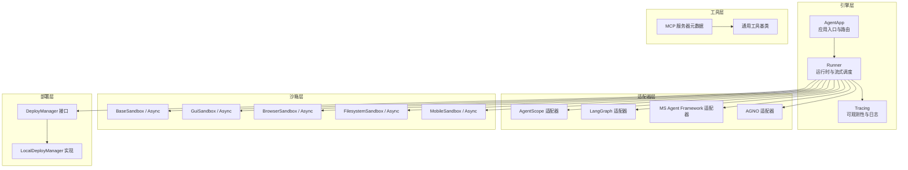
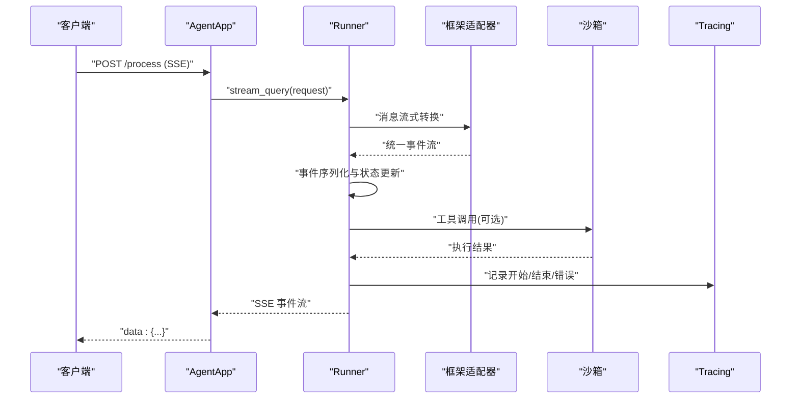
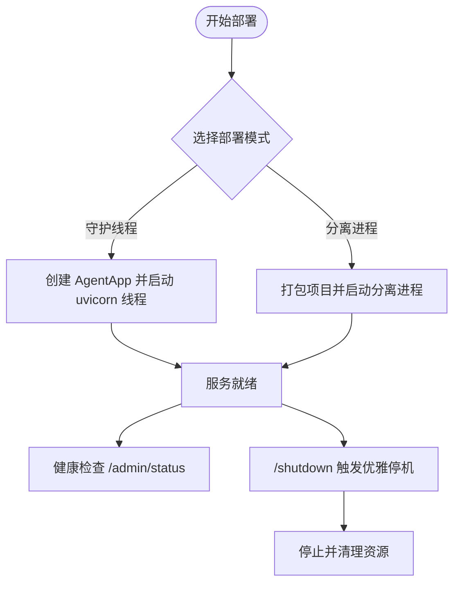
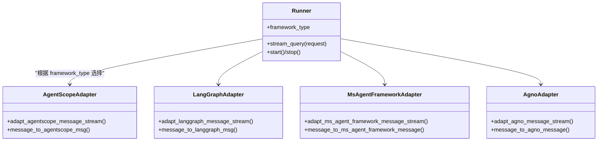
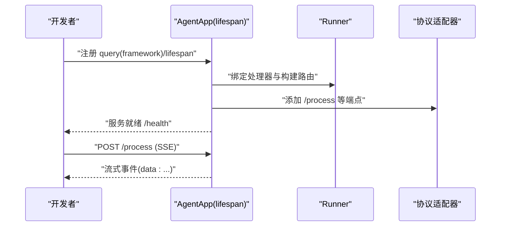
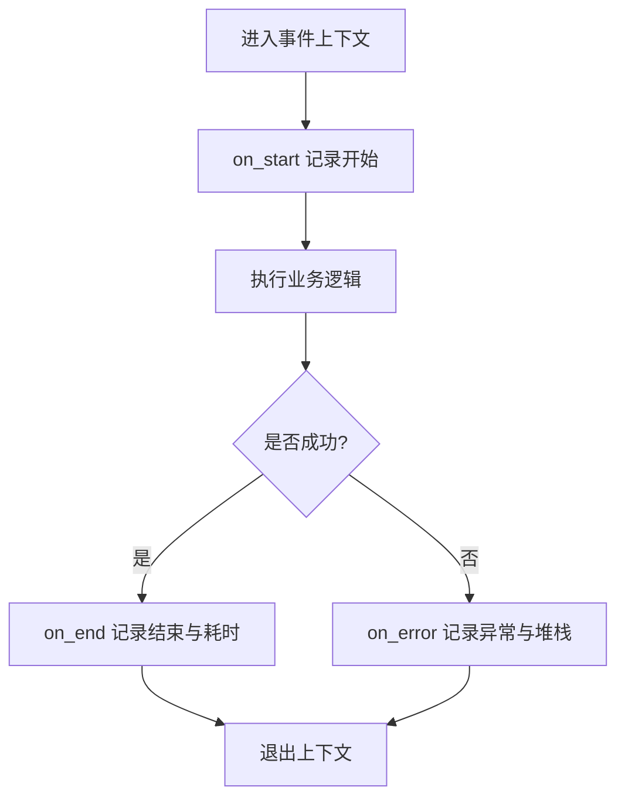
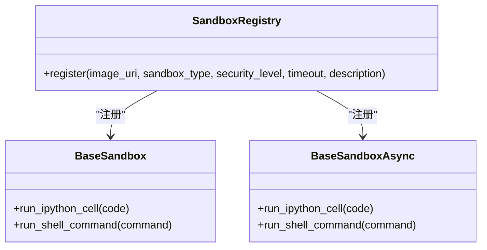
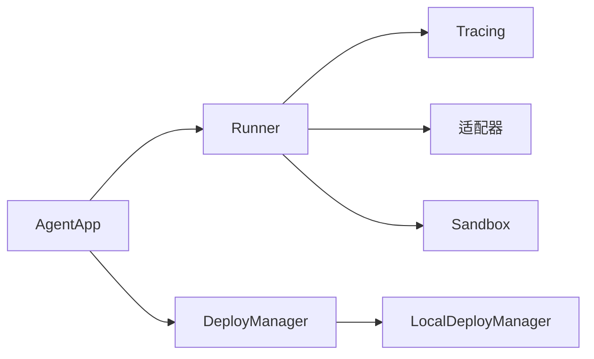
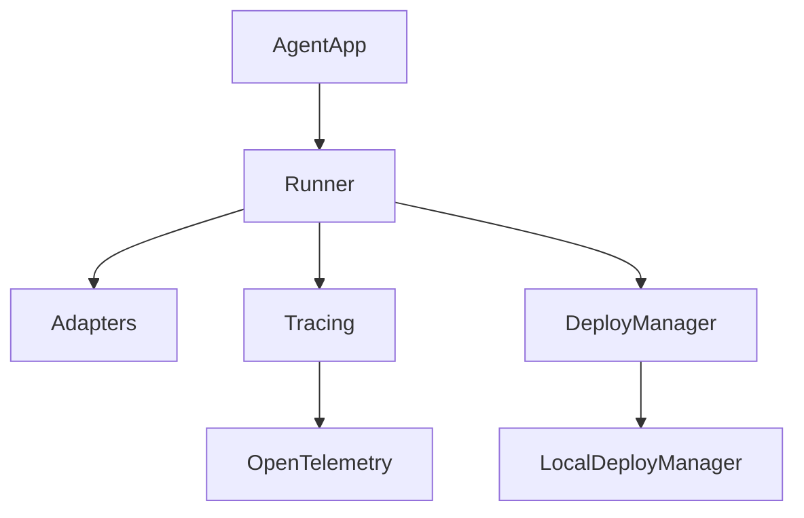

# 核心特性

<cite>
**本文引用的文件**
- [README.md](file://README.md)
- [engine/app/agent_app.py](file://src/agentscope_runtime/engine/app/agent_app.py)
- [engine/runner.py](file://src/agentscope_runtime/engine/runner.py)
- [engine/deployers/base.py](file://src/agentscope_runtime/engine/deployers/base.py)
- [engine/deployers/local_deployer.py](file://src/agentscope_runtime/engine/deployers/local_deployer.py)
- [engine/tracing/__init__.py](file://src/agentscope_runtime/engine/tracing/__init__.py)
- [engine/tracing/base.py](file://src/agentscope_runtime/engine/tracing/base.py)
- [adapters/agentscope/tool/tool.py](file://src/agentscope_runtime/adapters/agentscope/tool/tool.py)
- [sandbox/__init__.py](file://src/agentscope_runtime/sandbox/__init__.py)
- [sandbox/box/base/base_sandbox.py](file://src/agentscope_runtime/sandbox/box/base/base_sandbox.py)
- [common/utils/logging.py](file://src/agentscope_runtime/common/utils/logging.py)
</cite>

## 目录
1. [简介](#简介)
2. [项目结构](#项目结构)
3. [核心组件](#核心组件)
4. [架构总览](#架构总览)
5. [详细组件分析](#详细组件分析)
6. [依赖分析](#依赖分析)
7. [性能考虑](#性能考虑)
8. [故障排查指南](#故障排查指南)
9. [结论](#结论)
10. [附录](#附录)

## 简介
本文件聚焦于 AgentScope Runtime 的五大核心特性：部署基础设施、框架无关性、开发者友好、可观测性与沙箱化工具执行。我们将从概念到实现逐层展开，结合代码级图示与示例路径，帮助不同技术背景的读者理解这些特性如何协同工作，并在生产环境中落地。

## 项目结构
AgentScope Runtime 采用“引擎 + 适配器 + 沙箱 + 工具”的分层组织方式：
- 引擎层（Engine）：提供统一的 Agent 应用生命周期管理、协议适配、流式输出与任务编排能力
- 适配器层（Adapters）：对接不同框架的消息与流式接口，实现框架无关性
- 沙箱层（Sandbox）：提供隔离的工具执行环境，覆盖基础、GUI、浏览器、文件系统、移动端等场景
- 工具层（Tools）：内置丰富的工具集，支持 MCP 协议与快速适配
- 部署层（Deployers）：统一的本地/云端部署管理，支持多种模式与平台

**图示来源**
- [engine/app/agent_app.py:60-220](file://src/agentscope_runtime/engine/app/agent_app.py#L60-L220)
- [engine/runner.py:46-120](file://src/agentscope_runtime/engine/runner.py#L46-L120)
- [engine/tracing/base.py:166-240](file://src/agentscope_runtime/engine/tracing/base.py#L166-L240)
- [adapters/agentscope/tool/tool.py:17-170](file://src/agentscope_runtime/adapters/agentscope/tool/tool.py#L17-L170)
- [sandbox/box/base/base_sandbox.py:18-102](file://src/agentscope_runtime/sandbox/box/base/base_sandbox.py#L18-L102)
- [engine/deployers/base.py:9-44](file://src/agentscope_runtime/engine/deployers/base.py#L9-L44)
- [engine/deployers/local_deployer.py:27-170](file://src/agentscope_runtime/engine/deployers/local_deployer.py#L27-L170)

**章节来源**
- [README.md:86-106](file://README.md#L86-L106)
- [engine/app/agent_app.py:60-220](file://src/agentscope_runtime/engine/app/agent_app.py#L60-L220)
- [engine/runner.py:46-120](file://src/agentscope_runtime/engine/runner.py#L46-L120)
- [engine/deployers/base.py:9-44](file://src/agentscope_runtime/engine/deployers/base.py#L9-L44)
- [engine/deployers/local_deployer.py:27-170](file://src/agentscope_runtime/engine/deployers/local_deployer.py#L27-L170)
- [engine/tracing/__init__.py:16-47](file://src/agentscope_runtime/engine/tracing/__init__.py#L16-L47)
- [engine/tracing/base.py:166-240](file://src/agentscope_runtime/engine/tracing/base.py#L166-L240)
- [adapters/agentscope/tool/tool.py:17-170](file://src/agentscope_runtime/adapters/agentscope/tool/tool.py#L17-L170)
- [sandbox/__init__.py:1-33](file://src/agentscope_runtime/sandbox/__init__.py#L1-L33)
- [sandbox/box/base/base_sandbox.py:18-102](file://src/agentscope_runtime/sandbox/box/base/base_sandbox.py#L18-L102)
- [common/utils/logging.py:31-45](file://src/agentscope_runtime/common/utils/logging.py#L31-L45)

## 核心组件
- AgentApp：基于 FastAPI 的统一应用入口，集成路由、协议适配、生命周期管理与中断机制
- Runner：运行时内核，负责框架类型绑定、消息流式转换、事件序列化与异常封装
- DeployManager：部署抽象接口，LocalDeployManager 提供本地守护线程与分离进程两种模式
- Tracing：可观测性子系统，提供事件追踪、日志与错误处理的统一接口
- Sandbox：沙箱体系，提供同步与异步两类实现，覆盖基础命令、GUI、浏览器、文件系统与移动端
- Adapters：将第三方框架的消息/流式接口适配到 AgentScope Runtime 的统一模型

**章节来源**
- [engine/app/agent_app.py:60-220](file://src/agentscope_runtime/engine/app/agent_app.py#L60-L220)
- [engine/runner.py:46-120](file://src/agentscope_runtime/engine/runner.py#L46-L120)
- [engine/deployers/base.py:9-44](file://src/agentscope_runtime/engine/deployers/base.py#L9-L44)
- [engine/deployers/local_deployer.py:27-170](file://src/agentscope_runtime/engine/deployers/local_deployer.py#L27-L170)
- [engine/tracing/base.py:166-240](file://src/agentscope_runtime/engine/tracing/base.py#L166-L240)
- [sandbox/box/base/base_sandbox.py:18-102](file://src/agentscope_runtime/sandbox/box/base/base_sandbox.py#L18-L102)
- [adapters/agentscope/tool/tool.py:17-170](file://src/agentscope_runtime/adapters/agentscope/tool/tool.py#L17-L170)

## 架构总览
AgentScope Runtime 将“应用即服务”的理念贯穿到底层设计：以 AgentApp 作为统一入口，通过 Runner 统一流式调度与事件序列化，借助适配器层实现框架无关性；部署层提供本地与云端弹性扩展；可观测性贯穿请求生命周期；沙箱层确保工具执行的安全隔离。

**图示来源**
- [engine/app/agent_app.py:781-800](file://src/agentscope_runtime/engine/app/agent_app.py#L781-L800)
- [engine/runner.py:193-356](file://src/agentscope_runtime/engine/runner.py#L193-L356)
- [engine/tracing/base.py:190-240](file://src/agentscope_runtime/engine/tracing/base.py#L190-L240)
- [sandbox/box/base/base_sandbox.py:35-51](file://src/agentscope_runtime/sandbox/box/base/base_sandbox.py#L35-L51)

## 详细组件分析

### 特性一：部署基础设施
- 能力概述
  - 支持本地守护线程与分离进程两种部署模式，满足开发与生产需求
  - 统一的部署接口 DeployManager，便于扩展至 Kubernetes、Serverless 等平台
  - 内置健康检查、进程控制与状态持久化能力
- 技术实现
  - LocalDeployManager 在守护线程模式下启动 uvicorn 服务，在分离进程模式下打包项目并后台运行
  - 通过状态管理器保存部署信息，支持查询与停止
- 实际场景
  - 开发阶段：守护线程模式快速迭代
  - 生产阶段：分离进程模式稳定运行，支持优雅停机与进程监控

**图示来源**
- [engine/deployers/local_deployer.py:175-258](file://src/agentscope_runtime/engine/deployers/local_deployer.py#L175-L258)
- [engine/deployers/local_deployer.py:260-382](file://src/agentscope_runtime/engine/deployers/local_deployer.py#L260-L382)
- [engine/deployers/local_deployer.py:415-510](file://src/agentscope_runtime/engine/deployers/local_deployer.py#L415-L510)
- [engine/deployers/base.py:9-44](file://src/agentscope_runtime/engine/deployers/base.py#L9-L44)

**章节来源**
- [engine/deployers/local_deployer.py:27-170](file://src/agentscope_runtime/engine/deployers/local_deployer.py#L27-L170)
- [engine/deployers/local_deployer.py:175-382](file://src/agentscope_runtime/engine/deployers/local_deployer.py#L175-L382)
- [engine/deployers/local_deployer.py:415-510](file://src/agentscope_runtime/engine/deployers/local_deployer.py#L415-L510)
- [engine/deployers/base.py:9-44](file://src/agentscope_runtime/engine/deployers/base.py#L9-L44)

### 特性二：框架无关性
- 能力概述
  - 通过适配器层将不同框架的消息与流式接口转换为统一模型，支持 AgentScope、LangGraph、MS Agent Framework、AGNO 等
- 技术实现
  - Runner 根据 framework_type 动态选择对应的适配器，完成输入消息转换与输出事件流式封装
  - 适配器函数将第三方框架的事件流映射到 AgentScope Runtime 的事件序列
- 实际场景
  - 在不改变业务逻辑的情况下，切换底层框架或混合多框架协作

**图示来源**
- [engine/runner.py:246-320](file://src/agentscope_runtime/engine/runner.py#L246-L320)

**章节来源**
- [engine/runner.py:246-320](file://src/agentscope_runtime/engine/runner.py#L246-L320)

### 特性三：开发者友好
- 能力概述
  - 基于 FastAPI 的简洁 API 设计，提供生命周期钩子、流式响应与多协议适配
  - 内置中断服务与任务清理机制，支持分布式中断与后台任务
- 技术实现
  - AgentApp 继承 FastAPI 并混入路由与中断能力，统一注入 OpenAPI Schema
  - 生命周期管理器组合内部 Runner 与用户自定义 lifespan，保证资源正确初始化与释放
- 实际场景
  - 快速构建可流式输出的 Agent API，支持 SSE/JSON/Text 多种响应类型

**图示来源**
- [engine/app/agent_app.py:124-220](file://src/agentscope_runtime/engine/app/agent_app.py#L124-L220)
- [engine/app/agent_app.py:248-339](file://src/agentscope_runtime/engine/app/agent_app.py#L248-L339)
- [engine/app/agent_app.py:781-800](file://src/agentscope_runtime/engine/app/agent_app.py#L781-L800)

**章节来源**
- [engine/app/agent_app.py:124-220](file://src/agentscope_runtime/engine/app/agent_app.py#L124-L220)
- [engine/app/agent_app.py:248-339](file://src/agentscope_runtime/engine/app/agent_app.py#L248-L339)
- [engine/app/agent_app.py:781-800](file://src/agentscope_runtime/engine/app/agent_app.py#L781-L800)

### 特性四：可观测性
- 能力概述
  - 提供统一的 Tracer 接口，支持事件开始/结束/日志/错误回调
  - 可按需启用本地日志或默认日志处理器，便于调试与审计
- 技术实现
  - Tracer 通过上下文管理器包装事件，自动记录起止时间与负载
  - 事件上下文支持设置属性与注入/提取传播上下文
- 实际场景
  - 在 Agent 执行链路中埋点，捕获关键步骤耗时与异常堆栈

**图示来源**
- [engine/tracing/base.py:190-240](file://src/agentscope_runtime/engine/tracing/base.py#L190-L240)
- [engine/tracing/base.py:252-327](file://src/agentscope_runtime/engine/tracing/base.py#L252-L327)

**章节来源**
- [engine/tracing/__init__.py:16-47](file://src/agentscope_runtime/engine/tracing/__init__.py#L16-L47)
- [engine/tracing/base.py:166-240](file://src/agentscope_runtime/engine/tracing/base.py#L166-L240)
- [engine/tracing/base.py:252-327](file://src/agentscope_runtime/engine/tracing/base.py#L252-L327)
- [common/utils/logging.py:31-45](file://src/agentscope_runtime/common/utils/logging.py#L31-L45)

### 特性五：沙箱化工具执行
- 能力概述
  - 提供隔离的工具执行环境，支持 Python/Shell、GUI、浏览器、文件系统与移动端操作
  - 同步与异步两类沙箱，便于在不同并发模型下使用
- 技术实现
  - BaseSandbox/Async 提供 run_ipython_cell 与 run_shell_command 等常用工具
  - 通过注册表与镜像 URI 管理沙箱类型与安全等级
- 实际场景
  - 在受控环境中执行外部脚本、自动化桌面操作或访问受限资源

**图示来源**
- [sandbox/box/base/base_sandbox.py:11-17](file://src/agentscope_runtime/sandbox/box/base/base_sandbox.py#L11-L17)
- [sandbox/box/base/base_sandbox.py:54-60](file://src/agentscope_runtime/sandbox/box/base/base_sandbox.py#L54-L60)
- [sandbox/box/base/base_sandbox.py:35-51](file://src/agentscope_runtime/sandbox/box/base/base_sandbox.py#L35-L51)
- [sandbox/box/base/base_sandbox.py:78-101](file://src/agentscope_runtime/sandbox/box/base/base_sandbox.py#L78-L101)

**章节来源**
- [sandbox/__init__.py:1-33](file://src/agentscope_runtime/sandbox/__init__.py#L1-L33)
- [sandbox/box/base/base_sandbox.py:11-17](file://src/agentscope_runtime/sandbox/box/base/base_sandbox.py#L11-L17)
- [sandbox/box/base/base_sandbox.py:54-60](file://src/agentscope_runtime/sandbox/box/base/base_sandbox.py#L54-L60)
- [sandbox/box/base/base_sandbox.py:35-51](file://src/agentscope_runtime/sandbox/box/base/base_sandbox.py#L35-L51)
- [sandbox/box/base/base_sandbox.py:78-101](file://src/agentscope_runtime/sandbox/box/base/base_sandbox.py#L78-L101)

### 特性之间的相互关系与协同
- 框架无关性与可观测性协同：Runner 在不同框架适配器之间统一流式输出，并通过 Tracing 记录关键事件，便于跨框架的统一观测
- 沙箱化工具执行与部署基础设施协同：沙箱工具可在 AgentApp 的流式响应中被调用，部署层保障服务稳定运行与资源回收
- 开发者友好与可观测性协同：AgentApp 的生命周期钩子与中断机制配合 Tracing，提升开发体验与问题定位效率

**图示来源**
- [engine/app/agent_app.py:60-220](file://src/agentscope_runtime/engine/app/agent_app.py#L60-L220)
- [engine/runner.py:46-120](file://src/agentscope_runtime/engine/runner.py#L46-L120)
- [engine/tracing/base.py:166-240](file://src/agentscope_runtime/engine/tracing/base.py#L166-L240)
- [engine/deployers/local_deployer.py:27-170](file://src/agentscope_runtime/engine/deployers/local_deployer.py#L27-L170)
- [sandbox/box/base/base_sandbox.py:18-102](file://src/agentscope_runtime/sandbox/box/base/base_sandbox.py#L18-L102)

## 依赖分析
- 组件耦合
  - AgentApp 与 Runner 强耦合：AgentApp 通过 Runner 执行流式查询与事件序列化
  - Runner 与适配器弱耦合：通过 framework_type 动态选择适配器，降低框架绑定
  - Tracing 与 Runner 解耦：通过装饰器 trace 注入观测逻辑，不影响核心流程
  - DeployManager 与具体实现解耦：LocalDeployManager 实现统一接口，便于扩展其他平台
- 外部依赖
  - FastAPI/uvicorn：提供 Web 服务与路由
  - OpenTelemetry：提供上下文传播与注入
  - A2A/Response API：提供多协议适配

**图示来源**
- [engine/app/agent_app.py:60-220](file://src/agentscope_runtime/engine/app/agent_app.py#L60-L220)
- [engine/runner.py:46-120](file://src/agentscope_runtime/engine/runner.py#L46-L120)
- [engine/deployers/base.py:9-44](file://src/agentscope_runtime/engine/deployers/base.py#L9-L44)
- [engine/deployers/local_deployer.py:27-170](file://src/agentscope_runtime/engine/deployers/local_deployer.py#L27-L170)
- [engine/tracing/base.py:338-343](file://src/agentscope_runtime/engine/tracing/base.py#L338-L343)

**章节来源**
- [engine/app/agent_app.py:60-220](file://src/agentscope_runtime/engine/app/agent_app.py#L60-L220)
- [engine/runner.py:46-120](file://src/agentscope_runtime/engine/runner.py#L46-L120)
- [engine/deployers/base.py:9-44](file://src/agentscope_runtime/engine/deployers/base.py#L9-L44)
- [engine/deployers/local_deployer.py:27-170](file://src/agentscope_runtime/engine/deployers/local_deployer.py#L27-L170)
- [engine/tracing/base.py:338-343](file://src/agentscope_runtime/engine/tracing/base.py#L338-L343)

## 性能考虑
- 流式输出与事件序列化
  - 使用 SSE 分块传输，减少内存占用，提高前端渲染效率
- 并发与异步
  - 异步沙箱与异步适配器支持非阻塞并发执行，提升吞吐
- 中断与任务清理
  - 分布式中断服务与后台任务清理，避免僵尸任务与资源泄漏
- 日志与可观测性
  - 结合颜色化日志与 Tracing，快速定位热点与瓶颈

[本节为通用指导，无需特定文件来源]

## 故障排查指南
- 常见问题
  - 服务未就绪：检查守护线程/分离进程是否启动成功，确认端口可用
  - 流式输出异常：确认 Runner 的 framework_type 设置正确，适配器是否加载
  - 沙箱工具失败：检查镜像拉取、容器后端配置与超时设置
  - 中断无效：确认中断后端配置（Redis/本地），以及任务队列与超时参数
- 定位手段
  - 使用 /health 与 /admin/status 获取服务状态
  - 查看 Tracing 输出与日志，定位异常堆栈
  - 通过任务清理 Worker 与任务状态接口排查后台任务积压

**章节来源**
- [engine/deployers/local_deployer.py:415-510](file://src/agentscope_runtime/engine/deployers/local_deployer.py#L415-L510)
- [engine/app/agent_app.py:382-424](file://src/agentscope_runtime/engine/app/agent_app.py#L382-L424)
- [engine/tracing/base.py:166-240](file://src/agentscope_runtime/engine/tracing/base.py#L166-L240)
- [common/utils/logging.py:31-45](file://src/agentscope_runtime/common/utils/logging.py#L31-L45)

## 结论
AgentScope Runtime 通过“统一应用入口 + 运行时内核 + 多协议适配 + 沙箱隔离 + 可观测性”的设计，实现了从开发到生产的全链路能力闭环。五大特性相互支撑：部署基础设施提供弹性与稳定性，框架无关性降低迁移成本，开发者友好提升开发效率，可观测性保障运维质量，沙箱化工具执行确保安全可控。这使得团队能够在不同规模与复杂度的场景中快速落地 Agent 应用。

[本节为总结性内容，无需特定文件来源]

## 附录
- 示例参考
  - AgentApp 快速上手与流式输出：[README.md:141-270](file://README.md#L141-L270)
  - 沙箱工具示例（基础、GUI、浏览器、文件系统、移动端）：[README.md:272-537](file://README.md#L272-L537)
  - 部署示例（本地/云端）：[README.md:538-617](file://README.md#L538-L617)

**章节来源**
- [README.md:141-270](file://README.md#L141-L270)
- [README.md:272-537](file://README.md#L272-L537)
- [README.md:538-617](file://README.md#L538-L617)