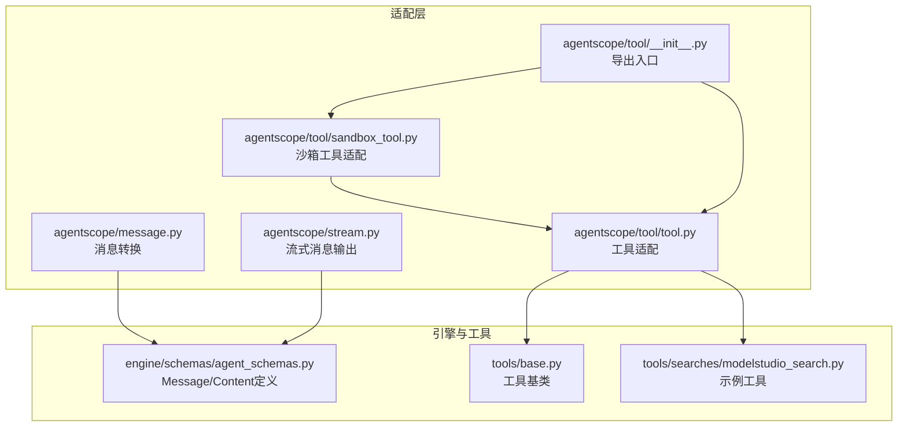
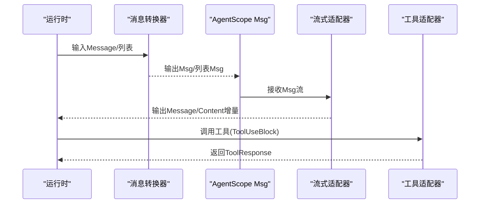
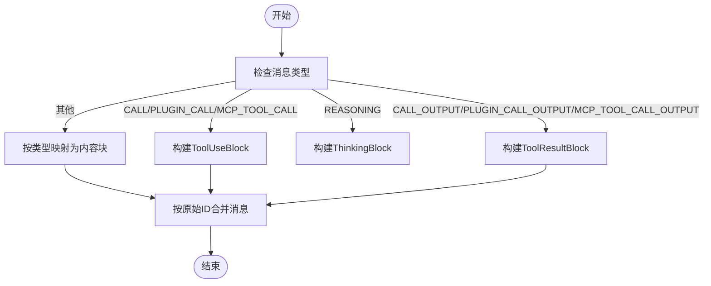
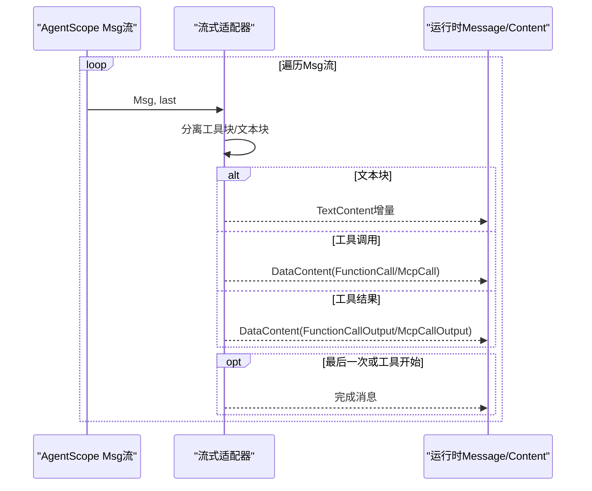
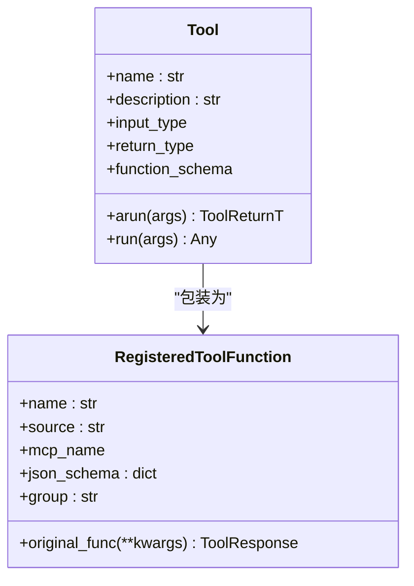
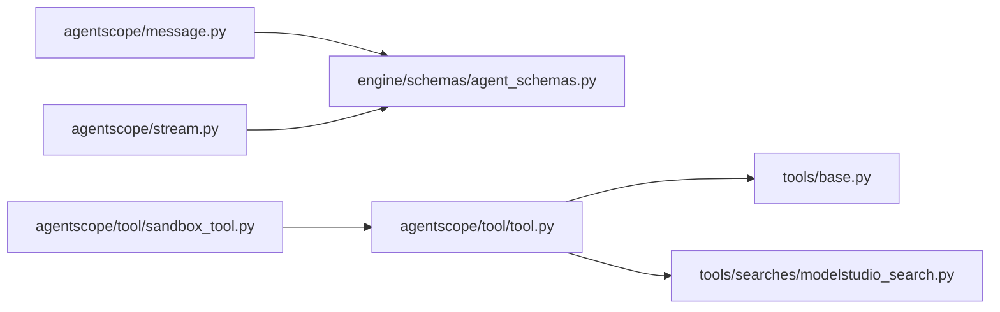

# AgentScope适配器

<cite>
**本文档引用的文件**
- [message.py](file://src/agentscope_runtime/adapters/agentscope/message.py)
- [stream.py](file://src/agentscope_runtime/adapters/agentscope/stream.py)
- [tool.py](file://src/agentscope_runtime/adapters/agentscope/tool/tool.py)
- [sandbox_tool.py](file://src/agentscope_runtime/adapters/agentscope/tool/sandbox_tool.py)
- [__init__.py](file://src/agentscope_runtime/adapters/agentscope/tool/__init__.py)
- [agent_schemas.py](file://src/agentscope_runtime/engine/schemas/agent_schemas.py)
- [base.py](file://src/agentscope_runtime/tools/base.py)
- [modelstudio_search.py](file://src/agentscope_runtime/tools/searches/modelstudio_search.py)
- [test_agentscope_tool_adapter.py](file://tests/tools/test_agentscope_tool_adapter.py)
</cite>

## 目录
1. [简介](#简介)
2. [项目结构](#项目结构)
3. [核心组件](#核心组件)
4. [架构总览](#架构总览)
5. [详细组件分析](#详细组件分析)
6. [依赖关系分析](#依赖关系分析)
7. [性能考虑](#性能考虑)
8. [故障排查指南](#故障排查指南)
9. [结论](#结论)
10. [附录](#附录)

## 简介
本文件面向AgentScope适配器，系统性阐述其在AgentScope运行时中的消息转换与工具调用适配机制。重点覆盖：
- 消息转换：从AgentScope运行时的Message到AgentScope Msg的转换流程、消息类型映射、内容块处理策略。
- 工具调用适配：从PluginCall/MCP工具调用到ToolUseBlock的转换、工具结果处理与参数解析。
- 适配器配置选项、错误处理机制与性能优化建议。
- 提供基于仓库源码的路径级示例，帮助读者快速定位实现位置并进行扩展。

## 项目结构
AgentScope适配器位于适配层目录下，围绕消息流与工具执行两条主线展开：
- 消息层：负责将运行时Message转换为AgentScope Msg，并支持流式输出。
- 工具层：负责将运行时工具包装为AgentScope可用的RegisteredToolFunction或Toolkit，统一工具调用与结果格式。

图表来源
- [message.py:53-394](file://src/agentscope_runtime/adapters/agentscope/message.py#L53-L394)
- [stream.py:33-684](file://src/agentscope_runtime/adapters/agentscope/stream.py#L33-L684)
- [tool.py:17-232](file://src/agentscope_runtime/adapters/agentscope/tool/tool.py#L17-L232)
- [sandbox_tool.py:15-70](file://src/agentscope_runtime/adapters/agentscope/tool/sandbox_tool.py#L15-L70)
- [__init__.py:1-10](file://src/agentscope_runtime/adapters/agentscope/tool/__init__.py#L1-L10)
- [agent_schemas.py:18-510](file://src/agentscope_runtime/engine/schemas/agent_schemas.py#L18-L510)
- [base.py:34-265](file://src/agentscope_runtime/tools/base.py#L34-L265)
- [modelstudio_search.py:102-220](file://src/agentscope_runtime/tools/searches/modelstudio_search.py#L102-L220)

章节来源
- [message.py:1-394](file://src/agentscope_runtime/adapters/agentscope/message.py#L1-L394)
- [stream.py:1-684](file://src/agentscope_runtime/adapters/agentscope/stream.py#L1-L684)
- [tool.py:1-232](file://src/agentscope_runtime/adapters/agentscope/tool/tool.py#L1-L232)
- [sandbox_tool.py:1-70](file://src/agentscope_runtime/adapters/agentscope/tool/sandbox_tool.py#L1-L70)
- [__init__.py:1-10](file://src/agentscope_runtime/adapters/agentscope/tool/__init__.py#L1-L10)
- [agent_schemas.py:1-800](file://src/agentscope_runtime/engine/schemas/agent_schemas.py#L1-L800)
- [base.py:1-265](file://src/agentscope_runtime/tools/base.py#L1-L265)
- [modelstudio_search.py:1-878](file://src/agentscope_runtime/tools/searches/modelstudio_search.py#L1-L878)

## 核心组件
- 消息转换器：将运行时Message转换为AgentScope Msg，支持文本、图像、音频、视频、文件等多模态内容块，以及工具调用/结果的ToolUseBlock/ToolResultBlock映射。
- 流式消息适配器：将AgentScope Msg流式输出转换为运行时Message流，支持增量文本、思考内容、工具调用与工具结果的增量更新。
- 工具适配器：将运行时Tool包装为AgentScope RegisteredToolFunction，自动完成输入校验、异步执行、结果格式化与错误处理。
- 沙箱工具适配器：确保沙箱工具返回值统一转换为ToolResponse，兼容MCP内容块转换。

章节来源
- [message.py:53-394](file://src/agentscope_runtime/adapters/agentscope/message.py#L53-L394)
- [stream.py:33-684](file://src/agentscope_runtime/adapters/agentscope/stream.py#L33-L684)
- [tool.py:17-232](file://src/agentscope_runtime/adapters/agentscope/tool/tool.py#L17-L232)
- [sandbox_tool.py:15-70](file://src/agentscope_runtime/adapters/agentscope/tool/sandbox_tool.py#L15-L70)

## 架构总览
AgentScope适配器在“消息”和“工具”两个维度上提供双向适配：
- 消息方向：运行时Message → AgentScope Msg；AgentScope Msg流 → 运行时Message流。
- 工具方向：运行时Tool → AgentScope RegisteredToolFunction；工具执行结果 → ToolResponse。

图表来源
- [message.py:53-394](file://src/agentscope_runtime/adapters/agentscope/message.py#L53-L394)
- [stream.py:33-684](file://src/agentscope_runtime/adapters/agentscope/stream.py#L33-L684)
- [tool.py:17-232](file://src/agentscope_runtime/adapters/agentscope/tool/tool.py#L17-L232)

## 详细组件分析

### 消息转换器（Message to Msg）
职责与流程：
- 角色归一化：将“tool”角色映射为“system”，避免AgentScope不支持的tool角色。
- 类型映射：根据Message.type将内容映射为TextBlock、ImageBlock、AudioBlock、VideoBlock、FileBlock或ThinkingBlock。
- 工具调用/结果：将PluginCall/MCP工具调用映射为ToolUseBlock；将PluginCallOutput/MCP工具结果映射为ToolResultBlock。
- 组合与去重：对同原始ID的消息进行合并，保证会话连贯性。

关键点：
- 支持自定义type_converters，允许按消息类型注入自定义转换逻辑。
- 对MCP工具结果尝试转换为AgentScope内容块，增强兼容性。
- 对图片/音频/视频/文件的URL与Base64数据源进行识别与封装。

图表来源
- [message.py:53-394](file://src/agentscope_runtime/adapters/agentscope/message.py#L53-L394)

章节来源
- [message.py:53-394](file://src/agentscope_runtime/adapters/agentscope/message.py#L53-L394)
- [agent_schemas.py:18-510](file://src/agentscope_runtime/engine/schemas/agent_schemas.py#L18-L510)

### 流式消息适配器（Adapt Agentscope Message Stream）
职责与流程：
- 将AgentScope Msg流转换为运行时Message流，支持增量文本、思考内容、工具调用与工具结果的增量更新。
- 维护消息状态机：区分普通消息与思考消息，维护索引与截断记忆，确保增量内容正确拼接。
- 工具调用/结果：根据ToolUseBlock/ToolResultBlock生成对应的数据内容块（FunctionCall/FunctionCallOutput或McpCall/McpCallOutput），并在最后完成消息。

图表来源
- [stream.py:33-684](file://src/agentscope_runtime/adapters/agentscope/stream.py#L33-L684)

章节来源
- [stream.py:33-684](file://src/agentscope_runtime/adapters/agentscope/stream.py#L33-L684)

### 工具适配器（Tool Adapter）
职责与流程：
- 将运行时Tool包装为AgentScope RegisteredToolFunction，自动：
  - 输入参数校验（基于Tool.input_type）。
  - 异步/同步工具执行（自动检测协程函数并安全运行）。
  - 结果格式化（Pydantic模型转字典，非模型转字符串）。
  - 错误处理（输入验证失败、执行异常、格式化异常均返回ToolResponse并标记错误）。
- 支持批量创建Toolkit（agentscope_toolkit_adapter），并可对名称与描述进行覆盖。

图表来源
- [tool.py:17-232](file://src/agentscope_runtime/adapters/agentscope/tool/tool.py#L17-L232)
- [base.py:34-265](file://src/agentscope_runtime/tools/base.py#L34-L265)

章节来源
- [tool.py:17-232](file://src/agentscope_runtime/adapters/agentscope/tool/tool.py#L17-L232)
- [base.py:34-265](file://src/agentscope_runtime/tools/base.py#L34-L265)

### 沙箱工具适配器（Sandbox Tool Adapter）
职责与流程：
- 确保沙箱工具返回值统一转换为ToolResponse，兼容MCP CallToolResult结构。
- 若无法直接转换，回退为将原始结果作为TextBlock返回。
- 记录警告日志以便调试。

章节来源
- [sandbox_tool.py:15-70](file://src/agentscope_runtime/adapters/agentscope/tool/sandbox_tool.py#L15-L70)

### 示例：消息转换与工具调用
- 消息转换示例路径：[message_to_agentscope_msg:53-394](file://src/agentscope_runtime/adapters/agentscope/message.py#L53-L394)
- 流式消息适配示例路径：[adapt_agentscope_message_stream:33-684](file://src/agentscope_runtime/adapters/agentscope/stream.py#L33-L684)
- 工具适配示例路径：[agentscope_tool_adapter:17-232](file://src/agentscope_runtime/adapters/agentscope/tool/tool.py#L17-L232)
- 沙箱工具适配示例路径：[sandbox_tool_adapter:15-70](file://src/agentscope_runtime/adapters/agentscope/tool/sandbox_tool.py#L15-L70)
- 示例工具实现路径：[ModelstudioSearch:102-220](file://src/agentscope_runtime/tools/searches/modelstudio_search.py#L102-L220)

章节来源
- [message.py:53-394](file://src/agentscope_runtime/adapters/agentscope/message.py#L53-L394)
- [stream.py:33-684](file://src/agentscope_runtime/adapters/agentscope/stream.py#L33-L684)
- [tool.py:17-232](file://src/agentscope_runtime/adapters/agentscope/tool/tool.py#L17-L232)
- [sandbox_tool.py:15-70](file://src/agentscope_runtime/adapters/agentscope/tool/sandbox_tool.py#L15-L70)
- [modelstudio_search.py:102-220](file://src/agentscope_runtime/tools/searches/modelstudio_search.py#L102-L220)

## 依赖关系分析
- 消息转换依赖运行时Message/Content定义与AgentScope Msg类型（TextBlock/ToolUseBlock/ToolResultBlock/ThinkingBlock/ImageBlock/AudioBlock/VideoBlock/FileBlock）。
- 流式适配依赖运行时Message/Content类型与状态管理（in_progress/completed）。
- 工具适配依赖运行时Tool基类与AgentScope Toolkit/RegisteredToolFunction。
- 沙箱工具适配依赖MCPClientBase的内容块转换能力。

图表来源
- [message.py:1-394](file://src/agentscope_runtime/adapters/agentscope/message.py#L1-L394)
- [stream.py:1-684](file://src/agentscope_runtime/adapters/agentscope/stream.py#L1-L684)
- [tool.py:1-232](file://src/agentscope_runtime/adapters/agentscope/tool/tool.py#L1-L232)
- [sandbox_tool.py:1-70](file://src/agentscope_runtime/adapters/agentscope/tool/sandbox_tool.py#L1-L70)
- [agent_schemas.py:1-800](file://src/agentscope_runtime/engine/schemas/agent_schemas.py#L1-L800)
- [base.py:1-265](file://src/agentscope_runtime/tools/base.py#L1-L265)
- [modelstudio_search.py:1-878](file://src/agentscope_runtime/tools/searches/modelstudio_search.py#L1-L878)

章节来源
- [message.py:1-394](file://src/agentscope_runtime/adapters/agentscope/message.py#L1-L394)
- [stream.py:1-684](file://src/agentscope_runtime/adapters/agentscope/stream.py#L1-L684)
- [tool.py:1-232](file://src/agentscope_runtime/adapters/agentscope/tool/tool.py#L1-L232)
- [sandbox_tool.py:1-70](file://src/agentscope_runtime/adapters/agentscope/tool/sandbox_tool.py#L1-L70)
- [agent_schemas.py:1-800](file://src/agentscope_runtime/engine/schemas/agent_schemas.py#L1-L800)
- [base.py:1-265](file://src/agentscope_runtime/tools/base.py#L1-L265)
- [modelstudio_search.py:1-878](file://src/agentscope_runtime/tools/searches/modelstudio_search.py#L1-L878)

## 性能考虑
- 异步执行：工具适配器在检测到协程函数时，采用线程池+事件循环的方式安全运行，避免阻塞。
- 结果序列化：优先使用Pydantic模型的model_dump进行结构化输出，减少不必要的字符串转换。
- 增量流式：流式适配器通过索引与截断记忆避免重复传输，提升增量渲染效率。
- 内容块转换：对MCP结果进行优先转换为AgentScope内容块，降低后续处理成本。

[本节为通用指导，无需特定文件引用]

## 故障排查指南
- 输入校验失败：工具适配器会在输入校验阶段返回带错误标记的ToolResponse，检查Tool.input_type与传入参数是否匹配。
- 执行异常：工具适配器捕获执行异常并返回错误响应，确认工具实现与外部依赖可用。
- 结果格式化异常：当结果无法序列化为字符串或JSON时，工具适配器会记录错误并返回文本形式的结果。
- 沙箱工具适配：若沙箱工具返回非标准结构，沙箱适配器会记录警告并回退为文本块，便于定位问题。

章节来源
- [tool.py:59-143](file://src/agentscope_runtime/adapters/agentscope/tool/tool.py#L59-L143)
- [sandbox_tool.py:32-67](file://src/agentscope_runtime/adapters/agentscope/tool/sandbox_tool.py#L32-L67)

## 结论
AgentScope适配器通过消息转换与流式适配，实现了运行时与AgentScope之间的无缝互通；通过工具适配与沙箱适配，统一了工具调用与结果格式，提升了工具生态的兼容性与可维护性。结合测试用例与示例工具，开发者可以快速集成与扩展。

[本节为总结性内容，无需特定文件引用]

## 附录

### 适配器配置选项
- 消息转换器
  - type_converters：按消息类型注入自定义转换函数。
  - 支持从运行时Message元数据中读取original_id/original_name用于消息合并。
- 工具适配器
  - name/description覆盖：允许为工具指定新的名称与描述。
  - 自动Schema生成：基于Tool.input_type生成AgentScope函数调用模式的JSON Schema。
- 沙箱工具适配器
  - 保持原函数签名与文档，确保JSON Schema正确生成。

章节来源
- [message.py:53-106](file://src/agentscope_runtime/adapters/agentscope/message.py#L53-L106)
- [tool.py:17-169](file://src/agentscope_runtime/adapters/agentscope/tool/tool.py#L17-L169)
- [sandbox_tool.py:15-30](file://src/agentscope_runtime/adapters/agentscope/tool/sandbox_tool.py#L15-L30)

### 实际代码示例（路径级）
- 消息转换入口：[message_to_agentscope_msg:53-394](file://src/agentscope_runtime/adapters/agentscope/message.py#L53-L394)
- 流式适配入口：[adapt_agentscope_message_stream:33-684](file://src/agentscope_runtime/adapters/agentscope/stream.py#L33-L684)
- 工具适配入口：[agentscope_tool_adapter:17-232](file://src/agentscope_runtime/adapters/agentscope/tool/tool.py#L17-L232)
- 沙箱工具适配入口：[sandbox_tool_adapter:15-70](file://src/agentscope_runtime/adapters/agentscope/tool/sandbox_tool.py#L15-L70)
- 示例工具实现：[ModelstudioSearch:102-220](file://src/agentscope_runtime/tools/searches/modelstudio_search.py#L102-L220)
- 工具适配测试：[test_agentscope_tool_adapter.py:1-364](file://tests/tools/test_agentscope_tool_adapter.py#L1-L364)