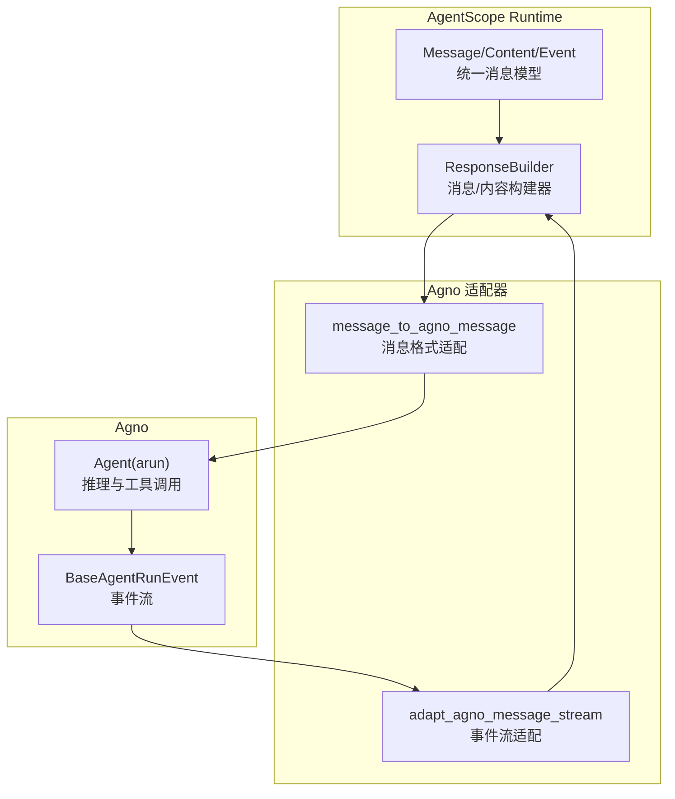
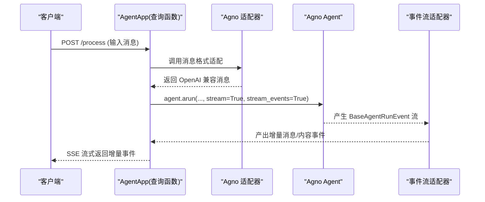
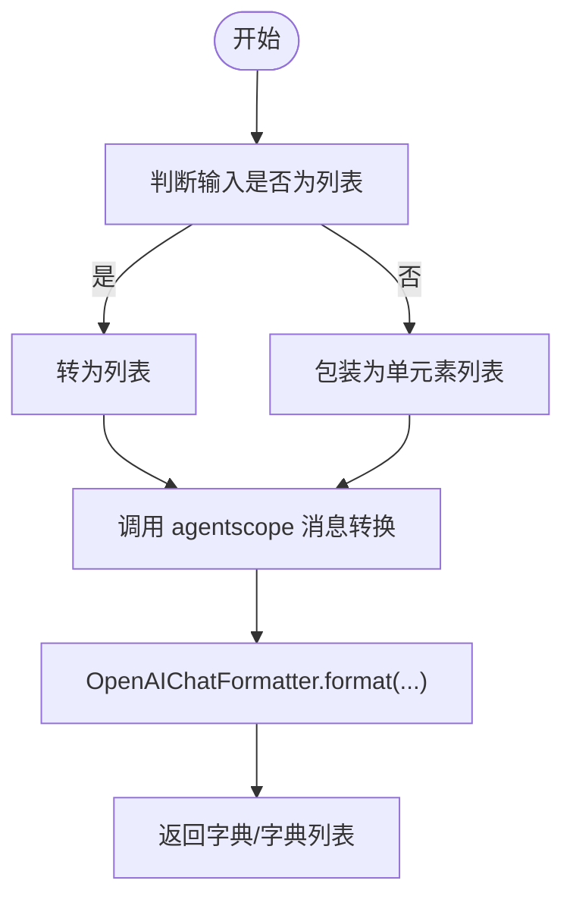
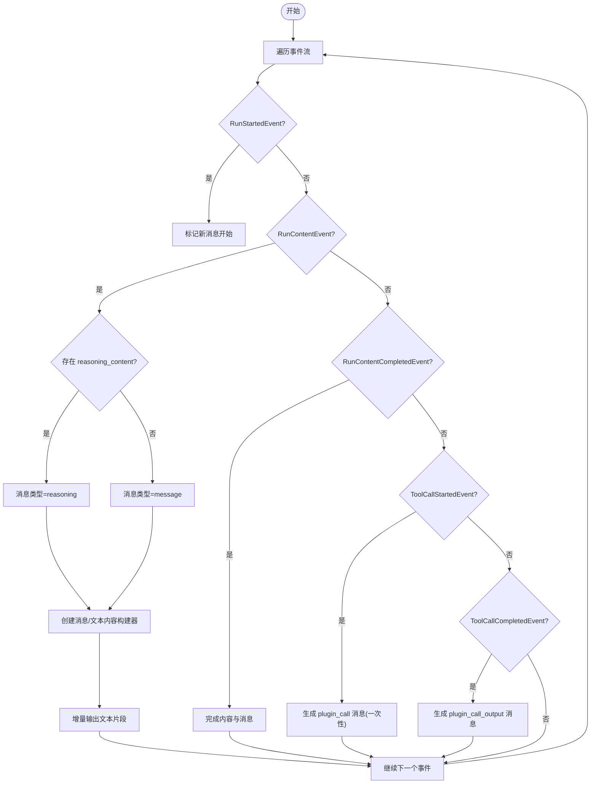
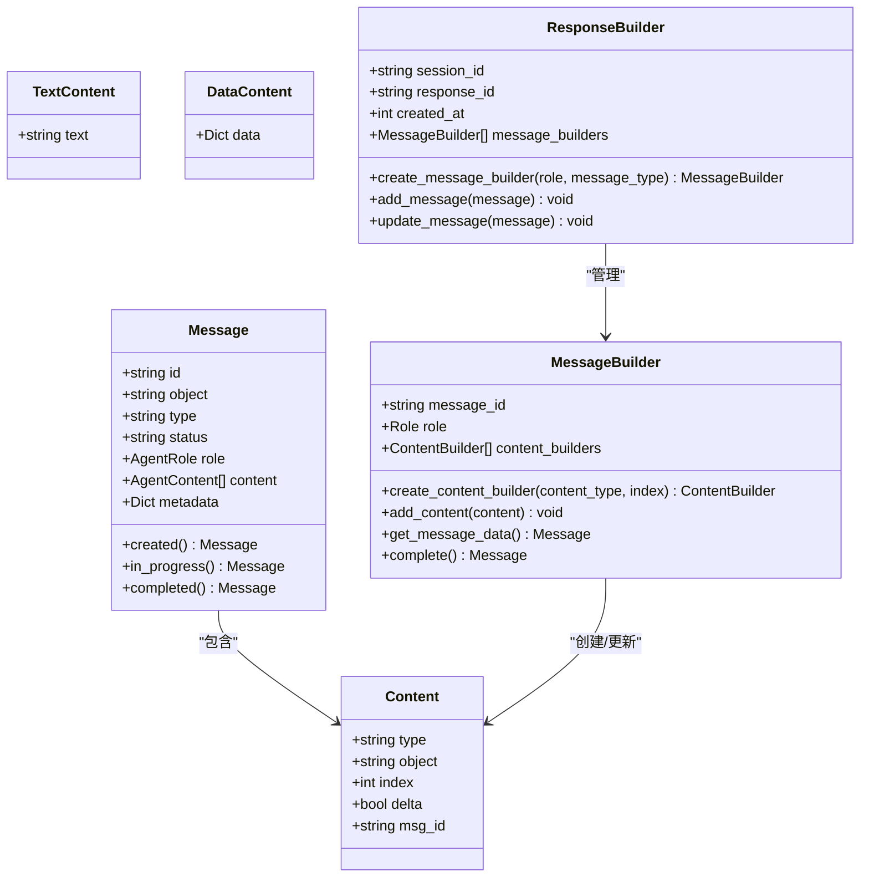
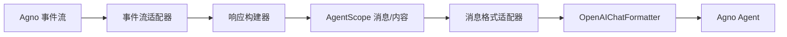

# Agno适配器

<cite>
**本文引用的文件**
- [src/agentscope_runtime/adapters/agno/message.py](file://src/agentscope_runtime/adapters/agno/message.py)
- [src/agentscope_runtime/adapters/agno/stream.py](file://src/agentscope_runtime/adapters/agno/stream.py)
- [src/agentscope_runtime/engine/schemas/agent_schemas.py](file://src/agentscope_runtime/engine/schemas/agent_schemas.py)
- [src/agentscope_runtime/engine/helpers/agent_api_builder.py](file://src/agentscope_runtime/engine/helpers/agent_api_builder.py)
- [src/agentscope_runtime/adapters/agentscope/message.py](file://src/agentscope_runtime/adapters/agentscope/message.py)
- [cookbook/zh/agno_guidelines.md](file://cookbook/zh/agno_guidelines.md)
- [tests/integrated/test_agno_agent_app.py](file://tests/integrated/test_agno_agent_app.py)
- [tests/integrated/test_runner_stream_agno.py](file://tests/integrated/test_runner_stream_agno.py)
</cite>

## 目录
1. [简介](#简介)
2. [项目结构](#项目结构)
3. [核心组件](#核心组件)
4. [架构总览](#架构总览)
5. [详细组件分析](#详细组件分析)
6. [依赖关系分析](#依赖关系分析)
7. [性能考虑](#性能考虑)
8. [故障排查指南](#故障排查指南)
9. [结论](#结论)
10. [附录](#附录)

## 简介
本文件面向希望在 AgentScope Runtime 中集成 Agno 框架的开发者，系统性阐述 Agno 适配器的消息转换与流式处理机制，包括：
- 消息格式适配：从 AgentScope Runtime 的统一消息模型到 Agno 的 OpenAI 兼容格式
- 响应流处理：将 Agno 的事件流转换为 AgentScope Runtime 的增量消息流
- 状态同步：通过消息构建器与内容构建器维持消息与内容的生命周期状态
- 集成方式：消息序列化、工具调用适配、实时通信支持
- 配置指南、性能优化建议与最佳实践
- 具体示例：展示 Agno 智能体的集成与使用方法

## 项目结构
Agno 适配器位于适配器层，负责桥接 AgentScope Runtime 的统一消息模型与 Agno 的事件流：
- 适配器入口：message.py 负责将 AgentScope Runtime 的 Message 转换为 Agno 所需的 OpenAI 格式
- 事件流适配：stream.py 将 Agno 的 BaseAgentRunEvent 流转换为 AgentScope Runtime 的增量消息流
- 统一消息模型：engine.schemas.agent_schemas.py 定义了消息类型、内容类型、状态等核心数据结构
- 响应构建器：engine.helpers.agent_api_builder.py 提供消息与内容的增量构建与状态管理
- AgentScope 侧消息转换：adapters/agentscope/message.py 展示了反向转换逻辑，便于理解双向适配

**图表来源**
- [src/agentscope_runtime/adapters/agno/message.py:10-39](file://src/agentscope_runtime/adapters/agno/message.py#L10-L39)
- [src/agentscope_runtime/adapters/agno/stream.py:32-124](file://src/agentscope_runtime/adapters/agno/stream.py#L32-L124)
- [src/agentscope_runtime/engine/schemas/agent_schemas.py:18-78](file://src/agentscope_runtime/engine/schemas/agent_schemas.py#L18-L78)
- [src/agentscope_runtime/engine/helpers/agent_api_builder.py:467-575](file://src/agentscope_runtime/engine/helpers/agent_api_builder.py#L467-L575)

**章节来源**
- [src/agentscope_runtime/adapters/agno/message.py:10-39](file://src/agentscope_runtime/adapters/agno/message.py#L10-L39)
- [src/agentscope_runtime/adapters/agno/stream.py:32-124](file://src/agentscope_runtime/adapters/agno/stream.py#L32-L124)
- [src/agentscope_runtime/engine/schemas/agent_schemas.py:18-78](file://src/agentscope_runtime/engine/schemas/agent_schemas.py#L18-L78)
- [src/agentscope_runtime/engine/helpers/agent_api_builder.py:467-575](file://src/agentscope_runtime/engine/helpers/agent_api_builder.py#L467-L575)

## 核心组件
- 消息格式适配器：将 AgentScope Runtime 的 Message 列表转换为 OpenAI 兼容格式，供 Agno Agent 使用
- 事件流适配器：将 Agno 的事件流转换为 AgentScope Runtime 的增量消息流，支持思维内容与文本内容区分、工具调用与结果的分步产出
- 统一消息模型：定义消息类型、内容类型、状态枚举以及消息/内容对象的结构
- 响应构建器：负责创建消息、内容对象，维护状态（created/in_progress/completed），并按序产出增量事件

**章节来源**
- [src/agentscope_runtime/adapters/agno/message.py:10-39](file://src/agentscope_runtime/adapters/agno/message.py#L10-L39)
- [src/agentscope_runtime/adapters/agno/stream.py:32-124](file://src/agentscope_runtime/adapters/agno/stream.py#L32-L124)
- [src/agentscope_runtime/engine/schemas/agent_schemas.py:18-78](file://src/agentscope_runtime/engine/schemas/agent_schemas.py#L18-L78)
- [src/agentscope_runtime/engine/helpers/agent_api_builder.py:467-575](file://src/agentscope_runtime/engine/helpers/agent_api_builder.py#L467-L575)

## 架构总览
下图展示了从 Agent 发起请求到流式响应的关键流程，包括消息格式转换与事件流适配：

**图表来源**
- [cookbook/zh/agno_guidelines.md:60-88](file://cookbook/zh/agno_guidelines.md#L60-L88)
- [src/agentscope_runtime/adapters/agno/message.py:10-39](file://src/agentscope_runtime/adapters/agno/message.py#L10-L39)
- [src/agentscope_runtime/adapters/agno/stream.py:32-124](file://src/agentscope_runtime/adapters/agno/stream.py#L32-L124)

## 详细组件分析

### 消息格式适配器（message_to_agno_message）
职责：
- 将 AgentScope Runtime 的 Message 或消息列表转换为 OpenAI 兼容格式
- 通过 OpenAIChatFormatter 对 AgentScope 的通用消息进行格式化，生成 Agno 可消费的输入

关键点：
- 支持单个或多个消息输入
- 类型转换器映射可选，用于自定义特定消息类型的转换逻辑
- 最终输出为字典或字典列表，符合 OpenAI Chat 接口要求

**图表来源**
- [src/agentscope_runtime/adapters/agno/message.py:10-39](file://src/agentscope_runtime/adapters/agno/message.py#L10-L39)
- [src/agentscope_runtime/adapters/agentscope/message.py:53-394](file://src/agentscope_runtime/adapters/agentscope/message.py#L53-L394)

**章节来源**
- [src/agentscope_runtime/adapters/agno/message.py:10-39](file://src/agentscope_runtime/adapters/agno/message.py#L10-L39)
- [src/agentscope_runtime/adapters/agentscope/message.py:53-394](file://src/agentscope_runtime/adapters/agentscope/message.py#L53-L394)

### 事件流适配器（adapt_agno_message_stream）
职责：
- 将 Agno 的 BaseAgentRunEvent 流转换为 AgentScope Runtime 的增量消息流
- 区分思维内容与普通文本内容，分别创建消息与内容构建器
- 处理工具调用开始/完成事件，生成对应的 plugin_call 与 plugin_call_output 消息
- 维护消息与内容的生命周期状态（created/in_progress/completed）

处理逻辑要点：
- RunStartedEvent：标记新消息开始
- RunContentEvent：根据是否存在 reasoning_content 判断消息类型为 reasoning 或 message；创建消息与文本内容构建器并增量输出文本片段
- RunContentCompletedEvent：完成当前内容与消息
- ToolCallStartedEvent：将工具参数序列化为 DataContent，生成 plugin_call 消息（非流式）
- ToolCallCompletedEvent：将工具结果序列化为 DataContent，生成 plugin_call_output 消息

**图表来源**
- [src/agentscope_runtime/adapters/agno/stream.py:32-124](file://src/agentscope_runtime/adapters/agno/stream.py#L32-L124)

**章节来源**
- [src/agentscope_runtime/adapters/agno/stream.py:32-124](file://src/agentscope_runtime/adapters/agno/stream.py#L32-L124)

### 统一消息模型与响应构建器
- 消息类型与内容类型：定义了 message、function_call、plugin_call、reasoning 等类型，以及 text、image、audio、data、video、file 等内容类型
- 状态枚举：created、in_progress、completed、failed 等
- 响应构建器：负责创建消息与内容对象，维护状态变更与增量输出；消息构建器与内容构建器协同工作，保证消息与内容的生命周期一致

**图表来源**
- [src/agentscope_runtime/engine/schemas/agent_schemas.py:480-595](file://src/agentscope_runtime/engine/schemas/agent_schemas.py#L480-L595)
- [src/agentscope_runtime/engine/schemas/agent_schemas.py:320-430](file://src/agentscope_runtime/engine/schemas/agent_schemas.py#L320-L430)
- [src/agentscope_runtime/engine/helpers/agent_api_builder.py:467-575](file://src/agentscope_runtime/engine/helpers/agent_api_builder.py#L467-L575)
- [src/agentscope_runtime/engine/helpers/agent_api_builder.py:363-464](file://src/agentscope_runtime/engine/helpers/agent_api_builder.py#L363-L464)

**章节来源**
- [src/agentscope_runtime/engine/schemas/agent_schemas.py:18-78](file://src/agentscope_runtime/engine/schemas/agent_schemas.py#L18-L78)
- [src/agentscope_runtime/engine/schemas/agent_schemas.py:480-595](file://src/agentscope_runtime/engine/schemas/agent_schemas.py#L480-L595)
- [src/agentscope_runtime/engine/helpers/agent_api_builder.py:467-575](file://src/agentscope_runtime/engine/helpers/agent_api_builder.py#L467-L575)

### 集成方式与示例
- 查询函数装饰器：通过 AgentApp.query(framework="agno") 注册 Agno 框架的查询函数
- 流式输出：agent.arun(..., stream=True, stream_events=True) 产生事件流，适配器将其转换为增量消息
- OpenAI 兼容模式：支持通过 OpenAI 兼容接口访问
- 会话与记忆：可结合 InMemoryDb 等存储实现多轮对话与上下文记忆

参考示例与测试：
- 示例应用：[cookbook/zh/agno_guidelines.md:31-94](file://cookbook/zh/agno_guidelines.md#L31-L94)
- 测试用例：流式 /process 端点、OpenAI 兼容模式、多轮对话

**章节来源**
- [cookbook/zh/agno_guidelines.md:31-94](file://cookbook/zh/agno_guidelines.md#L31-L94)
- [tests/integrated/test_agno_agent_app.py:34-63](file://tests/integrated/test_agno_agent_app.py#L34-L63)
- [tests/integrated/test_agno_agent_app.py:92-151](file://tests/integrated/test_agno_agent_app.py#L92-L151)
- [tests/integrated/test_agno_agent_app.py:153-168](file://tests/integrated/test_agno_agent_app.py#L153-L168)
- [tests/integrated/test_agno_agent_app.py:170-248](file://tests/integrated/test_agno_agent_app.py#L170-L248)

## 依赖关系分析
- 适配器依赖：
  - AgentScope Runtime 统一消息模型（Message、Content、Event）
  - OpenAIChatFormatter（用于将通用消息格式化为 OpenAI 兼容格式）
  - Agno 事件类型（RunStartedEvent、RunContentEvent、RunContentCompletedEvent、ToolCallStartedEvent、ToolCallCompletedEvent）
- 响应构建器依赖：
  - MessageBuilder、ContentBuilder 协同维护消息与内容的增量构建与状态切换

**图表来源**
- [src/agentscope_runtime/adapters/agno/stream.py:32-124](file://src/agentscope_runtime/adapters/agno/stream.py#L32-L124)
- [src/agentscope_runtime/adapters/agno/message.py:10-39](file://src/agentscope_runtime/adapters/agno/message.py#L10-L39)
- [src/agentscope_runtime/engine/helpers/agent_api_builder.py:467-575](file://src/agentscope_runtime/engine/helpers/agent_api_builder.py#L467-L575)

**章节来源**
- [src/agentscope_runtime/adapters/agno/stream.py:32-124](file://src/agentscope_runtime/adapters/agno/stream.py#L32-L124)
- [src/agentscope_runtime/adapters/agno/message.py:10-39](file://src/agentscope_runtime/adapters/agno/message.py#L10-L39)
- [src/agentscope_runtime/engine/helpers/agent_api_builder.py:467-575](file://src/agentscope_runtime/engine/helpers/agent_api_builder.py#L467-L575)

## 性能考虑
- 事件聚合与状态切换：事件流适配器通过消息构建器与内容构建器的组合，避免频繁创建对象，减少 GC 压力
- 序列化开销：工具调用参数与结果的 JSON 序列化仅在必要时执行，避免重复序列化
- 流式传输：采用增量事件输出，降低端到端延迟，提升用户体验
- 内存与并发：合理复用 ResponseBuilder、MessageBuilder、ContentBuilder，避免长生命周期对象持有过多中间态数据

## 故障排查指南
- SSE 流异常：
  - 确认 /process 端点返回 Content-Type 为 text/event-stream
  - 检查事件流中是否包含 [DONE] 结束标记
- 工具调用未流式：
  - 工具调用事件目前为一次性消息，非流式；若需流式工具调用，需评估上游支持情况
- OpenAI 兼容模式：
  - 确认兼容模式基础 URL 正确，模型名可为任意字符串
- 多轮对话记忆：
  - 确保 session_id 传递正确，且存储后端（如 InMemoryDb）已初始化

**章节来源**
- [tests/integrated/test_agno_agent_app.py:92-151](file://tests/integrated/test_agno_agent_app.py#L92-L151)
- [tests/integrated/test_agno_agent_app.py:153-168](file://tests/integrated/test_agno_agent_app.py#L153-L168)
- [tests/integrated/test_agno_agent_app.py:170-248](file://tests/integrated/test_agno_agent_app.py#L170-L248)

## 结论
Agno 适配器通过“消息格式适配 + 事件流适配”的双通道设计，实现了 AgentScope Runtime 与 Agno 的无缝集成。其核心优势在于：
- 统一消息模型与增量构建器保证了状态一致性与低开销
- 事件流适配器对思维内容与工具调用提供了细粒度的流式支持
- 配合 OpenAI 兼容模式与会话记忆，满足多场景需求

## 附录
- 快速开始示例参考：[cookbook/zh/agno_guidelines.md:31-94](file://cookbook/zh/agno_guidelines.md#L31-L94)
- 流式端点与兼容模式测试：[tests/integrated/test_agno_agent_app.py:92-168](file://tests/integrated/test_agno_agent_app.py#L92-L168)
- Runner 流式集成示例：[tests/integrated/test_runner_stream_agno.py:18-83](file://tests/integrated/test_runner_stream_agno.py#L18-L83)