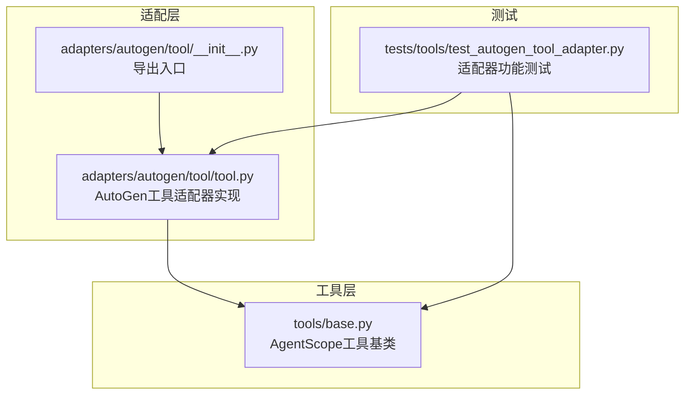
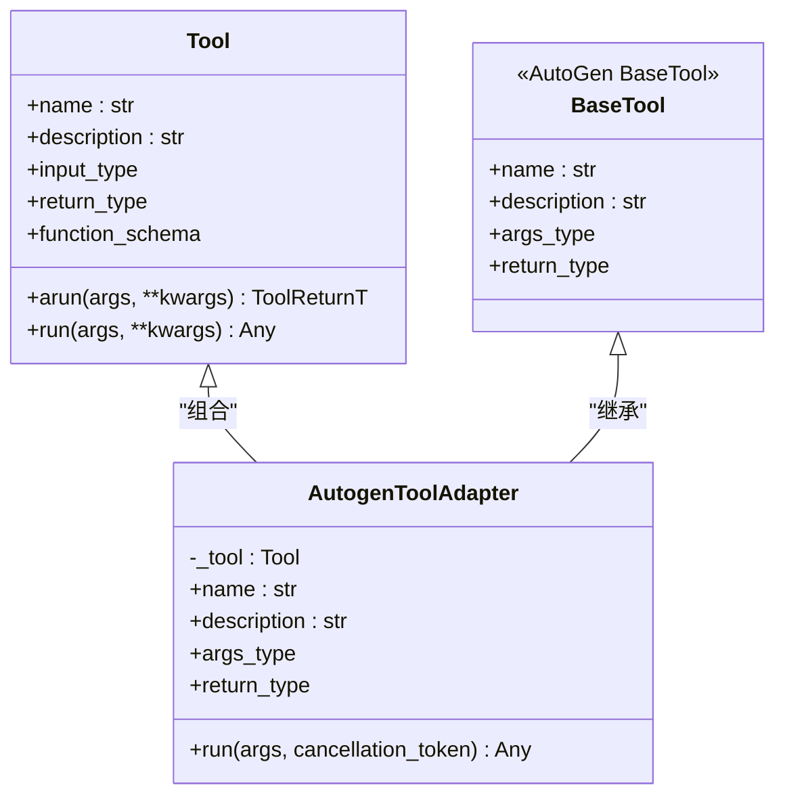
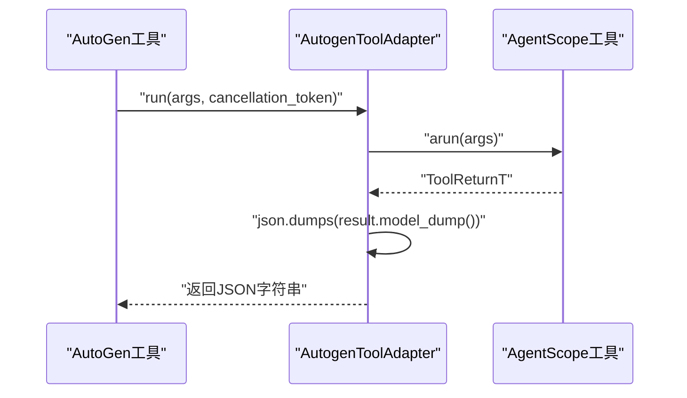
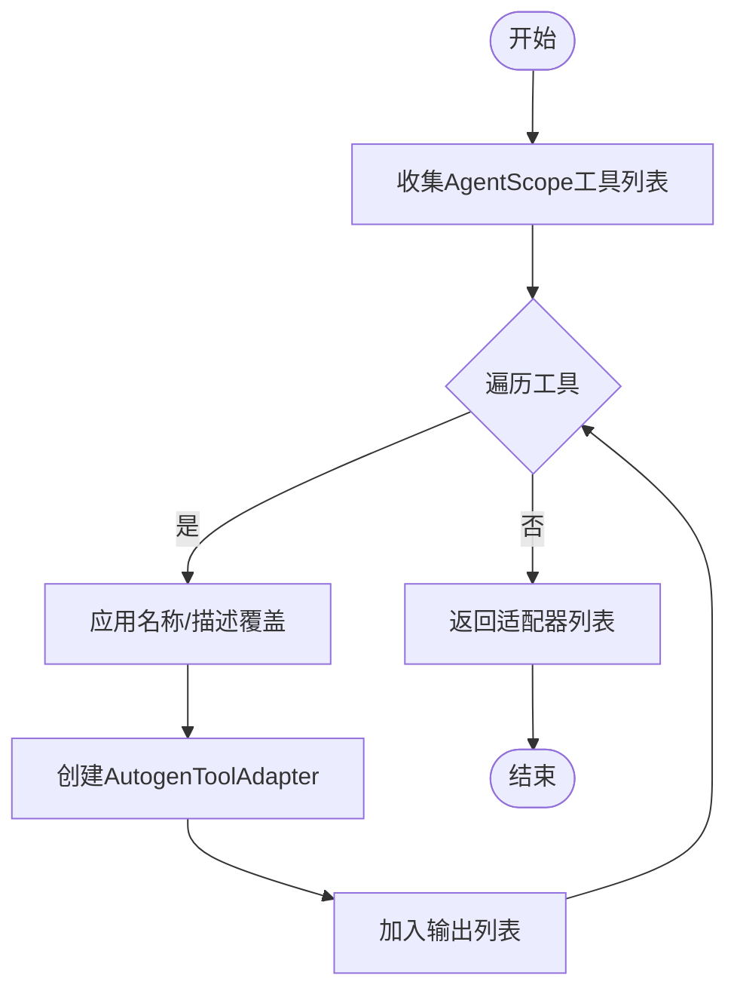
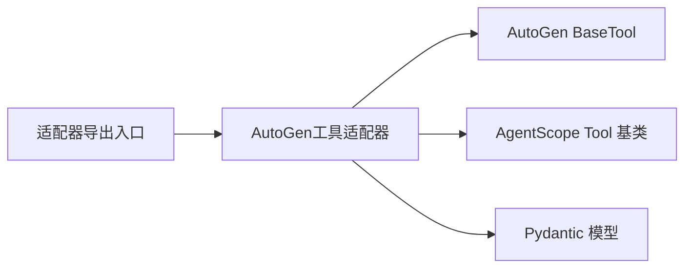

# AutoGen适配器

<cite>
**本文引用的文件**
- [tool.py](file://src/agentscope_runtime/adapters/autogen/tool/tool.py)
- [__init__.py（AutoGen工具适配器）](file://src/agentscope_runtime/adapters/autogen/tool/__init__.py)
- [base.py（工具基类）](file://src/agentscope_runtime/tools/base.py)
- [test_autogen_tool_adapter.py（AutoGen工具适配器测试）](file://tests/tools/test_autogen_tool_adapter.py)
</cite>

## 目录
1. [简介](#简介)
2. [项目结构](#项目结构)
3. [核心组件](#核心组件)
4. [架构总览](#架构总览)
5. [详细组件分析](#详细组件分析)
6. [依赖分析](#依赖分析)
7. [性能考虑](#性能考虑)
8. [故障排查指南](#故障排查指南)
9. [结论](#结论)
10. [附录](#附录)

## 简介
本文件面向需要在AutoGen生态中复用AgentScope工具集的开发者，系统性阐述AutoGen适配器的设计与实现，重点覆盖以下方面：
- 工具调用适配机制：如何将AgentScope的工具封装为AutoGen可识别的工具类型，并完成参数校验、异步执行与结果序列化。
- 多智能体协作消息处理：通过工具适配器与AutoGen Agent的结合，实现工具调用在多智能体对话中的触发与回传。
- 团队交互适配：在AutoGen团队智能体场景下，如何将AgentScope工具作为团队成员的“能力插件”参与任务分解与协作。
- 工具集成方式：工具注册、参数传递、结果聚合的完整流程与最佳实践。
- 配置选项与使用模式：名称与描述覆盖、批量适配等实用技巧。
- 性能与稳定性：异步执行、取消令牌、错误传播与JSON序列化策略。

## 项目结构
AutoGen适配器位于适配层目录，核心文件集中在工具适配模块中，配合AgentScope工具基类与测试用例形成闭环。

图表来源
- [tool.py:1-212](file://src/agentscope_runtime/adapters/autogen/tool/tool.py#L1-L212)
- [__init__.py（AutoGen工具适配器）:1-8](file://src/agentscope_runtime/adapters/autogen/tool/__init__.py#L1-L8)
- [base.py（工具基类）:1-265](file://src/agentscope_runtime/tools/base.py#L1-L265)
- [test_autogen_tool_adapter.py（AutoGen工具适配器测试）:1-112](file://tests/tools/test_autogen_tool_adapter.py#L1-L112)

章节来源
- [tool.py:1-212](file://src/agentscope_runtime/adapters/autogen/tool/tool.py#L1-L212)
- [__init__.py（AutoGen工具适配器）:1-8](file://src/agentscope_runtime/adapters/autogen/tool/__init__.py#L1-L8)
- [base.py（工具基类）:1-265](file://src/agentscope_runtime/tools/base.py#L1-L265)
- [test_autogen_tool_adapter.py（AutoGen工具适配器测试）:1-112](file://tests/tools/test_autogen_tool_adapter.py#L1-L112)

## 核心组件
- AutoGen工具适配器（AutogenToolAdapter）
  - 将AgentScope工具包装为AutoGen可用的工具类型，自动继承输入/输出类型、名称与描述，并在运行时进行参数校验与结果序列化。
- 批量适配工厂（create_autogen_tools）
  - 提供批量创建适配器的能力，支持按工具名进行名称与描述的覆盖，便于在多工具场景下统一命名规范。
- AgentScope工具基类（Tool）
  - 定义了通用的异步执行接口、类型推断、参数Schema解析与同步/异步调用桥接逻辑。

章节来源
- [tool.py:28-108](file://src/agentscope_runtime/adapters/autogen/tool/tool.py#L28-L108)
- [tool.py:140-212](file://src/agentscope_runtime/adapters/autogen/tool/tool.py#L140-L212)
- [base.py（工具基类）:34-195](file://src/agentscope_runtime/tools/base.py#L34-L195)

## 架构总览
AutoGen适配器通过继承AutoGen的工具基类，将AgentScope工具的输入/输出类型映射为AutoGen的参数模型，并在运行时委托AgentScope工具执行，最终以JSON字符串形式返回结果，满足AutoGen对工具返回值的要求。

图表来源
- [tool.py:28-108](file://src/agentscope_runtime/adapters/autogen/tool/tool.py#L28-L108)
- [base.py（工具基类）:34-143](file://src/agentscope_runtime/tools/base.py#L34-L143)

## 详细组件分析

### 组件一：AutoGen工具适配器（AutogenToolAdapter）
- 设计要点
  - 组合AgentScope工具实例，继承AutoGen工具基类，确保参数模型与返回类型兼容。
  - 自动从AgentScope工具提取输入/输出类型，生成AutoGen所需的参数模型与返回类型。
  - 运行时将AutoGen传入的参数对象转交给AgentScope工具执行，并将结果序列化为JSON字符串。
- 关键方法
  - 初始化：设置名称、描述、参数模型与返回类型。
  - 运行：接收AutoGen传入的参数与取消令牌，调用AgentScope工具的异步执行方法，捕获异常并抛出带上下文的错误信息。
- 参数与返回
  - 输入参数：AutoGen参数模型实例（由AgentScope工具的输入类型决定）。
  - 返回结果：JSON字符串，确保AutoGen能够正确解析与回传。

图表来源
- [tool.py:109-138](file://src/agentscope_runtime/adapters/autogen/tool/tool.py#L109-L138)

章节来源
- [tool.py:83-138](file://src/agentscope_runtime/adapters/autogen/tool/tool.py#L83-L138)

### 组件二：批量适配工厂（create_autogen_tools）
- 设计要点
  - 支持批量创建适配器，减少重复样板代码。
  - 提供名称与描述覆盖映射，便于在多工具场景下统一命名与描述。
- 使用模式
  - 在多工具场景下，先定义工具列表，再通过工厂函数生成适配器列表，直接注入到AutoGen Agent中。

图表来源
- [tool.py:140-212](file://src/agentscope_runtime/adapters/autogen/tool/tool.py#L140-L212)

章节来源
- [tool.py:140-212](file://src/agentscope_runtime/adapters/autogen/tool/tool.py#L140-L212)

### 组件三：AgentScope工具基类（Tool）
- 设计要点
  - 通过泛型参数定义输入/输出类型，自动推断并生成函数参数Schema。
  - 提供异步执行接口与同步桥接，保证在不同运行环境下的一致行为。
  - 对输入/输出类型进行严格校验，避免类型不匹配导致的运行时错误。
- 与适配器的关系
  - 适配器通过读取AgentScope工具的输入/输出类型，构建AutoGen参数模型；运行时委托AgentScope工具执行。

章节来源
- [base.py（工具基类）:34-195](file://src/agentscope_runtime/tools/base.py#L34-L195)

### 组件四：测试用例（test_autogen_tool_adapter.py）
- 覆盖范围
  - 适配器创建与属性验证（名称、描述、参数模型）。
  - 批量适配与覆盖映射。
  - 异步运行方法的行为与返回格式（JSON字符串）。
- 测试方法
  - 使用Mock工具与Pydantic模型模拟输入/输出，验证适配器在不同场景下的行为。

章节来源
- [test_autogen_tool_adapter.py（AutoGen工具适配器测试）:39-108](file://tests/tools/test_autogen_tool_adapter.py#L39-L108)

## 依赖分析
- 外部依赖
  - AutoGen核心库：提供工具基类与取消令牌类型，用于适配器的继承与运行时控制。
  - Pydantic：用于参数模型的定义与Schema解析，确保类型安全与参数校验。
- 内部依赖
  - AgentScope工具基类：提供异步执行接口、类型推断与Schema解析，是适配器运行时委托的对象。
- 导出与入口
  - 适配器模块通过导出适配器类与工厂函数，供上层业务直接使用。

图表来源
- [tool.py:13-25](file://src/agentscope_runtime/adapters/autogen/tool/tool.py#L13-L25)
- [base.py（工具基类）:20-25](file://src/agentscope_runtime/tools/base.py#L20-L25)
- [__init__.py（AutoGen工具适配器）:2-7](file://src/agentscope_runtime/adapters/autogen/tool/__init__.py#L2-L7)

章节来源
- [tool.py:13-25](file://src/agentscope_runtime/adapters/autogen/tool/tool.py#L13-L25)
- [base.py（工具基类）:20-25](file://src/agentscope_runtime/tools/base.py#L20-L25)
- [__init__.py（AutoGen工具适配器）:2-7](file://src/agentscope_runtime/adapters/autogen/tool/__init__.py#L2-L7)

## 性能考虑
- 异步执行与取消
  - 适配器在运行时使用AutoGen的取消令牌，能够在长时间工具调用中及时响应取消请求，避免资源浪费。
- 结果序列化
  - 将工具返回值序列化为JSON字符串，降低AutoGen侧的解析成本，同时保证跨语言/跨平台的兼容性。
- 类型校验
  - 在适配阶段即完成参数与返回类型的绑定，运行时无需额外的类型推断开销，提升整体吞吐。
- 批量适配
  - 使用工厂函数批量创建适配器，减少重复初始化成本，适合多工具场景。

## 故障排查指南
- 未安装AutoGen核心库
  - 现象：导入适配器时报错，提示需安装AutoGen核心库。
  - 处理：按照提示安装AutoGen核心库后重试。
- 工具返回类型不匹配
  - 现象：运行时抛出类型错误，提示返回值不符合预期类型。
  - 处理：检查AgentScope工具的返回类型定义是否与泛型声明一致，确保返回值符合约束。
- 工具执行失败
  - 现象：运行时抛出运行时错误，包含原始异常信息。
  - 处理：根据错误信息定位具体工具实现，检查输入参数与外部依赖状态。
- JSON序列化问题
  - 现象：AutoGen无法解析工具返回值。
  - 处理：确认工具返回值可被序列化为JSON，必要时在工具内部进行类型转换或自定义序列化策略。

章节来源
- [tool.py:16-21](file://src/agentscope_runtime/adapters/autogen/tool/tool.py#L16-L21)
- [tool.py:133-137](file://src/agentscope_runtime/adapters/autogen/tool/tool.py#L133-L137)
- [base.py（工具基类）:121-127](file://src/agentscope_runtime/tools/base.py#L121-L127)

## 结论
AutoGen适配器通过轻量的适配层，将AgentScope工具无缝接入AutoGen生态，实现了：
- 类型安全与参数校验：基于Pydantic与泛型的类型系统，确保输入/输出一致性。
- 异步执行与取消控制：与AutoGen的取消令牌集成，提升交互响应性。
- 批量适配与命名覆盖：简化多工具场景下的集成复杂度。
- 结果标准化：统一以JSON字符串返回，便于AutoGen的消息回传与后续处理。

该适配器为在AutoGen团队智能体中复用AgentScope工具集提供了稳定、高效且易于扩展的路径。

## 附录
- 快速开始
  - 创建AgentScope工具实例。
  - 使用适配器工厂批量创建AutoGen适配器。
  - 将适配器注入AutoGen Agent，即可在多智能体协作中触发工具调用。
- 最佳实践
  - 明确工具的输入/输出类型，确保与AutoGen参数模型兼容。
  - 在多工具场景下，使用名称与描述覆盖统一命名风格。
  - 对长耗时工具添加合理的超时与取消策略，避免阻塞多智能体会话。