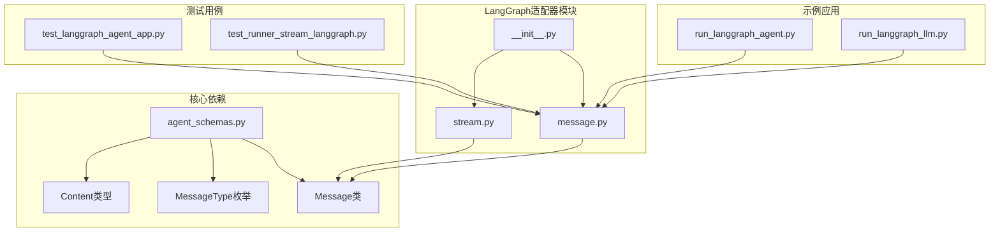
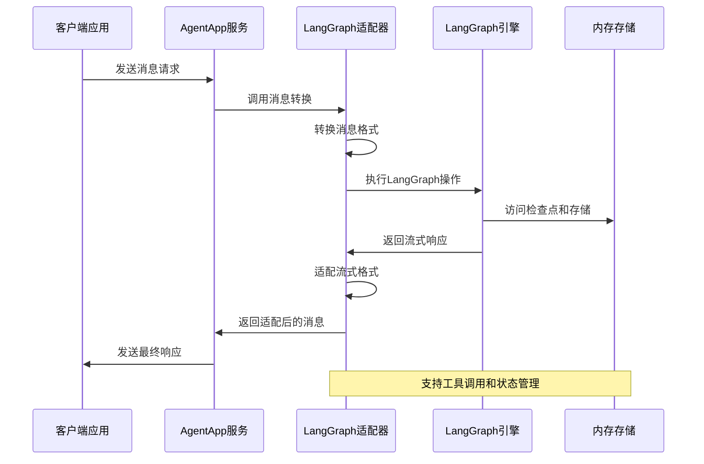
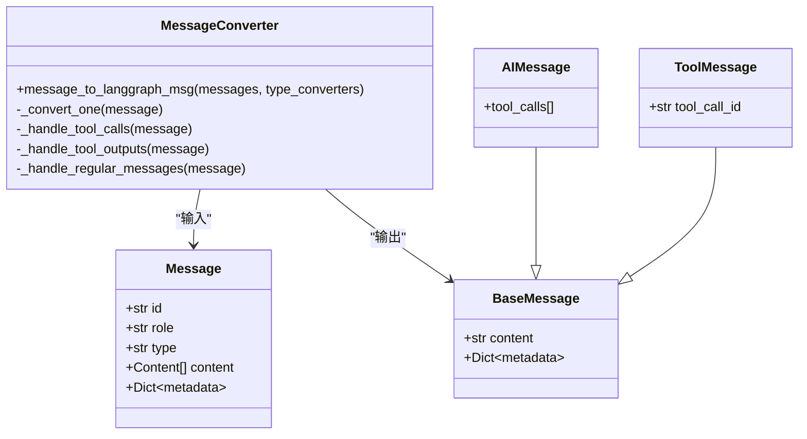
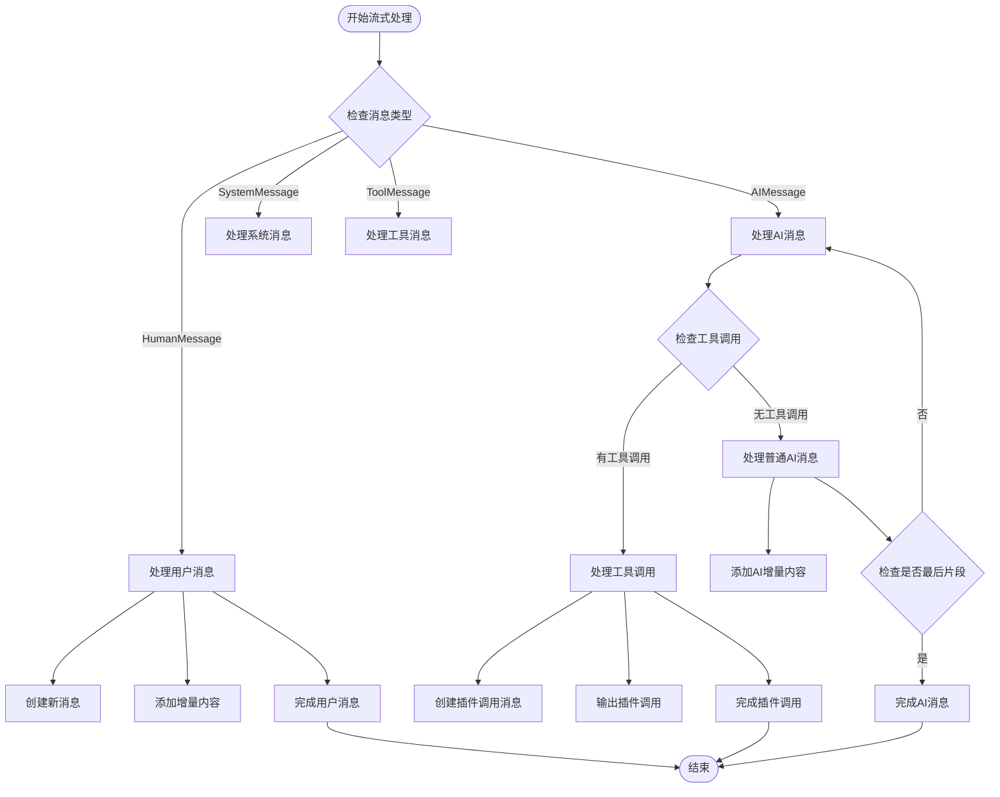
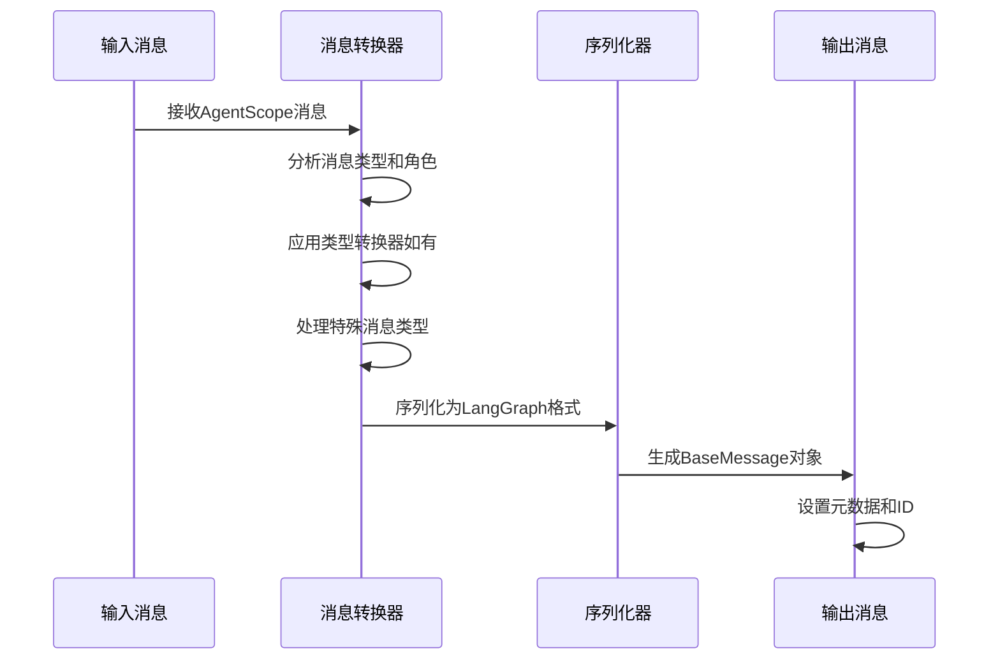
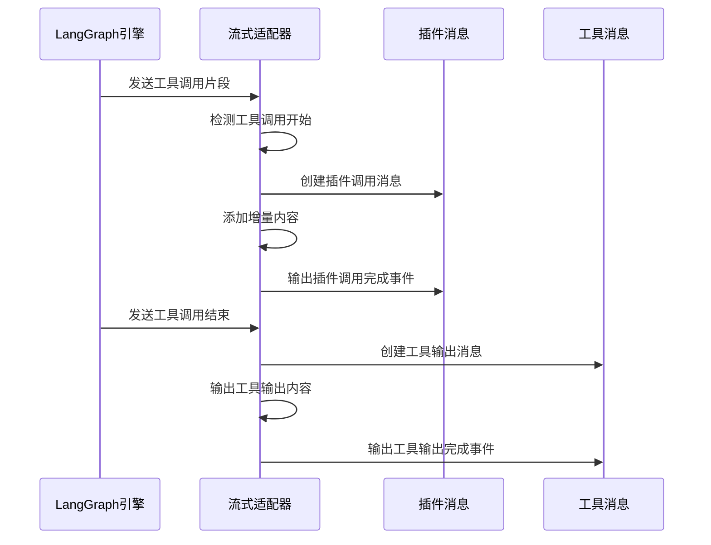
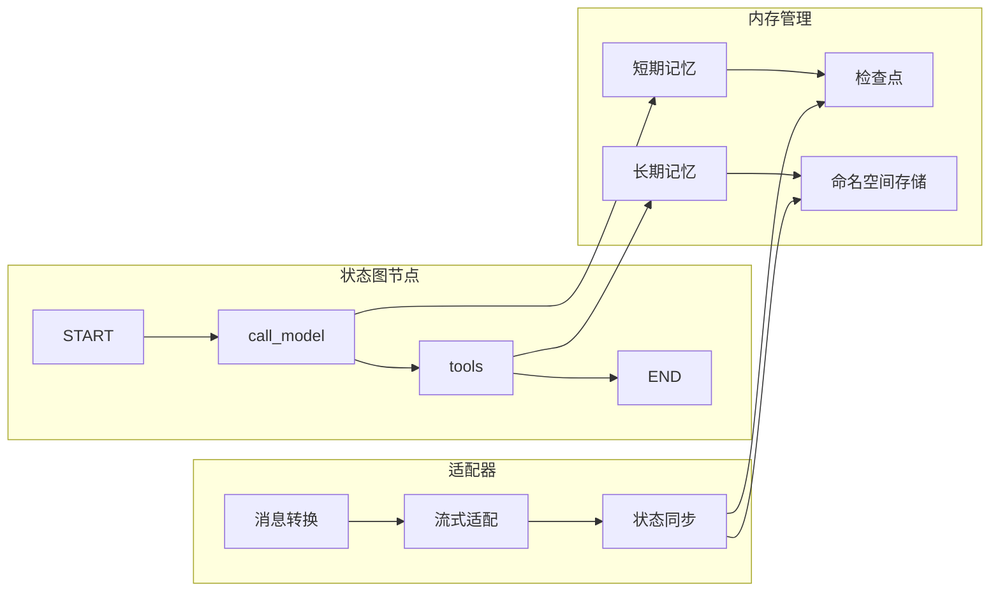

# LangGraph适配器

<cite>
**本文档引用的文件**
- [__init__.py](file://src/agentscope_runtime/adapters/langgraph/__init__.py)
- [message.py](file://src/agentscope_runtime/adapters/langgraph/message.py)
- [stream.py](file://src/agentscope_runtime/adapters/langgraph/stream.py)
- [agent_schemas.py](file://src/agentscope_runtime/engine/schemas/agent_schemas.py)
- [run_langgraph_agent.py](file://examples/integrations/langgraph/run_langgraph_agent.py)
- [run_langgraph_llm.py](file://examples/integrations/langgraph/run_langgraph_llm.py)
- [test_langgraph_agent_app.py](file://tests/integrated/test_langgraph_agent_app.py)
- [test_runner_stream_langgraph.py](file://tests/integrated/test_runner_stream_langgraph.py)
- [langgraph_guidelines.md](file://cookbook/zh/langgraph_guidelines.md)
</cite>

## 目录
1. [简介](#简介)
2. [项目结构](#项目结构)
3. [核心组件](#核心组件)
4. [架构概览](#架构概览)
5. [详细组件分析](#详细组件分析)
6. [消息格式转换](#消息格式转换)
7. [流式响应适配](#流式响应适配)
8. [状态管理集成](#状态管理集成)
9. [配置指南](#配置指南)
10. [最佳实践](#最佳实践)
11. [故障排除](#故障排除)
12. [结论](#结论)

## 简介

LangGraph适配器是AgentScope Runtime生态系统中的关键组件，负责在AgentScope消息格式与LangGraph消息格式之间进行双向转换。该适配器使得AgentScope智能体能够无缝集成到LangGraph工作流中，实现复杂的状态管理和工具调用功能。

该适配器主要解决以下核心问题：
- 将AgentScope的统一消息格式转换为LangGraph兼容的消息类型
- 支持流式响应的实时适配
- 处理工具调用和函数调用的特殊消息类型
- 维护消息状态和元数据的完整性

## 项目结构

LangGraph适配器位于`src/agentscope_runtime/adapters/langgraph/`目录下，包含以下核心文件：



**图表来源**
- [__init__.py:1-11](file://src/agentscope_runtime/adapters/langgraph/__init__.py#L1-L11)
- [message.py:1-163](file://src/agentscope_runtime/adapters/langgraph/message.py#L1-L163)
- [stream.py:1-257](file://src/agentscope_runtime/adapters/langgraph/stream.py#L1-L257)

**章节来源**
- [__init__.py:1-11](file://src/agentscope_runtime/adapters/langgraph/__init__.py#L1-L11)

## 核心组件

LangGraph适配器包含两个核心组件：

### 1. 消息转换器 (`message_to_langgraph_msg`)
负责将AgentScope的Message对象转换为LangGraph的BaseMessage对象，支持多种消息类型和角色映射。

### 2. 流式适配器 (`adapt_langgraph_message_stream`)
负责将LangGraph的流式消息转换为AgentScope的流式消息格式，支持增量内容和工具调用的实时处理。

**章节来源**
- [message.py:23-163](file://src/agentscope_runtime/adapters/langgraph/message.py#L23-L163)
- [stream.py:28-257](file://src/agentscope_runtime/adapters/langgraph/stream.py#L28-L257)

## 架构概览

LangGraph适配器采用分层架构设计，确保消息转换的准确性和效率：



**图表来源**
- [run_langgraph_agent.py:59-106](file://examples/integrations/langgraph/run_langgraph_agent.py#L59-L106)
- [stream.py:28-257](file://src/agentscope_runtime/adapters/langgraph/stream.py#L28-L257)

## 详细组件分析

### 消息转换器组件

消息转换器是适配器的核心，负责处理不同类型的消息转换需求：



**图表来源**
- [message.py:23-163](file://src/agentscope_runtime/adapters/langgraph/message.py#L23-L163)
- [agent_schemas.py:480-580](file://src/agentscope_runtime/engine/schemas/agent_schemas.py#L480-L580)

#### 角色映射机制

适配器实现了精确的角色映射，确保消息角色的一致性：

| AgentScope角色 | LangGraph消息类型 |
|---------------|-------------------|
| user | HumanMessage |
| assistant | AIMessage |
| system | SystemMessage |
| tool | ToolMessage |

#### 类型转换器接口

适配器支持自定义类型转换器，允许用户扩展特定的消息类型处理逻辑：

```python
type_converters = {
    "custom_type": lambda msg: custom_converter(msg),
    "special_type": lambda msg: special_converter(msg)
}
```

**章节来源**
- [message.py:42-135](file://src/agentscope_runtime/adapters/langgraph/message.py#L42-L135)

### 流式适配器组件

流式适配器负责处理LangGraph的流式响应，将其转换为AgentScope的流式消息格式：



**图表来源**
- [stream.py:28-257](file://src/agentscope_runtime/adapters/langgraph/stream.py#L28-L257)

**章节来源**
- [stream.py:28-257](file://src/agentscope_runtime/adapters/langgraph/stream.py#L28-L257)

## 消息格式转换

### 消息类型映射

适配器支持多种消息类型的转换，每种类型都有特定的处理逻辑：

#### 工具调用消息转换

当处理工具调用消息时，适配器会：
1. 解析工具调用参数
2. 创建相应的tool_calls结构
3. 设置工具调用ID
4. 生成AIMessage对象

#### 工具输出消息转换

工具输出消息的转换过程：
1. 提取工具调用ID
2. 解析输出内容（支持JSON解析）
3. 创建ToolMessage对象
4. 保持原始消息的元数据

#### 正常消息转换

对于普通文本消息：
1. 拼接所有内容部分
2. 处理不同内容类型的文本表示
3. 创建对应的角色消息类型

**章节来源**
- [message.py:61-135](file://src/agentscope_runtime/adapters/langgraph/message.py#L61-L135)

### 序列化和反序列化

适配器实现了完整的序列化机制：



**图表来源**
- [message.py:23-163](file://src/agentscope_runtime/adapters/langgraph/message.py#L23-L163)

**章节来源**
- [message.py:1-163](file://src/agentscope_runtime/adapters/langgraph/message.py#L1-L163)

## 流式响应适配

### 流式处理流程

流式适配器支持实时消息处理，具有以下特点：

#### 工具调用流式处理



**图表来源**
- [stream.py:64-143](file://src/agentscope_runtime/adapters/langgraph/stream.py#L64-L143)

#### 消息状态跟踪

适配器维护消息状态跟踪机制：
- 消息ID跟踪：确保每个消息的唯一性
- 内容索引管理：支持增量内容的正确拼接
- 完成状态检测：识别消息的最终状态

**章节来源**
- [stream.py:36-257](file://src/agentscope_runtime/adapters/langgraph/stream.py#L36-L257)

## 状态管理集成

### 内存管理

LangGraph适配器集成了两种类型的内存管理：

#### 短期记忆（检查点）

短期记忆用于保存对话历史和中间状态：
- 使用InMemorySaver进行内存存储
- 支持基于会话ID的状态隔离
- 实现持久化的检查点机制

#### 长期记忆（存储）

长期记忆用于持久化存储：
- 使用InMemoryStore进行内存存储
- 支持命名空间隔离
- 支持用户级别的数据组织

### 状态图集成

适配器支持完整的StateGraph集成：



**图表来源**
- [run_langgraph_agent.py:61-89](file://examples/integrations/langgraph/run_langgraph_agent.py#L61-L89)

**章节来源**
- [run_langgraph_agent.py:18-106](file://examples/integrations/langgraph/run_langgraph_agent.py#L18-L106)

## 配置指南

### 基本配置

要使用LangGraph适配器，需要进行以下基本配置：

#### 环境变量设置

```bash
# 必需：DashScope API密钥
export DASHSCOPE_API_KEY="your-dashscope-api-key"
```

#### 适配器初始化

```python
from agentscope_runtime.adapters.langgraph import message_to_langgraph_msg

# 基本使用
converted_messages = message_to_langgraph_msg(agent_messages)

# 自定义类型转换器
type_converters = {
    "custom_type": custom_converter_function
}
converted_messages = message_to_langgraph_msg(
    agent_messages, 
    type_converters
)
```

### 高级配置选项

#### 自定义消息处理器

```python
def custom_message_processor(message):
    """自定义消息处理逻辑"""
    # 实现自定义转换逻辑
    return custom_message

type_converters = {
    "special_type": custom_message_processor
}
```

#### 流式处理配置

```python
async def process_stream_with_config(source_stream, config):
    """配置流式处理"""
    # 设置流式处理参数
    async for chunk, meta_data in source_stream:
        # 处理流式片段
        yield chunk, meta_data
```

**章节来源**
- [langgraph_guidelines.md:329-347](file://cookbook/zh/langgraph_guidelines.md#L329-L347)

## 最佳实践

### 性能优化建议

1. **批量处理**：对多个消息进行批量转换以提高效率
2. **缓存策略**：缓存常用的类型转换器以减少重复计算
3. **内存管理**：及时清理不再使用的消息对象

### 错误处理策略

```python
def robust_message_conversion(messages, type_converters=None):
    """健壮的消息转换实现"""
    try:
        return message_to_langgraph_msg(messages, type_converters)
    except Exception as e:
        # 记录错误日志
        logger.error(f"消息转换失败: {e}")
        # 返回默认值或抛出自定义异常
        return []
```

### 并发处理

```python
import asyncio
from concurrent.futures import ThreadPoolExecutor

async def concurrent_message_processing(messages_list):
    """并发处理多个消息列表"""
    with ThreadPoolExecutor() as executor:
        loop = asyncio.get_event_loop()
        tasks = [
            loop.run_in_executor(executor, process_single_list, messages)
            for messages in messages_list
        ]
        results = await asyncio.gather(*tasks)
    return results
```

## 故障排除

### 常见问题及解决方案

#### 消息类型不匹配

**问题**：消息类型转换失败
**解决方案**：
1. 检查MessageType枚举的值
2. 验证消息类型转换器的配置
3. 确认消息格式的正确性

#### 流式处理中断

**问题**：流式响应在工具调用时中断
**解决方案**：
1. 检查工具调用的chunk_position属性
2. 确保工具调用片段的完整性
3. 验证流式适配器的状态跟踪逻辑

#### 内存泄漏

**问题**：长时间运行后内存使用增加
**解决方案**：
1. 定期清理消息对象
2. 检查异步任务的生命周期
3. 实现适当的垃圾回收机制

**章节来源**
- [test_langgraph_agent_app.py:142-281](file://tests/integrated/test_langgraph_agent_app.py#L142-L281)

## 结论

LangGraph适配器为AgentScope Runtime提供了强大的LangGraph集成能力。通过精心设计的消息转换机制和流式处理逻辑，该适配器实现了以下关键价值：

1. **无缝集成**：简化了AgentScope智能体与LangGraph工作流的集成过程
2. **灵活转换**：支持多种消息类型和自定义转换逻辑
3. **实时处理**：提供高效的流式响应适配
4. **状态管理**：集成完整的内存管理和状态同步机制

该适配器的设计充分考虑了性能、可扩展性和易用性，为构建复杂的智能体工作流奠定了坚实基础。随着AgentScope生态系统的不断发展，LangGraph适配器将继续演进以满足更多样化的集成需求。