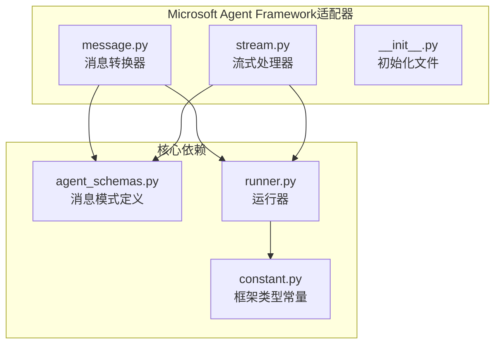
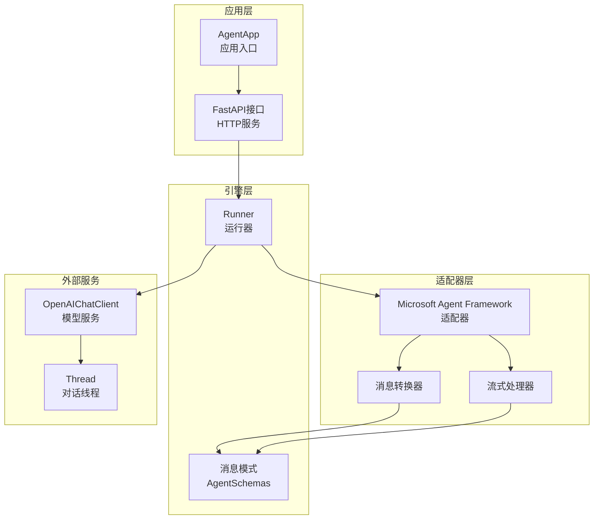
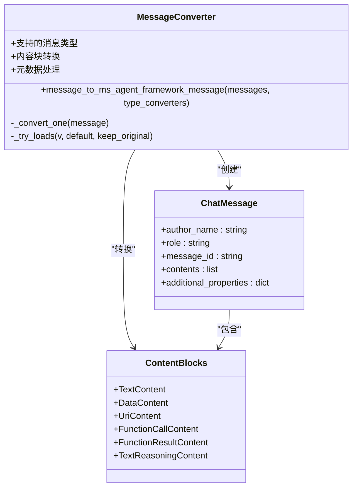
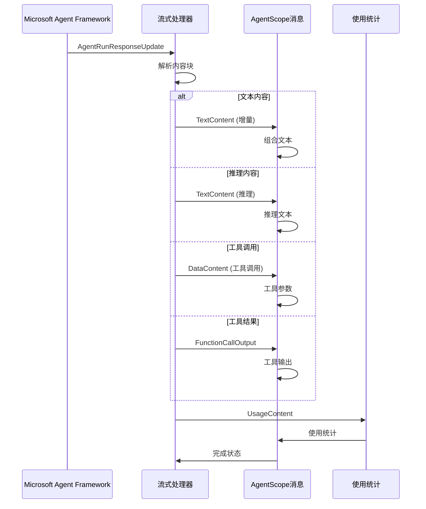
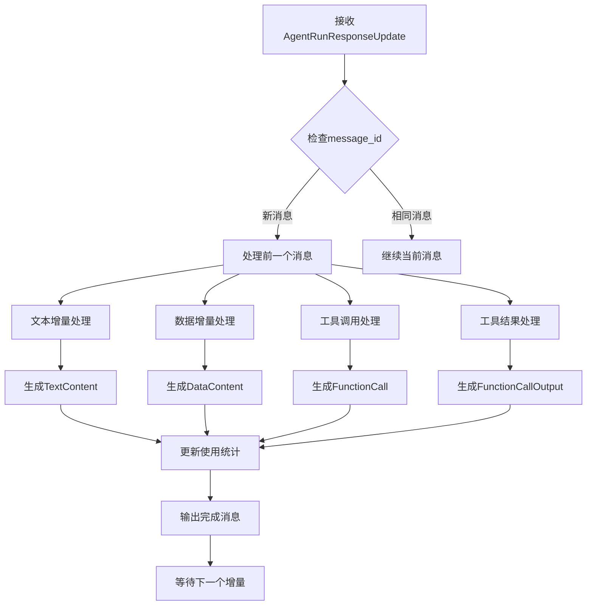
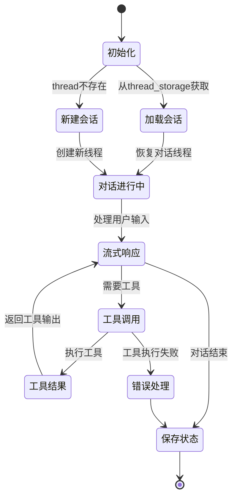
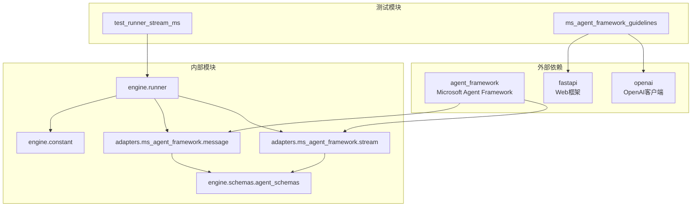

# Microsoft Agent Framework适配器

<cite>
**本文档引用的文件**
- [message.py](file://src/agentscope_runtime/adapters/ms_agent_framework/message.py)
- [stream.py](file://src/agentscope_runtime/adapters/ms_agent_framework/stream.py)
- [agent_schemas.py](file://src/agentscope_runtime/engine/schemas/agent_schemas.py)
- [runner.py](file://src/agentscope_runtime/engine/runner.py)
- [constant.py](file://src/agentscope_runtime/engine/constant.py)
- [ms_agent_framework_guidelines.md](file://cookbook/en/ms_agent_framework_guidelines.md)
- [test_runner_stream_ms.py](file://tests/integrated/test_runner_stream_ms.py)
</cite>

## 目录
1. [简介](#简介)
2. [项目结构](#项目结构)
3. [核心组件](#核心组件)
4. [架构概览](#架构概览)
5. [详细组件分析](#详细组件分析)
6. [依赖关系分析](#依赖关系分析)
7. [性能考虑](#性能考虑)
8. [故障排除指南](#故障排除指南)
9. [结论](#结论)
10. [附录](#附录)

## 简介

Microsoft Agent Framework适配器是AgentScope Runtime中用于集成Microsoft Agent Framework的核心组件。该适配器实现了从AgentScope消息格式到Microsoft Agent Framework消息格式的双向转换，支持流式响应处理、工具调用适配和会话状态管理。

该适配器的主要功能包括：
- 消息格式转换：将AgentScope的Message对象转换为Microsoft Agent Framework的ChatMessage对象
- 流式响应适配：处理Microsoft Agent Framework的流式输出并转换为AgentScope标准格式
- 工具调用支持：适配函数调用、MCP工具调用和推理内容
- 会话状态管理：维护对话历史和状态信息

## 项目结构

Microsoft Agent Framework适配器位于`src/agentscope_runtime/adapters/ms_agent_framework/`目录下，包含以下核心文件：



**图表来源**
- [message.py:1-216](file://src/agentscope_runtime/adapters/ms_agent_framework/message.py#L1-L216)
- [stream.py:1-420](file://src/agentscope_runtime/adapters/ms_agent_framework/stream.py#L1-L420)
- [runner.py:290-356](file://src/agentscope_runtime/engine/runner.py#L290-L356)

**章节来源**
- [message.py:1-216](file://src/agentscope_runtime/adapters/ms_agent_framework/message.py#L1-L216)
- [stream.py:1-420](file://src/agentscope_runtime/adapters/ms_agent_framework/stream.py#L1-L420)
- [runner.py:290-356](file://src/agentscope_runtime/engine/runner.py#L290-L356)

## 核心组件

Microsoft Agent Framework适配器包含两个核心组件：

### 1. 消息转换器 (message_to_ms_agent_framework_message)
负责将AgentScope的Message对象转换为Microsoft Agent Framework的ChatMessage对象，支持多种消息类型和内容块。

### 2. 流式处理器 (adapt_ms_agent_framework_message_stream)
处理Microsoft Agent Framework的流式输出，将其转换为AgentScope的标准消息格式，支持文本、推理、工具调用和数据内容的增量更新。

**章节来源**
- [message.py:23-216](file://src/agentscope_runtime/adapters/ms_agent_framework/message.py#L23-L216)
- [stream.py:36-420](file://src/agentscope_runtime/adapters/ms_agent_framework/stream.py#L36-L420)

## 架构概览

Microsoft Agent Framework适配器在整个系统中的位置如下：



**图表来源**
- [runner.py:290-356](file://src/agentscope_runtime/engine/runner.py#L290-L356)
- [constant.py:1-10](file://src/agentscope_runtime/engine/constant.py#L1-L10)
- [agent_schemas.py:480-734](file://src/agentscope_runtime/engine/schemas/agent_schemas.py#L480-L734)

## 详细组件分析

### 消息转换器组件分析

消息转换器负责将AgentScope的消息格式转换为Microsoft Agent Framework的格式：



**图表来源**
- [message.py:23-216](file://src/agentscope_runtime/adapters/ms_agent_framework/message.py#L23-L216)

#### 支持的消息类型转换

| AgentScope类型 | Microsoft Agent Framework类型 | 描述 |
|---------------|------------------------------|------|
| MessageType.MESSAGE | ChatMessage | 普通文本消息 |
| MessageType.FUNCTION_CALL | FunctionCallContent | 函数调用请求 |
| MessageType.FUNCTION_CALL_OUTPUT | FunctionResultContent | 函数调用结果 |
| MessageType.REASONING | TextReasoningContent | 推理过程 |
| MessageType.PLUGIN_CALL | FunctionCallContent | 插件调用 |
| MessageType.MCP_TOOL_CALL | FunctionCallContent | MCP工具调用 |

**章节来源**
- [message.py:23-216](file://src/agentscope_runtime/adapters/ms_agent_framework/message.py#L23-L216)
- [agent_schemas.py:18-36](file://src/agentscope_runtime/engine/schemas/agent_schemas.py#L18-L36)

### 流式处理器组件分析

流式处理器处理Microsoft Agent Framework的流式输出：



**图表来源**
- [stream.py:36-420](file://src/agentscope_runtime/adapters/ms_agent_framework/stream.py#L36-L420)

#### 流式处理流程



**图表来源**
- [stream.py:53-378](file://src/agentscope_runtime/adapters/ms_agent_framework/stream.py#L53-L378)

**章节来源**
- [stream.py:36-420](file://src/agentscope_runtime/adapters/ms_agent_framework/stream.py#L36-L420)

### 会话状态管理

适配器支持完整的会话状态管理：



**图表来源**
- [test_runner_stream_ms.py:31-77](file://tests/integrated/test_runner_stream_ms.py#L31-L77)

**章节来源**
- [test_runner_stream_ms.py:31-77](file://tests/integrated/test_runner_stream_ms.py#L31-L77)

## 依赖关系分析

Microsoft Agent Framework适配器的依赖关系如下：



**图表来源**
- [runner.py:295-301](file://src/agentscope_runtime/engine/runner.py#L295-L301)
- [constant.py:2-9](file://src/agentscope_runtime/engine/constant.py#L2-L9)

**章节来源**
- [runner.py:295-301](file://src/agentscope_runtime/engine/runner.py#L295-L301)
- [constant.py:2-9](file://src/agentscope_runtime/engine/constant.py#L2-L9)

## 性能考虑

Microsoft Agent Framework适配器在设计时考虑了以下性能因素：

### 1. 内存管理
- 使用深拷贝避免修改原始消息对象
- 及时清理增量内容缓冲区
- 合理的垃圾回收策略

### 2. 流式处理优化
- 增量内容合并减少内存占用
- 异步处理提高并发性能
- 按需生成消息避免不必要的计算

### 3. 缓存策略
- 会话状态缓存减少序列化开销
- 内容块缓存提高重复内容处理效率

## 故障排除指南

### 常见问题及解决方案

#### 1. 消息类型转换错误
**问题**: 不支持的消息类型转换
**解决方案**: 检查消息类型是否在支持列表中，或提供自定义转换器

#### 2. 流式处理中断
**问题**: 流式响应在工具调用时中断
**解决方案**: 确保工具调用的完整生命周期处理，包括调用开始和结束

#### 3. 会话状态丢失
**问题**: 对话历史无法恢复
**解决方案**: 检查thread_storage的正确配置和序列化/反序列化过程

#### 4. 内存泄漏
**问题**: 长时间运行后内存持续增长
**解决方案**: 确保及时清理增量内容和中间状态

**章节来源**
- [message.py:149-150](file://src/agentscope_runtime/adapters/ms_agent_framework/message.py#L149-L150)
- [stream.py:379-420](file://src/agentscope_runtime/adapters/ms_agent_framework/stream.py#L379-L420)

## 结论

Microsoft Agent Framework适配器为AgentScope Runtime提供了完整的Microsoft Agent Framework集成能力。通过精心设计的消息转换机制和流式处理流程，该适配器能够：

1. **无缝集成**: 支持多种消息类型和内容块的双向转换
2. **流式处理**: 提供高效的异步流式响应处理能力
3. **工具支持**: 完整支持函数调用、MCP工具调用和推理内容
4. **状态管理**: 提供可靠的会话状态管理和持久化机制

该适配器的设计充分考虑了性能和可扩展性，为构建复杂的AI代理应用提供了坚实的基础。

## 附录

### 配置选项

| 选项名称 | 类型 | 默认值 | 描述 |
|---------|------|--------|------|
| framework_type | string | "ms_agent_framework" | 框架类型标识 |
| type_converters | dict | None | 自定义类型转换器映射 |
| stream | bool | True | 是否启用流式响应 |
| session_id | string | None | 会话标识符 |
| user_id | string | None | 用户标识符 |

### 兼容性说明

- **Python版本**: 支持Python 3.8+
- **Microsoft Agent Framework版本**: 兼容最新版本
- **AgentScope Runtime版本**: 需要2.x及以上版本
- **依赖库**: agent_framework, fastapi, openai

### 实际集成示例

完整的集成示例如下所示：

```python
# 创建AgentApp实例
agent_app = AgentApp(
    app_name="Friday",
    app_description="A helpful assistant",
)

# 定义查询函数
@agent_app.query(framework="ms_agent_framework")
async def query_func(self, msgs, request: AgentRequest = None, **kwargs):
    # 获取会话状态
    session_id = request.session_id
    user_id = request.user_id
    id_key = f"{user_id}_{session_id}"
    thread = agent_app.state.thread_storage.get(id_key)
    
    # 创建Agent
    agent = OpenAIChatClient(
        model_id="qwen-plus",
        api_key=os.environ["DASHSCOPE_API_KEY"],
        base_url="https://dashscope.aliyuncs.com/compatible-mode/v1",
    ).create_agent(
        instructions="You're a helpful assistant named Friday",
        name="Friday",
    )
    
    # 处理会话
    async for event in agent.run_stream(msgs, thread=thread):
        yield event
    
    # 保存状态
    serialized_thread = await thread.serialize()
    agent_app.state.thread_storage[id_key] = serialized_thread
```

**章节来源**
- [ms_agent_framework_guidelines.md:46-101](file://cookbook/en/ms_agent_framework_guidelines.md#L46-L101)
- [test_runner_stream_ms.py:17-91](file://tests/integrated/test_runner_stream_ms.py#L17-L91)