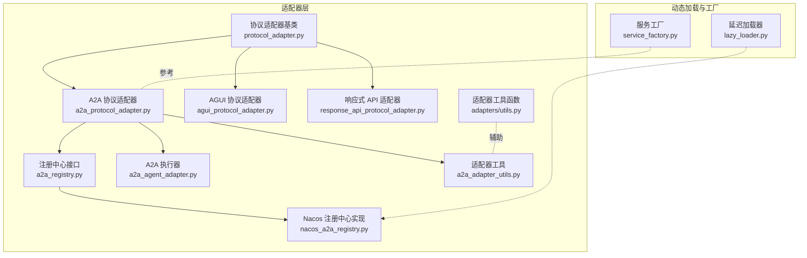
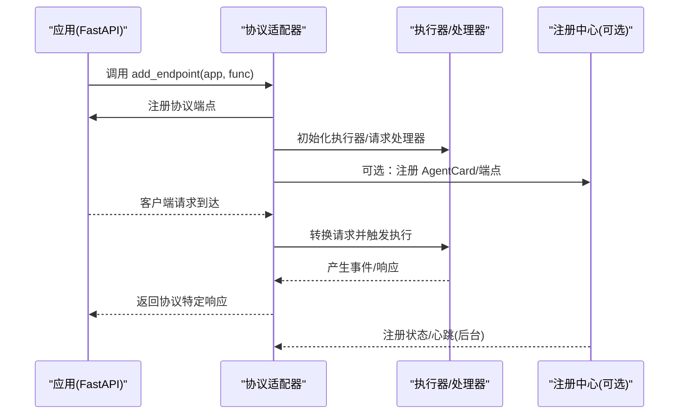
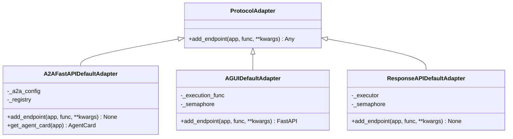
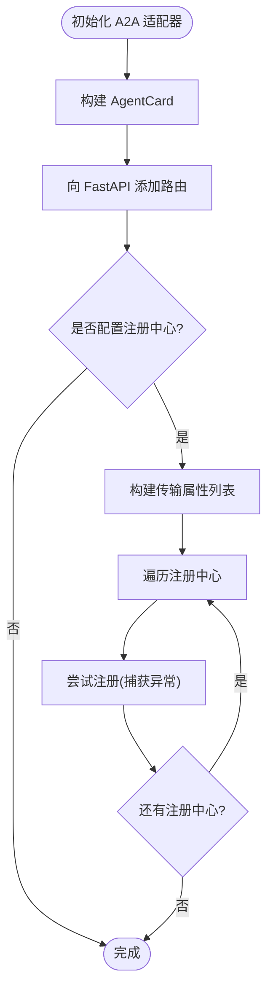
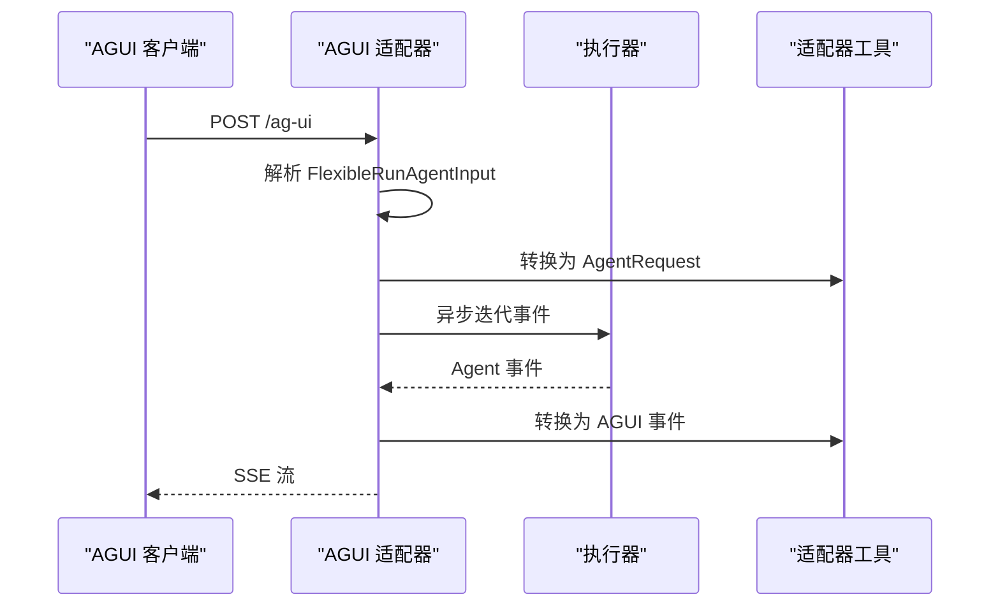
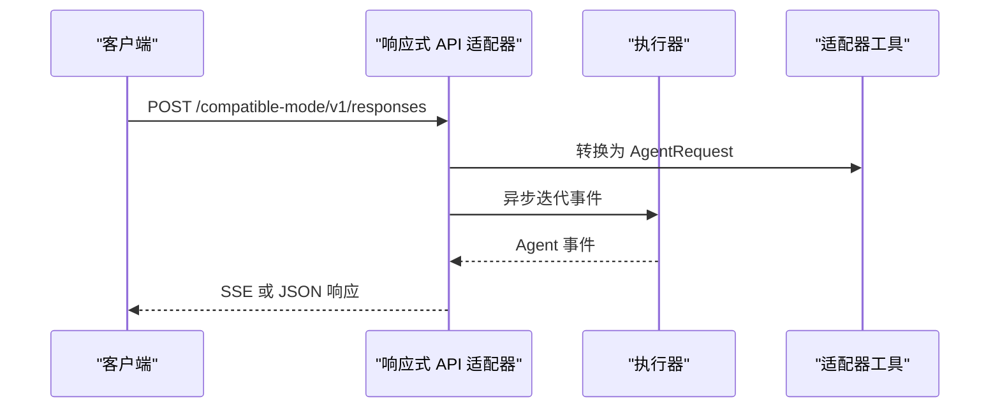
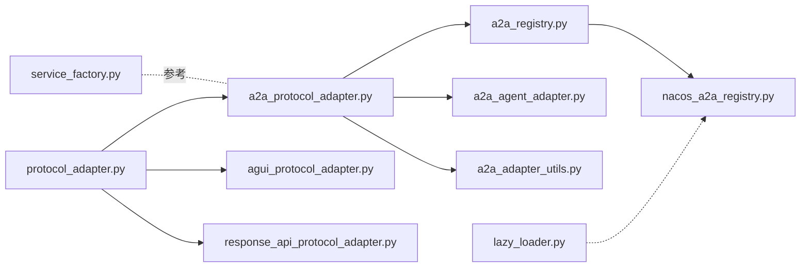

# 协议适配器架构

<cite>
**本文引用的文件**
- [协议适配器基类](file://src/agentscope_runtime/engine/deployers/adapter/protocol_adapter.py)
- [A2A 协议适配器](file://src/agentscope_runtime/engine/deployers/adapter/a2a/a2a_protocol_adapter.py)
- [A2A 注册中心接口](file://src/agentscope_runtime/engine/deployers/adapter/a2a/a2a_registry.py)
- [Nacos 注册中心实现](file://src/agentscope_runtime/engine/deployers/adapter/a2a/nacos_a2a_registry.py)
- [A2A 执行器](file://src/agentscope_runtime/engine/deployers/adapter/a2a/a2a_agent_adapter.py)
- [A2A 适配器工具](file://src/agentscope_runtime/engine/deployers/adapter/a2a/a2a_adapter_utils.py)
- [AGUI 协议适配器](file://src/agentscope_runtime/engine/deployers/adapter/agui/agui_protocol_adapter.py)
- [响应式 API 协议适配器](file://src/agentscope_runtime/engine/deployers/adapter/responses/response_api_protocol_adapter.py)
- [适配器模块入口](file://src/agentscope_runtime/engine/deployers/adapter/__init__.py)
- [延迟加载器](file://src/agentscope_runtime/common/utils/lazy_loader.py)
- [服务工厂](file://src/agentscope_runtime/engine/services/service_factory.py)
- [适配器工具函数](file://src/agentscope_runtime/adapters/utils.py)
- [单元测试：A2A 注册集成](file://tests/unit/test_agent_app_registry_integration.py)
- [A2A 注册中心使用说明（中文）](file://cookbook/zh/a2a_registry.md)
- [协议适配器概念说明（英文）](file://cookbook/en/protocol.md)
</cite>

## 目录
1. [简介](#简介)
2. [项目结构](#项目结构)
3. [核心组件](#核心组件)
4. [架构总览](#架构总览)
5. [组件详解](#组件详解)
6. [依赖关系分析](#依赖关系分析)
7. [性能考量](#性能考量)
8. [故障排查指南](#故障排查指南)
9. [结论](#结论)
10. [附录](#附录)

## 简介
本文件系统化阐述协议适配器架构的设计理念、实现模式与扩展机制，覆盖以下主题：
- 适配器接口定义与职责边界
- 工厂模式与动态加载机制
- 适配器注册与发现流程（含优先级、冲突与版本兼容策略）
- 自定义适配器开发指南（接口实现、测试与集成验证）
- 架构图与扩展点说明

该架构以“协议无关、接口统一”为核心思想，通过抽象适配器基类与具体协议实现解耦，支持多协议并存、平滑转换与可插拔扩展。

## 项目结构
适配器相关代码主要位于引擎部署层的适配器子模块中，按协议维度组织，同时提供通用工具与动态加载能力：
- 协议适配器基类：统一 add_endpoint 约定
- 具体协议适配器：A2A、AGUI、响应式 API
- 注册中心：抽象接口与 Nacos 实现
- 工具与适配器：消息与内容类型转换、执行器封装
- 动态加载：延迟导入避免非必要依赖
- 服务工厂：通用工厂模式示例（可借鉴到适配器注册）

**图表来源**
- [协议适配器基类:6-25](file://src/agentscope_runtime/engine/deployers/adapter/protocol_adapter.py#L6-L25)
- [A2A 协议适配器:136-498](file://src/agentscope_runtime/engine/deployers/adapter/a2a/a2a_protocol_adapter.py#L136-L498)
- [A2A 注册中心接口:45-77](file://src/agentscope_runtime/engine/deployers/adapter/a2a/a2a_registry.py#L45-L77)
- [Nacos 注册中心实现:221-768](file://src/agentscope_runtime/engine/deployers/adapter/a2a/nacos_a2a_registry.py#L221-L768)
- [A2A 执行器:23-70](file://src/agentscope_runtime/engine/deployers/adapter/a2a/a2a_agent_adapter.py#L23-L70)
- [A2A 适配器工具:35-405](file://src/agentscope_runtime/engine/deployers/adapter/a2a/a2a_adapter_utils.py#L35-L405)
- [延迟加载器:5-58](file://src/agentscope_runtime/common/utils/lazy_loader.py#L5-L58)
- [服务工厂:13-120](file://src/agentscope_runtime/engine/services/service_factory.py#L13-L120)

**章节来源**
- [适配器模块入口:1-11](file://src/agentscope_runtime/engine/deployers/adapter/__init__.py#L1-L11)
- [协议适配器基类:6-25](file://src/agentscope_runtime/engine/deployers/adapter/protocol_adapter.py#L6-L25)

## 核心组件
- 协议适配器基类：定义 add_endpoint 抽象方法，约束所有协议适配器的路由挂载行为
- A2A 协议适配器：基于 FastAPI 提供 A2A 协议端点、任务管理与服务卡片生成；支持多注册中心
- 注册中心接口与 Nacos 实现：抽象注册流程，Nacos 实现负责异步注册、状态跟踪与清理
- AGUI 响应式适配器：将内部事件流转换为 AGUI SSE 事件
- 响应式 API 适配器：将 OpenAI Response API 请求映射为内部 Agent 请求
- 适配器工具：消息/内容/任务状态等类型转换
- 动态加载：延迟导入避免强制依赖，按需安装扩展包

**章节来源**
- [协议适配器基类:6-25](file://src/agentscope_runtime/engine/deployers/adapter/protocol_adapter.py#L6-L25)
- [A2A 协议适配器:136-498](file://src/agentscope_runtime/engine/deployers/adapter/a2a/a2a_protocol_adapter.py#L136-L498)
- [A2A 注册中心接口:45-77](file://src/agentscope_runtime/engine/deployers/adapter/a2a/a2a_registry.py#L45-L77)
- [Nacos 注册中心实现:221-768](file://src/agentscope_runtime/engine/deployers/adapter/a2a/nacos_a2a_registry.py#L221-L768)
- [AGUI 协议适配器:91-226](file://src/agentscope_runtime/engine/deployers/adapter/agui/agui_protocol_adapter.py#L91-L226)
- [响应式 API 协议适配器:33-315](file://src/agentscope_runtime/engine/deployers/adapter/responses/response_api_protocol_adapter.py#L33-L315)
- [A2A 适配器工具:35-405](file://src/agentscope_runtime/engine/deployers/adapter/a2a/a2a_adapter_utils.py#L35-L405)
- [延迟加载器:5-58](file://src/agentscope_runtime/common/utils/lazy_loader.py#L5-L58)

## 架构总览
下图展示适配器系统在运行时的整体交互：应用通过协议适配器向 FastAPI 注册端点，A2A 适配器在启动时构建 AgentCard 并可选地注册到多个注册中心；AGUI 与响应式 API 适配器分别处理 SSE 与 OpenAI 兼容请求。

**图表来源**
- [A2A 协议适配器:222-331](file://src/agentscope_runtime/engine/deployers/adapter/a2a/a2a_protocol_adapter.py#L222-L331)
- [AGUI 协议适配器:212-226](file://src/agentscope_runtime/engine/deployers/adapter/agui/agui_protocol_adapter.py#L212-L226)
- [响应式 API 协议适配器:285-315](file://src/agentscope_runtime/engine/deployers/adapter/responses/response_api_protocol_adapter.py#L285-L315)
- [A2A 执行器:23-70](file://src/agentscope_runtime/engine/deployers/adapter/a2a/a2a_agent_adapter.py#L23-L70)
- [Nacos 注册中心实现:256-573](file://src/agentscope_runtime/engine/deployers/adapter/a2a/nacos_a2a_registry.py#L256-L573)

## 组件详解

### 协议适配器基类与工厂模式
- 基类职责：定义 add_endpoint 抽象方法，确保各协议适配器遵循一致的端点挂载约定
- 工厂模式参考：服务工厂展示了环境变量驱动、参数合并与构造函数签名过滤的通用做法，可借鉴到适配器注册与实例化流程中

**图表来源**
- [协议适配器基类:6-25](file://src/agentscope_runtime/engine/deployers/adapter/protocol_adapter.py#L6-L25)
- [A2A 协议适配器:136-498](file://src/agentscope_runtime/engine/deployers/adapter/a2a/a2a_protocol_adapter.py#L136-L498)
- [AGUI 协议适配器:91-226](file://src/agentscope_runtime/engine/deployers/adapter/agui/agui_protocol_adapter.py#L91-L226)
- [响应式 API 协议适配器:33-315](file://src/agentscope_runtime/engine/deployers/adapter/responses/response_api_protocol_adapter.py#L33-L315)

**章节来源**
- [协议适配器基类:6-25](file://src/agentscope_runtime/engine/deployers/adapter/protocol_adapter.py#L6-L25)
- [服务工厂:13-120](file://src/agentscope_runtime/engine/services/service_factory.py#L13-L120)

### A2A 协议适配器与注册中心
- AgentCard 构建：从配置对象提取字段，自动补全 URL、版本、技能与能力信息
- 多注册中心支持：可配置一个或多个注册中心实例，失败不阻塞启动
- Nacos 注册：两阶段发布（卡片与端点），异步后台注册，支持状态查询与清理
- 动态加载：Nacos 实现按需延迟导入，避免强制依赖

**图表来源**
- [A2A 协议适配器:222-331](file://src/agentscope_runtime/engine/deployers/adapter/a2a/a2a_protocol_adapter.py#L222-L331)
- [A2A 注册中心接口:45-77](file://src/agentscope_runtime/engine/deployers/adapter/a2a/a2a_registry.py#L45-L77)
- [Nacos 注册中心实现:256-573](file://src/agentscope_runtime/engine/deployers/adapter/a2a/nacos_a2a_registry.py#L256-L573)

**章节来源**
- [A2A 协议适配器:136-498](file://src/agentscope_runtime/engine/deployers/adapter/a2a/a2a_protocol_adapter.py#L136-L498)
- [A2A 注册中心接口:45-77](file://src/agentscope_runtime/engine/deployers/adapter/a2a/a2a_registry.py#L45-L77)
- [Nacos 注册中心实现:221-768](file://src/agentscope_runtime/engine/deployers/adapter/a2a/nacos_a2a_registry.py#L221-L768)
- [A2A 执行器:23-70](file://src/agentscope_runtime/engine/deployers/adapter/a2a/a2a_agent_adapter.py#L23-L70)

### AGUI 协议适配器
- 将 AGUI 请求转换为内部 AgentRequest，逐事件转换为 AGUI SSE 事件
- 使用信号量控制并发，保证稳定性
- 支持灵活输入模型，兼容多种字段命名风格

**图表来源**
- [AGUI 协议适配器:108-226](file://src/agentscope_runtime/engine/deployers/adapter/agui/agui_protocol_adapter.py#L108-L226)
- [A2A 适配器工具:35-405](file://src/agentscope_runtime/engine/deployers/adapter/a2a/a2a_adapter_utils.py#L35-L405)

**章节来源**
- [AGUI 协议适配器:91-226](file://src/agentscope_runtime/engine/deployers/adapter/agui/agui_protocol_adapter.py#L91-L226)

### 响应式 API 协议适配器
- 兼容 OpenAI Response API 的请求格式，支持流式与非流式响应
- 内部事件转为 SSE 事件类型，带超时控制与错误事件封装

**图表来源**
- [响应式 API 协议适配器:44-315](file://src/agentscope_runtime/engine/deployers/adapter/responses/response_api_protocol_adapter.py#L44-L315)

**章节来源**
- [响应式 API 协议适配器:33-315](file://src/agentscope_runtime/engine/deployers/adapter/responses/response_api_protocol_adapter.py#L33-L315)

## 依赖关系分析
- 模块内聚与耦合
  - 协议适配器基类提供统一接口，降低上层对具体协议的耦合
  - A2A 适配器与注册中心通过抽象接口解耦，便于替换实现
  - 工具模块独立于协议实现，便于复用
- 外部依赖与动态加载
  - Nacos 注册中心采用延迟导入，避免强制依赖
  - 适配器模块入口使用延迟加载器，仅在访问时解析真实模块
- 循环依赖规避
  - 注册中心导入放在函数作用域内，避免模块级循环依赖

**图表来源**
- [协议适配器基类:6-25](file://src/agentscope_runtime/engine/deployers/adapter/protocol_adapter.py#L6-L25)
- [A2A 协议适配器:136-498](file://src/agentscope_runtime/engine/deployers/adapter/a2a/a2a_protocol_adapter.py#L136-L498)
- [A2A 注册中心接口:45-77](file://src/agentscope_runtime/engine/deployers/adapter/a2a/a2a_registry.py#L45-L77)
- [Nacos 注册中心实现:221-768](file://src/agentscope_runtime/engine/deployers/adapter/a2a/nacos_a2a_registry.py#L221-L768)
- [A2A 执行器:23-70](file://src/agentscope_runtime/engine/deployers/adapter/a2a/a2a_agent_adapter.py#L23-L70)
- [A2A 适配器工具:35-405](file://src/agentscope_runtime/engine/deployers/adapter/a2a/a2a_adapter_utils.py#L35-L405)
- [延迟加载器:5-58](file://src/agentscope_runtime/common/utils/lazy_loader.py#L5-L58)
- [服务工厂:13-120](file://src/agentscope_runtime/engine/services/service_factory.py#L13-L120)

**章节来源**
- [适配器模块入口:1-11](file://src/agentscope_runtime/engine/deployers/adapter/__init__.py#L1-L11)
- [延迟加载器:5-58](file://src/agentscope_runtime/common/utils/lazy_loader.py#L5-L58)

## 性能考量
- 并发控制
  - AGUI 与响应式 API 适配器均使用信号量限制并发请求数，防止资源耗尽
- 异步注册与后台线程
  - Nacos 注册在后台任务或线程中执行，避免阻塞主流程；支持等待完成或取消
- 超时与错误隔离
  - 响应式 API 适配器对流式响应设置超时，异常时返回标准化错误事件
- 类型转换开销
  - 适配器工具集中进行消息/内容/状态映射，建议在高频路径保持轻量与可缓存

[本节为通用性能讨论，无需列出具体文件来源]

## 故障排查指南
- 注册中心不可用
  - 现象：Nacos SDK 缺失导致导入失败
  - 处理：按提示安装依赖；或移除注册中心配置
  - 参考：[Nacos 注册中心实现:44-48](file://src/agentscope_runtime/engine/deployers/adapter/a2a/nacos_a2a_registry.py#L44-L48)
- 注册失败但不影响启动
  - 现象：注册异常被记录但不会阻止应用启动
  - 处理：检查日志与网络连通性；必要时重试或降级
  - 参考：[A2A 协议适配器:276-298](file://src/agentscope_runtime/engine/deployers/adapter/a2a/a2a_protocol_adapter.py#L276-L298)
- 并发过高导致拒绝
  - 现象：请求被限流或超时
  - 处理：调整信号量大小与超时阈值
  - 参考：[AGUI 协议适配器:102-106](file://src/agentscope_runtime/engine/deployers/adapter/agui/agui_protocol_adapter.py#L102-L106)、[响应式 API 协议适配器:34-43](file://src/agentscope_runtime/engine/deployers/adapter/responses/response_api_protocol_adapter.py#L34-L43)
- 类型转换异常
  - 现象：未知内容/部件类型导致转换失败
  - 处理：扩展适配器工具中的映射逻辑
  - 参考：[A2A 适配器工具:55-80](file://src/agentscope_runtime/engine/deployers/adapter/a2a/a2a_adapter_utils.py#L55-L80)

**章节来源**
- [Nacos 注册中心实现:44-48](file://src/agentscope_runtime/engine/deployers/adapter/a2a/nacos_a2a_registry.py#L44-L48)
- [A2A 协议适配器:276-298](file://src/agentscope_runtime/engine/deployers/adapter/a2a/a2a_protocol_adapter.py#L276-L298)
- [AGUI 协议适配器:102-106](file://src/agentscope_runtime/engine/deployers/adapter/agui/agui_protocol_adapter.py#L102-L106)
- [响应式 API 协议适配器:34-43](file://src/agentscope_runtime/engine/deployers/adapter/responses/response_api_protocol_adapter.py#L34-L43)
- [A2A 适配器工具:55-80](file://src/agentscope_runtime/engine/deployers/adapter/a2a/a2a_adapter_utils.py#L55-L80)

## 结论
该协议适配器架构以抽象接口与工厂模式为基础，结合动态加载与多注册中心支持，实现了协议无关、可扩展、可维护的运行时适配体系。通过清晰的职责划分与稳健的错误隔离策略，能够在复杂环境中稳定运行并支持未来协议演进。

[本节为总结性内容，无需列出具体文件来源]

## 附录

### 适配器注册与发现机制
- 注册中心优先级
  - 配置为列表时，按顺序依次注册；失败不中断后续注册
- 冲突解决
  - 同名 AgentCard 在注册中心侧由服务发现系统处理；建议为不同实例配置唯一标识
- 版本兼容
  - AgentCard 中的协议版本与能力字段由运行时控制，用户提供的值会被忽略以确保一致性

**章节来源**
- [A2A 协议适配器:198-221](file://src/agentscope_runtime/engine/deployers/adapter/a2a/a2a_protocol_adapter.py#L198-L221)
- [A2A 注册中心接口:45-77](file://src/agentscope_runtime/engine/deployers/adapter/a2a/a2a_registry.py#L45-L77)
- [Nacos 注册中心实现:256-573](file://src/agentscope_runtime/engine/deployers/adapter/a2a/nacos_a2a_registry.py#L256-L573)

### 自定义适配器开发指南
- 接口实现
  - 继承协议适配器基类，实现 add_endpoint 方法
  - 在方法中完成端点挂载与请求处理器初始化
- 测试方法
  - 参考现有适配器的并发与错误处理测试思路
  - 使用最小化依赖的单元测试验证端点注册与事件流转
- 集成验证
  - 通过本地启动 FastAPI 应用，调用新增端点验证协议转换与响应格式
  - 集成注册中心时，验证卡片发布与端点注册状态

**章节来源**
- [协议适配器基类:6-25](file://src/agentscope_runtime/engine/deployers/adapter/protocol_adapter.py#L6-L25)
- [适配器模块入口:1-11](file://src/agentscope_runtime/engine/deployers/adapter/__init__.py#L1-L11)
- [单元测试：A2A 注册集成:82-116](file://tests/unit/test_agent_app_registry_integration.py#L82-L116)

### 扩展点说明
- 新增协议适配器
  - 在适配器目录下创建新模块，实现 add_endpoint 与必要的请求/响应转换
  - 在适配器模块入口导出新适配器类
- 注册中心扩展
  - 实现注册中心抽象接口，提供 registry_name 与 register 方法
  - 如有外部依赖，采用延迟导入策略
- 工具函数增强
  - 在适配器工具模块中扩展类型映射与转换逻辑，保持幂等与可测试性

**章节来源**
- [适配器模块入口:1-11](file://src/agentscope_runtime/engine/deployers/adapter/__init__.py#L1-L11)
- [A2A 注册中心接口:45-77](file://src/agentscope_runtime/engine/deployers/adapter/a2a/a2a_registry.py#L45-L77)
- [A2A 适配器工具:35-405](file://src/agentscope_runtime/engine/deployers/adapter/a2a/a2a_adapter_utils.py#L35-L405)
- [延迟加载器:5-58](file://src/agentscope_runtime/common/utils/lazy_loader.py#L5-L58)