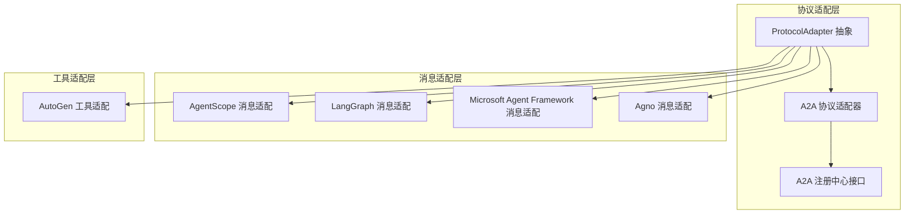
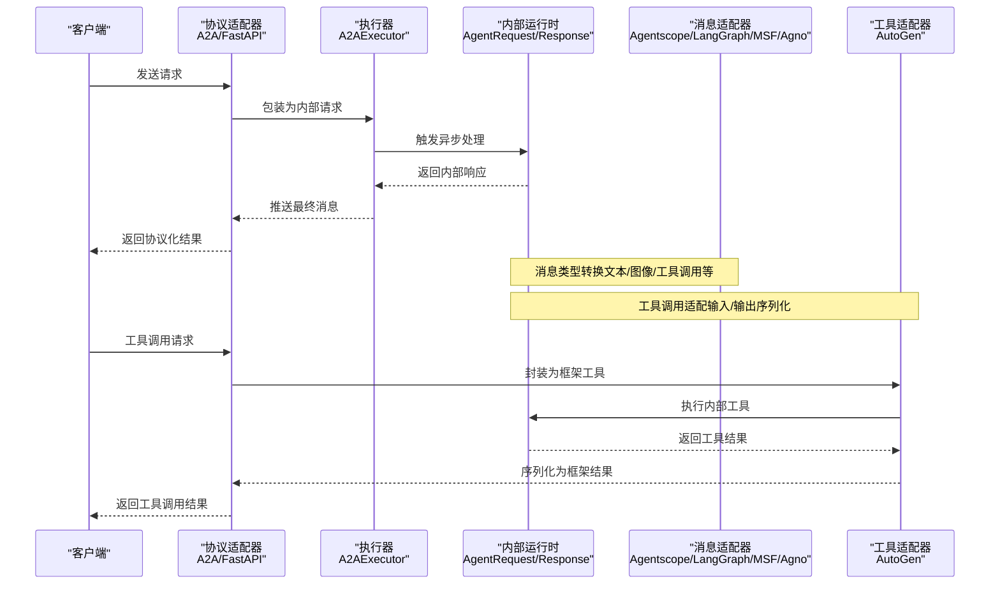
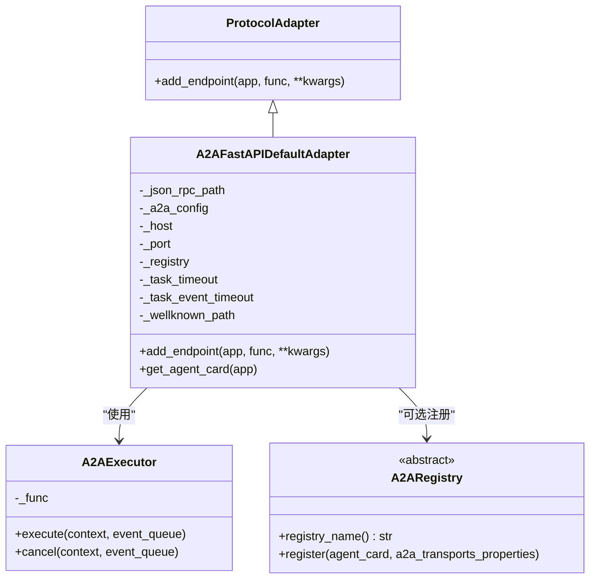
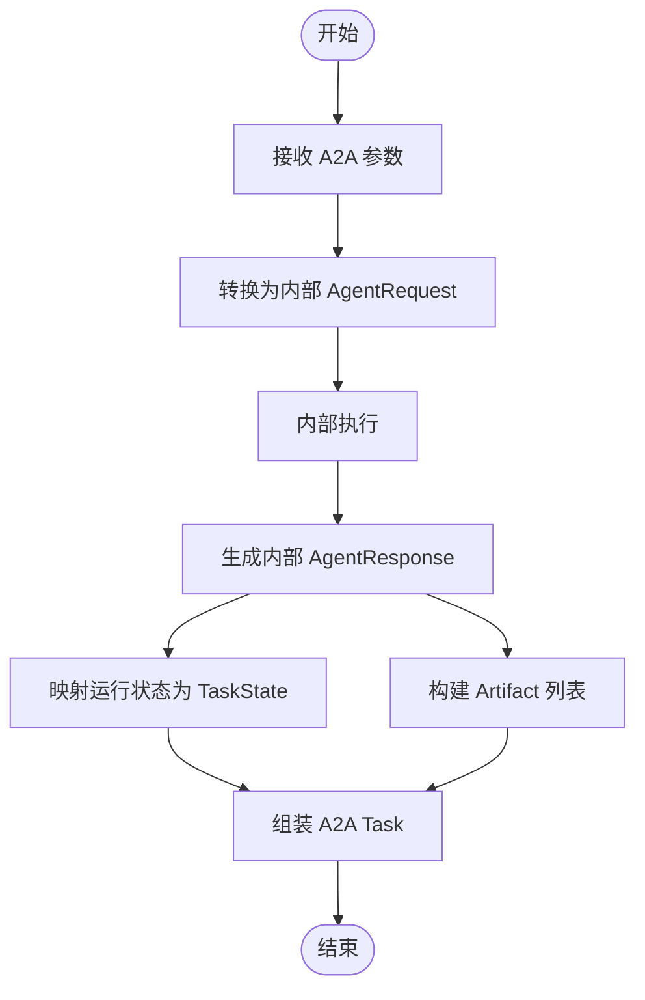
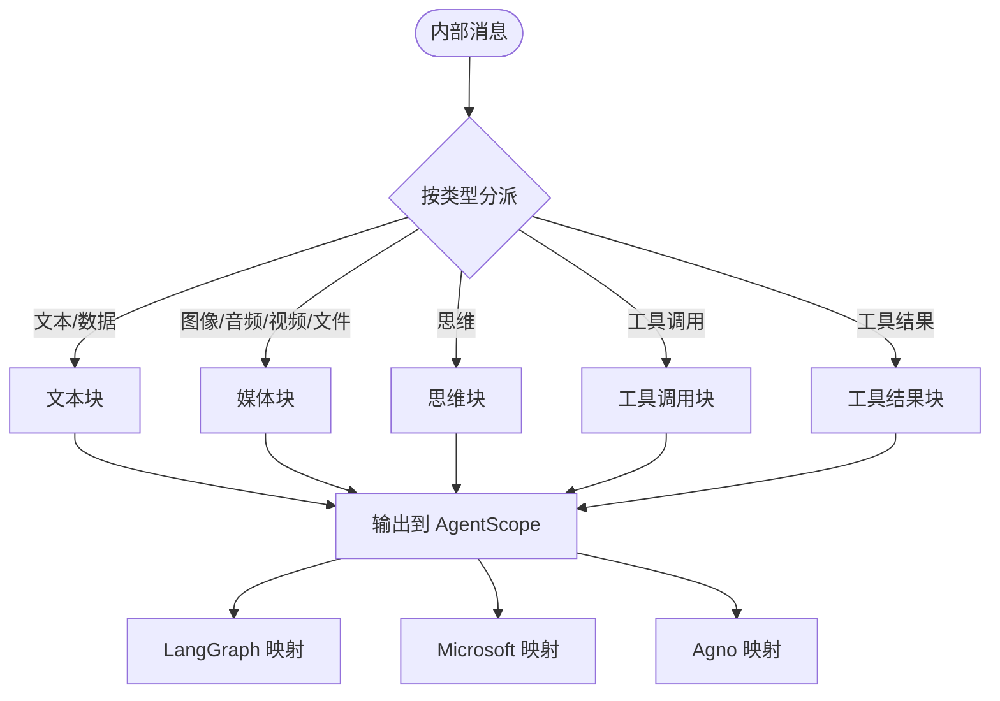
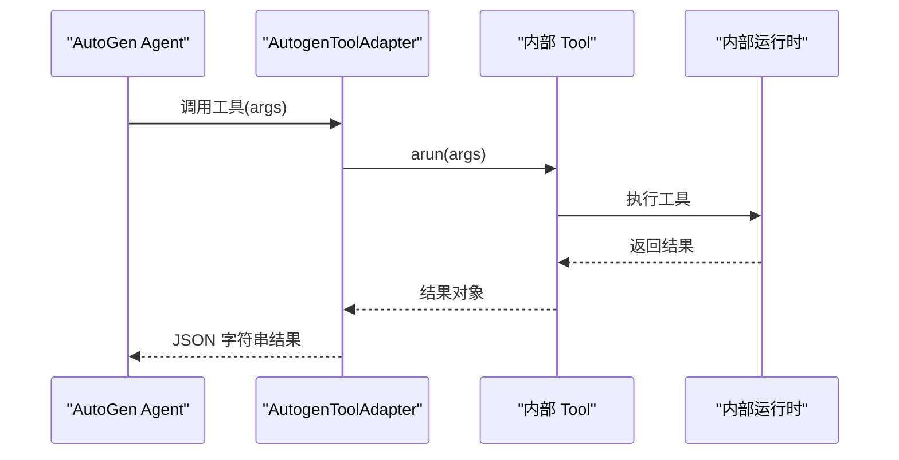
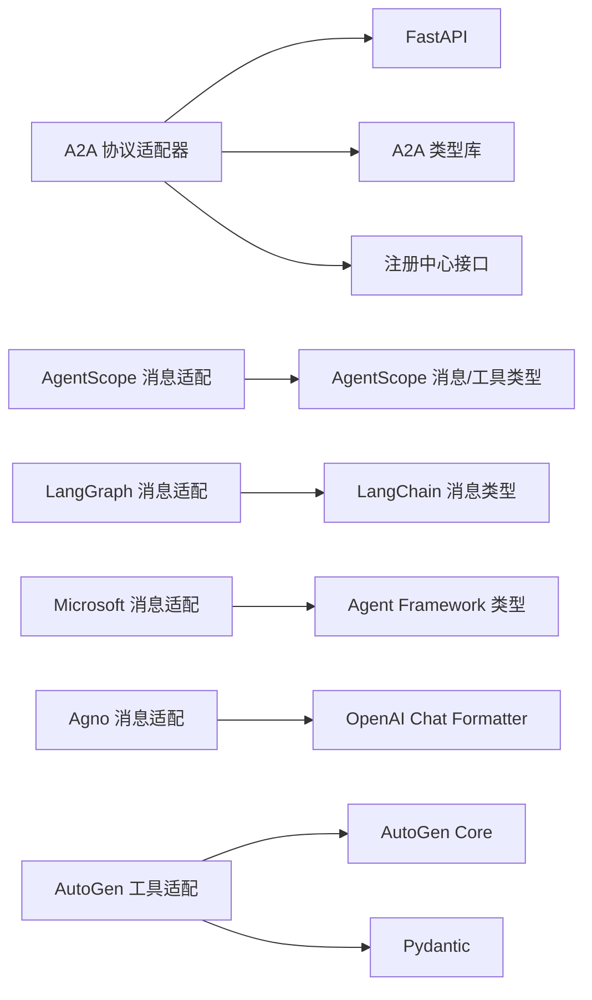

# 框架无关性

<cite>
**本文引用的文件**
- [a2a_adapter_utils.py](file://src/agentscope_runtime/engine/deployers/adapter/a2a/a2a_adapter_utils.py)
- [a2a_agent_adapter.py](file://src/agentscope_runtime/engine/deployers/adapter/a2a/a2a_agent_adapter.py)
- [a2a_protocol_adapter.py](file://src/agentscope_runtime/engine/deployers/adapter/a2a/a2a_protocol_adapter.py)
- [a2a_registry.py](file://src/agentscope_runtime/engine/deployers/adapter/a2a/a2a_registry.py)
- [protocol_adapter.py](file://src/agentscope_runtime/engine/deployers/adapter/protocol_adapter.py)
- [agentscope_message.py](file://src/agentscope_runtime/adapters/agentscope/message.py)
- [langgraph_message.py](file://src/agentscope_runtime/adapters/langgraph/message.py)
- [ms_agent_framework_message.py](file://src/agentscope_runtime/adapters/ms_agent_framework/message.py)
- [agno_message.py](file://src/agentscope_runtime/adapters/agno/message.py)
- [autogen_tool.py](file://src/agentscope_runtime/adapters/autogen/tool/tool.py)
- [test_a2a_protocol_adapter.py](file://tests/unit/test_a2a_protocol_adapter.py)
- [test_agentscope_tool_adapter.py](file://tests/tools/test_agentscope_tool_adapter.py)
- [test_autogen_tool_adapter.py](file://tests/tools/test_autogen_tool_adapter.py)
- [protocol.md（英文）](file://cookbook/en/protocol.md)
- [protocol.md（中文）](file://cookbook/zh/protocol.md)
</cite>

## 目录
1. [引言](#引言)
2. [项目结构](#项目结构)
3. [核心组件](#核心组件)
4. [架构总览](#架构总览)
5. [详细组件分析](#详细组件分析)
6. [依赖分析](#依赖分析)
7. [性能考虑](#性能考虑)
8. [故障排查指南](#故障排查指南)
9. [结论](#结论)
10. [附录](#附录)

## 引言
本文件聚焦于 AgentScope Runtime 的“框架无关性”能力，系统阐述协议适配器与消息/工具适配层的设计理念、实现机制与扩展方法。通过统一的内部消息模型与协议抽象，Runtime 能够在不改变核心逻辑的前提下，对接多种外部框架与协议，包括但不限于 AgentScope 适配器、LangGraph 适配器、Microsoft Agent Framework 适配器、Agno 适配器以及 AutoGen 适配器。本文将从架构设计、数据流、工具调用适配、开发指南与最佳实践等维度，帮助读者快速理解并高效扩展。

## 项目结构
围绕“框架无关性”，代码主要分布在以下区域：
- 协议适配层：以协议抽象为基础，提供统一的端点注册与服务卡片生成能力
- 消息适配层：将内部消息模型转换为各框架的消息类型
- 工具适配层：将内部工具封装为各框架可用的工具接口
- 测试与示例：验证适配器行为与工具适配正确性

图表来源
- [protocol_adapter.py:6-25](file://src/agentscope_runtime/engine/deployers/adapter/protocol_adapter.py#L6-L25)
- [a2a_protocol_adapter.py:136-498](file://src/agentscope_runtime/engine/deployers/adapter/a2a/a2a_protocol_adapter.py#L136-L498)
- [a2a_registry.py:45-77](file://src/agentscope_runtime/engine/deployers/adapter/a2a/a2a_registry.py#L45-L77)
- [agentscope_message.py:53-394](file://src/agentscope_runtime/adapters/agentscope/message.py#L53-L394)
- [langgraph_message.py:23-163](file://src/agentscope_runtime/adapters/langgraph/message.py#L23-L163)
- [ms_agent_framework_message.py:23-216](file://src/agentscope_runtime/adapters/ms_agent_framework/message.py#L23-L216)
- [agno_message.py:10-40](file://src/agentscope_runtime/adapters/agno/message.py#L10-L40)
- [autogen_tool.py:28-212](file://src/agentscope_runtime/adapters/autogen/tool/tool.py#L28-L212)

章节来源
- [protocol_adapter.py:6-25](file://src/agentscope_runtime/engine/deployers/adapter/protocol_adapter.py#L6-L25)
- [a2a_protocol_adapter.py:136-498](file://src/agentscope_runtime/engine/deployers/adapter/a2a/a2a_protocol_adapter.py#L136-L498)
- [a2a_registry.py:45-77](file://src/agentscope_runtime/engine/deployers/adapter/a2a/a2a_registry.py#L45-L77)
- [agentscope_message.py:53-394](file://src/agentscope_runtime/adapters/agentscope/message.py#L53-L394)
- [langgraph_message.py:23-163](file://src/agentscope_runtime/adapters/langgraph/message.py#L23-L163)
- [ms_agent_framework_message.py:23-216](file://src/agentscope_runtime/adapters/ms_agent_framework/message.py#L23-L216)
- [agno_message.py:10-40](file://src/agentscope_runtime/adapters/agno/message.py#L10-L40)
- [autogen_tool.py:28-212](file://src/agentscope_runtime/adapters/autogen/tool/tool.py#L28-L212)

## 核心组件
- 协议适配器抽象：定义统一的端点注册接口，便于扩展新的协议适配器
- A2A 协议适配器：基于 FastAPI 提供 A2A 协议的服务卡片、任务管理与可选注册中心集成
- 消息适配器：将内部消息模型转换为 AgentScope、LangGraph、Microsoft Agent Framework、Agno 等框架的消息类型
- 工具适配器：将内部工具封装为 AutoGen 可用的工具接口
- 注册中心接口：用于服务发现与注册，支持扩展如 Nacos 等

章节来源
- [protocol_adapter.py:6-25](file://src/agentscope_runtime/engine/deployers/adapter/protocol_adapter.py#L6-L25)
- [a2a_protocol_adapter.py:136-498](file://src/agentscope_runtime/engine/deployers/adapter/a2a/a2a_protocol_adapter.py#L136-L498)
- [a2a_registry.py:45-77](file://src/agentscope_runtime/engine/deployers/adapter/a2a/a2a_registry.py#L45-L77)
- [agentscope_message.py:53-394](file://src/agentscope_runtime/adapters/agentscope/message.py#L53-L394)
- [langgraph_message.py:23-163](file://src/agentscope_runtime/adapters/langgraph/message.py#L23-L163)
- [ms_agent_framework_message.py:23-216](file://src/agentscope_runtime/adapters/ms_agent_framework/message.py#L23-L216)
- [agno_message.py:10-40](file://src/agentscope_runtime/adapters/agno/message.py#L10-L40)
- [autogen_tool.py:28-212](file://src/agentscope_runtime/adapters/autogen/tool/tool.py#L28-L212)

## 架构总览
下图展示了从外部协议到内部运行时的适配路径，以及消息与工具在不同框架间的转换关系。

图表来源
- [a2a_protocol_adapter.py:222-258](file://src/agentscope_runtime/engine/deployers/adapter/a2a/a2a_protocol_adapter.py#L222-L258)
- [a2a_agent_adapter.py:27-63](file://src/agentscope_runtime/engine/deployers/adapter/a2a/a2a_agent_adapter.py#L27-L63)
- [a2a_adapter_utils.py:35-114](file://src/agentscope_runtime/engine/deployers/adapter/a2a/a2a_adapter_utils.py#L35-L114)
- [agentscope_message.py:53-394](file://src/agentscope_runtime/adapters/agentscope/message.py#L53-L394)
- [langgraph_message.py:23-163](file://src/agentscope_runtime/adapters/langgraph/message.py#L23-L163)
- [ms_agent_framework_message.py:23-216](file://src/agentscope_runtime/adapters/ms_agent_framework/message.py#L23-L216)
- [agno_message.py:10-40](file://src/agentscope_runtime/adapters/agno/message.py#L10-L40)
- [autogen_tool.py:109-137](file://src/agentscope_runtime/adapters/autogen/tool/tool.py#L109-L137)

## 详细组件分析

### 协议适配器抽象与 A2A 适配器
- 协议适配器抽象：定义 add_endpoint 接口，要求子类实现具体协议的端点注册逻辑
- A2A 适配器：
  - 使用 FastAPI 应用与默认请求处理器，挂载 A2A JSON-RPC 与 well-known 端点
  - 自动构建 AgentCard 并注入运行时配置（主机、端口、传输属性、技能等）
  - 支持可选注册中心集成，将 AgentCard 与传输属性注册到服务发现系统
  - 内置 A2AExecutor 执行器，负责将外部查询转为内部 AgentRequest，并将内部响应转换为 A2A 消息/事件

图表来源
- [protocol_adapter.py:6-25](file://src/agentscope_runtime/engine/deployers/adapter/protocol_adapter.py#L6-L25)
- [a2a_protocol_adapter.py:136-498](file://src/agentscope_runtime/engine/deployers/adapter/a2a/a2a_protocol_adapter.py#L136-L498)
- [a2a_agent_adapter.py:23-70](file://src/agentscope_runtime/engine/deployers/adapter/a2a/a2a_agent_adapter.py#L23-L70)
- [a2a_registry.py:45-77](file://src/agentscope_runtime/engine/deployers/adapter/a2a/a2a_registry.py#L45-L77)

章节来源
- [protocol_adapter.py:6-25](file://src/agentscope_runtime/engine/deployers/adapter/protocol_adapter.py#L6-L25)
- [a2a_protocol_adapter.py:136-498](file://src/agentscope_runtime/engine/deployers/adapter/a2a/a2a_protocol_adapter.py#L136-L498)
- [a2a_agent_adapter.py:23-70](file://src/agentscope_runtime/engine/deployers/adapter/a2a/a2a_agent_adapter.py#L23-L70)
- [a2a_registry.py:45-77](file://src/agentscope_runtime/engine/deployers/adapter/a2a/a2a_registry.py#L45-L77)

### A2A 协议消息与状态转换
- 请求转换：将 A2A Message/TaskQueryParams 转换为内部 AgentRequest（包含会话 ID、是否流式等）
- 响应转换：将内部 AgentResponse 转换为 A2A Task/TaskStatusUpdateEvent/TaskArtifactUpdateEvent，映射运行状态与内容部件
- 角色映射：将内部角色映射到 A2A 角色（agent/user/system/unknown）

图表来源
- [a2a_adapter_utils.py:82-136](file://src/agentscope_runtime/engine/deployers/adapter/a2a/a2a_adapter_utils.py#L82-L136)
- [a2a_adapter_utils.py:218-274](file://src/agentscope_runtime/engine/deployers/adapter/a2a/a2a_adapter_utils.py#L218-L274)
- [a2a_adapter_utils.py:377-405](file://src/agentscope_runtime/engine/deployers/adapter/a2a/a2a_adapter_utils.py#L377-L405)

章节来源
- [a2a_adapter_utils.py:35-114](file://src/agentscope_runtime/engine/deployers/adapter/a2a/a2a_adapter_utils.py#L35-L114)
- [a2a_adapter_utils.py:143-167](file://src/agentscope_runtime/engine/deployers/adapter/a2a/a2a_adapter_utils.py#L143-L167)
- [a2a_adapter_utils.py:192-216](file://src/agentscope_runtime/engine/deployers/adapter/a2a/a2a_adapter_utils.py#L192-L216)
- [a2a_adapter_utils.py:218-274](file://src/agentscope_runtime/engine/deployers/adapter/a2a/a2a_adapter_utils.py#L218-L274)
- [a2a_adapter_utils.py:277-327](file://src/agentscope_runtime/engine/deployers/adapter/a2a/a2a_adapter_utils.py#L277-L327)
- [a2a_adapter_utils.py:330-374](file://src/agentscope_runtime/engine/deployers/adapter/a2a/a2a_adapter_utils.py#L330-L374)
- [a2a_adapter_utils.py:377-405](file://src/agentscope_runtime/engine/deployers/adapter/a2a/a2a_adapter_utils.py#L377-L405)

### 消息适配器：多框架消息格式转换
- AgentScope 适配器：支持文本、图像、音频、视频、文件、思维块、工具调用/结果等类型转换；对工具调用参数与输出进行解析与回写
- LangGraph 适配器：将内部消息映射为 Human/AI/System/ToolMessage，工具调用转换为 tool_calls，工具结果转换为 ToolMessage
- Microsoft Agent Framework 适配器：将内部消息映射为 ChatMessage，支持 FunctionCallContent/FunctionResultContent/TextReasoningContent 等
- Agno 适配器：先转换为 AgentScope 消息，再通过 OpenAI Chat 格式器输出

图表来源
- [agentscope_message.py:53-394](file://src/agentscope_runtime/adapters/agentscope/message.py#L53-L394)
- [langgraph_message.py:23-163](file://src/agentscope_runtime/adapters/langgraph/message.py#L23-L163)
- [ms_agent_framework_message.py:23-216](file://src/agentscope_runtime/adapters/ms_agent_framework/message.py#L23-L216)
- [agno_message.py:10-40](file://src/agentscope_runtime/adapters/agno/message.py#L10-L40)

章节来源
- [agentscope_message.py:53-394](file://src/agentscope_runtime/adapters/agentscope/message.py#L53-L394)
- [langgraph_message.py:23-163](file://src/agentscope_runtime/adapters/langgraph/message.py#L23-L163)
- [ms_agent_framework_message.py:23-216](file://src/agentscope_runtime/adapters/ms_agent_framework/message.py#L23-L216)
- [agno_message.py:10-40](file://src/agentscope_runtime/adapters/agno/message.py#L10-L40)

### 工具适配器：AutoGen 工具调用适配
- 将内部 Tool 封装为 AutoGen Core 的 BaseTool 子类，自动根据工具输入/返回类型生成 Pydantic 输入模型
- run 方法中异步调用内部工具，将结果序列化为字符串返回
- 提供批量创建工具列表的便捷函数，支持名称与描述覆盖

图表来源
- [autogen_tool.py:109-137](file://src/agentscope_runtime/adapters/autogen/tool/tool.py#L109-L137)
- [autogen_tool.py:140-212](file://src/agentscope_runtime/adapters/autogen/tool/tool.py#L140-L212)

章节来源
- [autogen_tool.py:28-212](file://src/agentscope_runtime/adapters/autogen/tool/tool.py#L28-L212)

## 依赖分析
- 协议适配层依赖于 FastAPI 与 A2A 类型库，提供端点与服务卡片能力
- 消息适配层依赖各框架的消息类型（如 LangChain、Agent Framework、AgentScope、OpenAI Chat Formatter）
- 工具适配层依赖 AutoGen Core 的 BaseTool 与 Pydantic
- 注册中心接口为可插拔扩展，避免强制依赖

图表来源
- [a2a_protocol_adapter.py:136-498](file://src/agentscope_runtime/engine/deployers/adapter/a2a/a2a_protocol_adapter.py#L136-L498)
- [agentscope_message.py:12-29](file://src/agentscope_runtime/adapters/agentscope/message.py#L12-L29)
- [langgraph_message.py:9-20](file://src/agentscope_runtime/adapters/langgraph/message.py#L9-L20)
- [ms_agent_framework_message.py:7-20](file://src/agentscope_runtime/adapters/ms_agent_framework/message.py#L7-L20)
- [agno_message.py:4-7](file://src/agentscope_runtime/adapters/agno/message.py#L4-L7)
- [autogen_tool.py:13-25](file://src/agentscope_runtime/adapters/autogen/tool/tool.py#L13-L25)

章节来源
- [a2a_protocol_adapter.py:136-498](file://src/agentscope_runtime/engine/deployers/adapter/a2a/a2a_protocol_adapter.py#L136-L498)
- [agentscope_message.py:12-29](file://src/agentscope_runtime/adapters/agentscope/message.py#L12-L29)
- [langgraph_message.py:9-20](file://src/agentscope_runtime/adapters/langgraph/message.py#L9-L20)
- [ms_agent_framework_message.py:7-20](file://src/agentscope_runtime/adapters/ms_agent_framework/message.py#L7-L20)
- [agno_message.py:4-7](file://src/agentscope_runtime/adapters/agno/message.py#L4-L7)
- [autogen_tool.py:13-25](file://src/agentscope_runtime/adapters/autogen/tool/tool.py#L13-L25)

## 性能考虑
- 异步执行：A2AExecutor 采用异步处理，减少阻塞，提升并发吞吐
- 流式响应：A2A 协议适配器支持流式事件推送，降低延迟
- 转换开销：消息与工具适配涉及序列化/反序列化与类型映射，建议在高频调用场景中缓存 Schema 与类型映射表
- 注册中心：注册失败不应阻塞启动，适配器已记录警告并继续运行

## 故障排查指南
- A2A well-known 端点错误处理：单元测试覆盖了序列化失败时的错误响应与 AgentCard 配置校验
- 传输属性构建：确保 host/port/path 正确拼接，支持 root_path 场景
- 注册中心集成：当环境未安装相关 SDK 时，注册中心可降级为空，不影响运行
- 工具适配异常：AutoGen 适配器在工具执行失败时抛出带上下文的异常，便于定位问题

章节来源
- [test_a2a_protocol_adapter.py:27-498](file://tests/unit/test_a2a_protocol_adapter.py#L27-L498)
- [a2a_protocol_adapter.py:259-299](file://src/agentscope_runtime/engine/deployers/adapter/a2a/a2a_protocol_adapter.py#L259-L299)
- [autogen_tool.py:133-137](file://src/agentscope_runtime/adapters/autogen/tool/tool.py#L133-L137)

## 结论
通过协议适配器抽象与消息/工具适配层，AgentScope Runtime 在不侵入核心逻辑的前提下实现了对多框架与多协议的兼容。A2A 协议适配器提供了标准化的服务卡片与端点，消息适配器覆盖主流框架的消息类型，工具适配器则打通了工具生态。结合测试用例与示例，用户可以快速扩展新的适配器或工具适配，满足复杂业务场景下的多框架协同需求。

## 附录

### 适配器开发指南
- 继承协议适配器基类，实现 add_endpoint 以挂载协议端点
- 在适配器中完成请求/响应的协议到内部模型的双向转换
- 如需服务发现，实现注册中心接口并接入相应注册系统
- 为消息与工具分别提供适配函数，确保类型映射与序列化正确

章节来源
- [protocol.md（英文）:622-675](file://cookbook/en/protocol.md#L622-L675)
- [protocol.md（中文）:628-681](file://cookbook/zh/protocol.md#L628-L681)

### 自定义适配器实现示例
- 参考 A2A 适配器的端点挂载与 AgentCard 构建方式，实现自定义协议适配器
- 使用消息适配器模板，按目标框架的消息类型进行映射
- 工具适配器可参考 AutoGen 适配器，基于内部工具生成 Pydantic 输入模型并异步执行

章节来源
- [a2a_protocol_adapter.py:222-258](file://src/agentscope_runtime/engine/deployers/adapter/a2a/a2a_protocol_adapter.py#L222-L258)
- [agentscope_message.py:53-394](file://src/agentscope_runtime/adapters/agentscope/message.py#L53-L394)
- [autogen_tool.py:109-137](file://src/agentscope_runtime/adapters/autogen/tool/tool.py#L109-L137)

### 框架兼容性矩阵与支持状态
- AgentScope 适配器：消息与工具适配完整，支持多类型内容与工具调用
- LangGraph 适配器：消息映射完善，工具调用映射为 tool_calls/ToolMessage
- Microsoft Agent Framework 适配器：消息映射完善，支持 FunctionCallContent/FunctionResultContent/TextReasoningContent
- Agno 适配器：通过 AgentScope 中间层完成 OpenAI Chat 格式化
- AutoGen 适配器：工具适配完整，支持批量创建与名称/描述覆盖

章节来源
- [agentscope_message.py:53-394](file://src/agentscope_runtime/adapters/agentscope/message.py#L53-L394)
- [langgraph_message.py:23-163](file://src/agentscope_runtime/adapters/langgraph/message.py#L23-L163)
- [ms_agent_framework_message.py:23-216](file://src/agentscope_runtime/adapters/ms_agent_framework/message.py#L23-L216)
- [agno_message.py:10-40](file://src/agentscope_runtime/adapters/agno/message.py#L10-L40)
- [autogen_tool.py:28-212](file://src/agentscope_runtime/adapters/autogen/tool/tool.py#L28-L212)