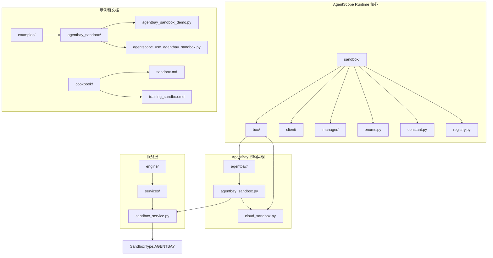
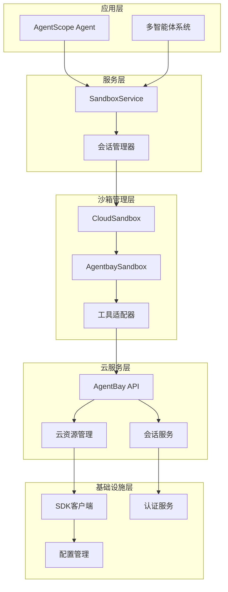
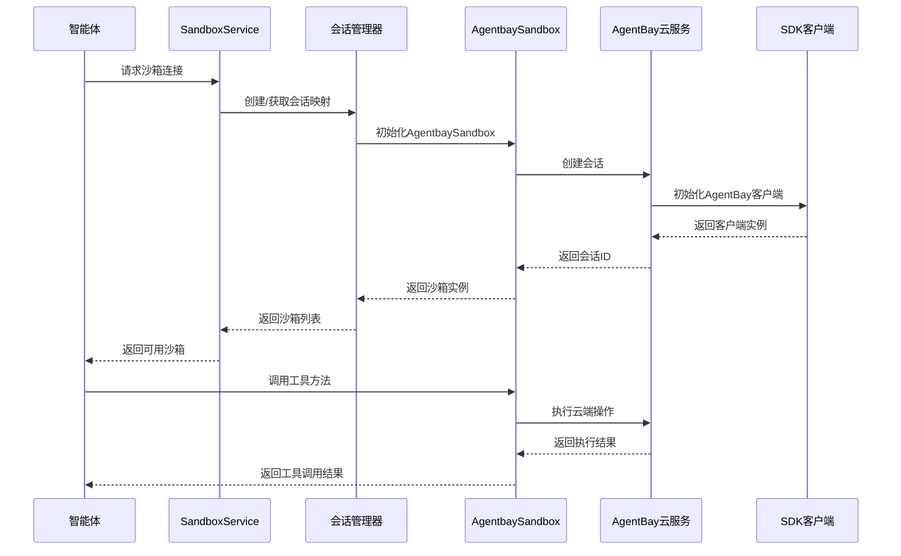
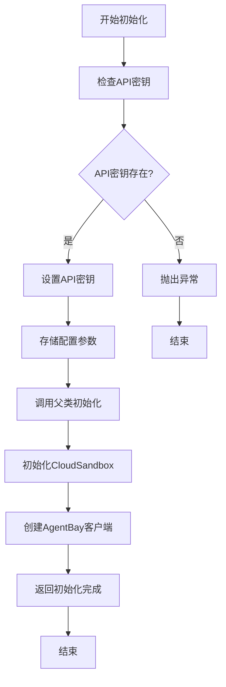
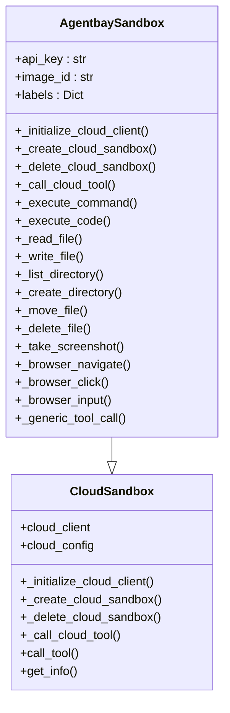
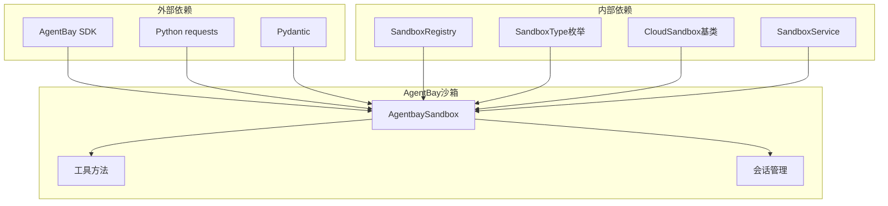

# AgentBay沙箱

<cite>
**本文档引用的文件**
- [agentbay_sandbox.py](file://src/agentscope_runtime/sandbox/box/agentbay/agentbay_sandbox.py)
- [cloud_sandbox.py](file://src/agentscope_runtime/sandbox/box/cloud/cloud_sandbox.py)
- [sandbox_service.py](file://src/agentscope_runtime/engine/services/sandbox/sandbox_service.py)
- [enums.py](file://src/agentscope_runtime/sandbox/enums.py)
- [constant.py](file://src/agentscope_runtime/sandbox/constant.py)
- [registry.py](file://src/agentscope_runtime/sandbox/registry.py)
- [http_client.py](file://src/agentscope_runtime/sandbox/client/http_client.py)
- [agentbay_sandbox_demo.py](file://examples/sandbox/agentbay_sandbox/agentbay_sandbox_demo.py)
- [agentscope_use_agentbay_sandbox.py](file://examples/sandbox/agentbay_sandbox/agentscope_use_agentbay_sandbox.py)
- [README.md](file://README.md)
- [sandbox.md](file://cookbook/zh/sandbox/sandbox.md)
- [training_sandbox.md](file://cookbook/zh/sandbox/training_sandbox.md)
</cite>

## 目录
1. [简介](#简介)
2. [项目结构](#项目结构)
3. [核心组件](#核心组件)
4. [架构概览](#架构概览)
5. [详细组件分析](#详细组件分析)
6. [依赖关系分析](#依赖关系分析)
7. [性能考虑](#性能考虑)
8. [故障排除指南](#故障排除指南)
9. [结论](#结论)
10. [附录](#附录)

## 简介

AgentBay沙箱是AgentScope Runtime生态系统中的重要组成部分，它提供了一个基于云原生的沙箱环境服务，支持智能体协作和多Agent系统集成。该沙箱实现了与AgentBay云服务的深度集成，为开发者提供了强大的工具执行能力和安全的隔离环境。

AgentBay沙箱的核心特点包括：
- **云原生架构**：无需本地容器，直接与AgentBay云服务通信
- **多环境支持**：支持Linux、Windows、Browser、CodeSpace、Mobile等多种环境类型
- **智能体协作**：通过SandboxService实现多智能体的会话管理和资源共享
- **安全隔离**：提供硬件化的沙箱执行环境
- **API集成**：支持多种框架的适配器集成

## 项目结构

AgentBay沙箱在项目中的组织结构如下：



**图表来源**
- [agentbay_sandbox.py:1-558](file://src/agentscope_runtime/sandbox/box/agentbay/agentbay_sandbox.py#L1-L558)
- [cloud_sandbox.py:1-251](file://src/agentscope_runtime/sandbox/box/cloud/cloud_sandbox.py#L1-L251)
- [sandbox_service.py:1-238](file://src/agentscope_runtime/engine/services/sandbox/sandbox_service.py#L1-L238)

**章节来源**
- [agentbay_sandbox.py:1-558](file://src/agentscope_runtime/sandbox/box/agentbay/agentbay_sandbox.py#L1-L558)
- [cloud_sandbox.py:1-251](file://src/agentscope_runtime/sandbox/box/cloud/cloud_sandbox.py#L1-L251)
- [sandbox_service.py:1-238](file://src/agentscope_runtime/engine/services/sandbox/sandbox_service.py#L1-L238)

## 核心组件

### AgentbaySandbox 类

AgentbaySandbox是AgentBay云沙箱的具体实现，继承自CloudSandbox基类。该类提供了与AgentBay云服务交互的所有必要功能。

**核心特性：**
- **API密钥管理**：支持从环境变量、参数或Bearer Token中获取API密钥
- **会话管理**：自动创建和管理AgentBay会话
- **工具调用**：提供多种工具方法的封装，包括文件操作、命令执行、浏览器操作等
- **错误处理**：完善的异常处理和错误恢复机制

### CloudSandbox 基类

CloudSandbox作为所有云沙箱的抽象基类，定义了云沙箱的标准接口和行为模式。

**关键抽象方法：**
- `_initialize_cloud_client()`：初始化云客户端
- `_create_cloud_sandbox()`：创建新的云沙箱
- `_delete_cloud_sandbox()`：删除云沙箱
- `_call_cloud_tool()`：在云环境中调用工具

### SandboxService 服务

SandboxService提供了统一的沙箱管理接口，支持多智能体的会话管理和资源复用。

**主要功能：**
- **会话管理**：通过session_id和user_id管理不同用户会话的沙箱环境
- **资源复用**：支持相同会话标识的沙箱复用
- **生命周期管理**：提供沙箱的创建、连接、释放和清理功能

**章节来源**
- [agentbay_sandbox.py:27-558](file://src/agentscope_runtime/sandbox/box/agentbay/agentbay_sandbox.py#L27-L558)
- [cloud_sandbox.py:19-251](file://src/agentscope_runtime/sandbox/box/cloud/cloud_sandbox.py#L19-L251)
- [sandbox_service.py:11-238](file://src/agentscope_runtime/engine/services/sandbox/sandbox_service.py#L11-L238)

## 架构概览

AgentBay沙箱采用分层架构设计，确保了良好的可扩展性和维护性：



**图表来源**
- [agentbay_sandbox.py:27-558](file://src/agentscope_runtime/sandbox/box/agentbay/agentbay_sandbox.py#L27-L558)
- [cloud_sandbox.py:19-251](file://src/agentscope_runtime/sandbox/box/cloud/cloud_sandbox.py#L19-L251)
- [sandbox_service.py:11-238](file://src/agentscope_runtime/engine/services/sandbox/sandbox_service.py#L11-L238)

### 数据流架构



**图表来源**
- [agentbay_sandbox.py:88-187](file://src/agentscope_runtime/sandbox/box/agentbay/agentbay_sandbox.py#L88-L187)
- [sandbox_service.py:82-200](file://src/agentscope_runtime/engine/services/sandbox/sandbox_service.py#L82-L200)

## 详细组件分析

### AgentbaySandbox 类详细分析

AgentbaySandbox类实现了完整的AgentBay云沙箱功能，以下是其核心组件的详细分析：

#### 初始化流程



**图表来源**
- [agentbay_sandbox.py:43-86](file://src/agentscope_runtime/sandbox/box/agentbay/agentbay_sandbox.py#L43-L86)

#### 工具调用机制

AgentbaySandbox提供了丰富的工具调用方法，所有工具调用都通过统一的`_call_cloud_tool`方法处理：



**图表来源**
- [agentbay_sandbox.py:27-558](file://src/agentscope_runtime/sandbox/box/agentbay/agentbay_sandbox.py#L27-L558)
- [cloud_sandbox.py:19-251](file://src/agentscope_runtime/sandbox/box/cloud/cloud_sandbox.py#L19-L251)

#### 会话管理机制

AgentbaySandbox使用AgentBay的会话管理系统来确保资源的有效利用和隔离：

**会话创建流程：**
1. 生成CreateSessionParams参数
2. 调用AgentBay客户端的create方法
3. 解析返回结果并提取session_id
4. 设置沙箱状态为已激活

**会话清理流程：**
1. 通过AgentBay客户端获取会话对象
2. 调用delete方法删除会话
3. 处理删除结果并记录日志

**章节来源**
- [agentbay_sandbox.py:88-187](file://src/agentscope_runtime/sandbox/box/agentbay/agentbay_sandbox.py#L88-L187)
- [agentbay_sandbox.py:189-442](file://src/agentscope_runtime/sandbox/box/agentbay/agentbay_sandbox.py#L189-L442)

### SandboxService 服务分析

SandboxService提供了统一的沙箱管理接口，支持多智能体的会话管理和资源复用：

#### 会话连接流程

```mermaid
sequenceDiagram
participant Client as 客户端
participant Service as SandboxService
participant Manager as SandboxManager
participant Registry as SandboxRegistry
participant Box as 沙箱实例
Client->>Service : connect(session_id, user_id, types)
Service->>Service : _create_session_ctx_id()
Service->>Manager : get_session_mapping()
Manager-->>Service : 返回env_ids
alt 会话已存在
Service->>Service : _connect_existing_environment()
Service->>Registry : get_classes_by_type()
Registry-->>Service : 返回box_cls
Service->>Box : 创建沙箱实例
Box-->>Service : 返回沙箱列表
else 新建会话
Service->>Service : _create_new_environment()
Service->>Registry : get_classes_by_type()
Registry-->>Service : 返回box_cls
Service->>Box : 创建沙箱实例
Box-->>Service : 返回沙箱列表
end
Service-->>Client : 返回沙箱实例列表
```

**图表来源**
- [sandbox_service.py:82-200](file://src/agentscope_runtime/engine/services/sandbox/sandbox_service.py#L82-L200)

#### AgentBay会话识别机制

SandboxService具有特殊的AgentBay会话识别功能，通过检查会话ID的前缀来区分AgentBay会话和其他类型的沙箱：

**AgentBay会话特征：**
- 会话ID以"session-"开头
- 不通过标准的沙箱管理器释放
- 需要特殊的连接处理逻辑

**章节来源**
- [sandbox_service.py:202-231](file://src/agentscope_runtime/engine/services/sandbox/sandbox_service.py#L202-L231)

### 配置参数详解

AgentBay沙箱支持多种配置参数，以下是详细的参数说明：

#### 基础配置参数

| 参数名 | 类型 | 必需 | 默认值 | 描述 |
|--------|------|------|--------|------|
| `sandbox_id` | Optional[str] | 否 | None | 现有会话的ID，用于连接现有会话 |
| `base_url` | Optional[str] | 否 | None | AgentBay API的基础URL |
| `bearer_token` | Optional[str] | 否 | None | 认证令牌（已弃用，使用api_key） |
| `api_key` | Optional[str] | 否 | None | AgentBay API密钥 |
| `image_id` | str | 否 | "linux_latest" | AgentBay镜像类型 |
| `labels` | Optional[Dict[str, str]] | 否 | None | 会话组织标签 |

#### 环境变量配置

AgentBay沙箱支持通过环境变量进行配置：

**API密钥配置优先级：**
1. `AGENTBAY_API_KEY` - 环境变量
2. `BEARER_TOKEN` - 兼容的Bearer Token
3. 参数传递

**其他环境变量：**
- `RUNTIME_SANDBOX_REGISTRY` - 镜像注册表
- `RUNTIME_SANDBOX_IMAGE_NAMESPACE` - 镜像命名空间
- `RUNTIME_SANDBOX_IMAGE_TAG` - 镜像标签
- `RUNTIME_SANDBOX_TIMEOUT` - 超时时间

**章节来源**
- [agentbay_sandbox.py:43-86](file://src/agentscope_runtime/sandbox/box/agentbay/agentbay_sandbox.py#L43-L86)
- [constant.py:1-32](file://src/agentscope_runtime/sandbox/constant.py#L1-L32)

## 依赖关系分析

AgentBay沙箱的依赖关系体现了清晰的分层架构：



**图表来源**
- [agentbay_sandbox.py:12-15](file://src/agentscope_runtime/sandbox/box/agentbay/agentbay_sandbox.py#L12-L15)
- [registry.py:33-131](file://src/agentscope_runtime/sandbox/registry.py#L33-L131)
- [enums.py:61-80](file://src/agentscope_runtime/sandbox/enums.py#L61-L80)

### 组件耦合度分析

AgentBay沙箱的设计遵循了低耦合高内聚的原则：

**低耦合体现：**
- 通过抽象基类CloudSandbox实现与具体云服务的解耦
- 使用SandboxRegistry实现沙箱类的动态注册和查找
- 通过SandboxService实现沙箱管理的统一接口

**高内聚体现：**
- AgentbaySandbox集中处理AgentBay特有的功能
- 工具方法按功能分类组织，职责明确
- 会话管理逻辑独立封装

**章节来源**
- [agentbay_sandbox.py:20-26](file://src/agentscope_runtime/sandbox/box/agentbay/agentbay_sandbox.py#L20-L26)
- [cloud_sandbox.py:19-32](file://src/agentscope_runtime/sandbox/box/cloud/cloud_sandbox.py#L19-L32)
- [registry.py:33-91](file://src/agentscope_runtime/sandbox/registry.py#L33-L91)

## 性能考虑

### 云沙箱性能特点

AgentBay沙箱作为云原生解决方案，具有以下性能优势：

**资源利用率优化：**
- 无需本地容器管理，减少资源占用
- 云服务自动扩缩容，提高资源利用率
- 按需付费模式，避免资源浪费

**响应时间优化：**
- CDN加速的镜像分发
- 近距离数据中心部署
- 连接池复用机制

### 并发处理能力

AgentBay沙箱支持多智能体的并发执行：

**并发模型：**
- 每个智能体拥有独立的会话上下文
- 会话级别的资源隔离
- 并发工具调用的线程安全保证

**性能监控：**
- 内置的会话状态跟踪
- 资源使用情况监控
- 执行时间统计分析

## 故障排除指南

### 常见问题及解决方案

#### API密钥相关问题

**问题1：API密钥验证失败**
- **症状**：初始化时抛出ValueError异常
- **原因**：未设置AGENTBAY_API_KEY环境变量
- **解决方案**：设置环境变量或在构造函数中传入api_key参数

**问题2：SDK导入失败**
- **症状**：ImportError异常，提示未安装wuying-agentbay-sdk
- **原因**：缺少AgentBay SDK依赖
- **解决方案**：pip install wuying-agentbay-sdk

#### 会话管理问题

**问题3：会话创建失败**
- **症状**：_create_cloud_sandbox返回None
- **原因**：AgentBay API调用失败或配额不足
- **解决方案**：检查网络连接和API配额，重试操作

**问题4：会话清理失败**
- **症状**：_delete_cloud_sandbox返回False
- **原因**：会话不存在或已被删除
- **解决方案**：检查会话状态，避免重复删除

#### 工具调用问题

**问题5：工具调用超时**
- **症状**：工具调用返回超时错误
- **原因**：云服务响应慢或网络延迟
- **解决方案**：增加超时时间，检查网络状况

**问题6：工具调用权限不足**
- **症状**：工具调用返回权限错误
- **原因**：API密钥权限不足或会话权限限制
- **解决方案**：检查API密钥权限，重新授权会话

### 调试技巧

**启用详细日志：**
```python
import logging
logging.basicConfig(level=logging.DEBUG)
```

**检查会话状态：**
```python
sandbox.get_session_info()
```

**验证工具可用性：**
```python
sandbox.list_tools()
```

**章节来源**
- [agentbay_sandbox.py:69-73](file://src/agentscope_runtime/sandbox/box/agentbay/agentbay_sandbox.py#L69-L73)
- [agentbay_sandbox.py:105-113](file://src/agentscope_runtime/sandbox/box/agentbay/agentbay_sandbox.py#L105-L113)
- [agentbay_sandbox.py:146-147](file://src/agentscope_runtime/sandbox/box/agentbay/agentbay_sandbox.py#L146-L147)

## 结论

AgentBay沙箱为AgentScope Runtime提供了强大的云原生沙箱执行环境，具有以下显著优势：

**技术优势：**
- 云原生架构确保了高可用性和可扩展性
- 完善的多智能体协作支持
- 安全的隔离执行环境
- 灵活的配置和部署选项

**集成能力：**
- 与AgentScope框架深度集成
- 支持多种工具和操作
- 提供统一的API接口
- 良好的扩展性设计

**最佳实践建议：**
- 合理配置API密钥和环境变量
- 使用会话管理机制实现资源复用
- 建立完善的错误处理和监控体系
- 根据应用场景选择合适的镜像类型

AgentBay沙箱为构建复杂的多智能体系统提供了坚实的技术基础，是AgentScope Runtime生态系统中的重要组成部分。

## 附录

### 使用示例

#### 基础使用示例

```python
# 直接使用AgentBay沙箱
from agentscope_runtime.sandbox.box.agentbay.agentbay_sandbox import AgentbaySandbox

sandbox = AgentbaySandbox(
    api_key="your_api_key",
    image_id="linux_latest"
)

# 执行工具调用
result = sandbox.call_tool(
    "run_shell_command",
    {"command": "echo 'Hello World'"}
)
```

#### 与AgentScope集成示例

```python
# 通过SandboxService集成
from agentscope_runtime.engine.services.sandbox import SandboxService
from agentscope_runtime.sandbox.enums import SandboxType

service = SandboxService(bearer_token="your_api_key")
sandboxes = service.connect(
    session_id="demo_session",
    user_id="demo_user",
    sandbox_types=[SandboxType.AGENTBAY]
)
```

### 配置最佳实践

**生产环境配置：**
- 使用环境变量管理敏感信息
- 配置适当的超时时间和重试机制
- 建立监控和告警系统
- 定期清理过期的会话资源

**开发环境配置：**
- 使用测试API密钥
- 开启详细日志输出
- 配置本地调试环境
- 建立快速迭代的工作流程

**章节来源**
- [agentbay_sandbox_demo.py:57-121](file://examples/sandbox/agentbay_sandbox/agentbay_sandbox_demo.py#L57-L121)
- [agentscope_use_agentbay_sandbox.py:71-103](file://examples/sandbox/agentbay_sandbox/agentscope_use_agentbay_sandbox.py#L71-L103)
- [sandbox.md:301-324](file://cookbook/zh/sandbox/sandbox.md#L301-L324)