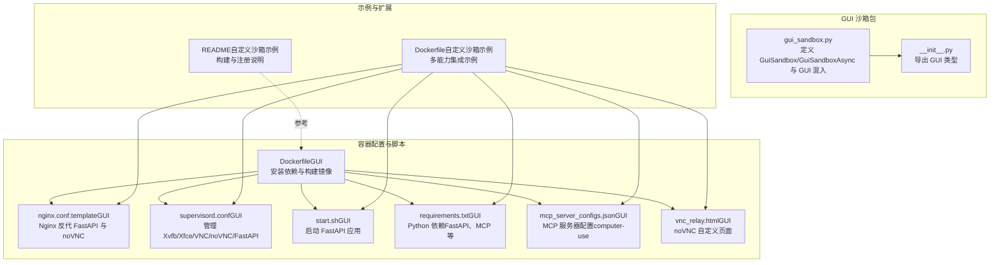
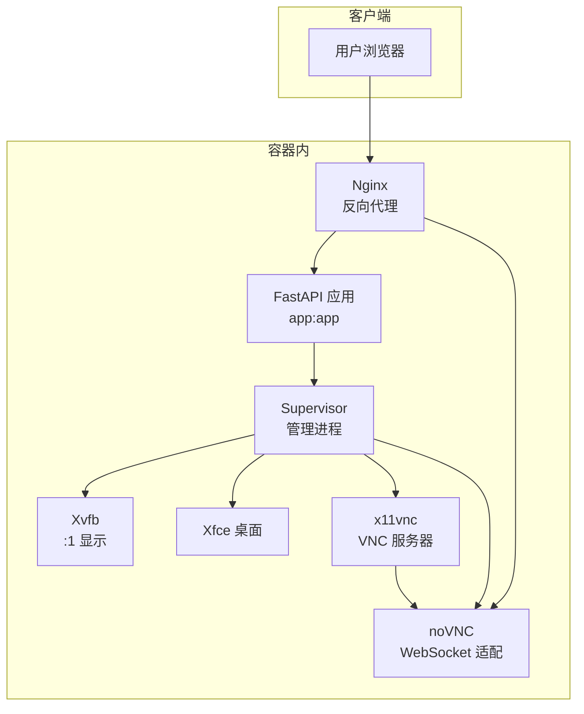
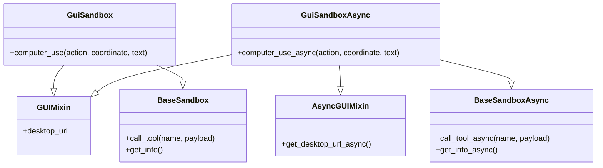
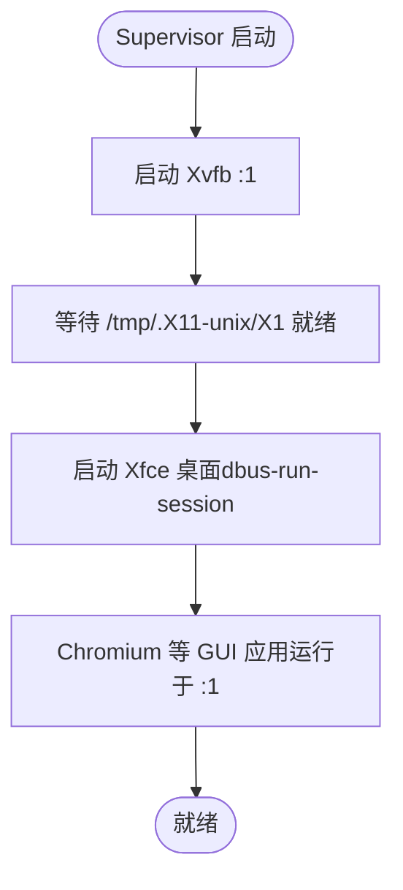
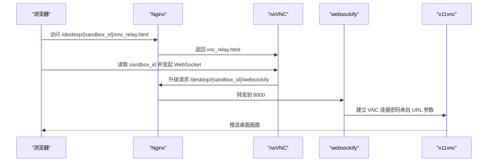
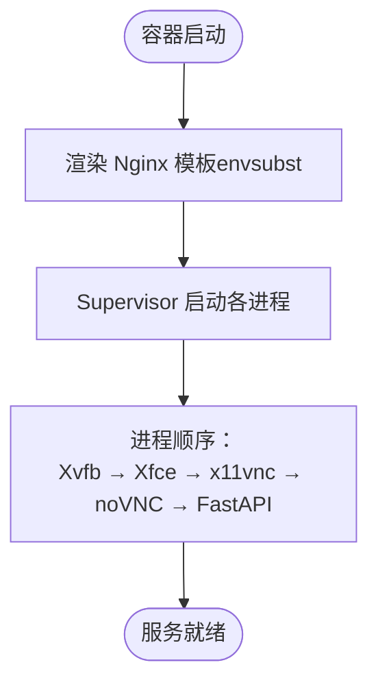
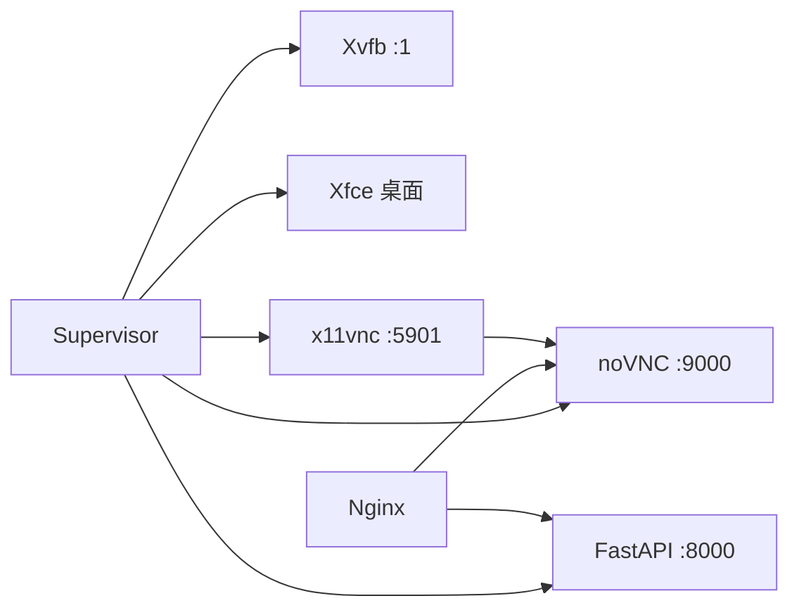

# GUI沙箱

<cite>
**本文引用的文件**
- [gui_sandbox.py](file://src/agentscope_runtime/sandbox/box/gui/gui_sandbox.py)
- [Dockerfile（GUI）](file://src/agentscope_runtime/sandbox/box/gui/Dockerfile)
- [nginx.conf.template（GUI）](file://src/agentscope_runtime/sandbox/box/gui/box/config/nginx.conf.template)
- [supervisord.conf（GUI）](file://src/agentscope_runtime/sandbox/box/gui/box/config/supervisord.conf)
- [start.sh（GUI）](file://src/agentscope_runtime/sandbox/box/gui/box/scripts/start.sh)
- [requirements.txt（GUI）](file://src/agentscope_runtime/sandbox/box/gui/box/requirements.txt)
- [mcp_server_configs.json（GUI）](file://src/agentscope_runtime/sandbox/box/gui/box/mcp_server_configs.json)
- [vnc_relay.html（GUI）](file://src/agentscope_runtime/sandbox/box/gui/box/vnc_relay.html)
- [Dockerfile（自定义沙箱示例）](file://examples/sandbox/custom_sandbox/Dockerfile)
- [README（自定义沙箱示例）](file://examples/sandbox/custom_sandbox/README.md)
- [__init__.py（GUI 包）](file://src/agentscope_runtime/sandbox/box/gui/__init__.py)
</cite>

## 目录
1. [简介](#简介)
2. [项目结构](#项目结构)
3. [核心组件](#核心组件)
4. [架构总览](#架构总览)
5. [详细组件分析](#详细组件分析)
6. [依赖关系分析](#依赖关系分析)
7. [性能考虑](#性能考虑)
8. [故障排除指南](#故障排除指南)
9. [结论](#结论)
10. [附录](#附录)

## 简介
本文件为 GUI 沙箱的技术文档，聚焦于虚拟显示系统与远程桌面技术实现，涵盖以下关键点：
- 虚拟显示系统：Xvfb 虚拟帧缓冲、桌面环境（XFCE）与窗口管理
- 远程桌面技术：VNC 服务器、noVNC 客户端与 Nginx 反向代理
- 启动脚本与服务编排：Supervisor 管理 FastAPI、Xvfb、Xfce、x11vnc、noVNC
- 配置模板与容器构建：Nginx 模板变量、Chromium 无沙箱模式、镜像构建流程
- 使用示例：运行图形界面应用与 Web 浏览器
- 安全隔离与资源限制：容器层隔离、密码认证、超时控制
- 性能调优与故障排除：日志定位、网络路径优化、显示分辨率与字体

## 项目结构
GUI 沙箱位于沙箱体系的“box”子模块中，采用“按功能域分层”的组织方式：
- 接口与注册：在 GUI 包内定义沙箱类与混入，并通过注册表对外暴露
- 容器镜像：基于 Node slim 基础镜像，安装 Xvfb、Xfce、Chromium、VNC、noVNC、Nginx、Supervisor 等
- 配置与脚本：Nginx 模板、Supervisor 配置、启动脚本、MCP 服务器配置、noVNC 自定义页面
- 示例与扩展：提供自定义沙箱示例，展示如何在统一框架下扩展 GUI 能力

图表来源
- [gui_sandbox.py:1-240](file://src/agentscope_runtime/sandbox/box/gui/gui_sandbox.py#L1-L240)
- [__init__.py:1-5](file://src/agentscope_runtime/sandbox/box/gui/__init__.py#L1-L5)
- [Dockerfile（GUI）:1-81](file://src/agentscope_runtime/sandbox/box/gui/Dockerfile#L1-L81)
- [nginx.conf.template（GUI）:1-47](file://src/agentscope_runtime/sandbox/box/gui/box/config/nginx.conf.template#L1-L47)
- [supervisord.conf（GUI）:1-65](file://src/agentscope_runtime/sandbox/box/gui/box/config/supervisord.conf#L1-L65)
- [start.sh（GUI）:1-5](file://src/agentscope_runtime/sandbox/box/gui/box/scripts/start.sh#L1-L5)
- [requirements.txt（GUI）:1-9](file://src/agentscope_runtime/sandbox/box/gui/box/requirements.txt#L1-L9)
- [mcp_server_configs.json（GUI）:1-11](file://src/agentscope_runtime/sandbox/box/gui/box/mcp_server_configs.json#L1-L11)
- [vnc_relay.html（GUI）:1-197](file://src/agentscope_runtime/sandbox/box/gui/box/vnc_relay.html#L1-L197)
- [Dockerfile（自定义沙箱示例）:1-84](file://examples/sandbox/custom_sandbox/Dockerfile#L1-L84)
- [README（自定义沙箱示例）:1-184](file://examples/sandbox/custom_sandbox/README.md#L1-L184)

章节来源
- [gui_sandbox.py:1-240](file://src/agentscope_runtime/sandbox/box/gui/gui_sandbox.py#L1-L240)
- [Dockerfile（GUI）:1-81](file://src/agentscope_runtime/sandbox/box/gui/Dockerfile#L1-L81)
- [nginx.conf.template（GUI）:1-47](file://src/agentscope_runtime/sandbox/box/gui/box/config/nginx.conf.template#L1-L47)
- [supervisord.conf（GUI）:1-65](file://src/agentscope_runtime/sandbox/box/gui/box/config/supervisord.conf#L1-L65)
- [start.sh（GUI）:1-5](file://src/agentscope_runtime/sandbox/box/gui/box/scripts/start.sh#L1-L5)
- [requirements.txt（GUI）:1-9](file://src/agentscope_runtime/sandbox/box/gui/box/requirements.txt#L1-L9)
- [mcp_server_configs.json（GUI）:1-11](file://src/agentscope_runtime/sandbox/box/gui/box/mcp_server_configs.json#L1-L11)
- [vnc_relay.html（GUI）:1-197](file://src/agentscope_runtime/sandbox/box/gui/box/vnc_relay.html#L1-L197)
- [Dockerfile（自定义沙箱示例）:1-84](file://examples/sandbox/custom_sandbox/Dockerfile#L1-L84)
- [README（自定义沙箱示例）:1-184](file://examples/sandbox/custom_sandbox/README.md#L1-L184)

## 核心组件
- GUI 混入与沙箱类
  - GUIMixin/AsyncGUIMixin：提供桌面访问 URL 生成逻辑，支持本地与反代场景
  - GuiSandbox/GuiSandboxAsync：继承基础沙箱，封装 computer-use 动作接口（键盘、鼠标、截图等）
- 容器与服务编排
  - Supervisor：统一管理 dbus、FastAPI、Xvfb、Xfce、x11vnc、noVNC
  - Nginx：反向代理 FastAPI 与 noVNC，支持模板变量注入
  - Xvfb：虚拟帧缓冲，Xfce：桌面环境，x11vnc/noVNC：远程桌面通道
- 配置与工具
  - mcp_server_configs.json：声明 computer-use MCP 服务器
  - vnc_relay.html：定制 noVNC 页面，支持从路径提取沙箱 ID 并建立 WebSocket 连接
  - requirements.txt：FastAPI、UVicorn、MCP 等运行时依赖

章节来源
- [gui_sandbox.py:17-240](file://src/agentscope_runtime/sandbox/box/gui/gui_sandbox.py#L17-L240)
- [supervisord.conf（GUI）:1-65](file://src/agentscope_runtime/sandbox/box/gui/box/config/supervisord.conf#L1-L65)
- [nginx.conf.template（GUI）:1-47](file://src/agentscope_runtime/sandbox/box/gui/box/config/nginx.conf.template#L1-L47)
- [mcp_server_configs.json（GUI）:1-11](file://src/agentscope_runtime/sandbox/box/gui/box/mcp_server_configs.json#L1-L11)
- [vnc_relay.html（GUI）:1-197](file://src/agentscope_runtime/sandbox/box/gui/box/vnc_relay.html#L1-L197)
- [requirements.txt（GUI）:1-9](file://src/agentscope_runtime/sandbox/box/gui/box/requirements.txt#L1-L9)

## 架构总览
GUI 沙箱的运行时架构由“容器内服务编排 + 反向代理 + 远程桌面通道”构成，整体流程如下：

图表来源
- [supervisord.conf（GUI）:14-65](file://src/agentscope_runtime/sandbox/box/gui/box/config/supervisord.conf#L14-L65)
- [nginx.conf.template（GUI）:13-46](file://src/agentscope_runtime/sandbox/box/gui/box/config/nginx.conf.template#L13-L46)
- [start.sh（GUI）:3-4](file://src/agentscope_runtime/sandbox/box/gui/box/scripts/start.sh#L3-L4)

## 详细组件分析

### 组件一：GUI 混入与沙箱类
- GUIMixin/AsyncGUIMixin
  - 提供 desktop_url/get_desktop_url_async，用于拼接 VNC 访问地址（含鉴权 token）
  - 支持本地直连与反代两种模式，反代时自动拼接 /desktop/{sandbox_id}/vnc_relay.html
- GuiSandbox/GuiSandboxAsync
  - 封装 computer_use 接口，支持 key、type、mouse_move、left_click、截图等动作
  - 在 ARM64 平台输出兼容性警告（SSE3 缺失导致 Chromium 可能崩溃）

图表来源
- [gui_sandbox.py:17-240](file://src/agentscope_runtime/sandbox/box/gui/gui_sandbox.py#L17-L240)

章节来源
- [gui_sandbox.py:17-240](file://src/agentscope_runtime/sandbox/box/gui/gui_sandbox.py#L17-L240)

### 组件二：虚拟显示系统与桌面环境
- Xvfb
  - 以 :1 作为默认显示，屏幕分辨率为 1280x800x24
  - Supervisor 中设置 DISPLAY 环境变量并优先启动
- Xfce 桌面
  - 通过 dbus-run-session 启动，等待 Xvfb 就绪后再启动
  - 作为 GUI 应用的宿主环境
- Chromium
  - 通过修改启动参数禁用沙箱以提升兼容性
  - 作为浏览器运行在虚拟显示环境中

图表来源
- [supervisord.conf（GUI）:30-46](file://src/agentscope_runtime/sandbox/box/gui/box/config/supervisord.conf#L30-L46)
- [Dockerfile（GUI）:31-49](file://src/agentscope_runtime/sandbox/box/gui/Dockerfile#L31-L49)

章节来源
- [supervisord.conf（GUI）:30-46](file://src/agentscope_runtime/sandbox/box/gui/box/config/supervisord.conf#L30-L46)
- [Dockerfile（GUI）:31-49](file://src/agentscope_runtime/sandbox/box/gui/Dockerfile#L31-L49)

### 组件三：远程桌面与反向代理
- VNC 服务器与 noVNC
  - x11vnc 监听 5901 端口，使用 SECRET_TOKEN 作为密码
  - noVNC 通过 websockify 将 VNC 流量转换为 WebSocket，监听 9000 端口
- Nginx 反向代理
  - /fastapi：转发到本地 8000（FastAPI）
  - /vnc/：静态映射到 noVNC 前端
  - /websockify：升级协议到 WebSocket，转发到 9000
  - 支持模板变量 NGINX_TIMEOUT 控制连接超时
- noVNC 自定义页面
  - vnc_relay.html：从 URL 路径解析 sandbox_id，构造 WebSocket 路径 /desktop/{sandbox_id}/...
  - 支持 HTTPS 自动选择 wss/ws，支持密码认证

图表来源
- [nginx.conf.template（GUI）:27-45](file://src/agentscope_runtime/sandbox/box/gui/box/config/nginx.conf.template#L27-L45)
- [supervisord.conf（GUI）:48-65](file://src/agentscope_runtime/sandbox/box/gui/box/config/supervisord.conf#L48-L65)
- [vnc_relay.html:108-174](file://src/agentscope_runtime/sandbox/box/gui/box/vnc_relay.html#L108-L174)

章节来源
- [nginx.conf.template（GUI）:1-47](file://src/agentscope_runtime/sandbox/box/gui/box/config/nginx.conf.template#L1-L47)
- [supervisord.conf（GUI）:48-65](file://src/agentscope_runtime/sandbox/box/gui/box/config/supervisord.conf#L48-L65)
- [vnc_relay.html:1-197](file://src/agentscope_runtime/sandbox/box/gui/box/vnc_relay.html#L1-L197)

### 组件四：启动脚本与服务编排
- Supervisor 配置要点
  - 顺序：Xvfb → Xfce → x11vnc → noVNC → FastAPI
  - 环境变量：DISPLAY=:1；x11vnc 使用 SECRET_TOKEN
- 启动脚本
  - 启动 FastAPI 应用（/agentscope_runtime），监听 8000
- Nginx 模板
  - 通过 envsubst 注入 SECRET_TOKEN 与 NGINX_TIMEOUT
  - CMD 中先渲染模板再启动 Supervisor

图表来源
- [Dockerfile（GUI）:63-80](file://src/agentscope_runtime/sandbox/box/gui/Dockerfile#L63-L80)
- [nginx.conf.template（GUI）:1-47](file://src/agentscope_runtime/sandbox/box/gui/box/config/nginx.conf.template#L1-L47)
- [supervisord.conf（GUI）:1-65](file://src/agentscope_runtime/sandbox/box/gui/box/config/supervisord.conf#L1-L65)
- [start.sh（GUI）:1-5](file://src/agentscope_runtime/sandbox/box/gui/box/scripts/start.sh#L1-L5)

章节来源
- [Dockerfile（GUI）:63-80](file://src/agentscope_runtime/sandbox/box/gui/Dockerfile#L63-L80)
- [supervisord.conf（GUI）:1-65](file://src/agentscope_runtime/sandbox/box/gui/box/config/supervisord.conf#L1-L65)
- [start.sh（GUI）:1-5](file://src/agentscope_runtime/sandbox/box/gui/box/scripts/start.sh#L1-L5)

### 组件五：容器构建与依赖
- 基础镜像与系统依赖
  - Node slim、apt 安装 Xvfb、Xfce、Chromium、VNC、noVNC、Nginx、Supervisor、字体等
- Python 运行时
  - 虚拟环境、FastAPI、UVicorn、MCP、GitPython 等
- 构建流程
  - 复制共享应用与路由、拷贝 GUI 包配置与脚本
  - 清理缓存与临时目录，减少镜像体积
  - CMD 中渲染 Nginx 模板并启动 Supervisor

章节来源
- [Dockerfile（GUI）:1-81](file://src/agentscope_runtime/sandbox/box/gui/Dockerfile#L1-L81)
- [requirements.txt（GUI）:1-9](file://src/agentscope_runtime/sandbox/box/gui/box/requirements.txt#L1-L9)
- [README（自定义沙箱示例）:81-169](file://examples/sandbox/custom_sandbox/README.md#L81-L169)

### 组件六：使用示例与最佳实践
- 运行图形界面应用
  - 通过 GuiSandbox/computer_use 执行鼠标与键盘操作
  - 先截图获取目标元素坐标，再执行点击或输入
- 运行 Web 浏览器
  - Chromium 已安装且禁用沙箱以提升兼容性
  - 通过桌面图标或命令行启动浏览器
- 访问远程桌面
  - 获取 desktop_url 或调用 get_desktop_url_async
  - 在浏览器中打开 URL，输入密码（runtime_token）后即可查看桌面

章节来源
- [gui_sandbox.py:98-152](file://src/agentscope_runtime/sandbox/box/gui/gui_sandbox.py#L98-L152)
- [gui_sandbox.py:188-240](file://src/agentscope_runtime/sandbox/box/gui/gui_sandbox.py#L188-L240)
- [Dockerfile（GUI）:31-49](file://src/agentscope_runtime/sandbox/box/gui/Dockerfile#L31-L49)

## 依赖关系分析
GUI 沙箱的依赖关系围绕“Supervisor 编排 + Nginx 反代 + VNC/noVNC + FastAPI 应用”展开，关键耦合点如下：
- Supervisor 对 Xvfb/Xfce/x11vnc/noVNC 的启动顺序与环境变量有强依赖
- Nginx 对 FastAPI 与 noVNC 的路径映射决定外部访问入口
- noVNC 与 x11vnc 的端口与密码通过环境变量传递
- FastAPI 通过工具调用与 MCP 交互，实现 computer-use 功能

图表来源
- [supervisord.conf（GUI）:14-65](file://src/agentscope_runtime/sandbox/box/gui/box/config/supervisord.conf#L14-L65)
- [nginx.conf.template（GUI）:16-45](file://src/agentscope_runtime/sandbox/box/gui/box/config/nginx.conf.template#L16-L45)

章节来源
- [supervisord.conf（GUI）:14-65](file://src/agentscope_runtime/sandbox/box/gui/box/config/supervisord.conf#L14-L65)
- [nginx.conf.template（GUI）:16-45](file://src/agentscope_runtime/sandbox/box/gui/box/config/nginx.conf.template#L16-L45)

## 性能考虑
- 显示性能
  - 分辨率与色彩位深：1280x800x24，可根据需求调整
  - 字体与中文字体：已安装中文字体，避免中文乱码
- 网络与代理
  - NGINX_TIMEOUT 控制代理超时，建议根据网络状况调优
  - noVNC 通过 WebSocket 传输，建议部署在低延迟网络
- 浏览器兼容性
  - Chromium 已禁用沙箱以提升兼容性，注意安全边界
  - ARM64 平台存在 SSE3 缺失风险，可能影响 Chromium 稳定性
- 资源占用
  - Xvfb、Xfce、VNC 与 noVNC 均为常驻进程，建议结合容器资源限制使用

## 故障排除指南
- 无法访问桌面 URL
  - 检查沙箱健康状态与 runtime_token 是否正确
  - 确认 Nginx 模板渲染成功（SECRET_TOKEN、NGINX_TIMEOUT）
- noVNC 无法连接
  - 检查 x11vnc 是否监听 5901，密码是否匹配
  - 确认 noVNC 通过 websockify 正常转发至 9000
- Xvfb/Xfce 启动失败
  - 查看 /tmp/.X11-unix/X1 是否创建，等待时间是否足够
  - 检查 DISPLAY 环境变量是否正确传递
- 浏览器异常
  - 确认 Chromium 已安装且禁用沙箱参数生效
  - ARM64 平台注意 SSE3 缺失导致的崩溃风险
- 日志定位
  - Supervisor 日志：/var/log/supervisord.log
  - Nginx 日志：/var/log/nginx.*
  - 各进程日志：/var/log/*.err.log 与 /var/log/*.out.log

章节来源
- [supervisord.conf（GUI）:1-65](file://src/agentscope_runtime/sandbox/box/gui/box/config/supervisord.conf#L1-L65)
- [nginx.conf.template（GUI）:1-47](file://src/agentscope_runtime/sandbox/box/gui/box/config/nginx.conf.template#L1-L47)
- [Dockerfile（GUI）:63-80](file://src/agentscope_runtime/sandbox/box/gui/Dockerfile#L63-L80)

## 结论
GUI 沙箱通过 Xvfb + Xfce + VNC/noVNC + Nginx 的组合，提供了稳定可控的远程图形桌面能力。其设计强调：
- 容器化隔离与可移植性
- 通过 Supervisor 统一编排与依赖管理
- 通过 Nginx 实现反向代理与安全边界
- 通过 MCP 与 FastAPI 提供可扩展的工具调用能力

在实际部署中，建议结合资源限制、网络优化与日志监控，确保稳定性与安全性。

## 附录
- 导出与注册
  - GUI 包导出 GuiSandbox、GuiSandboxAsync、GUIMixin、AsyncGUIMixin
- 自定义扩展参考
  - 自定义沙箱示例展示了如何在统一框架下扩展 GUI 能力与依赖

章节来源
- [__init__.py:1-5](file://src/agentscope_runtime/sandbox/box/gui/__init__.py#L1-L5)
- [README（自定义沙箱示例）:1-184](file://examples/sandbox/custom_sandbox/README.md#L1-L184)