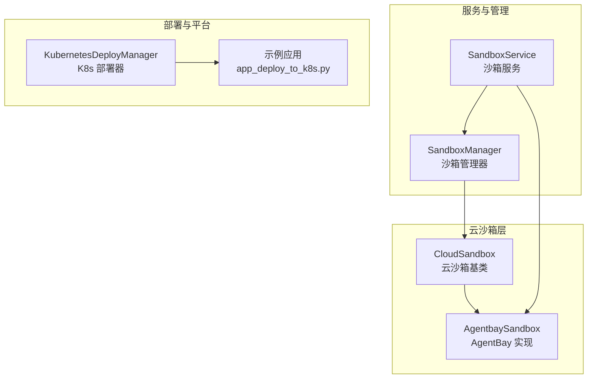
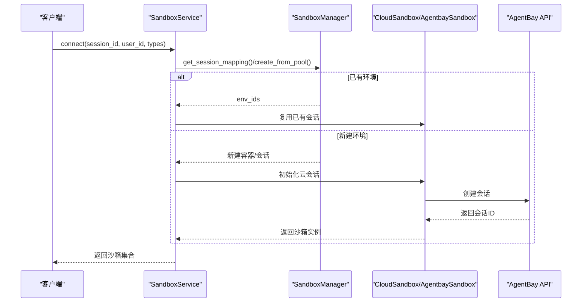
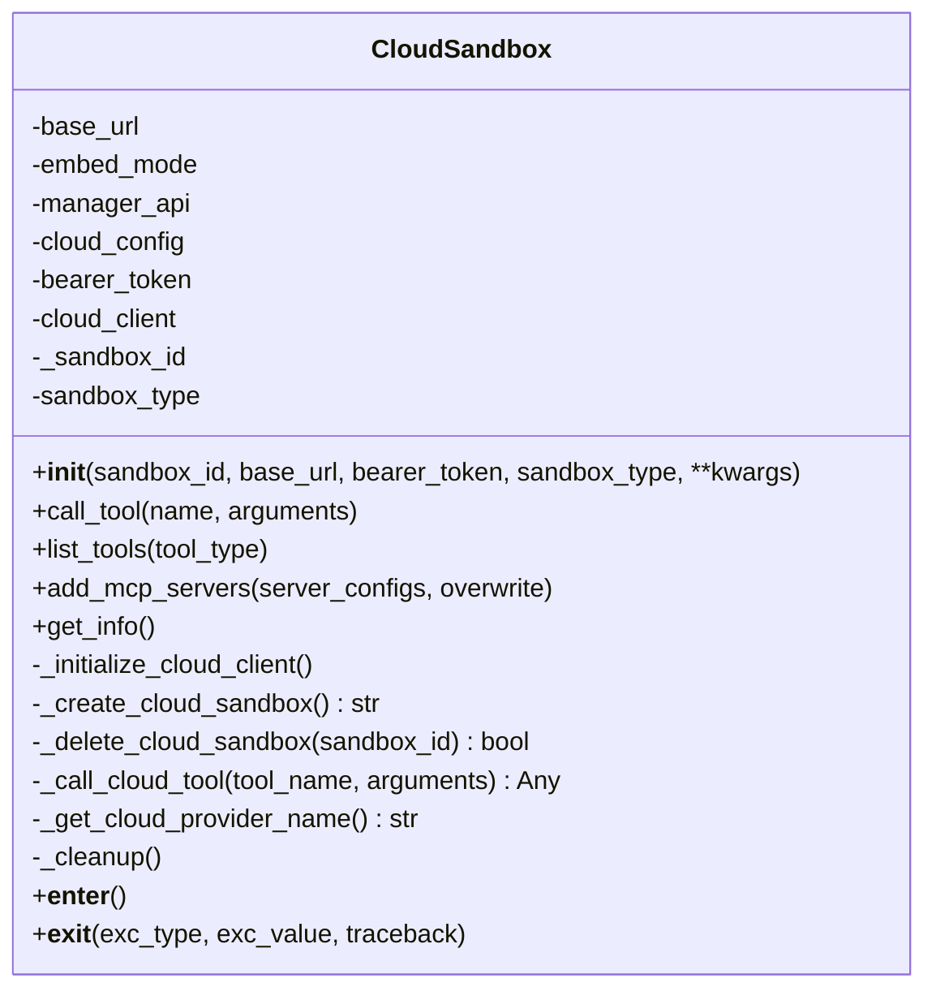
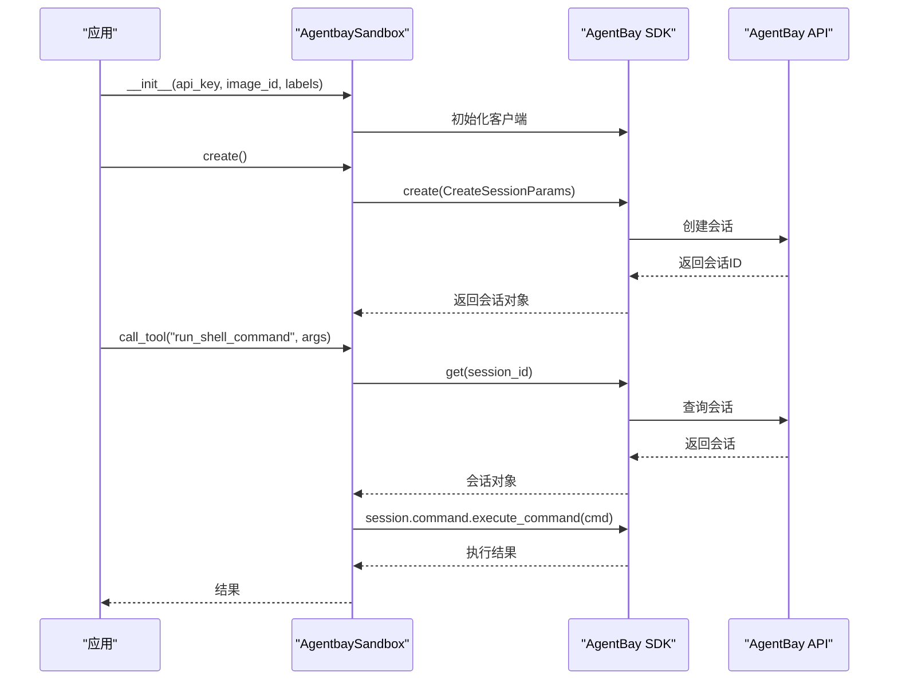
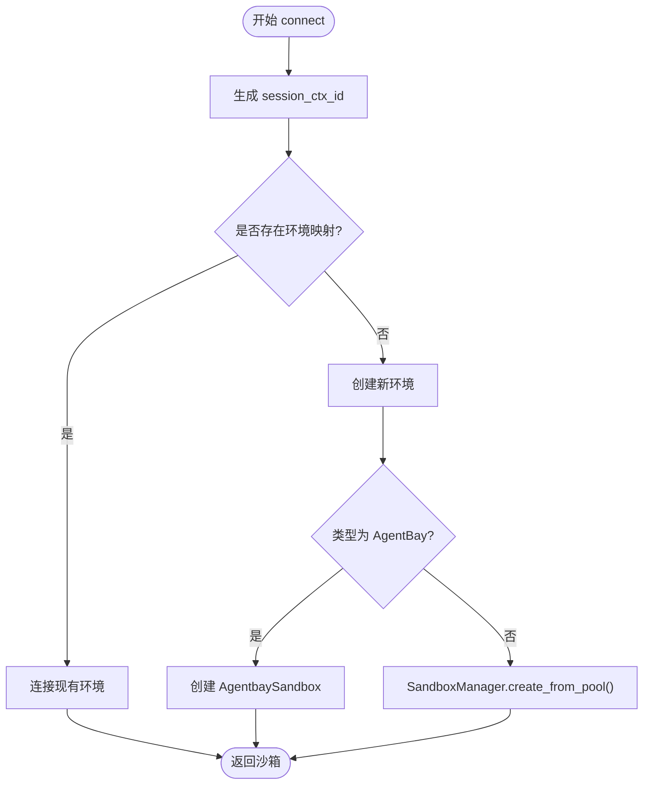
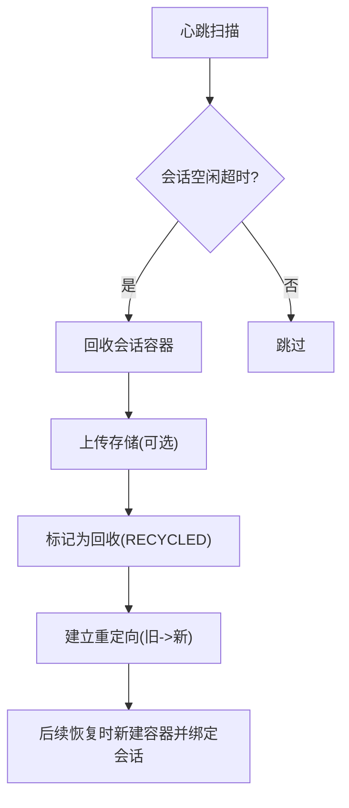
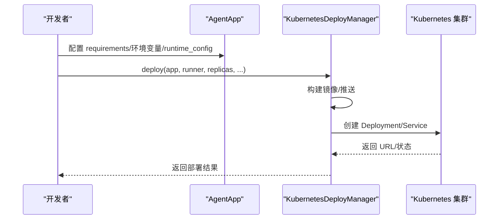
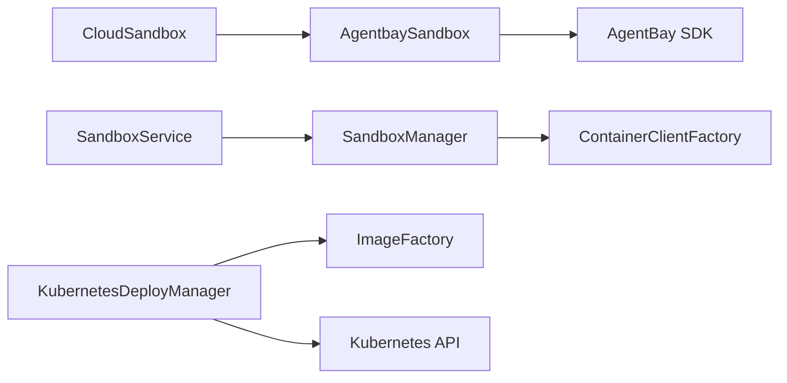

# 云沙箱

<cite>
**本文引用的文件**
- [cloud_sandbox.py](file://src/agentscope_runtime/sandbox/box/cloud/cloud_sandbox.py)
- [agentbay_sandbox.py](file://src/agentscope_runtime/sandbox/box/agentbay/agentbay_sandbox.py)
- [sandbox_service.py](file://src/agentscope_runtime/engine/services/sandbox/sandbox_service.py)
- [sandbox_manager.py](file://src/agentscope_runtime/sandbox/manager/sandbox_manager.py)
- [kubernetes_deployer.py](file://src/agentscope_runtime/engine/deployers/kubernetes_deployer.py)
- [app_deploy_to_k8s.py](file://examples/deployments/k8s_deploy/app_deploy_to_k8s.py)
- [sandbox.md](file://cookbook/zh/sandbox/sandbox.md)
- [sandbox_service.md](file://cookbook/en/sandbox/sandbox_service.md)
- [test_cloud_sandbox.py](file://tests/unit/test_cloud_sandbox.py)
</cite>

## 目录
1. [简介](#简介)
2. [项目结构](#项目结构)
3. [核心组件](#核心组件)
4. [架构总览](#架构总览)
5. [详细组件分析](#详细组件分析)
6. [依赖关系分析](#依赖关系分析)
7. [性能考虑](#性能考虑)
8. [故障排查指南](#故障排查指南)
9. [结论](#结论)
10. [附录](#附录)

## 简介
本技术文档围绕“云沙箱”展开，系统阐述其云端资源管理与弹性扩展机制，涵盖云服务集成、资源调度与成本优化策略；详细说明配置选项、部署流程与监控指标；提供云端智能体部署、资源动态调整与多租户隔离的使用示例；解释安全架构与访问控制机制，并给出成本优化与性能调优指南。

## 项目结构
云沙箱相关能力主要由以下模块构成：
- 云沙箱基类：提供统一的云沙箱接口与生命周期管理
- 云沙箱实现：以 AgentBay 为例，展示如何对接云服务
- 沙箱服务：统一管理沙箱生命周期、会话映射与资源回收
- 沙箱管理器：负责本地容器池化、心跳扫描、回收与恢复
- 部署器：提供 Kubernetes 等平台的弹性部署与扩缩容
- 示例与文档：演示部署流程、MCP 集成与远程连接

图表来源
- [cloud_sandbox.py:19-251](file://src/agentscope_runtime/sandbox/box/cloud/cloud_sandbox.py#L19-L251)
- [agentbay_sandbox.py:27-558](file://src/agentscope_runtime/sandbox/box/agentbay/agentbay_sandbox.py#L27-L558)
- [sandbox_service.py:11-238](file://src/agentscope_runtime/engine/services/sandbox/sandbox_service.py#L11-L238)
- [sandbox_manager.py:140-1922](file://src/agentscope_runtime/sandbox/manager/sandbox_manager.py#L140-L1922)
- [kubernetes_deployer.py:48-391](file://src/agentscope_runtime/engine/deployers/kubernetes_deployer.py#L48-L391)
- [app_deploy_to_k8s.py:124-374](file://examples/deployments/k8s_deploy/app_deploy_to_k8s.py#L124-L374)

章节来源
- [cloud_sandbox.py:1-251](file://src/agentscope_runtime/sandbox/box/cloud/cloud_sandbox.py#L1-L251)
- [agentbay_sandbox.py:1-558](file://src/agentscope_runtime/sandbox/box/agentbay/agentbay_sandbox.py#L1-L558)
- [sandbox_service.py:1-238](file://src/agentscope_runtime/engine/services/sandbox/sandbox_service.py#L1-L238)
- [sandbox_manager.py:1-1922](file://src/agentscope_runtime/sandbox/manager/sandbox_manager.py#L1-L1922)
- [kubernetes_deployer.py:1-391](file://src/agentscope_runtime/engine/deployers/kubernetes_deployer.py#L1-L391)
- [app_deploy_to_k8s.py:1-374](file://examples/deployments/k8s_deploy/app_deploy_to_k8s.py#L1-L374)

## 核心组件
- 云沙箱基类 CloudSandbox
  - 统一接口：初始化、工具调用、工具列表、MCP 服务器集成、清理
  - 生命周期：自动创建/销毁云会话，支持上下文管理器
  - 抽象方法：云客户端初始化、云会话创建/删除、云工具调用、云提供商名称
- AgentBay 沙箱 AgentbaySandbox
  - 云客户端：基于 AgentBay SDK
  - 会话管理：创建/删除/查询会话，列出工具，通用工具映射
  - 会话信息：获取资源信息、列出会话
- 沙箱服务 SandboxService
  - 会话管理：按 session_id/user_id 复用沙箱
  - 连接策略：优先复用现有环境，否则创建新环境
  - AgentBay 会话识别：自动识别 AgentBay 会话 ID 前缀
- 沙箱管理器 SandboxManager
  - 本地容器池化：预热/运行状态容器队列
  - 心跳扫描与回收：空闲会话回收，支持恢复
  - 远程/本地双模：HTTP 客户端与本地客户端自动切换
- Kubernetes 部署器 KubernetesDeployManager
  - 镜像构建与推送、Deployment/Service 创建
  - 端点选择：本地/远端环境自动适配
  - 扩缩容：副本数配置与状态查询

章节来源
- [cloud_sandbox.py:19-251](file://src/agentscope_runtime/sandbox/box/cloud/cloud_sandbox.py#L19-L251)
- [agentbay_sandbox.py:27-558](file://src/agentscope_runtime/sandbox/box/agentbay/agentbay_sandbox.py#L27-L558)
- [sandbox_service.py:11-238](file://src/agentscope_runtime/engine/services/sandbox/sandbox_service.py#L11-L238)
- [sandbox_manager.py:140-1922](file://src/agentscope_runtime/sandbox/manager/sandbox_manager.py#L140-L1922)
- [kubernetes_deployer.py:48-391](file://src/agentscope_runtime/engine/deployers/kubernetes_deployer.py#L48-L391)

## 架构总览
云沙箱采用“服务编排 + 云资源 + 平台弹性”的三层架构：
- 服务编排层：SandboxService 统一接入，负责会话映射与资源分配
- 云资源层：CloudSandbox 抽象 + AgentBay 实现，屏蔽云 API 差异
- 平台弹性层：SandboxManager（本地池化）+ KubernetesDeployManager（远端弹性）

图表来源
- [sandbox_service.py:82-200](file://src/agentscope_runtime/engine/services/sandbox/sandbox_service.py#L82-L200)
- [sandbox_manager.py:592-704](file://src/agentscope_runtime/sandbox/manager/sandbox_manager.py#L592-L704)
- [cloud_sandbox.py:34-81](file://src/agentscope_runtime/sandbox/box/cloud/cloud_sandbox.py#L34-L81)
- [agentbay_sandbox.py:115-147](file://src/agentscope_runtime/sandbox/box/agentbay/agentbay_sandbox.py#L115-L147)

## 详细组件分析

### 云沙箱基类 CloudSandbox
- 设计要点
  - 无本地容器依赖，直接通过云客户端与云 API 交互
  - 统一工具调用接口，支持 MCP 服务器集成
  - 清理逻辑在上下文退出时自动触发
- 关键流程
  - 初始化：解析云配置、创建云客户端、创建/复用云会话
  - 工具调用：将工具名映射到云侧具体操作
  - 清理：删除云会话并记录日志

图表来源
- [cloud_sandbox.py:19-251](file://src/agentscope_runtime/sandbox/box/cloud/cloud_sandbox.py#L19-L251)

章节来源
- [cloud_sandbox.py:19-251](file://src/agentscope_runtime/sandbox/box/cloud/cloud_sandbox.py#L19-L251)
- [test_cloud_sandbox.py:46-252](file://tests/unit/test_cloud_sandbox.py#L46-L252)

### AgentBay 沙箱 AgentbaySandbox
- 云客户端初始化：导入 AgentBay SDK，使用 API Key 创建客户端
- 会话创建/删除：封装 AgentBay SDK 的会话创建与删除
- 工具映射：将通用工具名映射到 AgentBay 会话方法（命令执行、文件系统、浏览器、截图等）
- 会话信息：查询会话资源信息与会话列表

图表来源
- [agentbay_sandbox.py:88-147](file://src/agentscope_runtime/sandbox/box/agentbay/agentbay_sandbox.py#L88-L147)
- [agentbay_sandbox.py:189-242](file://src/agentscope_runtime/sandbox/box/agentbay/agentbay_sandbox.py#L189-L242)

章节来源
- [agentbay_sandbox.py:27-558](file://src/agentscope_runtime/sandbox/box/agentbay/agentbay_sandbox.py#L27-L558)

### 沙箱服务 SandboxService
- 会话复用：通过 session_id/user_id 生成复合键，复用已存在的沙箱
- 环境创建：若无对应环境，则按类型创建本地容器或复用 AgentBay 会话
- AgentBay 识别：通过会话 ID 前缀判断是否为 AgentBay 会话
- 资源释放：停止时可选择释放非 AgentBay 会话，避免资源泄漏

图表来源
- [sandbox_service.py:82-200](file://src/agentscope_runtime/engine/services/sandbox/sandbox_service.py#L82-L200)

章节来源
- [sandbox_service.py:11-238](file://src/agentscope_runtime/engine/services/sandbox/sandbox_service.py#L11-L238)

### 沙箱管理器 SandboxManager
- 本地容器池化：预热/运行容器队列，支持同类型复用
- 心跳扫描与回收：空闲超时回收，支持恢复与重定向
- 远程/本地双模：HTTP 客户端与本地客户端自动切换
- 工具调用代理：通过连接客户端转发 list_tools/call_tool/add_mcp_servers

图表来源
- [sandbox_manager.py:1584-1600](file://src/agentscope_runtime/sandbox/manager/sandbox_manager.py#L1584-L1600)
- [sandbox_manager.py:1371-1583](file://src/agentscope_runtime/sandbox/manager/sandbox_manager.py#L1371-L1583)

章节来源
- [sandbox_manager.py:140-1922](file://src/agentscope_runtime/sandbox/manager/sandbox_manager.py#L140-L1922)

### Kubernetes 部署器 KubernetesDeployManager
- 镜像构建：基于应用与运行时生成镜像，支持缓存与推送
- 资源创建：Deployment/Service，自动选择端点（本地/远端）
- 扩缩容：副本数配置，支持状态查询与停止
- 示例应用：演示部署流程、健康检查与服务测试

图表来源
- [kubernetes_deployer.py:126-302](file://src/agentscope_runtime/engine/deployers/kubernetes_deployer.py#L126-L302)
- [app_deploy_to_k8s.py:124-222](file://examples/deployments/k8s_deploy/app_deploy_to_k8s.py#L124-L222)

章节来源
- [kubernetes_deployer.py:48-391](file://src/agentscope_runtime/engine/deployers/kubernetes_deployer.py#L48-L391)
- [app_deploy_to_k8s.py:1-374](file://examples/deployments/k8s_deploy/app_deploy_to_k8s.py#L1-L374)

## 依赖关系分析
- 组件耦合
  - CloudSandbox 与 AgentbaySandbox：继承关系，前者提供抽象接口，后者实现云 API 交互
  - SandboxService 与 SandboxManager：服务层依赖管理器进行本地容器池化与回收
  - SandboxManager 与容器客户端：通过客户端工厂创建具体客户端（Docker/K8s/FC 等）
  - KubernetesDeployManager 与镜像工厂：解耦镜像构建与部署流程
- 外部依赖
  - AgentBay SDK：AgentbaySandbox 的云客户端依赖
  - Kubernetes API：K8s 部署器与集群交互
  - Redis/存储：SandboxManager 的会话映射与持久化

图表来源
- [cloud_sandbox.py:13-14](file://src/agentscope_runtime/sandbox/box/cloud/cloud_sandbox.py#L13-L14)
- [agentbay_sandbox.py:96-113](file://src/agentscope_runtime/sandbox/box/agentbay/agentbay_sandbox.py#L96-L113)
- [sandbox_service.py:14-16](file://src/agentscope_runtime/engine/services/sandbox/sandbox_service.py#L14-L16)
- [sandbox_manager.py:246-251](file://src/agentscope_runtime/sandbox/manager/sandbox_manager.py#L246-L251)
- [kubernetes_deployer.py:62-70](file://src/agentscope_runtime/engine/deployers/kubernetes_deployer.py#L62-L70)

章节来源
- [cloud_sandbox.py:1-251](file://src/agentscope_runtime/sandbox/box/cloud/cloud_sandbox.py#L1-L251)
- [agentbay_sandbox.py:1-558](file://src/agentscope_runtime/sandbox/box/agentbay/agentbay_sandbox.py#L1-L558)
- [sandbox_service.py:1-238](file://src/agentscope_runtime/engine/services/sandbox/sandbox_service.py#L1-L238)
- [sandbox_manager.py:1-1922](file://src/agentscope_runtime/sandbox/manager/sandbox_manager.py#L1-L1922)
- [kubernetes_deployer.py:1-391](file://src/agentscope_runtime/engine/deployers/kubernetes_deployer.py#L1-L391)

## 性能考虑
- 本地池化与预热
  - SandboxManager 通过队列维护预热容器，减少冷启动延迟
  - 同类型容器优先复用，降低资源创建与网络初始化开销
- 心跳与回收
  - 心跳扫描周期与超时阈值影响资源回收效率，应结合业务负载调优
  - 回收时上传存储可保证状态持久化，但会增加 I/O 开销
- 云会话生命周期
  - CloudSandbox 在上下文退出时自动清理，避免资源泄漏
  - AgentBay 会话创建/删除为同步操作，建议在批量场景中合并调用
- Kubernetes 弹性
  - 通过副本数与资源限制平衡吞吐与成本
  - 本地/远端端点自动选择，避免本地集群无法访问 ExternalIP 的问题

## 故障排查指南
- 云会话创建失败
  - 检查 API Key 与网络连通性
  - 查看初始化云客户端异常与错误日志
- 工具调用异常
  - 确认工具名映射是否正确
  - 检查 AgentBay 会话状态与权限
- 资源泄漏
  - 确认上下文管理器是否正常退出
  - 检查 SandboxManager 的回收策略与心跳配置
- K8s 部署失败
  - 检查镜像构建日志与推送状态
  - 核对 Service/Deployment 状态与 Pod 日志

章节来源
- [agentbay_sandbox.py:88-113](file://src/agentscope_runtime/sandbox/box/agentbay/agentbay_sandbox.py#L88-L113)
- [cloud_sandbox.py:222-250](file://src/agentscope_runtime/sandbox/box/cloud/cloud_sandbox.py#L222-L250)
- [sandbox_manager.py:1584-1600](file://src/agentscope_runtime/sandbox/manager/sandbox_manager.py#L1584-L1600)
- [kubernetes_deployer.py:304-311](file://src/agentscope_runtime/engine/deployers/kubernetes_deployer.py#L304-L311)

## 结论
云沙箱通过“服务编排 + 云资源 + 平台弹性”的架构实现了高可用、可扩展的智能体执行环境。CloudSandbox 提供统一接口，AgentbaySandbox 屏蔽云差异，SandboxService/SandboxManager 实现会话复用与资源回收，KubernetesDeployManager 支持弹性扩缩容。结合合理的成本优化与性能调优策略，可在多租户隔离与安全可控的前提下，满足复杂业务场景的资源管理与弹性需求。

## 附录

### 配置选项与部署流程
- 云沙箱配置
  - AgentBay API Key：通过参数或环境变量传入
  - 会话标签与镜像类型：用于组织与选择环境
- 部署流程（K8s）
  - 配置镜像仓库与命名空间
  - 设置副本数、资源限制与环境变量
  - 执行部署并进行健康检查与服务测试

章节来源
- [agentbay_sandbox.py:43-86](file://src/agentscope_runtime/sandbox/box/agentbay/agentbay_sandbox.py#L43-L86)
- [app_deploy_to_k8s.py:124-222](file://examples/deployments/k8s_deploy/app_deploy_to_k8s.py#L124-L222)
- [kubernetes_deployer.py:126-302](file://src/agentscope_runtime/engine/deployers/kubernetes_deployer.py#L126-L302)

### 使用示例
- 云端智能体部署
  - 使用 KubernetesDeployManager 部署 AgentApp，配置副本数与资源
  - 通过示例脚本进行服务测试与日志查看
- 资源动态调整
  - 通过 SandboxService 复用会话，减少创建成本
  - 通过 SandboxManager 的心跳与回收策略，动态释放闲置资源
- 多租户隔离
  - 通过 session_id/user_id 维持会话边界
  - AgentBay 会话前缀识别，避免与本地容器混淆

章节来源
- [sandbox_service.py:82-200](file://src/agentscope_runtime/engine/services/sandbox/sandbox_service.py#L82-L200)
- [sandbox_manager.py:1371-1583](file://src/agentscope_runtime/sandbox/manager/sandbox_manager.py#L1371-L1583)
- [app_deploy_to_k8s.py:268-374](file://examples/deployments/k8s_deploy/app_deploy_to_k8s.py#L268-L374)

### 监控指标与安全架构
- 监控指标
  - 会话活跃度：心跳扫描与回收统计
  - 资源利用率：容器/会话数量、CPU/内存使用
  - 部署状态：K8s 部署状态、Pod 健康与日志
- 安全架构
  - 访问控制：Bearer Token 认证
  - 多租户隔离：会话键与容器/会话映射
  - 云侧隔离：AgentBay 会话独立运行，避免相互干扰

章节来源
- [sandbox_service.md:72-86](file://cookbook/en/sandbox/sandbox_service.md#L72-L86)
- [sandbox_manager.py:1584-1600](file://src/agentscope_runtime/sandbox/manager/sandbox_manager.py#L1584-L1600)
- [kubernetes_deployer.py:378-391](file://src/agentscope_runtime/engine/deployers/kubernetes_deployer.py#L378-L391)