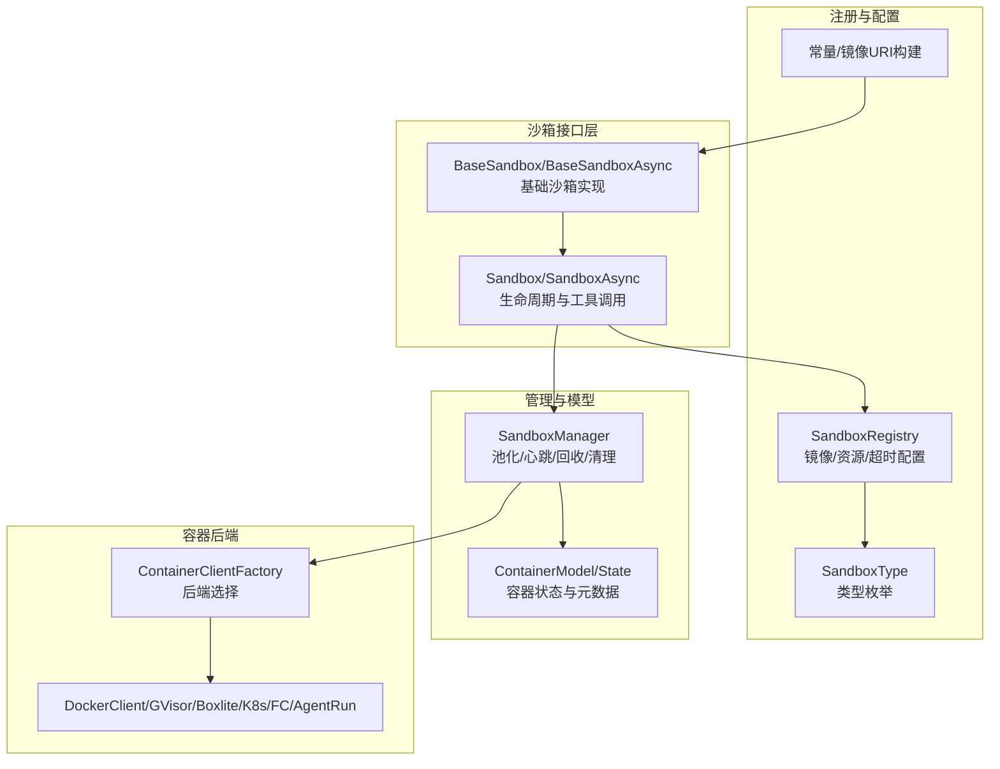
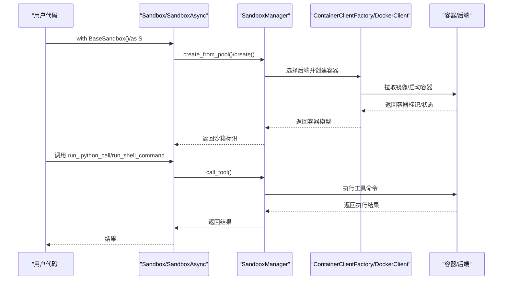
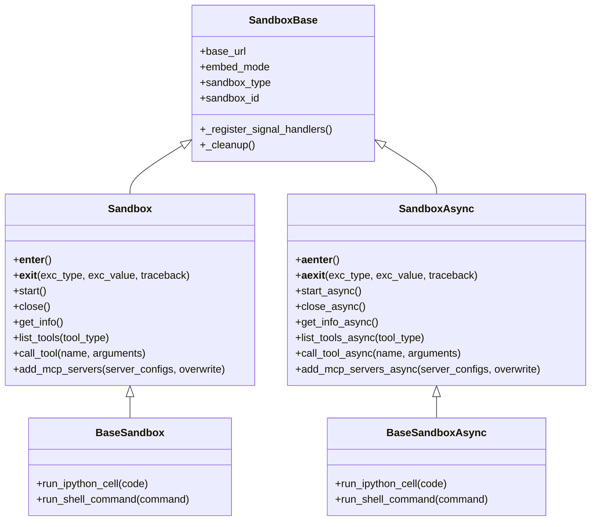
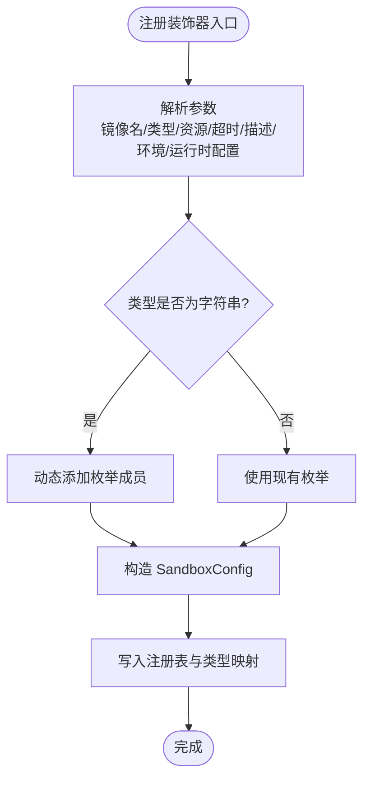
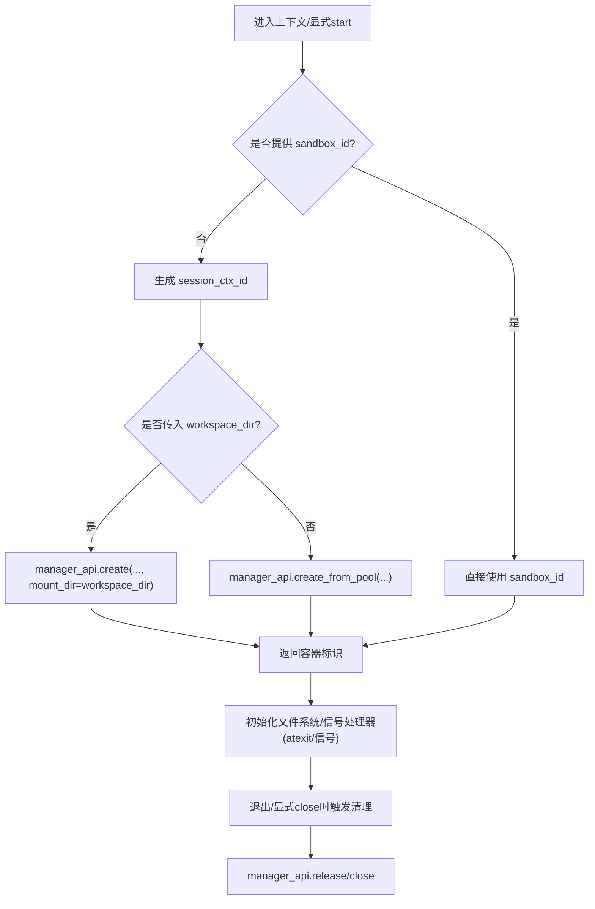
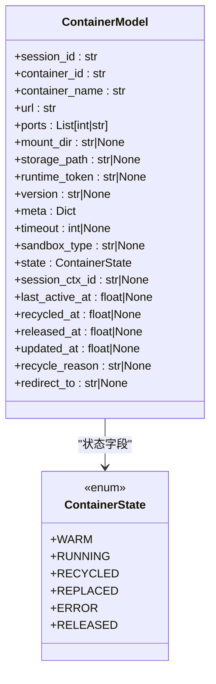
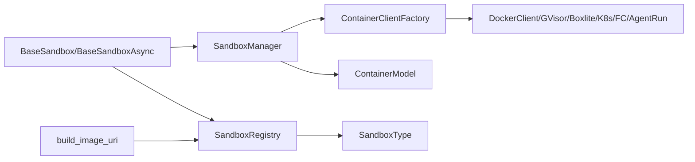

# 基础沙箱

<cite>
**本文引用的文件**
- [src/agentscope_runtime/sandbox/box/base/base_sandbox.py](file://src/agentscope_runtime/sandbox/box/base/base_sandbox.py)
- [src/agentscope_runtime/sandbox/box/sandbox.py](file://src/agentscope_runtime/sandbox/box/sandbox.py)
- [src/agentscope_runtime/sandbox/registry.py](file://src/agentscope_runtime/sandbox/registry.py)
- [src/agentscope_runtime/sandbox/enums.py](file://src/agentscope_runtime/sandbox/enums.py)
- [src/agentscope_runtime/sandbox/utils.py](file://src/agentscope_runtime/sandbox/utils.py)
- [src/agentscope_runtime/sandbox/constant.py](file://src/agentscope_runtime/sandbox/constant.py)
- [src/agentscope_runtime/sandbox/model/container.py](file://src/agentscope_runtime/sandbox/model/container.py)
- [src/agentscope_runtime/sandbox/manager/sandbox_manager.py](file://src/agentscope_runtime/sandbox/manager/sandbox_manager.py)
- [src/agentscope_runtime/common/container_clients/__init__.py](file://src/agentscope_runtime/common/container_clients/__init__.py)
- [src/agentscope_runtime/engine/services/sandbox/__init__.py](file://src/agentscope_runtime/engine/services/sandbox/__init__.py)
- [cookbook/zh/sandbox/sandbox.md](file://cookbook/zh/sandbox/sandbox.md)
- [cookbook/en/sandbox/advanced.md](file://cookbook/en/sandbox/advanced.md)
- [tests/sandbox/test_heartbeat_timeout_restore.py](file://tests/sandbox/test_heartbeat_timeout_restore.py)
</cite>

## 目录
1. [简介](#简介)
2. [项目结构](#项目结构)
3. [核心组件](#核心组件)
4. [架构总览](#架构总览)
5. [详细组件分析](#详细组件分析)
6. [依赖分析](#依赖分析)
7. [性能考虑](#性能考虑)
8. [故障排查指南](#故障排查指南)
9. [结论](#结论)
10. [附录](#附录)

## 简介
基础沙箱是 AgentScope Runtime 中最通用的隔离执行环境，面向“Python 代码执行”和“Shell 命令执行”的通用场景。它通过容器化隔离机制提供安全、可复用、可扩展的运行时环境，并以统一的工具调用接口对外暴露能力。基础沙箱既支持本地嵌入式运行，也支持远程 API 调用，便于在单机开发与分布式部署之间灵活切换。

## 项目结构
围绕基础沙箱的关键代码分布在以下模块：
- box 层：封装同步/异步沙箱接口与生命周期管理
- registry：注册表与类型枚举，负责镜像与资源配置
- manager：沙箱管理器，负责池化、心跳、回收、清理等生命周期管理
- model：容器状态与配置的数据模型
- common/container_clients：容器后端适配工厂（Docker/gVisor/BoxLite/K8s/FC/AgentRun）
- engine/services/sandbox：服务层入口（懒加载）

图表来源
- [src/agentscope_runtime/sandbox/box/sandbox.py:148-313](file://src/agentscope_runtime/sandbox/box/sandbox.py#L148-L313)
- [src/agentscope_runtime/sandbox/box/base/base_sandbox.py:18-102](file://src/agentscope_runtime/sandbox/box/base/base_sandbox.py#L18-L102)
- [src/agentscope_runtime/sandbox/registry.py:33-131](file://src/agentscope_runtime/sandbox/registry.py#L33-L131)
- [src/agentscope_runtime/sandbox/enums.py:61-80](file://src/agentscope_runtime/sandbox/enums.py#L61-L80)
- [src/agentscope_runtime/sandbox/manager/sandbox_manager.py:140-340](file://src/agentscope_runtime/sandbox/manager/sandbox_manager.py#L140-L340)
- [src/agentscope_runtime/sandbox/model/container.py:19-158](file://src/agentscope_runtime/sandbox/model/container.py#L19-L158)
- [src/agentscope_runtime/common/container_clients/__init__.py:32-56](file://src/agentscope_runtime/common/container_clients/__init__.py#L32-L56)

章节来源
- [src/agentscope_runtime/sandbox/box/base/base_sandbox.py:18-102](file://src/agentscope_runtime/sandbox/box/base/base_sandbox.py#L18-L102)
- [src/agentscope_runtime/sandbox/box/sandbox.py:148-313](file://src/agentscope_runtime/sandbox/box/sandbox.py#L148-L313)
- [src/agentscope_runtime/sandbox/registry.py:33-131](file://src/agentscope_runtime/sandbox/registry.py#L33-L131)
- [src/agentscope_runtime/sandbox/enums.py:61-80](file://src/agentscope_runtime/sandbox/enums.py#L61-L80)
- [src/agentscope_runtime/sandbox/utils.py:11-59](file://src/agentscope_runtime/sandbox/utils.py#L11-L59)
- [src/agentscope_runtime/sandbox/constant.py:8-32](file://src/agentscope_runtime/sandbox/constant.py#L8-L32)
- [src/agentscope_runtime/sandbox/model/container.py:19-158](file://src/agentscope_runtime/sandbox/model/container.py#L19-L158)
- [src/agentscope_runtime/sandbox/manager/sandbox_manager.py:140-340](file://src/agentscope_runtime/sandbox/manager/sandbox_manager.py#L140-L340)
- [src/agentscope_runtime/common/container_clients/__init__.py:32-56](file://src/agentscope_runtime/common/container_clients/__init__.py#L32-L56)

## 核心组件
- 基础沙箱类：提供 run_ipython_cell 与 run_shell_command 等工具调用方法，封装同步与异步两种形态
- 注册表与类型：通过装饰器注册镜像、资源限制、超时、描述等配置，并维护类型到类的映射
- 沙箱管理器：负责容器池化、心跳扫描、回收与释放、清理等生命周期管理
- 容器模型：描述容器标识、状态、挂载、存储、超时、元信息等字段
- 容器客户端工厂：按 CONTAINER_DEPLOYMENT 选择后端（Docker/gVisor/BoxLite/K8s/FC/AgentRun）

章节来源
- [src/agentscope_runtime/sandbox/box/base/base_sandbox.py:18-102](file://src/agentscope_runtime/sandbox/box/base/base_sandbox.py#L18-L102)
- [src/agentscope_runtime/sandbox/registry.py:33-131](file://src/agentscope_runtime/sandbox/registry.py#L33-L131)
- [src/agentscope_runtime/sandbox/manager/sandbox_manager.py:508-704](file://src/agentscope_runtime/sandbox/manager/sandbox_manager.py#L508-L704)
- [src/agentscope_runtime/sandbox/model/container.py:19-158](file://src/agentscope_runtime/sandbox/model/container.py#L19-L158)
- [src/agentscope_runtime/common/container_clients/__init__.py:32-56](file://src/agentscope_runtime/common/container_clients/__init__.py#L32-L56)

## 架构总览
基础沙箱采用“接口层 + 注册表 + 管理器 + 客户端工厂”的分层设计：
- 接口层：Sandbox/SandboxAsync 提供统一的生命周期与工具调用接口
- 注册表：SandboxRegistry 统一管理镜像、资源、超时、环境变量等配置
- 管理器：SandboxManager 实现池化、心跳、回收、清理、远程/本地双模
- 客户端工厂：ContainerClientFactory 根据部署类型选择具体容器后端

图表来源
- [src/agentscope_runtime/sandbox/box/sandbox.py:148-220](file://src/agentscope_runtime/sandbox/box/sandbox.py#L148-L220)
- [src/agentscope_runtime/sandbox/manager/sandbox_manager.py:592-704](file://src/agentscope_runtime/sandbox/manager/sandbox_manager.py#L592-L704)
- [src/agentscope_runtime/common/container_clients/__init__.py:32-56](file://src/agentscope_runtime/common/container_clients/__init__.py#L32-L56)

## 详细组件分析

### 基础沙箱类与工具调用
- BaseSandbox/BaseSandboxAsync：继承自 SandboxBase，分别提供同步与异步的上下文管理与工具调用
- run_ipython_cell：在 IPython 环境中执行 Python 代码
- run_shell_command：在沙箱中执行 Shell 命令
- 注册装饰器：通过 SandboxRegistry.register 注册镜像名、类型、安全等级、超时、描述等

图表来源
- [src/agentscope_runtime/sandbox/box/sandbox.py:18-313](file://src/agentscope_runtime/sandbox/box/sandbox.py#L18-L313)
- [src/agentscope_runtime/sandbox/box/base/base_sandbox.py:18-102](file://src/agentscope_runtime/sandbox/box/base/base_sandbox.py#L18-L102)

章节来源
- [src/agentscope_runtime/sandbox/box/base/base_sandbox.py:18-102](file://src/agentscope_runtime/sandbox/box/base/base_sandbox.py#L18-L102)
- [src/agentscope_runtime/sandbox/box/sandbox.py:148-313](file://src/agentscope_runtime/sandbox/box/sandbox.py#L148-L313)

### 注册表与类型系统
- SandboxRegistry.register：装饰器，注册镜像名、类型、资源限制、安全等级、超时、描述、环境变量、运行时配置
- SandboxType：动态枚举，内置基础类型（BASE/BASE_ASYNC 等），支持动态扩展
- build_image_uri：根据镜像名、标签、注册表、命名空间生成完整镜像 URI

图表来源
- [src/agentscope_runtime/sandbox/registry.py:39-91](file://src/agentscope_runtime/sandbox/registry.py#L39-L91)
- [src/agentscope_runtime/sandbox/enums.py:19-59](file://src/agentscope_runtime/sandbox/enums.py#L19-L59)
- [src/agentscope_runtime/sandbox/utils.py:11-59](file://src/agentscope_runtime/sandbox/utils.py#L11-L59)

章节来源
- [src/agentscope_runtime/sandbox/registry.py:33-131](file://src/agentscope_runtime/sandbox/registry.py#L33-L131)
- [src/agentscope_runtime/sandbox/enums.py:61-80](file://src/agentscope_runtime/sandbox/enums.py#L61-L80)
- [src/agentscope_runtime/sandbox/utils.py:11-59](file://src/agentscope_runtime/sandbox/utils.py#L11-L59)

### 沙箱管理器与生命周期
- create_from_pool/create：从池中取出或新建容器，绑定会话上下文，处理版本与状态校验
- cleanup：销毁池中与映射中的非终止容器
- start_watcher/stop_watcher：后台心跳扫描线程，周期性扫描心跳、池化与释放回收
- 远程包装器：remote_wrapper/remote_wrapper_async，支持本地直连与远程 HTTP 调用

图表来源
- [src/agentscope_runtime/sandbox/box/sandbox.py:148-194](file://src/agentscope_runtime/sandbox/box/sandbox.py#L148-L194)
- [src/agentscope_runtime/sandbox/manager/sandbox_manager.py:592-704](file://src/agentscope_runtime/sandbox/manager/sandbox_manager.py#L592-L704)

章节来源
- [src/agentscope_runtime/sandbox/box/sandbox.py:148-313](file://src/agentscope_runtime/sandbox/box/sandbox.py#L148-L313)
- [src/agentscope_runtime/sandbox/manager/sandbox_manager.py:444-590](file://src/agentscope_runtime/sandbox/manager/sandbox_manager.py#L444-L590)

### 容器模型与状态
- ContainerModel：描述容器标识、名称、URL、占用端口、挂载目录、存储路径、运行时令牌、镜像版本、元信息、超时、类型、状态、心跳时间戳、回收/释放时间、重定向目标等
- ContainerState：容器生命周期状态集合（warm/running/recycled/replaced/error/released）

图表来源
- [src/agentscope_runtime/sandbox/model/container.py:19-158](file://src/agentscope_runtime/sandbox/model/container.py#L19-L158)

章节来源
- [src/agentscope_runtime/sandbox/model/container.py:19-158](file://src/agentscope_runtime/sandbox/model/container.py#L19-L158)

### 容器后端与部署
- ContainerClientFactory：根据 CONTAINER_DEPLOYMENT 选择后端（docker/k8s/knative/kruise/fc/agentrun/gvisor/boxlite）
- 支持多后端对比：Docker/gVisor/BoxLite/K8s/FC/AgentRun 等，涵盖隔离强度、启动时间、是否需要守护进程、OCI 支持、可嵌入性、操作系统支持等

章节来源
- [src/agentscope_runtime/common/container_clients/__init__.py:32-56](file://src/agentscope_runtime/common/container_clients/__init__.py#L32-L56)
- [cookbook/en/sandbox/advanced.md:129-143](file://cookbook/en/sandbox/advanced.md#L129-L143)

### 服务层与懒加载
- engine/services/sandbox/__init__.py：对 SandboxService/SandboxServiceFactory 进行懒加载，避免不必要的导入成本

章节来源
- [src/agentscope_runtime/engine/services/sandbox/__init__.py:1-15](file://src/agentscope_runtime/engine/services/sandbox/__init__.py#L1-L15)

## 依赖分析
- 基础沙箱依赖注册表与类型系统，确保镜像与资源配置一致
- 管理器依赖容器客户端工厂，按部署类型选择后端
- 接口层通过管理器统一暴露工具调用，屏蔽远程/本地差异
- 容器模型为管理器提供状态与元信息支撑

图表来源
- [src/agentscope_runtime/sandbox/box/base/base_sandbox.py:11-17](file://src/agentscope_runtime/sandbox/box/base/base_sandbox.py#L11-L17)
- [src/agentscope_runtime/sandbox/registry.py:33-131](file://src/agentscope_runtime/sandbox/registry.py#L33-L131)
- [src/agentscope_runtime/sandbox/manager/sandbox_manager.py:246-251](file://src/agentscope_runtime/sandbox/manager/sandbox_manager.py#L246-L251)
- [src/agentscope_runtime/common/container_clients/__init__.py:32-56](file://src/agentscope_runtime/common/container_clients/__init__.py#L32-L56)
- [src/agentscope_runtime/sandbox/model/container.py:19-158](file://src/agentscope_runtime/sandbox/model/container.py#L19-L158)
- [src/agentscope_runtime/sandbox/utils.py:11-59](file://src/agentscope_runtime/sandbox/utils.py#L11-L59)

章节来源
- [src/agentscope_runtime/sandbox/box/base/base_sandbox.py:11-17](file://src/agentscope_runtime/sandbox/box/base/base_sandbox.py#L11-L17)
- [src/agentscope_runtime/sandbox/registry.py:33-131](file://src/agentscope_runtime/sandbox/registry.py#L33-L131)
- [src/agentscope_runtime/sandbox/manager/sandbox_manager.py:246-251](file://src/agentscope_runtime/sandbox/manager/sandbox_manager.py#L246-L251)
- [src/agentscope_runtime/common/container_clients/__init__.py:32-56](file://src/agentscope_runtime/common/container_clients/__init__.py#L32-L56)
- [src/agentscope_runtime/sandbox/model/container.py:19-158](file://src/agentscope_runtime/sandbox/model/container.py#L19-L158)
- [src/agentscope_runtime/sandbox/utils.py:11-59](file://src/agentscope_runtime/sandbox/utils.py#L11-L59)

## 性能考虑
- 池化策略：优先从池中取出已 Warm 的容器，减少启动延迟；若池为空或不合法则新建
- 心跳与回收：通过后台 watcher 周期扫描，及时回收长时间无心跳的容器，降低资源占用
- 超时与限制：通过 TIMEOUT 与资源限制（内存/CPU）控制容器行为，避免资源滥用
- 后端选择：在本地开发可选 Docker/gVisor/BoxLite；大规模生产推荐 K8s/FC/ACK 等托管后端

章节来源
- [src/agentscope_runtime/sandbox/manager/sandbox_manager.py:592-704](file://src/agentscope_runtime/sandbox/manager/sandbox_manager.py#L592-L704)
- [src/agentscope_runtime/sandbox/constant.py:30-32](file://src/agentscope_runtime/sandbox/constant.py#L30-L32)
- [cookbook/en/sandbox/advanced.md:129-143](file://cookbook/en/sandbox/advanced.md#L129-L143)

## 故障排查指南
- 容器不可用/池耗尽：检查池大小与实例上限，确认 watcher 是否正常扫描与回收
- 远程调用失败：检查 base_url 与 bearer_token，确认网络可达与鉴权头正确
- 镜像拉取缓慢：可通过环境变量切换官方镜像注册表，或提前本地缓存镜像
- 心跳超时导致回收：适当调整 watcher 扫描间隔与心跳超时，确保业务在超时前完成续活

章节来源
- [src/agentscope_runtime/sandbox/manager/sandbox_manager.py:344-442](file://src/agentscope_runtime/sandbox/manager/sandbox_manager.py#L344-L442)
- [tests/sandbox/test_heartbeat_timeout_restore.py:34-67](file://tests/sandbox/test_heartbeat_timeout_restore.py#L34-L67)
- [src/agentscope_runtime/sandbox/constant.py:8-32](file://src/agentscope_runtime/sandbox/constant.py#L8-L32)

## 结论
基础沙箱以简洁稳定的接口与完善的生命周期管理，为 AgentScope Runtime 提供了通用、可扩展、可移植的隔离执行环境。通过注册表与类型系统，它实现了镜像与资源配置的一致化；通过管理器与池化策略，兼顾了性能与资源利用率；通过多后端适配，满足从本地开发到大规模生产的多样化部署需求。

## 附录

### 配置参数与环境变量
- RUNTIME_SANDBOX_REGISTRY：镜像注册表，默认空表示使用 Docker Hub，可切换至官方 ACR
- RUNTIME_SANDBOX_IMAGE_NAMESPACE：镜像命名空间
- RUNTIME_SANDBOX_IMAGE_TAG：镜像标签
- RUNTIME_SANDBOX_TIMEOUT：HTTP 超时（秒）
- CONTAINER_DEPLOYMENT：容器后端选择（docker/k8s/knative/kruise/fc/agentrun/gvisor/boxlite）

章节来源
- [src/agentscope_runtime/sandbox/constant.py:8-32](file://src/agentscope_runtime/sandbox/constant.py#L8-L32)
- [cookbook/en/sandbox/advanced.md:129-143](file://cookbook/en/sandbox/advanced.md#L129-L143)

### 启动流程与生命周期
- 同步：with BaseSandbox() as s → 创建/取池 → 初始化文件系统/信号 → 工具调用 → 清理
- 异步：async with BaseSandboxAsync() as s → 创建/取池 → 初始化文件系统/信号 → 工具调用 → 清理
- 远程：通过 base_url 与 bearer_token 连接远端 SandboxManager，走 HTTP 路径

章节来源
- [src/agentscope_runtime/sandbox/box/sandbox.py:148-313](file://src/agentscope_runtime/sandbox/box/sandbox.py#L148-L313)
- [src/agentscope_runtime/sandbox/manager/sandbox_manager.py:508-704](file://src/agentscope_runtime/sandbox/manager/sandbox_manager.py#L508-L704)

### 使用示例（路径指引）
- 基础沙箱创建与工具调用：见“沙箱使用”示例章节
- 连接远程沙箱：见“连接到远程沙箱”示例章节
- 添加 MCP 服务器：见“向沙箱添加MCP服务器”示例章节

章节来源
- [cookbook/zh/sandbox/sandbox.md:107-148](file://cookbook/zh/sandbox/sandbox.md#L107-L148)
- [cookbook/zh/sandbox/sandbox.md:363-388](file://cookbook/zh/sandbox/sandbox.md#L363-L388)
- [cookbook/zh/sandbox/sandbox.md:326-362](file://cookbook/zh/sandbox/sandbox.md#L326-L362)