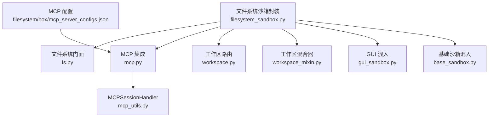
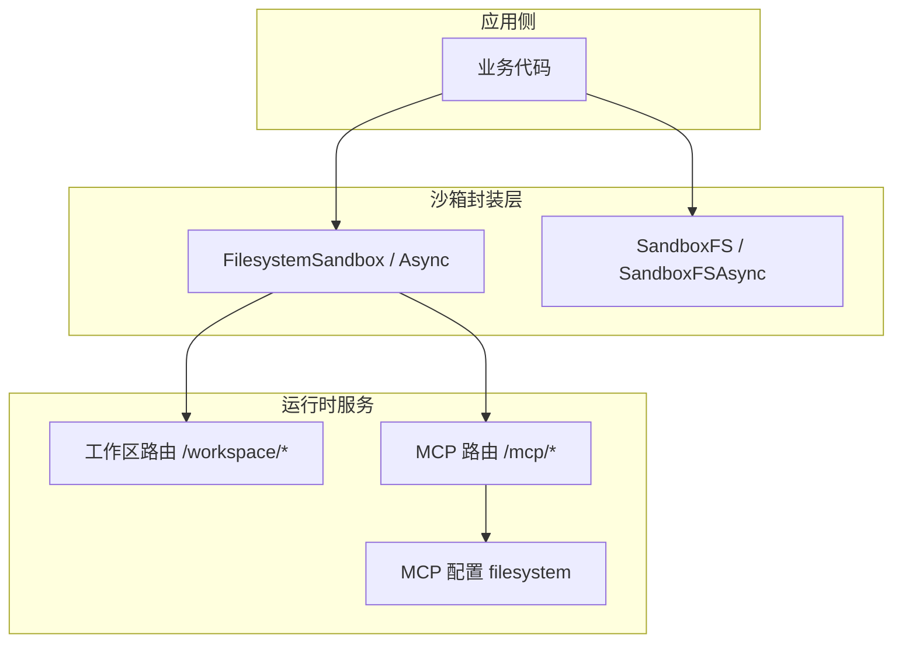
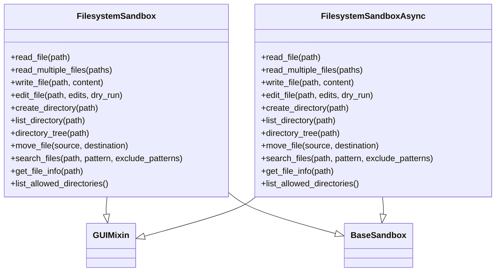
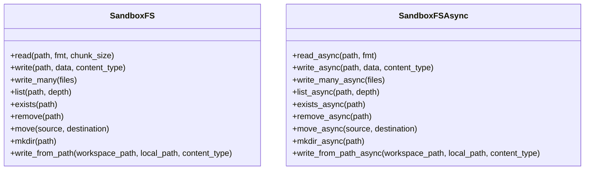
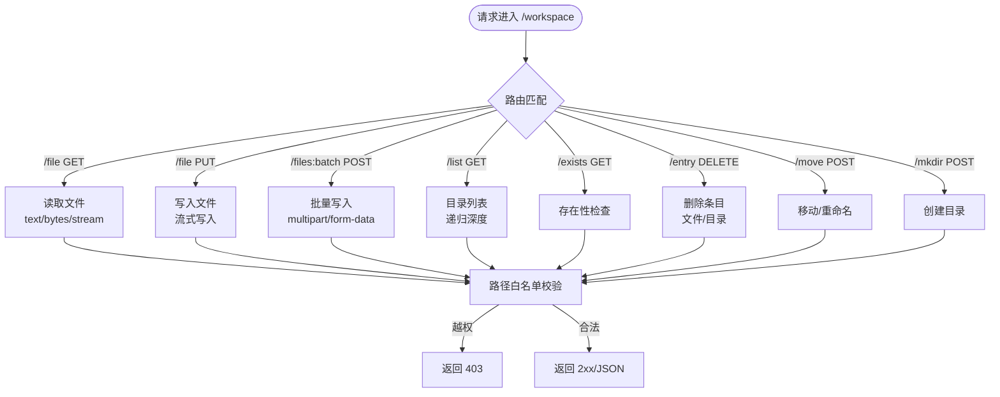
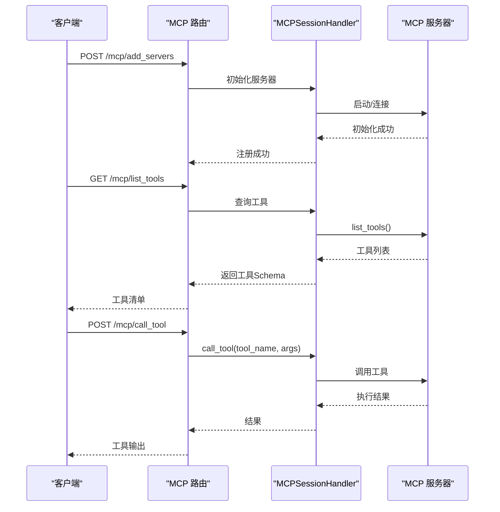
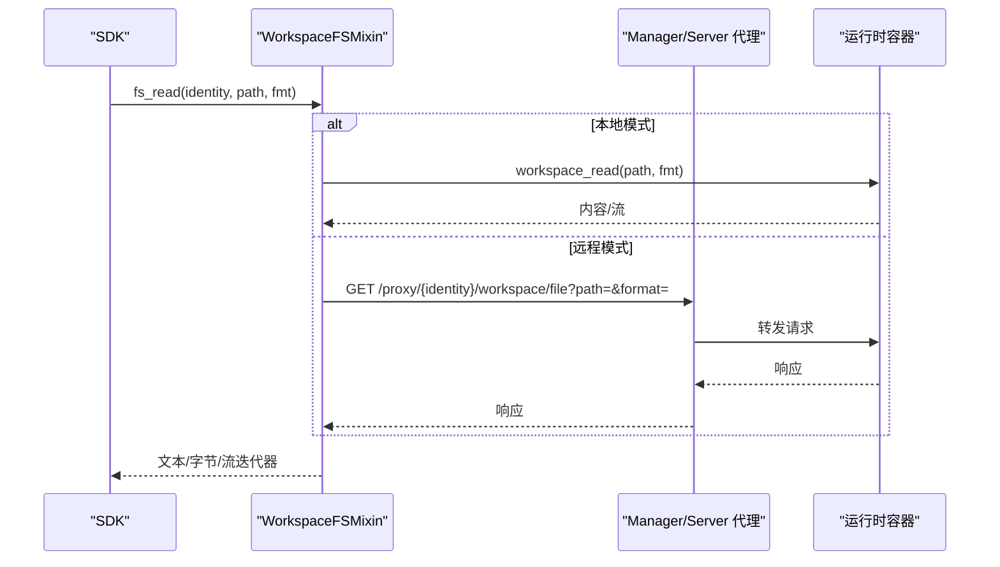
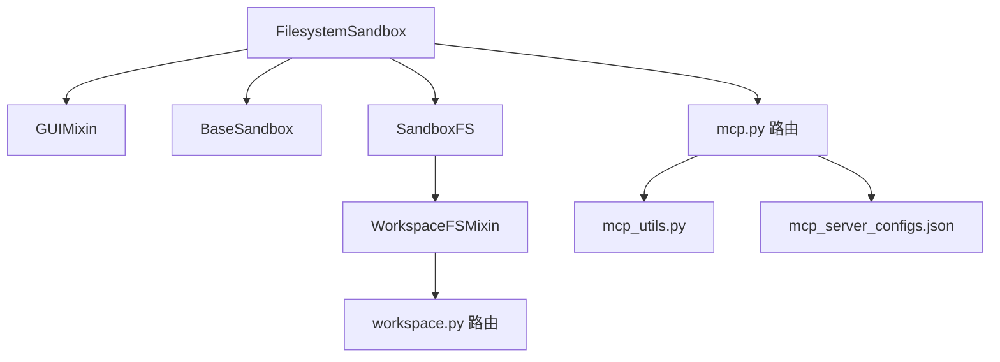

# 文件系统沙箱

<cite>
**本文引用的文件**
- [filesystem_sandbox.py](file://src/agentscope_runtime/sandbox/box/filesystem/filesystem_sandbox.py)
- [fs.py](file://src/agentscope_runtime/sandbox/box/components/fs.py)
- [workspace.py](file://src/agentscope_runtime/sandbox/box/shared/routers/workspace.py)
- [mcp.py](file://src/agentscope_runtime/sandbox/box/shared/routers/mcp.py)
- [mcp_utils.py](file://src/agentscope_runtime/sandbox/box/shared/routers/mcp_utils.py)
- [mcp_server_configs.json（文件系统）](file://src/agentscope_runtime/sandbox/box/filesystem/box/mcp_server_configs.json)
- [base_sandbox.py](file://src/agentscope_runtime/sandbox/box/base/base_sandbox.py)
- [gui_sandbox.py](file://src/agentscope_runtime/sandbox/box/gui/gui_sandbox.py)
- [workspace_mixin.py](file://src/agentscope_runtime/sandbox/manager/workspace_mixin.py)
- [sandbox.md（中文教程）](file://cookbook/zh/sandbox/sandbox.md)
</cite>

## 目录
1. [简介](#简介)
2. [项目结构](#项目结构)
3. [核心组件](#核心组件)
4. [架构总览](#架构总览)
5. [详细组件分析](#详细组件分析)
6. [依赖关系分析](#依赖关系分析)
7. [性能考虑](#性能考虑)
8. [故障排查指南](#故障排查指南)
9. [结论](#结论)
10. [附录](#附录)

## 简介
文件系统沙箱提供在隔离环境中对工作区文件系统的安全读写与管理能力，结合 MCP（模型上下文协议）服务器实现工具化扩展。它既支持同步接口，也提供异步接口，便于在不同运行场景中高效完成文件上传下载、目录遍历、文件内容处理与权限控制。

## 项目结构
文件系统沙箱相关代码主要分布在以下模块：
- 沙箱封装层：提供面向用户的文件系统操作接口
- 工作区路由层：FastAPI 路由实现文件系统 CRUD、目录遍历、移动与存在性检查
- MCP 集成层：MCP 服务器注册、工具列举与调用
- 工作区混合器：SDK 模式下的同步/异步工作区文件系统 API
- 示例与配置：文件系统 MCP 服务器配置

**图表来源**
- [filesystem_sandbox.py:1-254](file://src/agentscope_runtime/sandbox/box/filesystem/filesystem_sandbox.py#L1-L254)
- [fs.py:1-279](file://src/agentscope_runtime/sandbox/box/components/fs.py#L1-L279)
- [workspace.py:1-394](file://src/agentscope_runtime/sandbox/box/shared/routers/workspace.py#L1-L394)
- [mcp.py:1-208](file://src/agentscope_runtime/sandbox/box/shared/routers/mcp.py#L1-L208)
- [mcp_utils.py:1-188](file://src/agentscope_runtime/sandbox/box/shared/routers/mcp_utils.py#L1-L188)
- [mcp_server_configs.json（文件系统）:1-12](file://src/agentscope_runtime/sandbox/box/filesystem/box/mcp_server_configs.json#L1-L12)
- [gui_sandbox.py:1-240](file://src/agentscope_runtime/sandbox/box/gui/gui_sandbox.py#L1-L240)
- [base_sandbox.py:1-102](file://src/agentscope_runtime/sandbox/box/base/base_sandbox.py#L1-L102)
- [workspace_mixin.py:1-702](file://src/agentscope_runtime/sandbox/manager/workspace_mixin.py#L1-L702)

**章节来源**
- [filesystem_sandbox.py:1-254](file://src/agentscope_runtime/sandbox/box/filesystem/filesystem_sandbox.py#L1-L254)
- [workspace.py:1-394](file://src/agentscope_runtime/sandbox/box/shared/routers/workspace.py#L1-L394)
- [mcp.py:1-208](file://src/agentscope_runtime/sandbox/box/shared/routers/mcp.py#L1-L208)
- [mcp_utils.py:1-188](file://src/agentscope_runtime/sandbox/box/shared/routers/mcp_utils.py#L1-L188)
- [mcp_server_configs.json（文件系统）:1-12](file://src/agentscope_runtime/sandbox/box/filesystem/box/mcp_server_configs.json#L1-L12)
- [gui_sandbox.py:1-240](file://src/agentscope_runtime/sandbox/box/gui/gui_sandbox.py#L1-L240)
- [base_sandbox.py:1-102](file://src/agentscope_runtime/sandbox/box/base/base_sandbox.py#L1-L102)
- [workspace_mixin.py:1-702](file://src/agentscope_runtime/sandbox/manager/workspace_mixin.py#L1-L702)

## 核心组件
- 文件系统沙箱封装（同步/异步）
  - 提供文件读取、多文件读取、写入、编辑、目录创建、目录列表、目录树、移动、搜索、文件信息查询、允许访问目录列表等接口
- 文件系统门面（SandboxFS/SandboxFSAsync）
  - 为 SDK 提供统一的文件系统读写/批量上传/目录操作/移动/存在性检查等 API，支持流式上传与下载
- 工作区路由（FastAPI）
  - 实现 /workspace 下的文件读取、写入、批量写入、目录列表、存在性检查、删除、移动、创建目录等接口，并内置路径白名单校验
- MCP 集成
  - 通过 /mcp/* 路由注册 MCP 服务器、列举工具、调用工具；默认加载 filesystem MCP 服务器配置
- GUI 混入
  - 提供桌面 URL 生成能力（与文件系统沙箱结合时可访问桌面环境）

**章节来源**
- [filesystem_sandbox.py:37-156](file://src/agentscope_runtime/sandbox/box/filesystem/filesystem_sandbox.py#L37-L156)
- [filesystem_sandbox.py:183-253](file://src/agentscope_runtime/sandbox/box/filesystem/filesystem_sandbox.py#L183-L253)
- [fs.py:17-136](file://src/agentscope_runtime/sandbox/box/components/fs.py#L17-L136)
- [fs.py:138-279](file://src/agentscope_runtime/sandbox/box/components/fs.py#L138-L279)
- [workspace.py:197-394](file://src/agentscope_runtime/sandbox/box/shared/routers/workspace.py#L197-L394)
- [mcp.py:24-208](file://src/agentscope_runtime/sandbox/box/shared/routers/mcp.py#L24-L208)
- [mcp_utils.py:32-188](file://src/agentscope_runtime/sandbox/box/shared/routers/mcp_utils.py#L32-L188)
- [gui_sandbox.py:17-63](file://src/agentscope_runtime/sandbox/box/gui/gui_sandbox.py#L17-L63)

## 架构总览
文件系统沙箱通过“沙箱封装层”对外暴露统一接口，内部通过“工作区路由层”与“MCP 集成层”协同工作。SDK 模式下，可通过“工作区混合器”在本地或远程模式下透明地调用工作区文件系统 API。

**图表来源**
- [filesystem_sandbox.py:1-254](file://src/agentscope_runtime/sandbox/box/filesystem/filesystem_sandbox.py#L1-L254)
- [fs.py:1-279](file://src/agentscope_runtime/sandbox/box/components/fs.py#L1-L279)
- [workspace.py:1-394](file://src/agentscope_runtime/sandbox/box/shared/routers/workspace.py#L1-L394)
- [mcp.py:1-208](file://src/agentscope_runtime/sandbox/box/shared/routers/mcp.py#L1-L208)
- [mcp_server_configs.json（文件系统）:1-12](file://src/agentscope_runtime/sandbox/box/filesystem/box/mcp_server_configs.json#L1-L12)

## 详细组件分析

### 文件系统沙箱封装（同步/异步）
- 同步封装：FilesystemSandbox 继承 GUIMixin 与 BaseSandbox，提供 read_file、read_multiple_files、write_file、edit_file、create_directory、list_directory、directory_tree、move_file、search_files、get_file_info、list_allowed_directories 等方法
- 异步封装：FilesystemSandboxAsync 提供对应的异步方法，便于高并发场景

**图表来源**
- [filesystem_sandbox.py:20-156](file://src/agentscope_runtime/sandbox/box/filesystem/filesystem_sandbox.py#L20-L156)
- [filesystem_sandbox.py:166-253](file://src/agentscope_runtime/sandbox/box/filesystem/filesystem_sandbox.py#L166-L253)
- [gui_sandbox.py:17-63](file://src/agentscope_runtime/sandbox/box/gui/gui_sandbox.py#L17-L63)
- [base_sandbox.py:18-33](file://src/agentscope_runtime/sandbox/box/base/base_sandbox.py#L18-L33)

**章节来源**
- [filesystem_sandbox.py:20-253](file://src/agentscope_runtime/sandbox/box/filesystem/filesystem_sandbox.py#L20-L253)
- [gui_sandbox.py:17-63](file://src/agentscope_runtime/sandbox/box/gui/gui_sandbox.py#L17-L63)
- [base_sandbox.py:18-33](file://src/agentscope_runtime/sandbox/box/base/base_sandbox.py#L18-L33)

### 文件系统门面（SandboxFS / SandboxFSAsync）
- 同步门面：SandboxFS 提供 read/write/write_many/list/exists/remove/move/mkdir/write_from_path 等方法，内部委托给 SandboxManager 的 fs_* 接口
- 异步门面：SandboxFSAsync 提供对应异步方法，支持流式上传与下载

**图表来源**
- [fs.py:17-136](file://src/agentscope_runtime/sandbox/box/components/fs.py#L17-L136)
- [fs.py:138-279](file://src/agentscope_runtime/sandbox/box/components/fs.py#L138-L279)

**章节来源**
- [fs.py:17-279](file://src/agentscope_runtime/sandbox/box/components/fs.py#L17-L279)

### 工作区路由（/workspace/*）
- 路由职责：提供文件读取、写入、批量写入、目录列表、存在性检查、删除、移动、创建目录等接口
- 安全控制：ensure_within_workspace 限制访问路径仅限于 WORKSPACE_DIR，防止越权访问
- 性能要点：支持分块读写与流式传输，避免大文件阻塞

**图表来源**
- [workspace.py:197-394](file://src/agentscope_runtime/sandbox/box/shared/routers/workspace.py#L197-L394)

**章节来源**
- [workspace.py:29-47](file://src/agentscope_runtime/sandbox/box/shared/routers/workspace.py#L29-L47)
- [workspace.py:197-394](file://src/agentscope_runtime/sandbox/box/shared/routers/workspace.py#L197-L394)

### MCP 集成（/mcp/*）
- 服务器注册：/mcp/add_servers 支持从配置加载 MCP 服务器，支持覆盖策略
- 工具列举：/mcp/list_tools 将各服务器工具转换为统一 JSON Schema
- 工具调用：/mcp/call_tool 根据工具名转发到对应服务器执行
- 生命周期：startup 事件自动加载配置并初始化服务器；shutdown 清理资源

**图表来源**
- [mcp.py:24-208](file://src/agentscope_runtime/sandbox/box/shared/routers/mcp.py#L24-L208)
- [mcp_utils.py:32-188](file://src/agentscope_runtime/sandbox/box/shared/routers/mcp_utils.py#L32-L188)

**章节来源**
- [mcp.py:24-208](file://src/agentscope_runtime/sandbox/box/shared/routers/mcp.py#L24-L208)
- [mcp_utils.py:32-188](file://src/agentscope_runtime/sandbox/box/shared/routers/mcp_utils.py#L32-L188)

### MCP 服务器配置（文件系统）
- 默认配置：filesystem 服务器通过 npx 启动 @modelcontextprotocol/server-filesystem，绑定工作区根目录
- 配置位置：filesystem/box/mcp_server_configs.json

**章节来源**
- [mcp_server_configs.json（文件系统）:1-12](file://src/agentscope_runtime/sandbox/box/filesystem/box/mcp_server_configs.json#L1-L12)

### SDK 模式下的工作区文件系统 API（WorkspaceFSMixin）
- 作用：在本地嵌入模式与远程代理模式下，统一提供 fs_read/fs_write/fs_list 等 API
- 远程模式：通过 /proxy/{identity}/workspace/* 代理到运行时容器
- 本地模式：直接调用运行时客户端的 workspace_* 方法

**图表来源**
- [workspace_mixin.py:113-403](file://src/agentscope_runtime/sandbox/manager/workspace_mixin.py#L113-L403)

**章节来源**
- [workspace_mixin.py:113-702](file://src/agentscope_runtime/sandbox/manager/workspace_mixin.py#L113-L702)

## 依赖关系分析
- 文件系统沙箱依赖 GUIMixin 与 BaseSandbox，提供桌面 URL 与基础工具能力
- 文件系统门面依赖 SandboxManager 的 fs_* 接口，支持本地与远程两种模式
- 工作区路由依赖 FastAPI，提供安全的文件系统操作接口
- MCP 集成依赖 mcp 库与 MCPSessionHandler，负责服务器生命周期与工具调用

**图表来源**
- [filesystem_sandbox.py:1-254](file://src/agentscope_runtime/sandbox/box/filesystem/filesystem_sandbox.py#L1-L254)
- [gui_sandbox.py:1-240](file://src/agentscope_runtime/sandbox/box/gui/gui_sandbox.py#L1-L240)
- [base_sandbox.py:1-102](file://src/agentscope_runtime/sandbox/box/base/base_sandbox.py#L1-L102)
- [fs.py:1-279](file://src/agentscope_runtime/sandbox/box/components/fs.py#L1-L279)
- [workspace_mixin.py:1-702](file://src/agentscope_runtime/sandbox/manager/workspace_mixin.py#L1-L702)
- [workspace.py:1-394](file://src/agentscope_runtime/sandbox/box/shared/routers/workspace.py#L1-L394)
- [mcp.py:1-208](file://src/agentscope_runtime/sandbox/box/shared/routers/mcp.py#L1-L208)
- [mcp_utils.py:1-188](file://src/agentscope_runtime/sandbox/box/shared/routers/mcp_utils.py#L1-L188)
- [mcp_server_configs.json（文件系统）:1-12](file://src/agentscope_runtime/sandbox/box/filesystem/box/mcp_server_configs.json#L1-L12)

**章节来源**
- [filesystem_sandbox.py:1-254](file://src/agentscope_runtime/sandbox/box/filesystem/filesystem_sandbox.py#L1-L254)
- [gui_sandbox.py:1-240](file://src/agentscope_runtime/sandbox/box/gui/gui_sandbox.py#L1-L240)
- [base_sandbox.py:1-102](file://src/agentscope_runtime/sandbox/box/base/base_sandbox.py#L1-L102)
- [fs.py:1-279](file://src/agentscope_runtime/sandbox/box/components/fs.py#L1-L279)
- [workspace_mixin.py:1-702](file://src/agentscope_runtime/sandbox/manager/workspace_mixin.py#L1-L702)
- [workspace.py:1-394](file://src/agentscope_runtime/sandbox/box/shared/routers/workspace.py#L1-L394)
- [mcp.py:1-208](file://src/agentscope_runtime/sandbox/box/shared/routers/mcp.py#L1-L208)
- [mcp_utils.py:1-188](file://src/agentscope_runtime/sandbox/box/shared/routers/mcp_utils.py#L1-L188)
- [mcp_server_configs.json（文件系统）:1-12](file://src/agentscope_runtime/sandbox/box/filesystem/box/mcp_server_configs.json#L1-L12)

## 性能考虑
- 流式 I/O
  - 读取：支持 text/bytes/stream 三种格式，stream 模式适合大文件下载
  - 写入：支持字符串、字节、字节数组与文件对象，文件对象可实现流式上传
- 分块传输
  - 工作区路由与 SDK 混合器均采用 1MB 分块，减少内存占用
- 异步接口
  - 异步门面与异步沙箱封装充分利用事件循环，提升并发吞吐
- 远程代理
  - 远程模式通过 /proxy 代理，避免 SDK 直连容器带来的阻塞

**章节来源**
- [workspace.py:26, 91-118, 121-139, 211-228:26-228](file://src/agentscope_runtime/sandbox/box/shared/routers/workspace.py#L26-L228)
- [fs.py:44, 163, 181, 209, 216, 240, 256, 273:44-273](file://src/agentscope_runtime/sandbox/box/components/fs.py#L44-L273)
- [workspace_mixin.py:144-189, 448-484, 493-525, 578-597, 609-613, 631-650, 666-666, 682-697:144-697](file://src/agentscope_runtime/sandbox/manager/workspace_mixin.py#L144-L697)

## 故障排查指南
- 路径越权访问
  - 现象：返回 403 Forbidden
  - 原因：路径不在 WORKSPACE_DIR 下
  - 处理：确保传入路径相对或绝对位于工作区根目录内
- 文件不存在或类型错误
  - 现象：读取返回 404，写入目标为目录返回 409
  - 处理：先检查存在性与类型，再执行操作
- MCP 服务器初始化失败
  - 现象：/mcp/add_servers 返回 500
  - 处理：检查配置文件、命令可用性与网络连通性
- 工具调用异常
  - 现象：/mcp/call_tool 抛出异常
  - 处理：确认工具名存在、参数正确，查看日志重试

**章节来源**
- [workspace.py:41-45, 204-205, 246-250, 301-305, 366-367:41-367](file://src/agentscope_runtime/sandbox/box/shared/routers/workspace.py#L41-L367)
- [mcp.py:70-83, 164-169:70-169](file://src/agentscope_runtime/sandbox/box/shared/routers/mcp.py#L70-L169)

## 结论
文件系统沙箱通过清晰的封装与路由设计，实现了安全可控的文件系统操作，并借助 MCP 协议扩展工具能力。其 SDK 模式下的同步/异步混合器与远程代理机制，兼顾了易用性与可扩展性。配合严格的路径白名单与流式 I/O 设计，能够在保证安全的前提下满足多样化的文件处理需求。

## 附录

### 使用示例（基于接口与路由）
- 文件上传
  - 同步：调用 FilesystemSandbox.write_file 或 SandboxFS.write
  - 异步：调用 FilesystemSandboxAsync.write_file 或 SandboxFSAsync.write_async
  - 路由：PUT /workspace/file
- 文件下载
  - 同步：调用 FilesystemSandbox.read_file 或 SandboxFS.read
  - 异步：调用 FilesystemSandboxAsync.read_file 或 SandboxFSAsync.read_async
  - 路由：GET /workspace/file?format=text|bytes
- 目录遍历
  - 同步：调用 FilesystemSandbox.list_directory 或 SandboxFS.list
  - 异步：调用 FilesystemSandboxAsync.list_directory 或 SandboxFSAsync.list_async
  - 路由：GET /workspace/list?depth=N
- 目录树
  - 同步：调用 FilesystemSandbox.directory_tree
  - 异步：调用 FilesystemSandboxAsync.directory_tree
- 文件移动/重命名
  - 同步：调用 FilesystemSandbox.move_file 或 SandboxFS.move
  - 异步：调用 FilesystemSandboxAsync.move_file 或 SandboxFSAsync.move_async
  - 路由：POST /workspace/move
- 搜索文件
  - 同步：调用 FilesystemSandbox.search_files
  - 异步：调用 FilesystemSandboxAsync.search_files
- 允许访问目录
  - 同步：调用 FilesystemSandbox.list_allowed_directories
  - 异步：调用 FilesystemSandboxAsync.list_allowed_directories

**章节来源**
- [filesystem_sandbox.py:37-156, 183-253:37-253](file://src/agentscope_runtime/sandbox/box/filesystem/filesystem_sandbox.py#L37-L253)
- [fs.py:38-136, 159-279:38-279](file://src/agentscope_runtime/sandbox/box/components/fs.py#L38-L279)
- [workspace.py:197-394](file://src/agentscope_runtime/sandbox/box/shared/routers/workspace.py#L197-L394)
- [sandbox.md（中文教程）:178-202](file://cookbook/zh/sandbox/sandbox.md#L178-L202)

### 安全隔离与访问控制
- 路径白名单：ensure_within_workspace 严格限定访问范围
- 权限控制：仅允许在 WORKSPACE_DIR 内进行文件系统操作
- MCP 服务器：通过配置文件集中管理，支持覆盖与清理

**章节来源**
- [workspace.py:29-47](file://src/agentscope_runtime/sandbox/box/shared/routers/workspace.py#L29-L47)
- [mcp.py:24-83](file://src/agentscope_runtime/sandbox/box/shared/routers/mcp.py#L24-L83)

### 最佳实践
- 优先使用异步接口处理大量文件或高并发场景
- 使用流式上传/下载处理大文件，避免一次性加载到内存
- 在远程模式下，合理设置超时与分块大小
- 通过 MCP 工具扩展能力前，先在本地验证工具可用性与稳定性

**章节来源**
- [workspace.py:26, 91-118, 121-139, 211-228:26-228](file://src/agentscope_runtime/sandbox/box/shared/routers/workspace.py#L26-L228)
- [fs.py:44, 163, 181, 209, 216, 240, 256, 273:44-273](file://src/agentscope_runtime/sandbox/box/components/fs.py#L44-L273)
- [workspace_mixin.py:144-189, 448-484, 493-525, 578-597, 609-613, 631-650, 666-666, 682-697:144-697](file://src/agentscope_runtime/sandbox/manager/workspace_mixin.py#L144-L697)