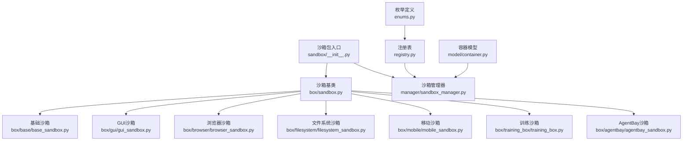
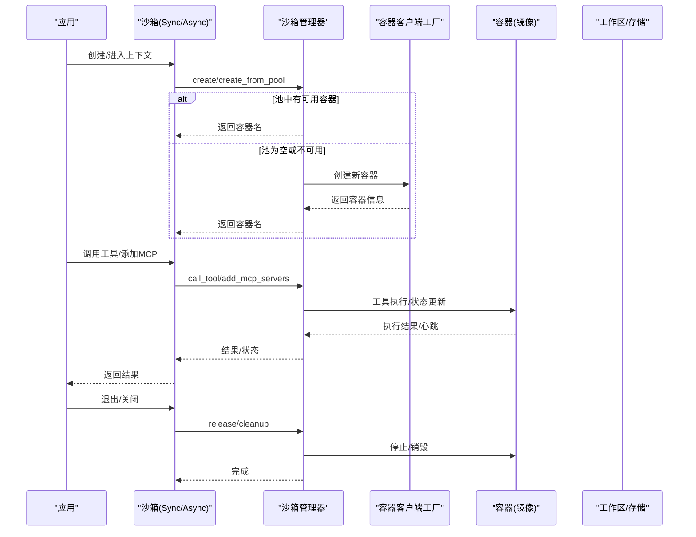
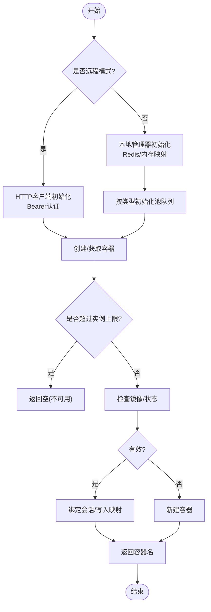
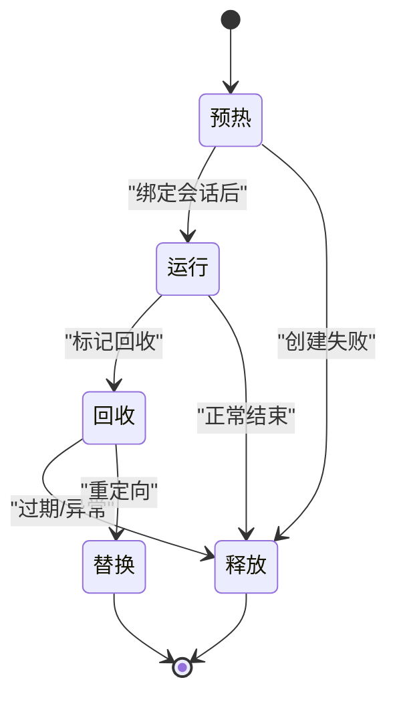
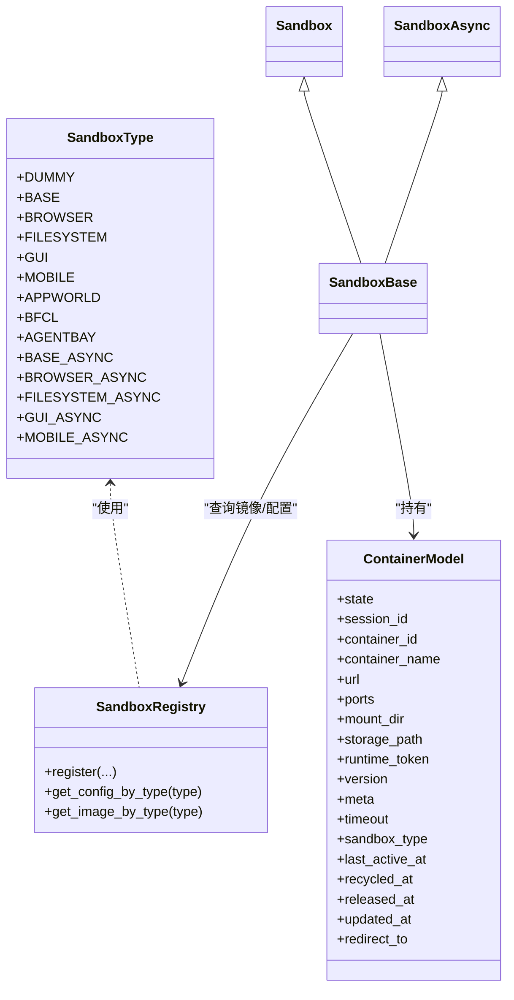

# 沙箱化工具执行

<cite>
**本文引用的文件**
- [src/agentscope_runtime/sandbox/__init__.py](file://src/agentscope_runtime/sandbox/__init__.py)
- [src/agentscope_runtime/sandbox/enums.py](file://src/agentscope_runtime/sandbox/enums.py)
- [src/agentscope_runtime/sandbox/registry.py](file://src/agentscope_runtime/sandbox/registry.py)
- [src/agentscope_runtime/sandbox/model/container.py](file://src/agentscope_runtime/sandbox/model/container.py)
- [src/agentscope_runtime/sandbox/box/sandbox.py](file://src/agentscope_runtime/sandbox/box/sandbox.py)
- [src/agentscope_runtime/sandbox/manager/sandbox_manager.py](file://src/agentscope_runtime/sandbox/manager/sandbox_manager.py)
- [src/agentscope_runtime/sandbox/box/base/base_sandbox.py](file://src/agentscope_runtime/sandbox/box/base/base_sandbox.py)
- [src/agentscope_runtime/sandbox/box/gui/gui_sandbox.py](file://src/agentscope_runtime/sandbox/box/gui/gui_sandbox.py)
- [src/agentscope_runtime/sandbox/box/browser/browser_sandbox.py](file://src/agentscope_runtime/sandbox/box/browser/browser_sandbox.py)
- [src/agentscope_runtime/sandbox/box/filesystem/filesystem_sandbox.py](file://src/agentscope_runtime/sandbox/box/filesystem/filesystem_sandbox.py)
- [src/agentscope_runtime/sandbox/box/mobile/mobile_sandbox.py](file://src/agentscope_runtime/sandbox/box/mobile/mobile_sandbox.py)
- [src/agentscope_runtime/sandbox/box/training_box/training_box.py](file://src/agentscope_runtime/sandbox/box/training_box/training_box.py)
- [src/agentscope_runtime/sandbox/box/agentbay/agentbay_sandbox.py](file://src/agentscope_runtime/sandbox/box/agentbay/agentbay_sandbox.py)
</cite>

## 目录
1. [简介](#简介)
2. [项目结构](#项目结构)
3. [核心组件](#核心组件)
4. [架构总览](#架构总览)
5. [详细组件分析](#详细组件分析)
6. [依赖分析](#依赖分析)
7. [性能考虑](#性能考虑)
8. [故障排除指南](#故障排除指南)
9. [结论](#结论)
10. [附录](#附录)

## 简介
本文件面向AgentScope Runtime的沙箱化工具执行能力，系统性阐述其架构与安全机制，并对七种沙箱类型（基础、GUI、浏览器、文件系统、移动、训练、AgentBay）进行功能与使用场景说明。同时，文档覆盖沙箱管理器的工作原理、容器生命周期管理、状态同步机制、配置指南、安全最佳实践、故障排除与性能优化建议。

## 项目结构
AgentScope Runtime的沙箱体系由“沙箱接口层”“沙箱实现层”“注册表与枚举”“管理器与模型”“客户端与服务端”等模块组成。核心入口在沙箱包导出，统一暴露七类沙箱类型；通过注册表完成镜像与类型的绑定；管理器负责容器生命周期、池化复用、心跳与回收；具体沙箱类型在各自子包中实现，提供面向工具调用的API。

图示来源
- [src/agentscope_runtime/sandbox/__init__.py:1-33](file://src/agentscope_runtime/sandbox/__init__.py#L1-L33)
- [src/agentscope_runtime/sandbox/box/sandbox.py:1-313](file://src/agentscope_runtime/sandbox/box/sandbox.py#L1-L313)
- [src/agentscope_runtime/sandbox/enums.py:61-80](file://src/agentscope_runtime/sandbox/enums.py#L61-L80)
- [src/agentscope_runtime/sandbox/registry.py:33-131](file://src/agentscope_runtime/sandbox/registry.py#L33-L131)
- [src/agentscope_runtime/sandbox/model/container.py:1-158](file://src/agentscope_runtime/sandbox/model/container.py#L1-L158)
- [src/agentscope_runtime/sandbox/manager/sandbox_manager.py:140-520](file://src/agentscope_runtime/sandbox/manager/sandbox_manager.py#L140-L520)

章节来源
- [src/agentscope_runtime/sandbox/__init__.py:1-33](file://src/agentscope_runtime/sandbox/__init__.py#L1-L33)
- [src/agentscope_runtime/sandbox/box/sandbox.py:1-313](file://src/agentscope_runtime/sandbox/box/sandbox.py#L1-L313)

## 核心组件
- 沙箱类型与注册表
  - 通过枚举定义七种内置沙箱类型及异步变体；注册表将类与镜像、资源限制、超时、环境变量、运行时配置等绑定，支持按类型查询镜像与配置。
- 容器模型与状态
  - 定义容器生命周期状态（预热、运行、回收、替换、错误、释放），以及会话上下文、心跳时间戳、重定向目标等元数据。
- 沙箱基类与接口
  - 同步/异步两类沙箱基类，统一支持上下文管理、显式启动/关闭、工具调用、MCP服务器注入、工作区挂载等。
- 沙箱管理器
  - 负责容器池化复用、实例上限控制、健康扫描、心跳扫描、回收清理、远程/本地模式切换、HTTP请求封装等。

章节来源
- [src/agentscope_runtime/sandbox/enums.py:61-80](file://src/agentscope_runtime/sandbox/enums.py#L61-L80)
- [src/agentscope_runtime/sandbox/registry.py:33-131](file://src/agentscope_runtime/sandbox/registry.py#L33-L131)
- [src/agentscope_runtime/sandbox/model/container.py:10-158](file://src/agentscope_runtime/sandbox/model/container.py#L10-L158)
- [src/agentscope_runtime/sandbox/box/sandbox.py:18-313](file://src/agentscope_runtime/sandbox/box/sandbox.py#L18-L313)
- [src/agentscope_runtime/sandbox/manager/sandbox_manager.py:140-520](file://src/agentscope_runtime/sandbox/manager/sandbox_manager.py#L140-L520)

## 架构总览
下图展示从应用到沙箱管理器与容器的交互路径，涵盖同步/异步两种模式、池化获取与创建流程、工具调用链路与状态同步。

图示来源
- [src/agentscope_runtime/sandbox/box/sandbox.py:148-313](file://src/agentscope_runtime/sandbox/box/sandbox.py#L148-L313)
- [src/agentscope_runtime/sandbox/manager/sandbox_manager.py:592-750](file://src/agentscope_runtime/sandbox/manager/sandbox_manager.py#L592-L750)
- [src/agentscope_runtime/sandbox/registry.py:93-131](file://src/agentscope_runtime/sandbox/registry.py#L93-L131)

## 详细组件分析

### 沙箱管理器（生命周期与状态）
- 远程/本地双模
  - 支持通过base_url与Bearer Token以HTTP方式远程调用；否则在嵌入模式下直接使用本地管理器。
- 池化与配额
  - 多类型沙箱池队列，按类型分池；支持最大实例数限制，避免资源耗尽。
- 心跳与回收
  - 后台扫描线程周期扫描心跳、池内容器与已释放资源，触发回收与清理。
- 请求封装
  - 提供同步/异步HTTP封装，自动处理错误与响应解析。
- 清理策略
  - 销毁非终端态容器，优先处理池内预热/运行态，确保资源回收。

图示来源
- [src/agentscope_runtime/sandbox/manager/sandbox_manager.py:140-270](file://src/agentscope_runtime/sandbox/manager/sandbox_manager.py#L140-L270)
- [src/agentscope_runtime/sandbox/manager/sandbox_manager.py:592-750](file://src/agentscope_runtime/sandbox/manager/sandbox_manager.py#L592-L750)
- [src/agentscope_runtime/sandbox/manager/sandbox_manager.py:509-590](file://src/agentscope_runtime/sandbox/manager/sandbox_manager.py#L509-L590)

章节来源
- [src/agentscope_runtime/sandbox/manager/sandbox_manager.py:140-520](file://src/agentscope_runtime/sandbox/manager/sandbox_manager.py#L140-L520)

### 容器模型与状态机
- 状态枚举：预热、运行、回收、替换、错误、释放。
- 关键字段：会话ID、容器ID/名称、访问URL、占用端口、挂载目录、存储路径、运行时令牌、镜像版本、元数据、超时、类型、最后活跃时间、回收/释放时间、更新时间、重定向目标等。
- 兼容性与默认值：自动补齐会话上下文与更新时间，保证历史兼容。

图示来源
- [src/agentscope_runtime/sandbox/model/container.py:10-158](file://src/agentscope_runtime/sandbox/model/container.py#L10-L158)

章节来源
- [src/agentscope_runtime/sandbox/model/container.py:10-158](file://src/agentscope_runtime/sandbox/model/container.py#L10-L158)

### 沙箱基类与工具调用
- 同步/异步沙箱基类均支持：
  - 上下文管理（进入即创建/加入池，退出即释放/清理）
  - 显式start/close与start_async/close_async
  - 工具调用与MCP服务器注入
  - 工作区挂载（仅嵌入模式）
- 统一通过管理器转发至容器执行，返回结果或流式响应。

章节来源
- [src/agentscope_runtime/sandbox/box/sandbox.py:148-313](file://src/agentscope_runtime/sandbox/box/sandbox.py#L148-L313)

### 七种沙箱类型与特性

#### 基础沙箱（Base/BaseAsync）
- 功能：执行IPython单元与Shell命令。
- 场景：通用脚本执行、轻量工具调用。
- 安全等级：中等；超时由全局常量控制。

章节来源
- [src/agentscope_runtime/sandbox/box/base/base_sandbox.py:11-102](file://src/agentscope_runtime/sandbox/box/base/base_sandbox.py#L11-L102)
- [src/agentscope_runtime/sandbox/registry.py:93-131](file://src/agentscope_runtime/sandbox/registry.py#L93-L131)

#### GUI沙箱（GUI/GUIAsync）
- 功能：桌面VNC访问、鼠标键盘操作、截图。
- 场景：需要图形界面的自动化任务、人机交互演示。
- 注意：部分CPU架构存在兼容性提示，需关注平台差异。
- 安全等级：高；提供VNC密码保护。

章节来源
- [src/agentscope_runtime/sandbox/box/gui/gui_sandbox.py:17-240](file://src/agentscope_runtime/sandbox/box/gui/gui_sandbox.py#L17-L240)
- [src/agentscope_runtime/sandbox/registry.py:93-131](file://src/agentscope_runtime/sandbox/registry.py#L93-L131)

#### 浏览器沙箱（Browser/BrowserAsync）
- 功能：导航、点击、输入、截图、PDF保存、网络请求、对话框处理、标签页管理、等待策略等。
- 场景：网页自动化、前端测试、信息采集。
- 安全等级：中等；提供窗口尺寸调整与多标签页管理。

章节来源
- [src/agentscope_runtime/sandbox/box/browser/browser_sandbox.py:14-498](file://src/agentscope_runtime/sandbox/box/browser/browser_sandbox.py#L14-L498)
- [src/agentscope_runtime/sandbox/registry.py:93-131](file://src/agentscope_runtime/sandbox/registry.py#L93-L131)

#### 文件系统沙箱（Filesystem/FilesystemAsync）
- 功能：读写文件、批量读取、编辑（基于文本行）、创建目录、列出目录树、移动/重命名、搜索、获取文件信息、列出允许访问目录。
- 场景：代码生成、日志分析、批量文件处理。
- 安全等级：中等；可限制允许访问的根目录集合。

章节来源
- [src/agentscope_runtime/sandbox/box/filesystem/filesystem_sandbox.py:13-254](file://src/agentscope_runtime/sandbox/box/filesystem/filesystem_sandbox.py#L13-L254)
- [src/agentscope_runtime/sandbox/registry.py:93-131](file://src/agentscope_runtime/sandbox/registry.py#L93-L131)

#### 移动沙箱（Mobile/MobileAsync）
- 功能：ADB动作封装（点击、滑动、输入、按键、截图、分辨率获取）。
- 场景：移动端自动化、真机/模拟器测试。
- 安全等级：高；支持特权运行参数；宿主准备检查。
- 注意：首次初始化时进行宿主就绪性检查。

章节来源
- [src/agentscope_runtime/sandbox/box/mobile/mobile_sandbox.py:17-342](file://src/agentscope_runtime/sandbox/box/mobile/mobile_sandbox.py#L17-L342)
- [src/agentscope_runtime/sandbox/registry.py:93-131](file://src/agentscope_runtime/sandbox/registry.py#L93-L131)

#### 训练沙箱（TrainingSandbox与APPWorld/BFCL）
- 功能：创建/释放训练实例、获取任务ID、获取环境画像、执行一步动作、评估。
- 场景：强化学习/仿真训练、大规模任务编排。
- 安全等级：中等；针对不同环境设置共享内存等运行时配置。
- 特点：APPWorld/BFCL分别对应不同仿真环境，具备独立的环境参数与数据路径。

章节来源
- [src/agentscope_runtime/sandbox/box/training_box/training_box.py:18-295](file://src/agentscope_runtime/sandbox/box/training_box/training_box.py#L18-L295)
- [src/agentscope_runtime/sandbox/registry.py:93-131](file://src/agentscope_runtime/sandbox/registry.py#L93-L131)

#### AgentBay沙箱（AgentBay）
- 功能：云原生沙箱，对接AgentBay服务，支持Linux/Windows/Browser/CodeSpace/Mobile等镜像类型；提供会话创建/删除、工具映射、信息查询、会话列表等。
- 场景：云端统一沙箱环境、跨平台一致性执行。
- 安全等级：高；通过API Key认证；无本地容器，完全托管。

章节来源
- [src/agentscope_runtime/sandbox/box/agentbay/agentbay_sandbox.py:20-558](file://src/agentscope_runtime/sandbox/box/agentbay/agentbay_sandbox.py#L20-L558)
- [src/agentscope_runtime/sandbox/registry.py:93-131](file://src/agentscope_runtime/sandbox/registry.py#L93-L131)

## 依赖分析
- 类型与注册表
  - 沙箱类型枚举扩展了动态成员能力；注册表将类与镜像、资源限制、超时、环境变量、运行时配置绑定，便于按类型检索。
- 沙箱与管理器
  - 沙箱基类在构造时根据base_url选择远程/本地管理器；工具调用与生命周期管理均委托给管理器。
- 管理器与容器
  - 管理器通过容器客户端工厂创建/检查/获取状态；结合Redis/内存映射维护容器与会话映射，实现池化与回收。

图示来源
- [src/agentscope_runtime/sandbox/enums.py:61-80](file://src/agentscope_runtime/sandbox/enums.py#L61-L80)
- [src/agentscope_runtime/sandbox/registry.py:33-131](file://src/agentscope_runtime/sandbox/registry.py#L33-L131)
- [src/agentscope_runtime/sandbox/model/container.py:19-158](file://src/agentscope_runtime/sandbox/model/container.py#L19-L158)
- [src/agentscope_runtime/sandbox/box/sandbox.py:18-110](file://src/agentscope_runtime/sandbox/box/sandbox.py#L18-L110)

章节来源
- [src/agentscope_runtime/sandbox/enums.py:61-80](file://src/agentscope_runtime/sandbox/enums.py#L61-L80)
- [src/agentscope_runtime/sandbox/registry.py:33-131](file://src/agentscope_runtime/sandbox/registry.py#L33-L131)
- [src/agentscope_runtime/sandbox/model/container.py:19-158](file://src/agentscope_runtime/sandbox/model/container.py#L19-L158)
- [src/agentscope_runtime/sandbox/box/sandbox.py:18-110](file://src/agentscope_runtime/sandbox/box/sandbox.py#L18-L110)

## 性能考虑
- 池化复用
  - 使用池队列减少容器冷启动开销；优先从池中获取，不满足则新建。
- 实例上限
  - 通过最大实例数限制防止资源争抢；超出时返回不可用，避免雪崩。
- 心跳与扫描
  - 后台扫描线程定期清理非终端态容器与回收资源，降低长期运行的资源泄漏风险。
- 异步I/O
  - 异步沙箱与异步HTTP客户端提升并发吞吐；注意避免阻塞操作。
- 存储与挂载
  - 本地模式支持自定义挂载目录；远程模式由服务端统一挂载，避免路径冲突。
- 资源限制
  - 注册表支持内存/CPU限制映射到运行时配置，训练类沙箱可设置共享内存大小。

章节来源
- [src/agentscope_runtime/sandbox/manager/sandbox_manager.py:444-520](file://src/agentscope_runtime/sandbox/manager/sandbox_manager.py#L444-L520)
- [src/agentscope_runtime/sandbox/manager/sandbox_manager.py:706-750](file://src/agentscope_runtime/sandbox/manager/sandbox_manager.py#L706-L750)
- [src/agentscope_runtime/sandbox/registry.py:22-31](file://src/agentscope_runtime/sandbox/registry.py#L22-L31)

## 故障排除指南
- 容器不可用
  - 现象：创建返回空或抛出“无可用沙箱”。
  - 排查：检查池是否耗尽、实例上限是否达到、容器启动是否失败。
- 健康检查失败
  - 现象：获取桌面URL/VNC地址时报沙箱不健康。
  - 排查：确认管理器健康检查通过、容器状态为运行、令牌有效。
- 远程模式连接错误
  - 现象：HTTP 4xx/5xx或响应解析失败。
  - 排查：核对base_url与Bearer Token、网络连通性、服务端错误详情。
- 移动沙箱宿主准备
  - 现象：初始化报宿主就绪性检查失败。
  - 排查：确保宿主机满足要求，必要时参考平台兼容性提示。
- AgentBay SDK缺失
  - 现象：初始化AgentBay沙箱时报SDK未安装。
  - 排查：安装AgentBay SDK并正确配置API Key。

章节来源
- [src/agentscope_runtime/sandbox/manager/sandbox_manager.py:344-442](file://src/agentscope_runtime/sandbox/manager/sandbox_manager.py#L344-L442)
- [src/agentscope_runtime/sandbox/box/gui/gui_sandbox.py:18-63](file://src/agentscope_runtime/sandbox/box/gui/gui_sandbox.py#L18-L63)
- [src/agentscope_runtime/sandbox/box/mobile/mobile_sandbox.py:111-113](file://src/agentscope_runtime/sandbox/box/mobile/mobile_sandbox.py#L111-L113)
- [src/agentscope_runtime/sandbox/box/agentbay/agentbay_sandbox.py:95-113](file://src/agentscope_runtime/sandbox/box/agentbay/agentbay_sandbox.py#L95-L113)

## 结论
AgentScope Runtime的沙箱体系以注册表驱动的类型化设计为核心，结合管理器的池化与状态管理，实现了从本地嵌入到远程托管的灵活部署。七种沙箱类型覆盖通用执行、GUI、浏览器、文件系统、移动、训练与云原生AgentBay环境，满足多样化任务需求。通过严格的生命周期管理、资源限制与安全配置，系统在易用性与安全性之间取得平衡。

## 附录

### 沙箱类型与默认镜像映射（依据注册表）
- 基础：runtime-sandbox-base
- GUI：runtime-sandbox-gui
- 浏览器：runtime-sandbox-browser
- 文件系统：runtime-sandbox-filesystem
- 移动：runtime-sandbox-mobile
- APPWorld：runtime-sandbox-appworld
- BFCL：runtime-sandbox-bfcl
- AgentBay：agentbay-cloud

章节来源
- [src/agentscope_runtime/sandbox/registry.py:93-131](file://src/agentscope_runtime/sandbox/registry.py#L93-L131)

### 使用示例（步骤说明）
- 基础沙箱
  - 同步：with BaseSandbox() as sb: sb.run_shell_command("...") / sb.run_ipython_cell("...")
  - 异步：async with BaseSandboxAsync() as sb: await sb.run_shell_command("...") / await sb.run_ipython_cell("...")
- GUI/浏览器/文件系统/移动
  - 选择对应沙箱类型，进入上下文后调用相应工具方法（如GUI的computer、浏览器的navigate/type、文件系统的read_file/write_file、移动的adb_use）。
- 训练沙箱
  - APPWorld/BFCL：创建实例、执行step、评估、释放。
- AgentBay
  - 提供API Key与镜像ID，创建会话后调用工具或查询会话信息。

章节来源
- [src/agentscope_runtime/sandbox/box/base/base_sandbox.py:35-102](file://src/agentscope_runtime/sandbox/box/base/base_sandbox.py#L35-L102)
- [src/agentscope_runtime/sandbox/box/gui/gui_sandbox.py:98-152](file://src/agentscope_runtime/sandbox/box/gui/gui_sandbox.py#L98-L152)
- [src/agentscope_runtime/sandbox/box/browser/browser_sandbox.py:104-130](file://src/agentscope_runtime/sandbox/box/browser/browser_sandbox.py#L104-L130)
- [src/agentscope_runtime/sandbox/box/filesystem/filesystem_sandbox.py:37-157](file://src/agentscope_runtime/sandbox/box/filesystem/filesystem_sandbox.py#L37-L157)
- [src/agentscope_runtime/sandbox/box/mobile/mobile_sandbox.py:114-230](file://src/agentscope_runtime/sandbox/box/mobile/mobile_sandbox.py#L114-L230)
- [src/agentscope_runtime/sandbox/box/training_box/training_box.py:48-204](file://src/agentscope_runtime/sandbox/box/training_box/training_box.py#L48-L204)
- [src/agentscope_runtime/sandbox/box/agentbay/agentbay_sandbox.py:43-87](file://src/agentscope_runtime/sandbox/box/agentbay/agentbay_sandbox.py#L43-L87)

### 配置与最佳实践
- 配置项要点
  - 文件系统：本地/对象存储（OSS）选择、挂载目录策略、Redis启用与连接参数。
  - 容器部署：Docker/Kubernetes等部署类型选择。
  - 池化：池大小、扫描间隔、回收策略。
  - 超时：全局超时与各沙箱类型超时。
- 最佳实践
  - 优先使用池化获取，避免频繁创建销毁。
  - 严格设置实例上限，配合监控告警。
  - GUI/移动类沙箱注意平台兼容性与权限。
  - 训练类沙箱合理设置共享内存与数据路径。
  - AgentBay沙箱确保API Key安全存储与轮换。

章节来源
- [src/agentscope_runtime/sandbox/manager/sandbox_manager.py:175-270](file://src/agentscope_runtime/sandbox/manager/sandbox_manager.py#L175-L270)
- [src/agentscope_runtime/sandbox/registry.py:22-31](file://src/agentscope_runtime/sandbox/registry.py#L22-L31)