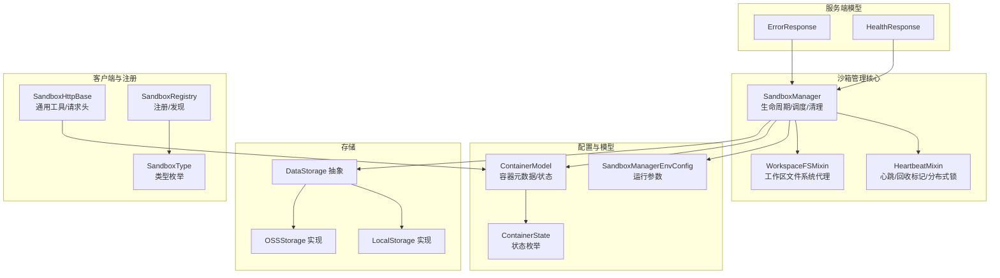
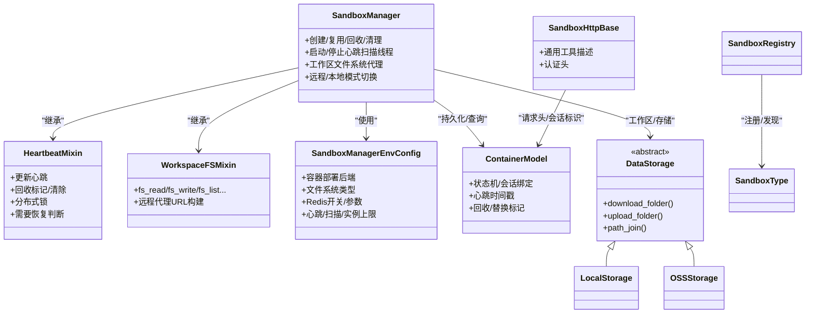
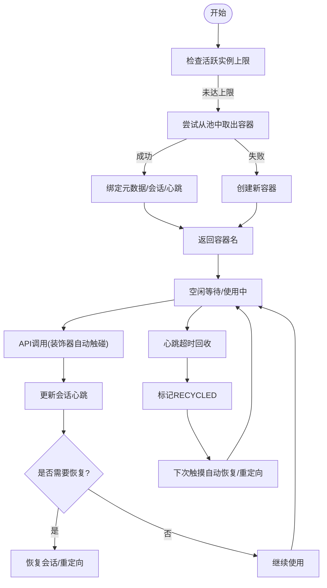
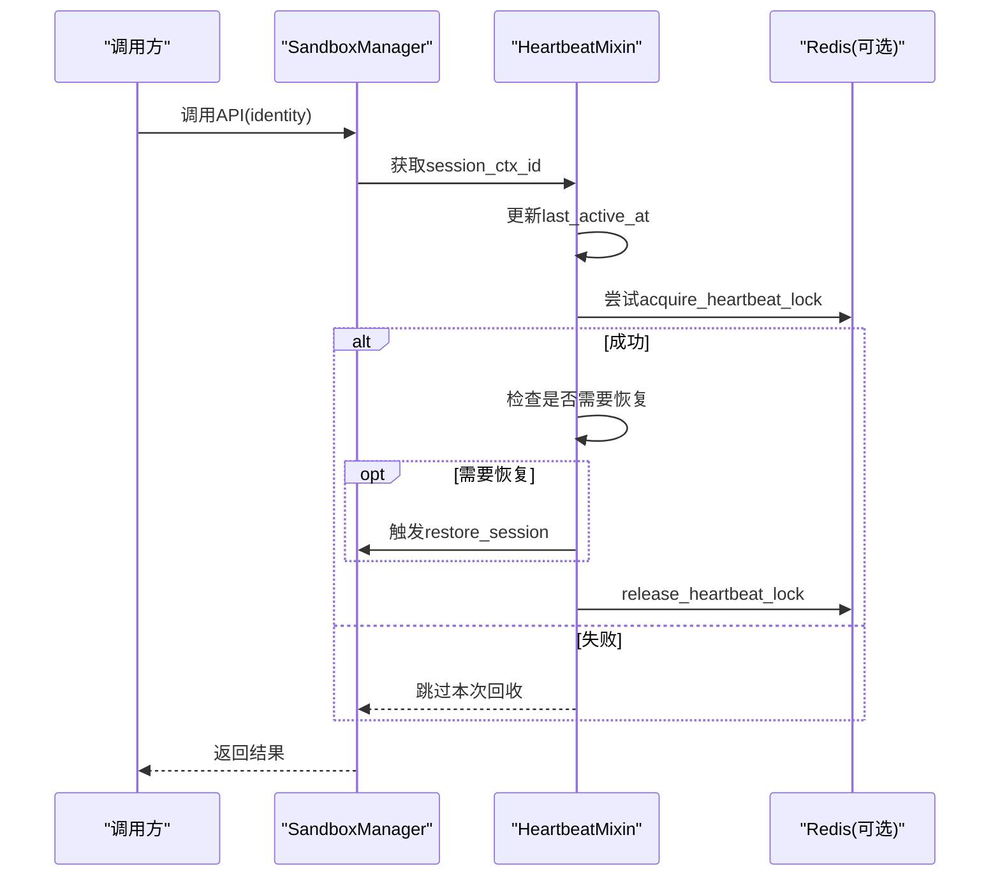
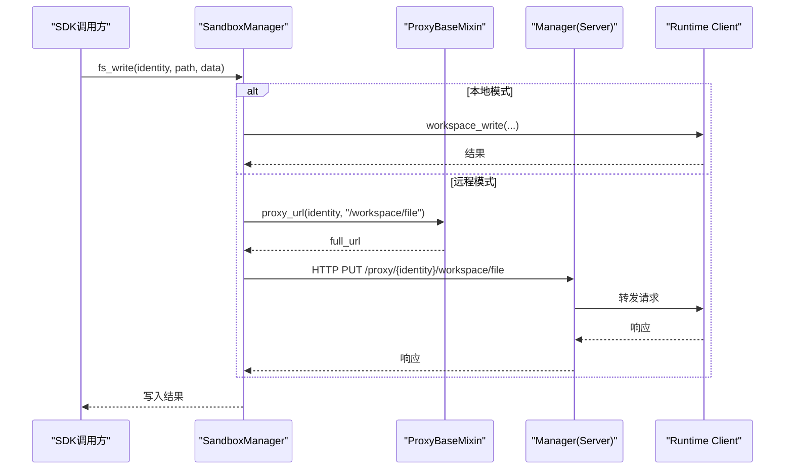
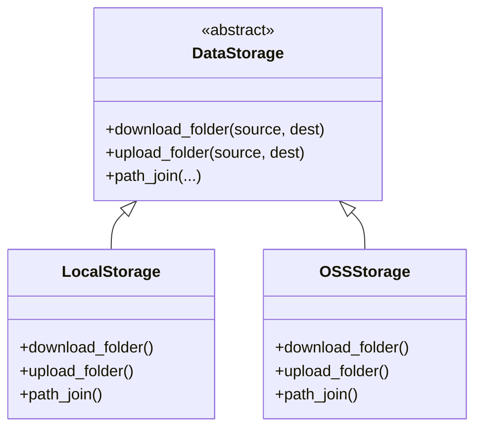
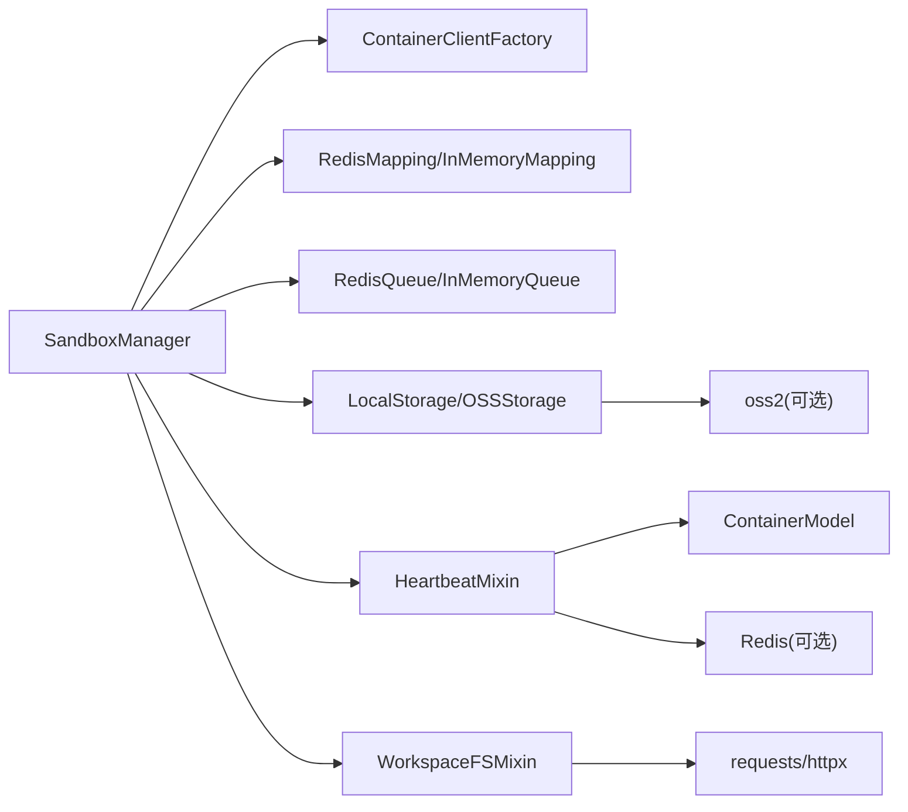

# 沙箱管理

<cite>
**本文引用的文件**
- [sandbox_manager.py](file://src/agentscope_runtime/sandbox/manager/sandbox_manager.py)
- [heartbeat_mixin.py](file://src/agentscope_runtime/sandbox/manager/heartbeat_mixin.py)
- [workspace_mixin.py](file://src/agentscope_runtime/sandbox/manager/workspace_mixin.py)
- [manager_config.py](file://src/agentscope_runtime/sandbox/model/manager_config.py)
- [container.py](file://src/agentscope_runtime/sandbox/model/container.py)
- [local_storage.py](file://src/agentscope_runtime/sandbox/manager/storage/local_storage.py)
- [oss_storage.py](file://src/agentscope_runtime/sandbox/manager/storage/oss_storage.py)
- [data_storage.py](file://src/agentscope_runtime/sandbox/manager/storage/data_storage.py)
- [base.py](file://src/agentscope_runtime/sandbox/client/base.py)
- [enums.py](file://src/agentscope_runtime/sandbox/enums.py)
- [registry.py](file://src/agentscope_runtime/sandbox/registry.py)
- [models.py](file://src/agentscope_runtime/sandbox/manager/server/models.py)
- [test_heartbeat.py](file://tests/sandbox/test_heartbeat.py)
- [test_heartbeat_timeout_restore.py](file://tests/sandbox/test_heartbeat_timeout_restore.py)
</cite>

## 目录
1. [简介](#简介)
2. [项目结构](#项目结构)
3. [核心组件](#核心组件)
4. [架构总览](#架构总览)
5. [详细组件分析](#详细组件分析)
6. [依赖分析](#依赖分析)
7. [性能考量](#性能考量)
8. [故障排查指南](#故障排查指南)
9. [结论](#结论)
10. [附录：使用示例与最佳实践](#附录使用示例与最佳实践)

## 简介
本文件面向“沙箱管理系统”的技术文档，聚焦于沙箱管理器（SandboxManager）的架构与运行机制，涵盖以下主题：
- 沙箱生命周期管理：创建、预热池复用、回收与替换、释放与清理
- 状态同步与心跳机制：会话级心跳、分布式锁、自动恢复与重定向
- 资源调度与存储系统：容器部署后端选择、工作区文件系统代理、本地/对象存储
- 使用示例：从创建到销毁的完整流程，含监控与维护要点
- API 接口、配置项与扩展机制：环境变量与工厂模式、自定义沙箱类型注册
- 最佳实践与性能优化建议

## 项目结构
围绕沙箱管理的关键模块如下：
- 管理器与混入：SandboxManager、HeartbeatMixin、WorkspaceFSMixin
- 配置模型：SandboxManagerEnvConfig
- 数据模型：ContainerModel、ContainerState
- 存储抽象：DataStorage 及其实现（LocalStorage、OSSStorage）
- 客户端基类：SandboxHttpBase
- 枚举与注册表：SandboxType、SandboxRegistry
- 服务器模型：ErrorResponse、HealthResponse
- 测试用例：心跳、超时回收与自动恢复

图示来源
- [sandbox_manager.py](file://src/agentscope_runtime/sandbox/manager/sandbox_manager.py)
- [heartbeat_mixin.py](file://src/agentscope_runtime/sandbox/manager/heartbeat_mixin.py)
- [workspace_mixin.py](file://src/agentscope_runtime/sandbox/manager/workspace_mixin.py)
- [manager_config.py](file://src/agentscope_runtime/sandbox/model/manager_config.py)
- [container.py](file://src/agentscope_runtime/sandbox/model/container.py)
- [local_storage.py](file://src/agentscope_runtime/sandbox/manager/storage/local_storage.py)
- [oss_storage.py](file://src/agentscope_runtime/sandbox/manager/storage/oss_storage.py)
- [data_storage.py](file://src/agentscope_runtime/sandbox/manager/storage/data_storage.py)
- [base.py](file://src/agentscope_runtime/sandbox/client/base.py)
- [enums.py](file://src/agentscope_runtime/sandbox/enums.py)
- [models.py](file://src/agentscope_runtime/sandbox/manager/server/models.py)

章节来源
- [sandbox_manager.py](file://src/agentscope_runtime/sandbox/manager/sandbox_manager.py)
- [manager_config.py](file://src/agentscope_runtime/sandbox/model/manager_config.py)
- [container.py](file://src/agentscope_runtime/sandbox/model/container.py)
- [local_storage.py](file://src/agentscope_runtime/sandbox/manager/storage/local_storage.py)
- [oss_storage.py](file://src/agentscope_runtime/sandbox/manager/storage/oss_storage.py)
- [data_storage.py](file://src/agentscope_runtime/sandbox/manager/storage/data_storage.py)
- [base.py](file://src/agentscope_runtime/sandbox/client/base.py)
- [enums.py](file://src/agentscope_runtime/sandbox/enums.py)
- [models.py](file://src/agentscope_runtime/sandbox/manager/server/models.py)

## 核心组件
- SandboxManager：统一入口，负责容器生命周期、预热池、回收扫描、清理、远程/本地模式切换、工作区文件系统代理等
- HeartbeatMixin：提供会话级心跳更新、回收标记、RECYCLED/REPLACED 状态处理、Redis 分布式锁
- WorkspaceFSMixin：在嵌入/远程两种模式下提供一致的工作区文件系统操作（读写/批量/移动/删除/存在性检查/目录创建）
- SandboxManagerEnvConfig：集中式配置，覆盖容器部署后端、文件系统类型、Redis、心跳/扫描/实例上限等
- ContainerModel/ContainerState：容器元数据与状态机，支持 session_ctx_id、last_active_at、recycled_at 等关键字段
- DataStorage 抽象及实现：LocalStorage、OSSStorage，支持目录上传下载与路径拼接
- SandboxHttpBase：HTTP 客户端基类，提供通用工具描述与认证头
- SandboxType/SandboxRegistry：类型枚举与注册机制，支持动态扩展自定义沙箱类型

章节来源
- [sandbox_manager.py](file://src/agentscope_runtime/sandbox/manager/sandbox_manager.py)
- [heartbeat_mixin.py](file://src/agentscope_runtime/sandbox/manager/heartbeat_mixin.py)
- [workspace_mixin.py](file://src/agentscope_runtime/sandbox/manager/workspace_mixin.py)
- [manager_config.py](file://src/agentscope_runtime/sandbox/model/manager_config.py)
- [container.py](file://src/agentscope_runtime/sandbox/model/container.py)
- [local_storage.py](file://src/agentscope_runtime/sandbox/manager/storage/local_storage.py)
- [oss_storage.py](file://src/agentscope_runtime/sandbox/manager/storage/oss_storage.py)
- [data_storage.py](file://src/agentscope_runtime/sandbox/manager/storage/data_storage.py)
- [base.py](file://src/agentscope_runtime/sandbox/client/base.py)
- [enums.py](file://src/agentscope_runtime/sandbox/enums.py)
- [registry.py](file://src/agentscope_runtime/sandbox/registry.py)

## 架构总览
沙箱管理器采用“管理器 + 多个 Mixin + 配置 + 存储 + 注册表”的分层设计：
- 管理器负责编排：创建/复用/回收/清理、心跳扫描线程、工作区代理
- Mixin 提供横切能力：心跳与分布式锁、工作区文件系统
- 配置驱动行为：容器部署后端、文件系统、Redis、扫描间隔、实例上限
- 存储抽象：统一上传/下载/路径拼接，支持本地或 OSS
- 注册表：统一管理沙箱类型与镜像配置

图示来源
- [sandbox_manager.py](file://src/agentscope_runtime/sandbox/manager/sandbox_manager.py)
- [heartbeat_mixin.py](file://src/agentscope_runtime/sandbox/manager/heartbeat_mixin.py)
- [workspace_mixin.py](file://src/agentscope_runtime/sandbox/manager/workspace_mixin.py)
- [manager_config.py](file://src/agentscope_runtime/sandbox/model/manager_config.py)
- [container.py](file://src/agentscope_runtime/sandbox/model/container.py)
- [local_storage.py](file://src/agentscope_runtime/sandbox/manager/storage/local_storage.py)
- [oss_storage.py](file://src/agentscope_runtime/sandbox/manager/storage/oss_storage.py)
- [data_storage.py](file://src/agentscope_runtime/sandbox/manager/storage/data_storage.py)
- [base.py](file://src/agentscope_runtime/sandbox/client/base.py)
- [enums.py](file://src/agentscope_runtime/sandbox/enums.py)
- [registry.py](file://src/agentscope_runtime/sandbox/registry.py)

## 详细组件分析

### 沙箱生命周期管理
- 预热池复用：优先从池中出队可用容器；若版本不匹配或状态非 running，则丢弃并新建
- 创建流程：校验实例上限、生成 session_id、准备挂载目录、合并环境变量、调用容器客户端创建
- 回收与替换：基于会话的心跳超时触发回收标记，后续通过“触摸”自动恢复或重定向至新容器
- 清理策略：销毁池内容器与映射中的非终止态容器，保留记录以便后续回收/释放清理

图示来源
- [sandbox_manager.py](file://src/agentscope_runtime/sandbox/manager/sandbox_manager.py)
- [heartbeat_mixin.py](file://src/agentscope_runtime/sandbox/manager/heartbeat_mixin.py)

章节来源
- [sandbox_manager.py](file://src/agentscope_runtime/sandbox/manager/sandbox_manager.py)
- [heartbeat_mixin.py](file://src/agentscope_runtime/sandbox/manager/heartbeat_mixin.py)

### 心跳机制与自动恢复
- 触摸装饰器：从方法参数提取 identity，解析 session_ctx_id，更新心跳并按需触发恢复
- 分布式锁：Redis SET NX EX 或内存令牌，避免并发回收冲突
- 回收扫描：后台线程周期扫描，超过阈值的会话标记回收并可重建
- 自动恢复：当容器被回收但仍在使用中，下一次触摸触发恢复逻辑或建立 REPLACED 重定向

图示来源
- [heartbeat_mixin.py](file://src/agentscope_runtime/sandbox/manager/heartbeat_mixin.py)
- [sandbox_manager.py](file://src/agentscope_runtime/sandbox/manager/sandbox_manager.py)

章节来源
- [heartbeat_mixin.py](file://src/agentscope_runtime/sandbox/manager/heartbeat_mixin.py)
- [test_heartbeat.py](file://tests/sandbox/test_heartbeat.py)
- [test_heartbeat_timeout_restore.py](file://tests/sandbox/test_heartbeat_timeout_restore.py)

### 工作区混合器（WorkspaceFSMixin）
- 嵌入模式：直接连接运行时容器客户端执行工作区操作
- 远程模式：通过 Manager 的 /proxy/{identity}/... 代理转发，支持流式上传/下载
- 统一接口：fs_read/fs_write/fs_list/fs_exists/fs_remove/fs_move/fs_mkdir/fs_write_from_path 及其异步版本

图示来源
- [workspace_mixin.py](file://src/agentscope_runtime/sandbox/manager/workspace_mixin.py)
- [sandbox_manager.py](file://src/agentscope_runtime/sandbox/manager/sandbox_manager.py)

章节来源
- [workspace_mixin.py](file://src/agentscope_runtime/sandbox/manager/workspace_mixin.py)
- [sandbox_manager.py](file://src/agentscope_runtime/sandbox/manager/sandbox_manager.py)

### 存储系统实现
- 抽象层：DataStorage 定义 download_folder/upload_folder/path_join
- 本地存储：复制目录树，保持相对路径结构
- 对象存储（OSS）：遍历前缀下载/上传，按需计算MD5去重

图示来源
- [data_storage.py](file://src/agentscope_runtime/sandbox/manager/storage/data_storage.py)
- [local_storage.py](file://src/agentscope_runtime/sandbox/manager/storage/local_storage.py)
- [oss_storage.py](file://src/agentscope_runtime/sandbox/manager/storage/oss_storage.py)

章节来源
- [data_storage.py](file://src/agentscope_runtime/sandbox/manager/storage/data_storage.py)
- [local_storage.py](file://src/agentscope_runtime/sandbox/manager/storage/local_storage.py)
- [oss_storage.py](file://src/agentscope_runtime/sandbox/manager/storage/oss_storage.py)

### API 接口与远程/本地模式
- 远程模式：SandboxManager 在构造时设置 base_url 与可选 Bearer Token，所有方法通过 HTTP 请求转发
- 本地模式：直接调用容器客户端与工作区客户端
- 客户端基类：SandboxHttpBase 提供通用工具描述与认证头，便于运行时容器侧对接

章节来源
- [sandbox_manager.py](file://src/agentscope_runtime/sandbox/manager/sandbox_manager.py)
- [base.py](file://src/agentscope_runtime/sandbox/client/base.py)

### 配置选项与扩展机制
- 配置项：容器前缀、文件系统类型、Redis 开关与参数、容器部署后端、默认挂载目录、只读挂载、端口范围、预热池大小、OSS 参数、心跳/扫描/实例上限等
- 扩展机制：SandboxType 支持动态添加成员；SandboxRegistry.register 装饰器注册自定义沙箱类型，配合工厂/环境变量加载

章节来源
- [manager_config.py](file://src/agentscope_runtime/sandbox/model/manager_config.py)
- [enums.py](file://src/agentscope_runtime/sandbox/enums.py)
- [registry.py](file://src/agentscope_runtime/sandbox/registry.py)

## 依赖分析
- 管理器依赖：容器客户端工厂、映射/队列（Redis/内存）、存储实现、心跳与工作区混入
- 心跳混入依赖：ContainerModel、ContainerState、Redis 客户端（可选）
- 工作区混入依赖：HTTP 客户端（requests/httpx）、代理 URL 构建
- 存储实现依赖：标准库 os/shutil/oss2
- 客户端基类依赖：通用工具描述与认证头

图示来源
- [sandbox_manager.py](file://src/agentscope_runtime/sandbox/manager/sandbox_manager.py)
- [heartbeat_mixin.py](file://src/agentscope_runtime/sandbox/manager/heartbeat_mixin.py)
- [workspace_mixin.py](file://src/agentscope_runtime/sandbox/manager/workspace_mixin.py)
- [local_storage.py](file://src/agentscope_runtime/sandbox/manager/storage/local_storage.py)
- [oss_storage.py](file://src/agentscope_runtime/sandbox/manager/storage/oss_storage.py)

章节来源
- [sandbox_manager.py](file://src/agentscope_runtime/sandbox/manager/sandbox_manager.py)
- [heartbeat_mixin.py](file://src/agentscope_runtime/sandbox/manager/heartbeat_mixin.py)
- [workspace_mixin.py](file://src/agentscope_runtime/sandbox/manager/workspace_mixin.py)
- [local_storage.py](file://src/agentscope_runtime/sandbox/manager/storage/local_storage.py)
- [oss_storage.py](file://src/agentscope_runtime/sandbox/manager/storage/oss_storage.py)

## 性能考量
- 预热池：合理设置 pool_size，减少频繁创建/销毁开销；注意版本一致性与运行状态校验
- 心跳扫描：watcher_scan_interval 与 heartbeat_timeout 平衡资源占用与回收及时性
- Redis 分布式锁：heartbeat_lock_ttl 控制锁持有时间，避免长时间阻塞；降级回内存令牌
- 文件系统代理：远程模式下启用流式传输，避免大文件一次性加载内存
- 存储上传：OSS 上传前进行 MD5 校验，减少重复传输
- 实例上限：max_sandbox_instances 限制并发，防止资源耗尽

## 故障排查指南
- 心跳超时导致回收：确认 watcher 是否启动、扫描间隔是否合理、Redis 可用性
- 自动恢复无效：检查 session_ctx_id 绑定、容器状态是否为 RECYCLED、触摸装饰器是否生效
- 远程代理异常：核对 base_url、Bearer Token、/proxy 路由可达性
- 存储上传失败：检查 OSS 凭证、桶权限、网络连通性
- 容器状态异常：查看 ContainerModel 的 state/last_active_at/recycled_at 字段

章节来源
- [test_heartbeat.py](file://tests/sandbox/test_heartbeat.py)
- [test_heartbeat_timeout_restore.py](file://tests/sandbox/test_heartbeat_timeout_restore.py)
- [heartbeat_mixin.py](file://src/agentscope_runtime/sandbox/manager/heartbeat_mixin.py)
- [sandbox_manager.py](file://src/agentscope_runtime/sandbox/manager/sandbox_manager.py)

## 结论
沙箱管理系统以 SandboxManager 为核心，结合 HeartbeatMixin 与 WorkspaceFSMixin，形成“生命周期编排 + 心跳与恢复 + 工作区代理”的完整能力闭环。通过配置驱动与存储抽象，系统可在本地与远程模式间灵活切换，并支持多种容器部署后端与存储后端。借助测试用例验证了心跳超时回收与自动恢复的可靠性。

## 附录：使用示例与最佳实践

### 使用示例（流程）
- 创建沙箱：指定 sandbox_type 与可选 meta（建议包含 session_ctx_id），优先从池中复用
- 监控与维护：定期调用 API 触摸（装饰器自动更新心跳），观察容器状态变化
- 销毁与清理：退出上下文或显式调用 cleanup，确保池内与映射中非终止态容器被销毁

章节来源
- [sandbox_manager.py](file://src/agentscope_runtime/sandbox/manager/sandbox_manager.py)
- [heartbeat_mixin.py](file://src/agentscope_runtime/sandbox/manager/heartbeat_mixin.py)

### API 一览（方法族）
- 生命周期：create/create_from_pool/cleanup
- 心跳与回收：update_heartbeat/mark_session_recycled/needs_restore
- 工作区：fs_read/fs_write/fs_list/fs_exists/fs_remove/fs_move/fs_mkdir/fs_write_from_path 及其异步版本
- 远程模式：通过 base_url 与 Bearer Token 访问 Manager 服务

章节来源
- [sandbox_manager.py](file://src/agentscope_runtime/sandbox/manager/sandbox_manager.py)
- [workspace_mixin.py](file://src/agentscope_runtime/sandbox/manager/workspace_mixin.py)
- [heartbeat_mixin.py](file://src/agentscope_runtime/sandbox/manager/heartbeat_mixin.py)

### 配置清单（关键项）
- 容器部署后端：docker/cloud/k8s/agentrun/fc/gvisor/boxlite
- 文件系统：local/oss
- Redis：开关、服务器、端口、数据库、用户、密码、键前缀
- 心跳与扫描：heartbeat_timeout、heartbeat_lock_ttl、watcher_scan_interval
- 实例上限：max_sandbox_instances
- 其他：默认挂载目录、只读挂载、端口范围、池大小、OSS 端点/凭证/桶名

章节来源
- [manager_config.py](file://src/agentscope_runtime/sandbox/model/manager_config.py)

### 扩展机制
- 动态添加沙箱类型：SandboxType.add_member
- 注册自定义沙箱：@SandboxRegistry.register 装饰器，声明镜像、环境变量、超时等
- 工厂加载：通过环境变量与工厂创建服务实例

章节来源
- [enums.py](file://src/agentscope_runtime/sandbox/enums.py)
- [registry.py](file://src/agentscope_runtime/sandbox/registry.py)