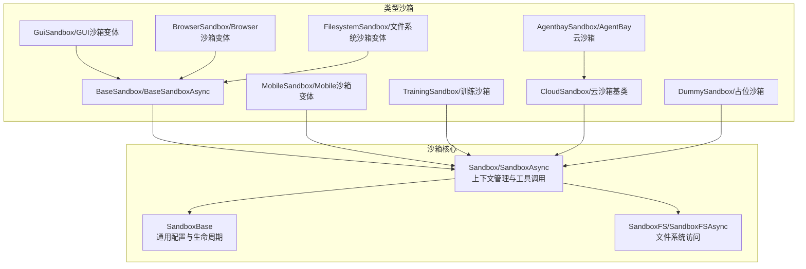
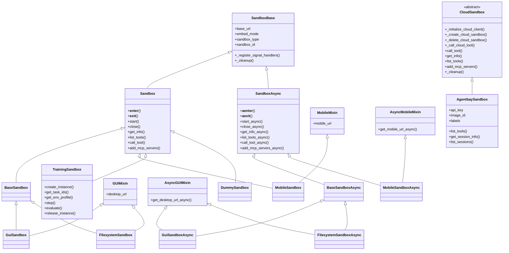
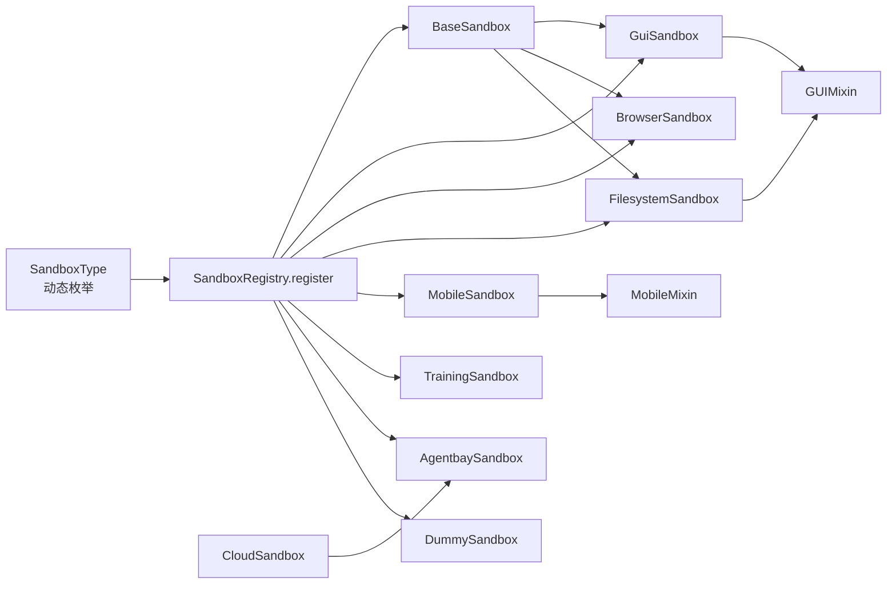

# 沙箱类型概览

<cite>
**本文档引用的文件**
- [src/agentscope_runtime/sandbox/box/base/base_sandbox.py](file://src/agentscope_runtime/sandbox/box/base/base_sandbox.py)
- [src/agentscope_runtime/sandbox/box/sandbox.py](file://src/agentscope_runtime/sandbox/box/sandbox.py)
- [src/agentscope_runtime/sandbox/enums.py](file://src/agentscope_runtime/sandbox/enums.py)
- [src/agentscope_runtime/sandbox/box/gui/gui_sandbox.py](file://src/agentscope_runtime/sandbox/box/gui/gui_sandbox.py)
- [src/agentscope_runtime/sandbox/box/browser/browser_sandbox.py](file://src/agentscope_runtime/sandbox/box/browser/browser_sandbox.py)
- [src/agentscope_runtime/sandbox/box/filesystem/filesystem_sandbox.py](file://src/agentscope_runtime/sandbox/box/filesystem/filesystem_sandbox.py)
- [src/agentscope_runtime/sandbox/box/mobile/mobile_sandbox.py](file://src/agentscope_runtime/sandbox/box/mobile/mobile_sandbox.py)
- [src/agentscope_runtime/sandbox/box/training_box/training_box.py](file://src/agentscope_runtime/sandbox/box/training_box/training_box.py)
- [src/agentscope_runtime/sandbox/box/agentbay/agentbay_sandbox.py](file://src/agentscope_runtime/sandbox/box/agentbay/agentbay_sandbox.py)
- [src/agentscope_runtime/sandbox/box/cloud/cloud_sandbox.py](file://src/agentscope_runtime/sandbox/box/cloud/cloud_sandbox.py)
- [src/agentscope_runtime/sandbox/box/dummy/dummy_sandbox.py](file://src/agentscope_runtime/sandbox/box/dummy/dummy_sandbox.py)
</cite>

## 目录
1. [简介](#简介)
2. [项目结构](#项目结构)
3. [核心组件](#核心组件)
4. [架构总览](#架构总览)
5. [详细组件分析](#详细组件分析)
6. [依赖关系分析](#依赖关系分析)
7. [性能考虑](#性能考虑)
8. [故障排除指南](#故障排除指南)
9. [结论](#结论)
10. [附录：沙箱选择指南](#附录沙箱选择指南)

## 简介
本文件面向AgentScope Runtime的沙箱体系，系统性梳理七种沙箱类型的整体架构与设计理念，覆盖基础沙箱、GUI沙箱、浏览器沙箱、文件系统沙箱、移动沙箱、训练沙箱以及AgentBay云沙箱。文档解释沙箱注册机制与类型枚举系统，阐明各沙箱之间的继承关系与扩展性设计，并提供实用的沙箱选择指南，帮助开发者基于具体需求做出正确选择。

## 项目结构
AgentScope Runtime的沙箱实现采用“按功能域分层+按类型聚合”的组织方式：
- 核心接口与基类位于sandbox/box目录，统一抽象同步/异步沙箱、文件系统访问等能力
- 各类沙箱以子模块形式组织，如gui、browser、filesystem、mobile、training_box、agentbay、cloud、dummy
- 类型枚举与注册中心贯穿全体系，确保可扩展与可发现

图表来源
- [src/agentscope_runtime/sandbox/box/sandbox.py:18-313](file://src/agentscope_runtime/sandbox/box/sandbox.py#L18-L313)
- [src/agentscope_runtime/sandbox/box/base/base_sandbox.py:18-102](file://src/agentscope_runtime/sandbox/box/base/base_sandbox.py#L18-L102)
- [src/agentscope_runtime/sandbox/box/gui/gui_sandbox.py:72-240](file://src/agentscope_runtime/sandbox/box/gui/gui_sandbox.py#L72-L240)
- [src/agentscope_runtime/sandbox/box/browser/browser_sandbox.py:38-498](file://src/agentscope_runtime/sandbox/box/browser/browser_sandbox.py#L38-L498)
- [src/agentscope_runtime/sandbox/box/filesystem/filesystem_sandbox.py:20-254](file://src/agentscope_runtime/sandbox/box/filesystem/filesystem_sandbox.py#L20-L254)
- [src/agentscope_runtime/sandbox/box/mobile/mobile_sandbox.py:88-342](file://src/agentscope_runtime/sandbox/box/mobile/mobile_sandbox.py#L88-L342)
- [src/agentscope_runtime/sandbox/box/training_box/training_box.py:18-295](file://src/agentscope_runtime/sandbox/box/training_box/training_box.py#L18-L295)
- [src/agentscope_runtime/sandbox/box/agentbay/agentbay_sandbox.py:27-558](file://src/agentscope_runtime/sandbox/box/agentbay/agentbay_sandbox.py#L27-L558)
- [src/agentscope_runtime/sandbox/box/cloud/cloud_sandbox.py:19-251](file://src/agentscope_runtime/sandbox/box/cloud/cloud_sandbox.py#L19-L251)
- [src/agentscope_runtime/sandbox/box/dummy/dummy_sandbox.py:17-33](file://src/agentscope_runtime/sandbox/box/dummy/dummy_sandbox.py#L17-L33)

章节来源
- [src/agentscope_runtime/sandbox/box/sandbox.py:18-313](file://src/agentscope_runtime/sandbox/box/sandbox.py#L18-L313)
- [src/agentscope_runtime/sandbox/box/base/base_sandbox.py:18-102](file://src/agentscope_runtime/sandbox/box/base/base_sandbox.py#L18-L102)

## 核心组件
- 类型枚举与动态扩展
  - 使用自定义DynamicEnum实现沙箱类型枚举，支持运行时动态添加成员，便于扩展新类型
  - 内置类型涵盖DUMMY、BASE、BROWSER、FILESYSTEM、GUI、MOBILE、APPWORLD、BFCL、AGENTBAY及对应的异步变体
- 注册机制
  - 通过SandboxRegistry.register装饰器在类定义处完成注册，声明镜像URI、安全等级、超时、描述与运行时配置
  - 注册信息用于服务端发现与调度，确保客户端可按类型选择合适沙箱
- 基类与上下文管理
  - SandboxBase统一处理嵌入式/远程模式、生命周期信号处理、资源清理
  - Sandbox/SandboxAsync分别提供同步/异步上下文管理与工具调用封装
  - 文件系统访问由SandboxFS/SandboxFSAsync提供，屏蔽底层差异

章节来源
- [src/agentscope_runtime/sandbox/enums.py:61-80](file://src/agentscope_runtime/sandbox/enums.py#L61-L80)
- [src/agentscope_runtime/sandbox/box/base/base_sandbox.py:11-17](file://src/agentscope_runtime/sandbox/box/base/base_sandbox.py#L11-L17)
- [src/agentscope_runtime/sandbox/box/sandbox.py:18-313](file://src/agentscope_runtime/sandbox/box/sandbox.py#L18-L313)

## 架构总览
下图展示沙箱体系的继承关系与职责分工：

图表来源
- [src/agentscope_runtime/sandbox/box/sandbox.py:18-313](file://src/agentscope_runtime/sandbox/box/sandbox.py#L18-L313)
- [src/agentscope_runtime/sandbox/box/base/base_sandbox.py:18-102](file://src/agentscope_runtime/sandbox/box/base/base_sandbox.py#L18-L102)
- [src/agentscope_runtime/sandbox/box/gui/gui_sandbox.py:17-240](file://src/agentscope_runtime/sandbox/box/gui/gui_sandbox.py#L17-L240)
- [src/agentscope_runtime/sandbox/box/filesystem/filesystem_sandbox.py:20-254](file://src/agentscope_runtime/sandbox/box/filesystem/filesystem_sandbox.py#L20-L254)
- [src/agentscope_runtime/sandbox/box/mobile/mobile_sandbox.py:17-342](file://src/agentscope_runtime/sandbox/box/mobile/mobile_sandbox.py#L17-L342)
- [src/agentscope_runtime/sandbox/box/training_box/training_box.py:18-295](file://src/agentscope_runtime/sandbox/box/training_box/training_box.py#L18-L295)
- [src/agentscope_runtime/sandbox/box/cloud/cloud_sandbox.py:19-251](file://src/agentscope_runtime/sandbox/box/cloud/cloud_sandbox.py#L19-L251)
- [src/agentscope_runtime/sandbox/box/agentbay/agentbay_sandbox.py:27-558](file://src/agentscope_runtime/sandbox/box/agentbay/agentbay_sandbox.py#L27-L558)
- [src/agentscope_runtime/sandbox/box/dummy/dummy_sandbox.py:17-33](file://src/agentscope_runtime/sandbox/box/dummy/dummy_sandbox.py#L17-L33)

## 详细组件分析

### 基础沙箱（BaseSandbox/BaseSandboxAsync）
- 设计理念
  - 提供最基础的工具执行能力：运行IPython单元格与Shell命令
  - 作为大多数类型沙箱的基类，统一注册、生命周期与工具调用协议
- 关键特性
  - 支持同步与异步两种变体
  - 通过SandboxRegistry.register声明镜像与元数据
- 适用场景
  - 需要最小化环境与最少权限的脚本执行
  - 作为其他复杂沙箱的基础能力拼装点

章节来源
- [src/agentscope_runtime/sandbox/box/base/base_sandbox.py:18-102](file://src/agentscope_runtime/sandbox/box/base/base_sandbox.py#L18-L102)

### GUI沙箱（GuiSandbox/GUI沙箱变体）
- 设计理念
  - 提供桌面GUI自动化能力，支持鼠标键盘操作与截图
  - 通过GUIMixin提供VNC访问URL生成，便于可视化调试
- 关键特性
  - 提供computer_use方法，支持多种动作（点击、拖拽、输入、截图等）
  - 异步版本提供非阻塞的GUI交互
  - 在ARM架构上存在兼容性提示
- 适用场景
  - 需要在图形界面环境下进行人机交互任务
  - 自动化测试、演示录制、远程桌面控制

章节来源
- [src/agentscope_runtime/sandbox/box/gui/gui_sandbox.py:72-240](file://src/agentscope_runtime/sandbox/box/gui/gui_sandbox.py#L72-L240)

### 浏览器沙箱（BrowserSandbox/Browser沙箱变体）
- 设计理念
  - 在GUI沙箱基础上，聚焦浏览器自动化能力
  - 提供导航、点击、输入、截图、网络请求监控、PDF保存等完整工具集
- 关键特性
  - 提供丰富的浏览器操作API
  - 异步版本满足高并发场景
  - 工具调用通过统一的call_tool接口转发
- 适用场景
  - Web应用自动化测试
  - 数据采集与页面行为模拟
  - 复杂表单填写与流程编排

章节来源
- [src/agentscope_runtime/sandbox/box/browser/browser_sandbox.py:38-498](file://src/agentscope_runtime/sandbox/box/browser/browser_sandbox.py#L38-L498)

### 文件系统沙箱（FilesystemSandbox/文件系统沙箱变体）
- 设计理念
  - 提供文件系统读写、编辑、目录管理与搜索能力
  - 通过GUIMixin复用GUI沙箱的VNC访问能力
- 关键特性
  - 支持单文件读写、批量读取、行级编辑、树形目录遍历
  - 支持路径搜索与元信息查询
  - 异步版本满足高吞吐场景
- 适用场景
  - 文本处理与代码编辑
  - 日志分析与文件归档
  - 脚本批量执行与配置管理

章节来源
- [src/agentscope_runtime/sandbox/box/filesystem/filesystem_sandbox.py:20-254](file://src/agentscope_runtime/sandbox/box/filesystem/filesystem_sandbox.py#L20-L254)

### 移动沙箱（MobileSandbox/Mobile沙箱变体）
- 设计理念
  - 通过ADB协议实现移动设备自动化
  - 提供屏幕坐标点击、滑动、文本输入、按键事件与截图能力
- 关键特性
  - 通过MobileMixin提供WebSockify/VNC访问URL
  - 支持主机就绪性检查，确保设备可用
  - 异步版本满足高并发移动任务
- 适用场景
  - 移动应用自动化测试
  - 手机端UI交互与数据采集
  - 跨平台移动端脚本执行

章节来源
- [src/agentscope_runtime/sandbox/box/mobile/mobile_sandbox.py:88-342](file://src/agentscope_runtime/sandbox/box/mobile/mobile_sandbox.py#L88-L342)

### 训练沙箱（TrainingSandbox/训练沙箱）
- 设计理念
  - 专为强化学习或大规模训练任务设计的沙箱
  - 提供实例创建、任务管理、环境步进与评估能力
- 关键特性
  - 支持APPWorld与BFCL两类训练环境
  - APPWorld强调共享内存配置，BFCL强调数据集路径与API密钥
  - 统一的工具调用接口，屏蔽底层环境差异
- 适用场景
  - 大模型训练与评测
  - 多轮对话与推理评估
  - 环境仿真与策略优化

章节来源
- [src/agentscope_runtime/sandbox/box/training_box/training_box.py:18-295](file://src/agentscope_runtime/sandbox/box/training_box/training_box.py#L18-L295)

### AgentBay云沙箱（AgentbaySandbox/AgentBay云沙箱）
- 设计理念
  - 基于CloudSandbox抽象，直接对接AgentBay云服务
  - 无需本地容器，通过云SDK管理会话与工具调用
- 关键特性
  - 支持Linux/Windows/Browser/CodeSpace/Mobile等多种镜像类型
  - 提供会话生命周期管理、工具列表与会话信息查询
  - 统一的工具映射与通用调用回退机制
- 适用场景
  - 云端无服务器沙箱执行
  - 多租户与弹性扩缩容
  - 跨区域分布式任务编排

章节来源
- [src/agentscope_runtime/sandbox/box/agentbay/agentbay_sandbox.py:27-558](file://src/agentscope_runtime/sandbox/box/agentbay/agentbay_sandbox.py#L27-L558)
- [src/agentscope_runtime/sandbox/box/cloud/cloud_sandbox.py:19-251](file://src/agentscope_runtime/sandbox/box/cloud/cloud_sandbox.py#L19-L251)

### 占位沙箱（DummySandbox/占位沙箱）
- 设计理念
  - 最简实现，用于占位与测试场景
- 关键特性
  - 仅继承基础接口，不提供实际功能
- 适用场景
  - 单元测试桩
  - 开发阶段占位
  - 功能开关与条件编排

章节来源
- [src/agentscope_runtime/sandbox/box/dummy/dummy_sandbox.py:17-33](file://src/agentscope_runtime/sandbox/box/dummy/dummy_sandbox.py#L17-L33)

## 依赖关系分析
- 继承与组合
  - 大多数类型沙箱均继承自Sandbox或其异步变体，部分类型（GUI、文件系统）额外继承GUIMixin以获得VNC访问能力
  - 移动沙箱直接继承Sandbox，但通过MobileMixin提供访问URL
  - 训练沙箱与AgentBay沙箱分别面向不同运行形态（本地容器 vs 云服务），后者进一步继承CloudSandbox抽象
- 注册与发现
  - 所有沙箱类型通过SandboxRegistry.register在类定义阶段完成注册，包含镜像URI、安全等级、超时与描述等元信息
  - 类型枚举SandboxType集中管理所有内置类型，支持动态扩展
- 生命周期与资源管理
  - SandboxBase统一处理信号捕获与退出清理；CloudSandbox补充云会话删除逻辑
  - 文件系统访问通过SandboxFS/SandboxFSAsync在进入上下文时初始化

图表来源
- [src/agentscope_runtime/sandbox/enums.py:61-80](file://src/agentscope_runtime/sandbox/enums.py#L61-L80)
- [src/agentscope_runtime/sandbox/box/base/base_sandbox.py:11-17](file://src/agentscope_runtime/sandbox/box/base/base_sandbox.py#L11-L17)
- [src/agentscope_runtime/sandbox/box/gui/gui_sandbox.py:65-71](file://src/agentscope_runtime/sandbox/box/gui/gui_sandbox.py#L65-L71)
- [src/agentscope_runtime/sandbox/box/browser/browser_sandbox.py:31-37](file://src/agentscope_runtime/sandbox/box/browser/browser_sandbox.py#L31-L37)
- [src/agentscope_runtime/sandbox/box/filesystem/filesystem_sandbox.py:13-19](file://src/agentscope_runtime/sandbox/box/filesystem/filesystem_sandbox.py#L13-L19)
- [src/agentscope_runtime/sandbox/box/mobile/mobile_sandbox.py:80-87](file://src/agentscope_runtime/sandbox/box/mobile/mobile_sandbox.py#L80-L87)
- [src/agentscope_runtime/sandbox/box/training_box/training_box.py:206-213](file://src/agentscope_runtime/sandbox/box/training_box/training_box.py#L206-L213)
- [src/agentscope_runtime/sandbox/box/agentbay/agentbay_sandbox.py:20-26](file://src/agentscope_runtime/sandbox/box/agentbay/agentbay_sandbox.py#L20-L26)
- [src/agentscope_runtime/sandbox/box/dummy/dummy_sandbox.py:10-16](file://src/agentscope_runtime/sandbox/box/dummy/dummy_sandbox.py#L10-L16)

章节来源
- [src/agentscope_runtime/sandbox/enums.py:61-80](file://src/agentscope_runtime/sandbox/enums.py#L61-L80)
- [src/agentscope_runtime/sandbox/box/sandbox.py:18-313](file://src/agentscope_runtime/sandbox/box/sandbox.py#L18-L313)

## 性能考虑
- 异步优先
  - 对于高并发与I/O密集型任务，优先选择对应异步变体（如GuiSandboxAsync、BrowserSandboxAsync、FilesystemSandboxAsync、MobileSandboxAsync）
- 资源隔离与超时
  - 各类型沙箱通过注册元信息设置超时时间，避免长时间阻塞
  - 训练沙箱针对内存密集型任务设置了共享内存大小配置
- 云沙箱开销
  - AgentBay云沙箱免去本地容器管理，但需考虑网络延迟与API调用成本
- 平台兼容性
  - GUI沙箱在ARM架构上存在兼容性提示，移动设备需进行主机就绪性检查

## 故障排除指南
- 沙箱未启动
  - 症状：访问sandbox_id时报错提示未启动
  - 处理：确保使用with上下文或显式调用start/start_async后再访问
- 远程模式路径挂载限制
  - 症状：远程模式下传入workspace_dir抛出异常
  - 处理：workspace_dir仅支持嵌入式本地模式，远程模式由服务端挂载路径
- GUI沙箱兼容性问题
  - 症状：ARM架构下GUI沙箱不稳定
  - 处理：参考日志中的兼容性提示，必要时切换到其他类型或使用远程桌面
- 移动沙箱主机检查失败
  - 症状：初始化MobileSandbox报主机准备就绪检查失败
  - 处理：遵循主机检查逻辑，确保设备驱动与权限配置正确
- AgentBay云沙箱初始化失败
  - 症状：缺少AgentBay SDK或API Key错误
  - 处理：安装SDK并正确设置api_key或环境变量

章节来源
- [src/agentscope_runtime/sandbox/box/sandbox.py:87-97](file://src/agentscope_runtime/sandbox/box/sandbox.py#L87-L97)
- [src/agentscope_runtime/sandbox/box/sandbox.py:65-69](file://src/agentscope_runtime/sandbox/box/sandbox.py#L65-L69)
- [src/agentscope_runtime/sandbox/box/gui/gui_sandbox.py:88-96](file://src/agentscope_runtime/sandbox/box/gui/gui_sandbox.py#L88-L96)
- [src/agentscope_runtime/sandbox/box/mobile/mobile_sandbox.py:99-101](file://src/agentscope_runtime/sandbox/box/mobile/mobile_sandbox.py#L99-L101)
- [src/agentscope_runtime/sandbox/box/agentbay/agentbay_sandbox.py:67-73](file://src/agentscope_runtime/sandbox/box/agentbay/agentbay_sandbox.py#L67-L73)

## 结论
AgentScope Runtime的沙箱体系以统一的基类与注册机制为核心，围绕七种主要类型提供了从基础执行到复杂交互、从本地容器到云端服务的完整能力谱系。通过动态类型枚举与清晰的继承关系，系统既保证了扩展性，又确保了易用性与一致性。开发者可根据任务性质与资源约束，选择合适的沙箱类型以获得最佳的开发与运行体验。

## 附录：沙箱选择指南
- 通用脚本执行
  - 选择基础沙箱（BaseSandbox/BaseSandboxAsync），具备最小权限与最低开销
- 图形界面自动化
  - 选择GUI沙箱（GuiSandbox/GUI沙箱变体），支持桌面交互与截图
- 浏览器自动化
  - 选择浏览器沙箱（BrowserSandbox/Browser沙箱变体），覆盖导航、点击、输入、截图等
- 文件系统操作
  - 选择文件系统沙箱（FilesystemSandbox/文件系统沙箱变体），支持读写、编辑、搜索与树形遍历
- 移动设备自动化
  - 选择移动沙箱（MobileSandbox/Mobile沙箱变体），通过ADB协议实现坐标点击、滑动与输入
- 训练与评测
  - 选择训练沙箱（TrainingSandbox），支持APPWorld与BFCL环境的实例管理与步进评估
- 云原生无服务器
  - 选择AgentBay云沙箱（AgentbaySandbox），免容器部署，按需弹性扩缩容
- 占位与测试
  - 选择占位沙箱（DummySandbox），用于测试与开发占位