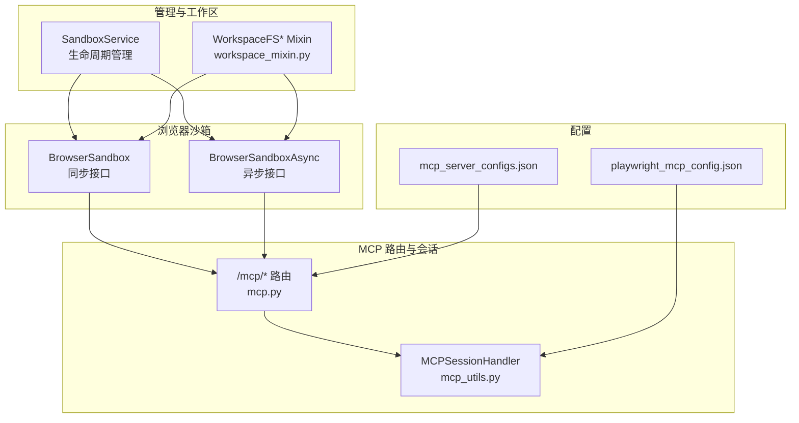
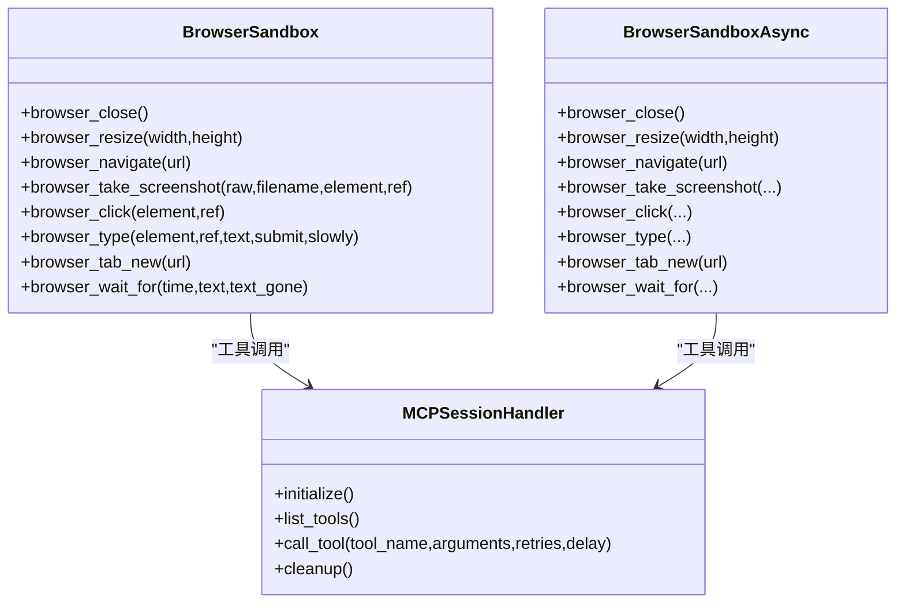
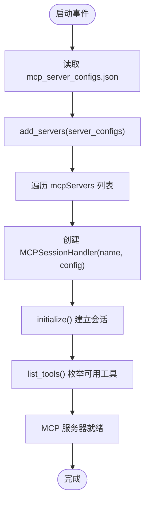
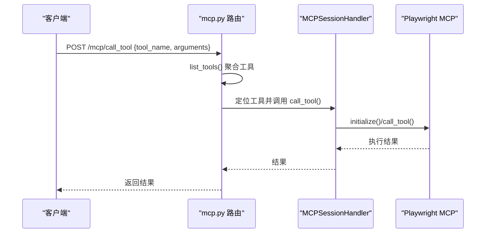
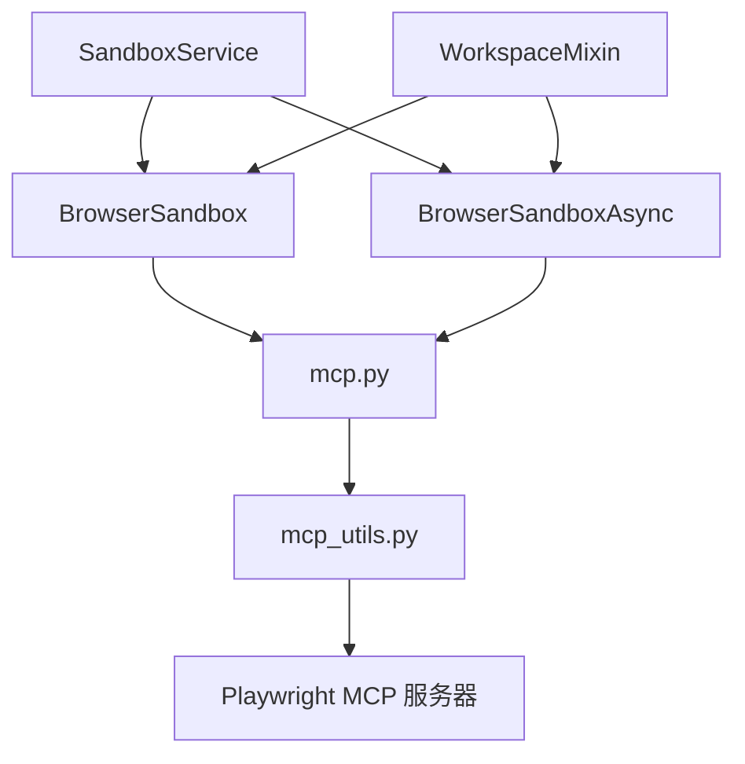

# 浏览器沙箱

<cite>
**本文引用的文件**
- [browser_sandbox.py](file://src/agentscope_runtime/sandbox/box/browser/browser_sandbox.py)
- [mcp_server_configs.json](file://src/agentscope_runtime/sandbox/box/browser/box/mcp_server_configs.json)
- [playwright_mcp_config.json](file://src/agentscope_runtime/sandbox/box/browser/box/playwright_mcp_config.json)
- [mcp.py](file://src/agentscope_runtime/sandbox/box/shared/routers/mcp.py)
- [mcp_utils.py](file://src/agentscope_runtime/sandbox/box/shared/routers/mcp_utils.py)
- [sandbox_service.py](file://src/agentscope_runtime/engine/services/sandbox/sandbox_service.py)
- [workspace_mixin.py](file://src/agentscope_runtime/sandbox/manager/workspace_mixin.py)
- [README.md](file://examples/sandbox/custom_sandbox/README.md)
- [advanced.md](file://cookbook/en/sandbox/advanced.md)
</cite>

## 目录
1. [简介](#简介)
2. [项目结构](#项目结构)
3. [核心组件](#核心组件)
4. [架构总览](#架构总览)
5. [详细组件分析](#详细组件分析)
6. [依赖分析](#依赖分析)
7. [性能考虑](#性能考虑)
8. [故障排查指南](#故障排查指南)
9. [结论](#结论)
10. [附录](#附录)

## 简介
本技术文档面向“浏览器沙箱”，系统性阐述其基于无头浏览器与 Playwright 的集成方案，以及通过 MCP（Model Context Protocol）服务器实现的浏览器自动化能力。文档覆盖以下关键主题：
- 浏览器沙箱的启动配置与运行时环境
- MCP 服务器的配置与初始化流程
- Playwright 客户端连接与工具调用机制
- 使用示例：网页抓取、自动化测试、动态内容渲染
- 与 AgentScope 工具系统的集成方式
- 性能优化与安全配置建议

## 项目结构
浏览器沙箱位于沙箱体系中的“browser”子模块，围绕以下关键目录组织：
- 沙箱实现层：browser_sandbox.py 提供同步与异步两类浏览器沙箱接口
- 运行时配置层：mcp_server_configs.json 与 playwright_mcp_config.json 描述 MCP 服务器与浏览器参数
- 路由与会话层：mcp.py 与 mcp_utils.py 实现 MCP 服务器的注册、工具列表与调用
- 管理与工作区：sandbox_service.py 管理沙箱生命周期；workspace_mixin.py 提供工作区文件系统操作
- 示例与文档：examples 与 cookbook 中包含自定义沙箱准备与高级用法说明



图表来源
- [browser_sandbox.py:38-498](file://src/agentscope_runtime/sandbox/box/browser/browser_sandbox.py#L38-L498)
- [mcp.py:1-208](file://src/agentscope_runtime/sandbox/box/shared/routers/mcp.py#L1-L208)
- [mcp_utils.py:32-188](file://src/agentscope_runtime/sandbox/box/shared/routers/mcp_utils.py#L32-L188)
- [mcp_server_configs.json:1-14](file://src/agentscope_runtime/sandbox/box/browser/box/mcp_server_configs.json#L1-L14)
- [playwright_mcp_config.json:1-23](file://src/agentscope_runtime/sandbox/box/browser/box/playwright_mcp_config.json#L1-L23)
- [sandbox_service.py:11-238](file://src/agentscope_runtime/engine/services/sandbox/sandbox_service.py#L11-L238)
- [workspace_mixin.py:113-702](file://src/agentscope_runtime/sandbox/manager/workspace_mixin.py#L113-L702)

章节来源
- [browser_sandbox.py:38-498](file://src/agentscope_runtime/sandbox/box/browser/browser_sandbox.py#L38-L498)
- [mcp_server_configs.json:1-14](file://src/agentscope_runtime/sandbox/box/browser/box/mcp_server_configs.json#L1-L14)
- [playwright_mcp_config.json:1-23](file://src/agentscope_runtime/sandbox/box/browser/box/playwright_mcp_config.json#L1-L23)
- [mcp.py:1-208](file://src/agentscope_runtime/sandbox/box/shared/routers/mcp.py#L1-L208)
- [mcp_utils.py:32-188](file://src/agentscope_runtime/sandbox/box/shared/routers/mcp_utils.py#L32-L188)
- [sandbox_service.py:11-238](file://src/agentscope_runtime/engine/services/sandbox/sandbox_service.py#L11-L238)
- [workspace_mixin.py:113-702](file://src/agentscope_runtime/sandbox/manager/workspace_mixin.py#L113-L702)

## 核心组件
- 浏览器沙箱接口
  - 同步 BrowserSandbox：封装浏览器常用操作（导航、截图、点击、输入、等待等），统一通过工具调用转发至 MCP 服务器
  - 异步 BrowserSandboxAsync：提供等价的异步接口，便于高并发场景
- MCP 服务器管理
  - mcp.py：FastAPI 路由，负责添加/初始化 MCP 服务器、列出工具、调用工具、启动与关闭清理
  - mcp_utils.py：MCPSessionHandler 封装 MCP 会话建立、工具枚举与调用（含重试）
- 配置文件
  - mcp_server_configs.json：声明 Playwright MCP 服务器命令与参数，并指向 playwright_mcp_config.json
  - playwright_mcp_config.json：定义浏览器类型、启动选项、上下文视口、能力集与输出目录
- 管理与工作区
  - SandboxService：服务生命周期与会话管理，按需创建或复用沙箱实例
  - WorkspaceFS* Mixin：在嵌入/远程模式下提供工作区文件系统读写、批量上传、目录遍历等能力

章节来源
- [browser_sandbox.py:38-498](file://src/agentscope_runtime/sandbox/box/browser/browser_sandbox.py#L38-L498)
- [mcp.py:24-208](file://src/agentscope_runtime/sandbox/box/shared/routers/mcp.py#L24-L208)
- [mcp_utils.py:32-188](file://src/agentscope_runtime/sandbox/box/shared/routers/mcp_utils.py#L32-L188)
- [mcp_server_configs.json:1-14](file://src/agentscope_runtime/sandbox/box/browser/box/mcp_server_configs.json#L1-L14)
- [playwright_mcp_config.json:1-23](file://src/agentscope_runtime/sandbox/box/browser/box/playwright_mcp_config.json#L1-L23)
- [sandbox_service.py:11-238](file://src/agentscope_runtime/engine/services/sandbox/sandbox_service.py#L11-L238)
- [workspace_mixin.py:113-702](file://src/agentscope_runtime/sandbox/manager/workspace_mixin.py#L113-L702)

## 架构总览
浏览器沙箱通过 MCP 服务器桥接 Playwright 无头浏览器能力，对外暴露统一的工具调用接口。典型交互链路如下：

```mermaid
sequenceDiagram
participant Agent as "Agent/应用"
participant Service as "SandboxService"
participant Box as "BrowserSandbox/Async"
participant Router as "MCP 路由(/mcp/*)"
participant Handler as "MCPSessionHandler"
participant Playwright as "Playwright MCP 服务器"
Agent->>Service : 创建/获取会话
Service-->>Agent : 返回沙箱实例
Agent->>Box : 调用浏览器工具(如 navigate/type/take_screenshot)
Box->>Router : 转发工具调用请求
Router->>Handler : 解析并调用对应 MCP 工具
Handler->>Playwright : 初始化会话并执行工具
Playwright-->>Handler : 返回结果
Handler-->>Router : 结果回传
Router-->>Box : 工具执行结果
Box-->>Agent : 返回浏览器操作结果
```

图表来源
- [sandbox_service.py:82-200](file://src/agentscope_runtime/engine/services/sandbox/sandbox_service.py#L82-L200)
- [browser_sandbox.py:104-153](file://src/agentscope_runtime/sandbox/box/browser/browser_sandbox.py#L104-L153)
- [mcp.py:136-169](file://src/agentscope_runtime/sandbox/box/shared/routers/mcp.py#L136-L169)
- [mcp_utils.py:128-172](file://src/agentscope_runtime/sandbox/box/shared/routers/mcp_utils.py#L128-L172)

## 详细组件分析

### 组件一：浏览器沙箱接口（同步与异步）
- 设计要点
  - 通过工具名与参数映射到 MCP 工具，统一返回结构
  - 支持窗口尺寸调整、页面导航、历史前进后退、网络请求追踪、PDF 导出、截图、可访问性快照、元素点击/拖拽/悬停、文本输入与选择框操作、标签页管理、等待策略等
  - 异步版本提供等价方法，适合高并发与长任务场景
- 关键方法路径
  - 导航与历史：[browser_navigate:104-110](file://src/agentscope_runtime/sandbox/box/browser/browser_sandbox.py#L104-L110)，[browser_navigate_back:112-114](file://src/agentscope_runtime/sandbox/box/browser/browser_sandbox.py#L112-L114)，[browser_navigate_forward:116-118](file://src/agentscope_runtime/sandbox/box/browser/browser_sandbox.py#L116-L118)
  - 截图与PDF：[browser_take_screenshot:132-153](file://src/agentscope_runtime/sandbox/box/browser/browser_sandbox.py#L132-L153)，[browser_pdf_save:124-130](file://src/agentscope_runtime/sandbox/box/browser/browser_sandbox.py#L124-L130)
  - 元素操作：[browser_click:159-169](file://src/agentscope_runtime/sandbox/box/browser/browser_sandbox.py#L159-L169)，[browser_drag:171-194](file://src/agentscope_runtime/sandbox/box/browser/browser_sandbox.py#L171-L194)，[browser_hover:196-206](file://src/agentscope_runtime/sandbox/box/browser/browser_sandbox.py#L196-L206)，[browser_type:208-236](file://src/agentscope_runtime/sandbox/box/browser/browser_sandbox.py#L208-L236)，[browser_select_option:238-249](file://src/agentscope_runtime/sandbox/box/browser/browser_sandbox.py#L238-L249)
  - 标签页管理：[browser_tab_list:251-253](file://src/agentscope_runtime/sandbox/box/browser/browser_sandbox.py#L251-L253)，[browser_tab_new:255-262](file://src/agentscope_runtime/sandbox/box/browser/browser_sandbox.py#L255-L262)，[browser_tab_select:264-270](file://src/agentscope_runtime/sandbox/box/browser/browser_sandbox.py#L264-L270)，[browser_tab_close:272-279](file://src/agentscope_runtime/sandbox/box/browser/browser_sandbox.py#L272-L279)
  - 等待策略：[browser_wait_for:281-301](file://src/agentscope_runtime/sandbox/box/browser/browser_sandbox.py#L281-L301)



图表来源
- [browser_sandbox.py:38-498](file://src/agentscope_runtime/sandbox/box/browser/browser_sandbox.py#L38-L498)
- [mcp_utils.py:32-188](file://src/agentscope_runtime/sandbox/box/shared/routers/mcp_utils.py#L32-L188)

章节来源
- [browser_sandbox.py:38-498](file://src/agentscope_runtime/sandbox/box/browser/browser_sandbox.py#L38-L498)

### 组件二：MCP 服务器配置与初始化
- 配置文件
  - mcp_server_configs.json：声明名为 “playwright” 的 MCP 服务器，使用 npx 启动 @playwright/mcp，传递 --no-sandbox 与 --config 指向 playwright_mcp_config.json
  - playwright_mcp_config.json：指定浏览器为 chromium，使用系统 Chromium 可执行文件，设置默认视口大小，启用 core、tabs、pdf、history、wait、files 等能力，输出目录为 /workspace
- 初始化流程
  - mcp.py 在启动事件中加载 mcp_server_configs.json 并调用 add_servers，逐个创建 MCPSessionHandler 并 initialize
  - MCPSessionHandler 根据配置选择 stdio 或 SSE/streamableHTTP 方式建立会话，随后进行 initialize



图表来源
- [mcp.py:186-208](file://src/agentscope_runtime/sandbox/box/shared/routers/mcp.py#L186-L208)
- [mcp.py:24-84](file://src/agentscope_runtime/sandbox/box/shared/routers/mcp.py#L24-L84)
- [mcp_utils.py:43-105](file://src/agentscope_runtime/sandbox/box/shared/routers/mcp_utils.py#L43-L105)
- [mcp_server_configs.json:1-14](file://src/agentscope_runtime/sandbox/box/browser/box/mcp_server_configs.json#L1-L14)
- [playwright_mcp_config.json:1-23](file://src/agentscope_runtime/sandbox/box/browser/box/playwright_mcp_config.json#L1-L23)

章节来源
- [mcp_server_configs.json:1-14](file://src/agentscope_runtime/sandbox/box/browser/box/mcp_server_configs.json#L1-L14)
- [playwright_mcp_config.json:1-23](file://src/agentscope_runtime/sandbox/box/browser/box/playwright_mcp_config.json#L1-L23)
- [mcp.py:186-208](file://src/agentscope_runtime/sandbox/box/shared/routers/mcp.py#L186-L208)
- [mcp_utils.py:43-105](file://src/agentscope_runtime/sandbox/box/shared/routers/mcp_utils.py#L43-L105)

### 组件三：MCP 工具调用序列
- 路由层
  - /mcp/add_servers：批量添加并初始化 MCP 服务器，支持覆盖策略
  - /mcp/list_tools：聚合所有服务器工具，生成 JSON Schema
  - /mcp/call_tool：根据工具名定位服务器并执行，返回模型化结果
- 会话层
  - MCPSessionHandler 提供工具调用的重试机制与异常处理，确保稳定性



图表来源
- [mcp.py:136-169](file://src/agentscope_runtime/sandbox/box/shared/routers/mcp.py#L136-L169)
- [mcp_utils.py:128-172](file://src/agentscope_runtime/sandbox/box/shared/routers/mcp_utils.py#L128-L172)

章节来源
- [mcp.py:24-169](file://src/agentscope_runtime/sandbox/box/shared/routers/mcp.py#L24-L169)
- [mcp_utils.py:128-172](file://src/agentscope_runtime/sandbox/box/shared/routers/mcp_utils.py#L128-L172)

### 组件四：工作区文件系统与远程代理
- WorkspaceFS* Mixin 提供统一的工作区文件系统 API，支持：
  - 读取/写入/批量上传/目录遍历/存在性检查/移动/删除/创建目录
  - 在远程模式下通过 /proxy/{identity}/{path} 代理访问运行时容器内的 /workspace
- 该能力对浏览器沙箱非常有用，例如保存截图/PDF、上传下载文件、共享数据等

章节来源
- [workspace_mixin.py:113-702](file://src/agentscope_runtime/sandbox/manager/workspace_mixin.py#L113-L702)

### 组件五：与 AgentScope 工具系统的集成
- SandboxService 负责：
  - 会话上下文构建与沙箱实例创建/复用
  - 生命周期管理：start/stop、健康检查、资源释放
  - 与 SandboxRegistry 协作，按类型创建具体沙箱类（如 BrowserSandbox/BrowserSandboxAsync）
- 集成方式
  - 应用侧通过 SandboxService.connect 获取浏览器沙箱实例
  - 通过沙箱实例调用浏览器工具，内部经由 MCP 路由与会话层完成实际执行

章节来源
- [sandbox_service.py:11-238](file://src/agentscope_runtime/engine/services/sandbox/sandbox_service.py#L11-L238)
- [browser_sandbox.py:38-498](file://src/agentscope_runtime/sandbox/box/browser/browser_sandbox.py#L38-L498)

## 依赖分析
- 组件耦合
  - BrowserSandbox/BrowserSandboxAsync 仅依赖工具调用接口，不直接耦合具体 MCP 实现
  - mcp.py 与 mcp_utils.py 形成清晰的路由-会话分层，降低跨模块耦合
  - SandboxService 作为上层编排者，依赖 SandboxRegistry 与 SandboxManager
- 外部依赖
  - Playwright MCP 服务器（通过 npx 启动）
  - FastAPI 路由与 HTTP 客户端（用于远程模式代理）



图表来源
- [browser_sandbox.py:38-498](file://src/agentscope_runtime/sandbox/box/browser/browser_sandbox.py#L38-L498)
- [mcp.py:1-208](file://src/agentscope_runtime/sandbox/box/shared/routers/mcp.py#L1-L208)
- [mcp_utils.py:32-188](file://src/agentscope_runtime/sandbox/box/shared/routers/mcp_utils.py#L32-L188)
- [sandbox_service.py:11-238](file://src/agentscope_runtime/engine/services/sandbox/sandbox_service.py#L11-L238)
- [workspace_mixin.py:113-702](file://src/agentscope_runtime/sandbox/manager/workspace_mixin.py#L113-L702)

## 性能考虑
- 视口与渲染
  - 通过 playwright_mcp_config.json 设置合适的 viewport，避免过大导致内存与渲染压力
- 无头模式与沙箱
  - 使用 --no-sandbox 以提升兼容性，但需结合容器安全策略评估风险
- 工具调用重试
  - MCPSessionHandler 默认具备有限次重试与延迟，有助于应对瞬时失败
- 并发与异步
  - 异步沙箱接口适用于高并发任务，减少阻塞
- 文件系统传输
  - 远程模式下利用流式上传/下载与批量接口，降低网络开销

## 故障排查指南
- MCP 服务器未初始化
  - 检查 mcp_server_configs.json 是否正确挂载与解析
  - 查看启动日志，确认 add_servers 与 initialize 是否成功
- 工具调用失败
  - 使用 /mcp/list_tools 核对工具是否存在
  - 检查 MCPSessionHandler 的重试日志，定位超时或异常
- 远程代理不可用
  - 确认 /proxy/{identity}/{path} 可达，核对 base_url 与身份标识
- 自定义沙箱准备
  - 如需修改 MCP 服务器或 Docker 镜像，参考示例与文档说明

章节来源
- [mcp.py:24-84](file://src/agentscope_runtime/sandbox/box/shared/routers/mcp.py#L24-L84)
- [mcp_utils.py:128-172](file://src/agentscope_runtime/sandbox/box/shared/routers/mcp_utils.py#L128-L172)
- [workspace_mixin.py:87-111](file://src/agentscope_runtime/sandbox/manager/workspace_mixin.py#L87-L111)
- [README.md:71-79](file://examples/sandbox/custom_sandbox/README.md#L71-L79)
- [advanced.md:356-364](file://cookbook/en/sandbox/advanced.md#L356-L364)

## 结论
浏览器沙箱通过 MCP 与 Playwright 的组合，提供了稳定、可扩展的无头浏览器自动化能力。其设计强调：
- 明确的路由-会话分层与工具抽象
- 可配置的运行时参数与能力集
- 与 AgentScope 的无缝集成与生命周期管理
- 远程模式下的工作区文件系统支持

在实际部署中，建议结合业务场景优化视口、并发策略与安全配置，以获得更佳的性能与安全性。

## 附录

### 使用示例（概念性说明）
- 网页抓取
  - 导航到目标 URL，等待关键内容出现，截图并导出 PDF，提取网络请求信息
- 自动化测试
  - 输入用户名/密码，点击登录按钮，断言跳转后的页面元素
- 动态内容渲染
  - 在图表/富文本编辑器中输入并截图，保存为 PDF 以便归档

### 安全与合规建议
- 容器与网络隔离：限制沙箱网络访问，必要时使用代理或白名单
- 权限最小化：仅授予浏览器与文件系统所需权限
- 日志审计：记录关键操作与错误，便于追踪与取证
- 配置校验：定期校验 mcp_server_configs.json 与 playwright_mcp_config.json 的有效性