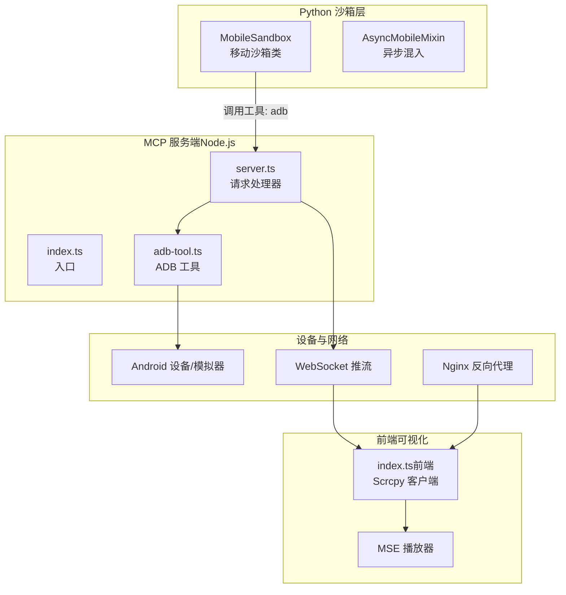
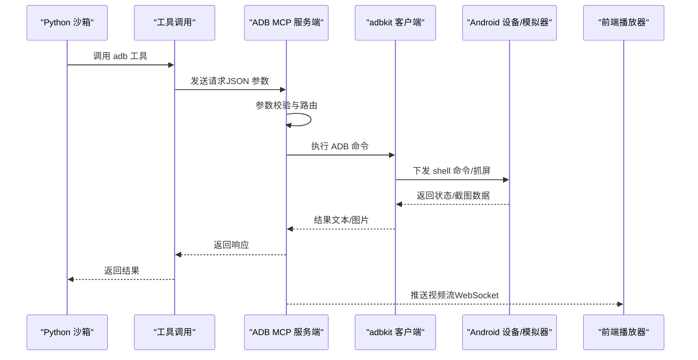
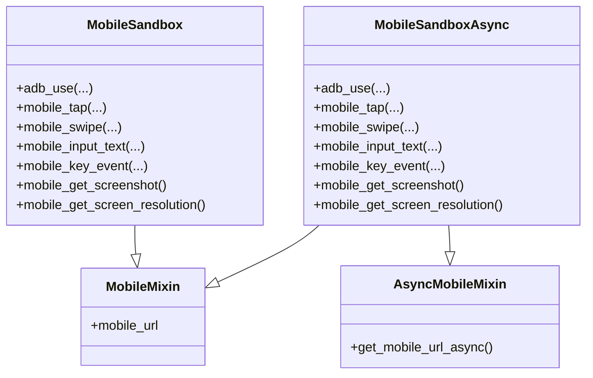
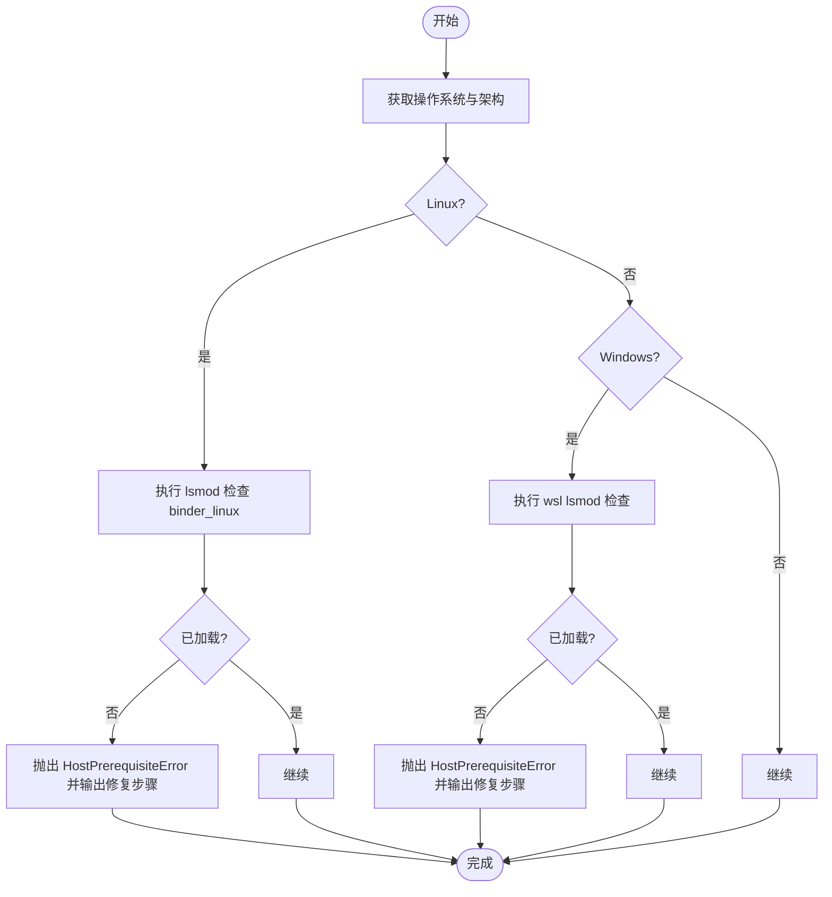
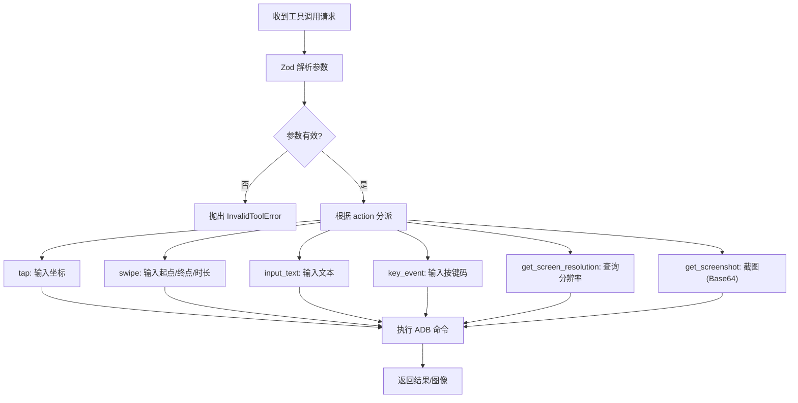
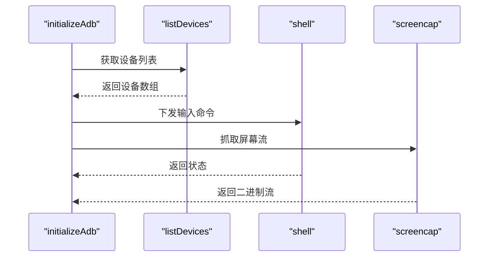
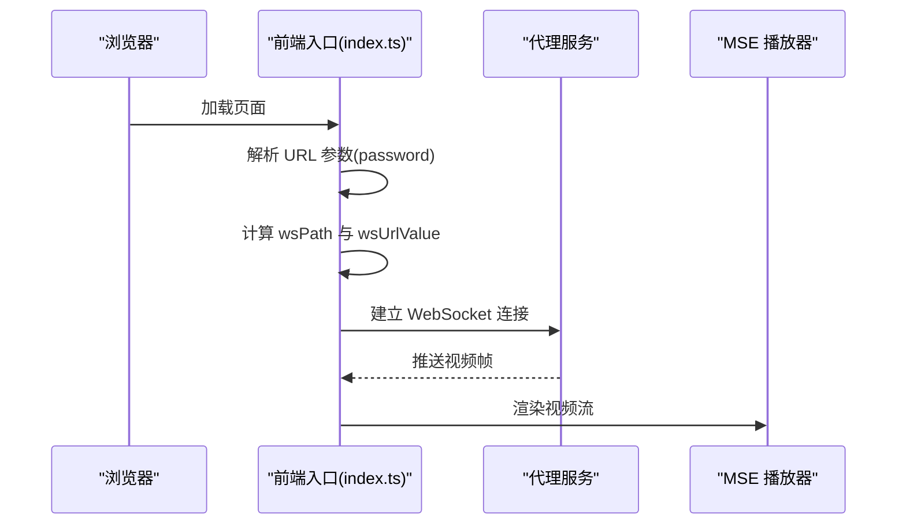
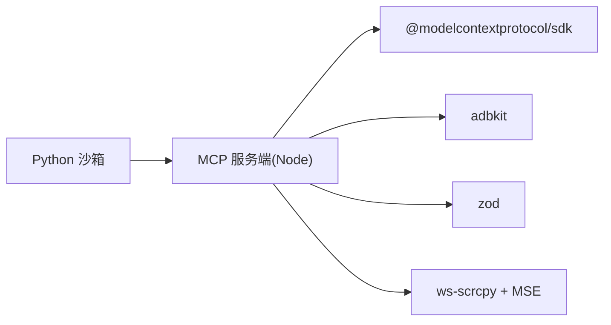

# 移动沙箱

<cite>
**本文引用的文件**
- [mobile_sandbox.py](file://src/agentscope_runtime/sandbox/box/mobile/mobile_sandbox.py)
- [host_checker.py](file://src/agentscope_runtime/sandbox/box/mobile/box/host_checker.py)
- [mcp_server_configs.json](file://src/agentscope_runtime/sandbox/box/mobile/box/mcp_server_configs.json)
- [index.ts（前端入口）](file://src/agentscope_runtime/sandbox/box/mobile/box/index.ts)
- [Dockerfile（移动沙箱镜像）](file://src/agentscope_runtime/sandbox/box/mobile/Dockerfile)
- [index.ts（ADB MCP 客户端）](file://src/agentscope_runtime/sandbox/box/mobile/adbmcp/src/index.ts)
- [server.ts（ADB MCP 服务端）](file://src/agentscope_runtime/sandbox/box/mobile/adbmcp/src/server.ts)
- [adb-tool.ts（ADB 工具实现）](file://src/agentscope_runtime/sandbox/box/mobile/adbmcp/src/adb-tool.ts)
- [types.d.ts（类型声明）](file://src/agentscope_runtime/sandbox/box/mobile/adbmcp/src/types.d.ts)
- [package.json（ADB MCP 包）](file://src/agentscope_runtime/sandbox/box/mobile/adbmcp/package.json)
</cite>

## 目录
1. [简介](#简介)
2. [项目结构](#项目结构)
3. [核心组件](#核心组件)
4. [架构总览](#架构总览)
5. [详细组件分析](#详细组件分析)
6. [依赖关系分析](#依赖关系分析)
7. [性能考虑](#性能考虑)
8. [故障排查指南](#故障排查指南)
9. [结论](#结论)
10. [附录](#附录)

## 简介
本技术文档面向移动沙箱（Mobile Sandbox），系统性阐述其移动端设备模拟与 ADB（Android Debug Bridge）协议集成方案，涵盖移动设备连接、屏幕控制与应用交互机制；详解移动沙箱的 MCP 服务器配置、ADB MCP 客户端实现与主机检查机制；并提供移动应用自动化测试、屏幕截图与用户交互模拟的使用示例；最后总结安全隔离与设备管理策略，并给出性能调优与设备兼容性指南。

## 项目结构
移动沙箱位于沙箱体系的 mobile 子模块中，采用“容器化运行时 + MCP 工具链 + 前端可视化”的分层设计：
- 运行时与沙箱封装：Python 层定义 MobileSandbox/MobileSandboxAsync，负责工具调用与连接参数生成。
- 主机前置检查：在实例化前执行主机环境校验，确保内核模块可用。
- MCP 服务端：Node.js 实现的 ADB MCP 服务，通过 STDIO 与宿主通信。
- 设备驱动：基于 adbkit 的 ADB 客户端，负责设备发现与命令下发。
- 前端可视化：基于 ws-scrcpy 的浏览器端播放器，通过 WebSocket 推流展示设备画面。
- 镜像构建：多阶段 Docker 构建，集成 adb-mcp、ws-scrcpy、Nginx、Supervisor 等组件。

图表来源
- [mobile_sandbox.py:80-342](file://src/agentscope_runtime/sandbox/box/mobile/mobile_sandbox.py#L80-L342)
- [index.ts（ADB MCP 客户端）:1-22](file://src/agentscope_runtime/sandbox/box/mobile/adbmcp/src/index.ts#L1-L22)
- [server.ts:138-222](file://src/agentscope_runtime/sandbox/box/mobile/adbmcp/src/server.ts#L138-L222)
- [adb-tool.ts:1-121](file://src/agentscope_runtime/sandbox/box/mobile/adbmcp/src/adb-tool.ts#L1-L121)
- [index.ts（前端入口）:1-69](file://src/agentscope_runtime/sandbox/box/mobile/box/index.ts#L1-L69)

章节来源
- [mobile_sandbox.py:1-342](file://src/agentscope_runtime/sandbox/box/mobile/mobile_sandbox.py#L1-L342)
- [Dockerfile（移动沙箱镜像）:1-96](file://src/agentscope_runtime/sandbox/box/mobile/Dockerfile#L1-L96)

## 核心组件
- 移动沙箱类（MobileSandbox/MobileSandboxAsync）
  - 提供统一的工具调用接口，封装 ADB 动作（点击、滑动、输入文本、按键事件、截图、分辨率查询等）。
  - 生成移动设备连接 URL（websockify），支持本地与远程访问。
  - 在首次实例化时执行主机就绪检查，确保内核模块可用。
- 主机检查器（HostChecker）
  - 针对 Linux/Windows（WSL2）分别进行内核模块校验与提示，缺失时抛出异常并给出修复步骤。
- MCP 服务器配置
  - 定义 adb-control MCP 服务器的启动命令与参数，指向 Node.js 入口脚本。
- ADB MCP 客户端（Node.js）
  - 通过 STDIO 与宿主进程建立传输通道，初始化 ADB 并注册服务端。
- ADB MCP 服务端（Node.js）
  - 定义工具清单与参数校验，处理 ADB 请求并返回结果或图像数据。
- 设备驱动（adbkit）
  - 列举设备、下发 shell 命令、抓取屏幕快照。
- 前端可视化（ws-scrcpy + MSE）
  - 通过 WebSocket 接收推流，使用 MSE 播放器渲染设备画面。

章节来源
- [mobile_sandbox.py:80-342](file://src/agentscope_runtime/sandbox/box/mobile/mobile_sandbox.py#L80-L342)
- [host_checker.py:15-113](file://src/agentscope_runtime/sandbox/box/mobile/box/host_checker.py#L15-L113)
- [mcp_server_configs.json:1-10](file://src/agentscope_runtime/sandbox/box/mobile/box/mcp_server_configs.json#L1-L10)
- [index.ts（ADB MCP 客户端）:1-22](file://src/agentscope_runtime/sandbox/box/mobile/adbmcp/src/index.ts#L1-L22)
- [server.ts:138-222](file://src/agentscope_runtime/sandbox/box/mobile/adbmcp/src/server.ts#L138-L222)
- [adb-tool.ts:1-121](file://src/agentscope_runtime/sandbox/box/mobile/adbmcp/src/adb-tool.ts#L1-L121)
- [index.ts（前端入口）:1-69](file://src/agentscope_runtime/sandbox/box/mobile/box/index.ts#L1-L69)

## 架构总览
移动沙箱的整体工作流如下：
- Python 层通过工具调用触发 ADB 动作。
- MCP 服务端解析参数并调用 adbkit 执行具体命令。
- 设备返回状态或二进制数据（如截图）。
- 前端通过 WebSocket 接收推流，实时显示设备画面。
- 运行时通过 Nginx/Supervisor 管理服务生命周期与反向代理。

图表来源
- [mobile_sandbox.py:114-230](file://src/agentscope_runtime/sandbox/box/mobile/mobile_sandbox.py#L114-L230)
- [server.ts:150-222](file://src/agentscope_runtime/sandbox/box/mobile/adbmcp/src/server.ts#L150-L222)
- [adb-tool.ts:98-121](file://src/agentscope_runtime/sandbox/box/mobile/adbmcp/src/adb-tool.ts#L98-L121)
- [index.ts（前端入口）:39-68](file://src/agentscope_runtime/sandbox/box/mobile/box/index.ts#L39-L68)

## 详细组件分析

### 组件一：移动沙箱类与连接 URL 生成
- 职责
  - 将 ADB 动作封装为工具调用，屏蔽底层协议细节。
  - 生成 websockify 连接 URL，支持本地与远程访问，携带认证令牌。
  - 在构造时执行主机就绪检查，避免运行期失败。
- 关键方法
  - adb_use：通用动作分发，按需传入坐标、起止点、持续时间、按键码、文本等。
  - mobile_tap/mobile_swipe/mobile_input_text/mobile_key_event/mobile_get_screenshot/mobile_get_screen_resolution：针对常用操作的便捷封装。
- 异步版本
  - MobileSandboxAsync 提供异步接口，适用于高并发场景。

图表来源
- [mobile_sandbox.py:17-342](file://src/agentscope_runtime/sandbox/box/mobile/mobile_sandbox.py#L17-L342)

章节来源
- [mobile_sandbox.py:80-342](file://src/agentscope_runtime/sandbox/box/mobile/mobile_sandbox.py#L80-L342)

### 组件二：主机检查与兼容性
- 职责
  - 在 Linux 上检查 binder_linux 内核模块是否加载；在 Windows WSL2 上检查 Docker Desktop 配置与内核模块。
  - 对 ARM64 架构发出兼容性警告。
- 处理流程
  - 获取平台信息 → 执行模块检查 → 缺失时抛出异常并输出修复指引 → 成功则记录日志。

图表来源
- [host_checker.py:15-113](file://src/agentscope_runtime/sandbox/box/mobile/box/host_checker.py#L15-L113)

章节来源
- [host_checker.py:15-113](file://src/agentscope_runtime/sandbox/box/mobile/box/host_checker.py#L15-L113)

### 组件三：ADB MCP 服务端与工具参数
- 职责
  - 定义工具清单与参数模式，校验输入并分派到具体实现。
  - 支持分辨率查询、点击、滑动、文本输入、按键事件、截图等。
- 参数校验
  - 使用 Zod 对动作类型与参数进行严格校验，错误时抛出 InvalidToolError。
- 数据返回
  - 文本型结果直接返回；截图以 Base64 PNG 形式返回。

图表来源
- [server.ts:14-81](file://src/agentscope_runtime/sandbox/box/mobile/adbmcp/src/server.ts#L14-L81)
- [server.ts:156-222](file://src/agentscope_runtime/sandbox/box/mobile/adbmcp/src/server.ts#L156-L222)

章节来源
- [server.ts:138-222](file://src/agentscope_runtime/sandbox/box/mobile/adbmcp/src/server.ts#L138-L222)

### 组件四：ADB 工具实现与设备交互
- 职责
  - 初始化 adbkit 客户端并选择首个可用设备。
  - 提供 tap/swipe/input_text/keyEvent/getScreenResolution/getScreenshot 等能力。
- 设备发现与命令
  - listDevices 用于选择设备；shell 用于下发输入命令；screencap 用于抓取屏幕。
- 错误处理
  - 未初始化设备 ID 或设备列表为空时抛出错误并终止进程。

图表来源
- [adb-tool.ts:9-32](file://src/agentscope_runtime/sandbox/box/mobile/adbmcp/src/adb-tool.ts#L9-L32)
- [adb-tool.ts:43-121](file://src/agentscope_runtime/sandbox/box/mobile/adbmcp/src/adb-tool.ts#L43-L121)

章节来源
- [adb-tool.ts:1-121](file://src/agentscope_runtime/sandbox/box/mobile/adbmcp/src/adb-tool.ts#L1-L121)

### 组件五：前端可视化与 WebSocket 推流
- 职责
  - 基于 ws-scrcpy 的浏览器端播放器，接收后端推送的视频流并渲染。
  - 通过 URL 参数传递密码与认证信息，动态计算 WebSocket 地址。
- 关键逻辑
  - 路径解析与 wsPath 计算。
  - 通过内部参数组合生成代理 ADB 的 WebSocket URL。
  - 启动 StreamClientScrcpy 并开始播放。

图表来源
- [index.ts（前端入口）:6-68](file://src/agentscope_runtime/sandbox/box/mobile/box/index.ts#L6-L68)

章节来源
- [index.ts（前端入口）:1-69](file://src/agentscope_runtime/sandbox/box/mobile/box/index.ts#L1-L69)

### 组件六：MCP 服务器配置与镜像构建
- MCP 服务器配置
  - 定义 adb-control 服务的启动命令与参数，指向 Node.js 入口脚本。
- 镜像构建
  - 多阶段构建：分别构建 adb-mcp 与 ws-scrcpy，再合并到最终镜像。
  - 安装系统依赖（bash、nginx、supervisor、python3、android-tools 等）。
  - 复制配置模板、启动脚本与预构建产物，设置入口脚本。

章节来源
- [mcp_server_configs.json:1-10](file://src/agentscope_runtime/sandbox/box/mobile/box/mcp_server_configs.json#L1-L10)
- [Dockerfile（移动沙箱镜像）:1-96](file://src/agentscope_runtime/sandbox/box/mobile/Dockerfile#L1-L96)

## 依赖关系分析
- Python 层依赖
  - 通过工具调用桥接到 MCP 服务端，再由 Node.js 侧通过 adbkit 与设备交互。
- Node.js 侧依赖
  - @modelcontextprotocol/sdk：MCP 协议实现。
  - adbkit：ADB 客户端库。
  - zod：参数校验。
  - nut-js：屏幕控制（类型声明中可见）。
- 前端依赖
  - ws-scrcpy：WebSocket 推流与播放。
  - MSE 播放器：HTML5 MSE 解码播放。

图表来源
- [package.json:29-46](file://src/agentscope_runtime/sandbox/box/mobile/adbmcp/package.json#L29-L46)
- [types.d.ts:3-32](file://src/agentscope_runtime/sandbox/box/mobile/adbmcp/src/types.d.ts#L3-L32)

章节来源
- [package.json:1-48](file://src/agentscope_runtime/sandbox/box/mobile/adbmcp/package.json#L1-L48)
- [types.d.ts:1-33](file://src/agentscope_runtime/sandbox/box/mobile/adbmcp/src/types.d.ts#L1-L33)

## 性能考虑
- 设备交互延迟
  - ADB 命令与设备响应存在固有延迟，建议在关键操作后进行截图确认状态变化。
- 截图与传输
  - 截图采用 Base64 PNG，体积较大，建议按需截图并缓存结果。
- 并发与异步
  - 使用 MobileSandboxAsync 提升并发吞吐，降低等待时间。
- 网络与推流
  - 前端播放器依赖 WebSocket 推流，网络抖动会影响体验；可结合重连与缓冲策略。
- 架构适配
  - ARM64 架构可能带来兼容性与性能问题，优先使用 x86_64 主机。

## 故障排查指南
- 主机前置检查失败
  - Linux：确认 binder_linux 已安装并加载；必要时安装额外内核模块并手动加载。
  - Windows：确保 Docker Desktop 使用 WSL2 后端，更新 WSL 并验证内核模块。
- 设备未连接或无设备
  - 确认 Android 设备/模拟器已连接且可被 ADB 识别；重启 ADB 服务或重新插拔设备。
- 权限与认证
  - 确保访问 URL 中的密码参数正确；检查运行时令牌有效性。
- 网络与代理
  - 检查 Nginx/Supervisor 配置与端口映射；确认 WebSocket 代理路径与参数正确。
- 日志定位
  - 查看 MCP 服务端与前端播放器的日志输出，定位参数校验与连接问题。

章节来源
- [host_checker.py:15-113](file://src/agentscope_runtime/sandbox/box/mobile/box/host_checker.py#L15-L113)
- [adb-tool.ts:9-32](file://src/agentscope_runtime/sandbox/box/mobile/adbmcp/src/adb-tool.ts#L9-L32)
- [index.ts（前端入口）:39-68](file://src/agentscope_runtime/sandbox/box/mobile/box/index.ts#L39-L68)

## 结论
移动沙箱通过 Python 沙箱层、MCP 服务端、ADB 工具与前端播放器的协同，实现了对 Android 设备的完整控制与可视化展示。其严格的参数校验、异步接口与主机前置检查提升了稳定性与易用性。结合性能优化与兼容性策略，可在多种环境中可靠运行，满足移动应用自动化测试与交互模拟需求。

## 附录
- 使用示例（概念性说明）
  - 移动应用自动化测试：先获取屏幕分辨率，再截图定位元素坐标，执行点击/滑动/输入文本/按键事件，最后截图确认状态。
  - 屏幕截图：调用截图工具获取当前画面，解析 Base64 图像并进行 OCR 或视觉比对。
  - 用户交互模拟：先聚焦输入框（点击文本框），再输入文本；导航使用按键事件（返回、主页、进入）。
- 安全与隔离
  - 运行时具备高安全级别配置；容器内仅暴露必要端口；通过认证令牌与密码参数限制访问。
- 设备管理策略
  - 自动选择首个可用设备；建议固定设备 UDID 以提升稳定性；对多设备场景可扩展设备选择逻辑。
- 性能调优与兼容性
  - 优先使用 x86_64 主机；减少不必要的截图；合理安排交互序列；在网络条件不佳时增加重试与缓冲。