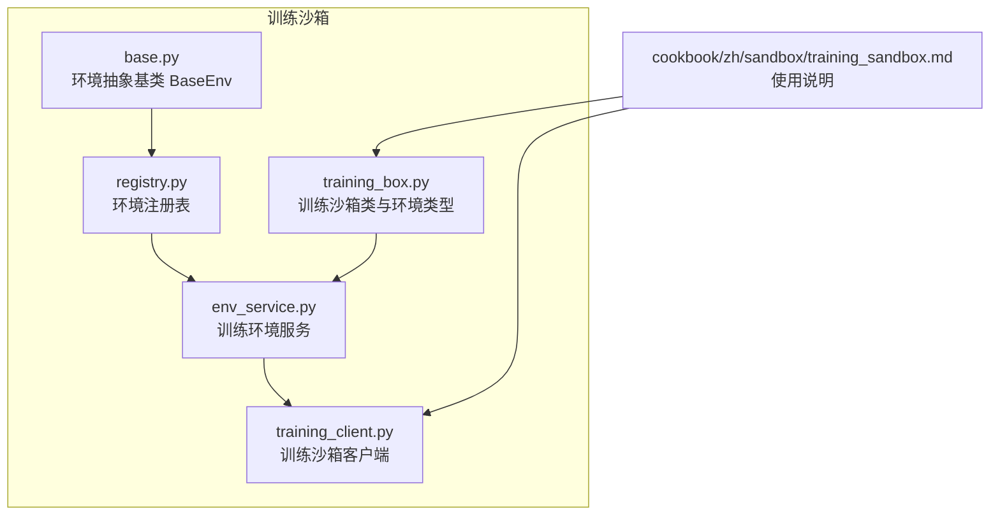
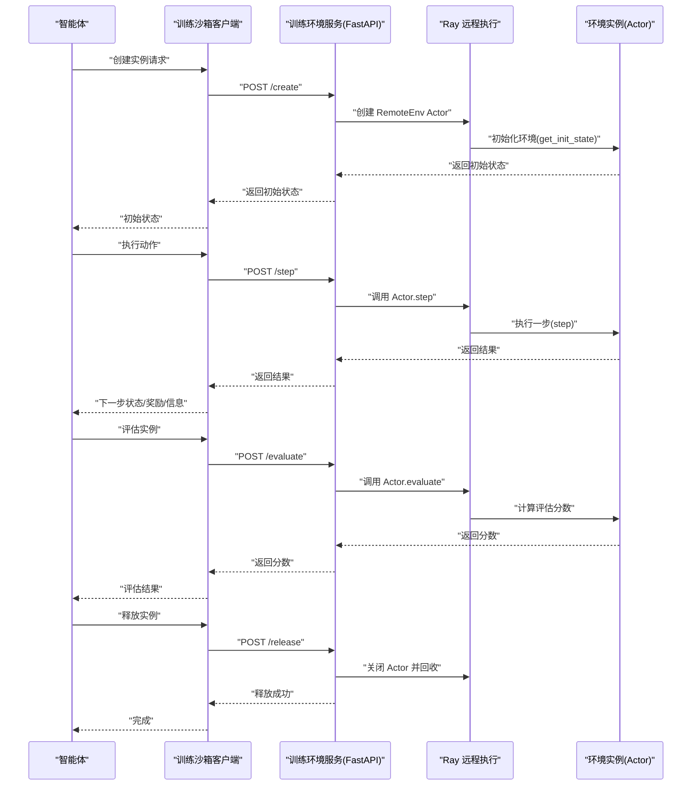
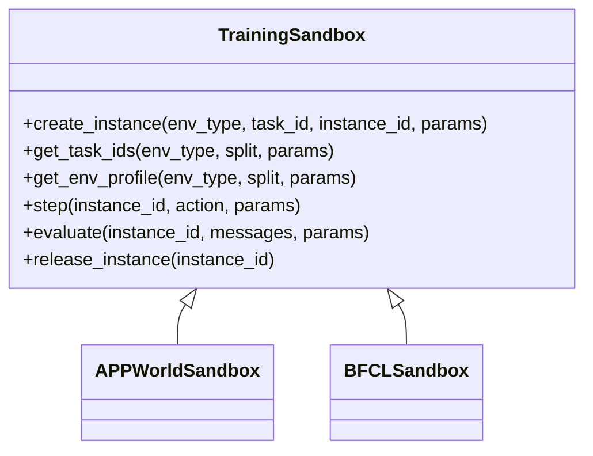
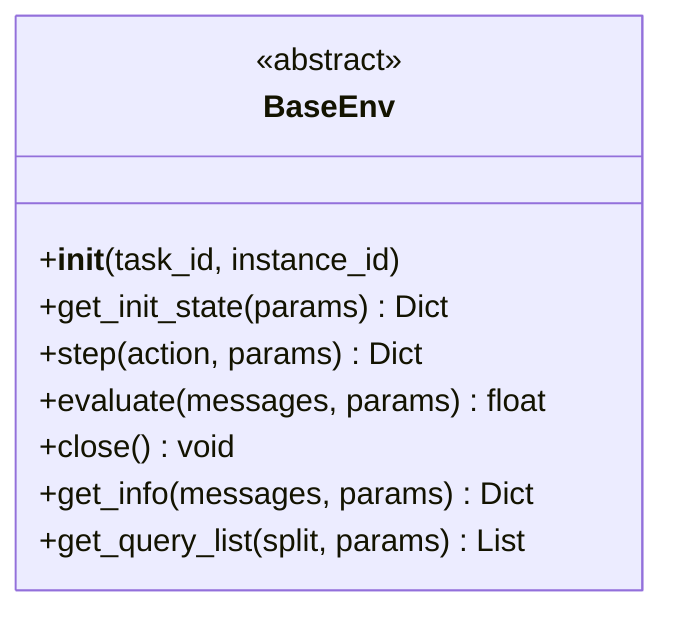
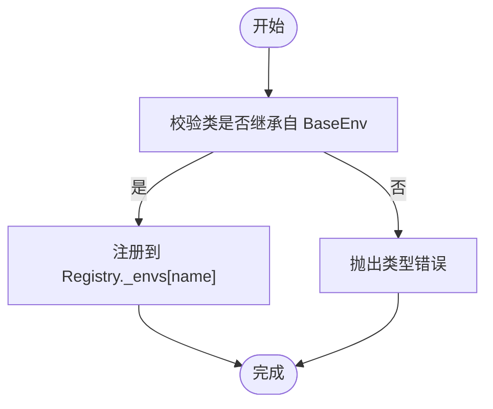
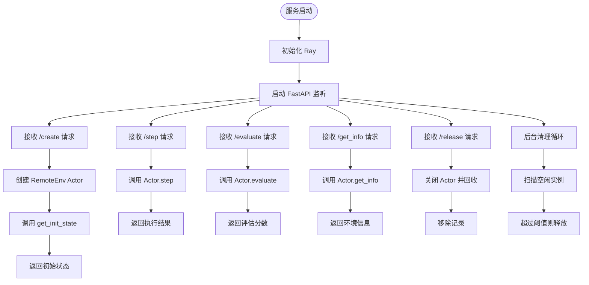
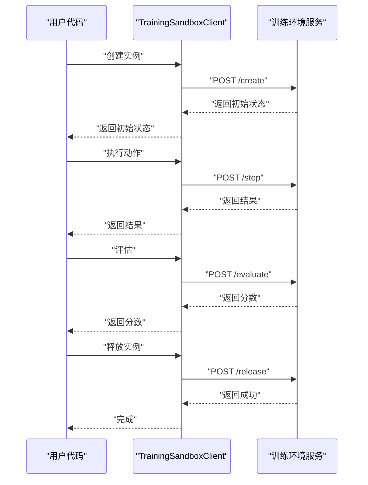
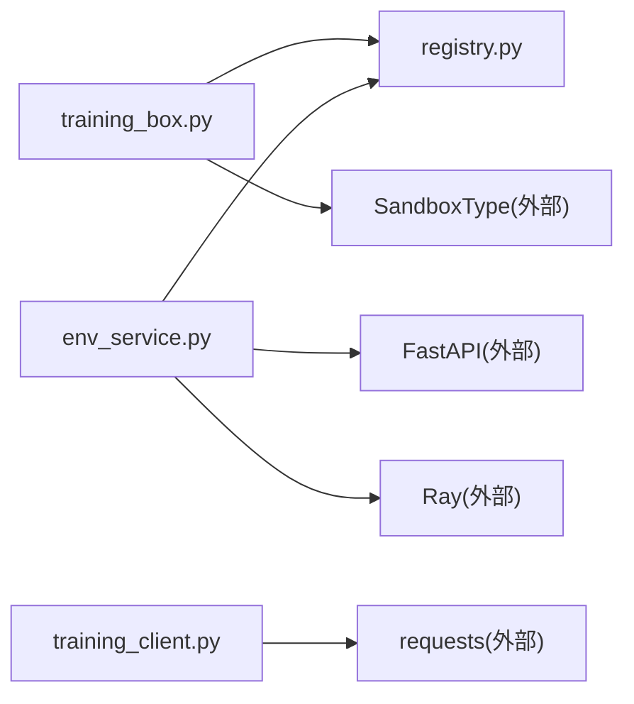

# 训练沙箱

<cite>
**本文引用的文件**
- [training_box.py](file://src/agentscope_runtime/sandbox/box/training_box/training_box.py)
- [base.py](file://src/agentscope_runtime/sandbox/box/training_box/base.py)
- [registry.py](file://src/agentscope_runtime/sandbox/box/training_box/registry.py)
- [env_service.py](file://src/agentscope_runtime/sandbox/box/training_box/env_service.py)
- [training_client.py](file://src/agentscope_runtime/sandbox/client/training_client.py)
- [training_sandbox.md](file://cookbook/zh/sandbox/training_sandbox.md)
</cite>

## 目录
1. [简介](#简介)
2. [项目结构](#项目结构)
3. [核心组件](#核心组件)
4. [架构总览](#架构总览)
5. [详细组件分析](#详细组件分析)
6. [依赖分析](#依赖分析)
7. [性能考虑](#性能考虑)
8. [故障排查指南](#故障排查指南)
9. [结论](#结论)
10. [附录](#附录)

## 简介
本技术文档围绕“训练沙箱”展开，系统性阐述其强化学习与仿真训练能力，重点覆盖两类训练环境：AppWorld 与 BFCLEnvironment 的实现原理；训练沙箱的环境注册机制、轨迹记录系统与训练服务管理；并提供从智能体训练流程、环境交互到性能评估的使用示例，解释奖励机制与状态空间设计，最后给出算法优化与大规模训练的最佳实践。

## 项目结构
训练沙箱位于 sandbox.box.training_box 子模块中，采用“服务端（FastAPI）+ 客户端（HTTP）+ 环境注册与远程执行”的分层架构。核心文件如下：
- training_box.py：训练沙箱类与具体环境类型（APPWorldSandbox、BFCLSandbox）定义
- base.py：环境抽象基类 BaseEnv，定义统一接口
- registry.py：环境注册表，按名称注册并检索环境类
- env_service.py：训练环境服务，负责实例生命周期管理与远程执行
- training_client.py：训练沙箱客户端，封装 HTTP 请求与工具调用
- 文档：cookbook 中的训练沙箱使用说明

图表来源
- [training_box.py:18-295](file://src/agentscope_runtime/sandbox/box/training_box/training_box.py#L18-L295)
- [base.py:7-121](file://src/agentscope_runtime/sandbox/box/training_box/base.py#L7-L121)
- [registry.py:11-55](file://src/agentscope_runtime/sandbox/box/training_box/registry.py#L11-L55)
- [env_service.py:123-753](file://src/agentscope_runtime/sandbox/box/training_box/env_service.py#L123-L753)
- [training_client.py:15-265](file://src/agentscope_runtime/sandbox/client/training_client.py#L15-L265)

章节来源
- [training_box.py:18-295](file://src/agentscope_runtime/sandbox/box/training_box/training_box.py#L18-L295)
- [env_service.py:123-753](file://src/agentscope_runtime/sandbox/box/training_box/env_service.py#L123-L753)
- [training_client.py:15-265](file://src/agentscope_runtime/sandbox/client/training_client.py#L15-L265)

## 核心组件
- 训练沙箱类（TrainingSandbox）：封装工具调用，提供创建实例、获取任务列表、获取环境配置、单步执行、评估与释放实例等方法，并通过注册表注册具体环境类型（如 APPWorldSandbox、BFCLSandbox）。
- 环境抽象基类（BaseEnv）：定义 get_init_state、step、evaluate、close、get_info、get_query_list 等统一接口，确保不同环境的一致行为契约。
- 环境注册表（Registry）：以名称注册环境类，提供获取与列举功能，保证运行时可动态加载与选择环境。
- 训练环境服务（EnvService）：基于 FastAPI 提供 REST 接口，使用 Ray 远程执行环境实例，维护实例生命周期、空闲清理与访问时间更新。
- 训练沙箱客户端（TrainingSandboxClient）：封装健康检查、请求发送与错误处理，暴露 create_instance、step、evaluate、release_instance 等工具调用。

章节来源
- [training_box.py:18-295](file://src/agentscope_runtime/sandbox/box/training_box/training_box.py#L18-L295)
- [base.py:7-121](file://src/agentscope_runtime/sandbox/box/training_box/base.py#L7-L121)
- [registry.py:11-55](file://src/agentscope_runtime/sandbox/box/training_box/registry.py#L11-L55)
- [env_service.py:123-753](file://src/agentscope_runtime/sandbox/box/training_box/env_service.py#L123-L753)
- [training_client.py:15-265](file://src/agentscope_runtime/sandbox/client/training_client.py#L15-L265)

## 架构总览
训练沙箱采用“客户端-服务端-远程环境实例”的三层架构：
- 客户端：通过 HTTP 调用服务端接口，完成环境实例的创建、交互与释放。
- 服务端：FastAPI 应用，提供 /create、/step、/evaluate、/release、/get_info、/get_env_profile 等端点；内部使用 Ray 将环境类远程化，按需创建 Actor 实例。
- 远程环境实例：每个环境类型对应一个 RemoteEnv Actor，负责实际的 get_init_state、step、evaluate、get_info、close 等操作。

图表来源
- [env_service.py:292-436](file://src/agentscope_runtime/sandbox/box/training_box/env_service.py#L292-L436)
- [training_client.py:146-205](file://src/agentscope_runtime/sandbox/client/training_client.py#L146-L205)

## 详细组件分析

### 训练沙箱类与环境类型
- TrainingSandbox：继承自通用 Sandbox，封装 create_instance、get_task_ids、get_env_profile、step、evaluate、release_instance 等工具调用，统一对外接口。
- APPWorldSandbox 与 BFCLSandbox：分别注册到 SandboxRegistry，携带镜像 URI、运行时配置（如共享内存）、安全等级、超时与描述信息；BFCLSandbox 还注入数据集路径等环境变量。

图表来源
- [training_box.py:18-295](file://src/agentscope_runtime/sandbox/box/training_box/training_box.py#L18-L295)

章节来源
- [training_box.py:18-295](file://src/agentscope_runtime/sandbox/box/training_box/training_box.py#L18-L295)

### 环境抽象基类 BaseEnv
- 统一接口：初始化状态获取、单步执行、评估、关闭、信息查询、查询列表获取。
- 设计要点：通过抽象方法约束所有具体环境必须实现一致的交互协议，便于客户端与服务端解耦。

图表来源
- [base.py:7-121](file://src/agentscope_runtime/sandbox/box/training_box/base.py#L7-L121)

章节来源
- [base.py:7-121](file://src/agentscope_runtime/sandbox/box/training_box/base.py#L7-L121)

### 环境注册表 Registry
- 注册机制：以名称注册环境类，校验是否继承自 BaseEnv；提供获取与列举功能。
- 使用方式：在 env_service 中通过 import_and_register_env 动态导入并注册指定环境模块。

图表来源
- [registry.py:11-55](file://src/agentscope_runtime/sandbox/box/training_box/registry.py#L11-L55)

章节来源
- [registry.py:11-55](file://src/agentscope_runtime/sandbox/box/training_box/registry.py#L11-L55)

### 训练环境服务 EnvService
- 生命周期管理：创建实例（生成 instance_id，远程初始化），单步执行，评估，获取信息，释放实例。
- 空闲清理：后台周期性扫描 last_access_time，超过阈值的实例自动释放。
- 远程执行：通过 Ray 将环境类包装为 RemoteEnv Actor，隔离执行并支持并发。
- FastAPI 接口：/create、/step、/evaluate、/get_info、/release、/get_env_profile。

图表来源
- [env_service.py:123-753](file://src/agentscope_runtime/sandbox/box/training_box/env_service.py#L123-L753)

章节来源
- [env_service.py:123-753](file://src/agentscope_runtime/sandbox/box/training_box/env_service.py#L123-L753)

### 训练沙箱客户端 TrainingSandboxClient
- 健康检查：轮询 /healthz，等待服务就绪。
- 工具调用：封装 create_instance、step、evaluate、release_instance、get_env_profile 等，统一错误处理。
- 请求封装：统一构造请求体（env_type、task_id、instance_id、messages、params），并解析响应。

图表来源
- [training_client.py:15-265](file://src/agentscope_runtime/sandbox/client/training_client.py#L15-L265)

章节来源
- [training_client.py:15-265](file://src/agentscope_runtime/sandbox/client/training_client.py#L15-L265)

### AppWorld 环境与 BFCLEnvironment 实现
- AppWorld 环境：通过 APPWorldSandbox 注册，适用于应用世界类的仿真训练场景。
- BFCLEnvironment：通过 BFCLSandbox 注册，注入 OPENAI_API_KEY、BFCL_DATA_PATH、BFCL_SPLIT_ID_PATH 等环境变量，适配多轮对话与评测数据集。

章节来源
- [training_box.py:206-295](file://src/agentscope_runtime/sandbox/box/training_box/training_box.py#L206-L295)

### 环境注册机制
- 运行时动态注册：env_service 中 import_and_register_env 按约定路径导入模块并注册到 Registry。
- 注册表检索：env_service 在 get_env_profile 等流程中通过 Registry.get 获取具体环境类。

章节来源
- [env_service.py:61-109](file://src/agentscope_runtime/sandbox/box/training_box/env_service.py#L61-L109)
- [env_service.py:258-259](file://src/agentscope_runtime/sandbox/box/training_box/env_service.py#L258-L259)
- [registry.py:38-47](file://src/agentscope_runtime/sandbox/box/training_box/registry.py#L38-L47)

### 轨迹记录系统
- 当前实现：训练环境服务通过 RemoteEnv Actor 执行 get_init_state、step、evaluate、get_info、close 等方法，但未在代码中发现显式的“轨迹记录”数据结构或持久化逻辑。
- 建议：可在 BaseEnv 的 step 返回结构中扩展轨迹字段（如 action、reward、next_state、info），并在 EnvService 层面聚合写入本地或对象存储，以支持离线回放与分析。

章节来源
- [base.py:38-75](file://src/agentscope_runtime/sandbox/box/training_box/base.py#L38-L75)
- [env_service.py:215-233](file://src/agentscope_runtime/sandbox/box/training_box/env_service.py#L215-L233)

### 训练服务管理
- 健康检查：/healthz 端点返回 200 表示服务可用。
- 实例生命周期：创建、访问时间更新、步骤执行、评估、释放；后台清理空闲实例。
- 错误处理：对 400/500 错误进行统一异常转换与堆栈输出。

章节来源
- [env_service.py:477-488](file://src/agentscope_runtime/sandbox/box/training_box/env_service.py#L477-L488)
- [env_service.py:149-168](file://src/agentscope_runtime/sandbox/box/training_box/env_service.py#L149-L168)
- [env_service.py:524-565](file://src/agentscope_runtime/sandbox/box/training_box/env_service.py#L524-L565)
- [env_service.py:568-603](file://src/agentscope_runtime/sandbox/box/training_box/env_service.py#L568-L603)
- [env_service.py:606-641](file://src/agentscope_runtime/sandbox/box/training_box/env_service.py#L606-L641)
- [env_service.py:644-680](file://src/agentscope_runtime/sandbox/box/training_box/env_service.py#L644-L680)
- [env_service.py:683-714](file://src/agentscope_runtime/sandbox/box/training_box/env_service.py#L683-L714)

## 依赖分析
- 组件耦合
  - training_box.py 依赖 registry 与枚举（SandboxType），并通过 SandboxRegistry 注册具体沙箱类型。
  - env_service.py 依赖 registry 与 FastAPI/Ray，负责环境类的动态导入与远程执行。
  - training_client.py 仅依赖 requests，与服务端接口解耦。
- 外部依赖
  - FastAPI：提供 REST 接口。
  - Ray：提供远程 Actor 执行与资源回收。
  - requests：客户端 HTTP 通信。

图表来源
- [training_box.py:12-15](file://src/agentscope_runtime/sandbox/box/training_box/training_box.py#L12-L15)
- [env_service.py:26-27](file://src/agentscope_runtime/sandbox/box/training_box/env_service.py#L26-L27)
- [training_client.py:9-12](file://src/agentscope_runtime/sandbox/client/training_client.py#L9-L12)

章节来源
- [training_box.py:12-15](file://src/agentscope_runtime/sandbox/box/training_box/training_box.py#L12-L15)
- [env_service.py:26-27](file://src/agentscope_runtime/sandbox/box/training_box/env_service.py#L26-L27)
- [training_client.py:9-12](file://src/agentscope_runtime/sandbox/client/training_client.py#L9-L12)

## 性能考虑
- 并发与隔离：通过 Ray Actor 隔离执行，避免状态共享带来的竞态；合理设置 max_idle_time 与 cleanup_interval，平衡资源占用与冷启动成本。
- 网络与序列化：客户端与服务端通过 JSON 传输，建议控制消息大小与嵌套层级；对大对象（如图像、长文本）采用外部存储引用。
- 资源限制：BFCLSandbox 显式设置了共享内存大小，避免 OOM；其他环境可根据任务需求调整。
- 批量与流水线：在客户端侧批量提交任务，减少网络往返；在服务端侧对相同任务合并调度。

## 故障排查指南
- 服务不可达
  - 确认 /healthz 返回 200；若失败，检查服务日志与端口绑定。
- 创建实例失败
  - 检查 env_type 与 task_id 是否为空；确认环境模块已正确导入与注册；查看服务端异常堆栈。
- 步骤执行异常
  - 检查 instance_id 是否存在；核对 action 结构是否符合环境期望。
- 评估或信息查询异常
  - 确认实例仍存活且未被清理；检查 messages/params 参数格式。
- 资源回收
  - 若出现内存不足或实例堆积，检查 max_idle_time 与清理循环是否正常运行。

章节来源
- [env_service.py:477-488](file://src/agentscope_runtime/sandbox/box/training_box/env_service.py#L477-L488)
- [env_service.py:524-565](file://src/agentscope_runtime/sandbox/box/training_box/env_service.py#L524-L565)
- [env_service.py:568-603](file://src/agentscope_runtime/sandbox/box/training_box/env_service.py#L568-L603)
- [env_service.py:606-641](file://src/agentscope_runtime/sandbox/box/training_box/env_service.py#L606-L641)
- [env_service.py:644-680](file://src/agentscope_runtime/sandbox/box/training_box/env_service.py#L644-L680)
- [env_service.py:683-714](file://src/agentscope_runtime/sandbox/box/training_box/env_service.py#L683-L714)

## 结论
训练沙箱通过“抽象接口 + 注册表 + 远程执行 + REST 服务”的组合，提供了可扩展、可隔离、可管理的强化学习与仿真训练平台。当前实现已覆盖环境创建、交互、评估与释放的完整生命周期；建议后续增强轨迹记录与指标采集，以支撑更完善的训练闭环与复盘分析。

## 附录

### 使用示例（流程与要点）
- 准备阶段
  - 启动训练环境服务（FastAPI + Ray），确保 /healthz 可用。
  - 通过客户端进行健康检查与工具调用。
- 典型流程
  - 获取任务列表：调用 get_env_profile 或 get_task_ids。
  - 创建实例：传入 env_type 与 task_id，获得初始状态。
  - 循环交互：根据环境返回的状态与规则执行动作，调用 step 获取下一步状态。
  - 评估实例：在合适时机调用 evaluate 获取评分。
  - 释放实例：训练完成后调用 release_instance 回收资源。
- 注意事项
  - 控制实例数量与空闲时间，避免资源泄漏。
  - 对大消息采用外部存储引用，降低序列化开销。

章节来源
- [training_client.py:94-205](file://src/agentscope_runtime/sandbox/client/training_client.py#L94-L205)
- [env_service.py:477-488](file://src/agentscope_runtime/sandbox/box/training_box/env_service.py#L477-L488)

### 奖励机制与状态空间设计
- 状态空间：由具体环境实现决定，通常包含观察、可选的元信息与历史上下文；建议在 get_init_state 与 step 返回中明确字段含义。
- 奖励机制：由 evaluate 返回浮点分数，用于衡量策略性能；建议在 step 中返回即时奖励与累计奖励摘要，便于监控与调试。

章节来源
- [base.py:26-75](file://src/agentscope_runtime/sandbox/box/training_box/base.py#L26-L75)

### 算法优化与大规模训练最佳实践
- 数据批量化：将多个 task_id 组织为批次，减少服务端往返。
- 并发调度：利用 Ray Actor 并发执行多个实例，结合队列与限速控制吞吐。
- 缓存与复用：对重复任务或相似状态进行缓存，减少重复初始化。
- 指标与可视化：在服务端聚合关键指标（如成功率、平均步数、评估分数），配合日志与监控系统。
- 弹性扩缩容：结合部署平台的弹性能力，按负载动态增减实例数量。