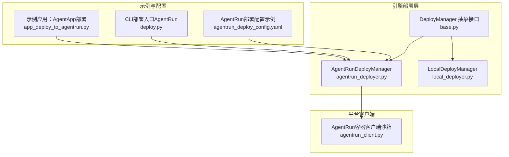
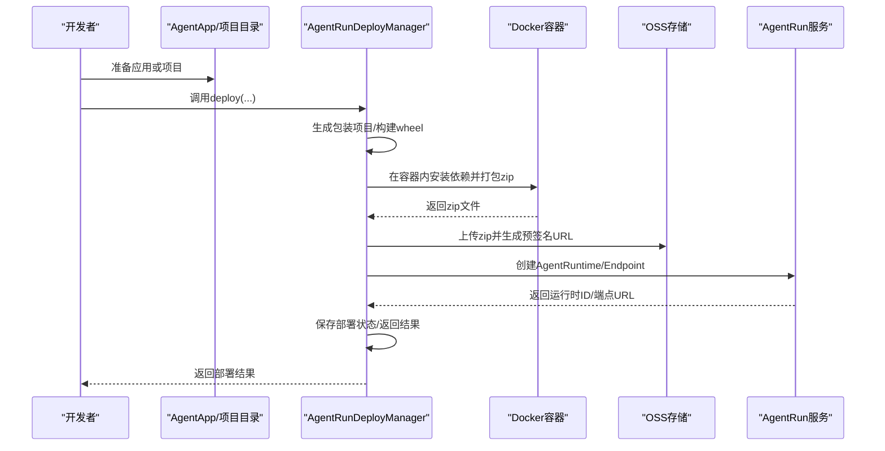
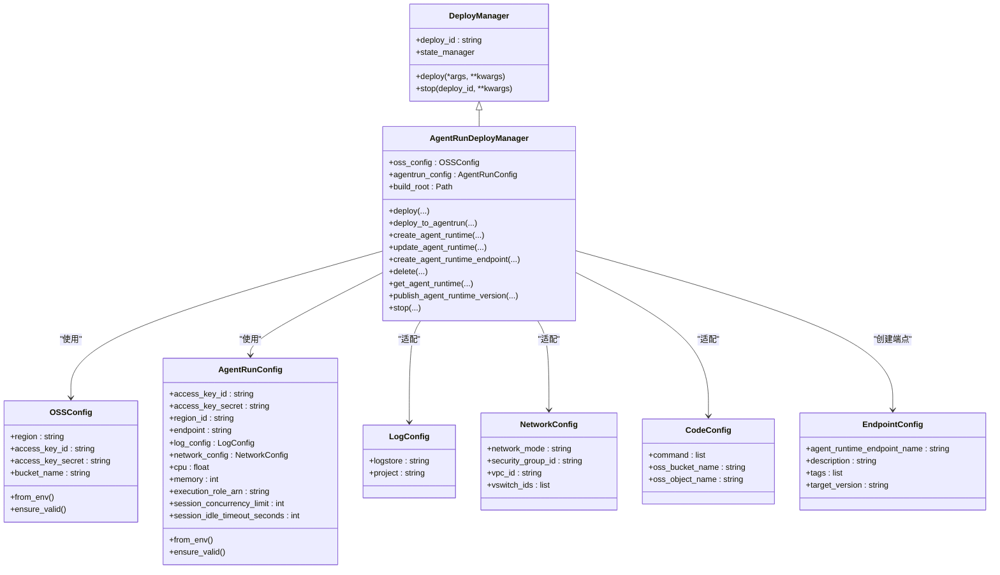
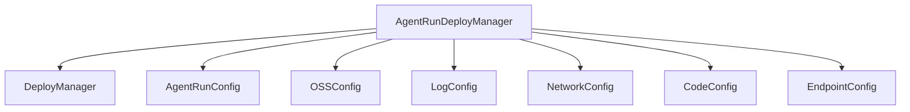

# AgentRun部署

<cite>
**本文引用的文件**
- [agentrun_deployer.py](file://src/agentscope_runtime/engine/deployers/agentrun_deployer.py)
- [app_deploy_to_agentrun.py](file://examples/deployments/agentrun_deploy/app_deploy_to_agentrun.py)
- [agentrun_deploy_config.yaml](file://examples/deployments/agentrun_deploy_config.yaml)
- [base.py](file://src/agentscope_runtime/engine/deployers/base.py)
- [local_deployer.py](file://src/agentscope_runtime/engine/deployers/local_deployer.py)
- [agentrun_client.py](file://src/agentscope_runtime/common/container_clients/agentrun_client.py)
- [test_agentrun_deployer.py](file://tests/deploy/test_agentrun_deployer.py)
- [deploy.py](file://src/agentscope_runtime/cli/commands/deploy.py)
</cite>

## 目录
1. [简介](#简介)
2. [项目结构](#项目结构)
3. [核心组件](#核心组件)
4. [架构总览](#架构总览)
5. [详细组件分析](#详细组件分析)
6. [依赖关系分析](#依赖关系分析)
7. [性能考量](#性能考量)
8. [故障排查指南](#故障排查指南)
9. [结论](#结论)
10. [附录](#附录)

## 简介
本文件面向AgentScope Runtime的AgentRun部署能力，系统性阐述AgentRun平台的集成原理与部署机制，重点解析AgentRunDeployManager类的实现，包括平台认证、资源配置、构建打包、上传分发、运行时创建与端点发布、状态轮询与错误处理等关键环节。同时提供完整的集成示例、配置方法、平台特性与使用限制说明，并给出实际部署示例与最佳实践建议。

## 项目结构
AgentRun部署相关的核心代码位于引擎部署模块中，围绕“部署管理器”抽象接口展开，AgentRunDeployManager继承通用部署基类，封装了与阿里云AgentRun服务及OSS的交互逻辑；示例与测试分别展示了从AgentApp到直接项目目录的多种部署方式，CLI命令支持通过配置文件驱动部署。

图示来源
- [base.py:1-44](file://src/agentscope_runtime/engine/deployers/base.py#L1-L44)
- [agentrun_deployer.py:264-300](file://src/agentscope_runtime/engine/deployers/agentrun_deployer.py#L264-L300)
- [local_deployer.py:27-67](file://src/agentscope_runtime/engine/deployers/local_deployer.py#L27-L67)
- [app_deploy_to_agentrun.py:125-203](file://examples/deployments/agentrun_deploy/app_deploy_to_agentrun.py#L125-L203)
- [deploy.py:707-741](file://src/agentscope_runtime/cli/commands/deploy.py#L707-L741)
- [agentrun_client.py:32-66](file://src/agentscope_runtime/common/container_clients/agentrun_client.py#L32-L66)

章节来源
- [base.py:1-44](file://src/agentscope_runtime/engine/deployers/base.py#L1-L44)
- [agentrun_deployer.py:264-300](file://src/agentscope_runtime/engine/deployers/agentrun_deployer.py#L264-L300)
- [local_deployer.py:27-67](file://src/agentscope_runtime/engine/deployers/local_deployer.py#L27-L67)
- [app_deploy_to_agentrun.py:125-203](file://examples/deployments/agentrun_deploy/app_deploy_to_agentrun.py#L125-L203)
- [deploy.py:707-741](file://src/agentscope_runtime/cli/commands/deploy.py#L707-L741)
- [agentrun_client.py:32-66](file://src/agentscope_runtime/common/container_clients/agentrun_client.py#L32-L66)

## 核心组件
- AgentRunDeployManager：负责AgentRun平台的完整部署生命周期，包括项目打包、Docker构建与压缩、OSS上传、AgentRun运行时与端点创建、状态轮询与结果保存。
- 配置模型：AgentRunConfig、OSSConfig、LogConfig、NetworkConfig、CodeConfig、EndpointConfig，用于描述平台参数、网络与日志配置、代码包配置与端点配置。
- 基类DeployManager：统一的部署抽象接口，生成唯一部署ID并维护状态管理器。
- 示例与CLI：提供从AgentApp、项目目录、已有wheel三种路径的部署示例，以及CLI命令行入口。

章节来源
- [agentrun_deployer.py:87-262](file://src/agentscope_runtime/engine/deployers/agentrun_deployer.py#L87-L262)
- [base.py:9-44](file://src/agentscope_runtime/engine/deployers/base.py#L9-L44)
- [app_deploy_to_agentrun.py:125-203](file://examples/deployments/agentrun_deploy/app_deploy_to_agentrun.py#L125-L203)
- [deploy.py:707-741](file://src/agentscope_runtime/cli/commands/deploy.py#L707-L741)

## 架构总览
AgentRun部署采用“本地构建+云端分发”的模式：在本地通过Docker容器完成依赖安装与打包，生成zip归档后上传至OSS；随后调用AgentRun SDK创建运行时与端点，最后进行状态轮询直至可用。

图示来源
- [agentrun_deployer.py:521-733](file://src/agentscope_runtime/engine/deployers/agentrun_deployer.py#L521-L733)
- [agentrun_deployer.py:876-1028](file://src/agentscope_runtime/engine/deployers/agentrun_deployer.py#L876-L1028)
- [agentrun_deployer.py:1030-1295](file://src/agentscope_runtime/engine/deployers/agentrun_deployer.py#L1030-L1295)

## 详细组件分析

### AgentRunDeployManager类实现
- 初始化与认证
  - 从环境变量加载AgentRun与OSS配置，支持AK/SK、区域、CPU/内存、会话并发与空闲超时等参数。
  - 基于OpenAPI配置创建AgentRun SDK客户端，默认端点为按区域拼接的域名。
- 配置适配
  - 将内部配置对象适配为SDK所需的CodeConfiguration、LogConfiguration、NetworkConfiguration格式。
- 项目构建与打包
  - 支持从AgentApp生成分离项目、构建wheel、在Docker容器内安装依赖并打包zip，确保与AgentRun运行环境兼容。
- 上传与分发
  - 使用OSS SDK上传zip至固定桶，自动创建桶并打标签以允许AgentRun访问，生成3小时有效期的预签名URL。
- 运行时与端点管理
  - 新建/更新AgentRuntime，设置资源规格、端口、代码包位置、环境变量、日志与网络配置。
  - 创建默认端点，目标版本指向最新，返回公网URL。
- 状态轮询与清理
  - 提供运行时与端点的状态轮询，直到达到终止态；支持删除运行时与端点。
  - stop方法通过删除运行时实现停止，并更新状态管理器。

图示来源
- [base.py:9-44](file://src/agentscope_runtime/engine/deployers/base.py#L9-L44)
- [agentrun_deployer.py:264-300](file://src/agentscope_runtime/engine/deployers/agentrun_deployer.py#L264-L300)
- [agentrun_deployer.py:87-262](file://src/agentscope_runtime/engine/deployers/agentrun_deployer.py#L87-L262)

章节来源
- [agentrun_deployer.py:285-331](file://src/agentscope_runtime/engine/deployers/agentrun_deployer.py#L285-L331)
- [agentrun_deployer.py:333-392](file://src/agentscope_runtime/engine/deployers/agentrun_deployer.py#L333-L392)
- [agentrun_deployer.py:394-458](file://src/agentscope_runtime/engine/deployers/agentrun_deployer.py#L394-L458)
- [agentrun_deployer.py:876-1028](file://src/agentscope_runtime/engine/deployers/agentrun_deployer.py#L876-L1028)
- [agentrun_deployer.py:1030-1295](file://src/agentscope_runtime/engine/deployers/agentrun_deployer.py#L1030-L1295)
- [agentrun_deployer.py:1305-1386](file://src/agentscope_runtime/engine/deployers/agentrun_deployer.py#L1305-L1386)
- [agentrun_deployer.py:1388-1457](file://src/agentscope_runtime/engine/deployers/agentrun_deployer.py#L1388-L1457)
- [agentrun_deployer.py:1459-1614](file://src/agentscope_runtime/engine/deployers/agentrun_deployer.py#L1459-L1614)
- [agentrun_deployer.py:1616-1801](file://src/agentscope_runtime/engine/deployers/agentrun_deployer.py#L1616-L1801)
- [agentrun_deployer.py:1803-1949](file://src/agentscope_runtime/engine/deployers/agentrun_deployer.py#L1803-L1949)
- [agentrun_deployer.py:1951-2092](file://src/agentscope_runtime/engine/deployers/agentrun_deployer.py#L1951-L2092)
- [agentrun_deployer.py:2094-2343](file://src/agentscope_runtime/engine/deployers/agentrun_deployer.py#L2094-L2343)
- [agentrun_deployer.py:2345-2435](file://src/agentscope_runtime/engine/deployers/agentrun_deployer.py#L2345-L2435)
- [agentrun_deployer.py:2437-2500](file://src/agentscope_runtime/engine/deployers/agentrun_deployer.py#L2437-L2500)
- [agentrun_deployer.py:2502-2588](file://src/agentscope_runtime/engine/deployers/agentrun_deployer.py#L2502-L2588)
- [agentrun_deployer.py:2590-2672](file://src/agentscope_runtime/engine/deployers/agentrun_deployer.py#L2590-L2672)

### 平台认证与配置
- 认证方式
  - AgentRunConfig：支持从环境变量读取AK/SK、区域、端点、CPU/内存、会话并发与空闲超时等参数；提供校验方法。
  - OSSConfig：支持从环境变量读取OSS区域、AK/SK与桶名，若未显式提供则回退到阿里云AK/SK；提供校验方法。
- 环境变量映射
  - AgentRun：ALIBABA_CLOUD_ACCESS_KEY_ID、ALIBABA_CLOUD_ACCESS_KEY_SECRET、AGENT_RUN_REGION_ID、AGENT_RUN_CPU、AGENT_RUN_MEMORY、AGENT_RUN_SESSION_CONCURRENCY_LIMIT、AGENT_RUN_SESSION_IDLE_TIMEOUT_SECONDS、AGENT_RUN_LOG_PROJECT、AGENT_RUN_LOG_STORE、AGENT_RUN_NETWORK_MODE、AGENT_RUN_VPC_ID、AGENT_RUN_SECURITY_GROUP_ID、AGENT_RUN_VSWITCH_IDS。
  - OSS：OSS_REGION、OSS_ACCESS_KEY_ID、OSS_ACCESS_KEY_SECRET、OSS_BUCKET_NAME。
- 网络与日志
  - NetworkConfig支持PUBLIC/PUBLIC_AND_PRIVATE模式，可指定VPC、安全组与交换机列表。
  - LogConfig支持指定日志项目与Store。

章节来源
- [agentrun_deployer.py:87-201](file://src/agentscope_runtime/engine/deployers/agentrun_deployer.py#L87-L201)
- [agentrun_deployer.py:220-262](file://src/agentscope_runtime/engine/deployers/agentrun_deployer.py#L220-L262)

### 资源配置与构建流程
- 资源规格
  - CPU与内存由AgentRunConfig控制，影响运行时实例规格。
- 项目构建
  - 可从AgentApp生成分离项目，写入.env环境变量文件；或直接从项目目录与启动命令构建。
  - 通过generate_wrapper_project与build_wheel生成wheel包，再在Docker容器内安装依赖并打包zip，确保与AgentRun运行环境一致。
- 上传与分发
  - 自动创建OSS桶（私有、低频存储），打上AgentRun访问标签，上传zip并生成3小时有效预签名URL。

章节来源
- [agentrun_deployer.py:460-520](file://src/agentscope_runtime/engine/deployers/agentrun_deployer.py#L460-L520)
- [agentrun_deployer.py:394-458](file://src/agentscope_runtime/engine/deployers/agentrun_deployer.py#L394-L458)
- [agentrun_deployer.py:876-1028](file://src/agentscope_runtime/engine/deployers/agentrun_deployer.py#L876-L1028)

### 运行时与端点管理
- 创建/更新运行时
  - 设置资源规格、端口、代码包位置（OSS）、环境变量、日志与网络配置，必要时绑定执行角色ARN。
- 创建/更新端点
  - 默认端点名称为"default-endpoint"，目标版本指向"LATEST"，返回公网URL。
- 版本发布
  - 支持发布运行时版本，便于灰度与回滚。

章节来源
- [agentrun_deployer.py:1030-1295](file://src/agentscope_runtime/engine/deployers/agentrun_deployer.py#L1030-L1295)
- [agentrun_deployer.py:1803-1949](file://src/agentscope_runtime/engine/deployers/agentrun_deployer.py#L1803-L1949)
- [agentrun_deployer.py:2094-2343](file://src/agentscope_runtime/engine/deployers/agentrun_deployer.py#L2094-L2343)
- [agentrun_deployer.py:2502-2588](file://src/agentscope_runtime/engine/deployers/agentrun_deployer.py#L2502-L2588)

### 状态轮询与错误处理
- 轮询策略
  - 最大尝试次数与间隔可配置，默认60次、每秒一次；终端状态包括CREATE_FAILED、UPDATE_FAILED、READY、ACTIVE、FAILED、DELETING。
- 错误处理
  - 对SDK调用失败、Docker构建失败、OSS上传失败等情况进行捕获与返回；在部署流程中记录详细日志并抛出异常以便上层处理。

章节来源
- [agentrun_deployer.py:1616-1801](file://src/agentscope_runtime/engine/deployers/agentrun_deployer.py#L1616-L1801)
- [agentrun_deployer.py:1459-1614](file://src/agentscope_runtime/engine/deployers/agentrun_deployer.py#L1459-L1614)
- [agentrun_deployer.py:862-874](file://src/agentscope_runtime/engine/deployers/agentrun_deployer.py#L862-L874)

### 集成示例与配置方法
- AgentApp部署
  - 通过AgentApp定义查询函数与端点，使用deploy方法传入AgentRunDeployManager完成部署。
- 项目目录部署
  - 指定project_dir与cmd，自动推断入口脚本并构建部署。
- 已有wheel部署
  - 通过external_whl_path跳过构建步骤，直接进行zip打包、上传与部署。
- CLI部署
  - 支持通过命令行传入region、cpu、memory等参数，自动设置环境变量并触发部署。

章节来源
- [app_deploy_to_agentrun.py:125-203](file://examples/deployments/agentrun_deploy/app_deploy_to_agentrun.py#L125-L203)
- [app_deploy_to_agentrun.py:205-243](file://examples/deployments/agentrun_deploy/app_deploy_to_agentrun.py#L205-L243)
- [app_deploy_to_agentrun.py:246-283](file://examples/deployments/agentrun_deploy/app_deploy_to_agentrun.py#L246-L283)
- [deploy.py:707-741](file://src/agentscope_runtime/cli/commands/deploy.py#L707-L741)
- [agentrun_deploy_config.yaml:1-28](file://examples/deployments/agentrun_deploy_config.yaml#L1-L28)

### 平台特性与使用限制
- 平台特性
  - 支持PUBLIC与PUBLIC_AND_PRIVATE网络模式，可绑定VPC、安全组与交换机。
  - 支持日志项目与Store配置，便于集中化日志采集。
  - 支持会话并发限制与空闲超时，保障资源利用率与成本控制。
- 使用限制
  - 需要有效的阿里云AK/SK与OSS桶权限；若未显式提供OSS AK/SK，将回退到阿里云AK/SK。
  - Docker需在本地可用，用于在容器内安装依赖并打包zip。
  - AgentRun运行时端点默认名称为"default-endpoint"，目标版本为"LATEST"。

章节来源
- [agentrun_deployer.py:87-201](file://src/agentscope_runtime/engine/deployers/agentrun_deployer.py#L87-L201)
- [agentrun_deployer.py:333-392](file://src/agentscope_runtime/engine/deployers/agentrun_deployer.py#L333-L392)
- [agentrun_deployer.py:1030-1295](file://src/agentscope_runtime/engine/deployers/agentrun_deployer.py#L1030-L1295)

## 依赖关系分析
AgentRunDeployManager依赖于以下组件：
- 部署基类：统一的部署抽象与状态管理。
- 配置模型：AgentRunConfig、OSSConfig及其子配置类型。
- SDK客户端：AgentRun SDK与OSS SDK。
- 工具链：wheel打包、Docker构建、zip打包。

图示来源
- [base.py:9-44](file://src/agentscope_runtime/engine/deployers/base.py#L9-L44)
- [agentrun_deployer.py:87-262](file://src/agentscope_runtime/engine/deployers/agentrun_deployer.py#L87-L262)

章节来源
- [base.py:9-44](file://src/agentscope_runtime/engine/deployers/base.py#L9-L44)
- [agentrun_deployer.py:87-262](file://src/agentscope_runtime/engine/deployers/agentrun_deployer.py#L87-L262)

## 性能考量
- 构建阶段
  - Docker容器内安装依赖与打包zip，避免宿主机环境差异；建议在CI中缓存依赖以提升速度。
- 上传阶段
  - OSS上传采用二进制流直传，建议在带宽充足的环境中进行；预签名URL仅3小时有效期，需在部署后尽快完成后续步骤。
- 运行时阶段
  - 合理设置CPU与内存，避免过度分配导致成本上升；根据业务峰值调整会话并发限制与空闲超时。
- 轮询阶段
  - 默认轮询间隔较短，注意避免频繁请求导致限流；可根据实际情况调整轮询策略。

## 故障排查指南
- 常见问题
  - Docker不可用：检查Docker是否安装并加入PATH，参考错误提示中的安装链接。
  - OSS SDK缺失：安装alibabacloud-oss-v2以启用OSS上传功能。
  - 缺少AK/SK：确保已设置阿里云AK/SK或OSS AK/SK；AgentRunConfig与OSSConfig均提供校验方法。
  - 上传失败：检查OSS桶是否存在且具备AgentRun访问标签；确认网络连通性。
  - 运行时/端点创建失败：查看状态轮询结果与错误码，定位具体失败原因。
- 定位手段
  - 查看部署日志输出，关注Docker构建、OSS上传、AgentRun创建与轮询阶段的日志。
  - 使用AgentRun控制台查看运行时与端点状态，核对资源规格与网络配置。
  - 通过stop方法删除运行时，清理平台资源后重试。

章节来源
- [agentrun_deployer.py:862-874](file://src/agentscope_runtime/engine/deployers/agentrun_deployer.py#L862-L874)
- [agentrun_deployer.py:912-918](file://src/agentscope_runtime/engine/deployers/agentrun_deployer.py#L912-L918)
- [agentrun_deployer.py:1459-1614](file://src/agentscope_runtime/engine/deployers/agentrun_deployer.py#L1459-L1614)
- [agentrun_deployer.py:1616-1801](file://src/agentscope_runtime/engine/deployers/agentrun_deployer.py#L1616-L1801)

## 结论
AgentRunDeployManager提供了从本地构建到云端部署的一体化解决方案，通过严格的配置校验、容器化打包与平台SDK集成，实现了高可靠、可扩展的Agent运行时部署。结合CLI与示例工程，用户可以快速完成从开发到上线的全流程部署，并通过状态轮询与清理机制保障运维效率。

## 附录
- 测试覆盖
  - 单测覆盖了部署流程的关键分支，包括跳过上传、外部wheel、更新现有运行时、创建/更新运行时与端点、删除运行时、获取运行时详情、发布版本等场景。
- 最佳实践
  - 在CI中缓存Docker层与wheel构建产物，缩短构建时间。
  - 合理设置资源规格与会话并发，避免资源浪费。
  - 使用预签名URL在部署后尽快完成后续步骤，减少失效风险。
  - 通过状态轮询与日志定位问题，必要时使用stop清理平台资源。

章节来源
- [test_agentrun_deployer.py:72-137](file://tests/deploy/test_agentrun_deployer.py#L72-L137)
- [test_agentrun_deployer.py:139-217](file://tests/deploy/test_agentrun_deployer.py#L139-L217)
- [test_agentrun_deployer.py:219-275](file://tests/deploy/test_agentrun_deployer.py#L219-L275)
- [test_agentrun_deployer.py:277-380](file://tests/deploy/test_agentrun_deployer.py#L277-L380)
- [test_agentrun_deployer.py:382-544](file://tests/deploy/test_agentrun_deployer.py#L382-L544)
- [test_agentrun_deployer.py:546-800](file://tests/deploy/test_agentrun_deployer.py#L546-L800)