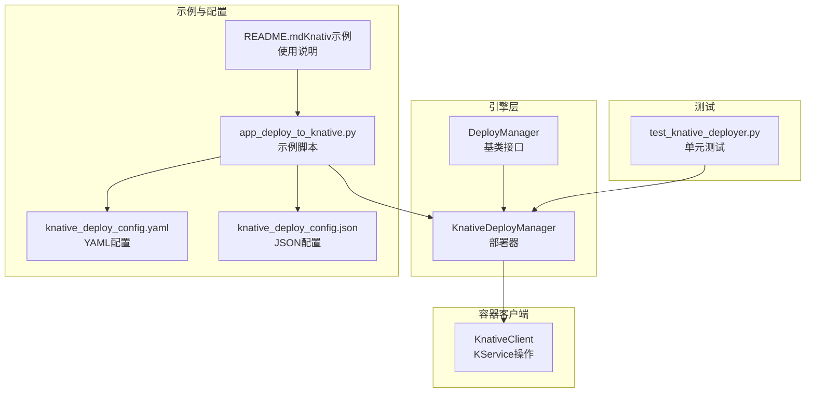
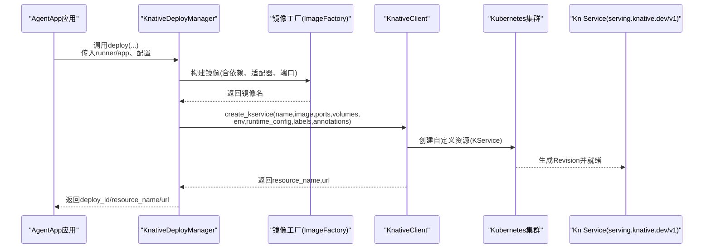
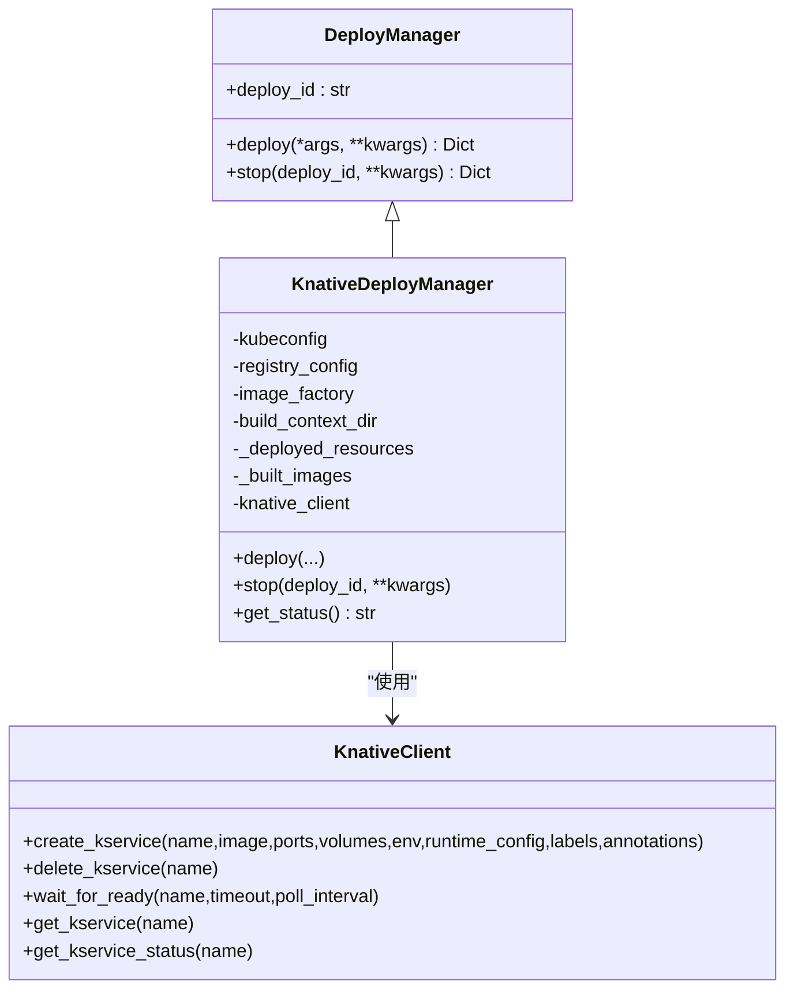
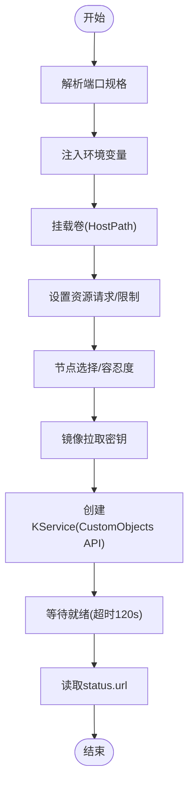
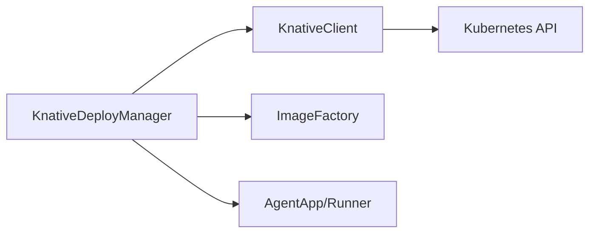
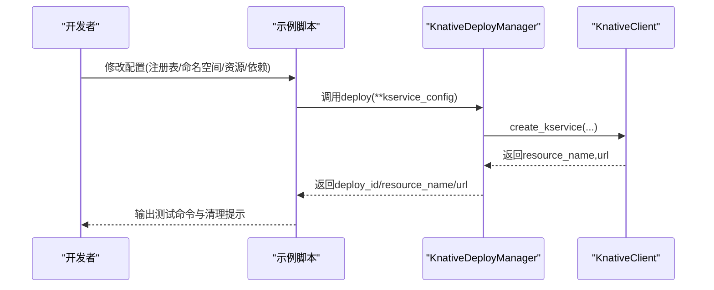

# Knative部署

<cite>
**本文引用的文件**
- [knative_deployer.py](file://src/agentscope_runtime/engine/deployers/knative_deployer.py)
- [knative_client.py](file://src/agentscope_runtime/common/container_clients/knative_client.py)
- [base.py](file://src/agentscope_runtime/engine/deployers/base.py)
- [app_deploy_to_knative.py](file://examples/deployments/knative_deploy/app_deploy_to_knative.py)
- [knative_deploy_config.yaml](file://examples/deployments/knative_deploy/knative_deploy_config.yaml)
- [knative_deploy_config.json](file://examples/deployments/knative_deploy/knative_deploy_config.json)
- [README.md（Knativ示例）](file://examples/deployments/knative_deploy/README.md)
- [test_knative_deployer.py](file://tests/deploy/test_knative_deployer.py)
</cite>

## 目录
1. [简介](#简介)
2. [项目结构](#项目结构)
3. [核心组件](#核心组件)
4. [架构总览](#架构总览)
5. [组件详解](#组件详解)
6. [依赖关系分析](#依赖关系分析)
7. [性能与成本优化](#性能与成本优化)
8. [故障排查指南](#故障排查指南)
9. [结论](#结论)
10. [附录：部署配置与流程](#附录部署配置与流程)

## 简介
本章节面向在Knative Serverless平台上部署AgentScope Runtime应用的用户，系统性阐述Knative集成原理、自动扩缩容机制、KnativeDeployer类实现细节（含Revision管理、Route配置与Configuration设置）、完整配置示例与部署流程，并结合事件驱动架构、流量管理与版本控制策略给出最佳实践。

## 项目结构
与Knative部署直接相关的代码与示例分布如下：
- 引擎层部署器：KnativeDeployManager负责编排镜像构建与KService创建
- 客户端封装：KnativeClient基于Kubernetes CustomObjects API操作Kn Service资源
- 基类接口：DeployManager定义统一的部署生命周期接口
- 示例与配置：提供可运行的部署脚本、YAML/JSON配置模板与使用说明
- 测试用例：覆盖部署器关键路径与错误处理

图示来源
- [knative_deployer.py:43-291](file://src/agentscope_runtime/engine/deployers/knative_deployer.py#L43-L291)
- [knative_client.py:16-468](file://src/agentscope_runtime/common/container_clients/knative_client.py#L16-L468)
- [base.py:9-44](file://src/agentscope_runtime/engine/deployers/base.py#L9-L44)
- [app_deploy_to_knative.py:123-328](file://examples/deployments/knative_deploy/app_deploy_to_knative.py#L123-L328)
- [knative_deploy_config.yaml:1-56](file://examples/deployments/knative_deploy/knative_deploy_config.yaml#L1-L56)
- [knative_deploy_config.json:1-42](file://examples/deployments/knative_deploy/knative_deploy_config.json#L1-L42)
- [README.md（Knativ示例）:1-314](file://examples/deployments/knative_deploy/README.md#L1-L314)
- [test_knative_deployer.py:55-440](file://tests/deploy/test_knative_deployer.py#L55-L440)

章节来源
- [knative_deployer.py:1-291](file://src/agentscope_runtime/engine/deployers/knative_deployer.py#L1-L291)
- [knative_client.py:1-468](file://src/agentscope_runtime/common/container_clients/knative_client.py#L1-L468)
- [base.py:1-44](file://src/agentscope_runtime/engine/deployers/base.py#L1-L44)
- [app_deploy_to_knative.py:1-328](file://examples/deployments/knative_deploy/app_deploy_to_knative.py#L1-L328)
- [knative_deploy_config.yaml:1-56](file://examples/deployments/knative_deploy/knative_deploy_config.yaml#L1-L56)
- [knative_deploy_config.json:1-42](file://examples/deployments/knative_deploy/knative_deploy_config.json#L1-L42)
- [README.md（Knativ示例）:1-314](file://examples/deployments/knative_deploy/README.md#L1-L314)
- [test_knative_deployer.py:1-440](file://tests/deploy/test_knative_deployer.py#L1-L440)

## 核心组件
- KnativeDeployManager（部署器）
  - 负责镜像构建、KService创建、状态查询与清理
  - 统一部署入口参数，支持环境变量、资源限制、卷挂载、标签与注解等
- KnativeClient（客户端）
  - 封装Kubernetes CustomObjects API，完成KService的创建、删除、就绪等待与状态查询
  - 支持端口解析、环境变量注入、卷挂载、资源请求/限制、节点选择与容忍度、镜像拉取密钥等
- DeployManager（基类）
  - 定义统一的异步部署与停止接口，生成唯一部署ID

章节来源
- [knative_deployer.py:43-291](file://src/agentscope_runtime/engine/deployers/knative_deployer.py#L43-L291)
- [knative_client.py:16-468](file://src/agentscope_runtime/common/container_clients/knative_client.py#L16-L468)
- [base.py:9-44](file://src/agentscope_runtime/engine/deployers/base.py#L9-L44)

## 架构总览
下图展示从应用到Knative服务的端到端部署流程，以及Knative Serving如何通过Revision与Route进行版本与流量管理。

图示来源
- [knative_deployer.py:71-222](file://src/agentscope_runtime/engine/deployers/knative_deployer.py#L71-L222)
- [knative_client.py:114-200](file://src/agentscope_runtime/common/container_clients/knative_client.py#L114-L200)

## 组件详解

### KnativeDeployManager（部署器）
- 关键职责
  - 镜像构建：委托ImageFactory完成runner/app打包、依赖安装、适配器注入、端口配置等
  - KService创建：调用KnativeClient创建Kn Service，支持端口、卷、环境变量、资源限制、标签与注解
  - 资源记录：保存部署ID、资源名称与配置快照，便于后续状态查询与清理
  - 生命周期管理：提供stop（删除KService）与get_status（查询KService状态）
- 入参要点
  - runner或app二选一；支持协议适配器、额外包、基础镜像、端口、环境变量、卷挂载、运行时配置、标签与注解
  - 支持推送镜像至私有仓库、指定平台架构、健康检查开关与超时
- 错误处理
  - 镜像构建失败、KService创建失败均抛出RuntimeError，并保留堆栈信息
  - stop返回结构化结果，包含成功标志、消息与详情

图示来源
- [base.py:9-44](file://src/agentscope_runtime/engine/deployers/base.py#L9-L44)
- [knative_deployer.py:43-291](file://src/agentscope_runtime/engine/deployers/knative_deployer.py#L43-L291)
- [knative_client.py:16-468](file://src/agentscope_runtime/common/container_clients/knative_client.py#L16-L468)

章节来源
- [knative_deployer.py:49-222](file://src/agentscope_runtime/engine/deployers/knative_deployer.py#L49-L222)

### KnativeClient（客户端）
- KService创建
  - 生成KService清单（metadata.labels/annotations、spec.template.spec），调用CustomObjects API创建
  - 等待就绪（默认超时120秒），随后读取status.url
- Pod规范生成
  - 解析端口规格（字符串/整数）、注入环境变量、挂载卷（HostPath）、设置资源请求/限制、安全上下文、重启策略、节点选择与容忍度、镜像拉取密钥
- 资源管理
  - 删除KService（404时返回False但不抛异常）
  - 获取KService对象与状态（conditions、url）

图示来源
- [knative_client.py:201-327](file://src/agentscope_runtime/common/container_clients/knative_client.py#L201-L327)
- [knative_client.py:114-200](file://src/agentscope_runtime/common/container_clients/knative_client.py#L114-L200)

章节来源
- [knative_client.py:114-468](file://src/agentscope_runtime/common/container_clients/knative_client.py#L114-L468)

### 配置模型与示例
- K8sConfig：命名空间与kubeconfig路径
- BuildConfig：构建上下文目录、Dockerfile模板、超时与清理策略
- 运行时配置runtime_config：resources.requests/limits、image_pull_policy、node_selector、tolerations、security_context、restart_policy、image_pull_secrets等
- 示例配置文件：YAML与JSON两种格式，涵盖镜像名/标签、基础镜像、依赖、环境变量、标签、运行时配置、部署超时与健康检查

章节来源
- [knative_deployer.py:20-41](file://src/agentscope_runtime/engine/deployers/knative_deployer.py#L20-L41)
- [knative_deploy_config.yaml:1-56](file://examples/deployments/knative_deploy/knative_deploy_config.yaml#L1-L56)
- [knative_deploy_config.json:1-42](file://examples/deployments/knative_deploy/knative_deploy_config.json#L1-L42)

### 自动扩缩容与无服务器特性
- 无服务器特性
  - Knative基于KService提供按请求触发的弹性伸缩，空闲时回收实例，请求到达时快速冷启动
  - 通过Revision实现版本化，每个新部署产生新Revision，配合Route进行流量分配
- 扩缩容机制
  - 请求级扩缩容：单请求可扩展到多副本，空闲时缩至0
  - 资源约束：通过runtime_config.resources.requests/limits控制最小保证与最大使用
  - 节点亲和与容忍：通过node_selector与tolerations调度到特定节点
- 版本与路由
  - Revision：每次部署产生的新版本，具备独立镜像与配置
  - Route：将域名/流量规则映射到一个或多个Revision，支持百分比分流与金丝雀发布

章节来源
- [knative_client.py:291-327](file://src/agentscope_runtime/common/container_clients/knative_client.py#L291-L327)
- [knative_deployer.py:174-183](file://src/agentscope_runtime/engine/deployers/knative_deployer.py#L174-L183)

### 事件驱动架构与流量管理
- 事件驱动
  - 以HTTP请求为事件源，Knative根据请求量动态调整后端实例数量
  - 支持同步/异步/流式响应，示例脚本提供多种endpoint类型
- 流量管理
  - Route与Revision配合，支持灰度发布与回滚
  - 通过labels/annotations进行精细化治理（如app=agent-ksvc）

章节来源
- [app_deploy_to_knative.py:86-118](file://examples/deployments/knative_deploy/app_deploy_to_knative.py#L86-L118)
- [knative_deploy_config.yaml:36-37](file://examples/deployments/knative_deploy/knative_deploy_config.yaml#L36-L37)

## 依赖关系分析
- 组件耦合
  - KnativeDeployManager依赖KnativeClient进行KService操作，耦合度低、职责清晰
  - 通过ImageFactory完成镜像构建，避免重复造轮子
- 外部依赖
  - Kubernetes Python SDK（CustomObjects API）
  - 可选：kubeconfig/inCluster配置切换
- 潜在风险
  - 集群权限不足会导致KService创建/删除失败
  - 镜像拉取失败或registry不可达会阻塞部署

图示来源
- [knative_deployer.py:66-69](file://src/agentscope_runtime/engine/deployers/knative_deployer.py#L66-L69)
- [knative_client.py:34-48](file://src/agentscope_runtime/common/container_clients/knative_client.py#L34-L48)

章节来源
- [knative_deployer.py:49-70](file://src/agentscope_runtime/engine/deployers/knative_deployer.py#L49-L70)
- [knative_client.py:24-58](file://src/agentscope_runtime/common/container_clients/knative_client.py#L24-L58)

## 性能与成本优化
- 资源规划
  - 合理设置resources.requests/limits，避免过度预留导致资源浪费
  - 使用IfNotPresent减少不必要的镜像拉取开销
- 平台与镜像
  - 指定平台架构（如linux/amd64）确保镜像与节点匹配
  - 推送镜像至就近registry，缩短拉取时间
- 成本优化
  - 利用Knative空闲缩容至0的能力，降低闲置期成本
  - 结合金丝雀与回滚策略，减少变更带来的资源占用与风险

章节来源
- [knative_deploy_config.yaml:40-56](file://examples/deployments/knative_deploy/knative_deploy_config.yaml#L40-L56)
- [knative_deploy_config.json:26-41](file://examples/deployments/knative_deploy/knative_deploy_config.json#L26-L41)

## 故障排查指南
- 常见问题
  - 镜像构建失败：检查requirements、extra_packages与基础镜像
  - KService创建失败：确认集群权限、命名空间存在、Knative Serving可用
  - 无法就绪：查看KService conditions与Pod日志
  - 健康检查失败：核对runtime_config与端口配置
- 定位手段
  - 使用get_status与get_kservice_status获取状态
  - kubectl describe ksvc/get pods/logs辅助诊断
- 清理与回滚
  - stop用于删除KService
  - 通过Route将流量切回旧Revision实现快速回滚

章节来源
- [test_knative_deployer.py:149-206](file://tests/deploy/test_knative_deployer.py#L149-L206)
- [knative_client.py:360-468](file://src/agentscope_runtime/common/container_clients/knative_client.py#L360-L468)
- [README.md（Knativ示例）:227-257](file://examples/deployments/knative_deploy/README.md#L227-L257)

## 结论
KnativeDeployManager将AgentScope Runtime的部署抽象为“镜像构建+KService创建”的统一流程，借助Knative的Revision与Route实现版本化与流量治理，结合资源限制与自动扩缩容，满足企业级Serverless场景下的弹性、可观测与成本优化需求。配合示例脚本与配置模板，用户可快速落地生产级部署。

## 附录：部署配置与流程

### 配置项速览
- 注册表配置：registry_url、namespace
- Kubernetes配置：k8s_namespace、kubeconfig_path
- 运行时配置：resources.requests/limits、image_pull_policy、node_selector、tolerations、security_context、restart_policy、image_pull_secrets
- KService配置：port、image_name、image_tag、base_image、requirements、extra_packages、environment、labels、annotations、deploy_timeout、health_check、platform、push_to_registry

章节来源
- [knative_deploy_config.yaml:1-56](file://examples/deployments/knative_deploy/knative_deploy_config.yaml#L1-L56)
- [knative_deploy_config.json:1-42](file://examples/deployments/knative_deploy/knative_deploy_config.json#L1-L42)

### 部署流程
- 准备阶段
  - 设置DASHSCOPE_API_KEY等环境变量
  - 确认kubectl连接集群且已安装Knative Serving
- 编写配置
  - 在YAML/JSON中填写registry、k8s、runtime_config与KService参数
- 执行部署
  - 运行示例脚本，内部调用KnativeDeployManager.deploy
  - 部署完成后输出deploy_id、resource_name与url
- 验证与清理
  - 使用curl命令验证各endpoint
  - 通过deployer.stop清理资源

图示来源
- [app_deploy_to_knative.py:123-224](file://examples/deployments/knative_deploy/app_deploy_to_knative.py#L123-L224)
- [knative_deployer.py:71-222](file://src/agentscope_runtime/engine/deployers/knative_deployer.py#L71-L222)
- [knative_client.py:114-200](file://src/agentscope_runtime/common/container_clients/knative_client.py#L114-L200)

章节来源
- [README.md（Knativ示例）:170-225](file://examples/deployments/knative_deploy/README.md#L170-L225)
- [app_deploy_to_knative.py:226-328](file://examples/deployments/knative_deploy/app_deploy_to_knative.py#L226-L328)