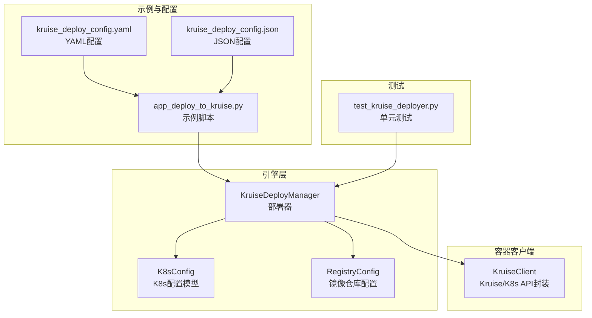
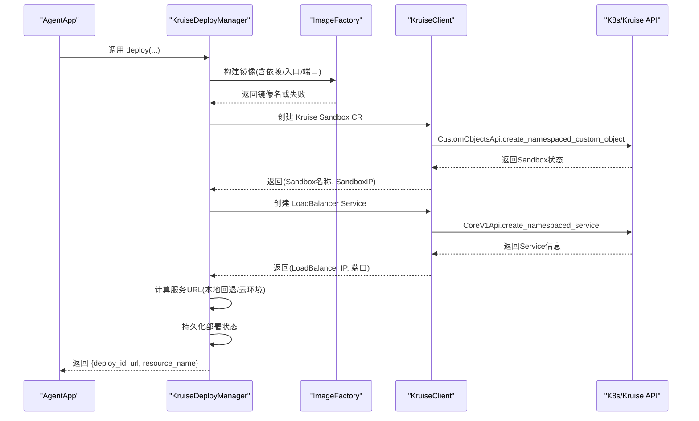
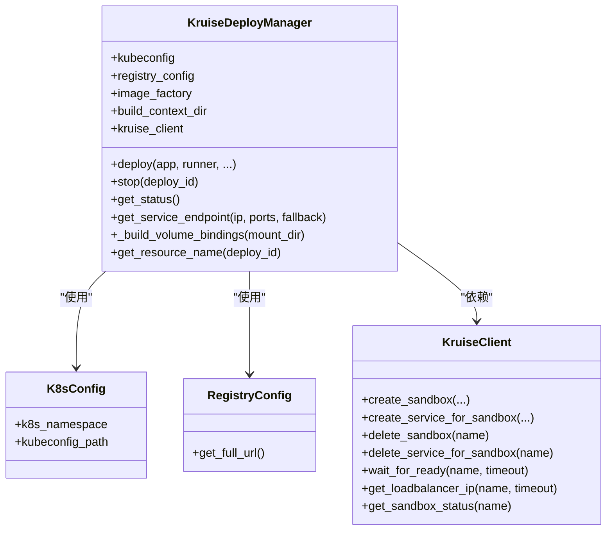
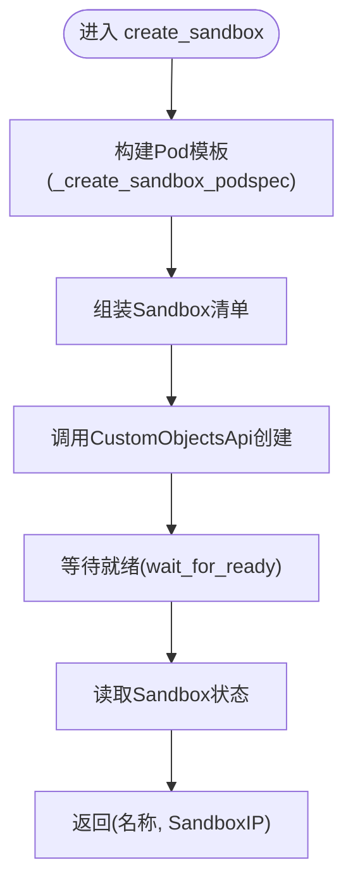
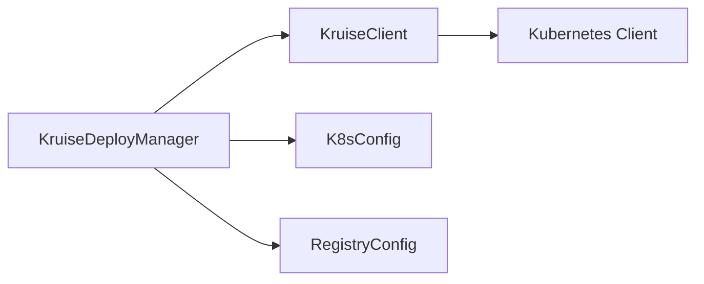

# Kruise部署

<cite>
**本文引用的文件**
- [kruise_deployer.py](file://src/agentscope_runtime/engine/deployers/kruise_deployer.py)
- [kruise_client.py](file://src/agentscope_runtime/common/container_clients/kruise_client.py)
- [app_deploy_to_kruise.py](file://examples/deployments/kruise_deploy/app_deploy_to_kruise.py)
- [kruise_deploy_config.yaml](file://examples/deployments/kruise_deploy/kruise_deploy_config.yaml)
- [kruise_deploy_config.json](file://examples/deployments/kruise_deploy/kruise_deploy_config.json)
- [README.md](file://examples/deployments/kruise_deploy/README.md)
- [test_kruise_deployer.py](file://tests/deploy/test_kruise_deployer.py)
- [advanced_deployment.md](file://cookbook/en/advanced_deployment.md)
</cite>

## 目录
1. [简介](#简介)
2. [项目结构](#项目结构)
3. [核心组件](#核心组件)
4. [架构总览](#架构总览)
5. [详细组件分析](#详细组件分析)
6. [依赖关系分析](#依赖关系分析)
7. [性能与可靠性](#性能与可靠性)
8. [故障排查指南](#故障排查指南)
9. [结论](#结论)
10. [附录](#附录)

## 简介
本章节面向需要在Kubernetes上以Kruise Sandbox方式部署AgentScope Runtime的用户，系统性介绍Kruise部署能力与实现细节。重点覆盖以下方面：
- Kruise平台的高级编排能力与部署机制
- KruiseDeployer类的职责与实现要点（镜像构建、Sidecar注入、灰度发布与滚动更新策略）
- 完整的Kruise配置示例与部署流程
- 渐进式发布与流量治理能力（蓝绿、金丝雀、回滚策略）
- 企业级部署最佳实践与常见问题排查

## 项目结构
Kruise部署相关代码主要分布在以下位置：
- 引擎层部署器：负责应用打包、镜像构建、资源编排与状态管理
- 容器客户端：封装Kubernetes与Kruise API交互
- 示例与配置：提供可运行的部署脚本与配置样例
- 测试用例：验证部署器行为与边界条件

图表来源
- [kruise_deployer.py:37-81](file://src/agentscope_runtime/engine/deployers/kruise_deployer.py#L37-L81)
- [kruise_client.py:22-82](file://src/agentscope_runtime/common/container_clients/kruise_client.py#L22-L82)
- [app_deploy_to_kruise.py:119-221](file://examples/deployments/kruise_deploy/app_deploy_to_kruise.py#L119-L221)
- [kruise_deploy_config.yaml:1-59](file://examples/deployments/kruise_deploy/kruise_deploy_config.yaml#L1-L59)
- [kruise_deploy_config.json:1-40](file://examples/deployments/kruise_deploy/kruise_deploy_config.json#L1-L40)
- [test_kruise_deployer.py:52-151](file://tests/deploy/test_kruise_deployer.py#L52-L151)

章节来源
- [kruise_deployer.py:37-81](file://src/agentscope_runtime/engine/deployers/kruise_deployer.py#L37-L81)
- [kruise_client.py:22-82](file://src/agentscope_runtime/common/container_clients/kruise_client.py#L22-L82)
- [app_deploy_to_kruise.py:119-221](file://examples/deployments/kruise_deploy/app_deploy_to_kruise.py#L119-L221)
- [kruise_deploy_config.yaml:1-59](file://examples/deployments/kruise_deploy/kruise_deploy_config.yaml#L1-L59)
- [kruise_deploy_config.json:1-40](file://examples/deployments/kruise_deploy/kruise_deploy_config.json#L1-L40)
- [README.md:1-257](file://examples/deployments/kruise_deploy/README.md#L1-L257)

## 核心组件
- KruiseDeployManager：部署器主类，负责镜像构建、Kruise Sandbox CR创建、Service暴露、URL生成与状态持久化。
- K8sConfig：Kubernetes连接与命名空间配置模型。
- KruiseClient：Kubernetes与Kruise API封装，负责Sandbox CR、Service等资源的创建、查询、删除与就绪等待。
- 示例脚本与配置：演示如何通过AgentApp进行部署，并提供YAML/JSON配置样例。

章节来源
- [kruise_deployer.py:37-81](file://src/agentscope_runtime/engine/deployers/kruise_deployer.py#L37-L81)
- [kruise_client.py:22-82](file://src/agentscope_runtime/common/container_clients/kruise_client.py#L22-L82)
- [app_deploy_to_kruise.py:119-221](file://examples/deployments/kruise_deploy/app_deploy_to_kruise.py#L119-L221)

## 架构总览
下图展示从应用到Kubernetes集群的整体调用链路与关键步骤。

图表来源
- [kruise_deployer.py:138-347](file://src/agentscope_runtime/engine/deployers/kruise_deployer.py#L138-L347)
- [kruise_client.py:84-174](file://src/agentscope_runtime/common/container_clients/kruise_client.py#L84-L174)
- [kruise_client.py:436-514](file://src/agentscope_runtime/common/container_clients/kruise_client.py#L436-L514)

章节来源
- [kruise_deployer.py:138-347](file://src/agentscope_runtime/engine/deployers/kruise_deployer.py#L138-L347)
- [kruise_client.py:84-174](file://src/agentscope_runtime/common/container_clients/kruise_client.py#L84-L174)
- [kruise_client.py:436-514](file://src/agentscope_runtime/common/container_clients/kruise_client.py#L436-L514)

## 详细组件分析

### KruiseDeployManager 类
- 职责
  - 镜像构建：基于ImageFactory与Docker上下文，打包应用与依赖，支持push到镜像仓库。
  - 资源编排：创建Kruise Sandbox自定义资源与LoadBalancer Service，自动选择访问端点。
  - 状态管理：保存部署状态，支持查询与停止。
  - 环境适配：根据是否本地K8s环境选择回退地址与端口。
- 关键方法
  - deploy：主流程，包含镜像构建、Sandbox创建、Service创建、URL计算与状态保存。
  - stop：删除Service与Sandbox CR，更新状态。
  - get_status：读取状态管理器中的配置并查询Sandbox状态。
  - get_service_endpoint：根据环境选择外部访问URL。
  - _build_volume_bindings：将挂载目录转换为卷绑定参数。
  - get_resource_name：生成资源名前缀。

图表来源
- [kruise_deployer.py:37-81](file://src/agentscope_runtime/engine/deployers/kruise_deployer.py#L37-L81)
- [kruise_deployer.py:138-347](file://src/agentscope_runtime/engine/deployers/kruise_deployer.py#L138-L347)
- [kruise_client.py:22-82](file://src/agentscope_runtime/common/container_clients/kruise_client.py#L22-L82)

章节来源
- [kruise_deployer.py:37-81](file://src/agentscope_runtime/engine/deployers/kruise_deployer.py#L37-L81)
- [kruise_deployer.py:138-347](file://src/agentscope_runtime/engine/deployers/kruise_deployer.py#L138-L347)

### KruiseClient 类
- 职责
  - 初始化K8s客户端（支持in-cluster与kubeconfig）。
  - 封装Sandbox CR创建、查询、删除与就绪等待。
  - 封装Service创建、删除与LoadBalancer IP获取。
  - 解析端口规范、构建Pod模板与容器配置。
- 关键方法
  - create_sandbox：构建Sandbox清单并创建，等待就绪后返回Sandbox IP。
  - create_service_for_sandbox：创建LoadBalancer Service并返回名称。
  - delete_sandbox/delete_service_for_sandbox：删除资源。
  - wait_for_ready/get_loadbalancer_ip/get_sandbox_status：辅助查询与等待。
  - _create_sandbox_podspec：构建容器与卷挂载、资源限制、镜像拉取策略等。
  - _parse_port_spec：解析端口字符串或整数。

图表来源
- [kruise_client.py:84-174](file://src/agentscope_runtime/common/container_clients/kruise_client.py#L84-L174)
- [kruise_client.py:175-324](file://src/agentscope_runtime/common/container_clients/kruise_client.py#L175-L324)
- [kruise_client.py:399-434](file://src/agentscope_runtime/common/container_clients/kruise_client.py#L399-L434)

章节来源
- [kruise_client.py:84-174](file://src/agentscope_runtime/common/container_clients/kruise_client.py#L84-L174)
- [kruise_client.py:175-324](file://src/agentscope_runtime/common/container_clients/kruise_client.py#L175-L324)
- [kruise_client.py:399-434](file://src/agentscope_runtime/common/container_clients/kruise_client.py#L399-L434)

### Sidecar注入、灰度发布与滚动更新策略
- Sidecar注入
  - 当前实现未直接在KruiseDeployManager中显式注入Sidecar容器；Sandbox CR的Pod模板由KruiseClient按runtime_config与环境变量构建。若需Sidecar，可在runtime_config中通过容器数组扩展或在Sandbox模板中自定义。
- 灰度发布与滚动更新
  - KruiseDeployManager当前采用一次性创建Sandbox与Service的方式，不包含多版本并行与流量切分逻辑。若需灰度/金丝雀/蓝绿，建议结合Kruise的AdvancedCronJob、弹性伸缩与InPlaceUpdate等能力，在更高层通过多实例/多标签/多Service策略实现。
- 渐进式发布与流量治理
  - 可通过Service的selector与多版本标签配合，逐步提升新版本权重，实现渐进式流量切换；或结合Ingress/网关的路由规则进行精细化流量控制。

章节来源
- [kruise_deployer.py:255-309](file://src/agentscope_runtime/engine/deployers/kruise_deployer.py#L255-L309)
- [kruise_client.py:175-324](file://src/agentscope_runtime/common/container_clients/kruise_client.py#L175-L324)

### 配置与部署流程
- 配置项概览
  - 基础设置：name、namespace、port
  - 镜像设置：image_name、image_tag、base_image、platform、push_to_registry
  - 依赖与环境：requirements、extra_packages、environment、labels、annotations
  - 运行时配置：runtime_config.resources、image_pull_policy、可选node_selector/tolerations
  - 部署参数：deploy_timeout、health_check
- 部署流程
  - 准备Registry与K8s连接
  - 配置runtime_config与端口
  - 调用AgentApp.deploy传入KruiseDeployManager
  - 自动完成镜像构建、Sandbox创建、Service创建与URL生成
  - 可选：通过CLI或deployer.stop进行清理

章节来源
- [kruise_deploy_config.yaml:1-59](file://examples/deployments/kruise_deploy/kruise_deploy_config.yaml#L1-L59)
- [kruise_deploy_config.json:1-40](file://examples/deployments/kruise_deploy/kruise_deploy_config.json#L1-L40)
- [app_deploy_to_kruise.py:119-221](file://examples/deployments/kruise_deploy/app_deploy_to_kruise.py#L119-L221)
- [README.md:49-154](file://examples/deployments/kruise_deploy/README.md#L49-L154)

### 示例与最佳实践
- 示例脚本
  - 展示如何配置Registry、K8s、runtime_config与端口
  - 通过AgentApp.deploy触发部署，输出URL与资源名
  - 提供curl命令用于健康检查与端点测试
- 最佳实践
  - 使用独立namespace隔离资源
  - 合理设置资源requests/limits，避免节点压力
  - 在生产环境启用push_to_registry并配置镜像拉取策略
  - 结合Service与Ingress实现多版本流量治理
  - 使用状态管理与日志监控保障可观测性

章节来源
- [app_deploy_to_kruise.py:119-221](file://examples/deployments/kruise_deploy/app_deploy_to_kruise.py#L119-L221)
- [README.md:155-213](file://examples/deployments/kruise_deploy/README.md#L155-L213)

## 依赖关系分析
- 组件耦合
  - KruiseDeployManager依赖K8sConfig、RegistryConfig与KruiseClient，形成清晰的职责分离。
  - KruiseClient封装K8s/Kruise API，降低上层复杂度。
- 外部依赖
  - Kubernetes SDK（kubernetes-client/python）
  - Docker镜像构建工具（通过ImageFactory）
- 潜在循环依赖
  - 未发现循环依赖迹象，模块间通过接口与配置传递数据。

图表来源
- [kruise_deployer.py:37-81](file://src/agentscope_runtime/engine/deployers/kruise_deployer.py#L37-L81)
- [kruise_client.py:22-82](file://src/agentscope_runtime/common/container_clients/kruise_client.py#L22-L82)

章节来源
- [kruise_deployer.py:37-81](file://src/agentscope_runtime/engine/deployers/kruise_deployer.py#L37-L81)
- [kruise_client.py:22-82](file://src/agentscope_runtime/common/container_clients/kruise_client.py#L22-L82)

## 性能与可靠性
- 镜像构建
  - 支持缓存与平台指定，减少重复构建时间。
- 资源与网络
  - 通过runtime_config配置CPU/Memory与重启策略，提高稳定性。
  - LoadBalancer Service提供外部访问，本地环境回退至127.0.0.1。
- 可靠性
  - Sandbox就绪等待与错误处理，失败时抛出明确异常。
  - 状态持久化便于恢复与运维。

章节来源
- [kruise_deployer.py:209-242](file://src/agentscope_runtime/engine/deployers/kruise_deployer.py#L209-L242)
- [kruise_client.py:399-434](file://src/agentscope_runtime/common/container_clients/kruise_client.py#L399-L434)

## 故障排查指南
- 常见问题
  - Sandbox CRD缺失：确认安装Kruise Sandbox CRD并具备相应权限。
  - 注册表认证：确保docker login与镜像仓库访问正常。
  - 权限不足：检查RBAC与集群角色，确保可创建Sandbox与Service。
  - 资源配额：查看节点与资源配额，避免调度失败。
  - 镜像拉取：检查镜像名称、tag与拉取策略。
- 排查步骤
  - 查看Sandbox状态与事件
  - 检查Service与Endpoints
  - 查看Pod日志与描述
  - 使用示例脚本提供的kubectl命令进行验证

章节来源
- [README.md:215-251](file://examples/deployments/kruise_deploy/README.md#L215-L251)
- [test_kruise_deployer.py:52-151](file://tests/deploy/test_kruise_deployer.py#L52-L151)

## 结论
Kruise部署为AgentScope Runtime提供了基于Kruise Sandbox的实例级隔离与弹性能力。当前实现聚焦于镜像构建、Sandbox与Service的自动化创建以及环境适配的URL生成。对于更高级的渐进式发布与流量治理，建议结合Kruise的多版本能力与外部Ingress/网关策略，实现蓝绿、金丝雀与回滚的完整闭环。

## 附录
- 术语
  - Sandbox：Kruise提供的轻量级容器运行时抽象，提供实例级隔离与暂停/恢复能力。
  - LoadBalancer Service：Kubernetes Service类型，对外暴露负载均衡IP/域名。
- 参考资料
  - Kruise Sandbox CRD：https://github.com/openkruise/agents
  - Kubernetes API：https://kubernetes.io/docs/reference/