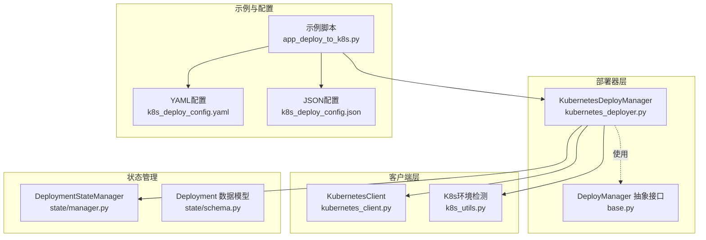
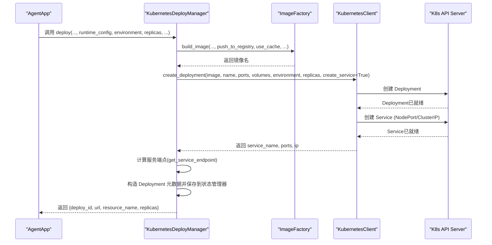
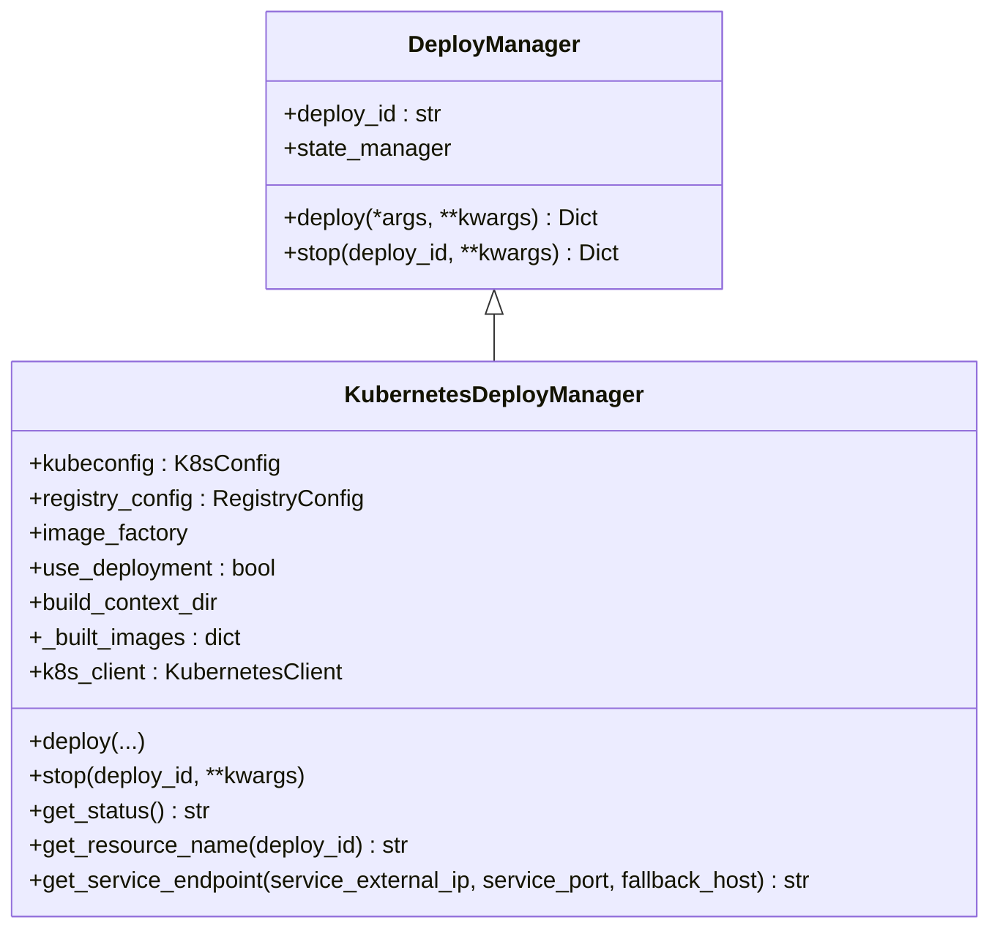
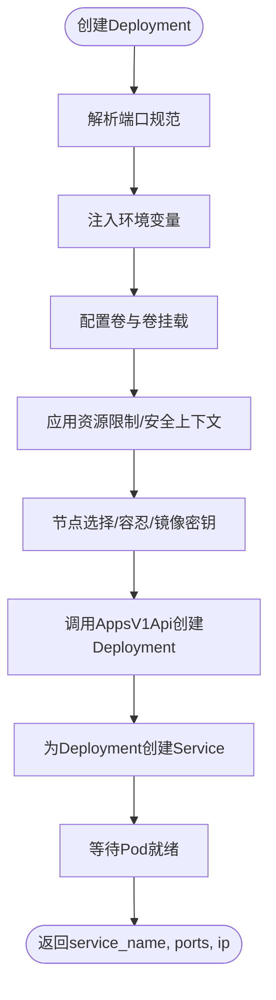
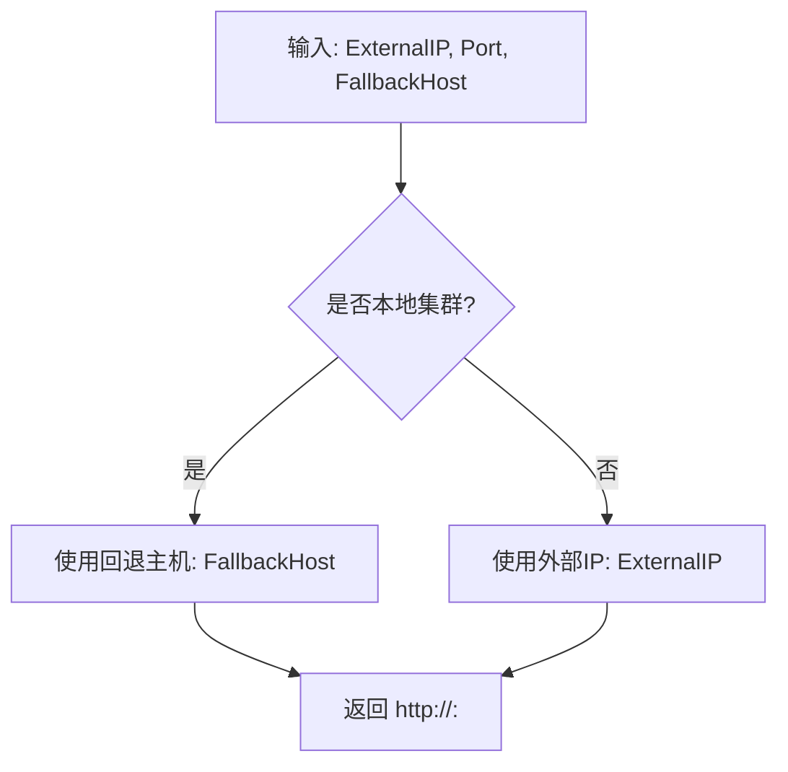
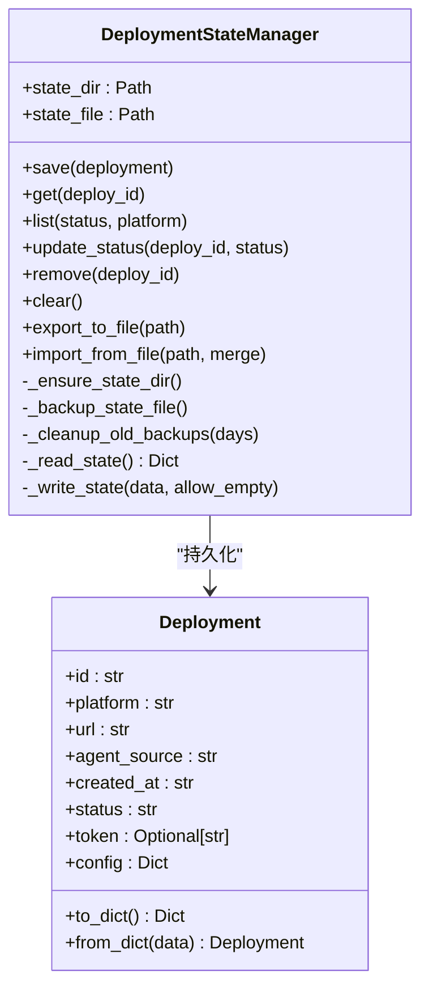
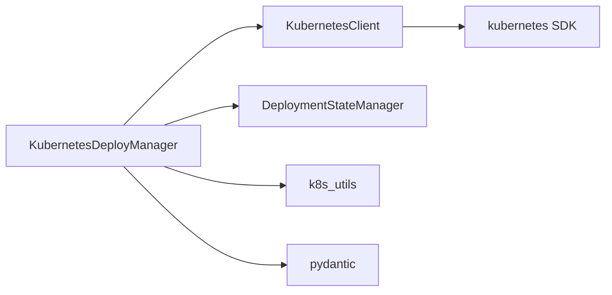

# Kubernetes部署

<cite>
**本文引用的文件**
- [kubernetes_deployer.py](file://src/agentscope_runtime/engine/deployers/kubernetes_deployer.py)
- [app_deploy_to_k8s.py](file://examples/deployments/k8s_deploy/app_deploy_to_k8s.py)
- [k8s_deploy_config.json](file://examples/deployments/k8s_deploy/k8s_deploy_config.json)
- [k8s_deploy_config.yaml](file://examples/deployments/k8s_deploy/k8s_deploy_config.yaml)
- [kubernetes_client.py](file://src/agentscope_runtime/common/container_clients/kubernetes_client.py)
- [k8s_utils.py](file://src/agentscope_runtime/engine/deployers/utils/k8s_utils.py)
- [base.py](file://src/agentscope_runtime/engine/deployers/base.py)
- [manager.py](file://src/agentscope_runtime/engine/deployers/state/manager.py)
- [schema.py](file://src/agentscope_runtime/engine/deployers/state/schema.py)
- [README.md](file://README.md)
</cite>

## 目录
1. [简介](#简介)
2. [项目结构](#项目结构)
3. [核心组件](#核心组件)
4. [架构总览](#架构总览)
5. [详细组件分析](#详细组件分析)
6. [依赖关系分析](#依赖关系分析)
7. [性能考量](#性能考量)
8. [故障排查指南](#故障排查指南)
9. [结论](#结论)
10. [附录](#附录)

## 简介
本文件面向AgentScope Runtime在Kubernetes上的部署与运维，系统化阐述Kubernetes部署架构、Pod与Deployment管理、Service与Ingress配置、以及KubernetesDeployer类的实现原理（含资源清单生成、命名空间管理、镜像与密钥策略等）。文档同时提供完整的配置示例、部署流程、扩展性与高可用设计建议、权限与安全策略、以及故障恢复与运维最佳实践。

## 项目结构
围绕Kubernetes部署的相关模块分布如下：
- 部署器层：KubernetesDeployManager负责编排部署流程，封装镜像构建、资源创建、服务暴露与状态管理。
- 客户端层：KubernetesClient封装对K8s API的调用，负责Deployment/Service/Pod生命周期管理。
- 工具与检测：k8s_utils提供本地/远端集群环境识别逻辑，辅助服务端点选择。
- 状态管理：state模块提供本地持久化的部署状态记录与查询能力。
- 示例与配置：examples目录提供可运行的部署示例与JSON/YAML配置模板。

图表来源
- [kubernetes_deployer.py:48-391](file://src/agentscope_runtime/engine/deployers/kubernetes_deployer.py#L48-L391)
- [base.py:9-44](file://src/agentscope_runtime/engine/deployers/base.py#L9-L44)
- [kubernetes_client.py:19-1144](file://src/agentscope_runtime/common/container_clients/kubernetes_client.py#L19-L1144)
- [k8s_utils.py:12-242](file://src/agentscope_runtime/engine/deployers/utils/k8s_utils.py#L12-L242)
- [manager.py:17-389](file://src/agentscope_runtime/engine/deployers/state/manager.py#L17-L389)
- [schema.py:9-97](file://src/agentscope_runtime/engine/deployers/state/schema.py#L9-L97)
- [app_deploy_to_k8s.py:124-374](file://examples/deployments/k8s_deploy/app_deploy_to_k8s.py#L124-L374)
- [k8s_deploy_config.yaml:1-53](file://examples/deployments/k8s_deploy/k8s_deploy_config.yaml#L1-L53)
- [k8s_deploy_config.json:1-40](file://examples/deployments/k8s_deploy/k8s_deploy_config.json#L1-L40)

章节来源
- [kubernetes_deployer.py:48-391](file://src/agentscope_runtime/engine/deployers/kubernetes_deployer.py#L48-L391)
- [kubernetes_client.py:19-1144](file://src/agentscope_runtime/common/container_clients/kubernetes_client.py#L19-L1144)
- [k8s_utils.py:12-242](file://src/agentscope_runtime/engine/deployers/utils/k8s_utils.py#L12-L242)
- [manager.py:17-389](file://src/agentscope_runtime/engine/deployers/state/manager.py#L17-L389)
- [schema.py:9-97](file://src/agentscope_runtime/engine/deployers/state/schema.py#L9-L97)
- [app_deploy_to_k8s.py:124-374](file://examples/deployments/k8s_deploy/app_deploy_to_k8s.py#L124-L374)
- [k8s_deploy_config.yaml:1-53](file://examples/deployments/k8s_deploy/k8s_deploy_config.yaml#L1-L53)
- [k8s_deploy_config.json:1-40](file://examples/deployments/k8s_deploy/k8s_deploy_config.json#L1-L40)

## 核心组件
- KubernetesDeployManager
  - 负责接收AgentApp与Runner，通过ImageFactory构建镜像并调用KubernetesClient创建Deployment与Service；根据环境自动选择服务端点；维护部署状态。
- KubernetesClient
  - 封装K8s API调用，支持Deployment/Service/Pod的创建、删除、状态查询与日志获取；支持多端口Service、资源限制、镜像拉取策略与节点亲和/容忍等高级配置。
- K8s环境检测
  - isLocalK8sEnvironment用于判断当前连接是本地集群还是云/远端集群，从而决定服务访问端点策略。
- DeploymentStateManager
  - 提供本地状态文件的读写、备份、迁移与校验，确保部署元数据持久化与可恢复。

章节来源
- [kubernetes_deployer.py:48-391](file://src/agentscope_runtime/engine/deployers/kubernetes_deployer.py#L48-L391)
- [kubernetes_client.py:19-1144](file://src/agentscope_runtime/common/container_clients/kubernetes_client.py#L19-L1144)
- [k8s_utils.py:12-242](file://src/agentscope_runtime/engine/deployers/utils/k8s_utils.py#L12-L242)
- [manager.py:17-389](file://src/agentscope_runtime/engine/deployers/state/manager.py#L17-L389)
- [schema.py:9-97](file://src/agentscope_runtime/engine/deployers/state/schema.py#L9-L97)

## 架构总览
下图展示从应用到Kubernetes的部署全链路：应用通过KubernetesDeployManager触发镜像构建与资源创建，KubernetesClient调用K8s API完成Deployment与Service创建，并由状态管理器持久化部署信息。

图表来源
- [kubernetes_deployer.py:126-302](file://src/agentscope_runtime/engine/deployers/kubernetes_deployer.py#L126-L302)
- [kubernetes_client.py:669-800](file://src/agentscope_runtime/common/container_clients/kubernetes_client.py#L669-L800)

章节来源
- [kubernetes_deployer.py:126-302](file://src/agentscope_runtime/engine/deployers/kubernetes_deployer.py#L126-L302)
- [kubernetes_client.py:669-800](file://src/agentscope_runtime/common/container_clients/kubernetes_client.py#L669-L800)

## 详细组件分析

### KubernetesDeployManager 类
- 关键职责
  - 接收部署参数（镜像、端口、副本数、环境变量、运行时配置等），构建镜像后创建Deployment与Service。
  - 自动推断服务端点，兼容本地与远端集群差异。
  - 维护部署状态，便于后续查询与停止。
- 资源命名
  - 使用“agent-{deploy_id前8位)”作为资源名称前缀，便于识别与清理。
- 副本与扩缩容
  - 支持通过replicas参数控制副本数；当use_deployment为True时启用Deployment以支持水平扩展。
- 环境与配置
  - environment传入容器环境变量；runtime_config传入资源限制、镜像拉取策略、节点选择等。
- 状态持久化
  - 将部署元数据写入本地状态文件，包含平台、URL、状态、创建时间、镜像、副本数、端口、环境变量、运行时配置等。

图表来源
- [base.py:9-44](file://src/agentscope_runtime/engine/deployers/base.py#L9-L44)
- [kubernetes_deployer.py:48-391](file://src/agentscope_runtime/engine/deployers/kubernetes_deployer.py#L48-L391)

章节来源
- [kubernetes_deployer.py:48-391](file://src/agentscope_runtime/engine/deployers/kubernetes_deployer.py#L48-L391)
- [base.py:9-44](file://src/agentscope_runtime/engine/deployers/base.py#L9-L44)

### KubernetesClient 类
- Deployment/Service/Pod管理
  - create_deployment：基于容器规范生成Deployment，支持端口、卷挂载、环境变量、资源限制、安全上下文、节点选择与容忍、镜像拉取密钥等。
  - create：创建单个Pod（示例脚本中未直接使用）。
- 端点与服务
  - _create_deployment_spec：复用Pod模板逻辑，生成Deployment的Pod模板，支持多端口Service。
  - _create_multi_port_service/_get_service_node_ports：为多端口场景创建Service并返回NodePort与节点IP。
- 环境检测
  - _is_local_cluster：结合上下文与API查询结果判断是否为本地集群，辅助端点选择。
- 日志与状态
  - get_logs/wait_for_pod_ready/get_status/list_pods：提供日志获取、等待就绪、状态查询与Pod列表查询能力。

图表来源
- [kubernetes_client.py:669-800](file://src/agentscope_runtime/common/container_clients/kubernetes_client.py#L669-L800)
- [kubernetes_client.py:554-626](file://src/agentscope_runtime/common/container_clients/kubernetes_client.py#L554-L626)

章节来源
- [kubernetes_client.py:669-800](file://src/agentscope_runtime/common/container_clients/kubernetes_client.py#L669-L800)
- [kubernetes_client.py:554-626](file://src/agentscope_runtime/common/container_clients/kubernetes_client.py#L554-L626)

### K8s环境检测与服务端点选择
- isLocalK8sEnvironment
  - 通过kubeconfig上下文、集群服务器地址、API查询、节点标签与命名空间特征等多维投票机制判断本地/远端环境。
- get_service_endpoint
  - 在本地环境使用回退主机（如127.0.0.1），在远端环境使用Service外部IP或负载均衡器IP，避免本地访问问题。

图表来源
- [kubernetes_deployer.py:72-121](file://src/agentscope_runtime/engine/deployers/kubernetes_deployer.py#L72-L121)
- [k8s_utils.py:12-59](file://src/agentscope_runtime/engine/deployers/utils/k8s_utils.py#L12-L59)

章节来源
- [kubernetes_deployer.py:72-121](file://src/agentscope_runtime/engine/deployers/kubernetes_deployer.py#L72-L121)
- [k8s_utils.py:12-59](file://src/agentscope_runtime/engine/deployers/utils/k8s_utils.py#L12-L59)

### 部署状态管理
- DeploymentStateManager
  - 提供save/get/list/update_status/remove/clear等操作，采用原子写入与每日备份策略，防止数据丢失。
  - 支持导入/导出状态文件，便于迁移与审计。
- Deployment 数据模型
  - 包含部署ID、平台、URL、代理来源、创建时间、状态、令牌与配置等字段。

图表来源
- [manager.py:17-389](file://src/agentscope_runtime/engine/deployers/state/manager.py#L17-L389)
- [schema.py:9-97](file://src/agentscope_runtime/engine/deployers/state/schema.py#L9-L97)

章节来源
- [manager.py:17-389](file://src/agentscope_runtime/engine/deployers/state/manager.py#L17-L389)
- [schema.py:9-97](file://src/agentscope_runtime/engine/deployers/state/schema.py#L9-L97)

## 依赖关系分析
- 组件耦合
  - KubernetesDeployManager依赖KubernetesClient进行资源操作，依赖状态管理器持久化元数据，依赖环境检测工具选择端点。
  - KubernetesClient依赖Kubernetes Python SDK，封装对CoreV1/AppsV1 API的调用。
- 外部依赖
  - kubernetes库：用于加载kubeconfig/in-cluster配置并调用K8s API。
  - pydantic：用于K8sConfig与RegistryConfig等配置模型定义。
- 潜在循环依赖
  - 当前模块间为单向依赖，未发现循环依赖风险。

图表来源
- [kubernetes_deployer.py:1-21](file://src/agentscope_runtime/engine/deployers/kubernetes_deployer.py#L1-L21)
- [kubernetes_client.py:10-14](file://src/agentscope_runtime/common/container_clients/kubernetes_client.py#L10-L14)

章节来源
- [kubernetes_deployer.py:1-21](file://src/agentscope_runtime/engine/deployers/kubernetes_deployer.py#L1-L21)
- [kubernetes_client.py:10-14](file://src/agentscope_runtime/common/container_clients/kubernetes_client.py#L10-L14)

## 性能考量
- 镜像构建与缓存
  - 通过use_cache与build_context_dir优化构建缓存，减少重复构建时间。
  - push_to_registry可将镜像推送至私有仓库，提升拉取效率与安全性。
- 资源配额与调度
  - runtime_config中的resources.requests/limits可限制CPU与内存，避免资源争用。
  - node_selector/tolerations可将Pod调度到特定节点，提高稳定性。
- 扩展性与弹性
  - 通过replicas与Deployment实现水平扩展；结合HPA（需在集群侧配置）可实现自动扩缩容。
- 网络与延迟
  - 本地集群使用回退主机访问，远端集群使用外部IP；合理配置Service类型（ClusterIP/NodePort/LoadBalancer）与Ingress可降低延迟。

## 故障排查指南
- 初始化失败
  - 检查kubeconfig路径与权限，确认集群连通性；若在集群内运行，确保RBAC配置正确。
- Pod无法就绪
  - 使用wait_for_pod_ready与get_logs查看日志；检查镜像拉取策略、资源限制与节点亲和。
- 服务端点不可达
  - 使用isLocalK8sEnvironment判断环境类型；本地环境使用回退主机，远端环境使用外部IP。
- 状态文件异常
  - DeploymentStateManager具备备份与修复能力；可通过export/import迁移状态文件。

章节来源
- [kubernetes_client.py:29-53](file://src/agentscope_runtime/common/container_clients/kubernetes_client.py#L29-L53)
- [kubernetes_client.py:527-552](file://src/agentscope_runtime/common/container_clients/kubernetes_client.py#L527-L552)
- [kubernetes_deployer.py:72-121](file://src/agentscope_runtime/engine/deployers/kubernetes_deployer.py#L72-L121)
- [manager.py:39-87](file://src/agentscope_runtime/engine/deployers/state/manager.py#L39-L87)

## 结论
AgentScope Runtime的Kubernetes部署通过KubernetesDeployManager统一编排镜像构建与资源创建，借助KubernetesClient实现对Deployment/Service/Pod的精细控制，并通过状态管理器保障部署元数据的可靠持久化。配合本地/远端环境检测与完善的错误处理机制，可在不同集群环境下稳定运行。结合合理的资源配额、调度策略与Ingress配置，可满足生产级的扩展性、高可用与弹性需求。

## 附录

### 配置文件示例
- YAML配置（推荐）
  - 字段说明：name、namespace、replicas、port、image_name、image_tag、base_image、platform、push_to_registry、requirements、extra_packages、environment、runtime_config、deploy_timeout、health_check。
  - 参考路径：[k8s_deploy_config.yaml:1-53](file://examples/deployments/k8s_deploy/k8s_deploy_config.yaml#L1-L53)
- JSON配置
  - 字段与YAML一致，适合自动化脚本与CI/CD流水线。
  - 参考路径：[k8s_deploy_config.json:1-40](file://examples/deployments/k8s_deploy/k8s_deploy_config.json#L1-L40)

章节来源
- [k8s_deploy_config.yaml:1-53](file://examples/deployments/k8s_deploy/k8s_deploy_config.yaml#L1-L53)
- [k8s_deploy_config.json:1-40](file://examples/deployments/k8s_deploy/k8s_deploy_config.json#L1-L40)

### 部署流程
- 步骤概览
  - 准备Registry与K8s连接配置（K8sConfig/RegistryConfig）。
  - 准备runtime_config（资源限制、镜像拉取策略等）。
  - 调用AgentApp.deploy传入KubernetesDeployManager与部署参数。
  - 获取返回的deploy_id、URL、资源名与副本数。
  - 使用get_status查询状态，必要时调用stop停止部署。
- 示例脚本
  - 参考路径：[app_deploy_to_k8s.py:124-374](file://examples/deployments/k8s_deploy/app_deploy_to_k8s.py#L124-L374)

章节来源
- [app_deploy_to_k8s.py:124-374](file://examples/deployments/k8s_deploy/app_deploy_to_k8s.py#L124-L374)
- [kubernetes_deployer.py:126-302](file://src/agentscope_runtime/engine/deployers/kubernetes_deployer.py#L126-L302)

### Service与Ingress配置建议
- Service
  - 单端口：使用ClusterIP或NodePort；NodePort便于本地调试。
  - 多端口：使用多端口Service，确保每个端口唯一名称。
- Ingress
  - 在生产环境建议通过Ingress暴露服务，结合TLS与限流策略提升安全性与可用性。
  - 与Service联动时，注意路径路由与超时配置。

### 权限与安全
- RBAC
  - 为部署服务账号授予必要的Namespace读写权限，最小权限原则。
- 私有镜像仓库
  - 通过image_pull_secrets与image_pull_policy配置私有仓库认证与拉取策略。
- 资源隔离
  - 合理设置resources.requests/limits与Pod安全上下文，避免资源滥用与逃逸。

### 运维最佳实践
- 状态管理
  - 定期导出状态文件，保留备份；使用clear时谨慎确认。
- 日志与可观测性
  - 结合集群日志与指标监控，建立告警与巡检机制。
- 回滚与恢复
  - 利用状态文件快速定位部署信息；必要时手动清理资源并重建。