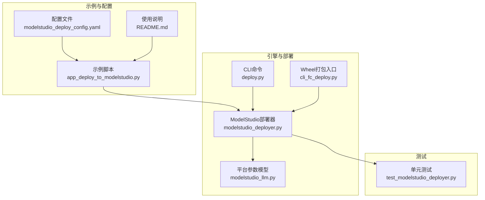
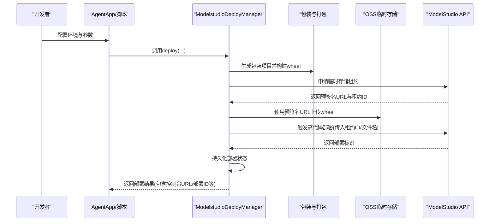
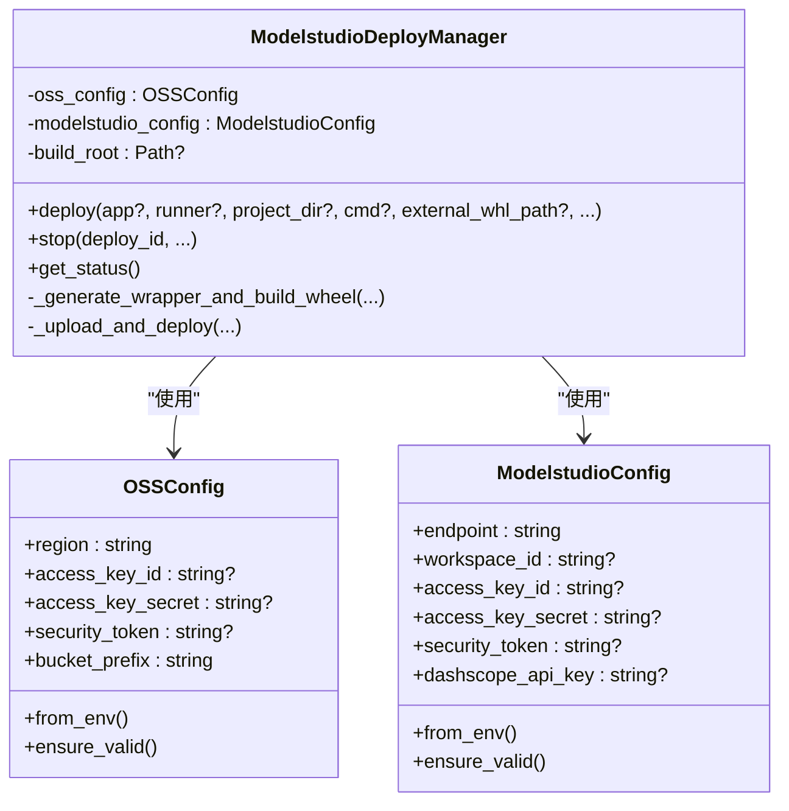
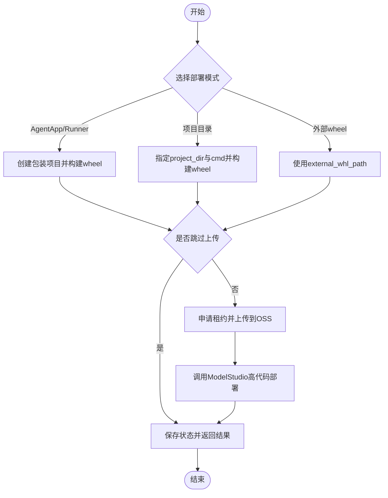
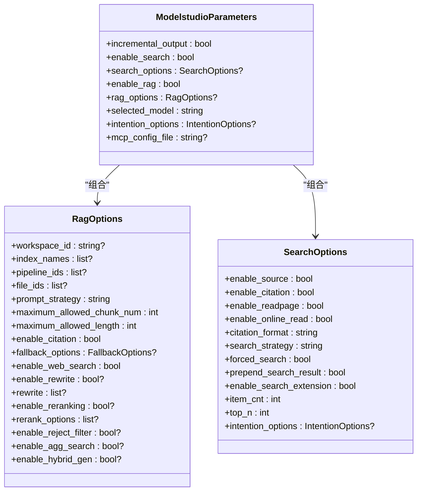
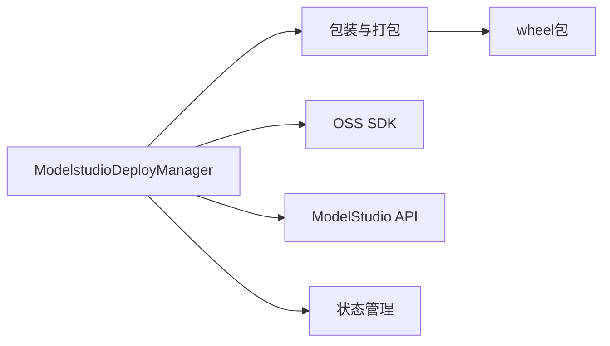

# ModelStudio部署

<cite>
**本文引用的文件**   
- [modelstudio_deployer.py](file://src/agentscope_runtime/engine/deployers/modelstudio_deployer.py)
- [app_deploy_to_modelstudio.py](file://examples/deployments/modelstudio_deploy/app_deploy_to_modelstudio.py)
- [README.md](file://examples/deployments/modelstudio_deploy/README.md)
- [modelstudio_deploy_config.yaml](file://examples/deployments/modelstudio_deploy_config.yaml)
- [modelstudio_llm.py](file://src/agentscope_runtime/engine/schemas/modelstudio_llm.py)
- [test_modelstudio_deployer.py](file://tests/deploy/test_modelstudio_deployer.py)
- [deploy.py](file://src/agentscope_runtime/cli/commands/deploy.py)
- [cli_fc_deploy.py](file://src/agentscope_runtime/engine/deployers/cli_fc_deploy.py)
- [modelstudio_memory/__init__.py](file://src/agentscope_runtime/tools/modelstudio_memory/__init__.py)
- [realtime_clients/__init__.py](file://src/agentscope_runtime/tools/realtime_clients/__init__.py)
</cite>

## 目录
1. [简介](#简介)
2. [项目结构](#项目结构)
3. [核心组件](#核心组件)
4. [架构总览](#架构总览)
5. [详细组件分析](#详细组件分析)
6. [依赖分析](#依赖分析)
7. [性能考虑](#性能考虑)
8. [故障排查指南](#故障排查指南)
9. [结论](#结论)
10. [附录](#附录)

## 简介
本文件面向AgentScope Runtime的ModelStudio部署能力，系统性阐述ModelStudio平台的集成原理与AI应用部署机制。重点围绕ModelStudioDeployer类展开，覆盖模型管理、推理服务与资源调度等关键环节；并提供完整的部署示例、配置方法、AI特性与优化策略（如模型检索增强、流式推理与实时预测），以及最佳实践建议。

## 项目结构
与ModelStudio部署直接相关的模块与示例如下：
- 引擎层部署器：ModelStudio部署器实现位于引擎部署器目录
- 示例与配置：提供可运行的部署脚本与CLI配置样例
- 平台能力模型：定义ModelStudio平台的LLM参数与RAG/搜索选项
- 测试用例：验证打包、上传与部署流程的关键路径
- CLI命令：支持通过命令行进行ModelStudio部署

**图表来源**
- [modelstudio_deployer.py:544-947](file://src/agentscope_runtime/engine/deployers/modelstudio_deployer.py#L544-L947)
- [app_deploy_to_modelstudio.py:125-440](file://examples/deployments/modelstudio_deploy/app_deploy_to_modelstudio.py#L125-L440)
- [README.md:1-331](file://examples/deployments/modelstudio_deploy/README.md#L1-L331)
- [modelstudio_deploy_config.yaml:1-22](file://examples/deployments/modelstudio_deploy_config.yaml#L1-L22)
- [modelstudio_llm.py:245-313](file://src/agentscope_runtime/engine/schemas/modelstudio_llm.py#L245-L313)
- [deploy.py:517-551](file://src/agentscope_runtime/cli/commands/deploy.py#L517-L551)
- [cli_fc_deploy.py:88-128](file://src/agentscope_runtime/engine/deployers/cli_fc_deploy.py#L88-L128)
- [test_modelstudio_deployer.py:23-90](file://tests/deploy/test_modelstudio_deployer.py#L23-L90)

**章节来源**
- [modelstudio_deployer.py:544-947](file://src/agentscope_runtime/engine/deployers/modelstudio_deployer.py#L544-L947)
- [app_deploy_to_modelstudio.py:125-440](file://examples/deployments/modelstudio_deploy/app_deploy_to_modelstudio.py#L125-L440)
- [README.md:1-331](file://examples/deployments/modelstudio_deploy/README.md#L1-L331)
- [modelstudio_deploy_config.yaml:1-22](file://examples/deployments/modelstudio_deploy_config.yaml#L1-L22)
- [modelstudio_llm.py:245-313](file://src/agentscope_runtime/engine/schemas/modelstudio_llm.py#L245-L313)
- [deploy.py:517-551](file://src/agentscope_runtime/cli/commands/deploy.py#L517-L551)
- [cli_fc_deploy.py:88-128](file://src/agentscope_runtime/engine/deployers/cli_fc_deploy.py#L88-L128)
- [test_modelstudio_deployer.py:23-90](file://tests/deploy/test_modelstudio_deployer.py#L23-L90)

## 核心组件
- ModelStudio部署器（ModelstudioDeployManager）
  - 负责将用户项目封装为wheel包，上传至OSS临时存储，再调用ModelStudio API触发“全量代码部署”
  - 提供环境变量注入、依赖打包、自定义端点与任务队列等高级能力
  - 支持从外部wheel直接部署、跳过上传仅做打包、或基于AgentApp自动构建
- 平台参数模型（ModelstudioParameters/RagOptions/SearchOptions）
  - 定义ModelStudio平台的检索增强（RAG）、搜索策略、意图识别、增量输出等参数
  - 为AI应用提供可配置的推理与检索能力
- 示例与配置
  - 提供三种部署方式：通过AgentApp部署、直接从项目目录部署、从已有wheel部署
  - 提供CLI配置样例与环境变量参考

**章节来源**
- [modelstudio_deployer.py:544-947](file://src/agentscope_runtime/engine/deployers/modelstudio_deployer.py#L544-L947)
- [modelstudio_llm.py:245-313](file://src/agentscope_runtime/engine/schemas/modelstudio_llm.py#L245-L313)
- [app_deploy_to_modelstudio.py:125-440](file://examples/deployments/modelstudio_deploy/app_deploy_to_modelstudio.py#L125-L440)
- [modelstudio_deploy_config.yaml:1-22](file://examples/deployments/modelstudio_deploy_config.yaml#L1-L22)

## 架构总览
ModelStudio部署的整体流程如下：
- 项目打包：生成包装项目、构建wheel
- 上传与租约：向ModelStudio申请临时存储租约，获取预签名URL并上传wheel
- 触发部署：调用ModelStudio高代码部署接口，返回部署标识
- 状态持久化：保存部署状态到状态管理器，返回结果

**图表来源**
- [modelstudio_deployer.py:566-725](file://src/agentscope_runtime/engine/deployers/modelstudio_deployer.py#L566-L725)
- [modelstudio_deployer.py:827-885](file://src/agentscope_runtime/engine/deployers/modelstudio_deployer.py#L827-L885)

**章节来源**
- [modelstudio_deployer.py:566-725](file://src/agentscope_runtime/engine/deployers/modelstudio_deployer.py#L566-L725)
- [modelstudio_deployer.py:827-885](file://src/agentscope_runtime/engine/deployers/modelstudio_deployer.py#L827-L885)

## 详细组件分析

### ModelStudioDeployManager类
- 职责
  - 封装项目为wheel并上传至OSS临时存储
  - 调用ModelStudio高代码部署接口完成部署
  - 注入环境变量、生成.env文件、支持自定义端点与任务队列
  - 保存部署状态并返回统一结果
- 关键方法
  - 生成包装与wheel：_generate_wrapper_and_build_wheel
  - 上传与部署：_upload_and_deploy
  - 主入口部署：deploy（支持外部wheel、AgentApp/runner两种模式）
  - 停止部署：stop（当前未实现，提示需在控制台手动清理）
- 配置对象
  - OSSConfig：OSS区域、AK/SK/STS Token、桶前缀
  - ModelstudioConfig：ModelStudio端点、工作区ID、AK/SK/STS、DashScope API Key

**图表来源**
- [modelstudio_deployer.py:50-131](file://src/agentscope_runtime/engine/deployers/modelstudio_deployer.py#L50-L131)
- [modelstudio_deployer.py:544-947](file://src/agentscope_runtime/engine/deployers/modelstudio_deployer.py#L544-L947)

**章节来源**
- [modelstudio_deployer.py:50-131](file://src/agentscope_runtime/engine/deployers/modelstudio_deployer.py#L50-L131)
- [modelstudio_deployer.py:544-947](file://src/agentscope_runtime/engine/deployers/modelstudio_deployer.py#L544-L947)

### 部署流程与参数
- 三种部署方式
  - 使用AgentApp：自动创建包装项目、注入环境变量、生成入口脚本
  - 直接从项目目录：指定project_dir与启动命令
  - 从已有wheel：传入external_whl_path，跳过本地构建
- 关键参数
  - deploy_name：部署资源名称
  - requirements/extra_packages：依赖与额外包
  - environment：注入容器环境变量
  - telemetry_enabled：是否启用遥测
  - custom_endpoints：自定义端点列表
  - skip_upload：仅打包不上传（用于离线构建）

**图表来源**
- [modelstudio_deployer.py:727-885](file://src/agentscope_runtime/engine/deployers/modelstudio_deployer.py#L727-L885)
- [app_deploy_to_modelstudio.py:125-281](file://examples/deployments/modelstudio_deploy/app_deploy_to_modelstudio.py#L125-L281)

**章节来源**
- [modelstudio_deployer.py:727-885](file://src/agentscope_runtime/engine/deployers/modelstudio_deployer.py#L727-L885)
- [app_deploy_to_modelstudio.py:125-281](file://examples/deployments/modelstudio_deploy/app_deploy_to_modelstudio.py#L125-L281)

### AI特性与推理优化
- 检索增强（RAG）
  - 支持索引名、管道ID、文件ID、提示策略、最大块数与长度等参数
  - 支持回退策略、重写、重排、拒绝过滤与聚合搜索
- 搜索能力
  - 支持多种搜索策略（turbo/pro/max等）、在线阅读、引用格式等
  - 可结合意图识别白/黑名单与场景ID
- 增量输出与流式响应
  - 支持增量输出与SSE流式响应，提升实时交互体验
- MCP配置
  - 支持通过MCP配置文件扩展上下文协议能力

**图表来源**
- [modelstudio_llm.py:112-243](file://src/agentscope_runtime/engine/schemas/modelstudio_llm.py#L112-L243)
- [modelstudio_llm.py:245-313](file://src/agentscope_runtime/engine/schemas/modelstudio_llm.py#L245-L313)

**章节来源**
- [modelstudio_llm.py:112-243](file://src/agentscope_runtime/engine/schemas/modelstudio_llm.py#L112-L243)
- [modelstudio_llm.py:245-313](file://src/agentscope_runtime/engine/schemas/modelstudio_llm.py#L245-L313)

### 实时预测与批量推理
- 实时客户端
  - 提供ASR/TTS客户端与回调接口，支持ModelStudio与Azure双实现
  - 支持网络稳定性、缓冲区大小、配额与断线重连等性能与安全建议
- 批量推理
  - 通过任务端点（如/celery1队列）实现异步批处理
  - 结合流式接口与SSE，支持长时任务的增量反馈

**章节来源**
- [realtime_clients/__init__.py:1-14](file://src/agentscope_runtime/tools/realtime_clients/__init__.py#L1-L14)

### 模型版本管理与资源调度
- 版本管理
  - 通过deploy_name与资源名区分不同版本；部署成功后可在控制台查看与管理
- 资源调度
  - 由ModelStudio平台负责容器化与弹性扩缩容
  - 控制台提供监控与日志，便于资源使用评估与优化

**章节来源**
- [modelstudio_deployer.py:852-885](file://src/agentscope_runtime/engine/deployers/modelstudio_deployer.py#L852-L885)
- [README.md:322-331](file://examples/deployments/modelstudio_deploy/README.md#L322-L331)

## 依赖分析
- 外部SDK
  - 阿里云OSS SDK、ModelStudio SDK、OpenAPI/Tea工具集
- 内部依赖
  - 包装与打包：generate_wrapper_project、build_wheel
  - 服务工厂与路由：FastAPI工厂、统一路由混合
  - 状态管理：Deployment模型与状态持久化

**图表来源**
- [modelstudio_deployer.py:23-28](file://src/agentscope_runtime/engine/deployers/modelstudio_deployer.py#L23-L28)
- [modelstudio_deployer.py:566-619](file://src/agentscope_runtime/engine/deployers/modelstudio_deployer.py#L566-L619)
- [modelstudio_deployer.py:852-871](file://src/agentscope_runtime/engine/deployers/modelstudio_deployer.py#L852-L871)

**章节来源**
- [modelstudio_deployer.py:23-28](file://src/agentscope_runtime/engine/deployers/modelstudio_deployer.py#L23-L28)
- [modelstudio_deployer.py:566-619](file://src/agentscope_runtime/engine/deployers/modelstudio_deployer.py#L566-L619)
- [modelstudio_deployer.py:852-871](file://src/agentscope_runtime/engine/deployers/modelstudio_deployer.py#L852-L871)

## 性能考虑
- 上传与租约
  - 使用预签名URL上传，避免在本地暴露凭证；租约有效期与桶标签确保访问控制
- 推理优化
  - 启用增量输出与流式响应，降低首字延迟
  - 合理设置RAG最大块数与长度，平衡召回质量与响应时间
- 网络与并发
  - 实时客户端需关注网络稳定性与缓冲区大小；对长任务采用异步队列与SSE推送
- 资源与成本
  - 在控制台按需调整实例规格与副本数；结合监控指标优化资源配置

[本节为通用指导，无需特定文件引用]

## 故障排查指南
- 环境变量缺失
  - 必需变量：MODELSTUDIO_WORKSPACE_ID、ALIBABA_CLOUD_ACCESS_KEY_ID、ALIBABA_CLOUD_ACCESS_KEY_SECRET、DASHSCOPE_API_KEY
  - OSS相关变量可选，若未设置将回退到阿里云主AK/SK
- 权限问题
  - 申请临时存储租约失败（NoPermission）：检查RAM用户是否具备AliyunBailianDataFullAccess权限
  - RAM用户未分配到工作区：根据提示在控制台为用户分配工作区
- SDK与网络
  - 未安装云SDK：请安装alibabacloud-oss-v2、alibabacloud-bailian20231229及相关依赖
  - 网络连通性：确认可访问ModelStudio与OSS端点
- 部署状态
  - 若停止接口未实现，请在ModelStudio控制台手动清理资源

**章节来源**
- [app_deploy_to_modelstudio.py:288-307](file://examples/deployments/modelstudio_deploy/app_deploy_to_modelstudio.py#L288-L307)
- [modelstudio_deployer.py:338-410](file://src/agentscope_runtime/engine/deployers/modelstudio_deployer.py#L338-L410)
- [modelstudio_deployer.py:895-943](file://src/agentscope_runtime/engine/deployers/modelstudio_deployer.py#L895-L943)

## 结论
ModelStudio部署器提供了从项目打包、云端上传到高代码部署的一体化能力，结合ModelStudio平台的RAG/搜索与实时能力，能够支撑高质量的AI应用上线与运维。通过合理的参数配置与最佳实践，可在保证性能与安全的前提下，快速迭代与规模化交付。

[本节为总结性内容，无需特定文件引用]

## 附录

### 部署示例与配置要点
- 使用AgentApp部署
  - 自动注入环境变量、生成入口脚本、支持同步/异步/流式端点与任务队列
- 直接从项目目录部署
  - 指定project_dir与cmd即可完成打包与部署
- 从已有wheel部署
  - 传入external_whl_path，跳过本地构建，适合CI/CD流水线
- CLI配置
  - 通过配置文件与环境变量组合，支持name、entrypoint、skip_upload、environment等参数

**章节来源**
- [app_deploy_to_modelstudio.py:125-281](file://examples/deployments/modelstudio_deploy/app_deploy_to_modelstudio.py#L125-L281)
- [modelstudio_deploy_config.yaml:1-22](file://examples/deployments/modelstudio_deploy_config.yaml#L1-L22)
- [deploy.py:517-551](file://src/agentscope_runtime/cli/commands/deploy.py#L517-L551)
- [cli_fc_deploy.py:88-128](file://src/agentscope_runtime/engine/deployers/cli_fc_deploy.py#L88-L128)

### 平台能力与工具
- 记忆服务
  - 提供添加、查询、更新、删除记忆节点与用户画像schema的能力
- 实时客户端
  - ASR/TTS客户端与回调接口，支持ModelStudio与Azure实现
- 搜索与生成
  - 搜索与图像生成工具，结合DashScope API实现多模态能力

**章节来源**
- [modelstudio_memory/__init__.py:1-155](file://src/agentscope_runtime/tools/modelstudio_memory/__init__.py#L1-L155)
- [realtime_clients/__init__.py:1-14](file://src/agentscope_runtime/tools/realtime_clients/__init__.py#L1-L14)