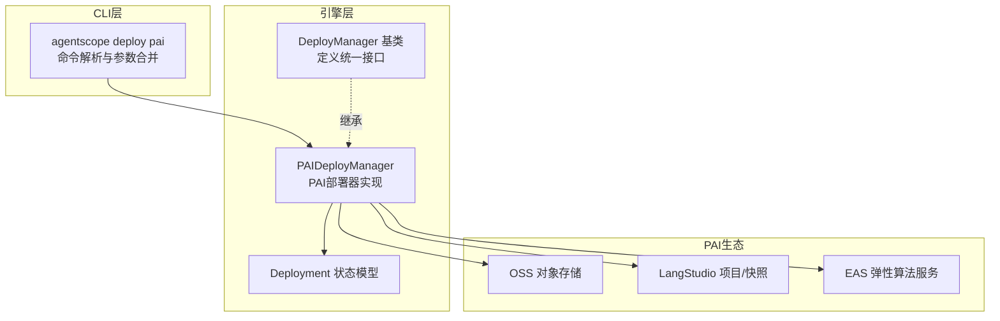
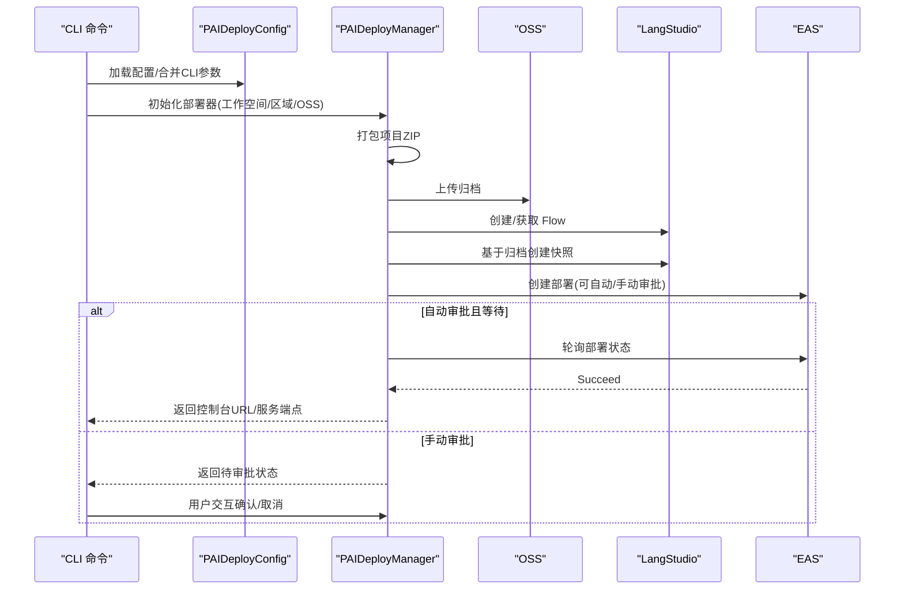
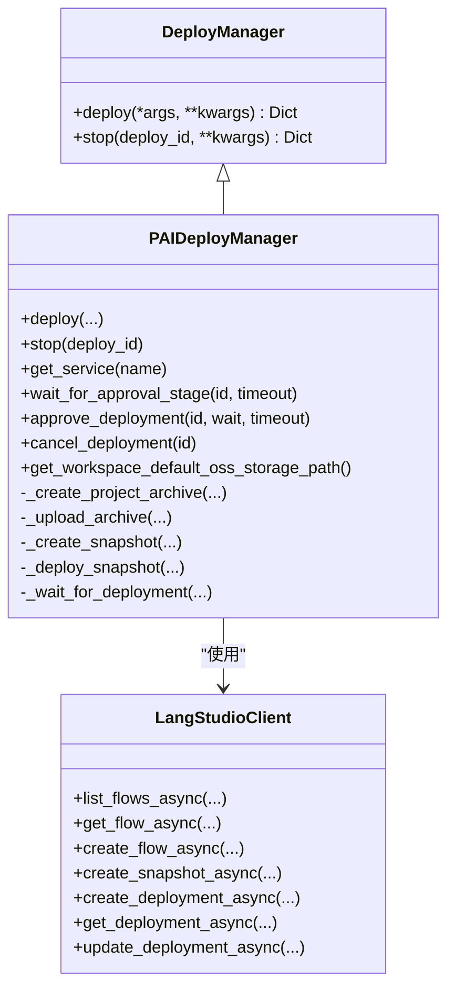
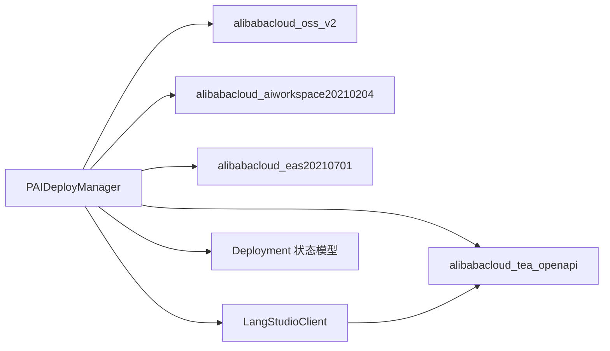
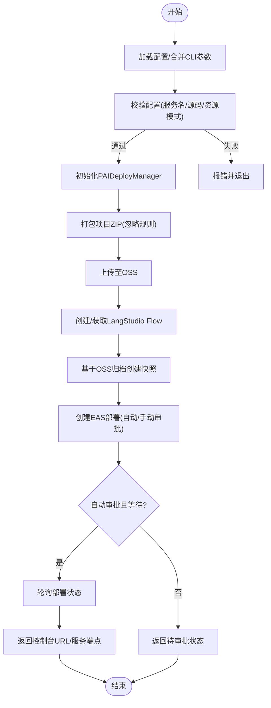

# PAI部署

<cite>
**本文引用的文件列表**
- [pai_deployer.py](file://src/agentscope_runtime/engine/deployers/pai_deployer.py)
- [deploy.py](file://src/agentscope_runtime/cli/commands/deploy.py)
- [base.py](file://src/agentscope_runtime/engine/deployers/base.py)
- [deploy_config.yaml](file://examples/deployments/pai_deploy/deploy_config.yaml)
- [README.md](file://examples/deployments/pai_deploy/README.md)
- [agent.py](file://examples/deployments/pai_deploy/my_agent/agent.py)
- [test_pai_deployer.py](file://tests/deploy/test_pai_deployer.py)
</cite>

## 目录
1. [简介](#简介)
2. [项目结构](#项目结构)
3. [核心组件](#核心组件)
4. [架构总览](#架构总览)
5. [详细组件分析](#详细组件分析)
6. [依赖关系分析](#依赖关系分析)
7. [性能与可靠性](#性能与可靠性)
8. [故障排查指南](#故障排查指南)
9. [结论](#结论)
10. [附录](#附录)

## 简介
本文件面向AgentScope Runtime在阿里云PAI平台的部署能力，系统性阐述PAI部署器的实现原理、配置方式、部署流程以及与PAI生态（LangStudio、EAS、OSS）的集成机制。重点围绕PaiDeployer类展开，覆盖训练作业、模型服务与资源管理等关键能力；同时提供完整的部署示例、配置文件与最佳实践，帮助用户在生产环境中稳定地进行机器学习应用的部署与运维。

## 项目结构
与PAI部署直接相关的代码与示例位于以下位置：
- 引擎层部署器：src/agentscope_runtime/engine/deployers/pai_deployer.py
- CLI命令入口：src/agentscope_runtime/cli/commands/deploy.py
- 基类接口：src/agentscope_runtime/engine/deployers/base.py
- 示例配置与示例Agent：examples/deployments/pai_deploy/
- 测试用例：tests/deploy/test_pai_deployer.py

图表来源
- [pai_deployer.py:1102-1110](file://src/agentscope_runtime/engine/deployers/pai_deployer.py#L1102-L1110)
- [deploy.py:883-1186](file://src/agentscope_runtime/cli/commands/deploy.py#L883-L1186)

章节来源
- [pai_deployer.py:1102-1110](file://src/agentscope_runtime/engine/deployers/pai_deployer.py#L1102-L1110)
- [deploy.py:883-1186](file://src/agentscope_runtime/cli/commands/deploy.py#L883-L1186)

## 核心组件
- PAIDeployConfig：用于从YAML/字典加载与合并CLI参数，校验部署所需字段，推断资源类型与OSS工作目录，生成部署器参数。
- PAIDeployManager：PAI部署器主类，负责打包项目、上传OSS、创建/更新LangStudio Flow与快照、创建EAS服务部署、轮询状态、停止服务等。
- LangStudioClient：对PAI LangStudio API的轻量封装，支持列出/获取/创建Flow、创建快照、创建/查询/更新部署等。
- CLI命令：agentscope deploy pai，负责参数解析、环境变量与标签合并、配置校验、调用部署器并处理手动审批流程。

章节来源
- [pai_deployer.py:721-851](file://src/agentscope_runtime/engine/deployers/pai_deployer.py#L721-L851)
- [pai_deployer.py:1102-1110](file://src/agentscope_runtime/engine/deployers/pai_deployer.py#L1102-L1110)
- [pai_deployer.py:60-120](file://src/agentscope_runtime/engine/deployers/pai_deployer.py#L60-L120)
- [deploy.py:883-1186](file://src/agentscope_runtime/cli/commands/deploy.py#L883-L1186)

## 架构总览
PAI部署的整体流程如下：
1. CLI解析配置与参数，构建PAIDeployConfig并校验。
2. 创建PAIDeployManager，解析OSS工作目录与资源类型。
3. 打包项目为ZIP，上传至OSS。
4. 在LangStudio中创建或复用Flow，并基于OSS归档创建快照。
5. 使用快照创建EAS服务部署，支持自动/手动审批。
6. 可选等待部署完成，记录控制台链接与服务端点。
7. 提供停止服务、取消/批准部署等运维操作。

图表来源
- [deploy.py:946-1186](file://src/agentscope_runtime/cli/commands/deploy.py#L946-L1186)
- [pai_deployer.py:1464-1683](file://src/agentscope_runtime/engine/deployers/pai_deployer.py#L1464-L1683)

章节来源
- [deploy.py:946-1186](file://src/agentscope_runtime/cli/commands/deploy.py#L946-L1186)
- [pai_deployer.py:1464-1683](file://src/agentscope_runtime/engine/deployers/pai_deployer.py#L1464-L1683)

## 详细组件分析

### 配置与参数体系
- PAIDeployConfig.from_yaml/from_dict：从YAML或字典构造配置对象。
- merge_cli：将CLI参数与配置合并，CLI优先级更高。
- resolve_resource_type：根据资源类型字段与resource_id/quota_id自动推断资源类型。
- resolve_oss_work_dir：优先使用spec.storage.work_dir，否则回退到context.storage.work_dir。
- to_deployer_kwargs：将配置转换为部署器参数字典，移除None值以使用默认值。
- validate_for_deploy：校验服务名、源码目录存在性及资源模式必需字段。

章节来源
- [pai_deployer.py:721-851](file://src/agentscope_runtime/engine/deployers/pai_deployer.py#L721-L851)
- [pai_deployer.py:942-981](file://src/agentscope_runtime/engine/deployers/pai_deployer.py#L942-L981)

### PAIDeployManager（核心部署器）
- 初始化与可用性检查：读取工作空间ID、区域、密钥等，确保SDK可用。
- 项目打包与上传：生成构建目录，按.gitignore/.dockerignore规则忽略文件，打包ZIP并上传至OSS。
- LangStudio Flow与快照：复用已有Flow或创建新Flow，基于OSS归档创建快照。
- EAS部署：构建部署配置JSON（实例数、网络、容器环境变量、服务组、资源类型与配额），创建部署并支持手动审批。
- 状态轮询与控制台链接：等待部署完成，返回控制台URL与服务端点；提供停止服务、取消/批准部署等运维接口。
- 资源类型与网络：支持public/resource/quota三种资源类型，支持VPC配置（vpc_id/vswitch_id/security_group_id）。

图表来源
- [base.py:9-44](file://src/agentscope_runtime/engine/deployers/base.py#L9-L44)
- [pai_deployer.py:1102-1110](file://src/agentscope_runtime/engine/deployers/pai_deployer.py#L1102-L1110)
- [pai_deployer.py:60-120](file://src/agentscope_runtime/engine/deployers/pai_deployer.py#L60-L120)

章节来源
- [pai_deployer.py:1102-1110](file://src/agentscope_runtime/engine/deployers/pai_deployer.py#L1102-L1110)
- [pai_deployer.py:1182-1202](file://src/agentscope_runtime/engine/deployers/pai_deployer.py#L1182-L1202)
- [pai_deployer.py:1204-1293](file://src/agentscope_runtime/engine/deployers/pai_deployer.py#L1204-L1293)
- [pai_deployer.py:1336-1390](file://src/agentscope_runtime/engine/deployers/pai_deployer.py#L1336-L1390)
- [pai_deployer.py:1401-1462](file://src/agentscope_runtime/engine/deployers/pai_deployer.py#L1401-L1462)
- [pai_deployer.py:1464-1683](file://src/agentscope_runtime/engine/deployers/pai_deployer.py#L1464-L1683)

### LangStudioClient（LangStudio API客户端）
- 列表/获取/创建Flow、删除Flow。
- 创建快照（基于OSS归档URI）。
- 创建/查询/更新部署（含手动审批动作）。
- 参数构建与URL编码工具方法。

章节来源
- [pai_deployer.py:60-120](file://src/agentscope_runtime/engine/deployers/pai_deployer.py#L60-L120)
- [pai_deployer.py:1182-1202](file://src/agentscope_runtime/engine/deployers/pai_deployer.py#L1182-L1202)
- [pai_deployer.py:1336-1390](file://src/agentscope_runtime/engine/deployers/pai_deployer.py#L1336-L1390)
- [pai_deployer.py:1392-1462](file://src/agentscope_runtime/engine/deployers/pai_deployer.py#L1392-L1462)

### CLI命令（agentscope deploy pai）
- 支持从配置文件或纯CLI参数构建部署配置。
- 解析环境变量与标签，合并到配置。
- 解析源码目录与入口脚本，校验配置后创建部署器并执行部署。
- 处理自动/手动审批流程，交互式提示用户选择Approve/Cancel/Skip。
- 输出部署结果与控制台链接。

章节来源
- [deploy.py:883-1186](file://src/agentscope_runtime/cli/commands/deploy.py#L883-L1186)

### 示例与配置
- 示例配置文件：examples/deployments/pai_deploy/deploy_config.yaml
  - 包含context（工作空间ID、区域）、spec（服务名、代码目录与入口、资源类型与实例数、环境变量等）。
- 示例Agent：examples/deployments/pai_deploy/my_agent/agent.py
  - 展示ReActAgent与工具集成、会话状态管理、流式输出等典型Agent运行逻辑。
- 示例README：examples/deployments/pai_deploy/README.md
  - 详细的前置条件、部署步骤、CLI选项、资源类型与VPC配置说明、故障排查与示例命令。

章节来源
- [deploy_config.yaml:1-39](file://examples/deployments/pai_deploy/deploy_config.yaml#L1-L39)
- [agent.py:1-116](file://examples/deployments/pai_deploy/my_agent/agent.py#L1-L116)
- [README.md:1-347](file://examples/deployments/pai_deploy/README.md#L1-L347)

## 依赖关系分析
- 外部SDK依赖
  - alibabacloud_oss_v2：OSS上传与访问。
  - alibabacloud_aiworkspace20210204：PAI Workspace配置查询。
  - alibabacloud_eas20210701：EAS服务描述与启停。
  - alibabacloud_tea_openapi：通用OpenAPI客户端与工具。
  - darabonba.runtime：LangStudio API调用运行时。
- 内部依赖
  - DeployManager基类：统一接口契约。
  - 部署状态模型：Deployment，保存部署ID、控制台URL、服务端点、状态等。
  - 工具模块：OSS URI解析、网络可达性检测、构建目录生成等。

图表来源
- [pai_deployer.py:34-54](file://src/agentscope_runtime/engine/deployers/pai_deployer.py#L34-L54)
- [pai_deployer.py:1102-1110](file://src/agentscope_runtime/engine/deployers/pai_deployer.py#L1102-L1110)

章节来源
- [pai_deployer.py:34-54](file://src/agentscope_runtime/engine/deployers/pai_deployer.py#L34-L54)
- [pai_deployer.py:1102-1110](file://src/agentscope_runtime/engine/deployers/pai_deployer.py#L1102-L1110)

## 性能与可靠性
- 构建与上传
  - 采用ZIP压缩与忽略规则，减少上传体积与冗余文件。
  - OSS上传使用标准客户端，支持内网/公网端点自动探测。
- 部署与状态轮询
  - 默认自动审批+等待完成，可在超时时间内轮询部署状态。
  - 支持手动审批流程，便于合规与安全管控。
- 资源类型与弹性
  - public/resource/quota三种资源类型，满足不同规模与合规要求。
  - 支持多实例与VPC网络配置，提升可用性与隔离性。
- 错误处理
  - 部分异常明确抛出错误信息（如服务名被占用、凭证无效、OSS上传失败等），便于快速定位问题。

章节来源
- [pai_deployer.py:1744-1799](file://src/agentscope_runtime/engine/deployers/pai_deployer.py#L1744-L1799)
- [pai_deployer.py:1801-1845](file://src/agentscope_runtime/engine/deployers/pai_deployer.py#L1801-L1845)
- [pai_deployer.py:1401-1462](file://src/agentscope_runtime/engine/deployers/pai_deployer.py#L1401-L1462)
- [pai_deployer.py:1917-1948](file://src/agentscope_runtime/engine/deployers/pai_deployer.py#L1917-L1948)

## 故障排查指南
- “PAI部署器不可用”
  - 安装扩展依赖：pip install 'agentscope-runtime[ext]'
- “需要工作空间ID”
  - 设置PAI_WORKSPACE_ID环境变量，或通过--workspace-id传入，或在配置文件context.workspace_id中指定。
- “服务名已被占用”
  - 服务名需在区域内唯一，请更换服务名。
- “凭证错误”
  - 检查ALIBABA_CLOUD_ACCESS_KEY_ID/ALIBABA_CLOUD_ACCESS_KEY_SECRET与RAM权限。
- “OSS上传失败”
  - 确认OSS Bucket存在且可访问，检查工作空间与OSS所在区域一致。
- “部署长时间未完成”
  - 检查超时设置与网络连通性；必要时启用手动审批并确认部署状态。

章节来源
- [README.md:286-311](file://examples/deployments/pai_deploy/README.md#L286-L311)
- [pai_deployer.py:1917-1948](file://src/agentscope_runtime/engine/deployers/pai_deployer.py#L1917-L1948)

## 结论
PAI部署器通过清晰的配置体系、完善的SDK集成与严谨的部署流程，实现了从项目打包、OSS上传、LangStudio快照到EAS服务部署的一体化能力。其支持多种资源类型与网络配置，具备自动/手动审批与运维接口，适合在生产环境中进行机器学习应用的稳定部署与管理。结合示例配置与Agent示例，用户可以快速上手并扩展到更复杂的业务场景。

## 附录

### 部署示例与最佳实践
- 使用配置文件部署（推荐）
  - agentscope deploy pai --config examples/deployments/pai_deploy/deploy_config.yaml
  - 可叠加CLI覆盖参数，如--name、--instance-count等。
- 使用纯CLI部署
  - agentscope deploy pai ./examples/deployments/pai_deploy/my_agent --name my-service --workspace-id <your-workspace-id>
- 环境变量注入
  - 在配置文件spec.env中设置，或通过--env/--env-file传入。
- 手动审批流程
  - agentscope deploy pai --config deploy_config.yaml --no-auto-approve
  - 在交互终端选择Approve/Cancel/Skip，或在PAI控制台操作。
- VPC与网络
  - 在spec.vpc_config中配置vpc_id/vswitch_id/security_group_id，满足私网访问需求。
- 资源类型选择
  - public：共享实例，适合开发与小规模部署。
  - resource：专用EAS资源组，适合生产隔离。
  - quota：配额模式，适合企业级资源管理。

章节来源
- [README.md:123-347](file://examples/deployments/pai_deploy/README.md#L123-L347)
- [deploy.py:883-1186](file://src/agentscope_runtime/cli/commands/deploy.py#L883-L1186)

### 关键流程图（配置到部署）

图表来源
- [pai_deployer.py:1464-1683](file://src/agentscope_runtime/engine/deployers/pai_deployer.py#L1464-L1683)
- [deploy.py:946-1186](file://src/agentscope_runtime/cli/commands/deploy.py#L946-L1186)