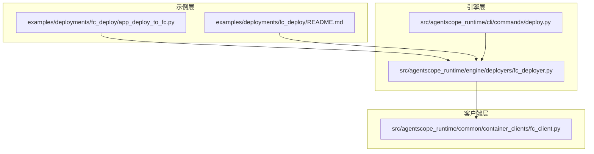
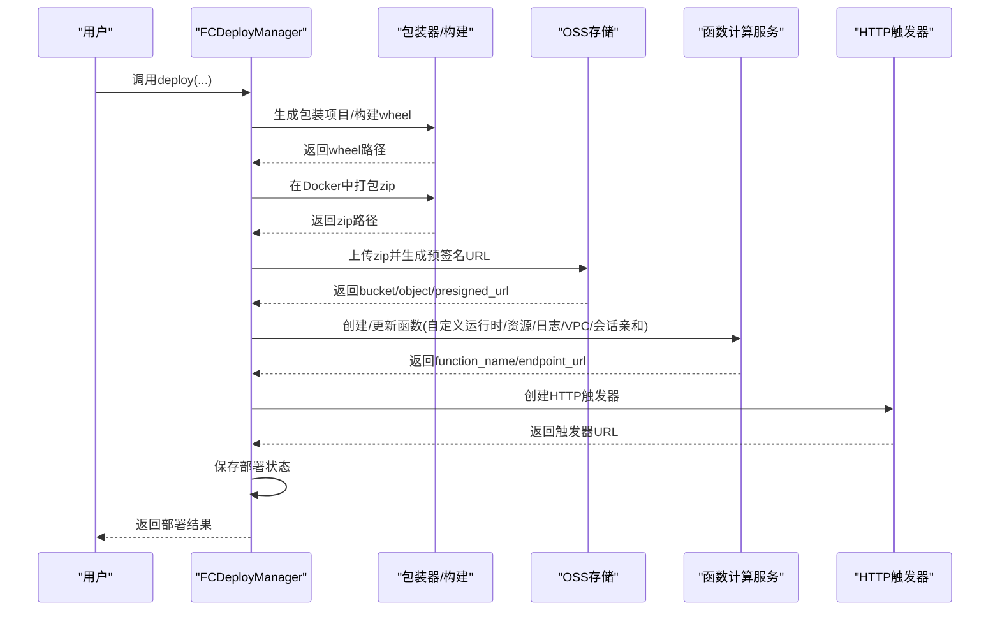
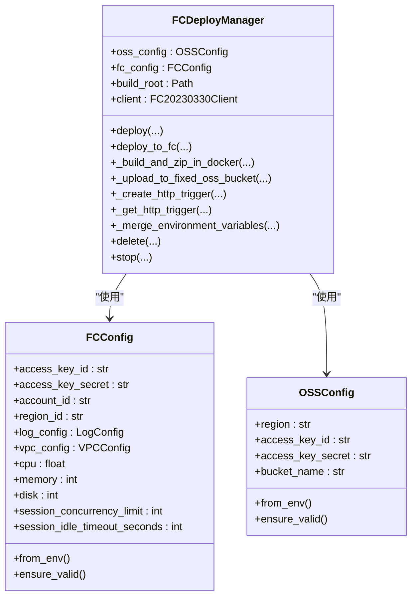
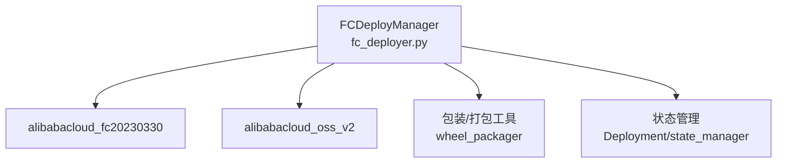

# 函数计算(Fc)部署

<cite>
**本文档引用的文件**
- [fc_deployer.py](file://src/agentscope_runtime/engine/deployers/fc_deployer.py)
- [app_deploy_to_fc.py](file://examples/deployments/fc_deploy/app_deploy_to_fc.py)
- [README.md](file://examples/deployments/fc_deploy/README.md)
- [deploy.py](file://src/agentscope_runtime/cli/commands/deploy.py)
- [fc_client.py](file://src/agentscope_runtime/common/container_clients/fc_client.py)
- [test_fc_deployer.py](file://tests/deploy/test_fc_deployer.py)
</cite>

## 目录
1. [简介](#简介)
2. [项目结构](#项目结构)
3. [核心组件](#核心组件)
4. [架构概览](#架构概览)
5. [详细组件分析](#详细组件分析)
6. [依赖关系分析](#依赖关系分析)
7. [性能考虑](#性能考虑)
8. [故障排查指南](#故障排查指南)
9. [结论](#结论)
10. [附录](#附录)

## 简介
本文件面向AgentScope Runtime的函数计算(Fc)部署功能，深入解释阿里云函数计算平台的集成原理与无服务器架构。文档围绕FcDeployer类展开，详细说明函数配置、触发器设置、权限管理、成本效益、自动扩缩容与事件驱动特性，并提供完整的部署示例与CLI命令，涵盖冷启动优化、内存配置与超时处理策略，以及云原生最佳实践。

## 项目结构
AgentScope Runtime在以下位置提供了Fc部署相关的核心代码与示例：
- 引擎层：Fc部署器实现位于引擎部署器模块中，负责打包、上传与函数创建/更新。
- 示例层：提供完整的Fc部署示例脚本与说明文档，展示如何使用AgentApp或直接从项目目录进行部署。
- CLI层：提供命令行入口，支持多种部署方式（含Fc）。
- 客户端层：提供Fc容器客户端，用于沙箱环境下的函数计算会话管理。

图表来源
- [fc_deployer.py:1-1507](file://src/agentscope_runtime/engine/deployers/fc_deployer.py#L1-1507)
- [app_deploy_to_fc.py:1-459](file://examples/deployments/fc_deploy/app_deploy_to_fc.py#L1-459)
- [README.md:1-542](file://examples/deployments/fc_deploy/README.md#L1-542)
- [deploy.py:1-2272](file://src/agentscope_runtime/cli/commands/deploy.py#L1-2272)
- [fc_client.py:1-786](file://src/agentscope_runtime/common/container_clients/fc_client.py#L1-786)

章节来源
- [fc_deployer.py:1-1507](file://src/agentscope_runtime/engine/deployers/fc_deployer.py#L1-1507)
- [app_deploy_to_fc.py:1-459](file://examples/deployments/fc_deploy/app_deploy_to_fc.py#L1-459)
- [README.md:1-542](file://examples/deployments/fc_deploy/README.md#L1-542)
- [deploy.py:1-2272](file://src/agentscope_runtime/cli/commands/deploy.py#L1-2272)
- [fc_client.py:1-786](file://src/agentscope_runtime/common/container_clients/fc_client.py#L1-786)

## 核心组件
- FCDeployManager：Fc部署器，负责构建包装项目、生成wheel包、在Docker容器内打包zip、上传到OSS、创建/更新函数、配置HTTP触发器、保存部署状态等。
- FCConfig/OSSConfig：配置模型，支持从环境变量加载，包含区域、CPU/内存/磁盘、日志、VPC、会话亲和等参数。
- FCClient：Fc容器客户端，用于沙箱环境中的函数计算会话管理（创建、删除、检查状态等），与FCDeployManager形成互补。

章节来源
- [fc_deployer.py:67-246](file://src/agentscope_runtime/engine/deployers/fc_deployer.py#L67-246)
- [fc_client.py:25-53](file://src/agentscope_runtime/common/container_clients/fc_client.py#L25-53)

## 架构概览
Fc部署的整体流程如下：
- 包装与打包：根据用户项目或外部wheel，生成包装项目并构建wheel；在Docker容器内安装依赖并打包为zip。
- 存储与上传：将zip上传至指定OSS桶，生成预签名URL以便Fc拉取。
- 函数创建/更新：调用Fc API创建或更新函数，配置自定义运行时、资源限制、日志与VPC网络、会话亲和等。
- 触发器配置：创建HTTP触发器，返回公网/内网访问地址。
- 状态管理：保存部署信息到状态管理器，便于后续停止/查询。

图表来源
- [fc_deployer.py:416-821](file://src/agentscope_runtime/engine/deployers/fc_deployer.py#L416-821)
- [fc_deployer.py:1073-1367](file://src/agentscope_runtime/engine/deployers/fc_deployer.py#L1073-1367)

章节来源
- [fc_deployer.py:416-821](file://src/agentscope_runtime/engine/deployers/fc_deployer.py#L416-821)
- [fc_deployer.py:1073-1367](file://src/agentscope_runtime/engine/deployers/fc_deployer.py#L1073-1367)

## 详细组件分析

### FCDeployManager类详解
- 初始化与配置
  - 支持通过构造函数传入OSSConfig/FCConfig，或从环境变量加载。
  - 创建Fc客户端，基于账户ID与区域生成endpoint。
- 部署流程
  - 支持三种部署模式：使用AgentApp、直接从项目目录、使用现有wheel文件。
  - 自动创建.env文件注入环境变量。
  - 生成包装项目并构建wheel，随后在Docker容器内打包zip。
  - 上传zip到固定OSS桶，生成预签名URL。
  - 调用Fc API创建/更新函数，配置自定义运行时、资源、日志、VPC、会话亲和等。
  - 创建HTTP触发器，返回公网/内网访问URL。
  - 保存部署状态，返回部署结果。
- 关键方法
  - deploy(...)：主入口，协调整个部署流程。
  - deploy_to_fc(...)：创建/更新函数与配置。
  - _build_and_zip_in_docker(...)：在Docker中构建zip。
  - _upload_to_fixed_oss_bucket(...)：上传zip到OSS。
  - _create_http_trigger/_get_http_trigger：触发器创建与查询。
  - _merge_environment_variables：合并环境变量。
  - delete/stop：删除函数与停止部署。

图表来源
- [fc_deployer.py:67-246](file://src/agentscope_runtime/engine/deployers/fc_deployer.py#L67-246)
- [fc_deployer.py:246-821](file://src/agentscope_runtime/engine/deployers/fc_deployer.py#L246-821)

章节来源
- [fc_deployer.py:246-821](file://src/agentscope_runtime/engine/deployers/fc_deployer.py#L246-821)
- [fc_deployer.py:823-1507](file://src/agentscope_runtime/engine/deployers/fc_deployer.py#L823-1507)

### 配置模型与环境变量
- FCConfig
  - 来源：环境变量或构造函数参数。
  - 关键字段：区域、CPU/内存/磁盘、日志配置、VPC配置、会话并发限制与空闲超时、执行角色ARN等。
  - 默认值：区域默认cn-hangzhou，CPU默认2.0，内存默认2048MB，磁盘默认512MB，会话并发默认200，空闲超时默认3600秒。
- OSSConfig
  - 来源：环境变量或构造函数参数。
  - 关键字段：区域、AK/SK、桶名。
  - 默认值：区域默认cn-hangzhou，桶名为必填项。
- 环境变量参考
  - 必需：ALIBABA_CLOUD_ACCESS_KEY_ID、ALIBABA_CLOUD_ACCESS_KEY_SECRET、FC_ACCOUNT_ID、DASHSCOPE_API_KEY。
  - 可选：FC_REGION_ID、OSS_REGION、OSS_BUCKET_NAME、OSS_ACCESS_KEY_ID、OSS_ACCESS_KEY_SECRET、FC_VPC_ID、FC_SECURITY_GROUP_ID、FC_VSWITCH_IDS、FC_CPU、FC_MEMORY、FC_DISK、FC_LOG_STORE、FC_LOG_PROJECT、FC_SESSION_CONCURRENCY_LIMIT、FC_SESSION_IDLE_TIMEOUT_SECONDS、FC_EXECUTION_ROLE_ARN。

章节来源
- [fc_deployer.py:85-180](file://src/agentscope_runtime/engine/deployers/fc_deployer.py#L85-180)
- [README.md:306-382](file://examples/deployments/fc_deploy/README.md#L306-382)

### 触发器与会话亲和
- HTTP触发器
  - 固定触发器名称，匿名认证，支持GET/POST/PUT/DELETE/HEAD/OPTIONS方法。
  - 创建后返回公网/内网URL，用于API访问。
- 会话亲和
  - 使用请求头"x-agentscope-runtime-session-id"绑定到固定实例，提升缓存命中与状态一致性。
  - 会话TTL与并发限制可配置，默认TTL为21600秒，单实例并发默认200，空闲超时默认3600秒。

章节来源
- [fc_deployer.py:838-1071](file://src/agentscope_runtime/engine/deployers/fc_deployer.py#L838-1071)

### 权限与网络配置
- 日志配置
  - 可选配置SLS日志项目与日志库，启用请求与实例指标。
- VPC配置
  - 支持VPC ID、交换机列表与安全组配置，实现私网部署。
- 执行角色ARN
  - 可选配置，用于函数执行时的权限委托。

章节来源
- [fc_deployer.py:649-672](file://src/agentscope_runtime/engine/deployers/fc_deployer.py#L649-672)
- [fc_deployer.py:110-120](file://src/agentscope_runtime/engine/deployers/fc_deployer.py#L110-120)

### 部署示例与CLI命令
- 示例脚本
  - 提供三种部署方式：使用AgentApp、直接从项目目录、从现有wheel文件。
  - 展示健康检查与多端点测试命令，演示会话亲和的使用。
- CLI命令
  - 通过agentscope deploy fc子命令进行部署（当前仓库未直接提供Fc专用命令，但CLI框架已预留扩展点）。
  - 建议使用示例脚本作为主要入口，或在CLI中添加Fc专用命令。

章节来源
- [app_deploy_to_fc.py:125-459](file://examples/deployments/fc_deploy/app_deploy_to_fc.py#L125-459)
- [README.md:181-304](file://examples/deployments/fc_deploy/README.md#L181-304)
- [deploy.py:1-2272](file://src/agentscope_runtime/cli/commands/deploy.py#L1-2272)

## 依赖关系分析
- 外部SDK
  - alibabacloud_fc20230330：Fc API客户端。
  - alibabacloud_oss_v2：OSS客户端。
- 内部模块
  - 包装与打包：generate_wrapper_project、build_wheel、wheel_packager。
  - 状态管理：Deployment、state_manager。
  - 工具：Docker镜像构建、zip打包、环境变量注入等。

图表来源
- [fc_deployer.py:16-36](file://src/agentscope_runtime/engine/deployers/fc_deployer.py#L16-36)
- [fc_deployer.py:1215-1367](file://src/agentscope_runtime/engine/deployers/fc_deployer.py#L1215-1367)

章节来源
- [fc_deployer.py:16-36](file://src/agentscope_runtime/engine/deployers/fc_deployer.py#L16-36)
- [fc_deployer.py:1215-1367](file://src/agentscope_runtime/engine/deployers/fc_deployer.py#L1215-1367)

## 性能考虑
- 冷启动优化
  - 使用自定义运行时(custom.debian11)，配合Docker容器内预装依赖，减少首次启动时间。
  - 合理设置内存与CPU，避免频繁扩容导致抖动。
- 自动扩缩容
  - Fc按请求自动扩缩容，结合会话亲和可提升长连接场景的稳定性。
- 资源配置
  - CPU/内存/磁盘按业务峰值预留，避免超时与OOM。
  - 会话并发限制与空闲超时需结合业务特性调整。
- 超时处理
  - 函数超时默认300秒，建议根据任务类型合理设置。
  - 流式接口建议使用SSE或长轮询，避免超时中断。

章节来源
- [fc_deployer.py:729-744](file://src/agentscope_runtime/engine/deployers/fc_deployer.py#L729-744)
- [fc_deployer.py:136-163](file://src/agentscope_runtime/engine/deployers/fc_deployer.py#L136-163)

## 故障排查指南
- 环境变量缺失
  - 必需变量未设置会导致初始化失败，检查ALIBABA_CLOUD_ACCESS_KEY_ID、FC_ACCOUNT_ID、DASHSCOPE_API_KEY等。
- Docker不可用
  - 需要Docker Desktop进行构建，若未安装会抛出错误提示。
- 认证与权限
  - 检查AccessKey权限是否包含Fc与OSS操作权限。
- 区域与配额
  - 确认所选区域支持Fc服务，且账户CPU/内存配额充足。
- 日志与调试
  - 若配置了SLS日志，可在控制台查看运行时日志；通过FC控制台查看函数状态与指标。

章节来源
- [README.md:384-426](file://examples/deployments/fc_deploy/README.md#L384-426)
- [fc_deployer.py:182-198](file://src/agentscope_runtime/engine/deployers/fc_deployer.py#L182-198)

## 结论
AgentScope Runtime的Fc部署通过FCDeployManager实现了从项目打包到函数创建的全链路自动化，结合Docker容器化构建、OSS存储与Fc API，提供了高可用、可扩展的无服务器部署方案。通过合理的资源配置、会话亲和与日志监控，能够在保证性能的同时降低运维成本，适合事件驱动与弹性负载的AI应用。

## 附录

### 环境变量清单
- 必需
  - ALIBABA_CLOUD_ACCESS_KEY_ID
  - ALIBABA_CLOUD_ACCESS_KEY_SECRET
  - FC_ACCOUNT_ID
  - DASHSCOPE_API_KEY
- 可选
  - FC_REGION_ID
  - OSS_REGION
  - OSS_BUCKET_NAME
  - OSS_ACCESS_KEY_ID
  - OSS_ACCESS_KEY_SECRET
  - FC_VPC_ID
  - FC_SECURITY_GROUP_ID
  - FC_VSWITCH_IDS
  - FC_CPU
  - FC_MEMORY
  - FC_DISK
  - FC_LOG_STORE
  - FC_LOG_PROJECT
  - FC_SESSION_CONCURRENCY_LIMIT
  - FC_SESSION_IDLE_TIMEOUT_SECONDS
  - FC_EXECUTION_ROLE_ARN

章节来源
- [README.md:306-382](file://examples/deployments/fc_deploy/README.md#L306-382)

### 部署命令与示例
- 示例脚本运行
  - 进入示例目录，执行python app_deploy_to_fc.py，选择部署方式并按提示完成。
- API测试
  - 使用curl命令测试健康检查与多端点接口，添加"x-agentscope-runtime-session-id"头以启用会话亲和。

章节来源
- [app_deploy_to_fc.py:292-459](file://examples/deployments/fc_deploy/app_deploy_to_fc.py#L292-459)
- [README.md:215-304](file://examples/deployments/fc_deploy/README.md#L215-304)