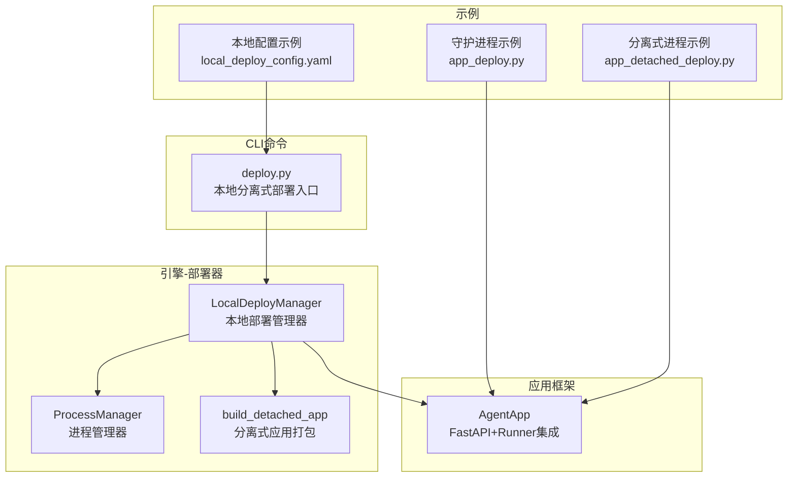
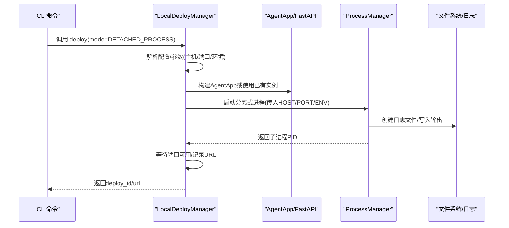
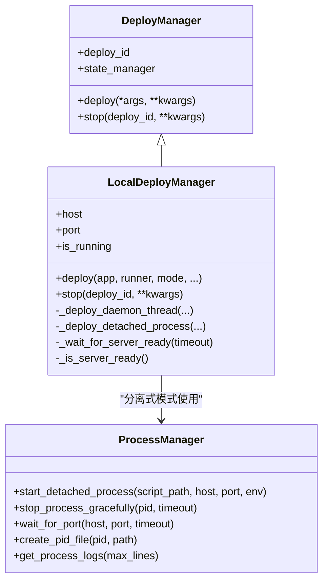
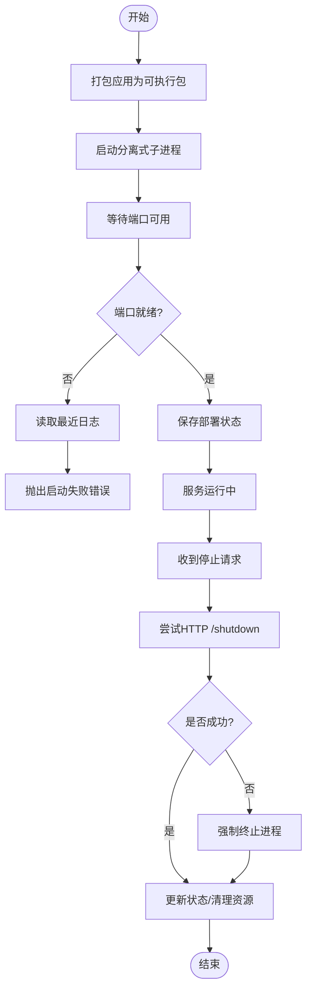
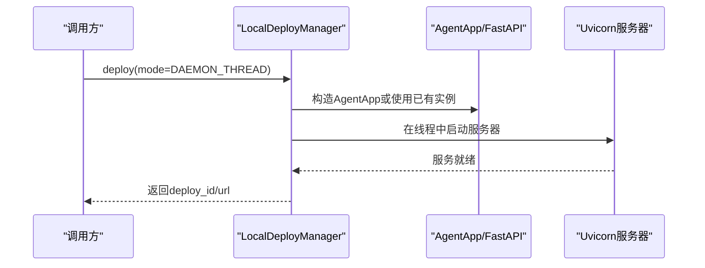
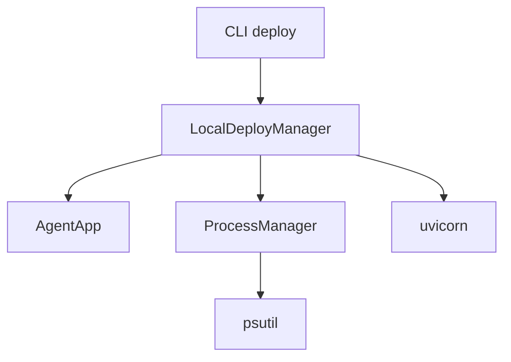

# 本地部署

<cite>
**本文引用的文件**
- [local_deployer.py](file://src/agentscope_runtime/engine/deployers/local_deployer.py)
- [process_manager.py](file://src/agentscope_runtime/engine/deployers/utils/service_utils/process_manager.py)
- [detached_app.py](file://src/agentscope_runtime/engine/deployers/utils/detached_app.py)
- [base.py](file://src/agentscope_runtime/engine/deployers/base.py)
- [agent_app.py](file://src/agentscope_runtime/engine/app/agent_app.py)
- [local_deploy_config.yaml](file://examples/deployments/local_deploy_config.yaml)
- [app_deploy.py](file://examples/deployments/daemon_local_deploy/app_deploy.py)
- [README.md（守护进程示例）](file://examples/deployments/daemon_local_deploy/README.md)
- [app_detached_deploy.py](file://examples/deployments/detached_local_deploy/app_detached_deploy.py)
- [app_agent.py](file://examples/deployments/detached_local_deploy/app_agent.py)
- [README.md（分离式进程示例）](file://examples/deployments/detached_local_deploy/README.md)
- [deploy.py](file://src/agentscope_runtime/cli/commands/deploy.py)
</cite>

## 目录
1. [简介](#简介)
2. [项目结构](#项目结构)
3. [核心组件](#核心组件)
4. [架构总览](#架构总览)
5. [详细组件分析](#详细组件分析)
6. [依赖分析](#依赖分析)
7. [性能考虑](#性能考虑)
8. [故障排查指南](#故障排查指南)
9. [结论](#结论)
10. [附录](#附录)

## 简介
本章节面向需要在本地快速部署 AgentScope Runtime 的用户，系统性讲解“本地部署”的工作原理、技术实现与配置方法。重点围绕 LocalDeployManager 类展开，覆盖其进程管理、端口分配、环境变量注入、资源清理等能力，并给出守护进程模式与分离式进程模式的完整部署流程、配置示例与最佳实践。

## 项目结构
本地部署相关代码主要位于引擎模块的 deployers 子包中，配合 AgentApp 应用框架与 CLI 命令完成从打包到运行的全链路能力。

图示来源
- [local_deployer.py:27-645](file://src/agentscope_runtime/engine/deployers/local_deployer.py#L27-L645)
- [process_manager.py:12-441](file://src/agentscope_runtime/engine/deployers/utils/service_utils/process_manager.py#L12-L441)
- [detached_app.py:40-143](file://src/agentscope_runtime/engine/deployers/utils/detached_app.py#L40-L143)
- [agent_app.py:60-200](file://src/agentscope_runtime/engine/app/agent_app.py#L60-L200)
- [deploy.py:359-434](file://src/agentscope_runtime/cli/commands/deploy.py#L359-L434)
- [app_deploy.py:122-129](file://examples/deployments/daemon_local_deploy/app_deploy.py#L122-L129)
- [app_detached_deploy.py:52-121](file://examples/deployments/detached_local_deploy/app_detached_deploy.py#L52-L121)
- [local_deploy_config.yaml:1-16](file://examples/deployments/local_deploy_config.yaml#L1-L16)

章节来源
- [local_deployer.py:27-645](file://src/agentscope_runtime/engine/deployers/local_deployer.py#L27-L645)
- [process_manager.py:12-441](file://src/agentscope_runtime/engine/deployers/utils/service_utils/process_manager.py#L12-L441)
- [detached_app.py:40-143](file://src/agentscope_runtime/engine/deployers/utils/detached_app.py#L40-L143)
- [agent_app.py:60-200](file://src/agentscope_runtime/engine/app/agent_app.py#L60-L200)
- [deploy.py:359-434](file://src/agentscope_runtime/cli/commands/deploy.py#L359-L434)
- [app_deploy.py:122-129](file://examples/deployments/daemon_local_deploy/app_deploy.py#L122-L129)
- [app_detached_deploy.py:52-121](file://examples/deployments/detached_local_deploy/app_detached_deploy.py#L52-L121)
- [local_deploy_config.yaml:1-16](file://examples/deployments/local_deploy_config.yaml#L1-L16)

## 核心组件
- LocalDeployManager：统一的本地部署管理器，支持守护进程模式与分离式进程模式，负责服务启动、停止、健康检查与状态持久化。
- ProcessManager：分离式进程生命周期管理，封装子进程启动、优雅停止、日志采集、端口等待、PID 文件管理等。
- build_detached_app：将 AgentApp 或 Runner 打包为可独立运行的应用包，生成入口脚本与依赖清单。
- AgentApp：基于 FastAPI 的统一应用框架，内置路由、中断、协议适配与任务队列支持。
- CLI deploy 命令：提供从源码或目录进行本地分离式部署的命令行入口，支持配置文件与环境变量合并。

章节来源
- [local_deployer.py:27-645](file://src/agentscope_runtime/engine/deployers/local_deployer.py#L27-L645)
- [process_manager.py:12-441](file://src/agentscope_runtime/engine/deployers/utils/service_utils/process_manager.py#L12-L441)
- [detached_app.py:40-143](file://src/agentscope_runtime/engine/deployers/utils/detached_app.py#L40-L143)
- [agent_app.py:60-200](file://src/agentscope_runtime/engine/app/agent_app.py#L60-L200)
- [deploy.py:359-434](file://src/agentscope_runtime/cli/commands/deploy.py#L359-L434)

## 架构总览
下图展示本地部署从 CLI 到应用、再到进程管理的整体调用链路。

图示来源
- [deploy.py:359-434](file://src/agentscope_runtime/cli/commands/deploy.py#L359-L434)
- [local_deployer.py:68-174](file://src/agentscope_runtime/engine/deployers/local_deployer.py#L68-L174)
- [process_manager.py:25-122](file://src/agentscope_runtime/engine/deployers/utils/service_utils/process_manager.py#L25-L122)

章节来源
- [deploy.py:359-434](file://src/agentscope_runtime/cli/commands/deploy.py#L359-L434)
- [local_deployer.py:68-174](file://src/agentscope_runtime/engine/deployers/local_deployer.py#L68-L174)
- [process_manager.py:25-122](file://src/agentscope_runtime/engine/deployers/utils/service_utils/process_manager.py#L25-L122)

## 详细组件分析

### LocalDeployManager 组件分析
- 角色定位：统一的本地部署入口，抽象出守护进程模式与分离式进程模式的差异，向上提供一致的 deploy/stop 接口。
- 关键职责
  - 守护进程模式：在当前线程内启动 uvicorn 服务器，绑定指定主机与端口；通过超时检测确保服务就绪；保存部署状态。
  - 分离式进程模式：打包应用为可执行包，注入 HOST/PORT 环境变量，启动独立子进程；等待端口可用；记录 PID/PID 文件；提供优雅停止与资源清理。
  - 进程管理：复用 ProcessManager 实现子进程生命周期管理与日志采集。
  - 状态管理：通过基类 DeployManager 提供的部署 ID 与状态管理器，持久化部署元数据（平台、URL、配置等）。
- 配置要点
  - 主机与端口：默认 127.0.0.1:8090，可通过构造函数或 CLI 参数覆盖。
  - 超时控制：启动超时与关闭超时可配置，默认值用于平衡稳定性与响应速度。
  - 协议适配与任务队列：支持 A2A/ResponseAPI 等协议适配器，以及 Celery 任务队列（Broker/Backend）。
  - 项目级部署：支持传入 project_dir 与 entrypoint，实现从目录或单文件进行分离式部署。
- 错误处理
  - 启动失败：收集子进程日志并抛出明确错误，便于定位。
  - 停止失败：优先尝试 HTTP /shutdown，失败则回退到直接进程终止与清理。
  - 端口检查：对 0.0.0.0/:: 绑定场景进行主机规范化，避免连接失败。

图示来源
- [base.py:9-44](file://src/agentscope_runtime/engine/deployers/base.py#L9-L44)
- [local_deployer.py:27-645](file://src/agentscope_runtime/engine/deployers/local_deployer.py#L27-L645)
- [process_manager.py:12-441](file://src/agentscope_runtime/engine/deployers/utils/service_utils/process_manager.py#L12-L441)

章节来源
- [base.py:9-44](file://src/agentscope_runtime/engine/deployers/base.py#L9-L44)
- [local_deployer.py:27-645](file://src/agentscope_runtime/engine/deployers/local_deployer.py#L27-L645)
- [process_manager.py:12-441](file://src/agentscope_runtime/engine/deployers/utils/service_utils/process_manager.py#L12-L441)

### 分离式进程模式流程
- 打包阶段：调用 build_detached_app 将 AgentApp/Runner 打包为可执行包，解压至临时目录，生成入口脚本与依赖清单。
- 启动阶段：ProcessManager 以新会话启动子进程，注入 HOST/PORT 环境变量，重定向标准输出/错误到日志文件。
- 就绪阶段：等待端口可用，若超时则读取最近日志并报错；成功后记录部署信息。
- 停止阶段：优先发送 HTTP /shutdown，失败则通过 psutil 终止进程并清理 PID 文件与日志。

图示来源
- [local_deployer.py:260-383](file://src/agentscope_runtime/engine/deployers/local_deployer.py#L260-L383)
- [process_manager.py:25-122](file://src/agentscope_runtime/engine/deployers/utils/service_utils/process_manager.py#L25-L122)
- [detached_app.py:40-143](file://src/agentscope_runtime/engine/deployers/utils/detached_app.py#L40-L143)

章节来源
- [local_deployer.py:260-383](file://src/agentscope_runtime/engine/deployers/local_deployer.py#L260-L383)
- [process_manager.py:25-122](file://src/agentscope_runtime/engine/deployers/utils/service_utils/process_manager.py#L25-L122)
- [detached_app.py:40-143](file://src/agentscope_runtime/engine/deployers/utils/detached_app.py#L40-L143)

### 守护进程模式流程
- 构建 AgentApp：若未提供则根据 Runner 创建；支持协议适配器、任务队列、嵌入式 Worker 等配置。
- 启动 uvicorn：在独立线程中运行，绑定 HOST/PORT；等待服务就绪。
- 记录状态：保存部署 ID、URL、配置等信息，标记为运行中。

图示来源
- [local_deployer.py:175-258](file://src/agentscope_runtime/engine/deployers/local_deployer.py#L175-L258)
- [agent_app.py:124-200](file://src/agentscope_runtime/engine/app/agent_app.py#L124-L200)

章节来源
- [local_deployer.py:175-258](file://src/agentscope_runtime/engine/deployers/local_deployer.py#L175-L258)
- [agent_app.py:124-200](file://src/agentscope_runtime/engine/app/agent_app.py#L124-L200)

## 依赖分析
- 组件耦合
  - LocalDeployManager 与 AgentApp 强耦合：通过统一的 FastAPI 架构实现多协议适配与端点扩展。
  - LocalDeployManager 与 ProcessManager 松耦合：仅在分离式模式下使用，便于替换或扩展。
  - CLI deploy 命令与 LocalDeployManager 弱耦合：通过参数解析与配置合并，最终委托给 LocalDeployManager。
- 外部依赖
  - uvicorn：异步 Web 服务器，支持守护进程模式。
  - psutil：进程查询、终止与资源统计。
  - requests：分离式模式下的 HTTP 停止接口调用。
  - redis/celery：任务队列与后台任务处理（可选）。

图示来源
- [local_deployer.py:12-25](file://src/agentscope_runtime/engine/deployers/local_deployer.py#L12-L25)
- [process_manager.py:9-12](file://src/agentscope_runtime/engine/deployers/utils/service_utils/process_manager.py#L9-L12)
- [deploy.py:359-434](file://src/agentscope_runtime/cli/commands/deploy.py#L359-L434)

章节来源
- [local_deployer.py:12-25](file://src/agentscope_runtime/engine/deployers/local_deployer.py#L12-L25)
- [process_manager.py:9-12](file://src/agentscope_runtime/engine/deployers/utils/service_utils/process_manager.py#L9-L12)
- [deploy.py:359-434](file://src/agentscope_runtime/cli/commands/deploy.py#L359-L434)

## 性能考虑
- 进程模型选择
  - 守护进程模式：与主进程共享内存与线程上下文，适合开发调试与低延迟交互。
  - 分离式进程模式：进程隔离带来更高稳定性，但存在额外的 IPC/网络开销。
- 资源限制
  - 通过环境变量与系统级 ulimit 控制子进程资源；必要时结合容器或 cgroup。
  - 日志轮转与清理：定期清理旧日志文件，避免磁盘占用过高。
- 并发与队列
  - 使用 Celery 任务队列处理长耗时任务，避免阻塞主线程。
- 端口与网络
  - 绑定 0.0.0.0 时需注意安全策略；生产环境建议使用反向代理与 TLS。

## 故障排查指南
- 启动失败
  - 检查端口占用：使用 lsof/netstat 查看端口占用情况，更换端口或释放占用。
  - 查看日志：分离式模式下查看 /tmp/agentscope_runtime_logs 下的日志文件；守护进程模式查看终端输出。
  - 环境变量：确认 API Key、Broker/Backend URL 等关键变量已正确注入。
- 停止失败
  - 分离式模式：若 HTTP /shutdown 不可用，使用 psutil 查询 PID 并手动终止；随后清理 PID 文件。
  - 守护进程模式：避免在测试环境中使用 HTTP 停止，推荐 Ctrl+C 或信号量停止。
- 状态不一致
  - 若状态管理器中缺少部署记录，可在停止时忽略状态更新并直接清理资源。

章节来源
- [README.md（守护进程示例）:180-206](file://examples/deployments/daemon_local_deploy/README.md#L180-L206)
- [README.md（分离式进程示例）:180-206](file://examples/deployments/detached_local_deploy/README.md#L180-L206)
- [process_manager.py:139-192](file://src/agentscope_runtime/engine/deployers/utils/service_utils/process_manager.py#L139-L192)
- [local_deployer.py:415-511](file://src/agentscope_runtime/engine/deployers/local_deployer.py#L415-L511)

## 结论
LocalDeployManager 为 AgentScope Runtime 提供了统一、可靠的本地部署能力，兼顾开发效率与生产可用性。通过守护进程模式与分离式进程模式的组合，既能满足快速迭代需求，也能满足单节点生产部署场景。建议在开发阶段优先使用守护进程模式，在需要独立生命周期与远程管理的场景使用分离式进程模式，并结合配置文件与 CLI 参数实现灵活的部署策略。

## 附录

### 配置文件示例与说明
- 本地部署配置文件示例展示了主机、端口与环境变量的设置方式，支持从环境变量模板注入敏感信息。
- CLI 命令支持从配置文件加载参数，并与命令行参数合并（命令行优先级更高）。

章节来源
- [local_deploy_config.yaml:1-16](file://examples/deployments/local_deploy_config.yaml#L1-L16)
- [deploy.py:372-398](file://src/agentscope_runtime/cli/commands/deploy.py#L372-L398)

### 部署流程步骤（分离式进程）
- 准备源码或目录：确保包含 AgentApp 定义与入口脚本。
- 加载配置：可选地从 YAML/JSON 配置文件加载 host/port/entrypoint/environment。
- 合并参数：CLI 参数覆盖配置文件中的同名项。
- 解析入口：若为目录，自动查找入口脚本；若为文件，直接使用。
- 调用部署：LocalDeployManager 以 DETACHED_PROCESS 模式启动服务。
- 验证与管理：通过 curl 或浏览器访问 /health 与各业务端点；必要时调用 /admin/shutdown 停止服务。

章节来源
- [deploy.py:359-434](file://src/agentscope_runtime/cli/commands/deploy.py#L359-L434)
- [app_detached_deploy.py:52-121](file://examples/deployments/detached_local_deploy/app_detached_deploy.py#L52-L121)
- [README.md（分离式进程示例）:28-43](file://examples/deployments/detached_local_deploy/README.md#L28-L43)

### 示例代码路径
- 守护进程模式示例：[app_deploy.py:122-129](file://examples/deployments/daemon_local_deploy/app_deploy.py#L122-L129)
- 分离式进程模式示例：[app_detached_deploy.py:52-121](file://examples/deployments/detached_local_deploy/app_detached_deploy.py#L52-L121)
- AgentApp 定义示例：[app_agent.py:15-87](file://examples/deployments/detached_local_deploy/app_agent.py#L15-L87)

### 最佳实践
- 开发阶段：使用守护进程模式，便于调试与热迭代。
- 生产阶段：使用分离式进程模式，便于进程监控与远程管理。
- 安全与合规：限制对外暴露的端口范围，启用反向代理与访问控制。
- 可观测性：开启详细日志与健康检查端点，结合外部监控系统。
- 资源规划：为子进程预留足够内存/CPU，避免与其他服务争抢资源。