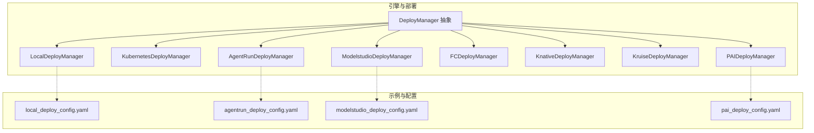
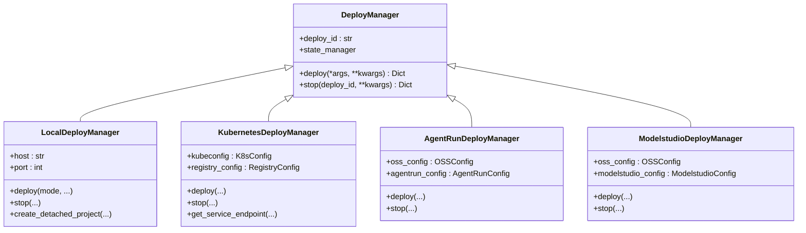
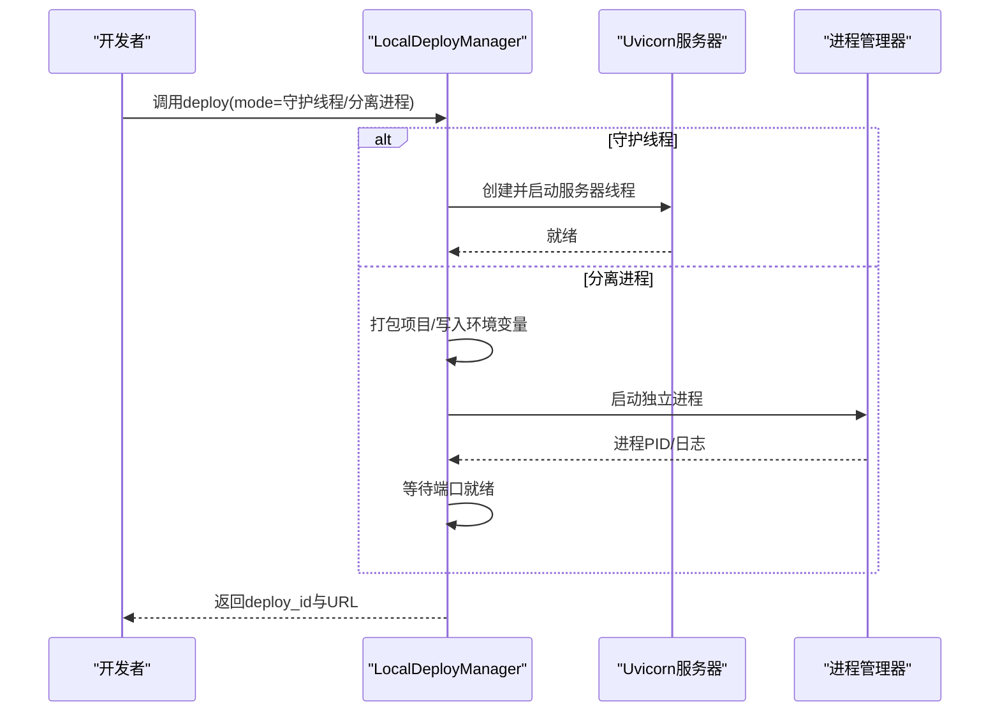
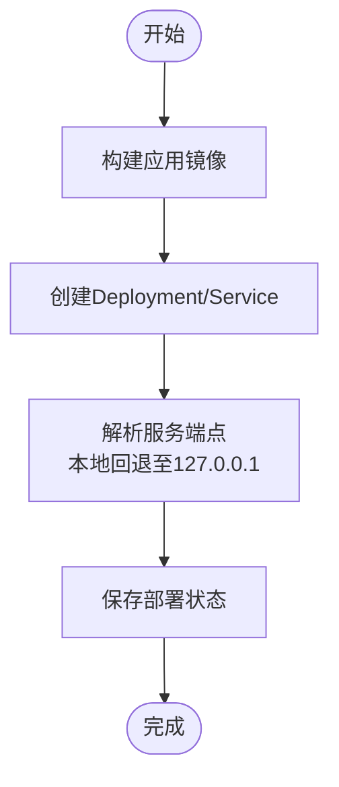
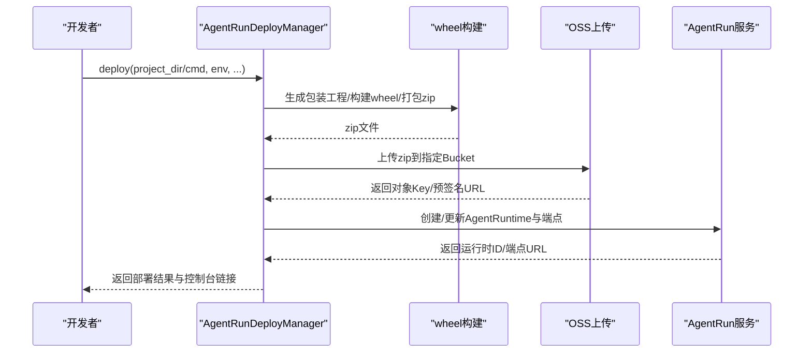
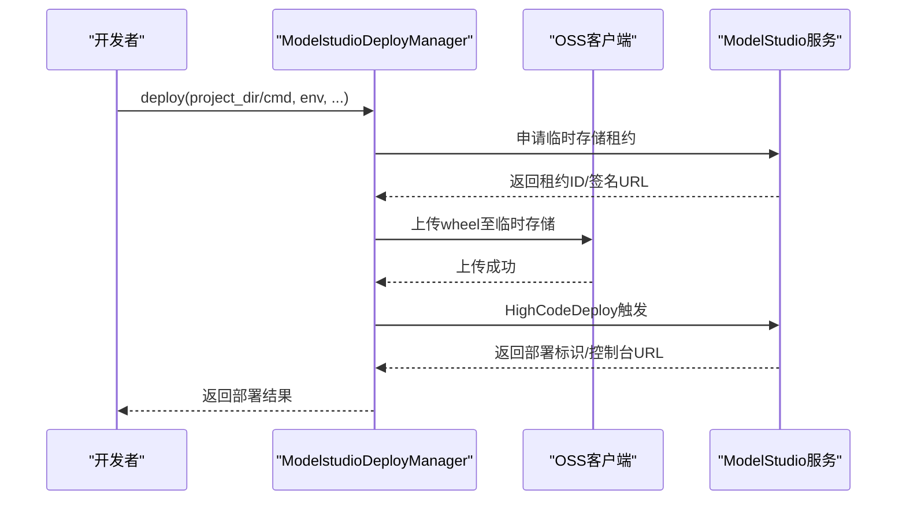
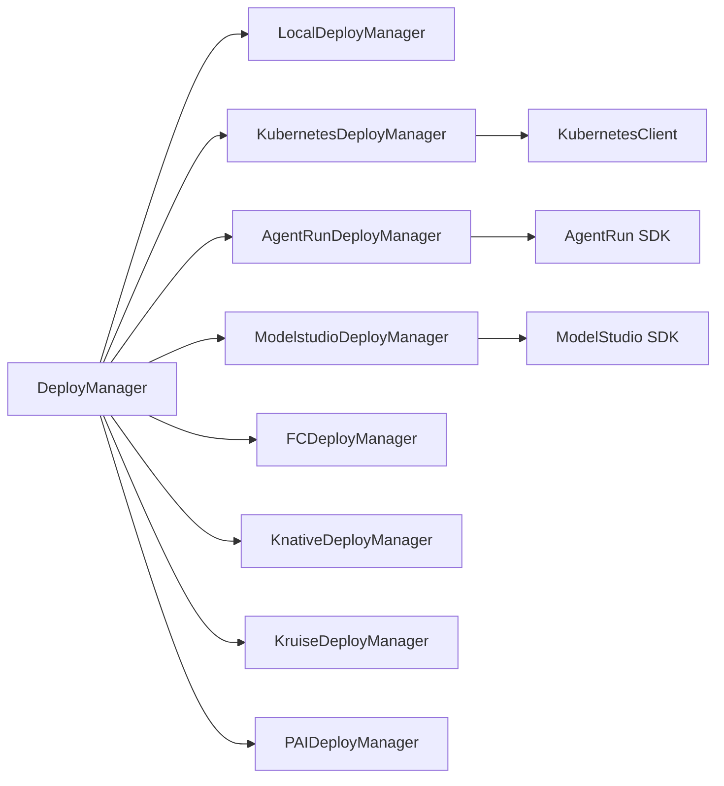

# 部署基础设施

<cite>
**本文引用的文件**
- [README.md](file://README.md)
- [deployment.md（中文）](file://cookbook/zh/deployment.md)
- [deployment.md（英文）](file://cookbook/en/deployment.md)
- [deployers/__init__.py](file://src/agentscope_runtime/engine/deployers/__init__.py)
- [deployers/base.py](file://src/agentscope_runtime/engine/deployers/base.py)
- [deployers/local_deployer.py](file://src/agentscope_runtime/engine/deployers/local_deployer.py)
- [deployers/kubernetes_deployer.py](file://src/agentscope_runtime/engine/deployers/kubernetes_deployer.py)
- [deployers/agentrun_deployer.py](file://src/agentscope_runtime/engine/deployers/agentrun_deployer.py)
- [deployers/modelstudio_deployer.py](file://src/agentscope_runtime/engine/deployers/modelstudio_deployer.py)
- [deployers/utils/deployment_modes.py](file://src/agentscope_runtime/engine/deployers/utils/deployment_modes.py)
- [examples/deployments/local_deploy_config.yaml](file://examples/deployments/local_deploy_config.yaml)
- [examples/deployments/agentrun_deploy_config.yaml](file://examples/deployments/agentrun_deploy_config.yaml)
- [examples/deployments/modelstudio_deploy_config.yaml](file://examples/deployments/modelstudio_deploy_config.yaml)
- [examples/deployments/pai_deploy_config.yaml](file://examples/deployments/pai_deploy_config.yaml)
</cite>

## 目录
1. [简介](#简介)
2. [项目结构](#项目结构)
3. [核心组件](#核心组件)
4. [架构总览](#架构总览)
5. [详细组件分析](#详细组件分析)
6. [依赖关系分析](#依赖关系分析)
7. [性能考量](#性能考量)
8. [故障排除指南](#故障排除指南)
9. [结论](#结论)
10. [附录](#附录)

## 简介
本文件面向AgentScope Runtime的部署基础设施，系统性阐述五种核心部署模式：本地部署、Kubernetes部署、AgentRun部署、Knative部署、Kruise部署、函数计算（Fc）部署、ModelStudio部署与PAI部署。文档覆盖技术实现原理、适用场景、配置参数、部署流程、架构图、环境要求、网络配置与故障排除，并提供可直接参考的示例路径与最佳实践建议，帮助读者在不同环境下做出正确的部署选择。

## 项目结构
AgentScope Runtime的部署能力集中在引擎模块的deployers包下，提供统一的DeployManager抽象与多种具体部署器实现；同时examples目录提供了各平台的配置示例与部署脚本，便于快速落地。

图表来源
- [deployers/__init__.py:1-52](file://src/agentscope_runtime/engine/deployers/__init__.py#L1-L52)
- [deployers/base.py:9-44](file://src/agentscope_runtime/engine/deployers/base.py#L9-L44)
- [examples/deployments/local_deploy_config.yaml:1-16](file://examples/deployments/local_deploy_config.yaml#L1-L16)
- [examples/deployments/agentrun_deploy_config.yaml:1-28](file://examples/deployments/agentrun_deploy_config.yaml#L1-L28)
- [examples/deployments/modelstudio_deploy_config.yaml:1-22](file://examples/deployments/modelstudio_deploy_config.yaml#L1-L22)
- [examples/deployments/pai_deploy_config.yaml:1-111](file://examples/deployments/pai_deploy_config.yaml#L1-L111)

章节来源
- [deployers/__init__.py:1-52](file://src/agentscope_runtime/engine/deployers/__init__.py#L1-L52)
- [README.md:538-618](file://README.md#L538-L618)

## 核心组件
- DeployManager抽象：定义统一的部署与停止接口，负责生成部署ID、保存部署状态、管理平台特定参数。
- 各类DeployManager实现：分别封装本地、K8s、AgentRun、ModelStudio、Knative、Kruise、Fc、PAI等平台的部署细节。
- 部署模式枚举：LocalDeployManager支持守护线程与分离进程两种模式，适配不同运行场景。
- 示例配置：提供各平台的最小可用配置模板，便于快速开始。

章节来源
- [deployers/base.py:9-44](file://src/agentscope_runtime/engine/deployers/base.py#L9-L44)
- [deployers/utils/deployment_modes.py:7-15](file://src/agentscope_runtime/engine/deployers/utils/deployment_modes.py#L7-L15)
- [deployers/local_deployer.py:27-645](file://src/agentscope_runtime/engine/deployers/local_deployer.py#L27-L645)

## 架构总览
AgentScope Runtime的部署架构以“统一抽象 + 平台适配器”的方式组织，所有DeployManager均继承自DeployManager，内部通过状态管理器持久化部署信息，并按平台特性调用相应客户端或SDK完成资源编排与发布。

图表来源
- [deployers/base.py:9-44](file://src/agentscope_runtime/engine/deployers/base.py#L9-L44)
- [deployers/local_deployer.py:27-645](file://src/agentscope_runtime/engine/deployers/local_deployer.py#L27-L645)
- [deployers/kubernetes_deployer.py:48-391](file://src/agentscope_runtime/engine/deployers/kubernetes_deployer.py#L48-L391)
- [deployers/agentrun_deployer.py:264-800](file://src/agentscope_runtime/engine/deployers/agentrun_deployer.py#L264-L800)
- [deployers/modelstudio_deployer.py:544-947](file://src/agentscope_runtime/engine/deployers/modelstudio_deployer.py#L544-L947)

## 详细组件分析

### 本地部署（Local）
- 技术原理
  - 支持两种模式：守护线程模式（在当前进程中启动Uvicorn服务器线程）与分离进程模式（打包项目后以独立进程运行，支持优雅停机与状态持久化）。
  - 分离进程模式通过构建打包工程、写入环境变量、启动进程并等待端口就绪，失败时输出日志辅助诊断。
- 适用场景
  - 开发测试、单机演示、低并发场景；需要快速验证AgentApp功能。
- 关键参数
  - 主机与端口、启动/关闭超时、响应类型（JSON/SSE/文本）、协议适配器、Celery Broker/Backend、是否启用嵌入式Worker等。
- 部署流程
  - 初始化LocalDeployManager → 选择模式 → 调用deploy → 访问服务URL → 可选：调用stop优雅停机。
- 网络与环境
  - 绑定地址与端口需确保未被占用；分离进程模式下可通过环境变量注入依赖与密钥。
- 故障排除
  - 端口占用：更换端口或释放占用进程。
  - 启动超时：检查依赖安装、镜像拉取、代理设置。
  - 分离进程未就绪：查看进程日志与PID文件，确认端口监听状态。

图表来源
- [deployers/local_deployer.py:68-174](file://src/agentscope_runtime/engine/deployers/local_deployer.py#L68-L174)
- [deployers/local_deployer.py:260-383](file://src/agentscope_runtime/engine/deployers/local_deployer.py#L260-L383)

章节来源
- [deployers/local_deployer.py:27-645](file://src/agentscope_runtime/engine/deployers/local_deployer.py#L27-L645)
- [deployers/utils/deployment_modes.py:7-15](file://src/agentscope_runtime/engine/deployers/utils/deployment_modes.py#L7-L15)
- [examples/deployments/local_deploy_config.yaml:1-16](file://examples/deployments/local_deploy_config.yaml#L1-L16)

### Kubernetes部署（K8s）
- 技术原理
  - 通过ImageFactory构建应用镜像，使用KubernetesClient创建Deployment与Service；自动处理外部IP与端口映射，兼容本地集群与云端环境。
  - 支持挂载目录、副本数、环境变量、运行时配置、缓存与镜像推送等。
- 适用场景
  - 生产级弹性伸缩、多副本高可用、CI/CD流水线集成。
- 关键参数
  - 命名空间、kubeconfig路径、镜像仓库配置、副本数、端口、环境变量、卷挂载、运行时配置、是否使用Deployment等。
- 部署流程
  - 构建镜像 → 创建Deployment与Service → 解析服务端点 → 保存部署状态。
- 网络与环境
  - 外部IP不可达时自动回退至本地回环地址；支持LoadBalancer/ClusterIP/NodePort等Service类型。
- 故障排除
  - 镜像构建失败：检查requirements、Dockerfile模板、镜像仓库凭据。
  - 资源创建失败：检查命名空间权限、RBAC策略、资源配额。
  - 服务不可达：确认Service类型与端口映射、Ingress/防火墙规则。

图表来源
- [deployers/kubernetes_deployer.py:126-312](file://src/agentscope_runtime/engine/deployers/kubernetes_deployer.py#L126-L312)
- [deployers/kubernetes_deployer.py:72-121](file://src/agentscope_runtime/engine/deployers/kubernetes_deployer.py#L72-L121)

章节来源
- [deployers/kubernetes_deployer.py:48-391](file://src/agentscope_runtime/engine/deployers/kubernetes_deployer.py#L48-L391)

### AgentRun部署
- 技术原理
  - 通过生成包装工程、构建wheel、在Docker容器内安装依赖并打包为zip，上传至OSS，再调用AgentRun API创建/更新运行时与端点。
  - 支持公网/专有网络模式、安全组/VPC配置、会话并发限制与空闲超时等运行参数。
- 适用场景
  - 阿里云生态内快速托管Agent服务，无需关心底层容器编排。
- 关键参数
  - OSS存储桶、AgentRun区域与凭据、网络模式与VPC配置、CPU/内存规格、会话并发与空闲超时等。
- 部署流程
  - 生成包装工程与wheel → Docker内依赖安装与zip打包 → 上传OSS → 调用AgentRun创建运行时与端点 → 保存部署状态。
- 网络与环境
  - 支持公网与VPC私网访问；需具备OSS写入权限与AgentRun访问权限。
- 故障排除
  - 依赖安装失败：检查wheel构建与Docker镜像可用性。
  - OSS上传失败：核对AK/SK、Bucket权限与签名URL有效期。
  - AgentRun创建失败：检查运行时参数、网络配置与控制台错误码。

图表来源
- [deployers/agentrun_deployer.py:521-733](file://src/agentscope_runtime/engine/deployers/agentrun_deployer.py#L521-L733)

章节来源
- [deployers/agentrun_deployer.py:264-800](file://src/agentscope_runtime/engine/deployers/agentrun_deployer.py#L264-L800)
- [examples/deployments/agentrun_deploy_config.yaml:1-28](file://examples/deployments/agentrun_deploy_config.yaml#L1-L28)

### ModelStudio部署
- 技术原理
  - 申请临时存储租约，获取预签名URL，上传wheel至OSS，调用ModelStudio HighCodeDeploy触发部署；支持Telemetry开关与工作区隔离。
- 适用场景
  - 快速在ModelStudio工作区内部署全量代码型Agent，适合内部研发与演示。
- 关键参数
  - OSS区域与凭据、ModelStudio工作区ID与服务端点、DashScope API Key等。
- 部署流程
  - 生成包装工程与wheel → 申请临时存储租约 → 上传wheel → 触发HighCodeDeploy → 保存部署状态。
- 网络与环境
  - 需要工作区权限与OSS写入权限；若无权限，按日志提示指引完成RAM授权。
- 故障排除
  - 无权限：按日志指引为RAM用户授予AliyunBailianDataFullAccess。
  - 上传失败：检查租约有效性与签名URL过期时间。

图表来源
- [deployers/modelstudio_deployer.py:727-800](file://src/agentscope_runtime/engine/deployers/modelstudio_deployer.py#L727-L800)
- [deployers/modelstudio_deployer.py:413-451](file://src/agentscope_runtime/engine/deployers/modelstudio_deployer.py#L413-L451)

章节来源
- [deployers/modelstudio_deployer.py:544-947](file://src/agentscope_runtime/engine/deployers/modelstudio_deployer.py#L544-L947)
- [examples/deployments/modelstudio_deploy_config.yaml:1-22](file://examples/deployments/modelstudio_deploy_config.yaml#L1-L22)

### Knative部署
- 技术原理
  - 基于Knative Serving实现事件驱动与自动扩缩容，结合Kubernetes部署器的镜像构建与Service创建能力，提供Serverless风格的弹性伸缩。
- 适用场景
  - 峰谷流量明显、按请求计费、需要自动扩缩容的Agent服务。
- 关键参数
  - 与K8s类似，额外关注Knative的Revision/Route配置与Autoscaling策略。
- 部署流程
  - 构建镜像 → 创建Knative Service → 自动暴露入口 → 保存部署状态。
- 网络与环境
  - 需要Knative Serving与Ingress控制器支持；注意冷启动延迟与扩缩容策略。

章节来源
- [deployers/__init__.py:18-31](file://src/agentscope_runtime/engine/deployers/__init__.py#L18-L31)

### Kruise部署
- 技术原理
  - 基于OpenKruise提供的增强Workload（如CloneSet、Advanced DaemonSet等），实现更精细的滚动更新、灰度发布与弹性扩缩容。
- 适用场景
  - 需要精细化更新策略与多版本并行的生产环境。
- 关键参数
  - 更新策略（滚动/蓝绿/金丝雀）、分区/权重配置、探活与就绪策略。
- 部署流程
  - 构建镜像 → 创建Kruise Workload → 配置更新策略 → 发布并观察状态。
- 网络与环境
  - 需要安装OpenKruise CRD与控制器；与K8s部署器共享镜像构建流程。

章节来源
- [deployers/__init__.py:18-31](file://src/agentscope_runtime/engine/deployers/__init__.py#L18-L31)

### 函数计算（Fc）部署
- 技术原理
  - 将Agent打包为zip并在Docker容器内安装依赖后上传至OSS，通过函数计算服务触发执行；适用于短时任务与事件驱动场景。
- 适用场景
  - 低延迟、按次计费、事件驱动的Agent片段或工具函数。
- 关键参数
  - 运行时环境、超时、内存、环境变量与OSS对象位置。
- 部署流程
  - 构建zip → 上传OSS → 创建/更新函数 → 配置触发器 → 测试调用。
- 网络与环境
  - 需要函数计算与OSS访问权限；注意冷启动与超时设置。

章节来源
- [deployers/__init__.py:18-31](file://src/agentscope_runtime/engine/deployers/__init__.py#L18-L31)

### PAI部署
- 技术原理
  - 通过PAI平台的EAS/Quota/Resource Pool进行资源分配与调度，支持VPC网络、RAM角色、标签管理与观测性配置。
- 适用场景
  - 企业内PAI平台统一纳管的Agent服务，强调合规与资源隔离。
- 关键参数
  - 工作区ID、区域、存储目录、实例数量、实例类型、VPC配置、RAM角色、标签等。
- 部署流程
  - 解析context/spec → 打包项目 → 上传至OSS → 调用PAI API创建服务 → 观察状态。
- 网络与环境
  - 需要PAI平台权限与VPC连通性；按需配置安全组与白名单。

章节来源
- [examples/deployments/pai_deploy_config.yaml:1-111](file://examples/deployments/pai_deploy_config.yaml#L1-L111)

## 依赖关系分析
- 组件耦合
  - DeployManager为所有部署器的统一抽象，降低上层调用复杂度。
  - 各部署器内部依赖平台SDK或客户端（如K8sClient、AgentRunClient、ModelStudioClient），并通过状态管理器持久化部署元数据。
- 外部依赖
  - K8s：需要kubectl/kubeconfig或集群内访问权限。
  - AgentRun/ModelStudio：需要阿里云AK/SK与对应服务端点。
  - Fc/PAI：需要相应平台的SDK与权限配置。
- 潜在循环依赖
  - 当前结构清晰，无显式循环依赖；注意避免在DeployManager中引入平台特有依赖。

图表来源
- [deployers/base.py:9-44](file://src/agentscope_runtime/engine/deployers/base.py#L9-L44)
- [deployers/kubernetes_deployer.py:67-70](file://src/agentscope_runtime/engine/deployers/kubernetes_deployer.py#L67-L70)
- [deployers/agentrun_deployer.py:316-331](file://src/agentscope_runtime/engine/deployers/agentrun_deployer.py#L316-L331)
- [deployers/modelstudio_deployer.py:33-47](file://src/agentscope_runtime/engine/deployers/modelstudio_deployer.py#L33-L47)

章节来源
- [deployers/__init__.py:18-51](file://src/agentscope_runtime/engine/deployers/__init__.py#L18-L51)

## 性能考量
- 启动与冷启动
  - 本地分离进程模式需等待端口就绪，建议合理设置启动超时；Knative/K8s在低负载时可能面临扩缩容延迟。
- 资源分配
  - AgentRun/PAI支持CPU/内存与实例数配置；K8s通过副本数与HPA实现弹性；Fc按请求动态分配资源。
- 网络与带宽
  - 上传镜像/zip至OSS可能成为瓶颈，建议使用内网或就近Region；ModelStudio临时租约上传需考虑带宽与并发。
- 观测性
  - 启用Telemetry与日志采集，结合平台自带监控与Tracing，提升问题定位效率。

## 故障排除指南
- 通用排查
  - 检查部署ID与状态：通过状态管理器查询部署详情与配置。
  - 查看日志：本地分离进程模式保留日志文件；K8s查看Pod日志与事件。
  - 网络连通：确认端点可达、防火墙放行、Ingress/LoadBalancer配置正确。
- 平台特定
  - K8s：镜像拉取失败、资源不足、Service未暴露；检查镜像仓库、节点资源与网络策略。
  - AgentRun：OSS上传失败、运行时创建失败；核对AK/SK、Bucket权限与运行时参数。
  - ModelStudio：无权限申请租约；按日志指引为RAM用户授予所需权限。
  - Fc/PAI：超时与冷启动；优化依赖安装与运行时配置。

章节来源
- [deployers/local_deployer.py:415-510](file://src/agentscope_runtime/engine/deployers/local_deployer.py#L415-L510)
- [deployers/kubernetes_deployer.py:313-376](file://src/agentscope_runtime/engine/deployers/kubernetes_deployer.py#L313-L376)
- [deployers/agentrun_deployer.py:730-733](file://src/agentscope_runtime/engine/deployers/agentrun_deployer.py#L730-L733)
- [deployers/modelstudio_deployer.py:397-410](file://src/agentscope_runtime/engine/deployers/modelstudio_deployer.py#L397-L410)

## 结论
AgentScope Runtime提供从本地到云原生、从传统容器到Serverless的全栈部署能力。选择部署模式时，应综合考虑目标平台生态、资源成本、弹性需求与运维复杂度。本地部署适合开发验证；K8s/AgentRun/ModelStudio适合生产托管；Knative/Kruise满足弹性与精细化更新；Fc/PAI适合事件驱动与企业平台集成。配合统一的DeployManager与状态管理，可实现一致化的部署体验与可观测性。

## 附录
- 快速开始
  - 本地部署示例与Response API兼容模式参见：[README.md:538-618](file://README.md#L538-L618)
  - 部署流程与前置条件参见：[deployment.md（中文）:1-73](file://cookbook/zh/deployment.md#L1-L73)、[deployment.md（英文）:1-72](file://cookbook/en/deployment.md#L1-L72)
- 配置示例
  - 本地：[local_deploy_config.yaml:1-16](file://examples/deployments/local_deploy_config.yaml#L1-L16)
  - AgentRun：[agentrun_deploy_config.yaml:1-28](file://examples/deployments/agentrun_deploy_config.yaml#L1-L28)
  - ModelStudio：[modelstudio_deploy_config.yaml:1-22](file://examples/deployments/modelstudio_deploy_config.yaml#L1-L22)
  - PAI：[pai_deploy_config.yaml:1-111](file://examples/deployments/pai_deploy_config.yaml#L1-L111)