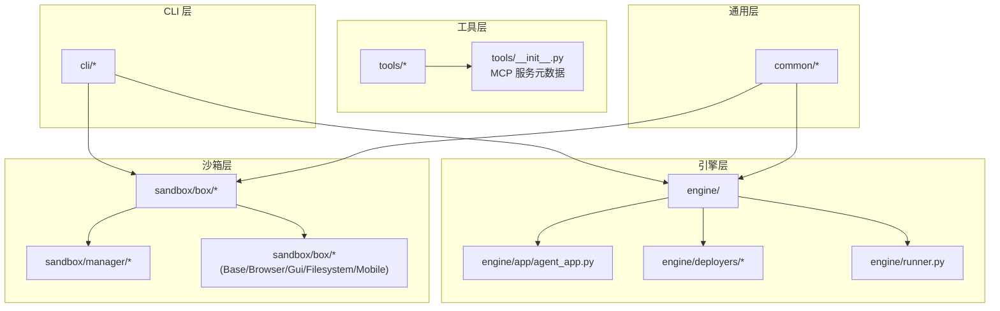
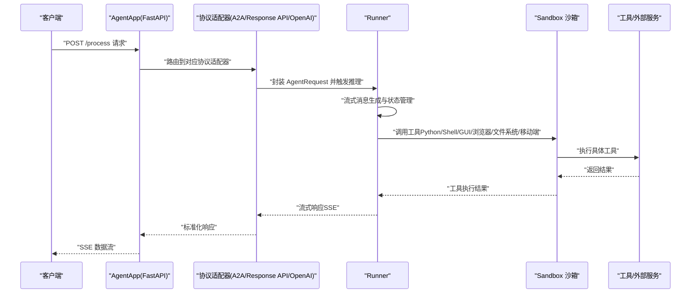
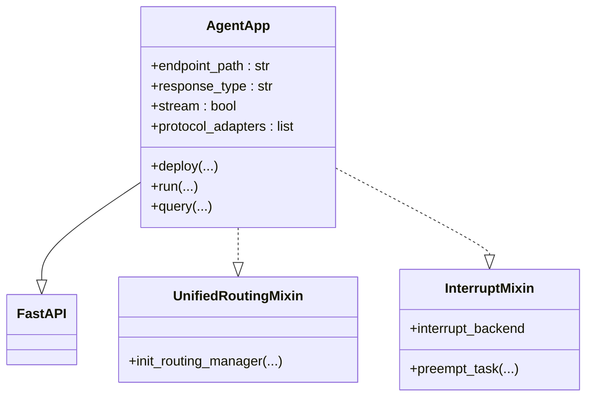
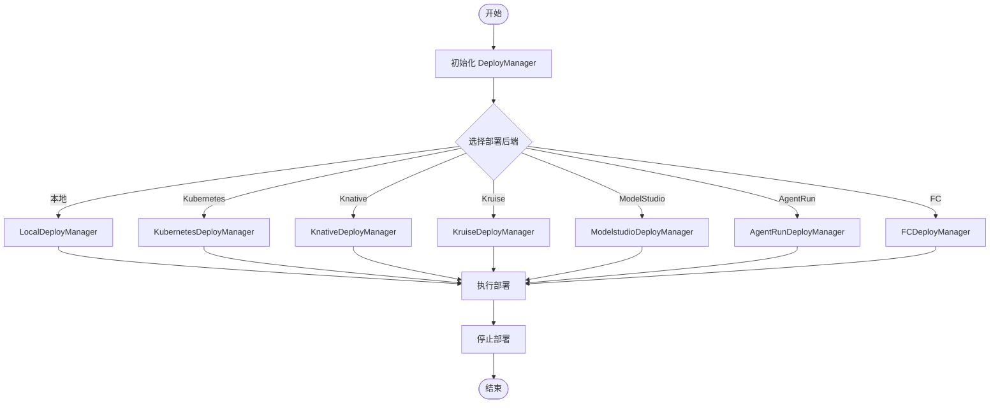
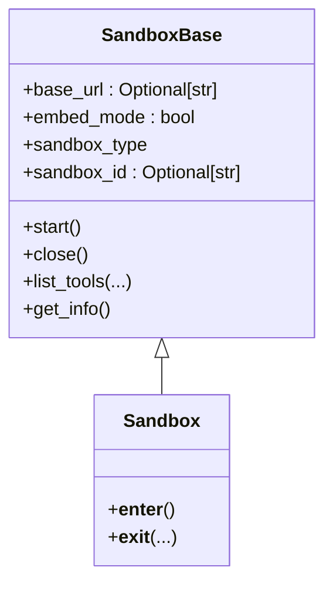
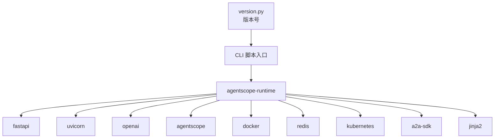

# 项目简介

<cite>
**本文引用的文件**
- [README.md](file://README.md)
- [README_zh.md](file://README_zh.md)
- [version.py](file://src/agentscope_runtime/version.py)
- [pyproject.toml](file://pyproject.toml)
- [agent_app.py](file://src/agentscope_runtime/engine/app/agent_app.py)
- [base.py](file://src/agentscope_runtime/engine/deployers/base.py)
- [sandbox.py](file://src/agentscope_runtime/sandbox/box/sandbox.py)
- [__init__.py](file://src/agentscope_runtime/__init__.py)
- [agentrun_deploy_config.yaml](file://examples/deployments/agentrun_deploy_config.yaml)
- [local_deploy_config.yaml](file://examples/deployments/local_deploy_config.yaml)
</cite>

## 目录
1. [引言](#引言)
2. [项目结构](#项目结构)
3. [核心组件](#核心组件)
4. [架构总览](#架构总览)
5. [详细组件分析](#详细组件分析)
6. [依赖关系分析](#依赖关系分析)
7. [性能考量](#性能考量)
8. [故障排查指南](#故障排查指南)
9. [结论](#结论)
10. [附录](#附录)

## 引言
AgentScope Runtime 是一个面向生产的智能体应用运行时框架，致力于提供安全的沙箱执行环境、可扩展的部署方案以及多框架兼容能力。其核心价值主张包括：
- 将智能体以“Agent 即服务（AaaS）”的形式对外提供，支持流式（SSE）输出，满足生产级 API 的可用性与可观测性需求
- 通过加固的沙箱隔离工具调用，保障系统安全与稳定性
- 支持本地、Kubernetes、Serverless 等多种部署形态，实现弹性扩缩容
- 与主流智能体框架兼容，降低迁移与集成成本

发展历程与版本演进要点：
- v1.0：发布统一的“Agent 作为 API”的白盒化开发体验，增强多智能体协作、状态持久化与跨框架集成
- v1.1.0：重构 AgentApp，采用直接继承 FastAPI 的设计，大幅提升生态兼容性；新增分布式任务中断服务，支持手动干预与灵活的状态保存/恢复

面向不同用户群体的价值说明：
- 开发者：通过 AgentApp 快速构建可流式输出的智能体 API，配合多框架适配器与工具集，加速原型与上线
- 运维人员：通过多种 DeployManager 实现本地/云端/Serverless 的弹性部署，结合可观测性与中断机制，保障服务稳定与可控
- 企业用户：在生产环境中以安全沙箱执行工具调用，结合多协议适配（A2A、Response API、OpenAI 兼容模式），实现跨系统的平滑对接

章节来源
- [README.md:28-46](file://README.md#L28-L46)
- [README_zh.md:28-46](file://README_zh.md#L28-L46)
- [README.md:78-83](file://README.md#L78-L83)
- [README_zh.md:78-83](file://README_zh.md#L78-L83)

## 项目结构
项目采用模块化分层组织，核心模块包括：
- engine：智能体应用引擎与部署管理，提供 AgentApp、Runner、DeployManager 等
- sandbox：沙箱体系，覆盖基础、GUI、浏览器、文件系统、移动端等多种沙箱类型
- tools：工具集与 MCP 服务元数据，提供图像生成、视频生成、语音识别/合成、搜索等能力
- cli：统一命令行入口，提供生命周期管理与部署辅助
- common：通用工具与懒加载机制
- examples：部署示例与配置样例

图表来源
- [agent_app.py:60-200](file://src/agentscope_runtime/engine/app/agent_app.py#L60-L200)
- [base.py:9-44](file://src/agentscope_runtime/engine/deployers/base.py#L9-L44)
- [sandbox.py:18-200](file://src/agentscope_runtime/sandbox/box/sandbox.py#L18-L200)
- [tools/__init__.py:65-120](file://src/agentscope_runtime/tools/__init__.py#L65-L120)

章节来源
- [pyproject.toml:1-104](file://pyproject.toml#L1-L104)

## 核心组件
- AgentApp：基于 FastAPI 的智能体应用容器，支持多协议适配（A2A、Response API、OpenAI 兼容模式），内置流式输出与生命周期管理
- DeployManager：统一的部署管理接口，支持本地、Kubernetes、Knative、Kruise、ModelStudio、AgentRun、FC 等多种后端
- Sandbox：多类型沙箱（基础、GUI、浏览器、文件系统、移动端、训练、云、AgentBay），提供隔离的工具执行环境
- Runner：智能体推理与消息流处理的核心执行器
- Tools：丰富的工具集合与 MCP 服务元数据，覆盖图像/视频生成、语音识别/合成、搜索等

章节来源
- [agent_app.py:124-200](file://src/agentscope_runtime/engine/app/agent_app.py#L124-L200)
- [base.py:9-44](file://src/agentscope_runtime/engine/deployers/base.py#L9-L44)
- [sandbox.py:18-200](file://src/agentscope_runtime/sandbox/box/sandbox.py#L18-L200)
- [tools/__init__.py:65-120](file://src/agentscope_runtime/tools/__init__.py#L65-L120)

## 架构总览
AgentScope Runtime 的整体架构围绕“智能体应用 + 多协议适配 + 沙箱执行 + 多部署后端”的闭环展开。下图展示了从客户端请求到智能体推理再到工具执行的关键流程。

图表来源
- [agent_app.py:60-200](file://src/agentscope_runtime/engine/app/agent_app.py#L60-L200)
- [sandbox.py:148-200](file://src/agentscope_runtime/sandbox/box/sandbox.py#L148-L200)

章节来源
- [README.md:109-140](file://README.md#L109-L140)
- [README_zh.md:110-141](file://README_zh.md#L110-L141)

## 详细组件分析

### AgentApp 组件分析
- 设计要点：直接继承 FastAPI，无缝接入 FastAPI 生态；支持多协议适配器注入；内置生命周期管理与流式输出
- 关键能力：
  - 多协议适配：A2A、Response API、OpenAI 兼容模式
  - 流式输出：SSE 格式的消息流，便于前端实时渲染
  - 中断机制：分布式任务中断服务，支持手动干预与状态保存/恢复
- 使用场景：快速构建可流式输出的智能体 API，支持多框架适配与生产级部署

图表来源
- [agent_app.py:60-200](file://src/agentscope_runtime/engine/app/agent_app.py#L60-L200)

章节来源
- [agent_app.py:124-200](file://src/agentscope_runtime/engine/app/agent_app.py#L124-L200)
- [README.md:78-83](file://README.md#L78-L83)
- [README_zh.md:78-83](file://README_zh.md#L78-L83)

### DeployManager 组件分析
- 设计要点：抽象部署接口，屏蔽平台差异；统一部署/停止流程与状态管理
- 支持后端：本地、Kubernetes、Knative、Kruise、ModelStudio、AgentRun、FC 等
- 配置示例：提供 YAML 配置样例，便于快速部署

图表来源
- [base.py:9-44](file://src/agentscope_runtime/engine/deployers/base.py#L9-L44)
- [agentrun_deploy_config.yaml:1-28](file://examples/deployments/agentrun_deploy_config.yaml#L1-L28)
- [local_deploy_config.yaml:1-16](file://examples/deployments/local_deploy_config.yaml#L1-L16)

章节来源
- [base.py:9-44](file://src/agentscope_runtime/engine/deployers/base.py#L9-L44)
- [agentrun_deploy_config.yaml:1-28](file://examples/deployments/agentrun_deploy_config.yaml#L1-L28)
- [local_deploy_config.yaml:1-16](file://examples/deployments/local_deploy_config.yaml#L1-L16)

### Sandbox 组件分析
- 设计要点：统一的沙箱基类，支持嵌入式与远程两种模式；提供文件系统挂载、信号处理与资源清理
- 类型覆盖：基础、GUI、浏览器、文件系统、移动端、训练、云、AgentBay 等
- 安全性：通过容器化与隔离策略，保障工具执行的安全性与稳定性

图表来源
- [sandbox.py:18-200](file://src/agentscope_runtime/sandbox/box/sandbox.py#L18-L200)

章节来源
- [sandbox.py:18-200](file://src/agentscope_runtime/sandbox/box/sandbox.py#L18-L200)
- [README.md:272-478](file://README.md#L272-L478)
- [README_zh.md:273-540](file://README_zh.md#L273-L540)

### Tools 与 MCP 服务元数据
- 设计要点：通过工具基类与 MCP 元数据，统一工具注册与服务编排
- 能力覆盖：图像生成/编辑、视频生成、语音识别/合成、搜索等
- 集成方式：与 AgentScope 等框架的工具适配器配合，实现一键适配

章节来源
- [tools/__init__.py:65-120](file://src/agentscope_runtime/tools/__init__.py#L65-L120)

## 依赖关系分析
- 版本与脚本：项目版本由 version.py 统一管理，CLI 提供多个可执行入口（agentscope、runtime-sandbox-* 等）
- 依赖清单：核心依赖包括 FastAPI、Uvicorn、OpenAI SDK、Agentscope、Docker、Redis、Kubernetes 客户端、A2A SDK、Jinja2 等
- 可选扩展：提供 dev 与 ext 两套可选依赖，覆盖测试、文档、多框架（LangChain、LangGraph、AutoGen、Agno 等）与云服务集成

图表来源
- [version.py:1-3](file://src/agentscope_runtime/version.py#L1-L3)
- [pyproject.toml:1-104](file://pyproject.toml#L1-L104)

章节来源
- [version.py:1-3](file://src/agentscope_runtime/version.py#L1-L3)
- [pyproject.toml:1-104](file://pyproject.toml#L1-L104)

## 性能考量
- 流式输出：SSE 流式响应降低首字节延迟，提升用户体验
- 并发与异步：v1.1.0 引入异步沙箱实现，支持非阻塞并发工具执行，提升吞吐
- 部署弹性：支持本地、Kubernetes、Serverless 等部署形态，按需弹性扩缩容
- 观测性：内置日志与链路追踪，便于定位性能瓶颈与异常

章节来源
- [README.md:80-83](file://README.md#L80-L83)
- [README_zh.md:80-83](file://README_zh.md#L80-L83)

## 故障排查指南
- 沙箱启动失败：检查镜像拉取、容器后端（Docker/gVisor/BoxLite/FC/K8s）配置与权限
- 部署异常：确认 DeployManager 参数（host、port、entrypoint、环境变量）与目标平台配置一致
- 流式输出中断：检查 AgentApp 生命周期钩子与中断机制配置
- 日志与追踪：通过内置日志与追踪模块定位问题根因

章节来源
- [README.md:272-478](file://README.md#L272-L478)
- [README_zh.md:273-540](file://README_zh.md#L273-L540)

## 结论
AgentScope Runtime 以“安全沙箱 + AaaS + 多框架兼容 + 可扩展部署”为核心，为开发者、运维与企业用户提供从原型到生产的全链路支撑。随着 v1.1.0 的发布，其在生态兼容性、中断控制与并发执行方面取得重要进展，适合在生产环境中稳定落地。

## 附录
- 快速开始与示例：参考 README 中的安装、Agent App 示例、沙箱示例与部署示例
- 部署配置：参考 examples/deployments 下的 YAML 配置样例
- 版本信息：当前版本号由 version.py 统一管理

章节来源
- [README.md:109-140](file://README.md#L109-L140)
- [README_zh.md:110-141](file://README_zh.md#L110-L141)
- [agentrun_deploy_config.yaml:1-28](file://examples/deployments/agentrun_deploy_config.yaml#L1-L28)
- [local_deploy_config.yaml:1-16](file://examples/deployments/local_deploy_config.yaml#L1-L16)
- [version.py:1-3](file://src/agentscope_runtime/version.py#L1-L3)